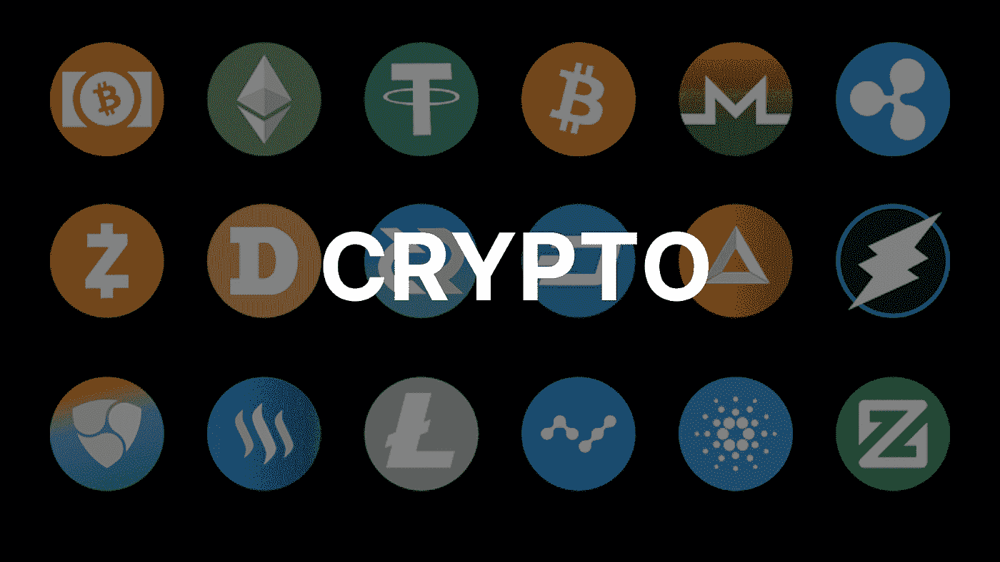
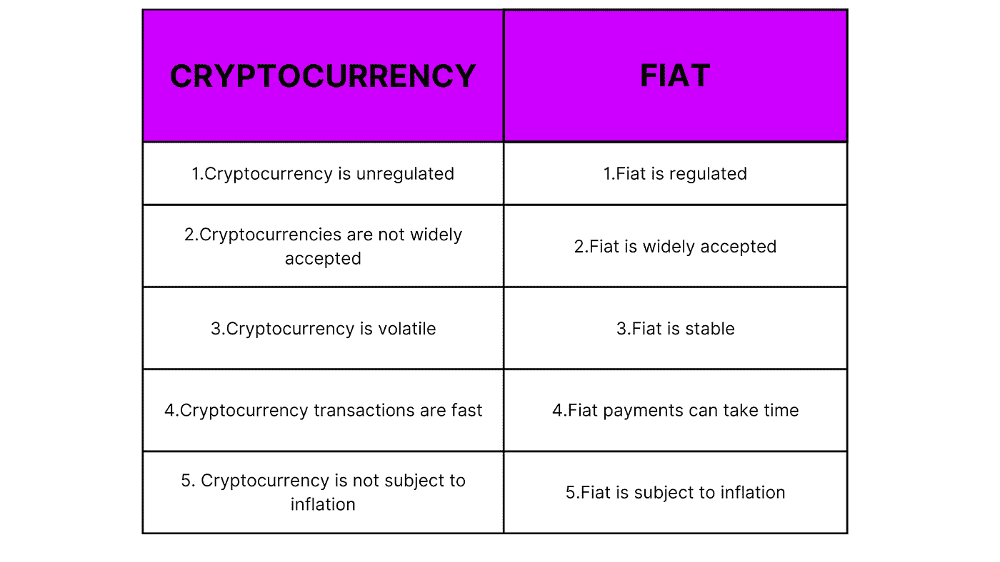

# 菲亚特 Vs 加密:你需要知道的一切

> 原文：<https://medium.com/coinmonks/fiat-vs-crypto-everything-you-need-to-know-c82dd9b25010?source=collection_archive---------43----------------------->

阅读了解如何将您的法定货币转换为加密货币

如果你是一名投资者，正在考虑将加密货币作为分散投资组合的一种方式，那么理解法定货币和加密货币之间的区别很重要。此外，你需要什么是最好的方法来转换菲亚特加密。在本文中，我们将帮助您了解两者之间的区别，以及如何将 fiat 转换为 crypto，反之亦然。

# 什么是法定货币？

法定货币是一种政府宣布为法定货币的货币，但它没有实物商品作为支持。例如，美元和欧元是法定货币，因为它们没有任何实物商品如黄金或白银的支持，没有人可以随意生产它们(就像政府生产纸币一样)。

法定货币是由中央银行发行的，中央银行创造新的货币单位，然后通过税收(或者有时只是印刷更多)将其分发给人们。然后，政府可以通过对商品和服务征收销售税，或者对经营出租车、公共汽车等业务所需的执照或许可证收费，对这些新创造的货币征税，使其重新进入流通领域。，它将支出保持在合理的范围内，这样当太多的现金进入流通领域而没有被投入到建设房屋或维修路边等生产活动中时，就不会发生通货膨胀！

法定货币最常见的例子是美元、英镑和欧元；这些都是[法定货币，因为它们的价值完全基于对你们国家政治体系的信任](https://corporatefinanceinstitute.com/resources/knowledge/economics/how-is-currency-valued/#:~:text=Summary,currency%20is%20through%20exchange%20rates.)——换句话说，你对我们政府履行承诺的能力有多信任，这些硬币会随着时间的推移保持多少价值。

Photo credit: Photo by [Unsplash](https://unsplash.com/)

# 什么是加密货币？

加密货币是一种数字资产，这意味着它不受中央机构的控制。它是分散的，分布在网络的所有用户中。加密货币可以像任何其他形式的货币一样使用——购买商品和服务，进行支付，以及以各种方式交换所有权。

加密货币是通过挖掘(使用计算机解决复杂数学难题的过程)创造出来的。用于解决这些难题的算法被称为[工作证明](https://www.investopedia.com/terms/p/proof-work.asp#:~:text=Proof%20of%20work%20(PoW)%20describes,launching%20denial%20of%20service%20attacks.) (PoW)，它需要强大的计算能力来验证网络上的交易，并跟踪在任何给定时间谁拥有多少数量的流通硬币。

Photo credit: Photo by [Unsplash](https://unsplash.com/)

# 加密货币的历史

加密货币的历史很长，比特币是第一种也是最知名的加密货币。比特币由中本聪于 2009 年创造，是第一种使用区块链存储交易数据的去中心化数字货币。它还解决了[的双重支出问题](https://www.investopedia.com/terms/d/doublespending.asp#:~:text=Double%2Dspending%20is%20the%20risk,alteration%20can%20reclaim%20spent%20coins.)，这使得它比任何其他类型的支付系统都更安全。

如果你想了解更多关于加密货币的工作原理或它们是否适合你，我们建议查看我们在[最常见加密问题上的帖子！](/@alpynelabs/new-to-crypto-these-are-the-answers-to-your-top-10-questions-f842b0553233)

# 菲亚特与 Crypto——一目了然！

# 如何将菲亚特转换为密码

如果你想把法定货币转换成加密货币，最简单的方法是通过加密交易所。有许多选择，但只有少数几个是值得信赖的，足以被大多数人使用。你可以阅读我们关于印度顶级加密交易所的帖子。要开始使用这些平台，您需要:

*   这些平台之一的帐户
*   存放您的加密资产的钱包地址

我们 Alpyne Labs 拥有入口和出口工具，通过我们的用户友好界面，您可以在几秒钟内将 INR 转换为 USDT。

# 结论

菲亚特 vs. Crypto 是一个复杂的话题，但他们都是钱，他们有许多相似之处。他们的不同之处在于他们的目标:法定货币旨在成为现实世界的货币，而加密货币旨在成为世界上最安全的数字货币。这两种形式的金钱在今天的社会中相互竞争，所以我们必须了解每种类型是如何工作的，然后再决定哪种对我们个人或企业最有利！

阅读我们的更多内容:-

 [## 加密货币投资初学者指南

medium.com](/@alpynelabs/a-beginners-guide-to-cryptocurrency-investing-c4083285da3f)  [## 什么是 Stablecoin 密码？

### 你想有一个安全且波动较小的投资吗？那么 Stablecoins 是你最好的选择。了解更多信息…

medium.com](/coinmonks/what-is-stablecoin-crypto-4d7f4aabced2) 

> 加入 Coinmonks [电报频道](https://t.me/coincodecap)和 [Youtube 频道](https://www.youtube.com/c/coinmonks/videos)了解加密交易和投资

# 另外，阅读

*   [加密货币储蓄账户](/coinmonks/cryptocurrency-savings-accounts-be3bc0feffbf) | [YoBit 审核](/coinmonks/yobit-review-175464162c62)
*   [Botsfolio vs nap bots vs Mudrex](/coinmonks/botsfolio-vs-napbots-vs-mudrex-c81344970c02)|[gate . io 交流回顾](/coinmonks/gate-io-exchange-review-61bf87b7078f)
*   [CoinFLEX 评论](https://coincodecap.com/coinflex-review) | [AEX 交易所评论](https://coincodecap.com/aex-exchange-review) | [UPbit 评论](https://coincodecap.com/upbit-review)
*   [AscendEx 保证金交易](https://coincodecap.com/ascendex-margin-trading) | [Bitfinex 赌注](https://coincodecap.com/bitfinex-staking) | [bitFlyer 点评](https://coincodecap.com/bitflyer-review)
*   [Bitget 回顾](https://coincodecap.com/bitget-review)|[Gemini vs block fi](https://coincodecap.com/gemini-vs-blockfi)cmd |[OKEx 期货交易](https://coincodecap.com/okex-futures-trading)