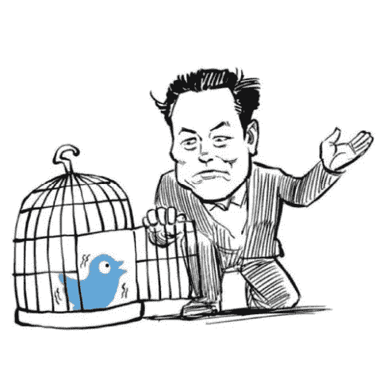
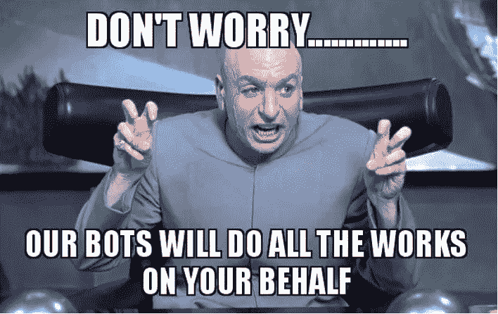
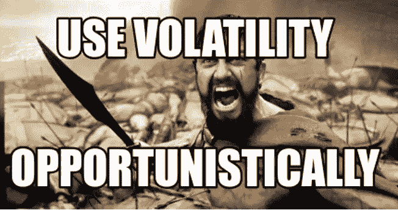
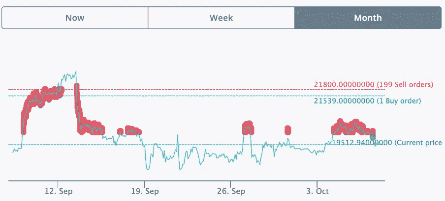
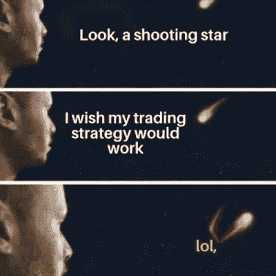

# 在 Rektember 与 Septembear 战斗

> 原文：<https://medium.com/coinmonks/fighting-the-septembear-in-rektember-9c9ca4d33a70?source=collection_archive---------5----------------------->

我最近和一位在社交媒体行业工作的朋友共进晚餐，我们讨论了 Twitter 在确认可货币化的每日活跃用户数量方面的最大失败。

我的朋友对这门学科有透彻的了解。我离开晚餐时感到高兴，不仅是因为美味的火锅和在一起度过的时间，还因为我成功下载了他大脑的一些部分，特别是与识别实际活跃用户相关的细微差别和困难。

TLDR；这里最大的问题是确定什么定义一个机器人帐户。如果这一点得到明确确立和认可，埃隆·马斯克早就把这只鸟关进笼子了。然而，很明显，这是说起来容易做起来难。

我们都在某种程度上使用机器人，无论是为了炒作商品，演唱会门票，还是在地下城升级等。就我个人而言，我从小就是一个机器人爱好者，但我会把我在地牢里囚禁我的刺客的细节告诉你。机器人的使用让我们的生活变得更好，但这让我思考:根据埃隆·马斯克的定义，我的账户也属于机器人账户类别吗？

不管怎样，这和这个月的话题有什么关系，对抗九月战争。交易机器人，尤其是电网交易机器人，一直是我目前的困扰。

以下是我的观点，我希望它能给你一些启示和鼓励，让你开始探索 crypto 和 DeFi，它可能什么都不是。

我如此沉迷于把钱投入工作的幻想，以至于我总是在尝试新的策略。最让我兴奋的是我的电子表格中的“月亮数学”,它转化为获得巨大回报的可能性。感觉就像有能力像世界各地的政府一样印钞。然而，一切并不像看起来那么简单，非财务建议，等等。

以前，我不时使用网格交易机器人，但由于个人风险管理原因和交易所交易费用，我没有充分发挥它们的潜力。然而，随着我们进入零费用交易时代，并陷入熊市的深渊，现在是启动电网的最佳时机。我们知道加密货币是不稳定的，因此，我们应该采取策略从中获利。

这类似于我早期的一篇文章，我在其中讨论了 Uniswap 如何为我提供每日剂量的多巴胺。这是为了满足我对即时满足的渴望，同时将这些短期收益融入我的长期投资组合。运用好的策略进行网格交易的回报就像服用了兴奋剂一样。

网格交易是一种量化交易策略，通过使用机器人在交易所自动买卖资产。机器人在价格范围内以预定的时间间隔在交易所下单。基于现货价格的上升和下降，订单网格逐渐生成。当现货价格超出设定的价格范围时，它将停止下单。因此，如果你希望机器人尽可能长时间有效，以获得最大回报，选择一个合适的范围是至关重要的。

总而言之，我们的目标是不断地低买高卖，以便从微小的价格波动中获利，但因为人类的身体速度不够快，无法手动执行订单，所以我们依赖于机器人。

**我个人迄今为止最好的熊市网格策略:**

交易对:BTC/BUSD——0%交易费

价格区间:2 万美元至 2.18 万美元

网格数量:201

Rektember 最佳日匹配的卖单数量:2，280

每日年利率:0.51% /年利率:185%

****免责声明:***

*1。185%的年利率是使用最佳日假设计算的*

*2。上述 APR 没有考虑从 BTC 的实际成本到从第一个电网销售订单到最终电网的利润(估计+5%)*

这个交易设置是基于这样一个事实，我愿意以目前的价格 DCA BTC，但我不认为 BTC 会很快登上月球。我购买的一部分被分配给网格策略，目的是逐渐增加投资组合的规模。

我认为这可以通过将我的 BTC 转移到 FTX 并交易期货而不是现货来推动，因为 FTX 的现货存款有 8%的 APY 和一些资金回报率。但是，用现货做抵押品交易期货，本来就有风险；比如现货价格跌到抵押品不足的地步，就有平仓的可能。

请在评论中分享你的想法。

挑选特定的硬币/代币并确定顶部和底部的时间并不适合每个人，包括我自己。我不喜欢那种希望奇迹/祈祷我的投资按照我想要的方式进行的感觉。因此，在“赚钱”中喜欢使用工具。

想了解更多，了解更多，或者想让我揭秘我的“月亮数学”，请联系我。

感谢阅读，敬请关注更多 DeFi 内容！

作为我的新年决心的一部分，我将分享我在 crypto 的经历，以讲述由我工作中的朋友& crypto OGs 激发的更好的故事。

*免费加密&股票连同推荐一起启动你的旅程:*[*https://docs . Google . com/spreadsheets/d/1 f2bx-xkvmezorxdzqavgckina 1 PME _ uI9pa _ c4l 4-DM/edit？usp =共享*](https://docs.google.com/spreadsheets/d/1f2bX-xKvmEzOrxDZqAvgCkIna1pmE_uI9pa_C4l4-DM/edit?usp=sharing)

> 交易新手？试试[加密交易机器人](/coinmonks/crypto-trading-bot-c2ffce8acb2a)或者[复制交易](/coinmonks/top-10-crypto-copy-trading-platforms-for-beginners-d0c37c7d698c)