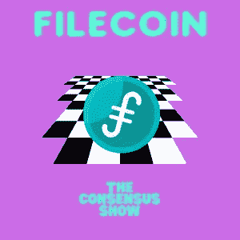

# Filecoin —完整概述

> 原文：<https://medium.com/coinmonks/filecoin-complete-overview-206a9a0fe8c4?source=collection_archive---------13----------------------->

欢迎来到共识秀，在这里我将介绍世界上最流行的加密货币，并为您提供公正的信息，帮助您达成自己的共识。这不是理财建议。

[For the best Crypto News in the world, visit TheCoinSphere.com](http://thecoinsphere.com/)

Filecoin 是一个分散的存储网络，使用同名的加密货币来促进交易。它是由 Protocol Labs 创建的，Protocol Labs 是一个研究、开发和部署实验室，致力于…