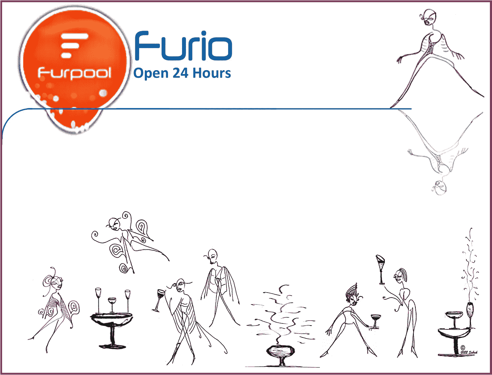
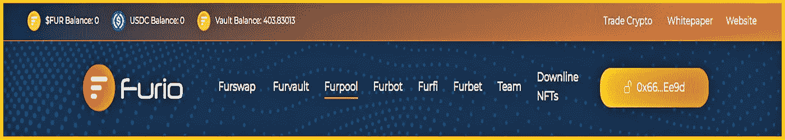
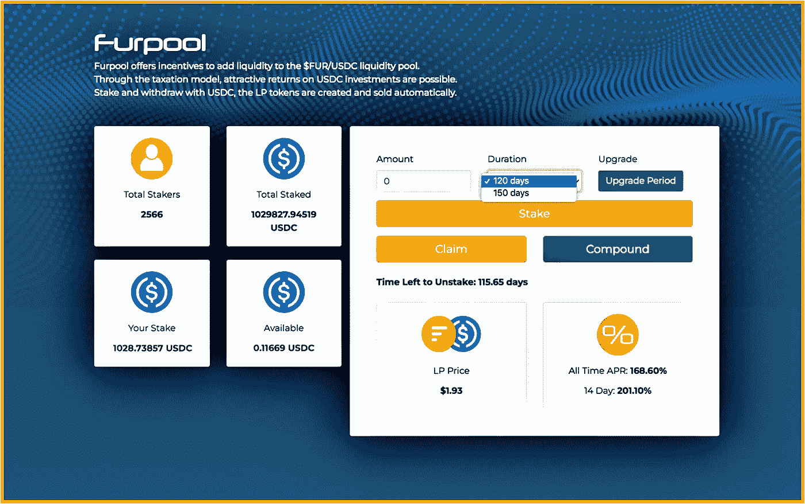
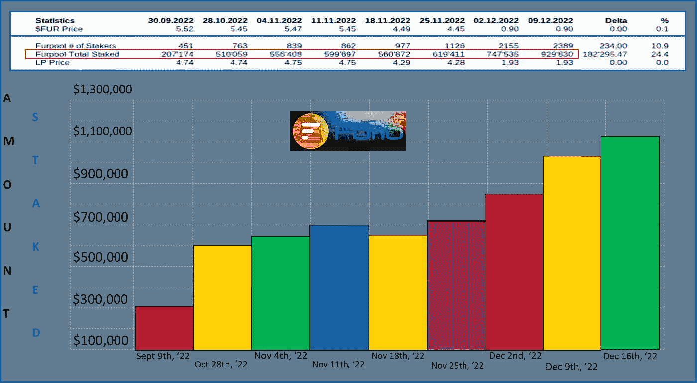
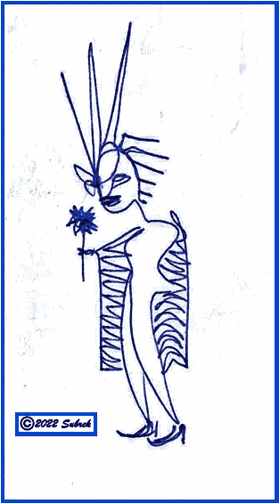

# 最后潜入(毛皮)池:

> 原文：<https://medium.com/coinmonks/finally-diving-into-the-fur-pool-aafa3a257df1?source=collection_archive---------0----------------------->

## 在 Furio 的表象之下，还有比每日投资回报率更多的东西…

Looks like fun. Now investing into the **Furpool**, I plan to stay awhile…

> “我怎么能在这里赢呢？”
> 
> **“很简单:早点进场，拿到你的利润&滚蛋！”~来自一款** [**早已销声匿迹的 ROI Miner**](/coinmonks/defi-fear-factor-cf076f1a577c) **游戏。**

我很早就以此为座右铭——追逐快速/高风险的回报，我失去了很多秘密。像许多人一样，我最初进入这个领域是因为 crypto 非常有趣，当然是为了赚快钱。😅

***我也和许多人一样，认为迅速收回我最初的投资回报是最重要的事情。***

不再有…

> 有趣的是，这不是我们投资菲亚特的方式。在 crypto 之外，我每年把我的 401K 投资到一个个人退休账户(IRA)，让他们几十年不动这笔钱。

**为什么 DeFi 要不同**？显然，我们都在寻找具有长期回报的可持续 DeFi 项目——原生令牌的大量实际用例总是一个很好的起点——但我想我们都怀疑这些独角兽是否存在，只是还没有…

## 江山易改，本性难移

因此，当去年夏天推出 Furio 生态系统时，由于高风险的 2.5%日投资回报率 dApp，fur vault T21 对我来说是一大吸引力。

**这正是其他所有那些** [**网络赌博协议**](/coinmonks/bastards-in-this-defi-space-c5d487ff89ab) **所关注的。我当时的态度仍然是:跳进去，抓住我的首字母+，然后准备在船沉之前跳下去。**

**我又错了**:在 **Furio 不可能玩那些泵、转储&跑的游戏。**众多因素‘鼓励’(**迫使**)投资者投资，这是对项目寿命的尊重。我只能在给定的时间内提取这么多，从而为所有人延长生态系统的寿命——同时也漂亮地让我的最终回报有机增长。

感谢 **Furio 开发团队** ( [FDT](/@furiocrypto) )的评论:

> “只有当人们能够摆脱这样的思维模式时，加密金融才有未来:‘好吧，如果它能持续 3 个月，我就能拿回我的钱，这就是结果。’人们应该考虑项目的潜在可持续性&议程，参与者的可见性&跟踪记录。

我相信 **Furio** 是不一样的。有如此多的投资方式&在这个平台上赚取惊人的回报，没有理由再回到旧的、*“上车，拿个快袋&下车！”习惯。那已经成为过去了...*

**

*“Thank you for taking my order: Please start at **Furswap** & send $1000 into the **Furvault** for breakfast. Then please deposit the leftovers into the **Furpool LP** for a delicious meal later on…Yes, thx for asking—we’ll surely want to purchase some glazed **Furbots** to take with us. And I can’t forget: we’ll definitely be back in January for the **FurFi** token — then of course there’s April for **FurMax**! Thx again for all your help. Happy compounding!” (~not said ever by [James Corden](https://www.standard.co.uk/video/news/james-corden-explains-what-happened-at-balthazar-b1035192.html).)*

*甚至在最近，FDT 也引进了一些新的投资机会。上面是 UI 仪表盘，显示了当前的投资选项: **Furvault** ， **Furpool** ， **Furbot & Furfinance** 。*

## *《复仇女神》讲述了许多事情…*

*这里有一个:当我每天在 **Furvault** 中复合我的投资，或者购买一个 **Furbot** (我拥有 1！)，或者从我的一个 **Furio 钱包**中通过 **Furpool** 向$FUR-USDC LP 提供流动性，或者投资即将推出的 **FurFi** token，我正在朝着所谓的 **MaxPayout** 前进。*

****什么是 MaxPayout？*** 这里有一个快速的 [MaxP 可持续发展特性](/coinmonks/furios-satisfying-logan-s-run-feature-ca0a4baea1b1)回顾；然后回来。*

## ***全额支付:***

> ***“Furio 让你在 4-&-半月内轻松将 1，000 美元变成 27，777 美元，然后在你的>**22k 免费****神奇的互联网货币*****上获得 168.60%的额外年利率，LMS 稳定价格约为 1 美元/FUR。两年后——一旦浮利欧全部付清——你将获得超过 10 万美元的毛皮收益，年回报率约为 168.60%。****

***我计算了一下，在支付个人所得税之后——一旦 Furio 完全付清——我的手里可以拿着大约 8 万美元——每个钱包。😅***

## ***注意:一个钱包…***

> *****上述 80，000 美元到 100，000 美元的支出仅为一个 Furio 钱包/账户的估计值。*****

*****向上扩展:**如果我拥有更多怎么办？如果有条理，这可能是一份相当容易的兼职工作。我目前有 15 个 Furio 钱包。这是一个快速旅程:***

*** [## 钱包 101:浮利欧投资者的多钱包入门

### 通过一个提供商组合 10 多个钱包是关键

medium.com](/coinmonks/wallets-101-a-multi-wallet-primer-for-furio-investors-21042d2a7c51) 

> 一些人有更多的钱包，通过这个项目，创造了更多的机会。
> 
> 一个人对 Furio 生态系统的复杂性了解得越多，这里讨论的一些途径就越看起来几乎是直观的——就像打开许多钱包。

或者，潜入**泳池** …*** 

## ***所有人都到池子里去！***

***在打开一些钱包&为我的账户创造了 2.5%的持续日收益流后，我现在拿出一部分钱投资到 **Furpool** ，这是 **Furio 的 LP 项目。*****

***投资于 **Furpool** &为$FUR token 提供流动性可能是一项有价值的服务——流动性有助于保持加密世界的运转。**原因如下:*****

> *****复利是金库的关键，而流动性是金库的润滑剂……*****

*****什么是 Furio 的 Furpool LP** ？我喜欢这个快速 LP 定义:***

> ******“想象一下在快餐店里等着点菜。流动性相当于有很多收银员。这将加快订单和交易的速度，让客户满意。另一方面，流动性差相当于只有一个收银员，却有一长串顾客。这将导致订单减少，交易变慢，让顾客不高兴。~***[***Coindesk.com***](https://www.coindesk.com/learn/what-are-liquidity-pools/)***。******

***所以，通过投资 Furpool，我可以说是给一家繁忙的商店增加了更多的收银员，可以说是为了让事情顺利进行…***

## ***我如何受益？***

> ******“一个典型的流动性池激励&奖励其用户押注其数字资产。奖励的形式可以是*** 加密奖励 ***或来自其资产汇集交易所的交易费 ***的一部分。~再次，***[***coin desk***](https://www.coindesk.com/learn/what-are-liquidity-pools/)***。*********

*****Furio 的 Furpool** 提供了这两种好处:**赌注奖励&交易费** …***

## ***方法如下:***

1.  *****赌注奖励**。每天，奖励池将支付奖励池总价值的 2.5%。这是按照我在 24 小时内持有的 LP 份额的比例支付的。***
2.  *****交易奖励**。每次有人存款或取款，都会收取一部分交易费&与所有有限合伙人分享；我是其中之一。LP 代币代表整个$FUR-USDC 流动性池的一部分，因此交易越多，通过 LP 代币支付给我的相应金额就越多。***

*****更多…赌注奖励提升:**2.5%按比例分配给 Furpool LP 控股公司；但是，我也可以提高我的份额。***

***如果我决定承诺一段时间以上的每日提款权，我将收到以下提高我的 LP 持有量:***

*   ***30 天: **2% LP 提升*****
*   ***60 天: **5% LP 提升*****
*   ***90 天: **10%低压增压*****
*   ***120 天: **15%低压增压*****
*   ***150 天: **20%低压增压*****

***例如，如果我持有 **10 个 Furpool LP 代币**&3 个月，我的每日奖励池份额将提升至 **11 个 Furpool LP 代币**。请看下面 UI 中**持续时间**下的例子，如果分别押 120 天或 150 天，我可以选择增加 15-20%的奖励。***

******

***Happy Million Dollars Staked! **The Furpool just topped $1,000,000 earlier this week.** As the Liquidity Provider expands, there’s always more room in the pool…***

***以上是 **Furpool** 的 UI/仪表盘。请注意，**总赌注**现已超过＄1，029，827。自从我开始观察以来，我一直在观察它的增长——但突破百万美元大关是非常值得注意的。***

*****168.60%的一生平均 APR 太棒了&201%的最后 14 天让我笑了。*****

***一位[投资者朋友](/@michaeldavidfoster)在讨论多个钱包时，想到了一个完美的 **Furpool** 声明，下面用粗体显示:***

> ***“在一个钱包中获得最大支付额，就更有理由在另一个钱包中获得最大支付额，因为你在矿坑中的位置已经为你提供了这么多资金支持。(我要补充的是，这也是可复合的！) **Furpool 是最容易、最简单的 LP 令牌对/池，使用起来更简单，复合性更低&回报非常高！”*****

## ***神话般的 Furpool 事实:***

***每周 **Furio 更新**的一个好去处是 [Joe @ digital-coins](/@digital-coins-net) 。他一直在记录今年秋天《万物复苏》的涨跌(主要是涨跌)&我期待着他的每周更新&评论。下面是上周更新的 Furpool 部分。我冒昧地将 Joe 的 **Furpool Total Staked** 数字——在顶部，红色矩形——表示成一个图表，如下所示。***

******

***What’s to discuss? The **Amount Staked vs Fall Almost-Weekly Timeframe** graph speaks for itself…Note that there is a month-&-a-half difference between the 1st bar (red) on Sept 9th, & the 2nd bar (orange) for Oct 28th; subsequent bars all represent one-week intervals — thx [Joe](https://digital-coins-net.medium.com/)!***

## *****浮利欧的 Furpool 很吸引人:*****

***9 月份 **451 桩**在**浮利欧池**中；一个月后， **763 涉**。一晃一个半月过去了，&股权数量增加了两倍多，12 月中旬有超过 **2600 名股东，**仅在**池**中就持有**超过 100 万美元的总锁定价值**。***

*****最后说明:**很明显， **Furio** 涉及到一个 ***时间***2 年以上的投资，看你的承受力。当然，如果你已经走了这么远，你知道:***

> ***Furio 不是一个快速致富的计划——它是一个需要几年时间才能做得很好的项目；坚持是成功的关键。***

***我鼓励人们阅读这个项目，因为它非常酷:已经有几十篇 Medium.com 的文章被写出来，通过官方的白皮书[es primero，&了解 Furio 的基本](https://furio.io/whitepaper)[基础也是关键。](/@jebalukas/discovering-furios-fundamentals-6724b1728a7c)***

***在北半球西部，这可能是一个寒冷的冬天——然而，浮利欧投资池现在看起来相当温暖&诱人。我想我会呆一段时间…***

*****感谢走到这一步。我希望你能在这篇关于我们生活的疯狂的密码世界的评论文章中找到一些有价值的东西。我不是理财顾问，所以请不要考虑这个理财建议；我只是喜欢研究投资智能加密项目…*****

****如果你喜欢这次谈话，*👉 ***跟着*******拍手👏*******共享*** 👐*它！******

****我鼓励朋友们只玩你不需要的东西。又是 Thx。****

******

***Shameless Plug…***

## *****不要脸的塞:*****

*****感谢您和我一起参加这次谈话。**我正在记录我进入 [**Furio 投资**](https://app.furio.io/?ref=0x024ee915c2BF9d12F98b750119051A752e18CAa0) 项目的漫长旅程。很高兴有你跟随冒险…***

## ***投资 Furio***

***参与者可以从平台的 [**交换页面**](https://app.furio.io/team/0x024ee915c2BF9d12F98b750119051A752e18CAa0) 购买$FUR。要向 Furvault 存款，您需要通过将现有投资者的推荐/钱包地址添加到好友推荐系统中来手动加入。***

******注意:如果伙伴/推荐行留空，则推荐奖励将由顶部的开发团队获得。我非常尊重他们，我确信他们很高兴收到这份礼物；不过，我打赌他们得到了很多。与此同时…******

****通过我的推荐链接投资该项目将提供一点补偿，&这是让我知道这些对话是有益的极好方式。* ***很荣幸成为你的哥们……******

## ***我的 [Furio](https://app.furio.io/?ref=0x024ee915c2BF9d12F98b750119051A752e18CAa0) 好友地址是:***

***[0x 024 ee 915 C2 BF 9d 12 f 98 b 750119051 a 752 e 18 CAA 0](https://app.furio.io/?ref=0x024ee915c2BF9d12F98b750119051A752e18CAa0)***

***Jebalukas 团队是强大的隐孢子虫树的一个健康的小分支，在阳光下快乐地成长和繁荣…***

*****更多 Furio 信息**？下面是一篇关于用有限的资金投资 Furio 的文章…***

*** [## 有限的资金:一个浮利欧投资者的百万美元被动收入路线图

### 优化我的投资…

medium.com](/@jebalukas/with-limited-funds-one-furio-investors-million-dollar-passive-income-roadmap-6387f42006eb) 

再次感谢阅读…*** 

***另一个朋友在任何东西上画画——信封、收据&任何有表面的东西。我称之为他的账本系列。他在池边的顶部图像上涂了墨水…下面是另一个例子…***

******

***Winter Flower…***

> ***交易新手？尝试[加密交易机器人](/coinmonks/crypto-trading-bot-c2ffce8acb2a)或[复制交易](/coinmonks/top-10-crypto-copy-trading-platforms-for-beginners-d0c37c7d698c)***