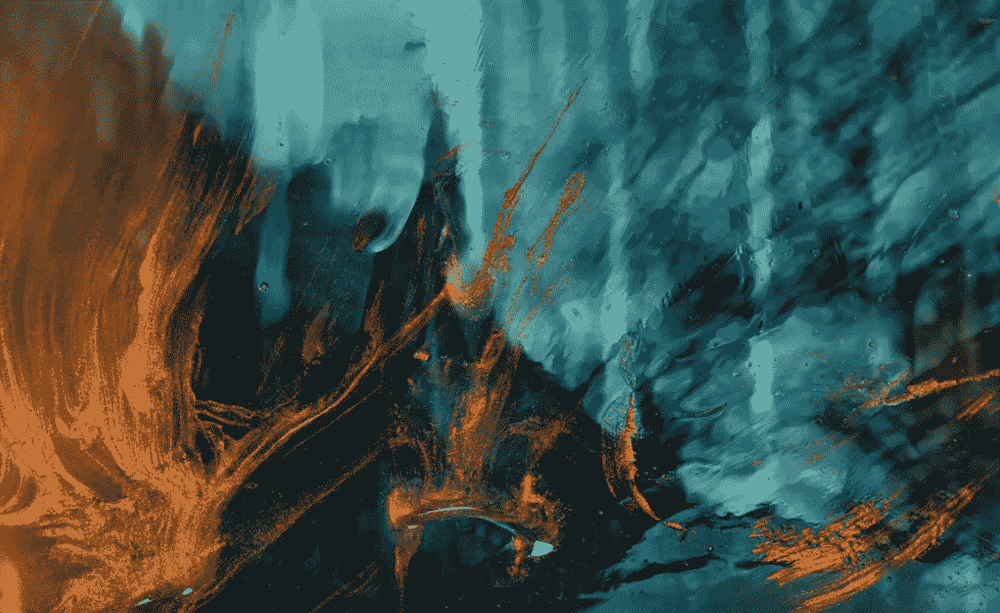

# 火与冰——在市场下跌时，利用流动性和流动性来获利

> 原文：<https://medium.com/coinmonks/fire-ice-using-liquity-to-profit-off-stablecoins-and-liquidations-during-a-market-drop-fdf4d0006339?source=collection_archive---------4----------------------->

嘿，伙计们，如果你像我一样一直在关注加密 twitter，你可能已经从无数人那里听说过对即将到来的市场崩盘有很多预期。无论是下周还是明年初，许多人都在呼吁低价位再跌 30-40%，比特币可能至少跌至 14k 区间。对于那些已经变得越来越不利于风险的人， [Liquity](https://www.liquity.org/) 一直在优化方法，以便人们能够继续从这两种清算中获利，也可以通过他们的本地稳定货币 LUSD 获利。

我在过去写过几次关于 liquiy[的文章](/coinmonks/utilizing-lusd-chicken-bonds-to-earn-60-apy-off-of-stables-49c1b9538be)，随着几个月前他们的[动态小鸡债券 NFTs](https://www.chickenbonds.org/) 的推出，它们本质上是一种 DeFi 市场效率建设工具，允许 liquiy 稳定其流动性，同时通过自动复合他们从$LUSD 的回报而使 NFT 持有者受益。稍后我会更详细地介绍这一点，但首先让我们快速回顾一下 Liquity 的宝藏以及它最初是如何开始产生收入的…

# 从清算中获利:

Liquity 允许人们以非常低的利率进行抵押贷款。一旦他们选择了一个流动性前端，潜在的借款人可以创建一个“流动性宝库”，然后存入他们的$ETH 并以此为抵押借入$LUSD。Liquity 的文件建议你至少保持 150%以上的比率，但协议规定的最低比率是 110%。换句话说，如果$ETH 价格大幅下跌，抵押品比率降至 110%以下，那么你就有被清算的风险。最酷的是，你可以实时看到所有的宝藏(发帖时有 841 个)以及它们离清算还有多远:

**#Realyield** —一旦发生清算，来自清算的奖励将给予 Liquity 稳定池中的赌注者。每次出现重大的$ETH 崩溃，你都会看到稳定池得到很好的回报，有时收益接近 [700% APR](https://dune.com/dani/Liquity) :

目前坐在一个超过 10%的滚动 7 天移动平均线，忽略所有其他因素，如果你的唯一策略是在稳定池中下注$LUSD，你仍然可以以相对非常低的风险获得相当不错的回报。

**为什么 Liquity 对借款人有吸引力:**即使在不利的市场条件下，Liquity 仍能吸引如此多的借款人的主要原因是其贷款结构:

除了 0.5%的一次性借款费用和可退还的 200 美元清算准备金存款，借款人可以非常便宜地借入美元 LUSD，然后用这笔流动性做各种事情，包括将其投入美元 LUSD 稳定池，或用它购买鸡债券。

# 从稳定的收入中获利:

我已经提到，你可以从$LUSD 稳定池中获得相当大的回报，但在过去的几个月里，Liquity 团队也推出了他们的动态小鸡债券 NFT，提供了**原则保护**的机会，以赚取稳定债券的自动复利回报。相比之下，如果你将$LUSD 直接投入$LUSD 稳定池，而不是赚取$LUSD，你将赚取$LQTY 和$ETH 作为利息——让你接触替代硬币而不是稳定。

**小鸡债券是如何运作的？:**简而言之(双关语),小鸡债券 NFT 代表了所有者对其债券 LUSD 金额的要求。当您第一次存款时，您会收到一个鸡蛋形式的 NFT:

一旦一个人创造了鸡债券，所有者开始积累$bLUSD(提高了$LUSD ),以鸡蛋 NFT 为代表的所有权证明。从那里他们有三个选择:

**保持再结合**——你可以永远不断地出售你积累的$bLUSD(或只是持有)。

**Chicken In**——在你应该盈利的时候，你可以要求你的债券，本质上是获得你在债券期间积累的$bLUSD。在这种情况下，你的 NFT 变成了一只成年鸡:

**临阵脱逃** —如果你没有/不能等到鸡蛋成熟，你可以“临阵脱逃”，本质上是放弃你迄今为止赚到的$bLUSD，并保留你投入的所有初始资本(因此它是本金受保护的)。在这种情况下，你的 NFT 变成了一只逃跑的小鸡:

你能获得什么样的回报？:你可以赚取的利息有点难以计算，因为$bLUSD 的收益率会根据你等待的时间长短而有很大差异。

从上图中可以看出，收益率起初相对较高，但随着达到$bLUSD 上限，收益率将大幅下降。Twitter 上的其他报道展示了一个更现实的例子，说明收益率是如何支付的:

在一般意义上，由于您的债券$LUSD 是自动复利和“收益率放大”，与鸡债券相比，您可以放心，您将获得比直接押注于$LUSD 稳定池更多的利息。此外，如果你对$bLUSD 游戏本身更感兴趣，我建议你留意一下小鸡债券的统计数据，这些数据可以在 [Liquity.app 的债券页面](https://liquity.app/#/bonds)上找到:

相对较新，我无法想象这些 4 月份将永远持续下去，但至少在过去的一个月中，4 月份的$bLUSD 一直很有吸引力。

# 结论

无论你是担心市场正在接近最后的暴跌，还是仅仅想在牛市结束前积累稳定的收益，Liquity 都提供了大量的策略——所有的策略都可能非常有利可图，风险极小。由于目前集中式交易所存在很多不确定性，在我看来，在我等待大量恐惧减轻的同时，开始利用一些 DeFi 策略是有意义的。

如果你想进一步了解 Liquity，我强烈建议你看看我以前关于 Liquity 借贷/清算机制的文章( [1](/coinmonks/expecting-a-market-downturn-why-using-liquity-might-be-your-best-bet-to-profit-big-6316363488a6) 、 [2](/coinmonks/using-liquity-to-profit-off-of-liquidations-and-to-get-interest-free-loans-and-no-liquity-is-not-d570a469ef5) 、 [3](/coinmonks/utilizing-lusd-chicken-bonds-to-earn-60-apy-off-of-stables-49c1b9538be) )，或者如果你有兴趣了解更多关于小鸡债券的信息，我强烈建议你看看他们的网站[https://www.chickenbonds.org](https://www.chickenbonds.org/)，特别是他们关于 NFT 本身及其不同属性的[深度文章](https://www.chickenbonds.org/blog-posts/nft-x-defi-deep-dive-into-lusd-chicken-bonds-dynamic-nft)。

感谢你花时间阅读这篇文章，一定要在推特([https://twitter.com/CryptosWith](https://twitter.com/CryptosWith))上关注我，获取所有这些最新的更新。

免责声明:最后提醒一下，这不是财务建议，仅用于教育和娱乐目的。请一如既往地做自己的研究，找到最适合你的投资。干杯大家！

> 交易新手？尝试[加密交易机器人](/coinmonks/crypto-trading-bot-c2ffce8acb2a)或[复制交易](/coinmonks/top-10-crypto-copy-trading-platforms-for-beginners-d0c37c7d698c)