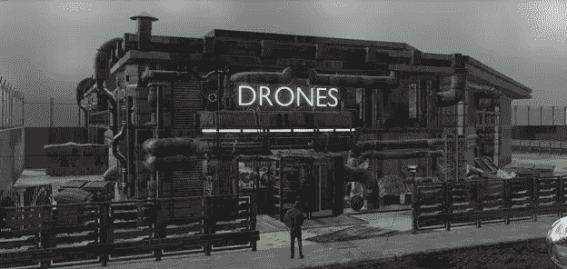

# 由 ProtoReality Games 打造的首款 3D 元宇宙角色扮演游戏，将于 2022 年第四季度推出

> 原文：<https://medium.com/coinmonks/first-3d-metaverse-rpg-built-for-mobile-d-o-119-1808376d2c68?source=collection_archive---------32----------------------->

元宇宙技术在过去两年中逐渐建立起来，并且没有停止的迹象，朝着更加以元宇宙为中心的在线环境的发展[预计](https://www.globenewswire.com/en/news-release/2022/06/08/2458533/0/en/Metaverse-Market-Size-to-Worth-Around-USD-1-607-12-Bn-by-2030.html)到 2030 年市场规模将超过 16，070 亿美元。虽然对于元宇宙需要什么仍然没有任何硬性规定——一些人坚持认为虚拟现实和增强现实是定义功能，但更通俗的用法倾向于虚拟世界，也可以在没有虚拟现实的情况下探索——元宇宙标准论坛[最近成立了](https://www.theverge.com/2022/6/21/23176755/microsoft-meta-epic-metaverse-standards-forum-founded)，以监督不断发展的行业，并引导其发展成为一种可访问的形式。

游戏行业目前占据了元宇宙发展的最大份额，堡垒之夜、《我的世界》和 Roblox 等旧的 Web2 标准仍然吸引着总共约 5000 万的日活跃用户。当谈到元宇宙游戏中较新的 Web3 进步时，迄今为止大多数游戏仍然主要由简单的多人迷你游戏体验组成，许多游戏现在都专注于游戏赚取内容。

然而，令人惊讶的是，很少有 Web3 元宇宙游戏有深刻的、令人身临其境的情节。元宇宙火箭筒都在哪里？元宇宙的虚拟世界非常适合 MMORPG 类型。嗯，今年晚些时候，我们将看到一款新的 3D 元宇宙 RPG 游戏的推出，这款游戏有望在很大程度上填补这一空白——在手机上也是如此。

## 即将推出:O.119，首款移动 3D 元宇宙 RPG

衍生外围站 119——简称 D . O.119 是一款免费的 3D RPG 游戏，带有 Web3 元宇宙游戏元素，将于 2022 年第四季度推出移动设备。由[原型现实游戏](https://protorealitygames.com/)开发的 D.O.119 建立在索拉纳，一个生态友好的区块链网络上，几乎没有明显的交易费用。

[https://youtu.be/CZRK-lPiIVQ](https://youtu.be/CZRK-lPiIVQ[/embed])

D.《O.119》是一部科幻动作 RPG 游戏，故事发生在 100 多年后的反乌托邦未来，在世界各国政府垮台几十年后。它具有一个身临其境的情节，玩家开始了一个丰富详细的传奇故事，以揭示他们复杂的背景故事，同时在一个高概念的城市景观背景下智取对手并生存。

> ***“我们有真正的好莱坞级别的剧本作家，他们为网飞创作过剧本，美术和音乐是由东南亚一些最优秀的创作人才完成的，”***

ProtoReality Games 首席执行官兼联合创始人[丹尼尔·穆勒](https://www.linkedin.com/in/daniel-muller-sg-cfo/)说..

> “D.O.119 是一个让玩家完全沉浸其中的游戏体验。”

D.O.119 中的每个决定都有可能以各种方式改变结果并影响未来的性格发展。而且不缺少决策，有许多敌对角色的派别朝着相互冲突的目标行动，以及盟军玩家可以合作承担更大威胁的任务。就冲突而言，这款游戏绝对充满了动作，有高速赛车和大量的 FPS 战斗。更有战略头脑的玩家也会喜欢交易、绘图和在大城市环境中旅行。

## 以故事为中心的新的 Web3 游戏体验

和其他现代的 Web3 游戏一样，玩家可以获得可交易的代币和 NFT。然而，穆勒强调，这款游戏更多的是沿着“玩并赚”的路线，而不是为了赚而玩，将游戏的重点放在游戏体验而不是最终奖励上。

> *“我们希望我们的玩家继续回来，因为产品很棒，并向他们的朋友推荐 D.O.119，作为一个伟大的游戏体验。但是你现在不能从 P2E 游戏中得到这些——每个人都只关注赚钱，”穆勒说。****“D . o . 119 专注于沉浸式和有趣的游戏。”***

游戏还引入了许多以社区为中心的元宇宙元素。多人锦标赛将鼓励强烈的在线竞争意识，玩家也可以聚集在一起，在城市景观游戏世界周围安排的各种自治空间中放松和社交。后者甚至以品牌内容为特色，让来自各行各业的广告商有机会以真正的赛博朋克元宇宙时尚与玩家互动，而不打破叙事。

## 在移动设备上启动

D.O.119 将于 2022 年第四季度问世。该游戏将在 iOS 和 Android 移动应用商店提供下载。

Youtube 上有一些[游戏片段](https://youtu.be/CZRK-lPiIVQ)，读者可以查看一下，感受一下游戏将会是什么样子，但请记住，这是四个月前发布的前 alpha 质量。为了更好地了解最终游戏会是什么样子，请继续关注 ProtoReality Games 的 [Twitter](https://twitter.com/ProtoRealityGmz) 、 [Telegram](https://t.me/PRG_and_DO119) 或 [Discord](https://discord.com/invite/7pjQxtUc5F) 频道的公告。

[*来源*](https://cryptoslate.com/first-3d-metaverse-rpg-built-for-mobile-d-o-119-by-protoreality-games-launching-last-quarter-of-2022/)

> 交易新手？尝试[加密交易机器人](/coinmonks/crypto-trading-bot-c2ffce8acb2a)或[复制交易](/coinmonks/top-10-crypto-copy-trading-platforms-for-beginners-d0c37c7d698c)