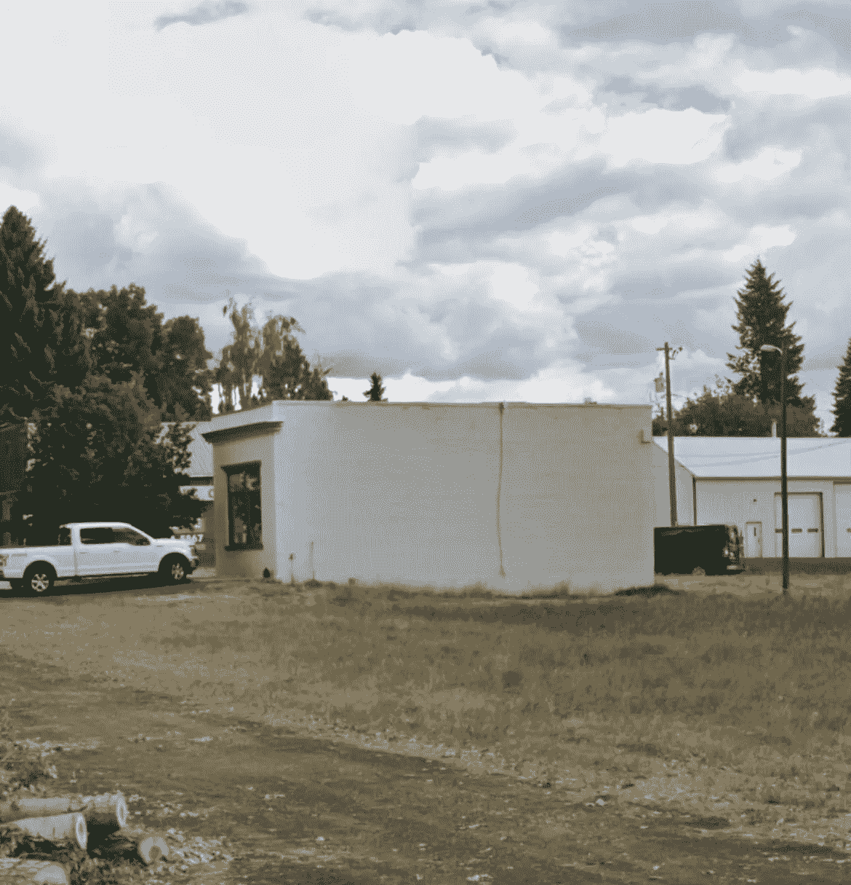

# 第一密码+斯通纳银行？FTX 银行更新

> 原文：<https://medium.com/coinmonks/first-crypto-stoner-bank-ftx-bank-update-bb82b14690d2?source=collection_archive---------15----------------------->

这将是一个比平常更短的帖子。但我想我应该告诉你他们与法明顿州立银行合作的最新情况。

# 什么是新的

正如我之前报道的，FTX 和阿拉米达的投资是 1150 万美元，尽管该银行的总净值只有 570 万美元左右。所以他们的投资增加了一倍多。然而，新的信息已经被披露。事实是，FTX 和阿拉米达用他们 1150 万美元的投资甚至没有买下这家银行。他们仅仅购买了 10%的所有权。这将使该公司的拟议净资产达到惊人的 1.15 亿美元。与报道的 570 万美元形成鲜明对比。

*If you never have seen $115 million before, now you can feast your eyes on it. Just right-click and “save as” and you can look at it whenever you want.*

现在的好问题是，是什么让法明顿州立银行的母公司 FBH 的估值超过上市净值的 20 倍？看来关键在于银行的品牌重塑。我报告说，他们已经在网上更名为月光石银行。一些关于原因的线索也已经被揭示。

*No, no, not that type of stoned.*

看来月光石是一场文字游戏。月亮来自 crypto。由于这是一个经常在这里使用的比赛，“这个项目将月球”或“到月球”。回避了项目增值的巨大潜力。即使我会说它在这一点上已经变成了一个迷因。第二部分是 Stone，来自 stoner，又名吸毒成瘾的人。

如果我们把它们放在一起，我们就能得到月光石，根据报道，这就是这家新公司的目标。秘密项目以及从事合法毒品交易的公司。

如果这个计划保持不变，我想我们将拭目以待。但是根据 FTX 和阿拉米达在 FBH 只有 10%的股份这一事实来判断，我认为它会继续前进。好吧，除非所有的规定都被抓住，并停止它，现在他们知道这个计划似乎是什么。

你对此有什么想法，你觉得是时候建立一个秘密银行了吗？或者这是导致灾难的原因？请在下面的评论区发表意见。如果你想支持我和我制作的内容，请考虑关注我，阅读我的其他帖子，或者为什么不两者都做。

网络上见！

图片由:[https://pixabay.com/,](https://pixabay.com/,)法明顿州立银行提供

> 交易新手？试试[密码交易机器人](/coinmonks/crypto-trading-bot-c2ffce8acb2a)或者[复制交易](/coinmonks/top-10-crypto-copy-trading-platforms-for-beginners-d0c37c7d698c)