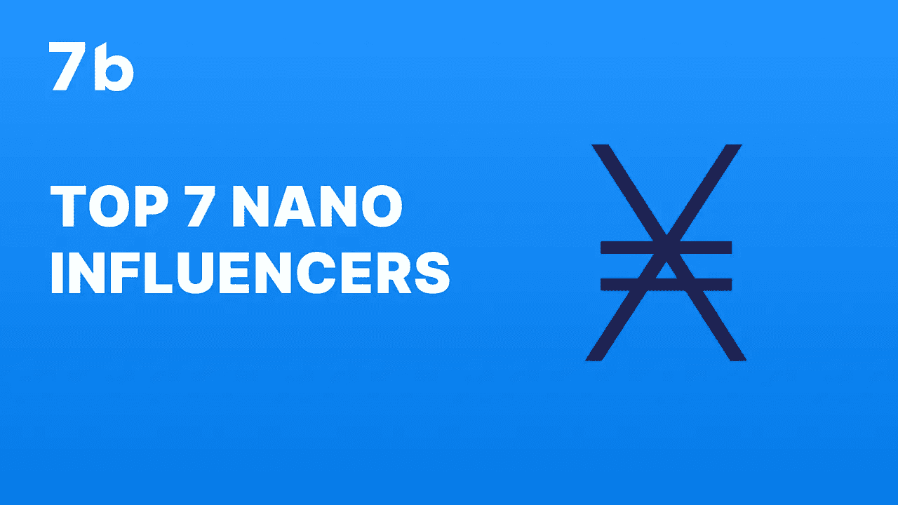
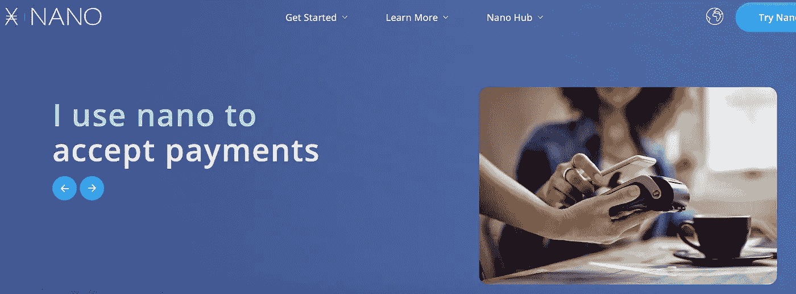
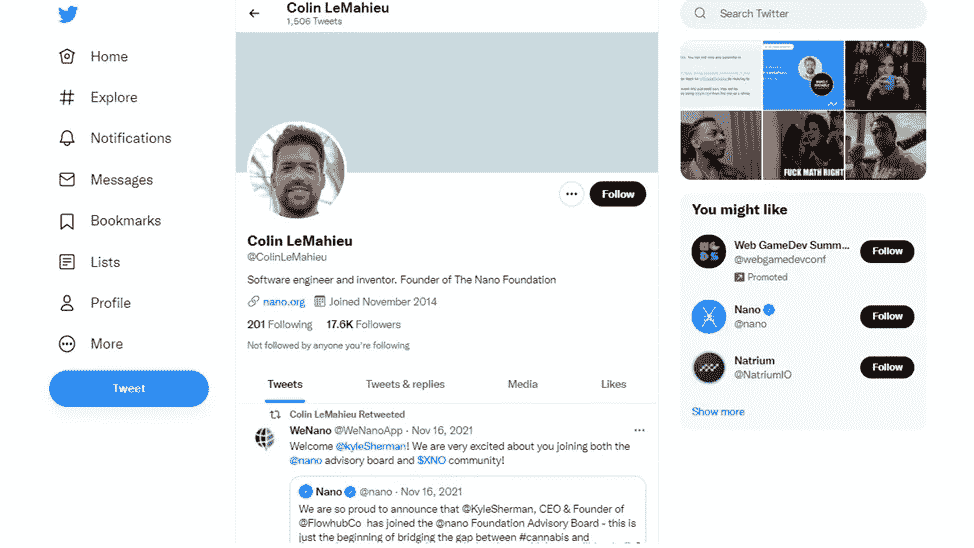
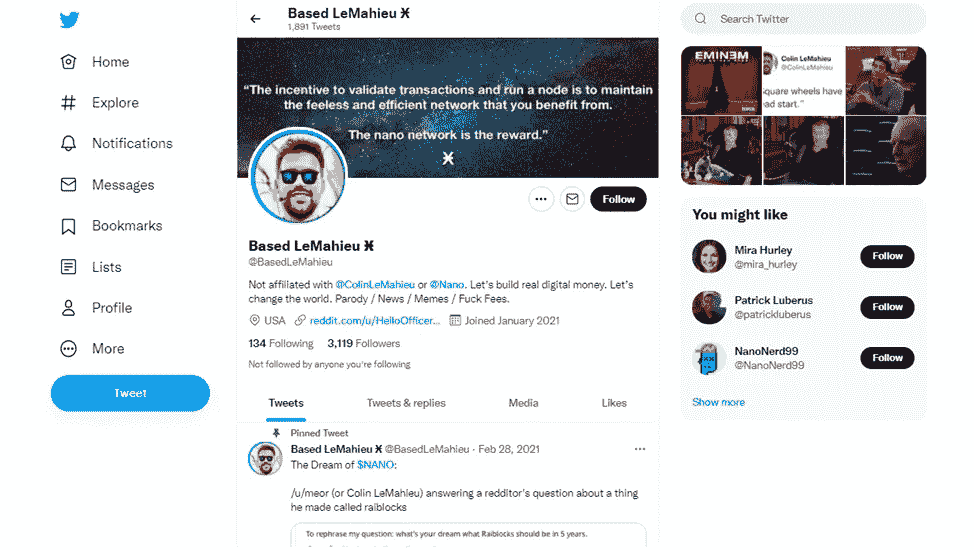
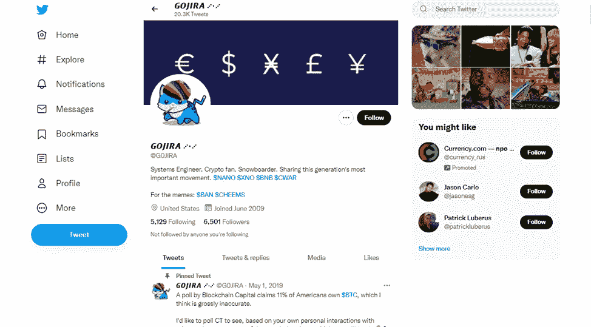
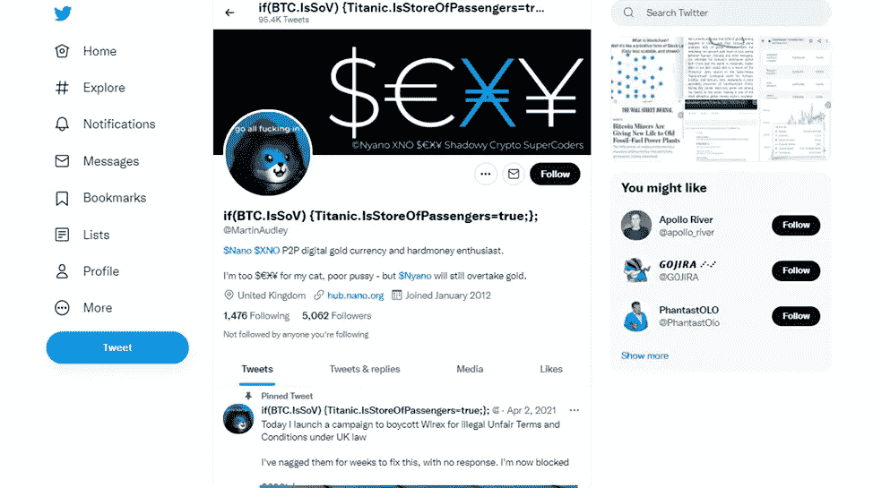
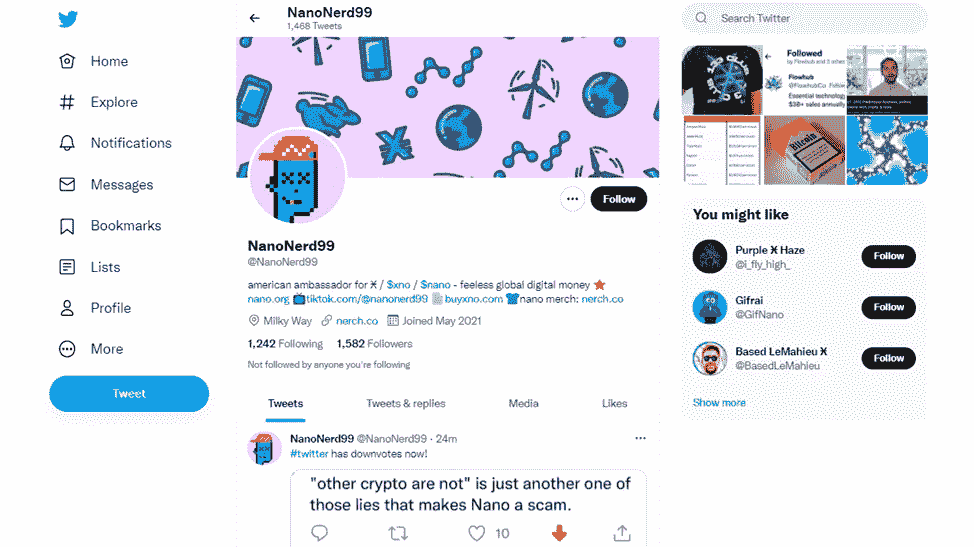
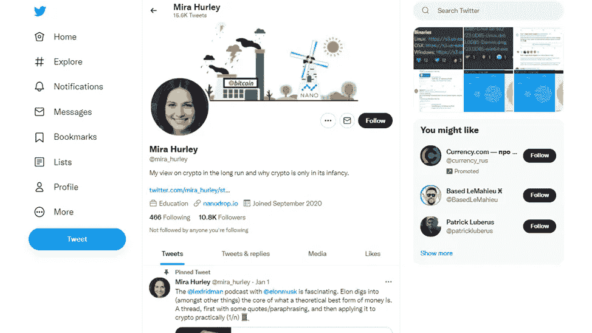
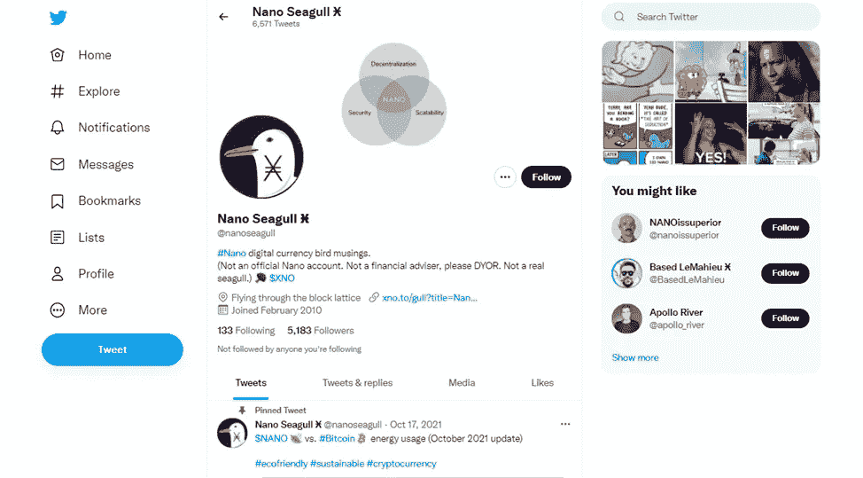

# 第一手 XNO 新闻。7 大纳米影响者

> 原文：<https://medium.com/coinmonks/first-hand-xno-news-top-10-nano-influencers-555571eeac68?source=collection_archive---------25----------------------->

谈到加密市场，分享观点和见解的区块链爱好者可能会对加密货币用户产生强大的影响。加密影响者是任何加密货币的强烈支持者，当他们这样做的时候，他们也让更多的人参与到业务中来。

他们的观众倾向于听从秘密意见制造者的建议。在加密领域，有大量的加密和基于区块链的项目可用，而且种类繁多，很难决定应该遵循哪个项目。

可以为其社区感到自豪的加密货币之一是 Nano。由于没有交易费，纳米区块链在业内广受欢迎。

我们相信这种硬币有很大的未来，并准备了一份前 7 名纳米影响者的名单，如果你使用区块链或只是考虑购买纳米硬币，你一定要关注他们。

# 那么…什么是纳米？

纳米加密货币被描述为“人人免费的数字货币”

它是一种分散的、可持续的、安全的数字支付协议，旨在实现易用性和轻量级。该协议的重点是解决现有金融系统的低效率问题。因此，Nano 协议旨在提供一种独特而直接的点对点价值转移。

Nano 或 XNO 允许个人使用高效和可访问的数字货币，以最小的影响将他们与全球经济联系起来。Nano 旨在提供一种无忧、无费、无等待政策的数字货币体验。所有这些使得 XNO 成为业内最受欢迎的加密货币之一。

# 谁是顶尖的纳米影响者？

1.  [**科林·勒马约**](https://twitter.com/ColinLeMahieu?ref_src=twsrc%5Etfw)

每个纳米爱好者都知道或至少听说过科林·勒马休。他是一名软件工程师，也是纳米区块链的创始人。所以你可以猜到他的推特账号里充满了纳米的见解。他的博客是所有纳米材料的完美来源。他不经常发帖子，但是关注他的账号，你不会错过任何关于纳米区块链的重要更新。

**2。**

****

**你可能会问为什么名单上有科林·勒马修的二重身。最初是一个基于 Nano 创始人 Colin LeMahieu 个性的 Twitter 模仿账户，它包含了许多关于这种加密货币的相关信息。**

**无论是谁在背后操作，莱马休的账户也分享了各种各样的密码相关的迷因，会让你作呕。**

****3。** [**悟空**](https://twitter.com/G0JlRA?ref_src=twsrc%5Etfw)**

****

**GOJIRA 是 Nano 和 Nano 区块链的下一个影响者。这个账户持续发布关于纳米区块链的各种发展。GOJIRA 还就 Nano 在行业中的作用提供了个人意见。**

****4。** [**马丁奥德利**](https://twitter.com/MartinAudley)**

****

**马丁·奥德利在纳米推特用户中知名度很高。他是 XNO 社区的杰出倡导者。他的推特上充满了不同的纳米相关新闻和热烈讨论的转发，例如，[在这里](https://twitter.com/MartinAudley/status/1476306995523297293)，他问观众为什么埃隆·马斯克选择 DOGE 而不是 XNO，尽管事实上纳米区块链要先进得多。**

****5。**[**nano nerd 99**](https://twitter.com/NanoNerd99)**

****

**NanoNerd99 是每个想要获得关于 Nano 令牌的准确特定功能信息的人的必选帐户。他还在大公司中传播纳米区块链的消息，比如 NanoNerd99 在音乐流媒体平台中推广纳米支付。**

**这位美国纳米大使还有一个抖音账户，他在那里推广这种加密货币。**

**6。 [**米拉赫利**](https://twitter.com/mira_hurley)**

****

**米拉·赫尔利是我们名单上最有影响力的加密专家之一。她因揭穿埃隆·马斯克对莱克斯·弗里德曼的采访而闻名。米拉在她的推特上表达了她对 Nano token 的看法。她确信这种密码最有潜力成为未来经济的一部分。**

**7。 [**纳米海鸥**](https://twitter.com/nanoseagull)**

****

**被认为是 Twitter 上纳米社区最杰出的成员之一，纳米海鸥就为什么纳米比传统货币更好发表了意见。所以，跟随纳米海鸥去了解许多关于纳米区块链的激动人心的事实。**

****结论****

**考虑到 XNO 不可否认的好处和社交媒体上影响者的巨大支持，这种加密货币绝对值得投资。最简单方便的方法就是在 [7b 经纪人 app](https://play.google.com/store/apps/details?id=io.sevenb.terminal) 里买 Nano。在我们的网站上找到更多关于这枚硬币的信息[。](https://sevenb.io/currencies/nano)**

***原载于 2022 年 8 月 11 日*[*https://seven b . io*](https://sevenb.io/blog/first-hand-xno-news-top-10-nano-influencers/)*。***

> **交易新手？尝试[加密交易机器人](/coinmonks/crypto-trading-bot-c2ffce8acb2a)或[复制交易](/coinmonks/top-10-crypto-copy-trading-platforms-for-beginners-d0c37c7d698c)**