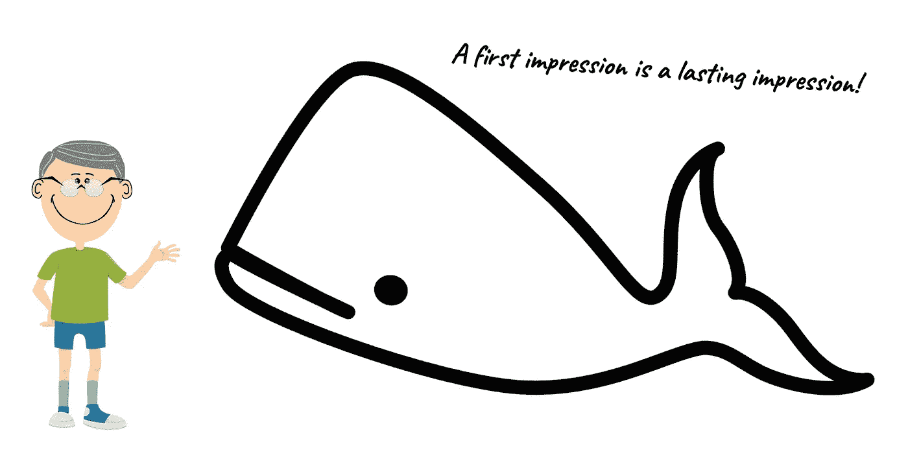
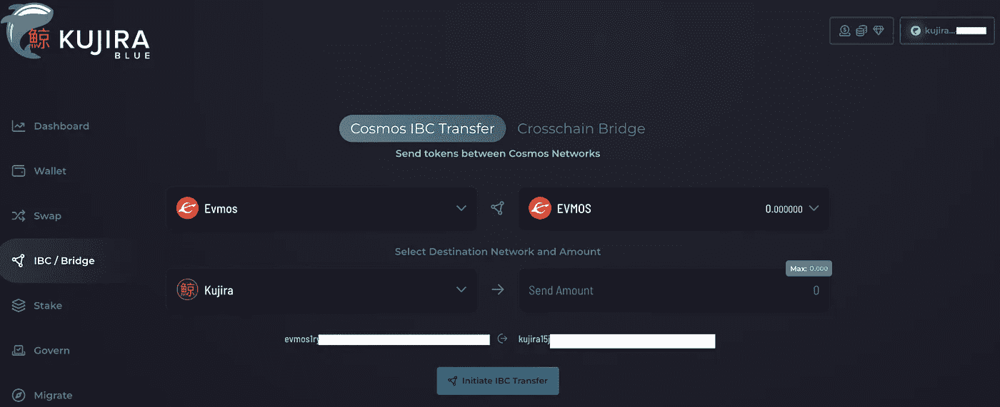
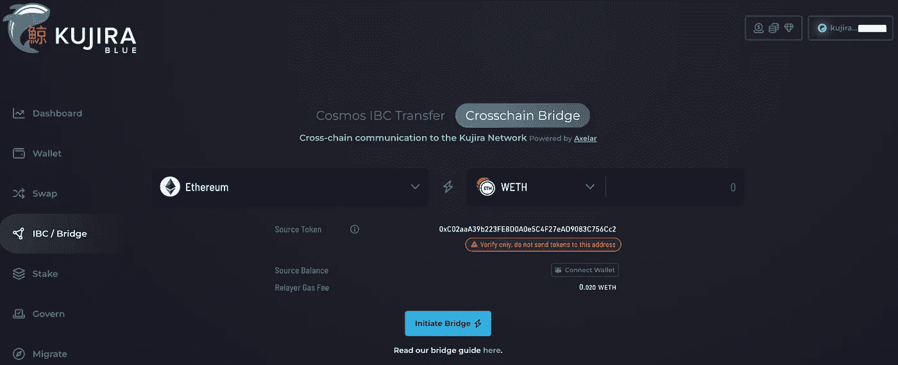
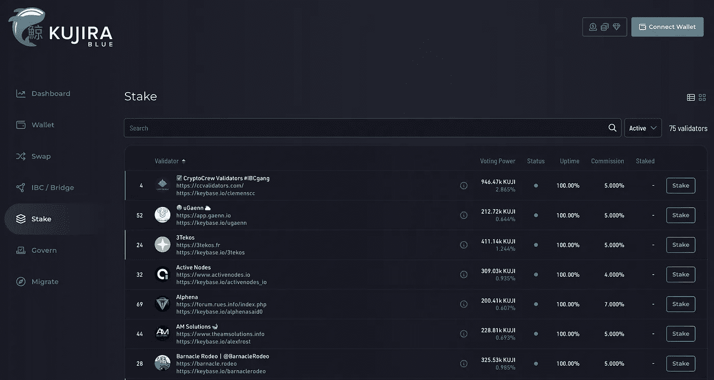
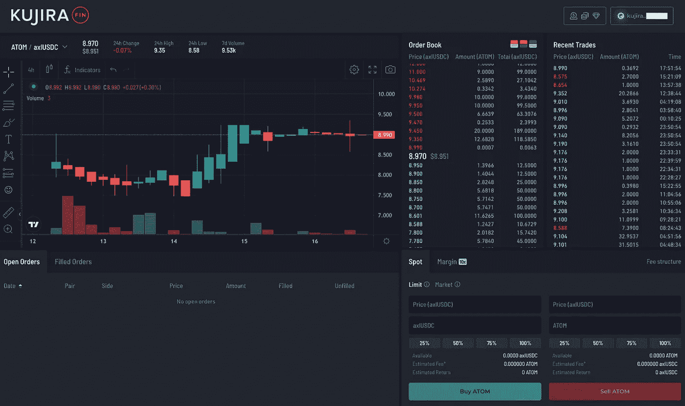
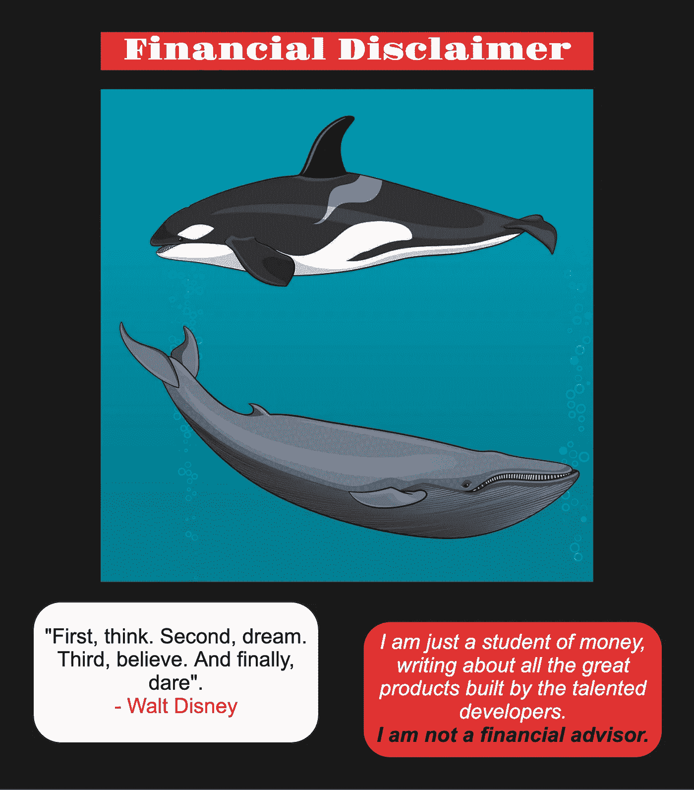

# 第一印象:鲸声优蓝和鳍

> 原文：<https://medium.com/coinmonks/first-impressions-kujira-blue-and-fin-e85e123b2a0e?source=collection_archive---------8----------------------->

鲸声优最近在宇宙中发射了主权区块链。他们带着第一个 dApp: Blue 冲出了大门。随后，鲸声优团队推出了 FIN，这是一个多连锁店的订单交换平台。

在这里，我会给你我对这些 dApps 的第一印象，并讨论为什么它们对生态系统如此重要。在资源部分，我添加了开始探索和做自己的研究所需的所有内容的链接。

## **桥接多链资产**

鲸声优团队建造了一个高效的 dApp 来装载宇宙中 17 个区块链的资产。当您点击蓝色主菜单上的 IBC/大桥时，您会看到一个简单易用的方法，让您从其他连锁店获得您的本地 IBC 资产。与 Keplr wallet 完全集成，当您选择一个以前没有交互过的链时，会自动弹出一个连接请求批准窗口。例如，当您选择将 SCRT 从秘密网络转移到鲸声优时，会显示您在该链上的流动代币金额，您选择金额，启动 IBC 转移，批准在 Keplr 中用 SCRT 代币支付小额交易费，然后将它们带过来。然后，您可以在您的 Keplr 鲸声优钱包中或点击蓝色菜单上的钱包菜单选项时看到代币。

鲸声优在宇宙中发展，并从整个生态系统中获取 IBC 本土资源，供其 dApps 使用；然而，该团队已经将目光投向了宇宙之外的链间资产。另一个可用的 onboarding 选项是使用 Axelar 桥将来自其他五个生态系统的数字资产桥接起来，包括来自以下系统的-axl、wrapped 和原生令牌:

*   以太坊
*   雪崩
*   多边形
*   幽灵
*   月光。

这也非常有效，我已经和以太坊的 USDC 一起测试过这座桥。请记住，Axelar 收取的转播费用比 IBC 转播费用高得多(相当于 20 美元以上)，而且速度也没有那么快。

来自这位节俭作者的一个提示:IBC 转移你的宇宙资产，用它们在鲸声优金融上交换这些其他资产。USDC 和 WETH 都已经上市了，我相信其他公司也不会落后太多。最后，鲸声优还与 Kado Money 合作，在不久的将来提供菲亚特入口匝道。

## **关注收益**

鲸声优团队为自己的商业模式与众不同而自豪；换句话说，在蓝色上下注是一种相当令人大开眼界的体验。不要指望在这个链条上看到+100%的赌注奖励激励。谁知道呢，我们将来可能会到达那里，但不是现在。这样做的原因是，KUJI 赌注不是基于通货膨胀；相反，它是基于收入的。随着区块链 dApps 赚取收入，KUJI 的赌注者也从中分一杯羹。而且，不仅仅是在 KUJI 令牌上！作为一名 KUJI 赌注者，你可以获得所有在链条上产生收入的顶点代币的奖励。其中七个已经激活，随着更多资产的添加，该列表将会增长。

该网络由 75 名验证人员组成的出色团队保护，其中包括以社区为中心的团队，如:

*   智能桩
*   与 DAIC 的丹库区
*   奥尼
*   陆军一等兵(Private First Class)
*   秘密小组
*   薰衣草五节
*   君主。

这些验证器和鲸声优集合中的许多其他验证器通过回馈分析、视频内容、教程、图表、中继服务、编码支持和 dApps 开发，为社区提供了很多价值。

> 交易新手？试试[加密交易机器人](/coinmonks/crypto-trading-bot-c2ffce8acb2a)或者[复制交易](/coinmonks/top-10-crypto-copy-trading-platforms-for-beginners-d0c37c7d698c)

最后，Blue 还包括治理投票、简单交换、从 Terra 迁移 KUJI 和仪表板的功能。

## **flo 万岁！**

我想给藤壶竞技验证大声喊出来。当我加入鲸声优测试网时，我浏览了整个验证器组，起初我打算委托给我在其他链上赌注的一个伟大的验证器(见上面的列表)。然而，Barnacle Rodeo 以其图形化的外观和令人敬畏的口号吸引了我的注意。我决定给他们一个尝试，我没有失望。

他们有了一个良好的开端:

*   正常运行时间— 100%
*   当前佣金— 5%
*   最高佣金——10%
*   最大变化率— 1%
*   库吉保税——325，530。

我在测试网上有一些问题，并在 Barnacle Rodeo 上联系了 vaqueros。他们给了我很大的支持，很快地帮助了我，而且做得很专业。他们在 Twitter 上的交流是及时的、信息丰富的、有趣的。他们的投票非常透明，不仅让机构群体了解鲸声优链上即将到来的投票，还让我们知道他们是如何投票的。我是图形的忠实粉丝:看看下面这幅拼贴画，看看 Barnacle Rodeo 的天才艺术家们为他们的营销制作了什么！

## **现货和限价委托交易**

继成功推出桥接和锁定 dApps 之后，鲸声优迅速推出了 FIN，这是一种分散式订单簿风格的交易所。Apex 资产正在以极快的速度增加，我一直在积极测试限价单和市场交易功能。最初的结果非常好。订单按计划执行，用户界面易于使用，订单跟踪令人印象深刻。

每一项新增加的资产都要经历一个流动性引导阶段，在这个阶段只能设置限价单。在这个初始阶段结束后，市场订单被打开。该交易所提供交易图表以及买入订单、卖出订单和最近交易的视图。在撰写本文时，以下 apex 令牌处于完全交易模式:KUJI、USDC、wETH、ATOM、JUNO、OSMO 和 EVMOS。一种资产正处于流动性自举阶段:SCRT。

交易费(做市商 0.075%，收市商 0.15%)支付给 KUJI 赌注者。网络费用也是收费的，而且花费很少(只有几分钱)。默认情况下，费用以库吉支付；但是，您也可以更改这一点，并设置在 USDC 支付的费用。

您的限价单在“未结订单”标签中可见。一旦您的限价单被执行，您就可以在“已填写”选项卡中访问它们，在那里您可以申请限价单。从跟踪和记录的角度来看，我真的很喜欢这个功能。最后，鲸声优也有自己的区块链浏览器(Finder)，你只需输入你的钱包地址，就可以看到你所有的流动资产和股份，以及所有的交易。

## **对生态系统的影响**

鲸声优区块链上的 dApps 无缝协作，功能强大。通过从一开始就选择整合整个宇宙的资产，鲸声优将自己定位为整个生态系统的多链分散交易所。他们将协议、dApps 和区块链结合在一起，为宇航员增加价值。随着时间的推移，我预计鲸声优将把更多的顶级资产引入 FIN。该团队还展示了产生收益的不同方式。作为 KUJI 赌注者，我们赚取所有这些顶点资产的一小部分。

我不隶属于鲸声优或巴纳克尔竞技；相反，我是他们 dApps 和服务的快乐用户和粉丝！如果你读过我的文章，你会知道我正在热情地写我进入这个奇妙的秘密宇宙的旅程。我在源代码部分提供了我在这里讨论的所有内容的链接，这样您就可以自己进行研究了。

## **刚刚入门**

Blue 和 FIN 正在为鲸声优区块链即将推出的最关键的协议之一奠定基础:Orca。当借贷市场在全球范围内启动时，鲸声优将已经通过其目前的 dApp 产品吸引了一批狂热的用户。将我们所有人转移到对 Orca 进行清算投标将会很容易！

在不久的将来，由于 Blue 易于使用的 IBC 功能，成功执行清算出价的资产将毫不费力地在生态系统中流动。通过 FIN 中的现货和限价单功能，通过 Orca 竞价新获得的资产可以快速交换为稳定的代币或我们首选的 Cosmos 资产。区块链将在每一步收取费用，创造一个盈利的飞轮，因为鲸声优是建立在一个从地面开始创收业务。最重要的是，从区块链 dApps 收集的收入直接惠及 KUJI 赌注者！

通过使用订单簿交换，没有必要积累大量的流动性，也没有必要陷入与维持 AMM 相关的所有挑战。鲸声优还为供应链的股东引入了一种新的价值模式，这种模式基于创收，而非通胀。此外，他们还确保了被困在区块链土地上的社区被带到了这个不可思议的迷人旅程中。我参与了迁移过程，并能够获得并带来超过 100%的我的 KUJI 股份，这些股份是我去年开始积累的！

第一印象是持久的印象！当我第一次发现鲸声优并写下正在开发的创新技术时，我立刻就被吸引住了。现在，八个月过去了，这是一个真正的工程壮举，鲸声优团队如何进化并在宇宙中重新发射了整个区块链。他们正在实现他们最初的使命，将他们最初的支持者带到他们身边，并打造一个新的、甚至更强大的社区。注意我的话，鲸声优团队才刚刚开始！

Tot ziens — Opa。

## **来源、参考资料和进一步阅读**

https://fin.kujira.app/trade/鲸声优芬—

https://blue.kujira.app/鲸声优蓝—

鲸声优蓝 IBC/大桥—[https://blue.kujira.app/ibc?destination=kujira](https://blue.kujira.app/ibc?destination=kujira)

https://finder.kujira.app/kaiyo-1[鲸声优区块链探索者](https://finder.kujira.app/kaiyo-1)

鲸声优推特— @TeamKujira

https://medium.com/team-kujira 鲸声优中等—

Kuji Peruggi 的 Medium 文章:《FIN 交易指南》——[https://Medium . com/team-kuji ra/Guide-to-Trading-on-FIN-eef 89d 80 a6 a 4](/team-kujira/guide-to-trading-on-fin-eef89d80a6a4)

凯勒的 YouTube 视频—[https://youtu.be/qqKw3XodqQY](https://youtu.be/qqKw3XodqQY)

Danku_r 的 YouTube 视频—[https://youtu.be/3aC11mrnsbM](https://youtu.be/3aC11mrnsbM)

藤壶竞技会—【https://barnacle.rodeo/ 

藤壶竞技推特—@藤壶竞技

## **你可以在这里找到我:**

推特— @KaasKop_Opa

中等—[https://medium.com/@KaasKop_Opa](/@KaasKop_Opa)

循环—[https://www.loop.markets/user/52879](https://www.loop.markets/user/52879)

狮子座金融—[https://leofinance.io/@kaaskop](https://leofinance.io/@kaaskop)

> 加入 Coinmonks [电报频道](https://t.me/coincodecap)和 [Youtube 频道](https://www.youtube.com/c/coinmonks/videos)了解加密交易和投资

# 另外，阅读

*   [加拿大最佳加密交易机器人](https://coincodecap.com/5-best-crypto-trading-bots-in-canada) | [库币评论](https://coincodecap.com/kucoin-review)
*   [火币的加密交易信号](https://coincodecap.com/huobi-crypto-trading-signals) | [HitBTC 审查](/coinmonks/hitbtc-review-c5143c5d53c2)
*   [TraderWagon 回顾](https://coincodecap.com/traderwagon-review) | [北海巨妖 vs 双子座 vs BitYard](https://coincodecap.com/kraken-vs-gemini-vs-bityard)
*   [如何在 FTX 交易所交易期货](https://coincodecap.com/ftx-futures-trading)
*   [OKEx vs KuCoin](https://coincodecap.com/okex-kucoin) | [摄氏替代品](https://coincodecap.com/celsius-alternatives) | [如何购买 VeChain](https://coincodecap.com/buy-vechain)