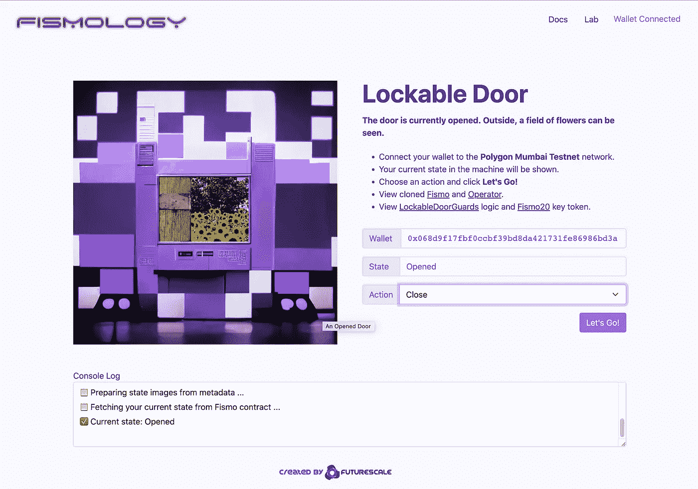

# 金融 101:可锁门实验

> 原文：<https://medium.com/coinmonks/fismology-the-lockable-door-experiment-e2f2ba8420ff?source=collection_archive---------20----------------------->

## 基于 Fismo 协议的物理系统建模

Lockable Door Experiment UI

如果你正在阅读这篇文章，这很可能是你第一次接触 Fismo，EVM 区块链的状态机协议。深入阅读[文档](https://docs.fismo.xyz)以获得对协议的详细理解，或者阅读 [compsci 课程](https://ocw.mit.edu/courses/6-01sc-introduction-to-electrical-engineering-and-computer-science-i-spring-2011/pages/unit-1-software-engineering/state-machines/)了解有限状态机的基础知识及其一些用途。在这里我…