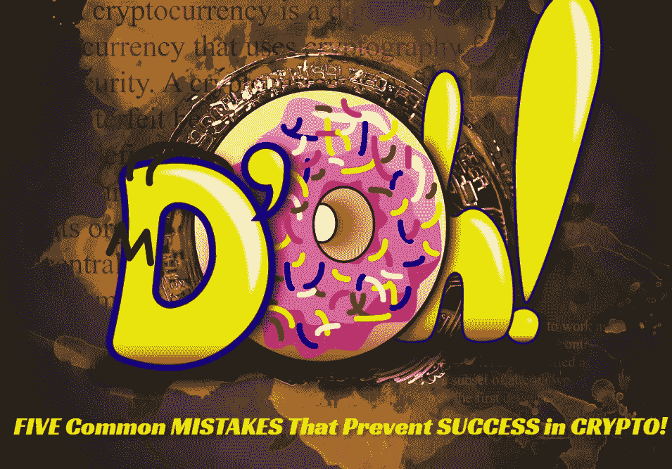

# 五个常见的错误，阻止成功的加密！

> 原文：<https://medium.com/coinmonks/five-common-mistakes-that-prevent-success-in-crypto-50dc12d19ea2?source=collection_archive---------12----------------------->

## 投资

## 使其发挥作用的必要改变

Cover Photo by “TheDigitalArtist” on [Pixabay](https://pixabay.com/photos/bitcoin-cryptocurrency-money-2902690/), and [Pixabay](https://pixabay.com/illustrations/simpsons-d-oh-logo-donut-6226380/) (modified)

熊市可以持续一段时间。

我们都希望痛苦尽快结束，也许到今年年底，我们的痛苦就会结束，尽管历史表明熊市可能会持续更长时间。