# 简历中的五个酷项目。只有带 DOM 的 JavaScript。

> 原文：<https://medium.com/coinmonks/five-cool-projects-for-your-resume-only-javascript-with-dom-661c8d5e2fea?source=collection_archive---------7----------------------->

使用纯 javascript 和与 DOM 的交互创建 5 个项目。

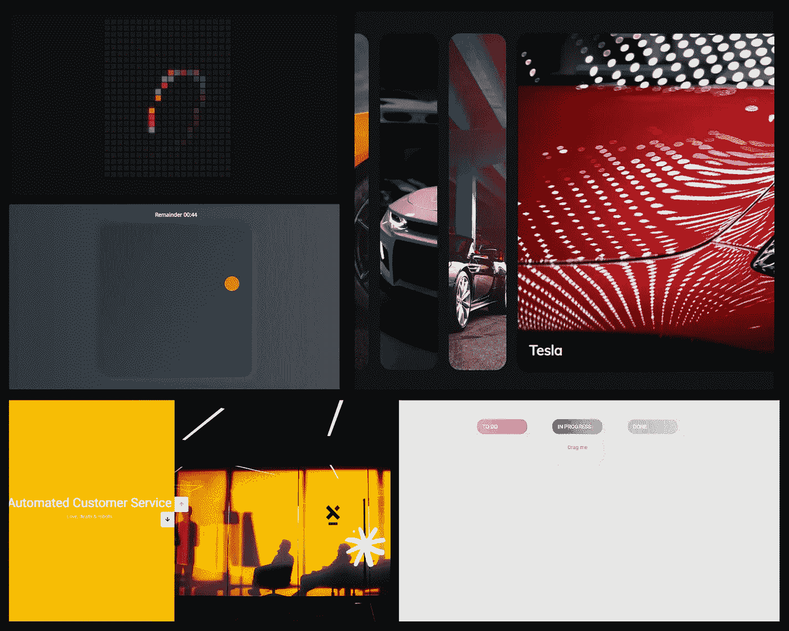

**要求:**
*——HTML、CSS 基础知识。
-了解 JavaScript 的基础知识，希望更深入地掌握这门学科*

> 源代码:[https://github.com/kumancev/js-dom-projects](https://github.com/kumancev/js-dom-projects)

## **项目 1(卡片)**

创建一个非常漂亮的下拉插件。
提供各种产品的最佳选择
自由职业者的服务费用从 10 美元到 70 美元不等。

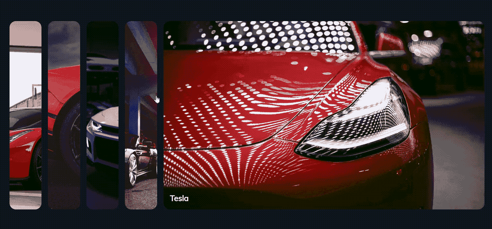

## 项目 2(拖放)

我们将通过创建一个迷你 Trello 克隆体来学习如何拖放。
适合拖拽物品到购物车或任务跟踪器
自由职业者服务费用从 30 美元到 150 美元不等。

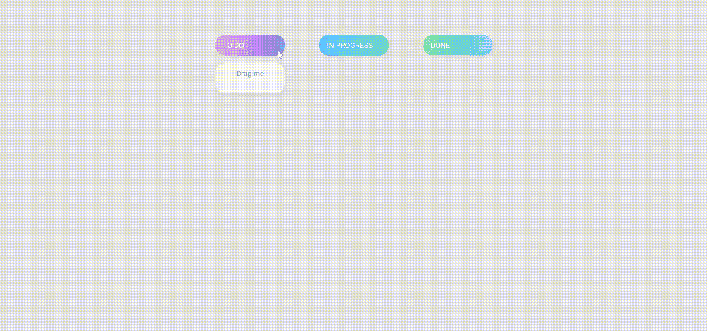

## 项目 3(滑块)

让我们写一个令人印象深刻的图片滑块
选项，展示服务或照片
自由职业者的服务费用从 50 美元到 220 美元不等。

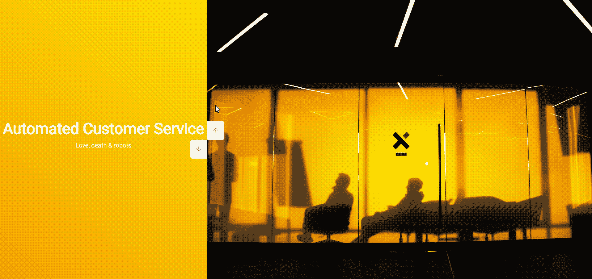

## 项目 4(悬浮板)

使用动态内容生成创建可视化迷你游戏
使用 JS 掌握动态生成和优化工作
自由职业者的服务成本从 60 美元到 300 美元不等。

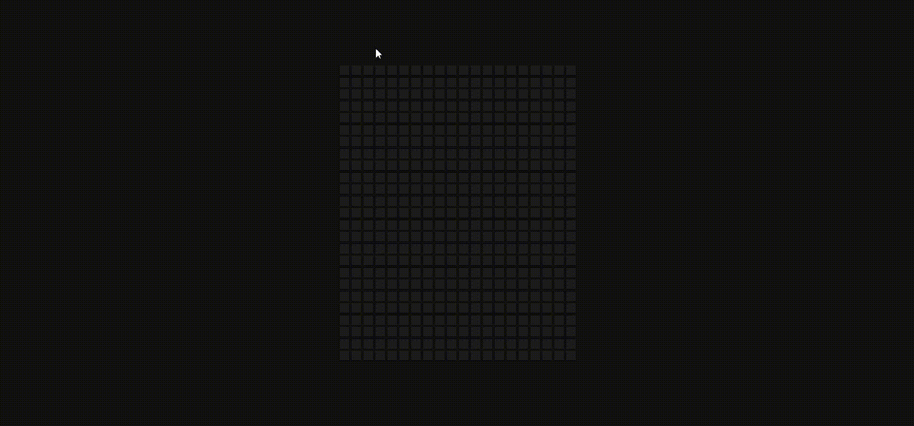

## 项目 5(目标游戏)

我们将写一个有 3 个屏幕的 Aim 游戏！
使用动画、定时器和成熟的游戏功能
自由职业服务的费用从 75 美元到 380 美元不等。

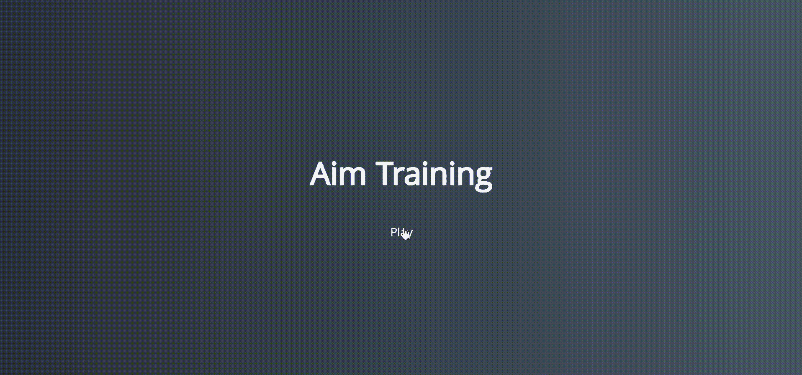

# 我们开始吧！

## 这里是**卡项目**的实施

1.  首先，让我们编写页面的 html 代码:

我们有一个主 div，它带有一个包含我们的卡的类“*容器“*”。当你点击一张卡片时，它就会打开。

2.让我们为此编写 CSS 代码:

you can play with the styles

3.要将卡片的类别更改为 open，让我们为我们的站点编写一个 js 脚本:

**我们的 app 完成了！😎**

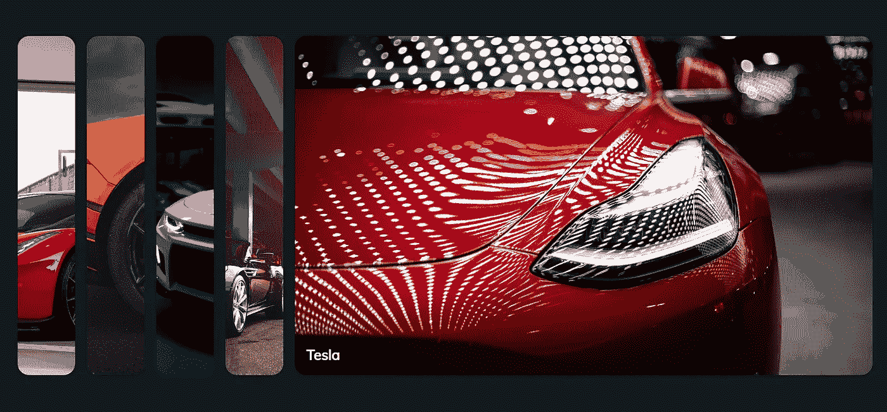

> *源代码:*[https://github . com/kumancev/js-DOM-projects/tree/main/cards-sources](https://github.com/kumancev/js-dom-projects/tree/main/cards-sources)

## 继续讨论拖放项目

1.  首先，让我们编写页面的 html 代码:

下面是一些简单的 html 代码。我们创建两行和列，并添加 div 来移动元素。

2.编写我们的 CSS 代码:

3.编写 js 脚本，以便能够将任务从一列移动到另一列:

我没有在代码中添加注释，因为我认为 EventListeners 非常清楚地描述了正在发生的事情。在任何情况下，你都可以通过写评论或以任何其他方式联系我来提问或澄清一些事情。

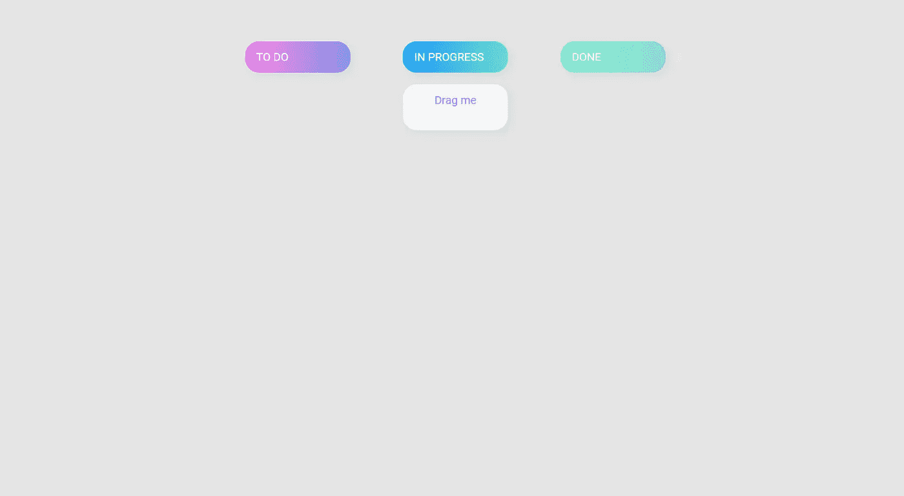

> *源代码:*[https://github . com/kumancev/js-DOM-projects/tree/main/drag-drop](https://github.com/kumancev/js-dom-projects/tree/main/drag-drop)

## 接下来是滑块项目

1.  同样，让我们编写页面的 html 代码:

用下面的方法标记页面->
我们将图像放在右边，文本内容放在左边，我们将添加按钮来移动。

2.让我们为应用程序中的逻辑和效果编写 CSS 代码:

注意，我们设置了*位置:我们的*的相对*属性。容器*和*位置:我们的*元素*的绝对*属性能够将它们隐藏在视口后面。

3.使切换幻灯片成为可能:

我们的应用程序看起来像

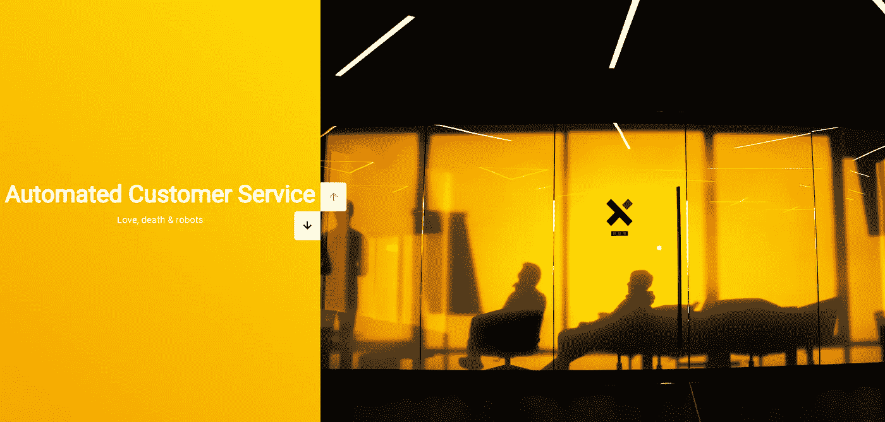

> *源代码:*[*https://github . com/kumancev/js-DOM-projects/tree/main/slider*](https://github.com/kumancev/js-dom-projects/tree/main/slider)

## 继续有趣的事情。悬浮板

1.  书写我们页面的基础:

2.接下来，编写我们的 CSS 代码:

如你所见，我们项目的 HTML 和 CSS 代码很简单。这都是因为我们将在 js 脚本中创建一个板，并在那里自动生成我们的样式。

3.让我们不要等待，让我们忙碌起来:

应用视图

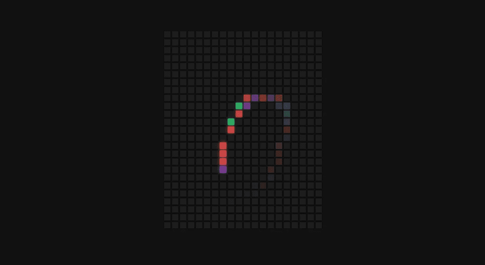

> *源代码:*[https://github . com/kumancev/js-DOM-projects/tree/main/hover-board](https://github.com/kumancev/js-dom-projects/tree/main/hover-board)

## 我们最后一个但并非最不重要的应用。目标游戏

反应测试应用程序，具有选择游戏持续时间的能力。

1.  编写应用程序的基础(html):

我们将有三个屏幕，我们将使用 css 和 js 切换。

2.让我们添加我们的 CSS 样式:

为了更好地理解，我建议把你的屏幕分成两部分(index.html 和 style.css ),以了解哪些样式适用于什么。

3.好吧，让我们写下这个游戏的逻辑:

我试图尽可能清晰地描述方法和变量的名称，这样当你阅读代码时，就能清楚地知道它是做什么的。
简而言之，我们将处理程序挂在第一个屏幕上，然后根据用户的选择切换屏幕。在游戏过程中，我们会生成不同大小和颜色的圆圈。当你点击一个圆圈，我们增加计数器，删除圆圈，并添加一个新的。

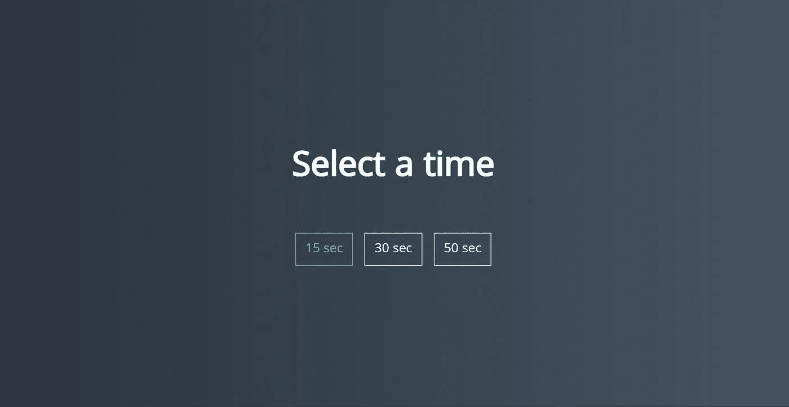

> *源代码:*[https://github . com/kumancev/js-DOM-projects/tree/main/aim-game](https://github.com/kumancev/js-dom-projects/tree/main/aim-game)

对了，这款游戏写个简单的主机脚本就能轻松黑掉。如果你能在评论中告诉我😎

## 咻，现在你已经用纯 javascript 创建了 5 个很棒的应用程序。

一定要摆弄代码，添加你自己的东西，改变风格，等等。谢谢你，网络上见！👋🏼

> 交易新手？尝试[加密交易机器人](/coinmonks/crypto-trading-bot-c2ffce8acb2a)或[复制交易](/coinmonks/top-10-crypto-copy-trading-platforms-for-beginners-d0c37c7d698c)