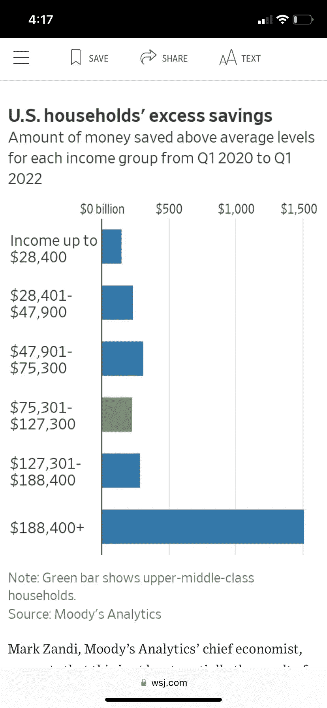

# 五分钟金融:BTC 作为稳定的美元，贝莱德-阿拉丁-COINBASE，META 的 NFT 推出

> 原文：<https://medium.com/coinmonks/five-minute-btc-as-stabilized-usd-blackrock-aladdin-coinbase-metas-nft-rollout-3d94aabfb955?source=collection_archive---------19----------------------->

# 5 分钟的金融时事通讯——解释发生了什么，为什么。

# 让我们看看这周发生了什么:

*   贝莱德(BlackRock)的阿拉丁(Aladdin)将比特币基地指派给 BTC 机构看门人
*   合并失败:重要，但以太坊的可伸缩性尚未激增
*   萨尔瓦多用合成美元推动金融科技创新
*   Meta 的 Instagram 来整合 NFTs
*   索拉纳的“黑客”揭秘

# 密码访问刚刚达到顶峰

*   比特币基地和贝莱德达成里程碑式的协议，支持加密技术的采用

# 贝莱德的阿拉丁带比特币坐魔毯？

自从 PayPal [在 2020 年 10 月宣布](https://tokenist.com/paypal-jumps-5-5-to-all-time-high-after-bitcoin-news/)其比特币整合以来，这似乎是永远。当时，比特币徘徊在 1.3 万至 1.4 万美元的区间，仅在三个月后就达到了 3.8 万美元。在此期间，我们已经看到机构采用泛滥，但没有什么可能像贝莱德的最新公告一样——将比特币基地整合到其阿拉丁系统中。

消息传出后，比特币基地股价立即上涨了 32%，从 79.28 美元涨到 115.14 美元，当天晚些时候稳定在 90 美元。图片信用:交易视图

这个名字不吉利的资产管理公司管理着[、9.4 万亿](https://s24.q4cdn.com/856567660/files/doc_financials/2022/Q2/BLK-2Q22-Earnings-Release.pdf)(21 倍比特币市值)的资产，这些资产几乎属于你听说过的所有公司。事实上，贝莱德是如此强大的金融力量，以至于美联储在 2020 年 3 月聘请了贝莱德来帮助其数万亿美元的投资。此外，贝莱德的权力核心甚至不是天文数字奥姆本身，而是阿拉丁。

Aladdin 是*资产、负债、债务和衍生投资网络*的缩写，是有史以来最强大的软件工具。通过阿拉丁，贝莱德的客户管理着累计价值 20 万亿美元的资产。

实时地，该平台无缝地结合了客户-投资者沟通、投资组合管理和风险分析。换句话说，阿拉丁把钱当成了它的本来面目——*信息*。

最后，货币只不过是一个信息单位，用来决定商品、服务和经济的效用。阿拉丁合并了这些信息流，使其具有可操作性。这就是为什么美联储在央行最需要的时候动用了它。对于所有与阿拉丁有关联的机构投资者来说，比特币基地现在是信息流的一部分。

不久前，在 2017 年，贝莱德首席执行官拉里·芬克将比特币称为“[洗钱指数](https://www.cnbc.com/2017/10/13/blackrock-ceo-larry-fink-calls-bitcoin-an-index-of-money-laundering.html)”:

*“比特币只是告诉你，这个世界上有多少洗钱的需求。仅此而已。”*

现在，芬克正在为机构投资者打开众所周知的闸门，首先是比特币。仅在美国市场，贝莱德就部署了价值[2.24 万亿美元](https://www.etf.com/channels/blackrock-etfs)的 402 只 ETF。

随着强大的贝莱德打破心理障碍，如果这些 ETF 中的一小部分决定纳入数字资产，我们可以看到对加密市场的影响。然而，作为风险资产，很大程度上将取决于市场对美联储通胀和利率调整的反应。

总的来说，消息传出后$COIN 上涨 32%以上是有原因的。另一方面，BTC 似乎仍被当前的宏观环境所笼罩。

# 以太坊九月的“合并”标志着以太坊 2.0 的 55%里程碑

*   随着合并的迫近，比特币在复苏方面落后于以太坊 **(** [**链接**](https://tokenist.com/bitcoin-lags-behind-ethereum-in-recovery-as-the-merge-looms/) **)**
*   以太坊拥有最强最可靠的社区:Web3 开发者报告 **(** [**链接**](https://tokenist.com/ethereum-has-strongest-and-most-reliable-community-web3-developer-report/) **)**

# “合并”只是以太坊发展的一部分

每项数字资产都有狂热的诋毁者，但有一点是肯定的。如果没有以太坊作为 DeFi dApps 的先锋，数字资产的前景将会截然不同。反过来，这让以太坊获得了先发优势，至今仍占据 58.73%的 DeFi 市场主导地位。

与此同时，随着更多区块链引入更大的以 dApp 为中心的应用，比特币的统治地位下降。在 LUNA 崩溃期间迅速获得 6%以上的市场份额后，这一增长现在几乎被抹去，为 41.66%。

*比特币的统治地位，即占 BTC 总加密市值的份额。图片信用:交易视图*

随着 9 月份的合并，以太坊正在关闭其“拼凑”状态，因为它完全过渡到股权证明(PoS)，将矿工甩在后面。以太坊目前的工作证明链将与 Beacon Chain“对接”，Beacon Chain 是其新的 PoS 主页，拥有超过 41.1 万个验证器，为新的生态系统投入了 1310 万 ETH(价值约 210 亿美元)。

Vitalik Buterin 称这个里程碑为 ETH 2.0 的“55%完成”。一旦我们看到合并，Vitalik 已经确定了几个后续阶段，包括:

*   激增:提高交易速度的分片集成。
*   The Verge:实现“Verckle Trees”——一种数学证明，使网络参与者能够在不存储大量数据的情况下成为验证者。
*   清除:删除旧的网络历史。
*   挥霍:“所有其他有趣的东西。”(不管那是什么意思)

就连美国银行最近也指出，对于以太坊来说，这种激增比合并更重要，以确保其市场地位。明年应该会出现激增升级，这将引入分片——将网络分成分片集群来分散负载。

作为数据库分区，分片早已在多人游戏中使用，以实现更低的游戏延迟。图片来源: [*Vitalik.ca*](https://vitalik.ca/)

这就是以太坊的可伸缩性发挥作用的时候了，它正在将网络吞吐量提高到 100，000 tps(相比之下，它目前的吞吐量约为 30tps)。与此同时，人们不应指望看到重大的业绩变化，如降低汽油费。合并的直接效果是估计减少 99.95%的能源足迹。

尽管如此，以太坊还需要几年时间才能通过所有三个可扩展性阶段——激增、边缘和清除——以达到其理论潜力。在此期间，雪崩，卡尔达诺，索拉纳，根，和其他人将在以太坊的脚跟。

没有人知道事情会如何发展。按照目前的速度，Telstra Ventures 的数据显示，以太坊的 dev 社区是最专注的，自 2018 年以来，年复合增长率为 24.9%。然而，在同一时期，Solana 的社区增长了 173%，尽管它仍然比以太坊小得多——有数千名开发者。

[**享受 5MF？点击转发给三个朋友。**](mailto:info@tokenist.com?subject=Check+this+out+&body=I%E2%80%99ve+been+reading+Five+Minute+Finance,+and+I+know+you%E2%80%99d+enjoy+it+too.+It%E2%80%99s+a+weekly+email+that+covers+the+most+important+trends+in+finance.+I+learn+something+new+every+time+I+read+it!+Check+it+out+here:+https://tokenist.com/newsletter/?utm_source=email_gr_btn)

# Galoy 通过比特币期货引领美元熟悉度

*   Galoy 推出 BTC 支持的合成美元，不需要稳定的货币 **(** [**链接**](https://tokenist.com/galoy-launches-synthetic-dollars-backed-by-btc-no-stablecoins-needed/) **)**

# 算法 Stablecoins 进化了？

对于新兴市场来说，采用技术的游戏名称是——熟悉。如果人们熟悉他们的媒介，他们就是他们的源泉。例如，最近的一份 WEF 报告显示，新兴市场 65%的投资者使用社交媒体来做金融决策。

这同样适用于比特币的采用。萨尔瓦多政府注意到，由于比特币的新颖性和波动性，比特币的接受度并没有达到应有的水平。但是，萨尔瓦多人知道他们的美元。这就是为什么 Galoy 开始提供比特币作为稳定的美元。

在推出支持闪电网络的比特币海滩钱包后，Galloy 现在正在部署名为 Stablesats 的合成美元。不要与 stablecoins 混淆，Stablesats 依靠金融合同诡计，通过一个有趣的概念:

*   假设你的沙滩钱包里有 100 万 Satoshis(sat)，相当于 226 美元。
*   但是，因为你有以美元计价的票据，你也想持有美元。
*   然后你会用 Stablesats 填满美元账户。假设 BTC 汇率为 30，000 美元，你可以在账户中注入 120 美元，现在 BTC 账户中有 600，600k Sats。
*   GaloyMoney platform 随后会进行卖空操作，以对冲 BTC 的波动性。做空意味着押注基础资产(BTC)的价格会下跌。
*   无论下一次 BTC 价格变动是 6 万美元还是 1.5 万美元，你在 BTC 的账户上仍然会有 60 万 sat。

在后台，GaloyMoney 将使用这些 satoshis 作为抵押品，通过反向永久互换为期货对冲策略提供资金。这种类型的期货合约无限期(永久)运行，所以它总是在短期和长期交易者之间进行融资。

如果比特币的期货价格低于 BTC 本身(现货价格)，做空者会向做多者付款。反过来，做多的付给做空的。图片来源:Stablestats.com

换句话说，这种负或正的融资利率将期货衍生品与比特币的现货价格紧密联系在一起。然而，因为 Stablesats 是以美元显示的，所以无论 BTC 现货价格如何波动，持有者都看不到盈亏(PnL)取消的背景。

最终，因为永久互换是“反向的”,所以它在 BTC 结算，GaloyMoney 平台甚至不必与传统银行互动，因为所有结算都是在链上完成的。简而言之，原谅我的双关语，这是对期货合约稳定性的利用。

不过，Stablesats 在极端市场条件下的表现仍有待观察。如果融资利率长期为负，自动去杠杆化可能会被触发，导致清算和资金不足。

# 脸书(Meta)加速推进 NFT 整合

*   Meta 证实了 NFT 在比特币基地整合中横跨 100 个国家推出 **(** [**)链接**](https://www.coindesk.com/business/2022/08/04/meta-confirms-nft-rollout-across-100-countries-amid-coinbase-integration/) **)**

# Meta 为其 Instagram NFT 基础设施选择流量和比特币基地

上周，我们报道了多个机构和报告，呈现了一个[看涨 NFT 的未来](https://tokenist.com/smbc-to-create-token-business-lab-plans-for-web3-and-nft-projects/)。本周，齿轮仍朝着那个方向转动。尽管梅塔的元宇宙分部为 Q2 2022 年奥运会损失了[28.1 亿美元](https://s21.q4cdn.com/399680738/files/doc_news/Meta-Reports-Second-Quarter-2022-Results-2022.pdf)，但梅塔并没有气馁。截至 2021 年 10 月，Meta 的 Instagram 拥有[13 亿](https://www.nytimes.com/2021/10/16/technology/instagram-teens.html)月活跃用户。

由于 Meta 与比特币基地钱包和 Dapper Labs 的区块链流的最终整合，这个巨大的池现在将有机会进入 NFTs。NFT 的推出正在 100 个国家进行，允许用户在用户资料上展示他们的数字羽毛。

梅塔选择区块链流(Flow)的原因并不神秘。这一企业级网络专为 NFT 数十亿用户群而构建。与以太坊不同，Flow 具有垂直可扩展性，采用四层节点架构，由收集、验证、执行和共识节点组成。

相应地，流量可以以 0.000001 流量费(1 流量= 2.6 美元)轻松获取 1,000 tps。在过去的五天里，元(Meta)股票和流量令牌一直在泵。

当 FLOW 在 NFT 获得提振时，META 出售了价值 100 亿美元的公司债券，增加了现金流。图片信用:交易视图

总体而言，看起来 NFT 的基础设施正在全面部署。回到比特币基地加入阿拉丁的话题，看看数字资产之间的动态会很有趣，因为一个会影响到另一个。在短短几年内，元宇宙市场会让比特币黯然失色吗？

# 索拉纳最近的发现解释了

*   未受 Solana Hack 影响的硬件钱包:到目前为止流失了约 800 万美元 **(** [**)链接**](https://tokenist.com/hardware-wallets-not-affected-by-solana-hack-8m-drained-so-far/) **)**

# 迫在眉睫的生态系统范围的灾难最终变成了世俗的疏忽

2022 年以一个接一个的声誉打击了加密领域。首先，在美联储开始认真应对通胀的那一刻，比特币像石头一样下跌。这使得话题从“对冲通胀”转变为“对冲货币贬值”。当时，许多 CeFi 平台将自己暴露为庞氏骗局，APY 收益率不可持续。

算法 stablecoins 也变成了[失败的实验](https://tokenist.com/curve-3pool-returns-to-parity-after-usdt-regains-dollar-peg/)，一个接一个的崩溃。菜单上的下一个是交叉链桥。截至 7 月，7 座桥梁被冲垮，损失高达 10.43 亿美元。随着情绪变得更加黑暗，自今年年初以来，加密市场遭受了 1.2 万亿美元的损失。

在过去的几天里，索拉纳已经成为潜在的下一个声誉打击的对象。在 Terra(LUNA)遭遇尴尬之后，另一个生态系统会这么快崩溃吗？幸运的是，没有。虽然 9224 个索拉纳钱包遭到攻击，价值 400 万美元的索尔和 USDC 被盗，但这与区块链的一些模糊漏洞无关。

*索拉纳的斜坡钱包剥削的后果。图片来源:* [*沙丘分析*](https://dune.com/tristan0x/solana-hack-3822)

根据各种区块链安全专家和 Solana 团队自己的描述，用一句话来说，似乎 Slope wallet 的开发人员很马虎。他们以纯文本文件的形式将用户的种子短语发送给合作伙伴应用。此外，一些人将这些短语用于其他钱包，Phantom 和 MetaMask，以进一步混淆视听。

因为种子短语检索私人密钥(解锁区块链访问)，用户被鼓励创建新的钱包并切断所有互联网链接。有趣的是，即使是币安的首席执行官也正确地指出，在这种情况下，他们保管的钱包会更安全，尽管要把私人钥匙交给币安。

随着周三钱包问题开始涌入，索拉纳(SOL)出现了预期中的下跌，但幅度不大。图片信用:交易视图

可以预见的是，即使是莱杰也开始成为硬件钱包之王。幸运的是，就在莱杰宣布另一轮 1 亿美元融资，将其估值提高到 10 亿美元之后，索拉纳/斯洛普事件发生了。

随着数百万双眼睛注视着转移的灾难，私人钥匙和软件钱包的教训被吸取了。只要有足够的开发疏忽，即使是非托管钱包也可能将您的资金置于危险之中。

# 本周推特

*据《华尔街日报》报道，加密贷款机构 Voyager Digital 已获准向客户返还 2.7 亿美元现金。*

【T4**@ WatcherGuru**

*每个投资者都需要记住的 15 个形象:*

[**@ BrianFeroldi**](https://twitter.com/BrianFeroldi/status/1553731179546718208?s=20&t=cAaO9gcOAFfUj6pl5ifzDA)

*美国大部分主要情绪调查的疲软数据表明，未来失业率将更高……*

[**@ BittelJulien**](https://twitter.com/BittelJulien/status/1554774620091424772)

美国的中上阶层比其他收入阶层负债更多，储蓄更少。这些家庭的超额储蓄比除了最贫穷的美国家庭之外的所有家庭都少，无论是总量还是每个家庭:穆迪

[@ lisaabramowicz 1](https://twitter.com/lisaabramowicz1/status/1554925224272994305)

最后一只房地产牛市依然存在。

@zillow 预测，2022 年 7 月至 2023 年 6 月期间，99%的地区住房市场将出现房价上涨。

[**@ news Lambert**](https://twitter.com/NewsLambert/status/1555225260424847363)

# 加入五分钟金融时事通讯。

[Sign up here — it’s free.](https://tokenist.com/newsletter/)

[t.me/thetokenist](http://t.me/thetokenist)

[twitter.com/thetokenist](http://twitter.com/thetokenist)

> 交易新手？尝试[加密交易机器人](/coinmonks/crypto-trading-bot-c2ffce8acb2a)或[复制交易](/coinmonks/top-10-crypto-copy-trading-platforms-for-beginners-d0c37c7d698c)