# 五分钟财经:比特币的低币日被摧毁，欧盟准备停止开采

> 原文：<https://medium.com/coinmonks/five-minute-finance-bitcoins-low-in-coin-days-destroyed-eu-prepares-to-stop-mining-3ae9d9a98576?source=collection_archive---------31----------------------->

# 5 分钟的金融时事通讯——解释发生了什么，为什么。

# 让我们看看这周发生了什么:

*   SBF 想解决加密黑客…通过奖励黑客？
*   梅塔与元宇宙的斗争
*   从比特币“被摧毁的硬币时代”的低谷中获得的启示
*   BITO 触及一年大关:ETF 表现概述
*   欧盟国家“必须准备好”在今年冬天停止地下开采

# 班克曼-弗里德试图解决 Crypto 的黑客问题

*   SBF 提出加密黑客的新标准，声称将减少 98%的影响**(******)****

# **SBF 的 5-5 提案**

**随着我们越来越接近数字经济，我们越来越清楚数字经济有多脆弱。如果适当去中心化，区块链资产可能几乎不可改变，但这不一定适用于增加的层。举个例子，当比特币(BTC)推出时，它只有不到 16k 行代码，这还不包括客户端 GUI。**

**相比之下，普通的 iPhone 应用程序拥有大约 5 万行代码。更重要的是，比特币的智能合约只专注于一件事——健全的货币。另一个区块链走上了一条通向无尽的灵活性的道路。他们的智能合约扩展到借贷、利率、交易所、桥梁，甚至基于第三方可变利率的固定利率。**

**随着更多编码逻辑层的增加，漏洞也会增加。今年看起来是最容易被利用的时期。在 125 次黑客攻击中，智能合同漏洞耗费了 30 亿美元。损害赔偿占 DeFi 部门智能合同锁定的[总价值的 11%。就在 10 月，11 名黑客窃取了 7 . 18 亿美元。](https://www.defipulse.com/)**

**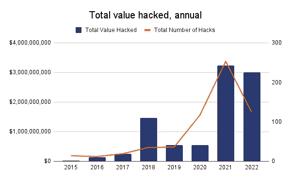**

**黑客们还有几个月的时间让 2022 年成为漏洞记录保持者。图片来源: [*链接分析*](https://twitter.com/chainalysis/status/1580312145451180032)**

**到目前为止，针对漏洞代码的公认壁垒有两个方面:**

*   **加强独立审计**
*   **通过奖金将臭虫狩猎货币化**

**但这就够了吗？根据 FTX·海德和密码亿万富翁萨姆·班克曼·弗里德的说法，事实并非如此。SBF 因涉足 CeFi 和 DeFi pies 而闻名，他提出了一个“5-5 标准”来减轻持续的 DeFi 损失。**

**在这一框架下，黑客将获得被盗资金的 5%，或 500 万美元，以金额较低者为准。通过这种方式，黑客将获得合作的激励，同时避免被抓后受到严厉的法律处罚。**

**反过来，那些拒绝 5-5 解决方案的黑客将被标记为恶意行为者，并被如此对待。如果说 SBF 有什么出名的话，那就是他对数字的追求。这些数字表明，如果这种 5-5 规则已经到位，开采排水**可以减少 98%** 。**

**可能会出现这样的情况，即沿着建议的 5–5 解决方案的路线的某些东西会成为加密领域的标准。最后，大多数数字资产参与者都认为，DeFi 的声誉受损必须以某种方式得到改善。**

****

# **元宇宙在这里，但它仍然是空的**

*   **Meta 降低了对地平线世界的期望，因为大多数虚拟世界仍然是空的 **(** [**链接**](https://tokenist.com/meta-lowers-expectations-for-horizon-worlds-as-most-virtual-worlds-remain-empty/) **)****

# **元宇宙仍在寻找黑仔应用**

**对于一个预计到 2030 年将达到 1.23 万亿美元规模的市场来说，元宇宙开局缓慢。在这个早期阶段，有两个元宇宙版本在发挥作用:**

*   **由 Meta 领导的集中、独立的虚拟公司空间。**
*   **分散的、基于区块链的平台试图有机地结合成一个更大的平台元网络。**

**因为 Meta 已经垄断了 VR 头戴设备的市场，并且它的口袋相当深，所以有理由认为 Meta 已经有了明显的领先优势。**

**他们确实这样做了:**

**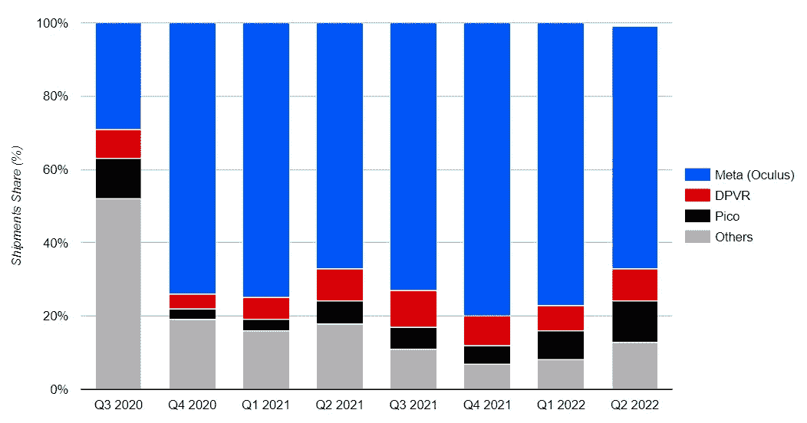**

***对于 Q2 2022，Meta 在全球混合现实(XR)设备(虚拟现实(VR) +增强现实(AR))方面拥有 66%的优势。图像鸣谢:* [*对位研究*](https://www.counterpointresearch.com/global-xr-ar-vr-headsets-market-share/) *。***

**然而，Meta 的元宇宙平台 Horizon Worlds 正在为增长而挣扎。它不仅提供了最新一代的视觉效果，而且不得不将每月活跃用户从 50 万减少到 28 万。目前，地平线世界每月活跃用户不到 20 万。**

**提醒一下，Meta 拥有世界上最大的应用生态系统。脸书、Instagram 和 WhatsApp 的月平均用户总数为 35 亿，仅脸书就有 20 亿。这意味着新缩减的 28 万的目标是脸书足迹的 0.014%。**

**但是元宇宙的太阳也不会照耀分散的领域。分散土地(MANA)的估值约为 12 亿美元，但它只有 8000 名日活跃用户。与传统游戏相比，一款 13 年前的非元宇宙游戏 *Left 4 Dead 2* 的日活跃用户数是这个数字的两倍，[为 16k。](https://steamcommunity.com/app/550)**

**元宇宙项目似乎严重缺乏杀手级应用，这种体验可以吸引人们参与元宇宙的所有其他活动。**

**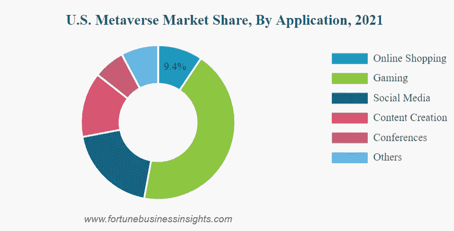**

***正如 2022 年风险投资基金所显示的，游戏是元宇宙的支柱。图片来源:* [*财富商业洞察*](https://www.fortunebusinessinsights.com/metaverse-market-106574)**

**没人知道这个杀手级应用会是什么，但还是有一些线索的。今年三月，[彭博认为](https://www.bloomberg.com/news/articles/2022-03-01/what-is-decentraland-metaverse-is-often-used-for-crypto-poker?leadSource=uverify%20wall)这将是分散的虚拟赌场中的扑克游戏。**

**不管它是什么，当它到来时，它可能会像野火一样传播，但它需要有一个社会因素。这是元宇宙需要看到其预期的受欢迎程度的缺失部分吗？**

**[**享受 5MF？点击转发给三个朋友。**](mailto:info@tokenist.com?subject=Check+this+out+&body=I%E2%80%99ve+been+reading+Five+Minute+Finance,+and+I+know+you%E2%80%99d+enjoy+it+too.+It%E2%80%99s+a+weekly+email+that+covers+the+most+important+trends+in+finance.+I+learn+something+new+every+time+I+read+it!+Check+it+out+here:+https://tokenist.com/newsletter/?utm_source=email_gr_btn)**

****

# **潜入比特币的币天毁灭:底部在吗？**

*   **比特币时代(CDD):概述 [**(链接)**](https://academy.glassnode.com/indicators/coin-days-destroyed/cdd-coin-days-destroyed)**

# **比特币被摧毁的天数达到自 2012 年以来仅出现过三次的水平**

**比特币正在发生一种有趣的动态，告诉我们“聪明的钱”目前是如何看待比特币的。**

**我们可以看到高净值投资者的行为，因为比特币网络捕捉到了每枚硬币的 BTC 量和寿命。**

**那么，BTC 目前是否被用于交易——或者说，它是静止不动的？**

**[硬币销毁天数](https://academy.glassnode.com/indicators/coin-days-destroyed/cdd-coin-days-destroyed) (CDD)指标将两者结合起来，给长期未动用的 BTC 一个权重。这是因为它能告诉我们一个休眠的 BTC 何时被花掉或交易——它揭示了一些长期持有人的情绪。**

**目前，CDD 水平非常低，为 0.34。**

**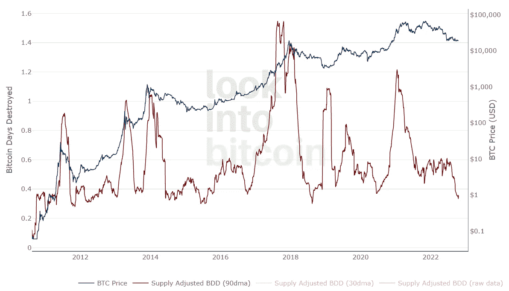**

***比特币的 CDD 处于自 2012 年以来只有少数几次出现的水平。图片来源:*【LookIntoBitcoin.com】**

***在比特币的历史上，CDD 只有三次跌入这么低的区间。人们可能会认为，这表明在明显的熊市中，比特币的日交易量也很低。但事实并非如此，因为事务计数在一年多的时间里一直保持相同的范围。***

***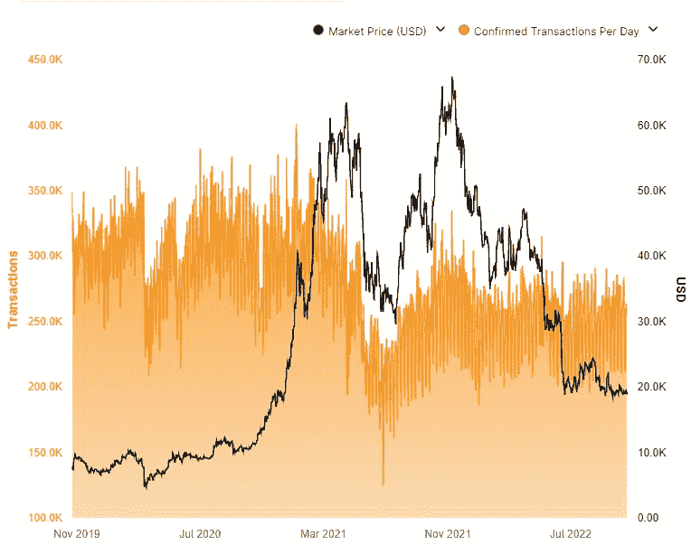***

****过去一年，比特币的交易数量保持稳定。图片来源:*[*CoinWarz.com*](https://www.coinwarz.com/mining/bitcoin/hashrate-chart)***

***那么这一切意味着什么呢？***

***结合这两个图表，我们可以看到长期比特币持有者正在继续持有。反过来，最近交易的比特币继续交易，构成了 BTC 交易量的主要部分。***

***想想也有道理。长期持有人显然有着坚定的信念，并经受住了此前的波动。为什么他们现在会改变主意？***

***问题变成了这样:如果全球宏观经济状况恶化，长期持有人持有的信念(应该继续下去)是否足以抵御未来的抛售压力？***

***自然只有时间能证明。但就目前而言，比特币最近达到了与 GDP/美元的波动平价——这表明在可预见的未来，价格将进一步横向波动:***

***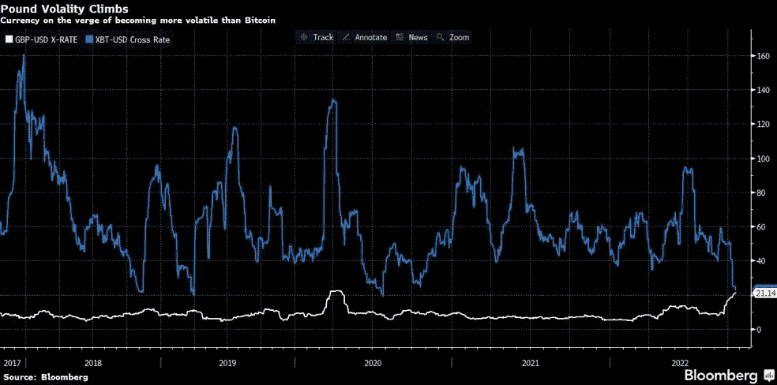***

****XBT 是比特币的另类缩写。随着央行努力应对流动性，比特币的波动性保持着惊人的稳定。图片来源:彭博****

******

# ***回顾过去:$BITO 已经上线一年了***

*   ***Proshares 比特币策略 ETF (BITO)表现历史 [**(链接)**](https://finance.yahoo.com/quote/BITO/performance/)***

# ***美国将 BTC ETF 风险委托给了仅用于期货的公司***

***在缺乏现货交易的 BTC ETF 的情况下，基于期货的 ETF 非常丰富。***

***总体而言，比特币计价的期货占据了芝加哥商业交易所市场未平仓合约的一半。对于比特币来说，最大的此类 ETF 之一是 BITO，现在已经交易了整整一年。***

***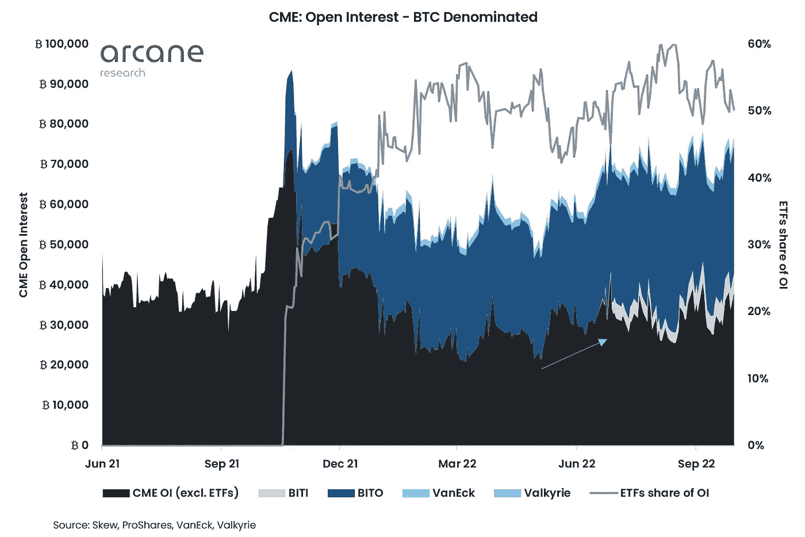***

****图像功劳:* [*奥术研究*](https://arcane.no/research)***

***人们选择像 BITO 这样的交易所交易基金来接触比特币，但没有责任和潜在的风险将 BTC 实际储存在钱包里。这对资产管理公司和基金尤其有吸引力。***

***目前，BITO 持有价值 6.3441 亿美元的未平仓合约，表现落后于现货交易的 BTC-1.79%。***

***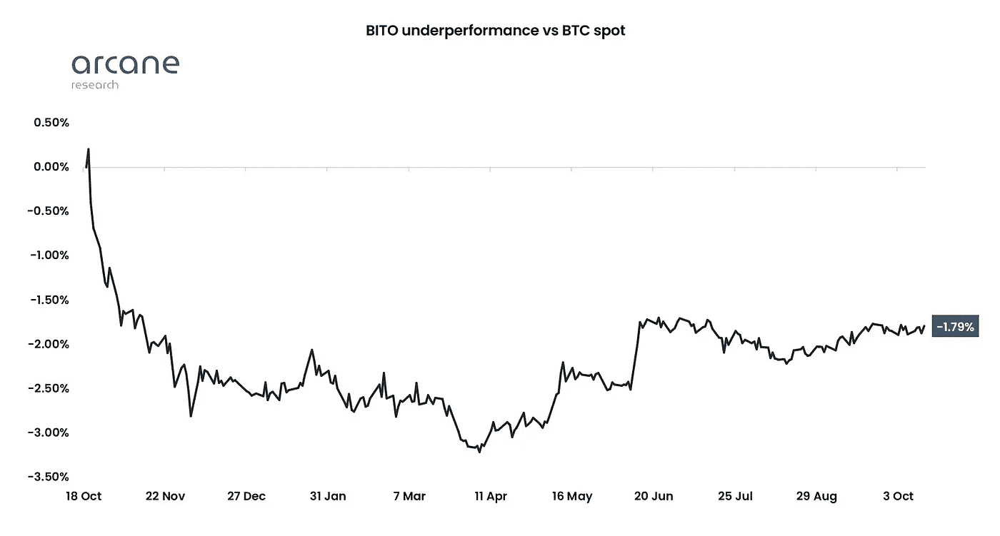***

****图像功劳:* [*奥术研究*](https://arcane.no/research)***

***这意味着 BITO 投资者不仅“获得”了 [-71.79%](https://www.etf.com/BITO#overview) 的年总回报，还遭受了额外的几个百分点，期货合约也是如此。这是因为他们不得不支付期货的滚动成本——关闭最初的合约，并打开一个新的合约，以保持他们在 BTC 的敞口。***

***不用说，展期成本一直让基于期货的 ETF 不受欢迎。为 BTC 投资的下一个时代批准现货交易 ETF，将取决于美国证交会主席加里詹斯勒(Gary Gensler)。出于某种原因，他一直拒绝他们，即使加拿大在 2021 年 2 月批准了一项。***

***尽管持有较低的 4.4725 亿美元 AuM，目的比特币 ETF (BTCC。加拿大)仍然保持着令人印象深刻的兴趣。毕竟，加拿大股市比美国股市小 24 倍。Gensler 知道自己掌管着全球 59.9%的股票，他的行动表明，他并不太热衷于打开一些人认为是机构投资 BTC 的闸门。***

******

# ***欧盟的能源形势如何影响秘密采矿***

*   ***欧盟根据能耗对加密货币进行分级:报告 **(** [**链接**](https://tokenist.com/eu-to-grade-cryptocurrencies-based-on-energy-consumption-report/) **)*****

# ***欧盟表示，成员国必须准备在今年冬天停止地下开采***

***众所周知，欧洲似乎正处于能源危机的边缘。***

***在高昂的能源成本和猖獗的通货膨胀中，德国的传统企业到处都在报告破产。以下是本周席卷欧盟海岸的破产浪潮的一部分:***

*   ***Wolff Hoch-und Ingenieurbau:有 125 年历史的建筑公司***
*   ***博达:有 130 年历史的糖果公司***
*   ***Borgers: 156 年历史的汽车供应商***
*   ***卡普斯:170 岁的肥皂制造商***

***情况真的糟糕到魏玛的恶性通货膨胀的幸存者现在都无法开门了吗？***

***对于整个欧盟来说，这是相当糟糕的，因为德国是其经济引擎和最大的预算贡献者。***

***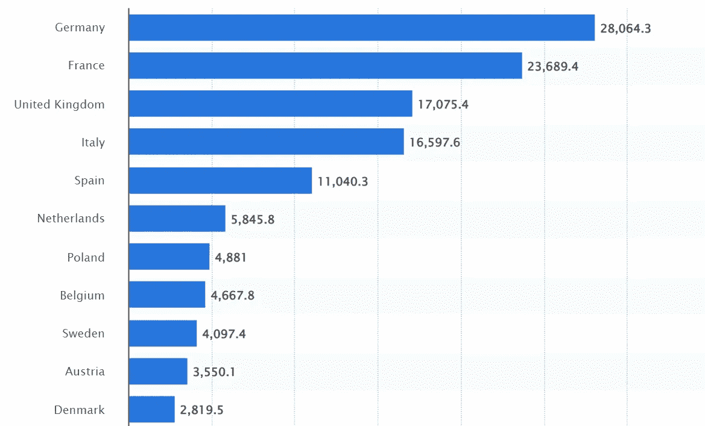***

****2020 年欧盟预算中成员国缴纳的金额(以十亿欧元计)，图片来源:*[*【Statista.com】*](https://www.statista.com/statistics/316691/eu-budget-contributions-by-country/)***

***在这种日益萎缩的经济形势下，欧盟正在关闭能源闸门。欧盟委员会的最新提议是根据加密货币的区块链网络消耗的电量对其进行评级。***

***当然，因为区块链使用经济赌注的证据，他们是最绿色的。以太坊清楚地证明了这一点，它在今年 9 月放弃了工作证明，减少了约 99.95%的能源足迹。***

***相比之下，由于比特币等工作证明(PoW)区块链使用高能耗的计算证明来保护交易，因此它们被列入了欧盟的绿色目标名单。欧元区目前持有全球 10%的电力矿业公司。如果出现电力短缺，欧盟除了通过停止税收优惠来打击他们的积极性之外，还可以暂停他们的运营。***

***目前，跨越 14690 个节点的比特币网络估计每年使用 131.43 TWh 。这与瑞典 1000 万公民的能源消耗不相上下。***

***然而，出于同样的环保考虑，比特币的支持者认为 BTC 已经比欧盟更环保了。虽然欧盟使用 43.5%的可再生能源，但据估计，比特币网络使用可再生能源的能源消耗占其能源消耗的 59.4%。***

***综合考虑，加密货币开采和欧盟能源危机的情况在今年冬天可能会变得非常有趣。***

# ***本周推特***

***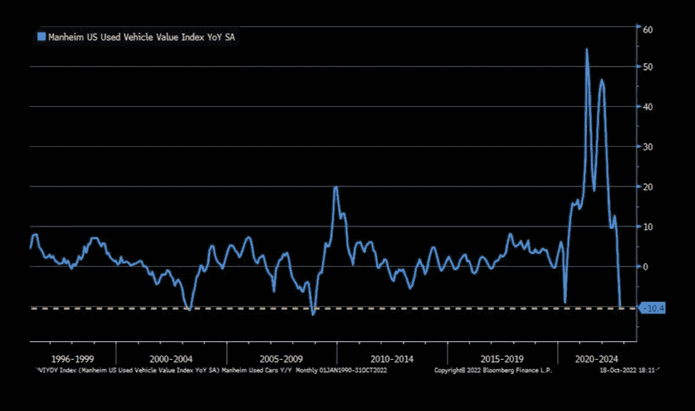***

> ***我不知道谁需要听这个，但是二手车价格下降了。***
> 
> ***这是大规模的通货紧缩。***

***[**@GRDecter**](https://twitter.com/GRDecter/status/1582769024080805895)***

> ***每个密码和替代硬币交易者都应该知道的 5 个技术分析工具！***

***[**@MacnBTC**](https://twitter.com/MacnBTC/status/1582709619998089216?s=20&t=ElQttELx3ZXiAIfcMHIC9A)***

> ***了解负责数十万亿美元加密交易量(线程)的简单数学公式***

***[**@cole0x**](https://twitter.com/cole0x/status/1581023044511813632?s=20&t=75Xi3ouUo1YY-WBfQHrfpg)***

***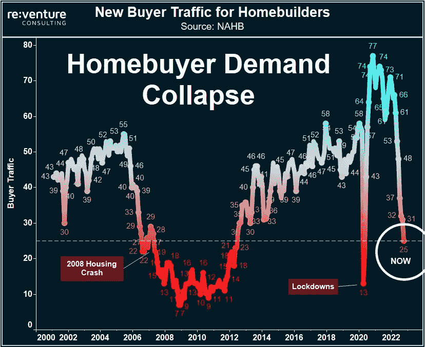***

> ***购房者流量跌至 2008 年房市崩盘以来的最低水平。***
> 
> ***同比增长 61%。不太好。***

***[**@ nicgger Li 1**](https://twitter.com/jasongoepfert/status/1580612733355327488)***

> ***过去一年商品价格的变化…***
> 
> ***取暖用油:+42%***
> 
> ***玉米:+28%***
> 
> ***小麦:+15%***
> 
> ***天然气:+13%***
> 
> ***大豆:+12%***
> 
> ***美国消费者物价指数:+8.2%***
> 
> ***布伦特原油价格上涨 6%***
> 
> ***汽油:-1%***
> 
> ***WTI 原油:-1%***
> 
> ***糖:-1%***
> 
> ***咖啡:-5%***
> 
> ***黄金:-6%***
> 
> ***白银:17%***
> 
> ***锌:22%***
> 
> ***棉花:-24%***
> 
> ***木材:-27%***
> 
> ***铜:29%***

***【T4**@ charliebilello*****

# ***加入五分钟金融时事通讯。***

******

***[Sign up here — it’s free.](https://tokenist.com/newsletter/)***

******

***[t.me/thetokenist](http://t.me/thetokenist)***

******

***twitter.com/thetokenist***

> ***交易新手？尝试[加密交易机器人](/coinmonks/crypto-trading-bot-c2ffce8acb2a)或[复制交易](/coinmonks/top-10-crypto-copy-trading-platforms-for-beginners-d0c37c7d698c)***