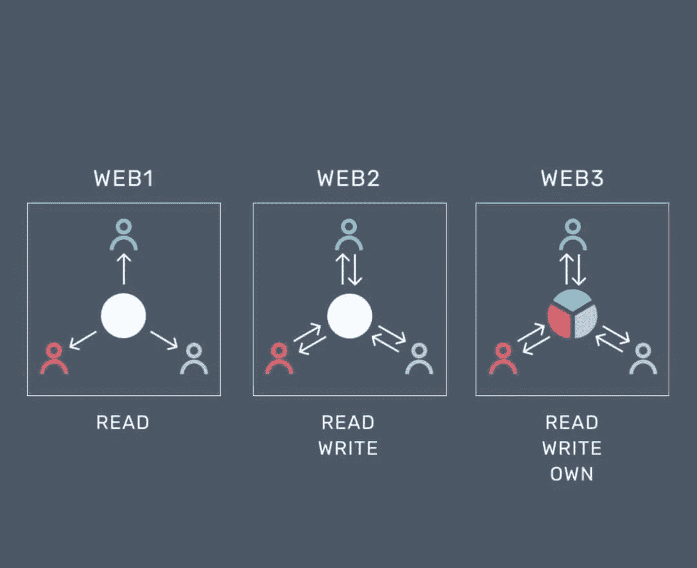
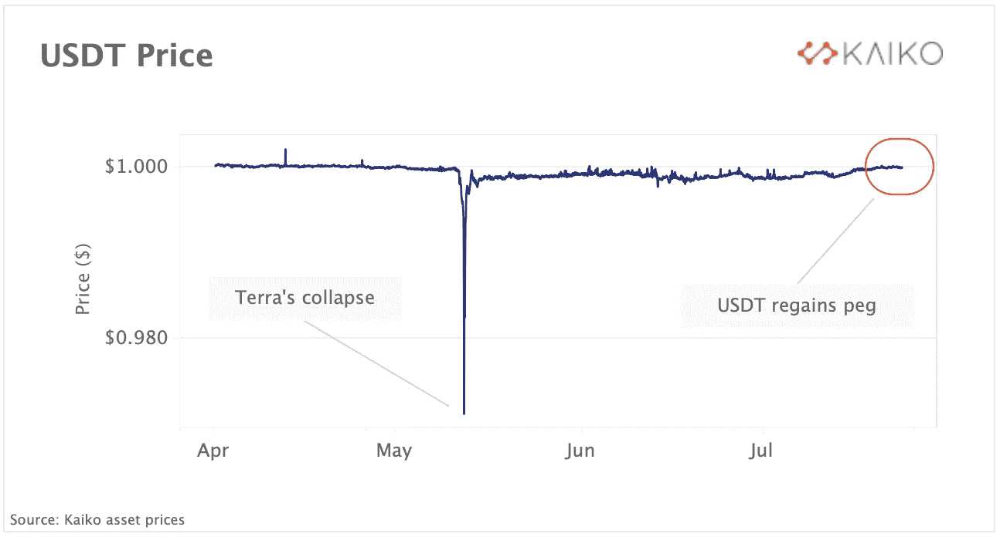
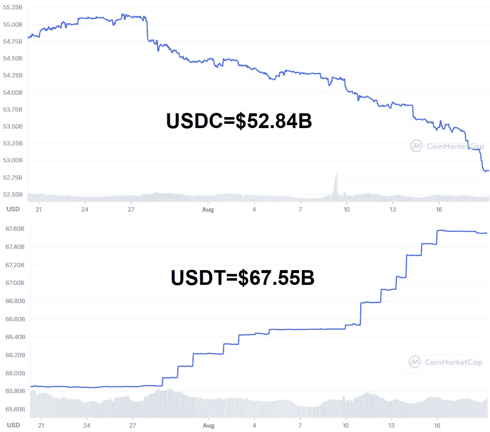
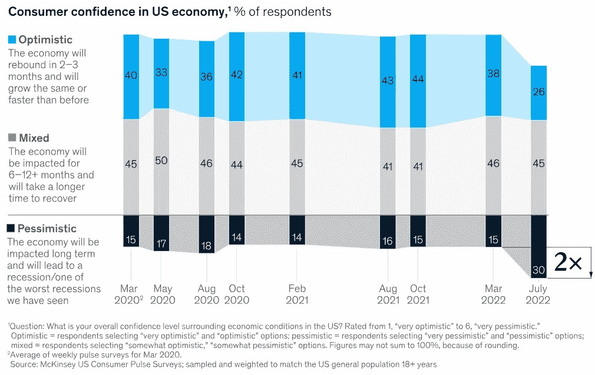
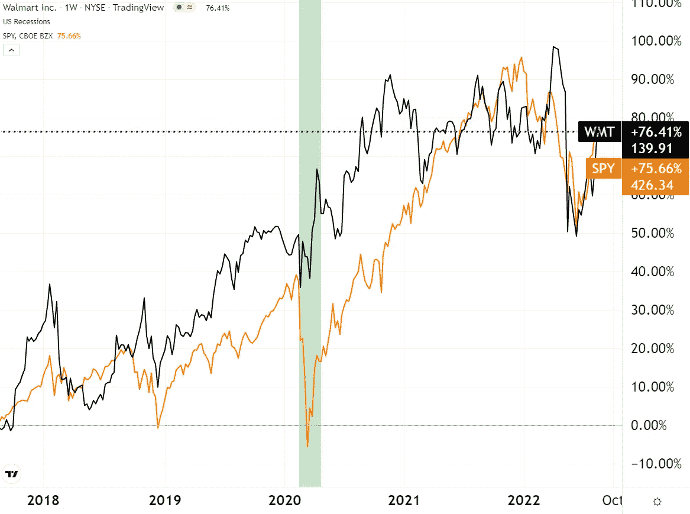
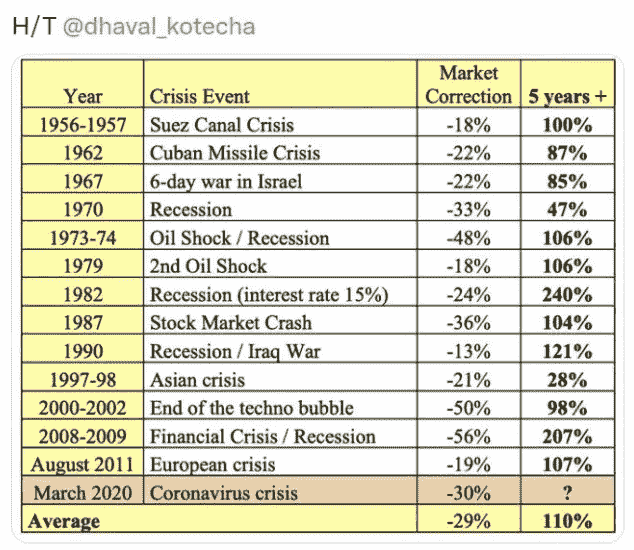
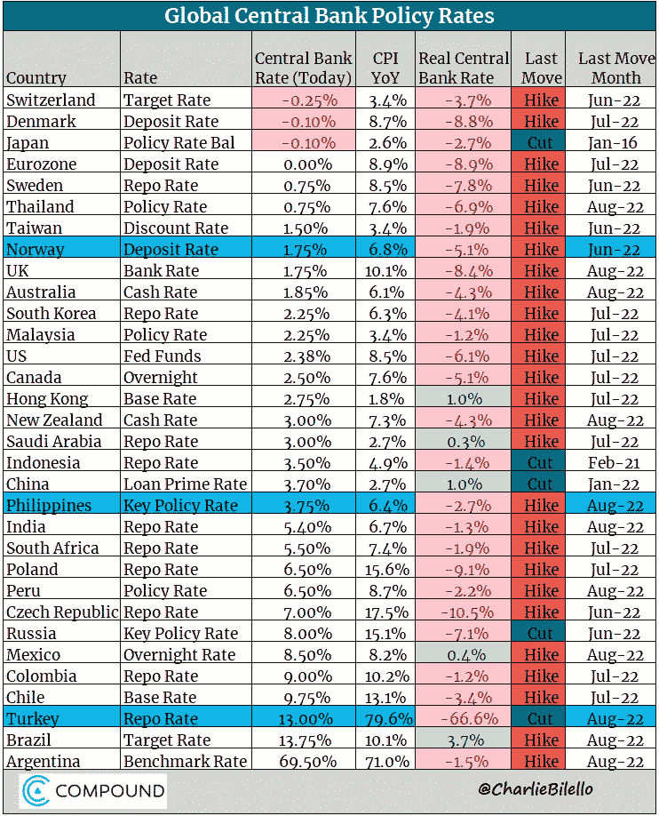
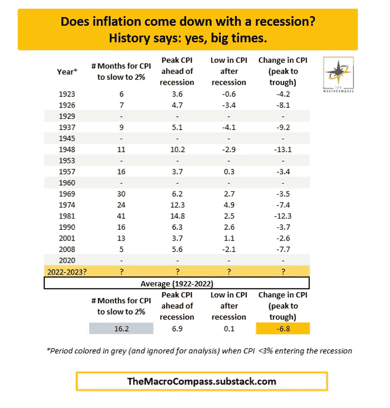
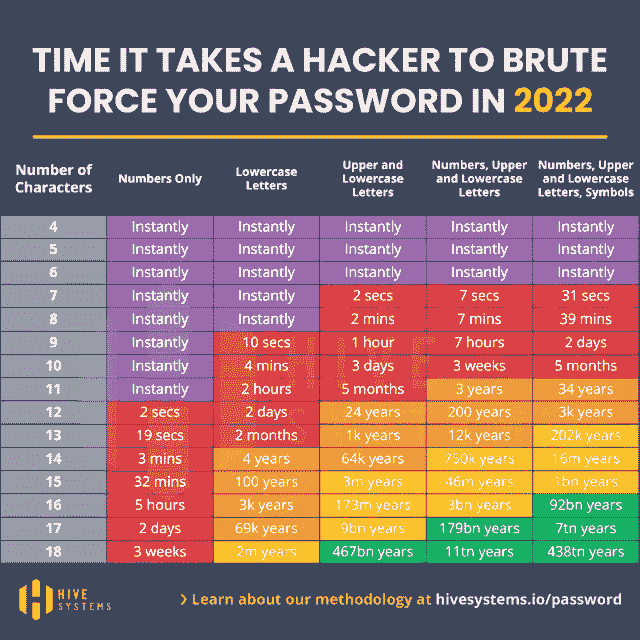

# 五分钟金融:BURRY 的大动作，IRS-CRYPTO，一只股票在之前的 5 次衰退中击败了 S&P

> 原文：<https://medium.com/coinmonks/five-minute-finance-burrys-big-move-irs-crypto-one-stock-beat-s-p-in-5-previous-recessions-2cb69df879f0?source=collection_archive---------30----------------------->

# 5 分钟的金融时事通讯——解释发生了什么，为什么。

# 让我们看看这周发生了什么:

*   alphabet 15 亿美元进军区块链投资
*   国税局收到法院命令，追溯追踪加密交易
*   泰瑟(USDT)正在翻开新的审计篇章
*   在之前的 5 次衰退中跑赢 S&P500 的股票
*   大空头迈克尔·伯里放弃市场船

# Alphabet 在 Web3 中看到 Alpha

*   Alphabet 迄今 15 亿美元区块链投资明细 **(** [**链接**](https://tokenist.com/break-down-of-alphabets-1-5b-blockchain-investments-so-far/) **)**

# Web2 会成功构建 Web3 吗？

人们普遍认为下一代互联网——web 3——是读写自有的，而不是 Web2 的读写模式。

*图片由* [*推特*](https://twitter.com/cryptocrushr/status/1473341578366406661?lang=he) *提供。*

Web1 开启了获取大量信息的新途径。人们从手动翻阅百科全书到通过谷歌搜索查询。

Web2 允许人们以新的方式创建内容和交流。例如，有了“Web2 ”,可以上网的个人可以通过社交平台无缝发布帖子和照片。

Web3 的目标是让出版商能够拥有他们创作的内容，并获得部分收入。以 twitter 上的一个人为例，他有一大群非常活跃的追随者。Twitter 从向这个人的追随者展示的各种广告中获得收入，但这个人并没有在 Web2 中分得一杯羹。

Web3 中的“自己的”部分来自于无信任共识机制的去中心化，这种机制通过区块链实现了对等交易。比特币铺平了这条道路，成为第一个没有首席执行官或治理委员会的 P2P 货币。

虽然比特币的智能合约专注于使货币市场公平，但 Web3 将智能合约的灵活性扩展到了极致:将传统金融和在线所有权的所有方面都标记出来。

比特币最初是一项实验。它的隐私和去中心化爱好者是早期采用者，在几年的时间里，这有助于提高其网络的安全性。

Web3 的情况有些不同。它得到了相当多的资金来加速发展。

Web3 最大的资助者是熟悉的名字。摩根士丹利(MorganStanley)和贝莱德(BlackRock)分列第三和第二位，从 2021 年 9 月至 2022 年 6 月分别为 11 亿美元和 17 亿美元。Web3 的最大投资者不是别人，正是谷歌的母公司 Alphabet，在同一时期通过其四个风险投资工具投资了 15 亿美元:

*   资本 G: 106 项投资对 25 项退出。
*   全球之声:(前谷歌风投)988 笔投资 vs 225 笔退出。
*   Gradient Ventures: 158 项投资对 17 项存在。
*   谷歌:253 起收购，181 起投资，42 起退出。

就像 Alphabet 涉足所有 Web2 领域一样，它的 Web3 投资也遵循同样的基础设施道路。Alphabet 挑选领先的 Web3 阻塞点:

*   Dapper Labs:由于其 Flow 区块链和 Visa/MasterCard 支付轨道，所有游戏化和 NFT 的事情都从主流体育开始。谷歌甚至通过其云服务器来提高流量，以实现最高效率和低延迟。
*   阻击:企业很少由个人经营，这使得联合数字监管变得很麻烦。Fireblocks 通过多方计算(MPC)钱包解决了这个问题。到目前为止，Fireblocks 网络已经处理了 800 个组织之间 2 万亿美元数字资产的转移。
*   Voltage:闪电网络(Lightning Network)的主要服务器提供商，闪电网络是比特币通过促进近即时支付而大规模普及的门户。
*   数字货币集团(DCG):你可能听说过，这家风险投资公司为几乎所有值得一提的区块链初创企业提供了资金。在 284 项投资中，DCG 是 29 项投资的主要资助者，从加密奖励计划到用于风险评估的 Web3 数据收集。

Web3 确实需要通过令牌化来获得所有权，但迄今为止，它似乎是由 Web2 公司决定的。

[**享受 5MF？点击转发给三个朋友。**](mailto:info@tokenist.com?subject=Check+this+out+&body=I%E2%80%99ve+been+reading+Five+Minute+Finance,+and+I+know+you%E2%80%99d+enjoy+it+too.+It%E2%80%99s+a+weekly+email+that+covers+the+most+important+trends+in+finance.+I+learn+something+new+every+time+I+read+it!+Check+it+out+here:+https://tokenist.com/newsletter/?utm_source=email_gr_btn)

# 国税局加密行动的开始？

*   法院授权送达无名氏传票，寻求使用加密货币的美国纳税人的身份 **(** [**链接**](https://www.justice.gov/opa/pr/court-authorizes-service-john-doe-summons-seeking-identities-us-taxpayers-who-have-used-2) **)**

# 追溯性避税钓鱼

ICYMI:美国通胀削减法案(US Inflation Reduction Act)增加了近 800 亿美元的 IRS 资金，并增加了一支名副其实的 87，000 人的新税收大军。

可以肯定地说，美国国税局正在通过追查以前的交易，加强对加密的关注。

上周，美国国税局向加密经纪商 SFOX 发出了“无名氏”传票。

美国国税局在不确切知道自己在追查谁或任何其他细节时，会采取这一法律行动。因此，它需要，嗯，可以说是自由狩猎许可证。

美国国税局不仅会检查 SFOX 记录，以核实是否报告了所有加密货币交易，而且会追溯执行。

*“在 2016 年至 2021 年期间通过 SFOX 进行了至少相当于 2 万美元的加密货币交易的美国纳税人。”*

此前，国税局向比特币基地、北海巨妖和 Circle 发出过此类传票。从更大的范围来看，这是完全可以预测的。就在昨天，韩国金融情报机构(KoFIU)通知 [16 家加密交易所](https://www.fsc.go.kr/eng/pr010101/78319)，如果它们不注册，就让它们的客户报告。

# 泰晤士报掀起了它的审计游戏

*   Tether 雇佣新的审计员发布每月储量证明 **(** [**链接**](https://tokenist.com/tether-hires-new-auditor-to-publish-monthly-proof-of-reserves/) **)**

# USDT 最终会走出投机的阴影吗？

具有讽刺意味的是，不能夸大稳定信贷对整个 DeFi 经济的支撑作用，因为它们是智能合约抵押品的主要借贷来源。因为它们是象征性的美元，稳定的硬币为 crypto 的疯狂价格波动提供了避难所，对 DeFi 的运行至关重要。

在 Terra 的算法 UST 稳定圈表明它不可能是稳定的之后，所有的稳定圈现在都受到双重审视。在那次崩盘后，USDT 曾短暂地与美元脱钩，这加剧了人们的担忧，即在大量投资者希望将其 USDT 稳定货币兑换成美元的极端市场条件下，其外汇储备不足。

Tether 的 depeg 简短而轻微，但仍然引起了关注。图片来源: [*Kaiko*](https://marketing.kaiko.com/tether-regains-its-peg-after-68-days)

USDC(第二大、监管最严格的稳定币)的发行者 Circle 抓住了这个机会，推出了每周审计和详细的资产明细。相比之下，泰瑟的 USDT 总是受到怀疑。它是否完全以可赎回的现金储备作为抵押？

以下是用户对这种怀疑提出的一些理由:

*   支付了 1850 万美元的罚款，因为对 USDT 的美元储备进行虚假申报。
*   Bitfinex 交易所利用 USDT 掩盖失踪的8.5 亿美元。
*   在 2021 年 7 月持有大约 300 亿美元的商业票据，但保证到 2022 年 11 月将减少到零。
*   尽管是最大的稳定币发行者，但他甚至没有出席 12 月份的[国会关于稳定币的听证会。](https://tokenist.com/tether-didnt-even-show-up-to-cryptos-biggest-regulatory-hearing-yet/)
*   否认与陷入困境的中国房地产开发商恒大有关系，同时泰瑟的律师拒绝透露泰瑟是否持有中国商业票据作为抵押品。

有一次，约翰·贝茨，诺贝尔国际银行的前首席执行官(持有一些系绳基金),非常不利地陷害了 USDT:

*“这不是稳定币，这是高风险的离岸对冲基金，”*

他的这一观点基于 Giancarlo Devasini(系绳首席财务官)在 CeFi 的各种平台(如破产的 Celsius)上使用系绳资金进行贷款的习惯。

所有这些的结果是，USDC 一直在朝着 USDT 市值的方向缓慢前进。但是最近，这种趋势停止了:

*在过去的一个月里，USDT 的市值上升了+2.6%，而 USDC 的市值下降了-3.5%。图片来源:CoinMarketCap*

正当 USDC 处于上升期时，在冻结了一些与龙卷风有关的 USDC 后，它失去了一些动力。USDC 可能会受到监管，但 Circle 也享有贝莱德价值 4 亿美元的信心，这在整个社交媒体圈有点缺乏可信度。

随着观念的转变，Tether 现在正在做 USDC 在 USDT 稍微放弃的时候所做的事情——升级它的审计游戏。Tether 选择了 BDO 意大利作为其新的审计公司，负责其美元储备，隶属于全球首屈一指的独立公共会计公司 BDO Global。

此外，系绳宣布，它将做每月审计报告，而不是每季度。

无论泰瑟过去的错误行为被最大限度地负面看待，稳定的硬币竞争似乎正在产生一种更强大的金融产品。

最后，很能说明问题的是，亿万富翁 FTX 首席执行官山姆·班克曼-弗里德，这位拒绝救助 Celsius 的加密救助之王，[没有任何束缚之忧](https://www.forbes.com/sites/stevenehrlich/2022/06/28/bankman-fried-some-crypto-exchanges-already-secretly-insolvent/?sh=333f93f847f7):

*“我认为真正看跌系绳的观点是错误的……我不认为有任何证据支持它们。”*

# 一些股票似乎能抵御衰退

*   如果美国进入衰退，沃尔玛能胜过间谍吗？ **(** [**)链接**](https://tokenist.com/can-walmart-outperform-the-spy-if-the-us-enters-recession/) **)**

# 衰退影响:投资者退出自由支配股票

虽然美联储正在努力为过热的经济降温，但个人购买力却在下降。穿过噪音的数据是清楚的:

*   美国家庭债务比 Covid 之前的水平高出 2 万亿美元，达到创纪录的 16.15 万亿美元，表明储蓄(即人们的购买力)正在迅速萎缩。
*   不稳定的消费者情绪，从 82%的报告购买力焦虑，两倍于早期的 Covid 悲观。

*图片来源:* [*麦肯锡&公司*](https://www.mckinsey.com/business-functions/growth-marketing-and-sales/our-insights/the-great-uncertainty-us-consumer-confidence-and-behavior-during-inflationary-times)

那么，最大的问题是，哪些股票能够抵御这种悲观情绪和购买力下降？在这份名单中，最有可能的是那些依赖大规模生产的公司，以及生活必需品和非必需品的公司。

沃尔玛在 2020 年 3 月的“技术性”衰退中表现尤为出色:

*WMT vs S&P 500——衰退期间主食和非必需品之间的反转差异(标为绿色)。沃尔玛已经公布了高于预期的利润*[*Q2 2013 财年收益*](https://corporate.walmart.com/newsroom/2022/08/16/walmart-releases-q2-fy23-earnings) *。图片来源:交易视图*

萨托夫咨询公司的商业战略专家马克·萨托夫清楚地解释了这种衰退心态。

“如果你在打折的世界里，人们会以最低的价格来找你。如果你不低于沃尔玛、低于好市多、低于亚马逊，人们就不会去那里，尤其是在经济衰退时期。”

历史同意。沃尔玛(WMT)在前五次衰退中击败了 S&P500。

# 迈克尔·伯利是否预见到了即将到来的经济灾难？

*   迈克尔·伯里的对冲基金抛售 Meta，Alphabet 在 Q2 整肃 **(** [**链接**](https://tokenist.com/michael-burrys-hedge-fund-dumps-meta-alphabet-in-q2-purge/) **)**
*   随着中国将政策利率下调 10 个基点，油价下跌

# Burry 的市场退出预示着一些不好的事情，但我们不知道有多坏

在次贷危机中，迈克尔·伯里(Michael Burry)做出了正确的决定，他卖掉了除 Geo Group(一家私人监狱和精神健康运营商)之外的所有股票，赚了 1 亿美元。

Burry 读了什么书来打这个电话？首先，抵押贷款需求降至 22 年低点，房屋销售比 6 月份下降了-5.9%。这表明新屋建设的衰退，但不一定是房价的衰退，自去年以来房价仍然上涨了 11%。

也就是说，房价仍然是 33 年来最低的，还有很大的下跌空间。毕竟，在 2008 年大衰退期间，房价下跌了-15.9%，是 17 年来的最大跌幅。

联信银行首席经济学家比尔·亚当斯将这些指标放入衰退框中:

“结合科技、大型零售、制造业和外国经济的低迷，一场真正的衰退看起来更有可能在明年到来。”

谈到制造业和外国经济，中国经济放缓幅度如此之大，以至于中国央行突然降息来刺激经济。随着中国国内生产总值(GDP)下滑至+0.4%，这个世界制造业中心的零售、工业生产和固定资产投资都没有达到所有的一致预期。

但这并没有结束。欧元区不断以发达国家前所未有的电价让世界感到惊讶。可以说，欧盟购买力的下降必然会减少美国的经济活动，进一步冷却经济。

这些对生活成本的冲击不断降低消费者支出，这有助于降低通货膨胀。如果美联储对通胀下降感到满意，额外的市场抛售不太可能发生，因为更激进的加息将导致需求减少。

因为原油价格推动了一半的通胀，并且它们已经下降到 2 月份的水平，目前的市场共识是美联储将在 9 月 21 日的会议上加息 50 个基点，这是对之前 75 个基点的暂缓。

虽然这将降低额外市场抛售的可能性，但出于某种原因，Burry 对前景并不乐观。

尽管考虑到所有的事情，但请记住一切都是暂时的:

# 本周推特

> 德国妈妈 PPI 预期为 0.7%。之前是 0.6。
> 
> 现在是 5.3%。你没有看错。
> 
> 晚安。
> 
> [PPI 是生产者价格环比通胀]

[**@不寻常 _ 鲸鱼**](https://twitter.com/unusual_whales/status/1560539873148252163)

> 刚刚收到:自 8 月 1 日以来，比特币矿工卖出了 6135 BTC(1.33 亿美元)。

[**@ watcherguru**](https://twitter.com/WatcherGuru/status/1560579805560549376)

> 全球中央银行更新:
> 
> -挪威:加息 50 个基点至 1.75%(第五次加息)。
> 
> -菲律宾:加息 50 个基点至 3.75%(第四次加息)。
> 
> -土耳其:降息 100 个基点至 13.00%(尽管通胀率升至 80%，货币崩溃，但仍第五次降息)。

[**@ charliebilello**](https://twitter.com/charliebilello/status/1560455759858630657)

> ***Bullard:美联储可以在大约 18 个月的时间内降低通胀
> 
> 当然，但历史表明，在此期间，需要经历一场衰退才能将通胀率从 9%降至 2%。

[**@MacroAlf**](https://twitter.com/MacroAlf/status/1560424053764022272)

> 2022 年黑客破解你的密码需要多久？
> 
> 教训:始终使用强而复杂的密码。

[@ mayhem markets](https://twitter.com/Mayhem4Markets/status/1560342264605442054)

# 加入五分钟金融时事通讯。

Sign up here — it’s free.

[t.me/thetokenist](http://t.me/thetokenist?utm_source=getresponse&utm_medium=email&utm_campaign=thetokenist&utm_content=%E2%9C%8B%20FMF%3A%20BoA%20Readying%20for%20BTC%2C%20Pot%20Goes%20Federal%2C%20More%20Inflation)

twitter.com/thetokenist

> 交易新手？尝试[加密交易机器人](/coinmonks/crypto-trading-bot-c2ffce8acb2a)或[复制交易](/coinmonks/top-10-crypto-copy-trading-platforms-for-beginners-d0c37c7d698c)