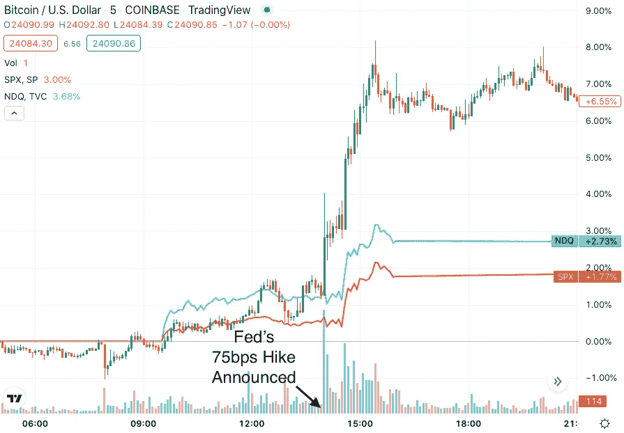
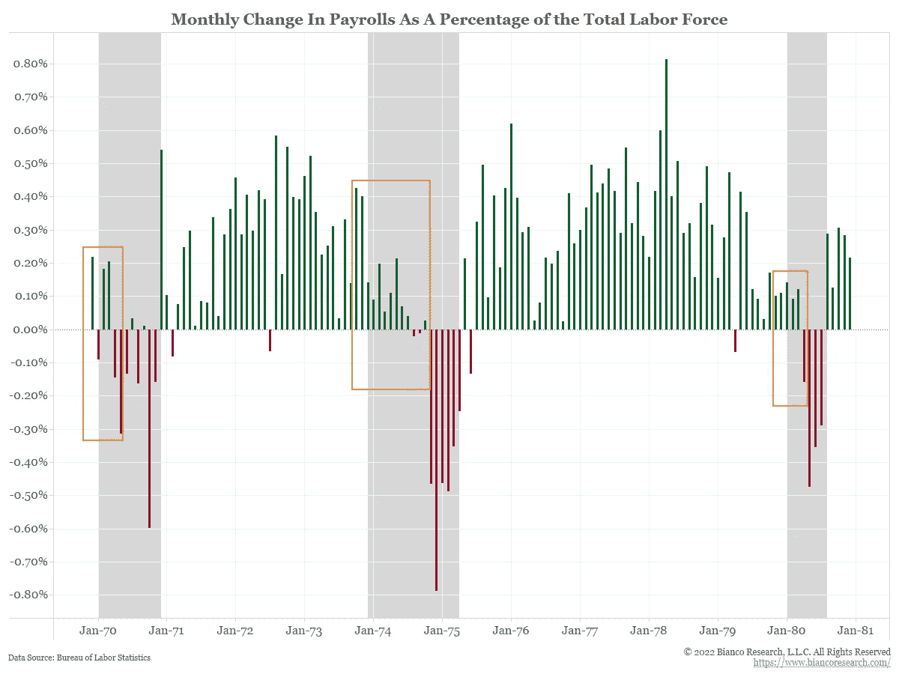
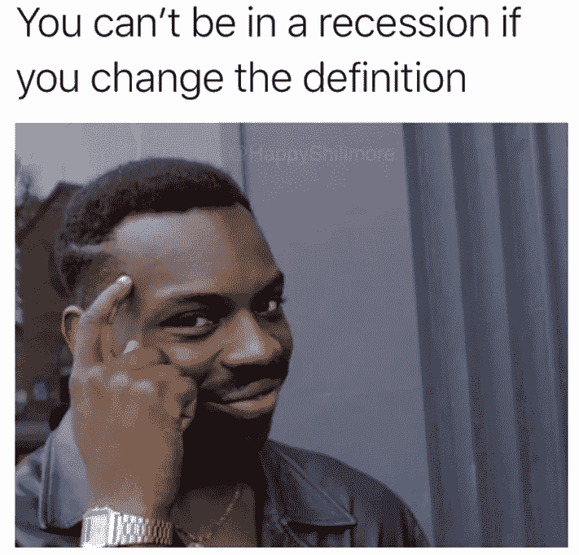
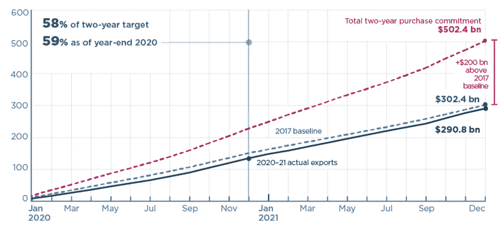
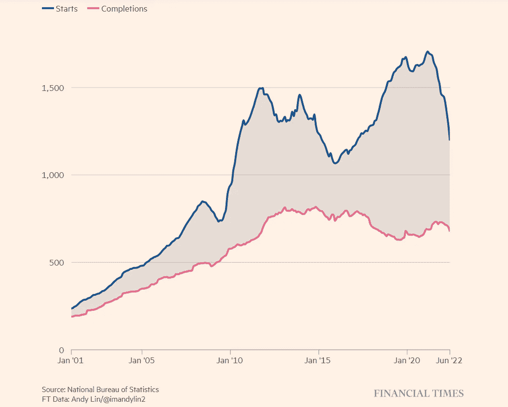
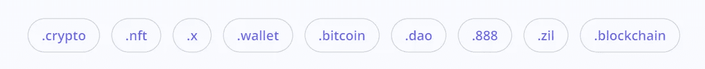
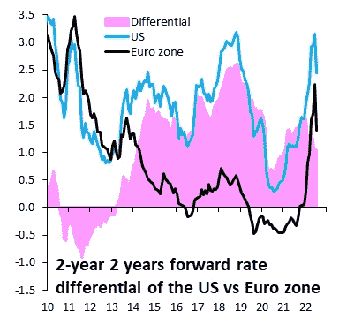
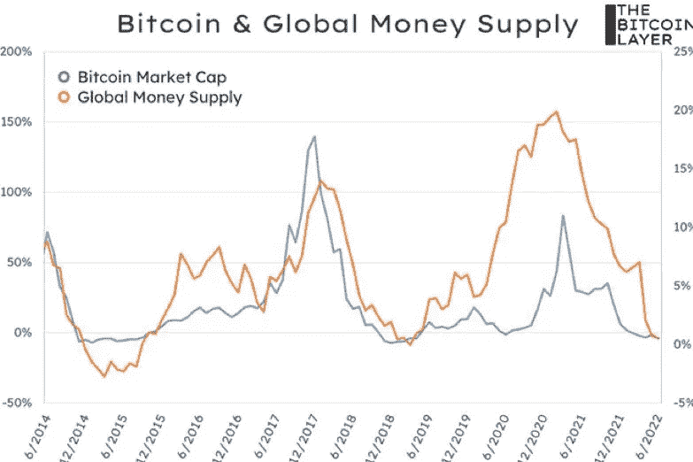
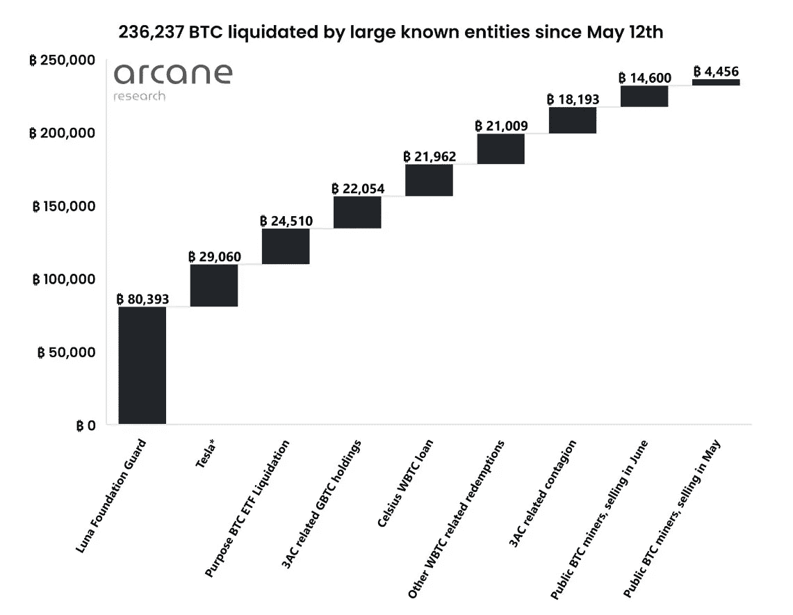

# 五分钟财经:改变“衰退”的定义，关注元宇宙的增长，更多

> 原文：<https://medium.com/coinmonks/five-minute-finance-changing-the-definition-of-recession-all-eyes-on-metaverse-growth-more-687584aa0920?source=collection_archive---------20----------------------->

# 5 分钟的金融时事通讯——解释发生了什么，为什么。

# 让我们看看这周发生了什么:

*   解释市场对美联储最新加息的反应
*   中国在每个人日常生活中的重要作用
*   元宇宙预计将出现大幅增长
*   通用 P2P 应用上的闪电网络
*   比特币基地:美国证券交易委员会通过执法进行监管

# 美联储“鸽派”加息后市场上涨

*   加息 75 个基点降低美国经济软着陆的几率 **(** [**链接**](https://tokenist.com/75-bps-hike-reduces-chances-of-a-soft-landing-for-us-economy/) **)**
*   白宫淡化经济衰退，第二季度国内生产总值萎缩

# 美联储谈话要点曝光

上周，我们解释了美联储的老把戏。当美联储暗示加息更高，如 100 个基点(整整一个百分点)，但停留在之前的新高(75 个基点)时，市场将其视为好消息。这正是上周三美联储宣布加息 75 个基点时发生的情况。

*比特币，S & P500，纳斯达克综合指数周三对美联储加息做出反应。图片来源:* [*交易查看*](https://www.tradingview.com/)

不要忘记最近的过去:我们看到近几年的零利率，以及 5 月份(仅仅)50 个基点的加息，这引发了大规模的市场抛售，因为更高的资本成本吓得投资者放弃了他们的头寸。

周三，美联储发表声明，增强了市场的抗冲击能力:

*“我们现在所处的水平与我们对* ***中性利率*** *的估计大体一致，在我们的加息周期前期加载之后，到目前为止，我们将更加依赖于未来的数据”。*

这意味着，美联储现在处于维持模式，而不是突然加速模式。在 [FOMC 新闻发布会](https://www.federalreserve.gov/mediacenter/files/FOMCpresconf20220727.pdf)上，Powell 重复了“*即将发布的数据*”这句话，让市场进入了一种自由讲故事的模式。这些数据实际上说明了什么？像往常一样，财政部长耶伦(Yellen)指出，我们并没有陷入衰退，她说的是“短暂的通胀”:

“当你看经济的时候，就业机会在继续创造，家庭财务保持强劲，消费者在消费，企业在增长。”

经济分析局(BEA)周四放弃了通俗的衰退说法。Q1 和 Q2 的实际国内生产总值(GDP)现已连续两个季度处于负值区间，分别为-1.6%和-0.9%。虽然你可能会发现这种情况足以满足衰退的传统定义，但国家经济研究局(NBER)并没有根据[的四个指标](https://tokenist.com/falling-gdp-over-2-successive-quarters-not-technically-recession-white-house/)宣布衰退。

但是等等，不管次要指标如何，GDP 负增长不应该是一个总的有效指标吗？事实上，次要指标，如非农就业总人数，在六月增加了 [372，000 人。如果我们在过去的几个月里被冻结招聘和裁员轰炸，这怎么可能呢？](https://www.bls.gov/ces/latest-numbers.htm)

和过去一样，这可能是一个滞后指标。特别是在 20 世纪 70 年代，经济衰退无一例外地被积极的工资增长所预示:

三个灰色区域代表了 20 世纪 70 年代的三次衰退，都始于积极的工资增长。图片来源:[*@ biancore search*](https://twitter.com/biancoresearch/status/1552396151999135747)

似乎美国官员为了短期话题，正在最大限度地延长滞后指标。白宫也在遵循同样的方法，声称连续两个季度的 GDP 负增长[不是衰退](https://twitter.com/realDailyWire/status/1552403542614413313)，尽管它拒绝澄清[它到底是如何定义衰退的。](https://twitter.com/TPostMillennial/status/1551681793006387208)

这种情况让许多人认为，白宫实际上正在改变衰退的定义。

事实上，官员们正试图用“客观”数据来支持他们的论点，即我们没有陷入衰退。问题是他们指向的大部分数据是滞后的。

你可能还记得上个月鲍威尔对 T2 说“我们并不想引发衰退，但是我们认为恢复价格稳定是绝对必要的”。在本周三的新闻发布会上，Powell 说“*我们认为增长放缓*是必要的”，这意味着衰退。

换句话说，美联储引发了通胀，现在它引发了技术性衰退来消除通胀。虽然衰退在抑制通胀方面有 100%的记录，但下一份 CPI 报告是否会显示高于 9.1%的通胀仍有待观察。如果是这样的话，新常态可能会变成 100 个基点的加息，再次重演市场混乱。

# 中国可能达不到 GDP 预测

*   中国政治局“坚持”零增长，省略提及 GDP 增长目标 **(** [**链接**](https://www.scmp.com/economy/china-economy/article/3186947/chinas-politburo-insists-zero-covid-omits-mention-gdp-growth) **)**
*   中国经济仍不明朗，武汉锁定 100 万人 **(** [**链接**](https://tokenist.com/wuhan-locks-down-1m-people-as-chinas-economy-remains-uncertain/) **)**

# 中国的 GDP 和 CBDC:“零 Covid”游戏的空间

中国对世界经济健康的重要性怎么强调都不为过。中国不仅占全球制造业总产出的 28.7%，美国经济也越来越依赖于向中国日益壮大的中产阶级出口商品和服务。

*2020 年和 2021 年中国购买美国商品和服务的情况。图片来源:* [*PIIE*](https://www.piie.com/research/piie-charts/us-china-phase-one-tracker-chinas-purchases-us-goods)

凭借技术创新、国家控制的资本主义及其制造业中心的独特组合，中国的统治阶级拥有巨大的权力。他们可以随意选择一个主要城市或港口，施展零 covid 咒语，引发全球连锁反应。今年 3 月，当上海作为世界上交通最繁忙的港口被选中封锁两个月时，它影响了每一个主要参与者:特斯拉、苹果、Suto Logistics、亚马逊、阿迪达斯、通用电气等。

欧盟商会主席 joerg wut tke[指出了由此导致的欧洲超市货架上的短缺:](https://www.cnbc.com/video/2022/05/17/eu-chamber-of-commerce-in-chinas-wuttke-says-fdi-is-on-hold.html)

“我们以前从未有过这种不确定性，它一周比一周糟糕。我们不知道哪里会突然出现(限制措施)。”

当然，这些措施也伤害了中国的经济。自 2015 年以来，中国从未错过其 GDP 目标。鉴于 2022 年上半年 GDP 仅增长 2.5%，5.5%的目标几乎肯定无法实现，现在更有可能是 4%。这似乎比负的美国 GDP 好得多，但中国经济依赖高增长来超过其负债，特别是在苦苦挣扎的房地产行业。

*中国建设项目的开工和竣工都在下降。图片来源:* [*金融时报*](https://www.ft.com/content/777fc269-e54f-442e-8b43-115c4937b421)

然而，中国还有另一个锦囊妙计——数字人民币。作为一种中央银行凭证，它的可控匿名性和灵活性并不罕见。从国际清算银行(BIS)到欧洲中央银行(ECB)和金融行动特别工作组(FATF)，所有人都同意新货币应该是什么样子。CBD cs——尽管不声不响——正在他们的雷达上。

有了 CBDC 工具在手，中国可以更有效地抑制地方金融大火，也可以抑制未来由银行挤兑引起的反抗。随着中国 CBDC 完全融入其社会信用评分系统，预计中国将利用和促进其 CBDC，进一步加强其作为新兴全球经济参与者的地位。

[**享受 5MF？点击转发给三个朋友。**](mailto:info@tokenist.com?subject=Check+this+out+&body=I%E2%80%99ve+been+reading+Five+Minute+Finance,+and+I+know+you%E2%80%99d+enjoy+it+too.+It%E2%80%99s+a+weekly+email+that+covers+the+most+important+trends+in+finance.+I+learn+something+new+every+time+I+read+it!+Check+it+out+here:+https://tokenist.com/newsletter/?utm_source=email_gr_btn)

# NFTs 的伟大重置

*   元宇宙增长 47% CAGR，预计到 2029 年价值 1.5 万亿美元:报道 **(** [**链接**](https://tokenist.com/metaverse-to-grow-at-47-cagr-estimated-to-be-worth-1-5t-by-2029-report/) **)**
*   随着 NFT 股市跌至 12 个月低点，不可阻挡的域名募集了 6500 万美元 **(** [**链接**](https://tokenist.com/unstoppable-domains-raise-65m-as-nft-market-falls-to-12-month-low/) **)**

# 全面展开下一个周期的建设

作为元宇宙市场的最大指标之一，非上市股票明显下跌。今年 1 月，NFT 市场的交易量达到了 58.6 亿美元的历史最高水平，7 月份下跌了 1.181%，至 4.579 亿美元。这导致 NFT 交易者聚集在他们的蓝筹股 NFT 宝藏周围，主要由宇迦实验室的 BAYC、MAYC、BAKC 和其他公司领导。

尽管如此，那些将自己的存在归功于网络 3 热潮的公司将这次衰退视为前奏。Unstoppable Domains 获得了另一轮 6500 万美元的融资，将其估值提高到 10 亿美元。注册了超过 250 万个域名，超出了传统的扩展范围，如。不可阻挡的域名正在成为一个非常受欢迎的工具，以缩短钱包地址和启动 web3 风险投资。在其潜力的高端，它可能在适当的时候变成类似于 web3 的 AWS 的东西。

UD 正押注于 web3 域名将达到与微软一样的地位。com 域。图片来源: [*势不可挡的域名*](https://unstoppabledomains.com/)

元宇宙投资者仍像一年前市场抛售前一样乐观。此前，灰度、美国银行、高盛和摩根大通都预测到 2030 年 web3 市场将大幅增长。《财富商业观察》(Fortune Business Insights)的最新市场研究报告加入了长期看涨的观点，预测 2022 年至 2029 年的复合年增长率(CAGR)为 47.6%。

1.5 万亿美元元宇宙增长预测的基础是代理的组合:在线购物、虚拟化游戏、增强现实(AR)、虚拟现实(VR)和电子竞技。人们可以很容易地看到 NFTs 用可交易的 NFT 市场取代游戏内商店，使游戏赚到(P2E)和游戏移动(P2M)成为全面的默认游戏化模式。

这种基础设施建设的迹象显而易见。三井住友金融集团(SMBC 集团)，世界上最大的商业银行之一，正在资助一个“[令牌商业实验室](https://tokenist.com/smbc-to-create-token-business-lab-plans-for-web3-and-nft-projects/)”。他们将与哈什波特区块链创业公司一起研究和建立 NFT/网络 3 业务。

总体而言，在熊市中，风险投资对加密公司的投资依然强劲。2022 年至今，达到[175 亿美元](https://tokenist.com/vc-funding-for-crypto-strong-despite-bear-market-17-5b-in-2022-so-far/)。与去年的 269 亿美元相比，尽管作为加密代表的比特币今年以来下跌了 50%，但今年年底前资金仍可能会超过去年。这恰恰说明财富是用长远眼光打造的。

不要认为元宇宙局限于加密领域。还记得扎克伯格转向“META”的举动吗？Meta 在元宇宙的子公司 Reality Labs 在 Q2 损失了 28 亿美元。事实上，到 2022 年为止，它已经损失了 57 亿美元。不过，扎克伯格对此没意见，他说他正在建立一个成功的基金会，以在 21 世纪 30 年代释放数万亿美元的价值。

# 采用大规模加密的条件正在成熟

*   美国参议员支持的法案寻求使小额加密支付免税 **(** [**链接**](https://tokenist.com/bill-backed-by-us-senators-seeks-to-make-small-crypto-payments-tax-free/) **)**
*   Tether 和 Bitfinex 推出基于区块链的 WhatsApp**(**[**link**](https://tokenist.com/tether-and-bitfinex-launch-blockchain-based-alternative-to-whatsapp/)**)**

# P2P 应用上的免税比特币交易？

对 Crpyto 友好的美国参议员再次站了出来。参议员帕特里克·图米(共和党。)和 Kyrsten Sinema (D-Ariz .)提出了一项法案，将使所有 50 美元以下的加密交易免税。主要目标是为数字资产实际用于支付提供必要的条件。

50 美元的限额将适用于交易利润和每日加密支付。如果通过，该法案可能会将许多加密货币置于商品期货交易委员会(CFTC)的监管之下。这对加密货币的采用极其重要，因为这是消除主要摩擦来源的第一步。

毕竟，因为网络负载而收取高额交易费是一回事，但当你因为使用加密货币作为货币而被征税时，这完全是另一个障碍。可能还会有其他发展来帮助促进加密货币的使用。

最大的 stablecoin 提供商 Tether 和最古老的加密交易所之一 Bitfinex 联手推出了 Holepunch。基于开源的点对点(P2P) Hypercore 协议，Holepunch 将提供各种 P2P 应用。第一个是 Keet，目标是成为一个加密的，P2P 的 WhatsApp。首先，它将提供文件共享、免费聊天和音频/视频通话，但不与中央服务器共享用户数据。

[Holepunch 平台](https://holepunch.to/)本身目前是闭源的，但在 alpha 测试结束后将于 2022 年第四季度开源。虽然整个平台是区块链不可知的，但它通过闪电网络集成了 API 支付。

这意味着 stablecoins 和闪电般快速的比特币转账将被统一。在加密领域，熊市是为了建设——我们现在看到了大量的建设。

# 美国证券交易委员会通过执法填补了 Crypto 监管框架的空白

*   SEC 比特币基地上市调查早于近期内幕交易案 **(** [**链接**](https://tokenist.com/secs-coinbase-listing-probe-predates-recent-insider-trading-case/) **)**

# 我们会在美国看到一个清晰的数字资产监管框架吗？

对于所有的秘密听证会和拟议法案，美国仍然有一个秘密监管的黑洞。

美国证券交易委员会(SEC)填补了这一空白。领头的是前高盛银行家加里·詹斯勒。他的使命是全面扩展 1934 年证券交易法案，后来得到了 1946 年豪威最高法院案例的支持，该案例将证券定义为满足以下标准:

*   有金钱的投入。
*   利润是有预期的。
*   钱的投资是在一个普通的企业。
*   任何利润都来自于推广者或第三方的努力。

在没有任何明确监管的情况下，Gensler 一直在使用这些前计算机规则来定义加密货币。从 Ripple Labs 到 LBRY tokens，SEC 习惯于用巨额罚款威胁公司。一旦解决，这些罚款就成为事实上的规定。

比特币基地代币上市调查只是许多人认为证交会越权的最新例子。上周，美国司法部指控比特币基地前雇员伊山·瓦希涉嫌内幕交易。

调查结束后，美国证券交易委员会对 Wahi 提出了自己的证券欺诈指控，声称至少有 9 项涉及的资产是证券。澄清一下，这些是在比特币基地上市的数字资产，比特币基地声称，其交易所上市的资产都不是证券。

我们在这里看到的是强制执行的监管——但没有任何明确的数字资产监管准则。这树立了一个危险的先例，因为美国证券交易委员会似乎会根据零星的涉嫌欺诈案例，任意选择其认为有价证券的资产。

与此同时，比特币基地继续坚称没有上市证券。很明显，比特币基地想按规则行事——但让证交会(或任何人)提供一份清晰的规则手册显然很麻烦。

# 本周推特

欧元下跌空间巨大。市场正在交易美国和欧元区的衰退风险，最近欧洲央行和美联储加息周期的最终利率下降了大约相同的幅度。那是愚蠢的。欧元区正陷入严重衰退。欧元会跌很多！

[**@RobinBrooksIIF**](https://twitter.com/RobinBrooksIIF/status/1552713560228126721)

贝莱德(BlackRock)和先锋集团(Vanguard)避开了美国的煤炭行业，却投资了数十亿美元给一家中国公司，这家公司的字面意思是“中国煤炭能源公司”，对那里的 ESG 只字未提。

这种虚伪令人震惊。

[**@VivekGRamaswamy**](https://twitter.com/VivekGRamaswamy/status/1552826521580191745)

比特币是一种对冲货币贬值的工具——几乎完美地跟随全球货币供应的年复一年的变化。

【T8**@ wclementeii**

我是能量密度最大化主义者。☢️

[**@zackvoell**](https://twitter.com/zackvoell/status/1551966675825745920)

奥术研究的最新每周更新中的伟大图表。236k BTC 在已知的机构#自 5 月以来的比特币销售。

我们是否已经看到了大部分的强制出售/清算？🤔

[**@coinbureau**](https://twitter.com/coinbureau/status/1552192193271586817)

# 加入五分钟金融时事通讯。

[Sign up here — it’s free.](https://tokenist.com/newsletter/)

[t.me/thetokenist](http://twitter.com/thetokenist)

[twitter.com/thetokenist](https://twitter.com/thetokenist)

> 交易新手？试试[加密交易机器人](/coinmonks/crypto-trading-bot-c2ffce8acb2a)或者[复制交易](/coinmonks/top-10-crypto-copy-trading-platforms-for-beginners-d0c37c7d698c)