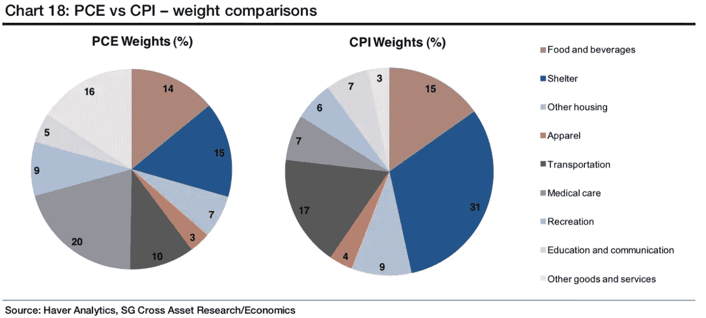

# 五分钟财经:CPI 上涨，ETH 通货紧缩，第三季度 VC 区块链投资

> 原文：<https://medium.com/coinmonks/five-minute-finance-cpi-comes-in-high-eth-deflationary-q3-vc-blockchain-investments-c0be5e62bad6?source=collection_archive---------30----------------------->

# 5 分钟的金融时事通讯——解释发生了什么，为什么。

# 让我们看看这周发生了什么:

*   最新的 8.2% CPI 告诉我们什么？
*   证券交易委员会调查宇迦实验室:行业应该担心吗？
*   BTC 比 11 月的 ATH 下降了 68%,但是哈希比率上升了
*   ETH 通货紧缩，但价格下降 7%
*   2022 年第三季度区块链风险投资细分

# 在最新 CPI 下降中的市场波动

*   美国 9 月 CPI 上涨 8.2%，通胀峰值结束了吗？ [**(链接)**](https://tokenist.com/us-cpi-prints-8-2-for-september-is-peak-inflation-over-yet/)

# PCE 与 CPI:他们讲述着同样的徒步旅行故事

自从我们进入了 40 年的高通胀时期，一个新的月度百分比就像一张热门专辑一样令人期待。9 月份，衡量通胀的消费者价格指数(CPI)达到 8.2%，比 8.1%的预期增长 0.1%。然而，CPI 处于 2022 年 2 月以来的最低水平，当时为 7.9%。

*波动性较小的浅红色核心 CPI (CPI 减去食品和能源)为 6.6%，比 8 月份增加了+0.3%，高于预期的+0.2%。图片来源:* [*美国劳工统计局*](https://www.bls.gov/charts/consumer-price-index/consumer-price-index-by-category-line-chart.htm)

随着热气腾腾的通胀数字下降，现在是市场解读-反应的时候了。那么，美联储如何解释这个数字呢？

美联储的官方双重使命是稳定物价，同时保持低失业率。美联储会继续抑制资产价格以压低消费者需求，从而导致经济衰退，以此作为冷却通胀的手段吗？

要回答这个问题，就要看美联储倾向于更多地使用哪个指标。虽然中央银行注意到 CPI，但其首选的通胀指标是核心个人消费支出(PCE)。让我们澄清一下不同之处:

*   CPI:城镇居民消费价格的平均变动。基于家庭调查。
*   PCE:衡量消费者支出，基于所有家庭、公司、政府和国内生产总值的价格。源于对企业的调查。
*   “核心消费物价指数”和“核心 PCE”都不包括食品和能源支出。

那么为什么会有一个“核心”方面呢？因为在制定货币政策及其可衡量的效果方面存在滞后。核心 PCE 排除了食品和能源等短期内波动较大的项目，使其成为波动性较小的指标。重要的是，核心 PCE 是由商业调查得出的，而消费物价指数是由家庭调查得出的。

这意味着 PCE 包括代表客户购买的商品和服务。由于这个原因，它捕捉了更广泛的价格趋势，导致比消费物价指数或核心消费物价指数更低的比率。反过来，这造成了一种奇怪的动态，公众(市场)对 CPI 做出反应，而[美联储通常通过核心 PCE](https://www.federalreserve.gov/econres/notes/feds-notes/comparing-two-measures-of-core-inflation-20190802.html) 来衡量通胀。

然而，无论是核心 CPI(同比增长+6.6%)还是核心 PCE(8 月份增长+4.9%)，美联储的蓝色融资利率都必须高于红色通胀率，才能产生通缩效应。提醒一下，美联储的目标 PCE 仍在 2%。

*自 20 世纪 50 年代以来，联邦基金利率不得不高于核心 CPI 才能成功稳定物价。图片来源:*【fred.stlouisfed.org】

*因此，预计 11 月和 12 月连续加息+75 个基点的概率分别为 98.2%%和 64.2%。这将使基金利率达到 4.75%，仍低于 4.9%的核心 PCE(9 月份的报告将于 10 月 28 日发布)。*

*当其他中央银行努力跟上紧缩的美元流动性时，在此期间会发生很多事情来影响美联储的进程。但是从市场的反应来看——快速下跌和随后几小时内的反弹——涨价似乎已经被消化了。*

**

# *SEC 调查宇迦实验室:值得关注的原因？*

*   *NFTs 是证券吗？SEC 开始调查宇迦实验室 **(** [**链接**](https://tokenist.com/are-nfts-securities-sec-begins-probe-into-yuga-labs/) **)***
*   *百无聊赖的猿游艇俱乐部交易量上涨 80%+经过 SEC 的宇迦调查揭露 **(** [**链接**](https://tokenist.com/bored-ape-yach-club-trade-volume-up-80-after-secs-yuga-probe-revealed/) **)***

# *SEC 的目标到底是什么？NFTs？APEcoin？*

*自从加里·詹斯勒(Gary Gensler)被确认为 SEC 主席以来，他一直在利用立法加密无效来制定数字资产的事实上的监管。他首先关注的是收益率高的加密产品。在对 BlockFi 处以 1 亿美元的罚款，并停止比特币基地的 Lend 计划之后，下一步可能是不可替代令牌(NFT)。*

*与可替代的加密货币不同，NFT 的价值取决于旁观者，类似于画廊艺术品。宇迦实验室凭借无聊猿游艇俱乐部(BAYC)系列爬上了 NFT 食物链的顶端，总销售额达到 24 亿美元。*

**

**最近以 ETH 加密货币(1 ETH = ~ 1327 美元)售出的最高价格的 BAYC NFTs。图片鸣谢:* [*OpenSea*](https://opensea.io/collection/boredapeyachtclub) *。**

*这还不包括宇迦实验室的相邻项目变异猿游艇俱乐部(17 亿美元)、无聊猿养狗俱乐部(3.51 亿美元)和其他项目(10 亿美元)。尽管 SEC 尚未指控宇迦实验室有任何不当行为，但调查正在探索将非金融交易定义为证券的理由。*

*如果证交会成功，价值 40 亿美元的宇迦实验室可能因出售未注册证券而被起诉。在没有加密立法的情况下，SEC 仍然根据 1946 年美国最高法院的 Howey 案运作，该案将证券定义为:*

*   *代表对共同企业的金融投资，其中:*
*   *企业预计将从投资中获得利润，包括从第三方的努力中获得利润。*

*从 NFT 的项目中，宇迦实验室从每笔销售中获得 2.5%的版税。共同企业*将是其即将推出的元宇宙/游戏平台 Otherside，由 ApeCoin (APE)加密货币货币化，也在 SEC 的调查范围内。然而，尽管这枚硬币是宇迦实验室生态系统的一部分，但它是由猿基金会管理的，而不是宇迦实验室。**

*此外，APE 基金会使用分散自治组织(DAO)来部署 Ape 基金。这意味着所有的 APE 令牌持有者都可以投票和管理共同企业，这可能会违背基金会。例如，当 APE 基金会提议将 Otherside 托管在自己的区块链而不是以太坊时，[社区以 380 万 APE 对 330 万 Ape 硬币的投票结果支持了](https://snapshot.org/#/apecoin.eth/proposal/0x367eecaffc20976a4f913154eceb61279793b06ac0ad93ab948d2d3b207ff860)。*

*换句话说，使用前计算机时代的规则，对 SEC 来说，这是一个很大的复杂性和治理稀释。尽管如此，在周二消息传出后，APE 经历了一段糟糕的时间，一周内下跌了-11%。*

**

**一周 ApeCoin (APE)价格。图片信用:* [*交易视图*](https://www.tradingview.com/)*

*与此同时，BAYC 的销售额在一周内增长了 21.20%，达到 730 万美元。然而，尽管投机性飙升，BAYC 的底价仍保持在 73 ETH，远低于 5 月份 153 ETH 的峰值。*

*[**享受 5MF？点击转发给三个朋友。**](mailto:info@tokenist.com?subject=Check+this+out+&body=I%E2%80%99ve+been+reading+Five+Minute+Finance,+and+I+know+you%E2%80%99d+enjoy+it+too.+It%E2%80%99s+a+weekly+email+that+covers+the+most+important+trends+in+finance.+I+learn+something+new+every+time+I+read+it!+Check+it+out+here:+https://tokenist.com/newsletter/?utm_source=email_gr_btn)*

**

# *BTC 现在比 11 月下跌了 68%。ATH:接下来会发生什么？*

*   *比特币罪犯。未平仓合约触及 500，000，价格保持区间波动，挤压即将到来吗？ **(** [**链接**](https://tokenist.com/bitcoin-perp-open-interest-hits-500000-as-price-remains-range-bound-is-a-squeeze-upcoming/) **)***

# *比特币抵御市场压力*

*当美联储在 2020 年和 2021 年打开 4.5 万亿美元的流动性大门，将资金注入并润滑干涸的美国经济时，资金涌入了股票和加密货币。作为加密先锋，2021 年 11 月，比特币达到了 68789 美元的历史最高价格。当时的通货膨胀率(以 CPI 衡量)为 6.8%，达到了 40 年来的最高水平。*

*自那以后，比特币下跌了 68%，至约 2 万美元。然而，这并不是比特币的第一次大规模贬值。*

*多年来，主流观点将比特币描绘成一种通胀对冲工具。一旦美联储对加息的态度变得明确，这种长期存在的叙事就崩溃了。相反，随着美元强势指数(DXY)的增长，很明显比特币——至少目前——正在发挥对冲货币贬值的作用。*

**

**自见顶以来，随着美元强势膨胀，比特币的实力有所减弱。图片信用:* [*交易视图*](https://www.tradingview.com/)*

*然而，随着外国央行陷入流动性陷阱，比特币在底部保持了显著的稳定。比特币的永久期货合约(perps)以近乎中性的融资利率支持了这一点。*

*要实现这一点，对 BTC 有利的多头和不利的空头必然会发生冲突。此外， [Arcane 的研究报告](https://arcane.no/research/monthly-market-wrap-up-leverage-bonanza-be-careful)提到了相对于比特币市值的最高公开利率。这对比特币向前发展意味着什么？*

*从根本上来说，比特币仍然是人类信号的平台。具体来说，投资者如何解读宏观经济状况。一方面，比特币在 13.8 年的时间里将其用户群扩大到了 3 亿多。如果这种增长速度持续下去，比特币可能会在三年内达到 10 亿用户的里程碑，覆盖全球 12%的人口。*

*预计到这种增长，比特币挖矿软件[正在经历一次重大改革](https://www.cnbc.com/2022/10/11/bitcoin-mining-software-overhaul-stratum-v2-promoted-by-block-braiins.html)，进一步简化它。另一方面，比特币在短期内可能会面临问题。该网络的哈希速率在周一达到了历史最高水平，这意味着它比以往任何时候都更安全。*

**

**比特币挖矿能力的总量，以每秒千万亿次哈希速率(EH/s)表示。图片来源:*【CoinWarz.com】*

**但是，这是一把双刃剑，因为网络难度也更高，需要更多的能量来挖掘交易块。**

**hash difference 需要两周时间进行重新调整，让矿商在 BTC 价格见底的熊市中应对高企的能源价格(补充说明:币安正在启动一个 5 亿美元的项目，以 5%-10%的利率向 BTC 矿商提供贷款以帮助解决这一问题)。这种动态可能是我们在此时看到如此高的开放兴趣的罪魁祸首。**

****

# **以太坊刚刚通缩，但什么都没发生。为什么？**

*   **以太坊转为通缩但下跌 7%，因市场仍不确定 **(** [**链接**](https://tokenist.com/ethereum-turns-deflationary-but-drops-7-as-market-stays-uncertain/) **)****

# **以太坊在熊市中走向通缩**

**许多投资者对以太坊和比特币之间的通胀态势感到困惑。后者的总供应量被限制在 2100 万 BTC，而以太坊则拥有无限的 ETH 供应量。然而，在合并将以太坊转变为区块链后，流通中发行的以太币比比特币更少。**

****

**以太坊的合并里程碑改变了它的令牌组学动态。图片来源:**

***这是因为以太坊的赌注共识减少了 90%的 ETH 发行，同时减少了约 99.95%的网络能耗。与此同时，比特币的发行仍受其 4 年减半机制的监管，该机制计划在 2140 年停止 BTC 发行作为奖励(BTC 进入流通供应)。***

***与比特币相比，以太坊现在大幅通缩，其 ETH 令牌供应增长在一周内下降了-0.22%。过去的一周，我们见证了以太坊网络有史以来的第一个通缩日。***

******

***以太坊的 ETH 供应增长在 7 天内下降。图片来源:***

***然而，以太坊的价格在此期间几乎没有变化，上涨了+0.41%，而比特币的涨幅为+2%。难道通缩压力不应该让每一枚硬币升值吗，就像美联储量化紧缩美元的举措一样？***

***事实证明，以太坊的通缩压力很大程度上源于上周一个项目的启动。在作为基本费用消耗的 15，720 个 ETH 中，[其中近三分之一](https://etherscan.io/gastracker)来自铸造最近推出的 XEN 令牌，引领了新的参与证明。***

******

****ETH 气费涌入 XEN 代币铸造。图片来源:*[*coin tool . app*](https://cointool.app/gasPrice/eth)***

**XEN 不仅提高了 ETH 的天然气费用，而且该项目在不久后就崩溃了-89%。一个聪明的黑客利用了 XEN 在 FTX 交易所的天然气漏洞，创造了 1 亿 XEN。**

**简单地说，好消息被坏消息掩盖了。**

****

# **跟着钱走:2022 年第三季度区块链 VC 投资**

*   **第三季度对加密初创公司的风险投资下降了 37%**(**[**链接**](https://tokenist.com/vc-funding-for-crypto-startups-down-37-in-q3/) **)****

# **风险投资下降，但仍然可观**

**在熊市中，经常可以看到“聪明的钱”这个词出现。伴随着如此多的焦虑，到处都有误导。但是，那些以精心策划的心态寻找投资机会为工作的人呢？**

**通常，这些财富寻求者都在风险投资公司，所以值得注意他们的资金流向——至少就行业的不同部门而言。**

**PitchBook 的数据显示，与去年同期相比，第三季度风险投资加密融资下降了 37%。**

****

***图像功劳:* [*区块*](https://www.theblock.co/post/176531/blockchain-venture-funding-falls-for-second-consecutive-quarter)**

**在 44.4 亿美元的风险投资流中，近一半(20 亿美元)进入了 NFTs/游戏领域。这是一个持续的趋势，因为玩赚(P2E)游戏有望取代游戏内资源被锁定的传统游戏。**

**相比之下，区块链游戏拥有可交易的资源，包括代币和可玩的 NFT，允许可行的游戏收入。加上每周平均游戏时间的稳步上升，区块链博彩投资成为一种流行趋势。**

****

**当然，区块链博彩业必须得到区块链基础设施的支持，所以风投们也拨了差不多同样多的钱，18 亿美元。获胜者是塔图姆，4200 万美元，和 SettleMint，1565 万美元。捷克塔图姆正在解决区块链生态系统的分散性，拥有几十个网络。**

**总部位于伦敦和迈阿密的塔图姆团队正在开发工具和框架，以统一 40 多种不同区块链协议的 dApp 开发。通过这种方式，dApps 可以通过减少花费在每个个体区块链的特殊性上的时间来更快地建立。**

**有趣的是，风投们给加密金融服务和 DeFi 的拨款几乎相等，各为 5 亿美元。在 Q1，对这些行业的兴趣超过 3 倍，达到 36 亿美元。这表明，由于对数字资产的监管最终会是什么样子的不确定性，出现了一个间断。**

**就在本周四，科罗拉多州参议员 Hickenlooper 写了一封信给 SEC，要求该机构承认“*现有的法律和法规并不是为了处理数字资产在市场上的使用方式*”。**

**参议员加入了他的同事，众议员汤姆·艾默的行列，他[也有类似的观点](https://tokenist.com/congress-letter-accuses-sec-of-us-law-violation-and-overburdening-the-crypto-industry/)。**

# **本周推特**

****

> **由于利率上升和市场波动预示着金融稳定风险增加，我们的全球银行压力测试表明，新兴市场的一些银行可能没有足够的资本。**

**[**@IMFNews**](https://twitter.com/IMFNews/status/1579861894743351296)**

****

> **CPI 打印后的标准普尔 500、黄金、比特币和欧元兑美元:**

**[**@tradingview**](https://twitter.com/tradingview/status/1580537107378221057)**

****

> **美国战略石油储备连续第 57 周下降，目前处于 1984 年以来的最低水平。今年外汇储备大幅下降 31%，这是有记录以来的最大降幅。**
> 
> **通过@ycharts 制图**

**[@ charliebilello](https://twitter.com/charliebilello/status/1580602556870369280)**

****

> **在今天恐慌性购买最严重的时候，超过 45%的纽约证券交易所证券交易价格上涨。**
> 
> **在标准普尔 500 创下 52 周低点后的第二天，这是至少 25 年来的第二高金额(暗示空头回补)。**

**[**@ jasongoepfert**](https://twitter.com/jasongoepfert/status/1580612733355327488)**

> **多边形生态系统路线图看起来很疯狂**
> 
> **- POS mainnet**
> 
> **-多边形超网**
> 
> **-多边形效用**
> 
> **-多边形零、米登和兹凯夫姆**
> 
> **多边形夜幕**
> 
> **这些不同扩展解决方案的简单分类，以及它们在该领域具有开创性的原因**
> 
> **1/25**

**[**@ThorHartvigsen**](https://twitter.com/ThorHartvigsen/status/1580225764984659969?s=20&t=rIfwO0jL2-dCjEHFUO2hdg)**

# **加入五分钟金融时事通讯。**

****

**[Sign up here — it’s free.](https://tokenist.com/newsletter/)**

****

**[t.me/thetokenist](http://t.me/thetokenist)**

****

**twitter.com/thetokenist**

> **交易新手？尝试[加密交易机器人](/coinmonks/crypto-trading-bot-c2ffce8acb2a)或[复制交易](/coinmonks/top-10-crypto-copy-trading-platforms-for-beginners-d0c37c7d698c)**