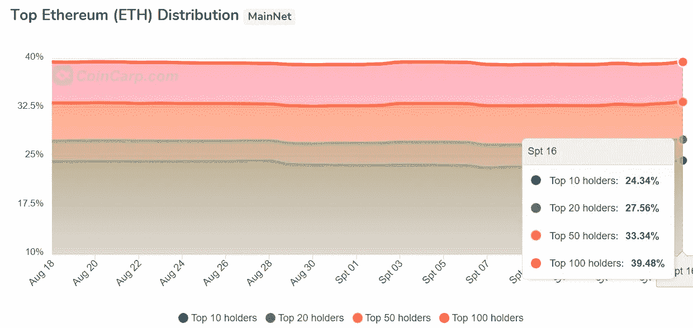
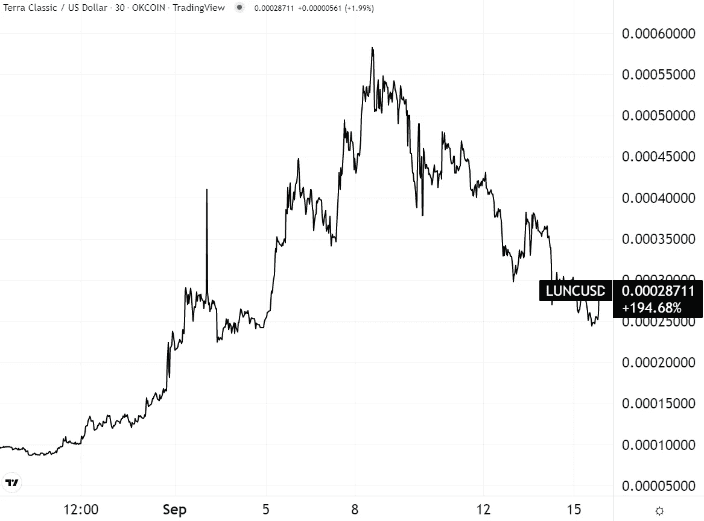
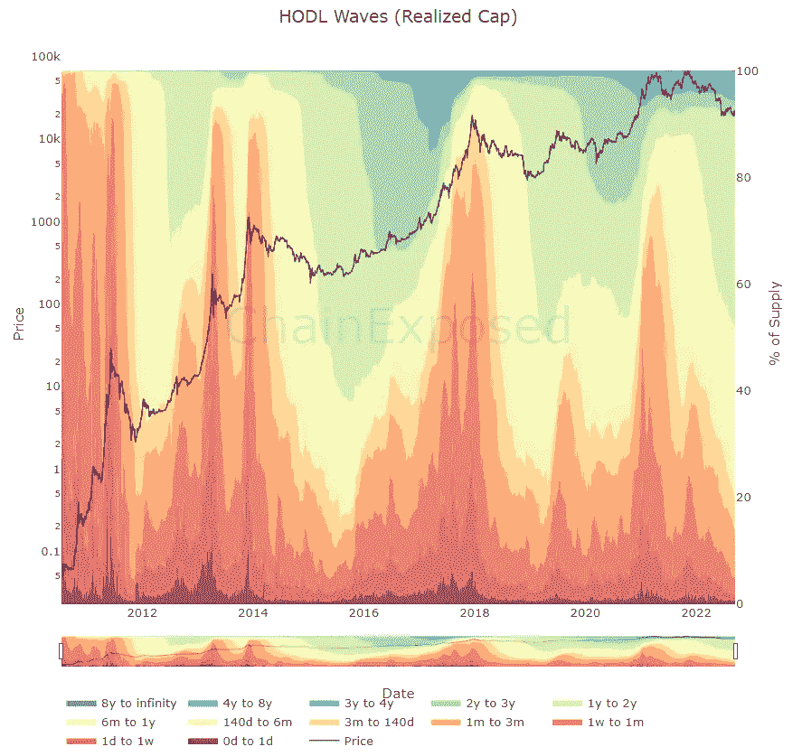
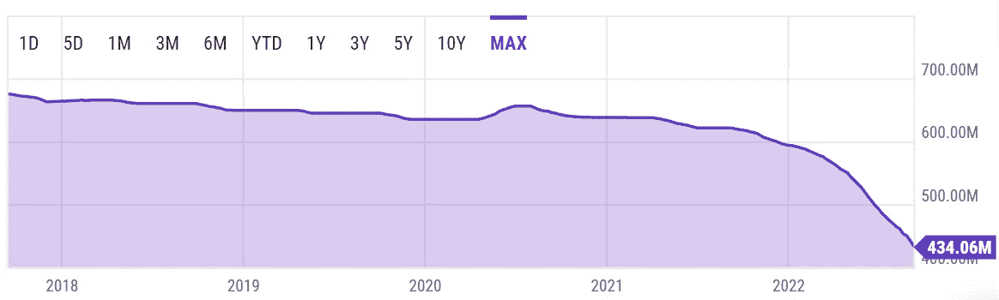
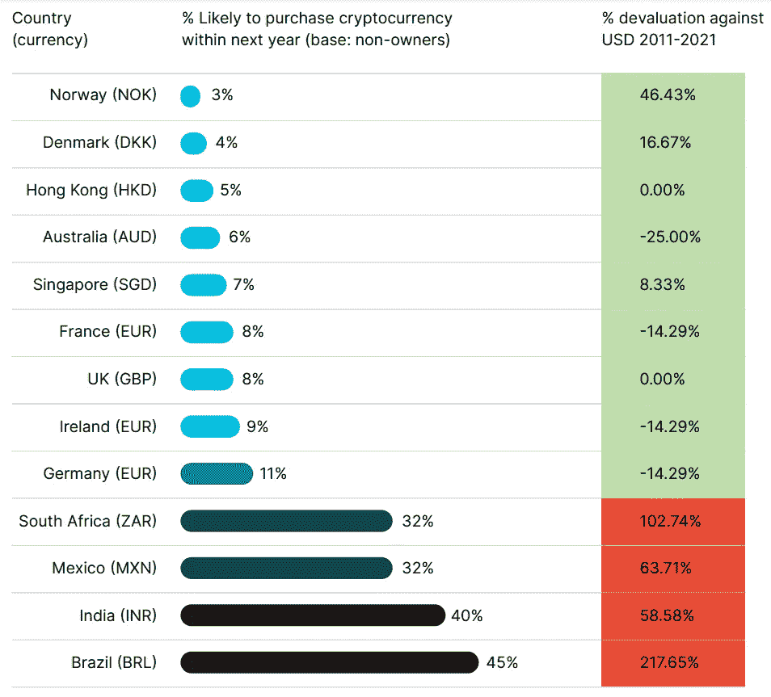
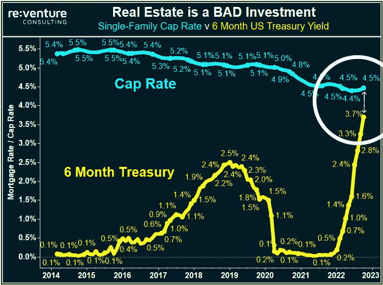
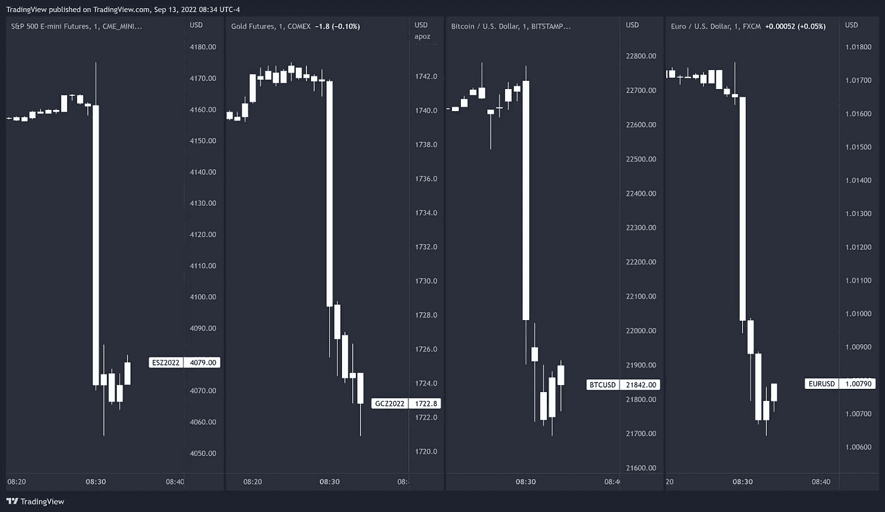
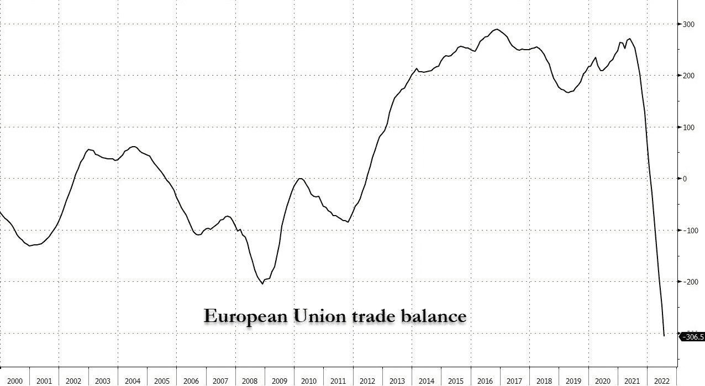

# 五分钟金融:消费物价指数反应，跆拳道逮捕令，联邦理工学院合并完成:现在怎么办？

> 原文：<https://medium.com/coinmonks/five-minute-finance-cpi-reaction-do-kwon-arrest-warrant-eth-merge-complete-now-what-82355355a518?source=collection_archive---------36----------------------->

# 5 分钟的金融时事通讯——解释发生了什么，为什么。

# 让我们看看这周发生了什么:

*   ETH 合并完成——现在是“模拟宇宙”了？
*   Terra 的跆拳道面临逮捕令
*   消费物价指数反应和 BTC 积累率
*   到 2030 年 16 万亿美元的数字资产市场？
*   CFTC 准备规范加密

# 以太坊的合并是一个虎头蛇尾的成功

*   以太坊的关键更新可能已经在市场保持平稳的情况下定价 **(** [**)链接**](https://tokenist.com/ethereums-pivotal-update-likely-already-priced-in-as-market-remains-flat/) **)**
*   随着以太坊完成合并 **(** [**链接**](https://tokenist.com/proof-of-work-ethw-airdrop-live-on-ftx-as-ethereum-completes-merge/) **)** ，工作证明 ETHW 空投在 FTX 现场

# 以太坊合并成功，但竞争环境刚刚开始变得公平

正如我们过去两周一直暗示的那样，以太坊的“收购合并新闻”涨势已经失去了动力。7 月初，ETH 价格徘徊在 1000 美元左右，8 月中旬达到 2017 美元的三个月高点。考虑到各地的熊市，这引起了相当多的关注。

从那以后，越是接近合并日期，ETH 价格越是继续下跌。上周，它持平了。合并后，它越过了-7%的悬崖，从 1585 美元跌到了 1466 美元。上周，比特币的表现甚至超过了瑞士联邦交易所。

合并后的第二天，一切恢复正常。图片来源: [*交易查看*](https://www.tradingview.com/)

主要的负面市场驱动因素是宏观经济前景，通胀和美联储的反应是最重要的。尽管 8 月份的通货膨胀率为 8.3%，为 4 月份以来的最低水平，但仍高于 8.1%的预期。这比美联储 2%的目标高出四倍，表明更多的加息将抑制市场和经济。

此外，以太坊最近的升级并不意味着完整的“以太坊 2.0”已经到来。它不会扩大其主链，直到激增，所以天然气费和交易速度将大致保持不变。将改变的是以太坊的能源足迹下降 99%，这相当于全球电力消耗减少 0.2%。

但是，像 AVAX 或 SOL 这样的其他连锁店已经从一开始就内置了股权证明，强调可扩展性——这意味着快速、廉价的交易(不完全是以太坊的强项)。然后，有一个关于 PoS 含义的主要问题。Vitalik Buterin 最近[这样表述](https://twitter.com/mononautical/status/1570311839178985474):

*“工作证明是基于物理定律的，所以你必须按照世界本来的样子工作……然而，因为利益证明是以这种方式虚拟化的，所以它基本上是让我们创建一个模拟的宇宙，它有自己的物理定律……”*

区块链共识机制(工作证明、利益证明等)。)有一个首要任务:保护 T4 的网络安全。布特林的话引出了一个问题:哪个定律更安全——物理定律，还是以太坊的有自己的物理定律的模拟宇宙？

在以太坊的情况下，这一切都归结为以太网赌注权力分配。由于使用集中交易，很难准确描述 ETH 持股的分布情况。但是我们仍然可以得到一个非常粗略的想法。虽然这个数字中有兑换钱包，但来自 CoinCarp 的数据显示，以太坊 40%的净资产分配给了 100 个钱包:

*以太坊区块链上的财富分配。图片来源:* [*硬币*](https://www.coincarp.com/currencies/ethereum/richlist/)

你可能会说比特币也有类似的头重脚轻的分布。不同之处在于，ETH 验证器不仅仅是保护网络，它们还执行网络规则。他们持有的 ETH 越多，他们的赌注收益就越大，这让他们变得更富有，更有影响力。

理论上，持有有价值的 ETH 的 ETH 持有者不会做任何损害网络的事情——他们投资了他们的 ETH，然后用它来获得更多的 ETH，这意味着他们有动机增加 ETH 的价值。

然而，从以太坊网络的理论影响力和权力来看，另一种方式类似于传统金融权力等级的再造，反映在区块链上——一个“模拟的宇宙”。

对于那些有这种担忧的人来说，古老的以太坊还在继续。昨天，ETHW 价格涨到 60 美元。在 FTX 和其他交易所空投新代币后，其价格跌至 14 美元。

区块链三难困境——即区块链不能同时提供去中心化、安全性和可扩展性——仍然存在。以太坊正在继续尝试解决这个问题，最近的合并是以太坊 2.0 路线图中的一个里程碑。

# 对道权发出了逮捕令

*   露娜下降 40%作为对权道等 5 人发出的逮捕令 **(** [**链接**](https://tokenist.com/luna-drops-36-as-arrest-warrant-issued-for-do-kwon-and-5-others/) **)**

# Terra 剧正在进入高潮阶段

特拉(卢娜)的陨落是区块链 13 年历史上最令人尴尬和名誉受损的事件之一。紧随其后，多个平台和公司倒下了——Celsius、3AC 和 Voyager Digital，仅举几例。现在它通常被认为是立法者引入严格的稳定币规则的事件。

如此多的财富损失，仅在第一周就损失了至少 450 亿美元，在社交媒体上看到毁灭人生的证词并不罕见。然而令人惊讶的是，更名为 Terra (LUNA)的 Terra Classic (LUNC)是 9 月份推出的为数不多的替代硬币之一。

自从 5 月份 ATH 达到 119 美元以来，Terra 已经跌到了谷底。图片信用: [*交易视图*](https://www.tradingview.com/)

继 UST 稳定币分离之后，复兴计划 2 将生态系统分成两枚硬币，旧的 LUNC 和重新启动的 LUNA，但没有算法稳定币。

问题是，对于这样一个小生态系统来说，有太多的恶意存在。最近的打击可能是最后一击。臭名昭著的 Terraform Labs 创始人 Do Kwon 和其他五人现在被韩国当局通缉。

其中一项指控与违反韩国资本市场法有关。除了逮捕令，韩国检方还将发布国际刑警组织对权的红色通缉令。

这将允许其他国家逮捕权并引渡他。据称，他目前居住在新加坡。如果他们的逮捕和审判实现了检察官的目标，那么看看挣扎中的 Terra 生态系统将会如何发展将会很有趣。

[**享受 5MF？点击转发给三个朋友。**](mailto:info@tokenist.com?subject=Check+this+out+&body=I%E2%80%99ve+been+reading+Five+Minute+Finance,+and+I+know+you%E2%80%99d+enjoy+it+too.+It%E2%80%99s+a+weekly+email+that+covers+the+most+important+trends+in+finance.+I+learn+something+new+every+time+I+read+it!+Check+it+out+here:+https://tokenist.com/newsletter/?utm_source=email_gr_btn)

# 在糟糕的 CPI 报告后，比特币的飙升结束了

*   在美联储准备下周会面之际，加密和股票遭受重创 **(** [**链接**](https://tokenist.com/crypto-and-stocks-take-a-hit-as-federal-reserve-prepares-to-meet-next-week/) **)**
*   比特币跟随 8 月 CPI 下跌 10%**(**[**链接**](https://tokenist.com/bitcoin-down-10-following-the-report-on-augusts-cpi/) **)**

# 比特币积累是否足以拯救底层？

所有 BTC 持有人都在甲板上捍卫 20k 美元的价格支撑位。自从令人恐惧的美联储 3 月份开始加息以来，比特币价格已经四次跌破 2 万美元大关。然而，这四次下跌都没有持续超过几天。

客观地看，比特币在 2017 年 12 月 17 日达到了第一个 2 万美元的里程碑。因此，五年的挫折会产生相当大的打击士气的影响，后果不可预测。

换句话说，即使是长期的霍德尔也可能衰落。多少，我们可以通过比特币 HODL 波形图来猜测，因为它向我们显示了大多数比特币被购买的价格点。

*HODL 波代表集体成本基础，表明投资者可能会受到惊吓。较热的区域代表最近的 BTC 持有者(积累)。图片来源:* [*连锁曝光*](https://chainexposed.com/HoldWavesRealized.html)

按照目前的速度，超过一年没有变动的比特币占总供应量的 65%。总的来说，大约有 470 万 BTC 人已经超过 5 年没有搬家了。鉴于比特币价格现已进入两年绿色区域，一些人可能会将此解读为在这个被低估的价格点购买更多 BTC 的最佳时机。

事实上，我们正在见证比特币历史上 BTC 地址超过 1BTC 的最大积累。但是，如果黑暗的宏观经济之风更加强大，这并不意味着什么。最终，正是这些因素决定了比特币的底部。

在 CPI 报告疲软(未能充分降至 8.3%，而非预期的 8.1%)后，美联储势必会继续加息以降低通胀。到目前为止，拜登政府设法将通胀率保持在 6 月份的 9.1%以上。

政府主要通过以创纪录的速度消耗战略石油储备来做到这一点。能源价格构成了一半的通胀压力，因此这抑制了通胀。

*战略石油储备(SPR)中的美国原油库存。图片来源:* [*Ycharts*](https://ycharts.com/indicators/us_ending_stocks_of_crude_oil_in_the_strategic_petroleum_reserve)

那么，两个月的通胀下降很可能与美国政府动用战略石油储备密切相关。届时，美联储将不得不大幅收紧其美元流动性龙头，以进行补偿。如果是这种情况，预计市场不会做出有利的反应。

# 现在合并结束了，接下来呢？

*   到 2030 年，链上令牌化资产可能是 16 万亿美元的市场:波士顿咨询公司报告 [**(链接)**](https://tokenist.com/on-chain-tokenized-assets-could-be-a-16t-market-by-2030-bcg-report/)
*   随着全球收养的继续，2022 年潜在的性别差距可能会缩小:报道 [**(链接)**](https://tokenist.com/crypto-gender-gap-likely-narrowed-in-2022-as-global-adoption-continues-report/)

# 数字经济将见证更多的符号化

随着合并宣传未能成为有史以来最大的事情，至少就立即的市场反弹而言，还有什么可期待的呢？在(相当)短期内，它高度依赖于全球经济状况。从长远来看，有大量的生长信号可以让你在寒冷的熊夜里保持温暖。

底线是，未来是数字化的。数字化还没有完全普及。曾几何时，在 20 世纪 90 年代，这是显而易见的。现在，很明显，数字化将被符号化。但是增加多少呢？

BCG 全球咨询公司和 ADDX 交易所预计，到 2030 年，令牌化资产将增长 50，000%，即 16 万亿美元。这一乐观预测的主要原因是，非流动性资产可以被令牌化。这些不仅包括艺术品或房地产，还包括私人股本、大宗商品、信贷/债务、对冲基金等专有资产。

换句话说，令牌化打破了有限的访问，同时增加了非流动性资产的细分。反过来，这扩大了潜在投资者的范围。

即使在现在，加密技术的采用仍在继续增长——部分是由于当地货币的贬值:

*该国货币贬值幅度越大，加密技术的采用率就越高。图片鸣谢:* [*双子星 2022 状态的加密报告*](https://www.gemini.com/gemini-2022-state-of-crypto-global.pdf)

去年，51%的新密码拥有者来自发展中国家，以巴西和印度为首。然而，采用加密技术的浪潮还有教育障碍需要克服。双子座调查中对密码好奇的受访者表现出的不情愿是基于:

*   缺乏政府支持
*   安全性(数字资产的保管)
*   使用和购买数字资产
*   信任

为了增强他们对这些问题的信心，他们优先考虑合法教育资源(40%)的可能性是朋友推荐(22%)的两倍。有趣的是，“缺乏政府支持”意味着更多的加密监管实际上对加密的采用是积极的。

# CFTC 正试图规范美国的加密技术

*   CFTC 主席要求对加密市场给予更多的权力 [**(链接)**](https://tokenist.com/cftc-chair-requests-more-authority-over-the-crypto-market/)
*   CFTC 已经准备好成为密码看门狗，贝南告诉我们参议员 **(** [**链接)**](https://www.coindesk.com/policy/2022/09/15/cftc-already-preparing-to-be-crypto-watchdog-benham-tells-us-senators/)

# DCCPA 法案中的明显漏洞仍未修补

自加里·詹斯勒(Gary Gensler)于 2021 年执掌 SEC 以来，我们已经看到了一些重要趋势:

*   使用加密的立法无效来[通过制裁](https://tokenist.com/how-blockfis-100m-sec-settlement-creates-new-standard-for-defi/)创建规则。
*   利用自愿合作作为[打击手段](https://twitter.com/brian_armstrong/status/1435439291715358721)。
*   混淆加密准则，为更大的干预打开空间。

此外，Gensler 习惯于宣布几乎所有的加密货币都是证券，但不会全力执行。好像一些政府间的地盘之争还没有解决。在美国证券交易委员会，这具体涉及商品期货交易委员会(CFTC)。

我们现在看到地盘之争的结束了吗？据 CFTC 主席罗斯坦称

贝南，可能是。在参议院农业委员会最近的听证会上，Behnam 说他指示他的机构准备成为加密市场的全额资助监督者。

CFTC 将需要额外的 1 . 12 亿美元预算来完成这项任务，分三年完成。这与八月份提出的法案一致，根据该法案，CFTC 将控制数字资产。然而，仍将由法院和证交会来界定哪些资产是证券。

到目前为止，只有比特币和以太坊可以算作商品。如果在定义“数字商品”方面有更大的回旋余地，CFTC 将负责经纪人、交易商、托管人和交易所。在该法案目前的形式下，DeFi 平台将受到更短的惩罚，实际上是禁止它们，因为它们缺乏监管和非监管平台之间必要的细微差别。

例如，DCCPA 法案将把 Uniswap 上的每一个流动性提供商都视为“数字商品交易商”，要求在 CFTC 注册。同样，该法案援引

《银行保密法》对“数字商品平台”上的所有交易进行无授权监控。

# 本周推特

> 与去年相比的价格上涨(CPI 报告)…
> 
> 燃油:+68.8%
> 
> 天然气公用事业:+33.0%
> 
> 汽油:+25.6%
> 
> 电力:+15.8%
> 
> 家里的食物:+13.5%
> 
> 交通运输:+11.3%
> 
> 新车:+10.1%
> 
> 整体消费物价指数:+8.3%
> 
> 外出就餐:8.0%
> 
> 二手车:+7.8%
> 
> 住房:+6.2%
> 
> 医疗保健:+5.6%

[**@ charliebilello**](https://twitter.com/charliebilello/status/1569666100232683520)

> 😬房地产投资者面临的大问题。
> 
> 6 个月期美国国债现在的收益率基本上等同于在美国购买和出租房屋的收益率(又名上限利率)。
> 
> 翻译:大房地产投资者抛售来了。尤其是在华尔街的所有者中。📉

[**@ nicgger Li 1**](https://twitter.com/nickgerli1/status/1570138213464899585)

> CPI 打印后的标准普尔 500、黄金、比特币和欧元兑美元:

[**@tradingview**](https://twitter.com/tradingview/status/1569666158218952705)

> 当欧元下跌时，欧盟的贸易顺差应该会上升。但现在，欧元处于创纪录低点，欧盟贸易顺差大幅下降。

[**@KimDotcom**](https://twitter.com/KimDotcom/status/1570606280070529028)

> 刚刚以 4%的利率购买了 52 周的国债
> 
> 整整一年前，我以 1.8%的利率对我的抵押贷款进行了再融资
> 
> 在我的房子价格膨胀到超乎我想象之后，美联储和美国财政部现在正在偿还我的抵押贷款。
> 
> 感觉超级感激，但这一切有什么意义呢？？

[**@ VincentDeluard**](https://twitter.com/VincentDeluard/status/1570459378511400961)

# 加入五分钟金融时事通讯。

[Sign up here — it’s free.](https://tokenist.com/newsletter/)

[t.me/thetokenist](http://t.me/thetokenist)

twitter.com/thetokenist

> 交易新手？试试[加密交易机器人](/coinmonks/crypto-trading-bot-c2ffce8acb2a)或者[复制交易](/coinmonks/top-10-crypto-copy-trading-platforms-for-beginners-d0c37c7d698c)