# 五分钟金融:加密的最大去杠杆化周期解释，至关重要的比特币矿工数据

> 原文：<https://medium.com/coinmonks/five-minute-finance-cryptos-largest-deleveraging-cycle-explained-crucial-bitcoin-miner-data-46015f47e106?source=collection_archive---------20----------------------->

# 5 分钟的金融时事通讯——解释发生了什么，为什么。

# 让我们看看这周发生了什么:

*   国会发布关于迷因股票游戏化的报告
*   潜入:秘密传染病爆发解释
*   CoinFLEX 的“惊人德根”之举
*   矿工数据如何在 BTC 底层发挥关键作用
*   欧盟的 MiCA:一个潜在的全球密码管理框架

# GameStop 传奇推动国会对潜在的 PFOF 改造

*   美国国会关于迷因股票的报告揭示了罗宾汉的增长超过稳定的文化 **(** [**链接**](https://tokenist.com/us-congressional-report-on-meme-stocks-reveals-robinhoods-culture-of-growth-over-stability/) **)**
*   SBF 会成为罗宾汉吗？ **(** [**)链接**](https://www.ft.com/content/300f7070-2463-4e26-84e3-268e7a1b04ab) **)**

# PFOF 和游戏化齐头并进

没有什么比比较 2021 年 1 月前后 GME/AMC 股票更能证明 meme 股票卖空的力量了。即使在当前的市场抛售中，这两只股票仍然上涨了 500%以上。

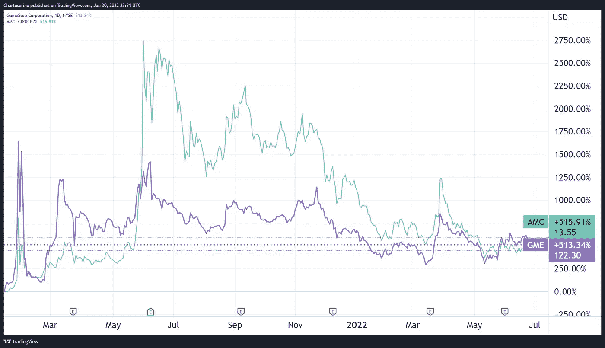

*面对市场逆风，散户依然维持 AMC/GME 的后劲。图片信用:* [*交易查看*](https://www.tradingview.com/) 。

换句话说，交易员们通过上下颠倒 GME/AMC 的押注来反击华尔街的空头。然而，这种前所未有的零售动员水平引起了监管机构的极大关注。在卖空交易中出现了多种异常情况，从超过 200 万股未能执行到由于流动性危机导致经纪人实施的限制交易。

> 交易新手？尝试[加密交易机器人](/coinmonks/crypto-trading-bot-c2ffce8acb2a)或[复制交易](/coinmonks/top-10-crypto-copy-trading-platforms-for-beginners-d0c37c7d698c)

最近的美国国会报告为这些问题画上了句号。可以预见的是，它必须解决散户用来将 GME/AMC 从卖空的魔掌中拯救出来的主要平台——罗宾汉。作为零佣金交易的先驱，罗宾汉成了散户股票交易的代名词。

*罗宾汉的增长率，2017–2021。图片来源:* [*美国国会*](https://financialservices.house.gov/uploadedfiles/6.22_hfsc_gs.report_hmsmeetbp.irm.nlrf.pdf)

那句陈词滥调是什么来着？生活中没有免费的东西。事实证明，这也适用于免佣金的股票交易。

这种“免费”交易的基础是订单流支付(PFOF)。Robinhood 依靠这种商业模式向做市商提供客户交易。反过来，做市商执行交易，并根据买卖价差收取费用。肯·格里芬的 Citadel Securities 是最大的做市商，仅去年一年就向 12 家经纪商支付了 15 亿美元。

总体而言，PFOF 在 2021 年增长了 47%，所有经纪人的总收入达到 38 亿美元。仅罗宾汉一家就从 PFOF 赚了 9.74 亿美元，而这一年在 T2 的总净收入为 18 亿美元。因此，冲突就出现了:格里芬在游戏中有一些对冲基金在做空 GME/AMC，这正是罗宾汉的客户所捍卫的迷因股票。

另一个潜在的问题是，PFOF 的本质鼓励罗宾汉不顾后果地追求最大限度的交易。反过来，Robinhood 也将其平台游戏化了很多。在某一点上，它甚至[移除了五彩纸屑动画](https://www.cnbc.com/2021/03/31/robinhood-gets-rid-of-confetti-feature-amid-scrutiny-over-gamification.html)，以应对公众对此类游戏化的审查。

批评家称 Robinhood 的“用户里程碑”更像是一个视频游戏，而不是一个股票交易平台。图片来源: [*罗宾汉 app*](https://robinhood.com/)

国会报告引用了多名专家证人，他们指出这是多么有问题。

*“[这款应用的]主要功能不是让人们投资，而是让人们交易”*

Better Markets 首席执行官丹尼斯·凯莱赫

简而言之，报告严重倾向于禁止或限制 PFOF，罗宾汉的面包和黄油。证券交易委员会也倾向于这种方式，提出了更透明、更具竞争性的新规则。鉴于 Robinhood 的商业模式依赖于 PFOF，这让它陷入了困境。去年夏天，甚至互动经纪公司的创始人也指出，如果 PFOF 被收购，罗宾汉将不得不寻找一个买家。

其中一个买家可能是山姆·班克曼-弗里德(SBF)，FTX 加密交易所的负责人，罗宾汉公司 7.6%的股东。目前，Robinhood 的债务是现金的两倍，其股票(hood)自首次公开募股以来下跌了 76%。这对于收购来说是否足够糟糕，时间会证明一切。

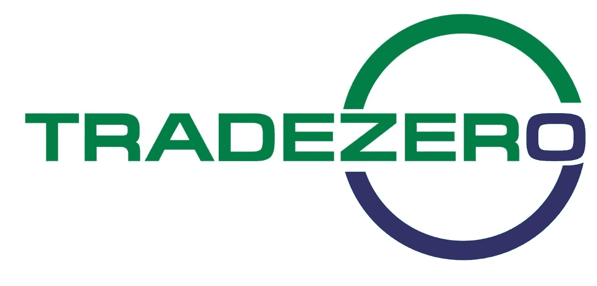

这个星期！TradeZero 首席执行官丹·皮皮通和令牌专家 EIC·谢恩·尼格尔将主持一场现场网络研讨会，讨论大市场趋势和熊市。什么时候？美国东部时间 7 月 7 日星期四下午 2:00。[在这里注册](https://register.gotowebinar.com/register/3473966785629987085)！

# 危机蔓延之后，加密紧急救助暴露出…更多的坏消息

*   如果公司破产，高盛计划筹集$2B 购买 Celsius 的资产
*   **最近几次密码纾困的负责人 SBF 表示，一些交易所“已经秘密破产”**

# **两次涟漪演变成隐秘的海啸**

**在争夺 APY 利益的竞赛中，权力下放被蒙上了灰尘，就像后视镜中古怪的东西一样消失在视线之外。然而，过去的两个月每天都在提醒我们这有多么重要。**

**毕竟，当中央委员会决定一件事时，它影响到每个人。**

**例如，美联储主席杰罗姆·鲍威尔控制着这个超级大国的货币供应。然而，在这里是他最近被问及中央银行对价格制定动态(通货膨胀)的方法时不得不说的:**

**“我们现在更好地理解了我们对通货膨胀的了解是多么的少。”**

**同样，Terra (LUNA)的创始人 Do Kwon 的一个决定引起了现实的涟漪。今天，我们看到这些涟漪变成了一场隐秘的传染海啸。这可能是起源的一部分:**

**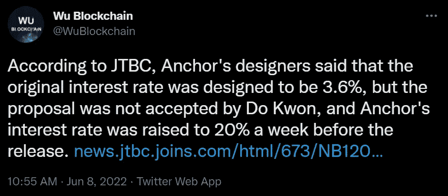**

***图片来源:* [*推特*](https://twitter.com/WuBlockchain/status/1534459009587023872)**

**Terra 的锚定贷款 dApp 的 19.5%和 3.6% APY 之间的 5.4 倍差额设置了一个传染陷阱。它给跆拳道和泰拉带来了数十亿美元的增长，却被彻底摧毁，带来了暴露的、渴望 APY 的多米诺骨牌:**

*   **卢纳/UST——美联储加息和抗击通胀的货币政策——第一波涟漪——导致风险资产抛售，这在很大程度上影响了加密市场。在此期间，随着卢娜和 UST 的暴跌，泰拉的算法稳定币 UST 失去了它的挂钩，最终引发了加密领域的去杠杆化周期。**
*   **Celsius 是一家借贷平台，在暂停提款之前，其资产与权益比率(以十亿计)高达 19:1。现在，高盛正在筹集 20 亿美元来收购它。**
*   **专注于加密的对冲基金三箭资本(3AC)仅在 Terra 就有 2 亿到 4 亿美元的敞口。3AC 现已被法院下令清算。3AC 的未偿债务总额不详。**
*   **voyager Digital——一家暴露于 3AC 的加密经纪商，[本周向 3AC 发布了一份违约通知](https://www.reuters.com/technology/crypto-broker-voyager-digital-issues-default-notice-three-arrows-capital-2022-06-27/)。Voyager 曾在 USDC 借给 3AC 15250 个比特币和 3.5 亿美元。为了度过这个难关，航海家号从 SBF 的阿拉米达研究所获得了 5 亿美元的紧急贷款。**
*   **block fi——一个借贷平台，根据[摩根克里克数字泄露](https://www.theblock.co/post/154681/a-leaked-investor-call-revealed-morgan-creeks-bid-for-blockfi-here-are-four-more-big-takeaways-from-the-call)清算了 3AC 10 亿美元。SBF 为 BlockFi 提供了高达 2 . 5 亿美元的循环信贷额度。**
*   **做市和借贷平台 Genesis Trading 被 3AC 曝光，现在可能面临数亿美元的损失。**
*   **借贷平台 Babel Finance 已经暂停提款。**

**3AC 似乎是最后的传染 boss，因为第三个涟漪是从第二个涟漪(露娜/UST)引出的。**

**虽然英属维尔京群岛的一家法院下令对 [3AC 进行清算](https://tokenist.com/court-orders-3ac-to-liquidate-as-miner-selloff-threatens-bitcoin/)，但更多的恶作剧已经开始。新加坡金融管理局(MAS) [斥责 3AC](https://www.mas.gov.sg/regulation/enforcement/enforcement-actions/2022/mas-reprimands-three-arrows-capital-for-providing-false-information-and-exceeding-assets-under-management-threshold) 违反其 AuM(管理资产)门槛。该基金本应只处理价值 2.5 亿美元的资产。**

**该基金不仅多次突破这一门槛，还在管理上误导了当局。当然，随着 3AC 破产，这是一个有争议的问题。最后，这个巨大的混乱意味着什么？**

**这意味着一个人必须选择自己的毒药。在真正去中心化的平台(DeFi)上，资产总是会被黑客攻击，但是除了管理不善之外，在中心化的平台上也会发生这种情况。根据 SBF 的说法，后一种情况可能迟早会发生，但只是在“第三层”交易所，他说其中有几个已经秘密破产。**

**这里真的没有新课；我们只是以新的形式看到了古老的教训。任何中央集权的实体都容易管理不善。真正的分散实体是非常非常难以实现的，尽管这个术语在密码学中很流行。**

**加密发展的前几个阶段有一句谚语“不是你的钥匙，不是你的硬币”，强调了在集中交易所存储数字资产的风险。我们现在看到了一个非常类似的风险的结果，这种风险适用于流动性提供者和贷款平台，当时正处于一个所有人都认为自己能赢的双曲牛市之中。**

**[**享受 5MF？点击转发给三个朋友。**](mailto:info@tokenist.com?subject=Check+this+out+&body=I%E2%80%99ve+been+reading+Five+Minute+Finance,+and+I+know+you%E2%80%99d+enjoy+it+too.+It%E2%80%99s+a+weekly+email+that+covers+the+most+important+trends+in+finance.+I+learn+something+new+every+time+I+read+it!+Check+it+out+here:+https://tokenist.com/newsletter/?utm_source=email_gr_btn)**

****

# **裙带关系在 CeFi 横行？**

*   **CoinFLEX 将 4700 万美元的客户债务进行了标记，提供 20%的年利率 **(** [**链接**](https://tokenist.com/coinflex-tokenizes-47m-client-debt-offers-20-apr-on-it/) **)****
*   **加密交易所 CoinFlex 声称“比特币耶稣”是 4700 万美元债务背后的投资者 **(** [**链接**](https://www.cnbc.com/2022/06/29/crypto-exchange-coinflex-claims-roger-ver-is-behind-47-million-debt.html) **)****

# **Whale 在 CoinFLEX 上伸缩，CoinFLEX 在客户上伸缩**

**多年来，区块链理工学院的核心口号是透明、安全和去中心化。不幸的是，如果由中央机构来管理区块链的资产，这种情况就会消失。**

**CoinFLEX 是 CeFi 的一个产量平台，它不仅破坏了透明度，还坐在它上面，因为它在泥浆中挣扎着呼吸。**

**CoinFLEX 在 USDC stablecoins 向 whale 提供了 4700 万美元的无抵押贷款。为什么？因为他们声称这头鲸鱼是罗杰·弗，又名比特币耶稣，因其多产的跨国加密投资而闻名。**

**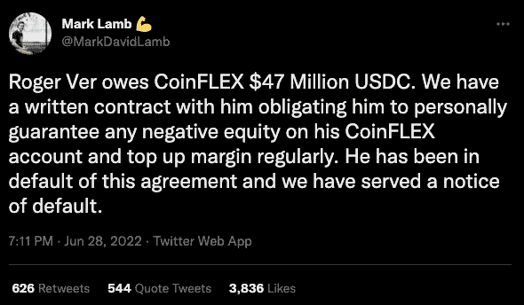**

***图片来自* [*推特*](https://twitter.com/MarkDavidLamb/status/1541831697787928576?ref_src=twsrc%5Etfw%7Ctwcamp%5Etweetembed%7Ctwterm%5E1541831697787928576%7Ctwgr%5E%7Ctwcon%5Es1_&ref_url=https%3A%2F%2Fdecrypt.co%2F104014%2Fcoinflex-bitcoin-jesus-roger-ver-behind-withdrawal-troubles-47m-debt) *。***

**此后，Ver 否认了这一指控。**

**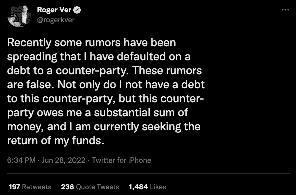**

***图片由* [*推特*](https://twitter.com/rogerkver/status/1541822377461415936?ref_src=twsrc%5Etfw%7Ctwcamp%5Etweetembed%7Ctwterm%5E1541822377461415936%7Ctwgr%5E%7Ctwcon%5Es1_&ref_url=https%3A%2F%2Fdecrypt.co%2F104014%2Fcoinflex-bitcoin-jesus-roger-ver-behind-withdrawal-troubles-47m-debt) *提供。***

**不过，Ver 是 CoinFLEX 的投资者和股东，这一点不值一提。**

**由于 4700 万美元的债务，CoinFLEX 不得不暂停客户提款。为了给他们受到侵蚀的流动性提供资金，CoinFLEX 正在做一些被一些人恰当地称为“令人惊讶的德根”的事情:他们正在出售债务令牌 rv(美元)，并提供 20%的 APY。**

**看起来 crypto 显然不能克服这个“20% APY”的策略。**

**简而言之，我们有一个中央加密交易所(在塞舌尔注册)和收益生成平台，向一个个人提供了 4700 万美元的无抵押贷款。这个人拖欠了贷款，为了筹集资金以恢复客户提款，该平台将债务令牌化并出售给人们，同时还加入了 20%的 APY。**

**Crypto twitter 并没有积极接受这个计划。**

****

# **对比特币底部的探索仍在继续**

*   **如果价格持续下跌，比特币矿工会怎么样？ **(** [**)链接**](https://bitcoinist.com/what-happens-to-bitcoin-miners-if-price-keeps-dropping/) **)****
*   **德意志银行:比特币比数字黄金更像'数字钻石' **(** [**链接**](https://tokenist.com/deutsche-bank-bitcoin-is-more-like-digital-diamonds-than-digital-gold/) **)****

# **矿工缓慢接近 BTC 抛售**

**经过几个月长达 3 万美元的维护，比特币价格正试图保持在 2 万美元的范围内。已经有两次跌入 18000 美元的区间，但很快就收回了。和以前一样，每个人心中的问题是——底部在哪里？**

**为了预测底部，一些分析师将目光投向了 2014 年比特币的上一轮熊市。基于此，价格可能低至-86%。这使得潜在底部达到 1 万美元。正如你所看到的，在每次跌入较低区间时，交易量都会增加，以捍卫 6 月份的新低。**

**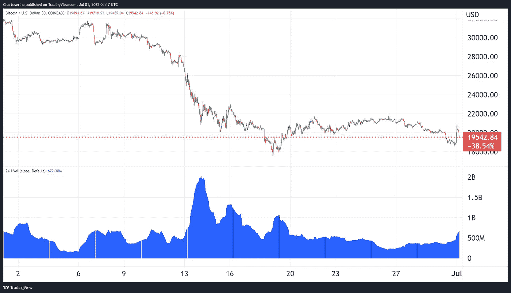**

***比特币的交易量紧跟价格波动。图片信用:* [*交易查看*](https://tradingview.com/) *。***

**然而，这一交易量不仅与极度恐惧的市场情绪形成对比，也与比特币矿商形成对比。许多矿业公司在上一轮牛市中借了钱，预计到 2021 年底比特币会涨到 10 万美元。其他公司依靠出售 BTC 来支付运营成本。**

**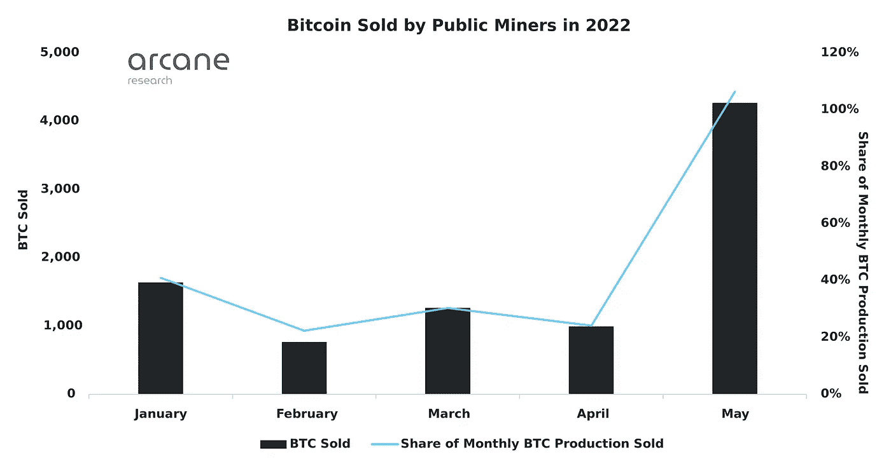**

***图像功劳:* [*奥术研究*](https://arcane.no/research/survival-of-the-fittest-which-public-bitcoin-miners-are-the-best-prepared-to)**

**这个等式很简单。与运营成本相比，在 BTC 价格再创新低的情况下，比特币矿工的收入有多少？具体来说，购买 ASIC 矿用机器的成本和昂贵的管理费用，如大量的电力。**

**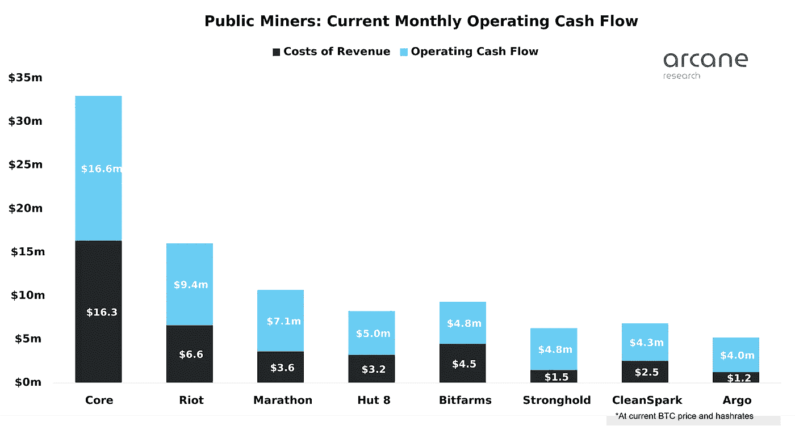**

***图像功劳:* [*奥术研究*](https://arcane.no/research/survival-of-the-fittest-which-public-bitcoin-miners-are-the-best-prepared-to)**

**如果我们只考虑 2022 年剩余的机器支付，我们就剩下以下阵容。马拉松是目前出售 BTC 风险最高的公司，因为它的剩余付款是现金收入的 6.2 倍。**

**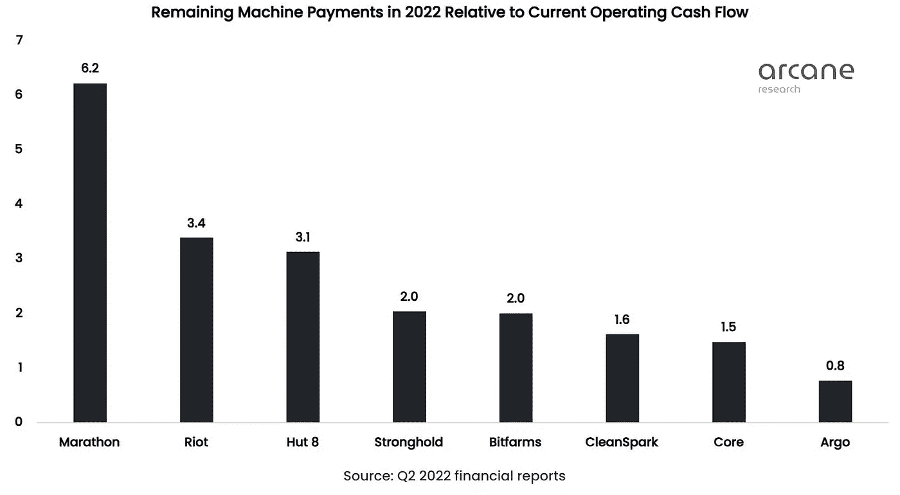**

***图像功劳:* [*奥术研究*](https://arcane.no/research/survival-of-the-fittest-which-public-bitcoin-miners-are-the-best-prepared-to)**

**换句话说，只要 BTC 价格保持在如此低的水平，就会耗尽比特币矿业公司的流动性。然后，它们可能会引发大规模抛售，进一步压低价格，除非 crypto whales 以同样的方式回应。反过来，他们也会投身其中。**

**说到这里，MicroStrategy [的迈克尔·塞勒(Michael Saylor)周三宣布，他以 20.8 美元的价格购买了另外 480 个 BTC，使 MSTR 的比特币持有量达到 129699 个。这是底部的信号吗？](https://twitter.com/saylor/status/1542117682207678465)**

**没有人知道在这些极端的市场水域。矿业公司可能会寻求更多的债务和再融资交易。有一点是肯定的:矿商将在决定 BTC 的底部方面扮演关键角色。**

****

# **欧盟接近实现数字资产的 GDPR**

*   **欧盟就清理加密“狂野西部”的标志性法规达成一致 **(** [**链接**](https://www.cnbc.com/2022/06/30/eu-agrees-to-deal-on-landmark-mica-cryptocurrency-regulation.html) **)****

# **不伟大，也不可怕**

**欧盟(EU)由 27 个国家组成，覆盖 7.475 亿人口，昨天达成了一项具有里程碑意义的加密法规。这部名为《加密资产市场》( MiCA)的新法律是首个全大陆范围的全面监管框架。然而，作为最后一步，它还没有得到理事会和欧洲议会的批准。**

**MiCA 在十年来最糟糕的熊市期间发行，这是巧合吗？不太可能，因为它已经酝酿了多年。四月，草案取消了最低转会豁免，这引起了相当大的担忧。**

**正如法国财政部长所言，政客们将 MiCA 框定为“终结加密的狂野西部”。迄今为止，云母已被证明是一个大杂烩。**

**为了保护消费者免受类似银行挤兑的影响，稳定的硬币发行者必须有充分支持的储备以防止破产。然而，与此无关的是 stablecoins 的每日交易上限为 2 亿欧元。不用说，鉴于仅 USDT 和 USDC 的日交易量就高达数十亿美元，这是不可行的:**

**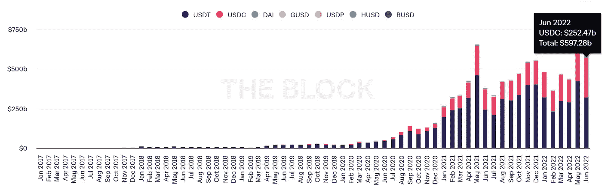**

***月度稳定销量。图像来源:* [*区块*](https://www.theblock.co/)**

**同样不清楚的是，这是如何用加密支持的稳定密码实现的，例如戴(Dai)。**

**当涉及到常规加密货币时，代币发行者将不得不提供白皮书，因此他们对误导性信息负有责任。**

**接下来，加密交易所将被指定为加密资产服务提供商(CASPs)。也就是说，他们将需要一个许可证，他们的业务将受到欧洲证券和市场管理局(ESMA)的监督。**

**监控不包括 CASPs 之间的加密传输的最小豁免。同样，所有交易都必须可追踪真实身份。这属于欧盟反洗钱框架《资金转移条例》(TFR)的管辖范围。从好的方面来看，TFR 不适用于 P2P 转账，即从一个非托管钱包到另一个钱包的转账。**

**不利的一面是，TFR 确实适用于非保管钱包向 CASPs 的转移。令人欣慰的是，在这种情况下，最低要求得到了落实。对于 1000 欧元以下的转账，如果钱包不属于 CASP 的客户，TFR 跟踪不是强制性的。**

**否则，CASP 必须以某种方式验证钱包的所有权。所有这些 TFR 追踪规则将在 MiCA 最终确认后 18 个月生效。可以预见的是，MiCA 将不得不遵守欧盟以前具有里程碑意义的隐私框架——GDPR，这是世界上最严格的隐私规则，它阻止了数千个网站在没有 VPN 服务的情况下工作。**

**总的来说，云母留下了一些平衡的回旋余地。然而，一旦 ESMA 的日常执法工作上线，一幅更清晰的画面将会凝聚起来。**

# **本周推特**

**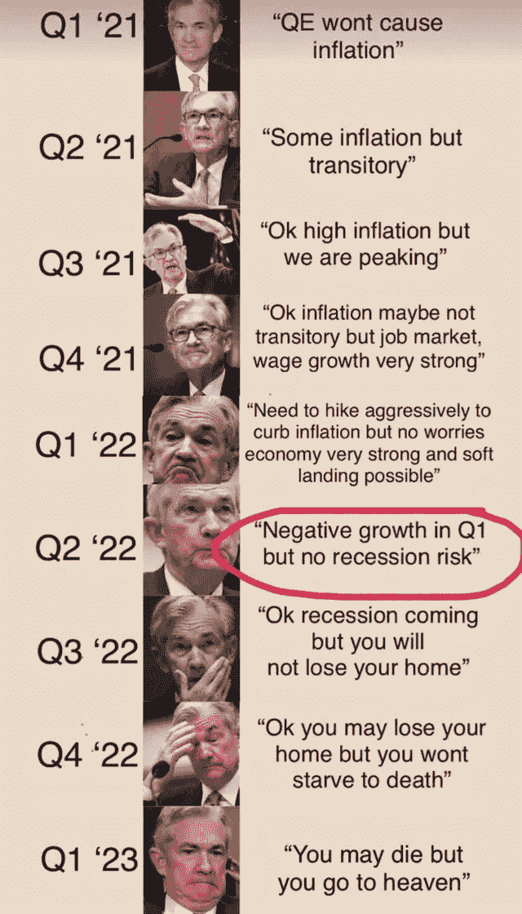**

> **JPow 从乐观到哦，上帝，我们都要死了。**

**[**@ mayhem markets**](https://twitter.com/Mayhem4Markets/status/1542657948241076225)**

**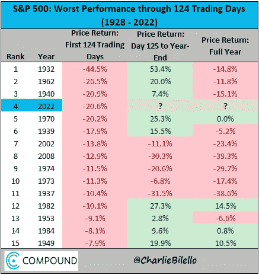**

> **2022 年上半年，S&P 下跌 20.6%，是该指数自 1962 年以来最糟糕的年初。$SPX**

**【T4**@ charliebilello****

**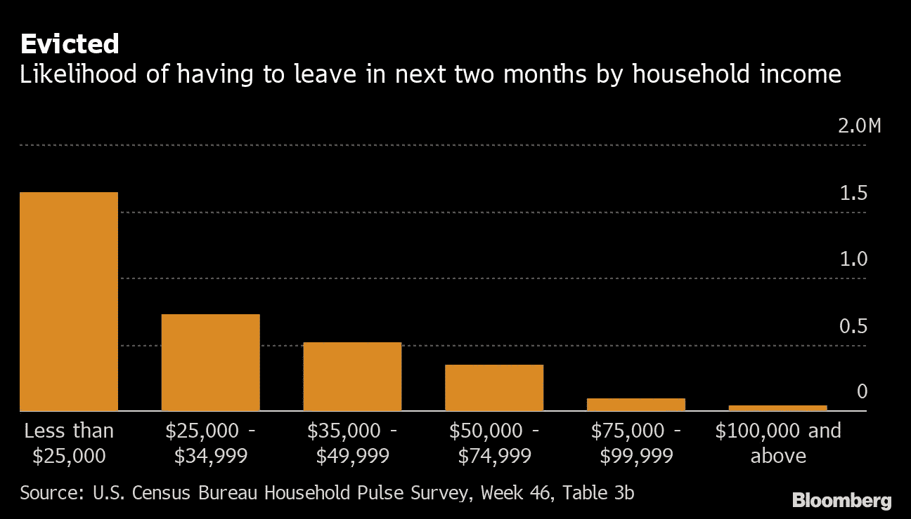**

> **6 月初的⁦显示，约有 15%，即 840 万美国人拖欠房租**
> 
> **@uscensusbureau⁩调查…~ 350 万家庭表示，由于 eviction⁦，他们很可能或有点可能在未来两个月内离开他们的房子**
> 
> **@彭博**

**[**@ LizAnnSonders**](https://twitter.com/LizAnnSonders/status/1541730822830673923)**

****

> **Q1 国内生产总值为负 1.6%**
> 
> **如果亚特兰大联邦储备银行的 GDPnow 是准确的，那么衰退已经开始了。**

**[@ biancore search](https://twitter.com/biancoresearch/status/1542540738394824706)**

**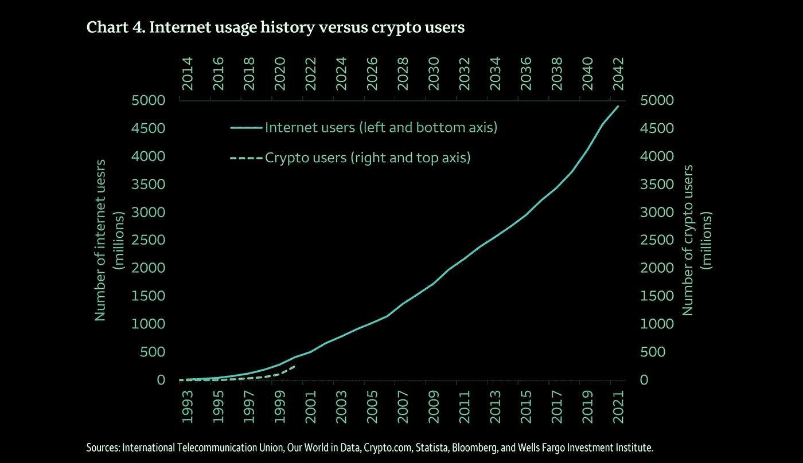**

> **富国银行(Wells Fargo)报告称，与#互联网类似，比特币正接近“过度采用阶段”的“拐点”🌐20 世纪 90 年代中后期。**

**[**@ documenting TC**](https://twitter.com/DocumentingBTC/status/1541382894526013440)**

# **加入五分钟金融时事通讯。**

****

**[Sign up here — it’s free.](https://tokenist.com/newsletter/?utm_source=getresponse&utm_medium=email&utm_campaign=thetokenist&utm_content=%E2%9C%8B%20FMF%3A%20BoA%20Readying%20for%20BTC%2C%20Pot%20Goes%20Federal%2C%20More%20Inflation)**

****

**[t.me/thetokenist](http://t.me/thetokenist?utm_source=getresponse&utm_medium=email&utm_campaign=thetokenist&utm_content=%E2%9C%8B%20FMF%3A%20BoA%20Readying%20for%20BTC%2C%20Pot%20Goes%20Federal%2C%20More%20Inflation)**

****

**[twitter.com/thetokenist](https://twitter.com/thetokenist)**