# 金融五分钟:欧洲央行称 BTC 的“最后一战”到了

> 原文：<https://medium.com/coinmonks/five-minute-finance-ecb-says-btcs-last-stand-is-here-telegram-s-foray-into-defi-556deee0bb0b?source=collection_archive---------33----------------------->

注册免费的每日时事通讯,永远不要错过宏观金融的突破性发展。

# 5 分钟的金融时事通讯——解释发生了什么，为什么。

# 让我们看看这周发生了什么:

*   欧洲央行告诉我们，BTC 又要死了
*   鲍威尔如何谈论市场
*   电报想加入 DeFi
*   作为时代的标志，索拉纳的主要钱包转向多链
*   苹果希望从比特币基地那里获得一大笔费用

# 欧洲央行表示，比特币的“最后防线”已经到来

*   当前的比特币熊周期与 2014 年和 2018 年相比如何 **(** [**链接**](https://tokenist.com/how-the-current-bitcoin-bear-cycle-compares-to-2014-and-2018/) **)**

# 欧洲央行的说法有任何合法性吗？

欧洲央行(ECB)刚刚经历了“抗议过度”的时刻。欧洲央行总干事乌尔里希·宾德塞尔(Ulrich Bindseil)首次在央行会议室正面谈到了比特币这头大象，他的措辞异常情绪化。

ECB 博客文章的标题本身就不那么中性——指的是山姆·班克曼·弗里德的 FTX 帝国突然崩溃，抹去数十亿美元价值后的加密空间。

欧洲央行指出，比特币从 69k 美元的历史高点下跌了-77%，跌至 20k 美元以下，该行将其定义为“T12 一种人为诱导的***走向无关紧要之路 T19 之前的最后一搏****”。*

但这是真的吗？

为了调查，我们知道*欧洲央行是怎么想的*，但是现在我们需要试着理解*为什么*欧洲央行会这么想。

首先，欧洲央行文章的第一部分题为“*比特币很少用于合法交易”。然而，在这一部分，完全没有提到比特币交易的合法性。*

自诞生之日起，比特币就在局外人中享有声誉，被匿名网络罪犯用作神秘的黑色货币。然而在现实中，所有加密货币交易中只有很小一部分是非法的:

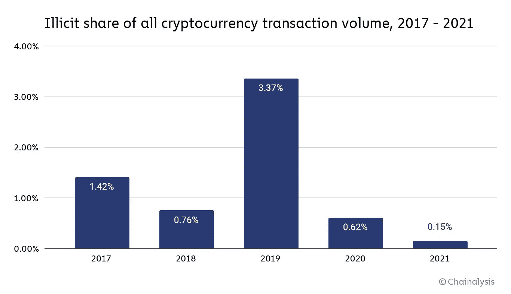

*根据 Chainalysis，2021 年，所有加密货币交易量的 0.15%被认为是“非法的”。图片来源:* [*链接分析*](https://blog.chainalysis.com/reports/2022-crypto-crime-report-introduction/)

近年来，比特币的使用案例越来越多，而不是非法使用。例如，截至今天，上市公司持有超过 19 万枚比特币。

比特币的用户活跃度呢？

要想知道比特币是否“走上了一条无关紧要的道路”，让我们先来看看自 2009 年比特币推出以来，这条道路的状况:

*   6 个月内—超过 1000 名用户
*   5 年内—超过 100 万用户
*   在推出后的 13.8 年内—超过 3 亿用户

如果比特币的未来增长轨迹与之前的增长一致，它将在未来 3 年内达到 10 亿用户，占世界人口的 12%。我们将看到这在未来几年如何发展。

比特币的价格呢？

当前的熊市看起来相当糟糕。比特币已经从一年前的大约 69000 美元的 ATH 跌至 17000 美元的区间，这使得价格下跌成为一个相当容易的目标。

就缺失的上下文而言，比特币的价格历史暗示了什么？

对于那些研究比特币已经有一段时间的人来说，当前的熊市似乎只是路上的一个小颠簸。原因是，当回顾过去时，比特币有巨大的回报来抵消 2014-15 年和 2018-19 年的熊市。

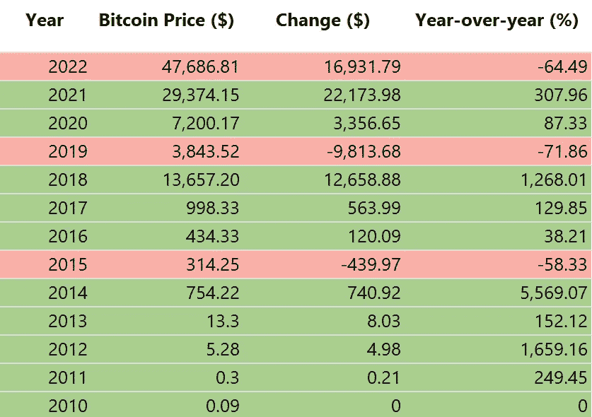

*每年 1 月 1 日的比特币历史价格。最长的熊市从 2014-15 年持续了 407 天，导致价格从当时的 ATH 回调了-85%。目前 ATH-77%的回调已经持续了 378 天。*

年初至今，比特币已经下跌了 64%。

那么遭受如此重大损失的仅仅是比特币吗？

不完全是。世界上最大的社交媒体集团 Meta 在 2022 年也遭遇了类似的命运。

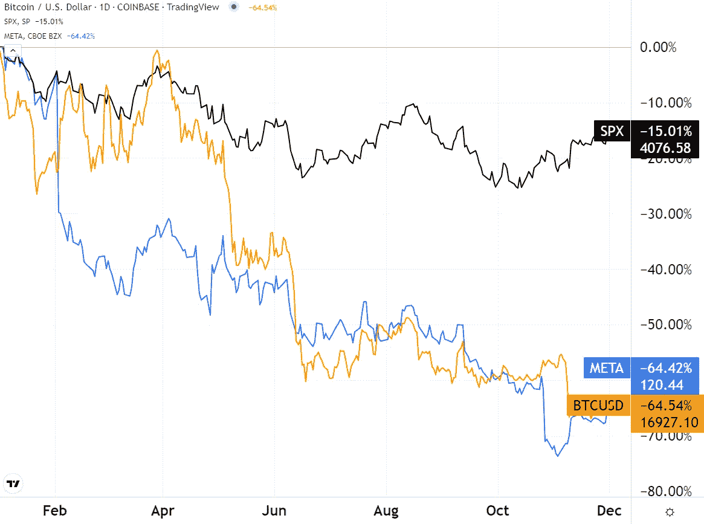

*元平台(Meta)对比特币(BTC)对标准普尔 500 指数(SPX)年初至今。图片信用:* [*交易视图*](https://www.tradingview.com/)

原因是我们这些天太熟悉的宏观经济因素。美联储加息抑制了所有资产价格。反过来，随着投资者全面远离风险资产，比特币的公共网络收到了这种人性化的信号。

因此，比特币的价格活动堪比 Meta 等科技股。

然而，有一个很大的不同——比特币的无许可自动纠错网络。

比特币矿工目前的情况是比特币健康状况的一个指标，使其比一家公司更稳健。在经济低迷时期，像 Meta 这样的公司会怎么做？当然，它会解雇员工，就像扎克伯格本月解雇 11，000 人一样。

而比特币是做什么的？网络的计算能力(哈希速率)现在比历史最高水平下降了 13%。这是必然会发生的，因为考虑到电力成本和初期采矿设备投资，如果 BTC 价格下降，矿商的盈利能力就会下降。

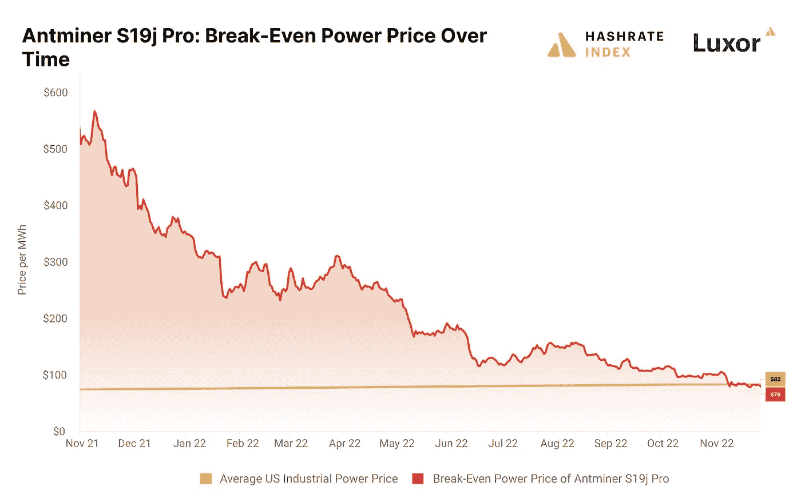

*比特币矿工的主要设备之一——蚂蚁金服 S19J Pro——在美国已经不再盈利。图片鸣谢:卢克索。*

那么比特币是不是注定要失败，因为没有比特币矿工就没有比特币？不会，因为比特币挖矿难度会自我调整，每 2016 块后:

*   矿工多→挖掘难度高→计算成本高
*   矿工减少→挖掘难度降低→计算成本降低

这种安全/激励措施嵌入到比特币的代码中，导致这种定期循环发生，通常被称为——矿工投降。

因此，简而言之，欧洲央行基本上是在宣称比特币的末日即将到来。但如果我们看看他们提供的理由——以及比特币目前的痛点——似乎欧洲央行的说法是……没有根据的。

# 鲍威尔改变了语气

*   BTC 收回 17k 美元，道指跳涨 2%:鲍威尔如何操纵市场 **(** [**链接**](https://tokenist.com/btc-reclaims-17k-dow-jumps-2-how-powell-moved-the-markets/) **)**

# 慌乱的市场夺走了鲍威尔提供的所有救命稻草

美联储主席杰罗姆·鲍威尔周三在哈钦斯财政和货币政策中心澄清了他的货币思路。

不久之后，市场反弹，道琼斯工业平均指数上涨 2.18%，打破了连续 3 个月的跌势。同样，以纳斯达克综合指数为代表的科技股上涨了+4.41%。

鲍威尔说了什么产生了如此大的影响？

首先，鲍威尔再次强调了美联储的核心使命:

*“没有价格稳定，经济对谁都没用。特别是，如果没有价格稳定，我们将无法实现惠及所有人的持续强劲的劳动力市场环境。”*

提醒一下，虽然通货膨胀(CPI)从 9 月份的 8.2%下降到 10 月份的 7.7%，但它仍然是一个增长率，衡量的是随着时间的推移(每年)有多少东西在增长。

然而，鲍威尔看到了这方面的一些进步:

*   12 个月的核心商品通胀率为+4.6%，但比年初下降了近 3%。
*   在过去的 12 个月中，住房通货膨胀率持续上升，目前为 7.1%，但这是一个滞后指标。
*   除住房以外的核心服务构成了通胀压力的主要部分。他们受工资驱使。

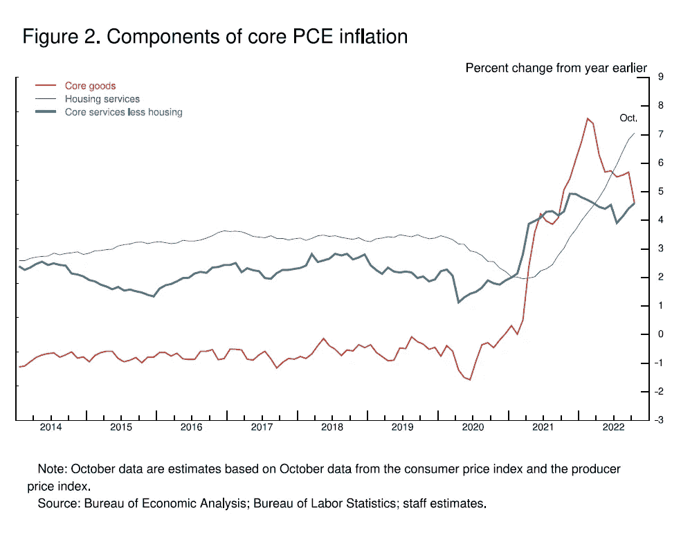

虽然一些线处于上升趋势，但鲍威尔现在正在考虑放缓美联储加息步伐的可能性。图片来源:

*美联储的目标通胀率仍保持在 2%。因此，鲍威尔对名义工资(+4.7%)一直以“远高于 2%通胀率的速度增长”感到不满。*

*尽管这可能会让一些人感到不安，但鲍威尔的工作是从宏观角度思考问题，因此他澄清说“*要使工资增长可持续，它需要与 2%的通胀率保持一致*”。*

*但是，鲍威尔似乎终究想要软着陆，软化自 20 世纪 80 年代初以来最激进的加息。他说，加息需要一段时间才能真正体现出来。*

*市场反弹是这样的-*

*“放缓加息步伐的时间最早可能会在 12 月份的会议上到来。”*

*在连续四次 75 个基点的加息导致目前 4%的利率后，12 月份的下一次加息应该是 50 个基点。尽管市场价格已经反映了这一点，但在鲍威尔的演讲之后，CME 的可能性从 65%上升到了 79.4%。*

*看来这实际上是一场心理游戏。鲍威尔的鹰派作风让投资者今年变得非常腼腆，因为他实际上是在唱衰市场。这导致了比 2008 年大衰退期间更多的焦虑。*

*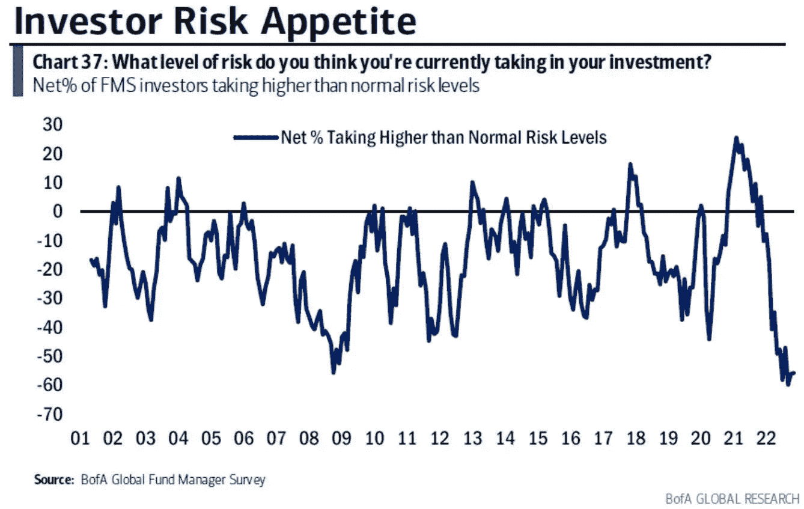*

**图片来源:美国银行全球研究**

*由于不知道会发生什么，投资者的焦虑达到了前所未有的高度，表现为极度的波动。习惯了这种方式，即使是对“定价”的确认也有实质性的影响。*

**

# *电报旨在成为一个重量级加密？*

*   *电报抨击加密过度集中，计划自己的钱包，交换 **(** [**链接**](https://tokenist.com/telegram-slams-crypto-over-centralization-plans-own-wallet-exchange/) **)***

# *Telegram 的 TON 区块链恢复加密信心？*

*在 FTX 的崩溃导致客户损失高达 100 亿美元后，人们对集中交易的信心被深深地动摇了。*

*理应如此。*

*加密空间的回应是围绕[储量证明和负债证明](https://tokenist.com/can-proof-of-reserves-really-prove-an-exchanges-solvency/)的讨论，而用户的回应是使用 DeFi。*

*毕竟，分散交易所(DEXes)由用户自己出资，并与他们自己的非托管钱包相连，没有人可以轻轻一按开关就突然停止取款。*

*这是现在电报的雷达。首席执行官帕维尔·杜罗夫抨击 FTX 的惨败是一个警钟，[呼吁所有开发者走上去中心化的道路。](https://t.me/durov/202)*

**“我们，开发者，应该通过为大众构建快速且易于使用的去中心化应用来引导区块链产业远离中心化。这样的项目今天终于可行了。”**

*客观地说，FTX(国际和美国)在巅峰时期拥有超过 500 万的活跃用户。Telegram 是一款基于云计算的即时通讯软件，可与 WhatsApp 相媲美，拥有 5 亿月活跃用户，是 FTX 的 100 倍。*

*更重要的是，数以百万计的 Telegram 用户以加密为中心，“加密”与“电影”和“新闻”类别一样受欢迎。*

*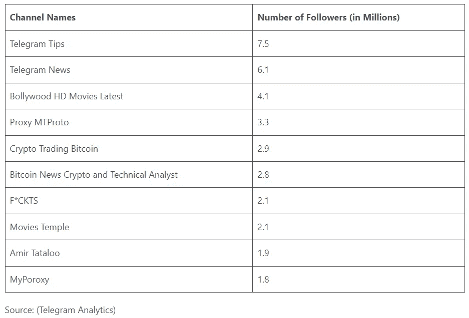*

*【图片来源:】[*DemandSage.com*](https://www.demandsage.com/telegram-statistics/)*

*这还不包括数百个其他基于加密的渠道。一个受欢迎的加密新闻频道的创始人将 Telegram 描述为“加密社区的基石”。(我们也这么认为——如果你是电报用户，请点击这里查看我们的频道*

*但是电报 DEX 表现如何呢？*

*杜罗夫已经部署了一个名为 Fragment 的完全分散的拍卖平台。它由区块链开放网络主办。令人惊讶的是，它甚至比以太坊 2.0 还快。*

*而以太坊每 12.8 分钟增加一个新块，TON 每 5 秒就能增加一个。*

*此外，TON 已经拥有完整的分片支持，以太坊计划在下一次大升级 Surge 中实现这一点。分片——划分网络工作负载——对于大规模采用至关重要。*

*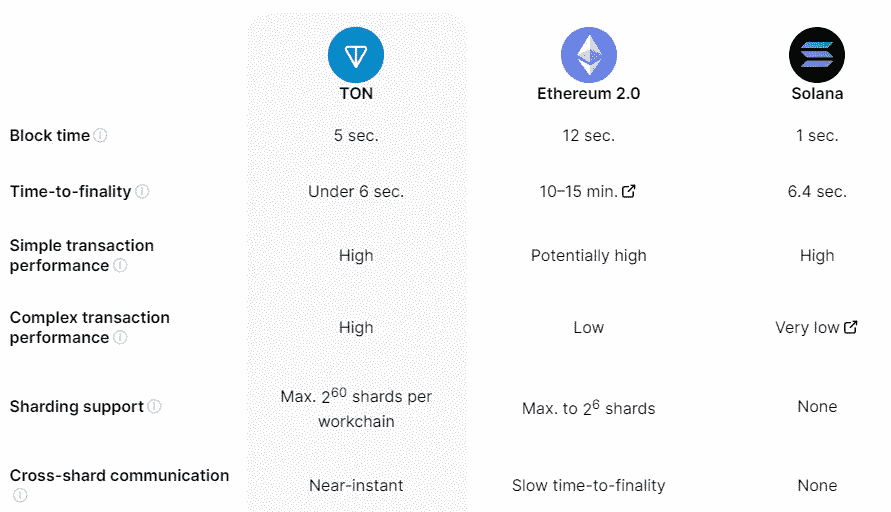*

**TON vs 合并后以太坊 vs. Solana。图片来源:*[*Ton.org*](https://ton.org/analysis)*

*如果 Telegram 充分利用其加密友好的用户基础和吨区块链，我们甚至可以看到一个币安的竞争对手，它目前拥有所有交易量的 75%，同时服务于~ 3000 万用户。*

*[**享受 5MF？点击转发给三个朋友。**](mailto:info@tokenist.com?subject=Check+this+out+&body=I%E2%80%99ve+been+reading+Five+Minute+Finance,+and+I+know+you%E2%80%99d+enjoy+it+too.+It%E2%80%99s+a+weekly+email+that+covers+the+most+important+trends+in+finance.+I+learn+something+new+every+time+I+read+it!+Check+it+out+here:+https://tokenist.com/newsletter/?utm_source=email_gr_btn)*

**

# *幻影转向以太坊*

*   *幻影钱包扩张至以太坊，多边形如索拉纳暴跌 92% YTD **(** [**链接**](https://tokenist.com/phantom-wallet-expands-to-ethereum-polygon-as-solana-plummets-92-ytd/) **)***

# *索拉纳排水导致幻影寻找更绿色的秘密牧场*

*FTX 的破产不仅仅是贷款公司 BlockFi 和 Genesis 的破产。从 2020 年首次发行硬币开始，SBF 的触角就牢牢抓住了索拉纳区块链。*

*最终，这种与 FTX/阿拉米达的纠缠使索拉纳从其 TVL(总价值锁定)峰值 101.8 亿美元跌至仅 3.6 亿美元。*

*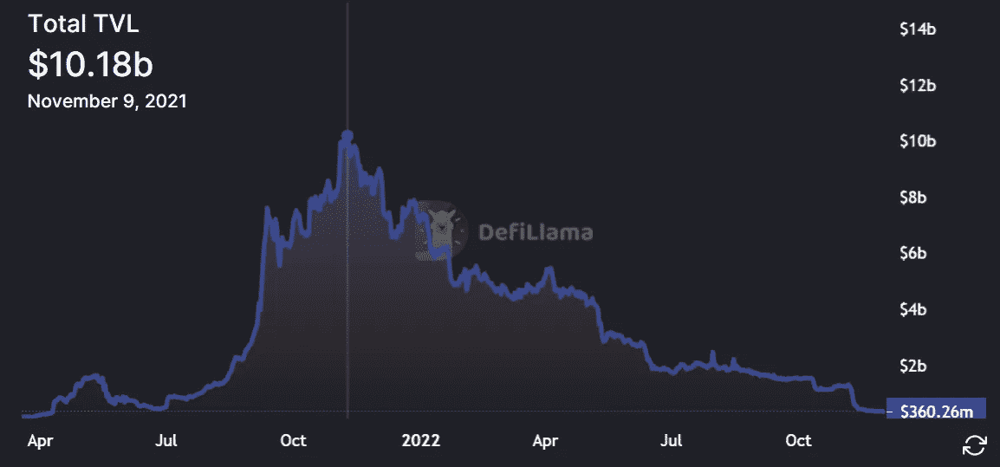*

**今年，美联储加息和 FTX 风险敞口对 Solana 来说是致命的组合。图片来源:* [*不毛之地*](https://defillama.com/chain/Solana)*

*SBF 的阿拉米达研究公司仍然持有 48，648，493 枚 SOL 代币，价值超过 6.47 亿美元。SOL 作为 Solana 的本地加密货币，今年迄今已经贬值了-92%。随着破产管理人清算阿拉米达的溶胶储备，以使债权人完整，未来可能会有更多的溶胶贬值。*

*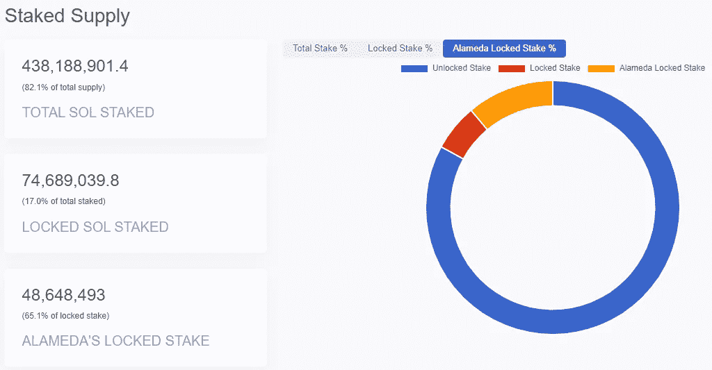*

**阿拉米达研究 SOL 代币供应，现在掌握在破产管理人手中。图片来源:* [*索拉纳*](https://solanacompass.com/tokenomics)*

*但是索拉纳与 SBF 的命运般的伙伴关系并没有就此结束。他大量参与了 Solana 的主要分散式交换血清(SRM)的融资，该股现在已经下跌了-94%，FTX 的 token (FTT)下跌了-97%。*

*此外，索拉纳基金会持有下列资产:*

*约 324 万股 FTX 贸易有限公司普通股*

*约 343 万 FTT 代币*

*约 1.3454 亿个 SRM 令牌*

*作为时代的标志，Solana 的主要自保管钱包 Phantom 的开发者正在转向成为多链钱包的支持者。支持菜单上的第一个是以太坊和多边形，这是以太坊的可扩展性网络，提供更低的费用和更快的传输。*

*有趣的是，Polygon 的 TVL 现在比 Solana 的整个生态系统高 3.5 倍。对于加密用户来说，Phantom 带来了一种急需的新鲜感——无需切换即可连接到区块链。*

*“就像人们不会切换网络浏览器来访问不同的网站一样，我们相信 web3 需要一个钱包来无缝地访问您需要的东西。”*

*每一个成功的企业都可以证明这一原则。对于主流数字资产的采用来说，最终用户不能被区块链的细节所困扰，就像他们在杂货店使用信用卡时不会被电子支付基础设施所困扰一样。*

**

# *苹果希望从比特币基地获得 30%的费用分成*

*   *苹果阻止比特币基地钱包更新，要求每笔 NFT 交易的 30%**(**[**链接**](https://tokenist.com/apple-blocks-coinbase-wallet-update-demands-30-of-every-nft-transaction/) **)***

# *App Store 的更多问题*

*苹果公司向仅次于币安的第二大加密交易所比特币基地提出了一个非常奇怪的要求。对于比特币基地 NFT 交易的转让费(汽油费)，苹果将抽取 30%。*

*为什么？因为苹果的应用内购买商店允许比特币基地在那里。但突出的问题是，这些 NFT 交易发生在区块链，与苹果无关。比特币基地称这一要求完全不可思议。*

*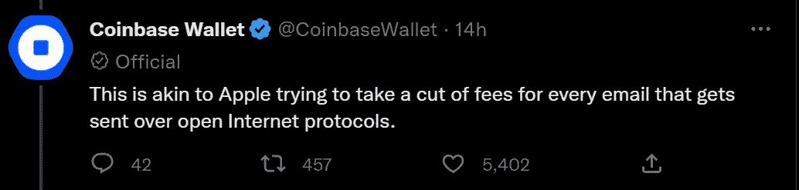*

**图片来源:* [*推特*](https://twitter.com/CoinbaseWallet/status/1598354823501447168)*

*实际上，持有 NFT 的 iPhone 用户，无论是来自区块链游戏还是个人资料图片，现在都陷入了困境。如果他们想送一个 NFT 作为礼物或者只是为了另一个钱包，苹果公司(Apple)的征税大锤来了。*

*这已经不是苹果的“围墙花园”第一次以有争议的方式被叫出来了。尖端的虚幻引擎 5 和堡垒之夜背后的公司 Epic Games 在 2020 年起诉苹果，要求软件开发商为消费者的应用内购买支付 30%的佣金。*

*同样，拥有 1 . 95 亿付费用户的音频流媒体服务 Spotify 在欧洲对苹果提起了反垄断诉讼。在最近的[长篇帖子](https://twitter.com/eldsjal/status/1597936768523063297)中，Spotify 首席执行官丹尼尔·埃克将苹果持续的“欺凌”策略和垄断滥用列为应用商店看门人。*

*特斯拉首席执行官兼 Twitter 新所有者埃隆马斯克(Elon Musk)也暗示，随着埃隆放松版主政策，苹果可能会将 Twitter 从其商店中移除。周三，他与苹果首席执行官蒂姆·库克解决了这个问题。*

*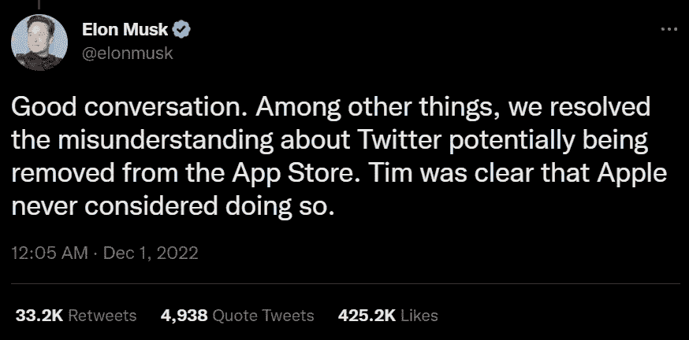*

**图片来源:* [*推特*](https://twitter.com/elonmusk/status/1598090996281413638)*

*与此同时，苹果陷入了困境。富士康周振工厂的中国工人举行抗议活动，反对工作条件和中国的“零补贴”政策。该工厂雇佣了约 20 万名员工，负责 85%的 iPhone 组装产能。*

*而苹果是做什么的？他们[限制抗议者 iPhones 上的隔空投送](https://www.foxbusiness.com/technology/apple-restricts-airdrop-file-sharing-china-protesters-used)功能，因此他们不能有效地沟通和组织。然而，这次糟糕的公关似乎并没有影响到苹果(AAPL)的股票。尽管年初至今，AAPL 下跌了-18.52%，但一周内却上涨了+1.92%。*

# *本周推特*

*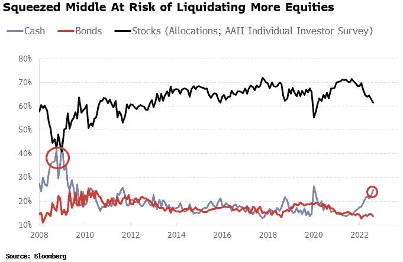*

*中产阶级会清算他们持有的股票吗？如果是这样的话，这可能是标志着持久的股市底部的一部分(就像在以前的熊市中一样)。*

*[**@ mayhem markets**](https://twitter.com/Mayhem4Markets/status/1598478080632557568)*

*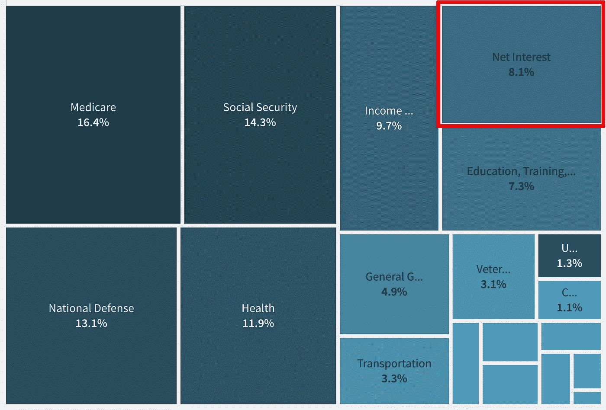*

*今天学到了一件新东西*

*美国政府支出的 8.1%(7000 亿美元以上)用于支付利息。*

*没有商品，没有服务——只有债务的纯利息。*

*绝对令人震惊的统计数据！*

*[**@FatManTerra**](https://twitter.com/FatManTerra/status/1598075061478785026)*

*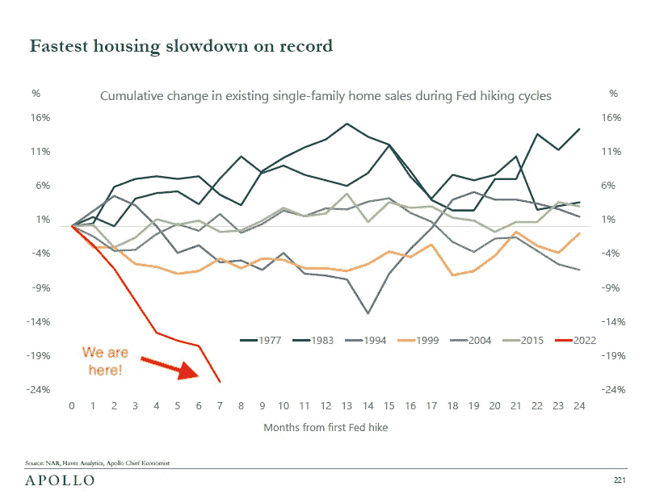*

*房地产市场正在酝酿一场风暴。*

*单户住宅销售正在内爆，房地产刚刚经历了十年来最大的下跌！*

*加州和德克萨斯州市场在 6 个月内下跌了 15%,消费者信心现在处于 2008 年危机时的水平。*

*on🧵，事情是这样的*

*[**@ Graham Stephan**](https://twitter.com/GrahamStephan/status/1597952028411559939)*

*因此，BlockFi 是 FTX 的债权人，贷款给 Alameda，贷款给 Emergent，后者是 SBF 拥有的一家空壳公司，购买了 Robinhood 的股票，这些股票被抵押作为担保，以担保 BlockFi 向 FTX 提供贷款，这笔贷款用于救助 BlockFi 本身*

*[@ ayko 2718](https://twitter.com/ayko2718/status/1597432454070956032)*

*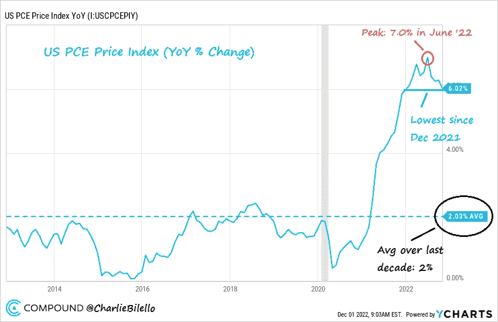*

*美国通胀率下降的更多证据…*

*PCE 价格指数降至 6%，为去年 12 月以来的最低水平。6 月份达到 7%的峰值。*

*[**@ charliebilello**](https://twitter.com/charliebilello/status/1598320972158959617)*

# *加入五分钟金融时事通讯。*

**

*[Sign up here — it’s free.](https://tokenist.com/newsletter/)*

**

*[t.me/thetokenist](http://t.me/thetokenist)*

**

*twitter.com/thetokenist*

> *交易新手？试试[加密交易机器人](/coinmonks/crypto-trading-bot-c2ffce8acb2a)或者[复制交易](/coinmonks/top-10-crypto-copy-trading-platforms-for-beginners-d0c37c7d698c)*