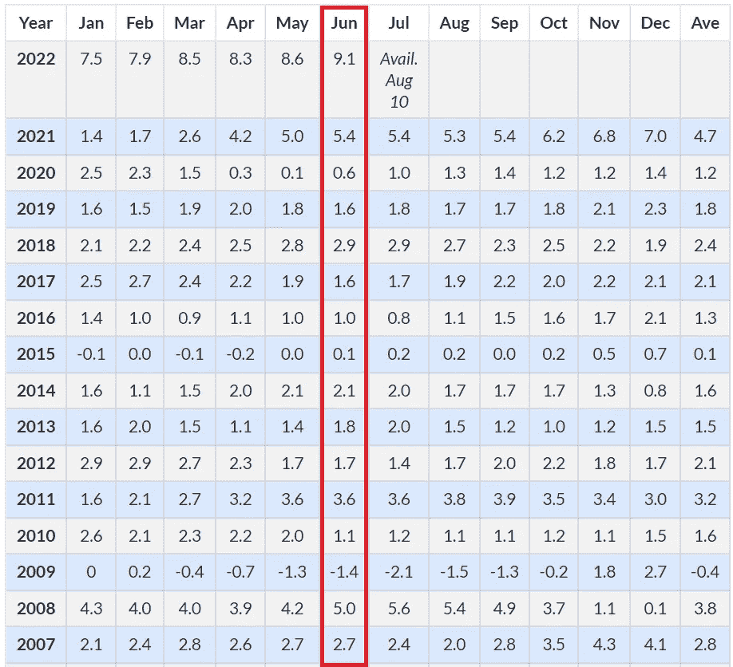
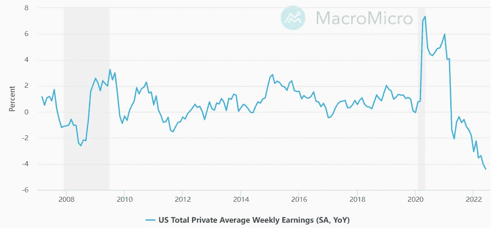
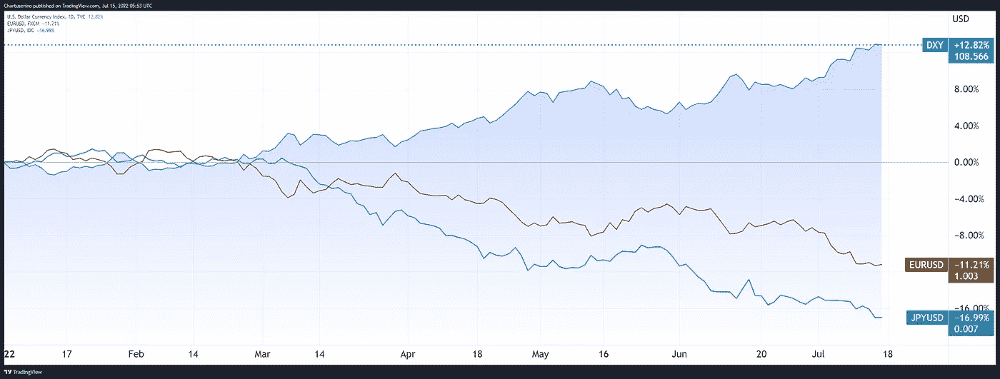
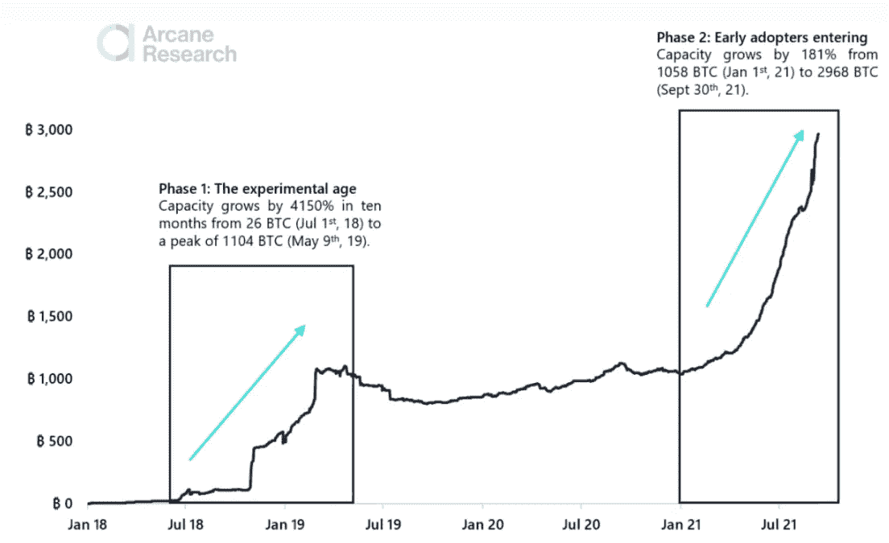
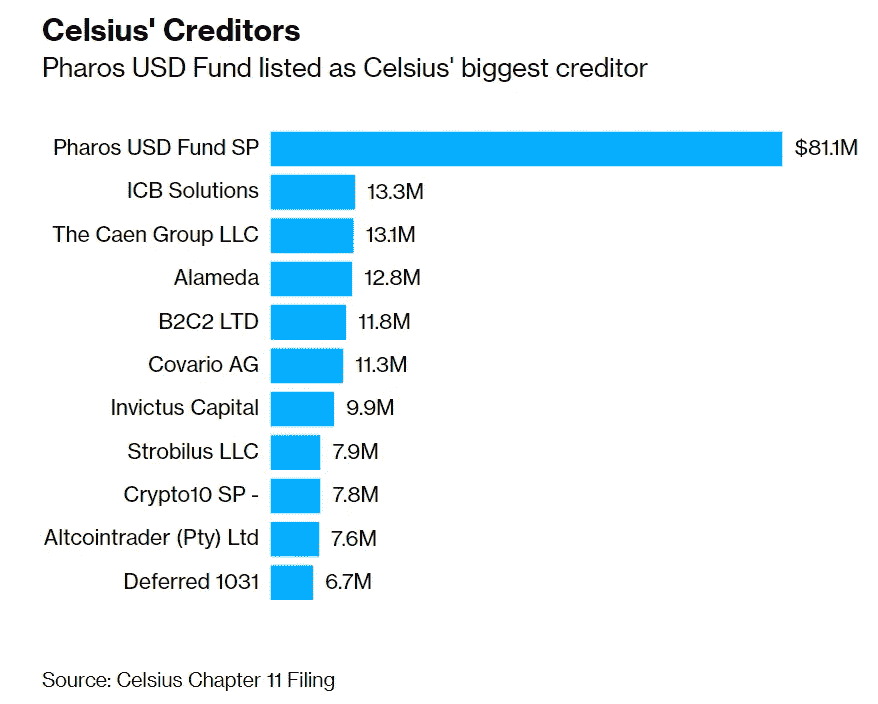
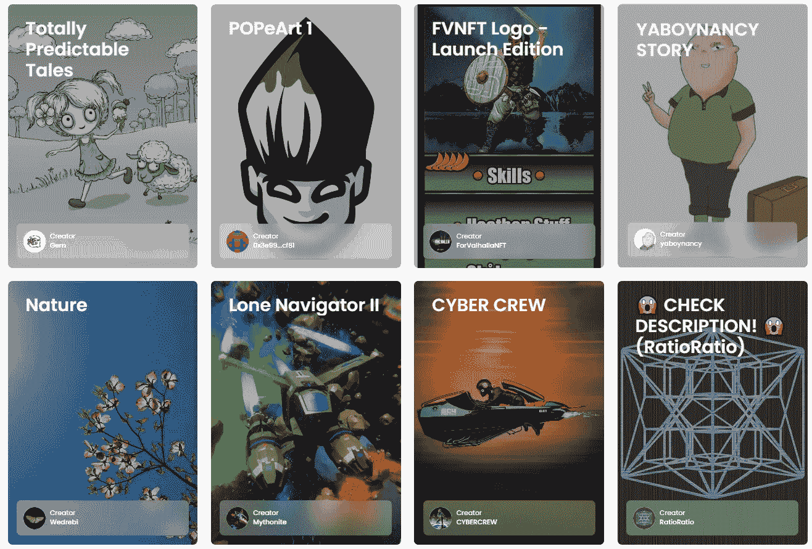
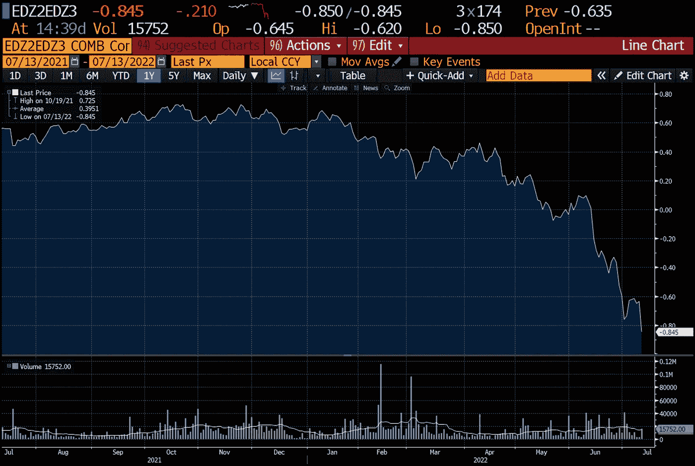
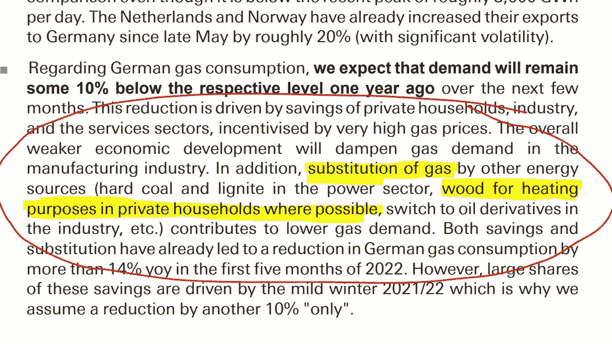

# 五分钟财经:闪电网络美联储文件，CELSIUS 破产，CPI 9.1%

> 原文：<https://medium.com/coinmonks/five-minute-finance-fed-paper-on-lightning-network-celsius-bankruptcy-cpi-at-9-1-ef9e461901c5?source=collection_archive---------19----------------------->

# 5 分钟的金融时事通讯——解释发生了什么，为什么。

# 让我们看看这周发生了什么:

*   9.1%的 CPI:美联储将如何反应？
*   闪电网络的联邦报告
*   Celsius 申请破产:储户会再次看到他们的资金吗？
*   数字资产证券回归 ETH 的老话题
*   GameStop 的新 NFT 市场已经超过了比特币基地

# 深入研究最新的 CPI 数据

*   CPI 上涨 9.1%，击败最高估计值**(******)****
*   **拜登政府淡化通货膨胀，称数据“过时” **(** [**链接**](https://tokenist.com/biden-administration-continues-downplaying-inflation-calls-data-out-of-date/) **)****

# **通货膨胀上升，但美元也是如此:后果？**

**过去一周，在 CPI 数据发布之前，我们看到了一些有趣的估计:**

*   **美国银行:8.7%**
*   **摩根大通:8.7%**
*   **瑞士瑞信银行:8.8%**
*   **摩根士丹利:8.8%**
*   **彭博共识:8.8%**
*   **花旗银行:8.9%**
*   **高盛:8.9%**

**那么谁是对的呢？他们都没有——他们都在下*估计最新的通货膨胀数字。***

**6 月份的通胀率目前为 9.1%，超过了 8.9%的最高估计，远远超过了美联储最初设定的 2%的目标。**

****

***2008 年大衰退以来的 CPI 百分比。图片来源:* [*美国通胀计算器*](https://www.usinflationcalculator.com/inflation/current-inflation-rates/)**

**作为对这一创纪录的 40 年高点的回应，拜登政府将其视为一个滞后指标，因为能源价格约占消费者价格指数(CPI)的一半。这是正确的，因为天然气价格已经连续 30 天下降。同样，原油本身也回到了 4 月份的水平，低于每桶 100 美元，这还没有体现在更低的天然气价格上。**

**迄今为止，市场对 CPI 报告反应良好。自报告发布以来，标准普尔 500 保持平稳，涨幅为+0.79%，而比特币实际上上涨了+7.5%。**

**当最新的 CPI 数据公布时，VIX——一种基于市场波动性的恐惧指标——仍保持在 20 多点的水平，没有任何明显的上升，这表明恐惧情绪有所增加。**

**所有这些都表明坏消息已经被消化了。**

**展望未来，我们可能会看到美联储的心理游戏。根据美联储理事之一 Christopher Waller 的说法，之前担心的 0.75%的加息现在是新的最小值，并暗示将加息一个百分点。**

***“如果我看到未来两周的数据显示需求仍然非常强劲，那么我将倾向于加息，”***

**这是美联储的老把戏，类似于美联储采用的心理操作吗？通过设定更高的预期，然后“未能”兑现，市场不会像原本那样不安。许多人认为，我们在 6 月初看到了这一点，当时美联储——预计将加息 0.5 个百分点——据报道正在考虑加息 0.75 个百分点。美联储通过[《华尔街日报》](https://www.wsj.com/articles/bad-inflation-reports-raise-odds-of-surprise-0-75-percentage-point-rate-rise-this-week-11655147927)实际宣布加息的两天前，人们就知道了加息的预期，这几乎就像是警告市场提前做好应对冲击的准备。**

> **交易新手？试试[密码交易机器人](/coinmonks/crypto-trading-bot-c2ffce8acb2a)或[复制交易](/coinmonks/top-10-crypto-copy-trading-platforms-for-beginners-d0c37c7d698c)**

**这确实奏效了——市场最初对 6 月初 0.75%的加息反应积极，尽管在宣布加息前几天，市场普遍预期加息 0.50%。**

**展望未来，如果不能成功抑制消费者需求，这一策略可能会成为现实。毕竟，如果有更低的购买力来购买产品，价格必然会降低。这种购买力表现为实际工资增长，而实际工资增长已经进入负值区域。**

****

***实际工资增长率。图片来源:* [*宏观*](https://en.macromicro.me/)**

**危险在于过度抑制需求，以至于引发衰退。虽然这肯定会抑制通胀，但也会增加失业率。**

**在这一切之中，我们看到美元继续升值。这一点在美元强势指数(DXY)上表现得很明显，美元强势指数是相对于欧元和日元作为主要货币的加权货币篮子。仅今年一年就升值了 12%,自 2002 年推出以来，美元的价值超过了欧元，自 1998 年以来超过了日元。**

****

***随着美元强势指数(DXY)攀升，与美元挂钩的经济区走向相反的方向。图片信用:交易视图***

**这使得美元处于双重状态，既贬值又坚挺。唯一有能力破坏它的力量是另一个超级集团的形成——金砖四国——由巴西、俄罗斯、印度、中国和南非组成。现在，就连传统盟友——沙特阿拉伯、埃及和土耳其——也表达了加入金砖四国的兴趣。**

**如果他们开始围着中国这个经济和制造业超级大国转，美元将会陷入困境。霸权壁垒将被严重侵蚀。作为一种无国籍的非托管资产，在地缘政治游戏之外，比特币可能会最终找到自己合适的位置。**

**与此同时，我们将看到美联储的货币政策如何适应这些最新的通胀数据。在看到 9.1%的涨幅后，[一些分析师](https://tokenist.com/june-cpi-increases-probability-of-a-100-bps-rate-hike/)表示，加息 100 个基点的可能性增加了。CME Fedwatch 工具显示，现在有 41%的可能性上涨 100 个基点。我们将在 7 月 27 日找到答案。**

****

# **非监禁价值是开启自由的钥匙**

*   **中国银行挤兑:为何 4 家村镇银行冻结高达 15 亿美元客户资金 **(** [**链接**](https://tokenist.com/chinas-bank-run-why-4-rural-banks-froze-up-to-1-5b-of-client-funds/) **)****
*   **BTC 采纳闪电网的关键:美联储银行的论文 **(** [**链接**](https://tokenist.com/lightning-network-key-to-btcs-adoption-paper-by-federal-reserve-bank-of-cleveland/) **)****

# **只有少数人从金钱垄断中获益**

**这十年将是所有权的监管和非监管方法之间的战场。**

**今年到目前为止，我们已经看到加拿大政府冻结了参与某些抗议活动的个人在 T21 的银行账户。过去一周，我们在中国农村的四家“银行”看到了类似的情况。**

**这些银行看似独立的实体，却在一家投资公司的保护伞下。它只是利用农村银行发放虚假贷款来转移非法资金。因此，价值 15 亿美元的存款现在有被视为非法的危险，这意味着储户可能会失去他们的资金。**

**无论哪种方式，通过政府权力或私人管理不善，越来越明显的是，要求托管人存储价值可能会有昂贵的成本。**

**此外，银行提供的一些便利已经过时了。如果你在周五从当地银行转账给一个朋友，他/她需要多长时间才能收到这些资金？**

**据克里夫兰美联储银行称，比特币的闪电网络正在成为一种可行的替代方案。它依附于比特币的主链，为无许可、全天候、自我保管的资金存取提供了一条超级高速公路。就像以太坊使用侧链来降低交易时间和费用一样，闪电网络使用支付渠道来为比特币做同样的事情。**

**截至 2022 年 3 月，超过 8000 万个账户利用了闪电网络。仅去年一年，转账金额就增长了 400%以上。**

****

**闪电网络呈波浪式增长，新的高点会成为下一个高点的低点。图片来源: [*奥术研究*](https://arcane.no/research/reports/the-state-of-lightning)**

**克里夫兰的美联储银行上周注意到了这种上升的潜力。这篇题为“闪电网络:将比特币变成货币”的论文将这一发展视为法定货币的直接竞争对手。**

***“我们的结果表明，闪电网络可以帮助#比特币实现更大的可扩展性，使其能够更好地作为支付系统运行。”***

**简而言之，我们正处于另一场货币革命的风口浪尖。第一次发生在黄金作为价值储存的第一层。由于物理上的不切实际，银行开始发行可赎回的银行票据来购买黄金，最终甚至放弃了黄金。**

**比特币的倡导者表示，价值存储的下一次进化始于 BTC。它本身是数字化的，具有内在的实用性、快速交易性、可替代性、轻量级和可移动性。闪电网络可能会成为数字非托管货币的最后一块蛋糕，扩大比特币不可逾越的安全性和自我托管能力。**

**[**享受 5MF？点击转发给三个朋友。**](mailto:info@tokenist.com?subject=Check+this+out+&body=I%E2%80%99ve+been+reading+Five+Minute+Finance,+and+I+know+you%E2%80%99d+enjoy+it+too.+It%E2%80%99s+a+weekly+email+that+covers+the+most+important+trends+in+finance.+I+learn+something+new+every+time+I+read+it!+Check+it+out+here:+https://tokenist.com/newsletter/?utm_source=email_gr_btn)**

****

# **CeFi 陷阱的清理随着 Celsius 的破产而继续**

*   **用户资金可能因摄氏网络宣布破产而损失 **(** [**链接**](https://tokenist.com/user-funds-likely-lost-as-celsius-network-declares-bankruptcy/) **)****
*   **破产的加密公司 Celsius 的最大债权人与 FTX 创始人山姆·班克曼·弗里德 **(** [**)链接**](https://fortune.com/2022/07/14/bankrupt-crypto-firm-celsiuss-biggest-creditor-linked-to-ftx-founder-sam-bankman-fried/) **)****

# **错综复杂的加密公司:比看上去的要多**

**在长达一个月的账户提款和引发希望的债务偿还之后，摄氏度传奇开始走向终结。这家集中贷款平台申请了第 11 章破产，这进一步质疑了储户资金的可收回性。**

**Celsius 的破产申请披露了广泛的债务，表明山姆·班克曼-弗里德(SBF 饰)没有拯救它是正确的。仅 Celsius 的矿业部门就累积了 5.76 亿美元的负债，此前该部门在采矿钻机上投资了 7.5 亿美元。不用说，熊市对矿业收益打击很大，机器本身从价格悬崖上跌了 50%。**

**Celsius 还因贷款清算遭受了 1.35 亿美元的损失。来自 Tether 的 8.41 亿美元贷款被清算，亏损 9400 万美元，而给 Three Arrows Capital (3AC)对冲基金的 7500 万美元贷款被清算，亏损 4060 万美元。但是阴谋并没有就此结束。**

**Celsius 债权人的构成本身揭示了一个非常紧密的社交俱乐部。**

****

***图片来源:* [*彭博*](https://www.bloomberg.com/news/articles/2022-07-14/crypto-lender-celsius-files-for-bankruptcy-in-cash-crunch#xj4y7vzkg)**

**最大的债权人 Pharos 在 Lantern Ventures 注册。这是一家总部位于英国的加密交易公司，由 Alameda Research 的联合创始人塔拉·麦考利(Tara MacAulay)担任最大股东。反过来，SBF 成立了阿拉米达研究公司，作为他的许多加密企业之一，旁边是主要的 FTX 交易所。**

**Celsius 的第 11 章破产可能没有听起来那么糟糕。不一定代表一个公司就死了。举个例子，通用汽车和漫威曾经经历过这个过程，只是后来变得更大了。**

**简单地说，第 11 章破产意味着该公司正在通过法庭程序进行重组，该程序决定哪些债权人首先得到偿付。通常，最大的有担保债权人拥有最高的债权优先权，零售商排在最后。**

**根据 Celsius 自己的条件和服务条款，如果发生破产，储户“可能无法恢复或重新获得”数字资产的所有权。**

**此时，Celsius 计划恢复该平台，继续为 Celsius 的附属机构提供贷款服务。但是，账户提款/转账仍将暂停，不会发放新的贷款。尽管储户可能需要一段时间才能知道他们是否会再次收到资金。**

****

# **Gensler 的不自量力被击退了**

*   **Vitalik 重申不是所有的 PoS 区块链允许投票:以太坊是安全的吗？ **(** [**)链接**](https://tokenist.com/vitalik-reiterates-not-all-pos-blockchains-allow-voting-is-ethereum-a-security/) **)****
*   **XRP:“Ripple 取得了巨大的战术胜利”，法官 Netburn 指责 SEC“虚伪”**

# **ETH 的早期框架，以帮助陷入困境的 Ripple Labs (XRP)**

**在加密领域，安全性与商品性的问题似乎永远不会有一个令人满意的结论。现在是 2022 年，我们还在讨论这些问题。**

**为了减少数字资产增长的障碍，监管机构持有一个至关重要的观点。如果某些数字资产被认定为证券，那么购买和持有这些资产的人将会涉足大量的信息披露和严格的规则。**

**三年前，当时的 SEC 主席杰伊·克莱顿(Jay Clayton)证实乙醚(ETH)不是一种安全物质。如今的 SEC 主席加里·詹斯勒(Gary Gensler)似乎只愿意称比特币(BTC)为商品。比特币最大化主义者倾向于同意 Gensler 的观点，包括 Michael Saylor:**

***“我认为以太坊是一种安全，我认为这是非常明显的。它是由一个 ICO 发布的，有一个管理团队，有一个预矿，有一个硬分叉，有持续的硬分叉，有一个不断被推后的难度炸弹。”***

**Vitalik Buterin 对这种说法作出了回应，他说，并非所有的利害关系网络都是平等的。例如，以太坊和风投支持的索拉纳之间的竞争就是如此。以太坊依赖于多个核心开发团队，包括可以公开贡献的个人程序员，他们的更新由验证者投票决定。**

**虽然非营利的以太坊基金会充当协调者，但它是一个协调公共基础设施的机构，而不是一个公司本身。灰色区域是 Ripple Labs。两年来，该公司一直在法律上与美国证券交易委员会就 XRP 作为担保展开争论。**

**本周，一个突破性的裁决发生了。首席法官推翻了美国证券交易委员会的动议，即由于律师-客户特权，威廉·辛曼 2018 年的内部电子邮件将被排除在诉讼程序之外。这一点很重要，因为 Hinman 曾担任 SEC 公司财务部门主管。**

**在目前证交会试图排除的一封电子邮件中，希曼说了以下内容:**

***“且抛开伴随以太创建而来的资金募集，基于我对以太现状、以太坊网络及其去中心化结构的理解，以太目前的要约和销售都不属于证券交易。”***

**这将把 XRP 和瑞士联邦储蓄银行放在同一个非证券篮子里。这场旷日持久的法律战还远未结束，但此案可能会为接下来的事情树立一个先例。**

****

# **GameStop 为 NFT 的失败火上浇油**

*   **GameStop 的 NFT 市场未能在发布时留下深刻印象，但它能刺激主流的采用吗？ **(** [**)链接**](https://tokenist.com/gamestops-nft-marketplace-fails-to-impress-on-launch-but-can-it-spur-mainstream-adoption/) **)****
*   **GameStop NFT 市场已经在销量上击败比特币基地 **(** [**链接**](https://nftevening.com/gamestop-nft-marketplace-already-beating-coinbase-in-sales-volume/) **)****

# **物理的还是虚拟的，为什么不两者都要呢？**

**打击做空梅尔文资本的明星是一个大杂烩。在网络时代，GameStop 的实体店似乎是一种负担。截至 2022 年 1 月，GME 在全球运营着 4573 家门店。就 Q2 而言，这家游戏连锁店报告称，Q2 的净销售额有所上升，达到 13.7 亿美元，但总支出为 3.703 亿美元。**

**这是一笔很大的开销，导致 4080 万美元的运营损失，这是 OpenSea 等独家在线平台甚至不必考虑的事情。然而，GameStop 最近推出的 NFT 市场可能会利用 GameStop 自己的实体优势。**

**第一天，该平台在 NFT 的销售额就达到了 180 万美元。仅在一个月内，这比比特币基地的 NFT 交易量高出 80%。很能说明问题的是，专门从事数字资产的美国最大的密码交易所，会被一家游戏零售连锁店打得落花流水。**

****

**在 GameStop 的 NFT 市场发布会上展示的一些 NFT 系列。图片 via【nft.gamestop.com】**

***这表明传统的沉浸式环境胜过无菌的在线环境。GameStop 可以通过将实体商品与虚拟商品捆绑在一起来建立这种关系。耐克(Nike)和阿迪达斯(Adidas)等老牌企业品牌已经将 NFT 的所有权与实体产品的独家使用权捆绑在一起。如果 GameStop 朝这个方向发展，它将会反馈给到访的 GameStop 商店。***

***话虽如此，目前的熊市条件太苛刻，预计 NFT 交易量不会很大。据 Nifty 首席执行官 Nick O'Neill 称，NFT 最大的市场 OpenSea 平台上的 NFT 平均售价下降了 88%，从 4 月份的 1714 美元降至 7 月份的 214 美元。***

***在下一个 NFT 周期内，我们可能会看到一个更加成熟的 NFT 环境，一个从 pfps 向“玩赚公用事业”和“物理商业”转变的环境。对于这两者，GameStop 似乎已经做好了准备。***

# ***本周推特***

> ***“OpenSea 解雇 20%的员工”是一个比“OpenSea 解雇 3 个人”更吸引人的标题***

***[@ 12 岁 withcc](https://twitter.com/12yearoldwithcc/status/1547655520965709824)***

******

> ***现在你知道了。美国利率市场预计 2023 年将降息 85 个基点。***
> 
> ***市场确信，2022 年的快速上涨将在 2023 年转变为快速下跌。***
> 
> ***[基于 2022 年底和 2023 年底之间的利差，货币市场期货]***

***[**@jnordvig**](https://twitter.com/jnordvig/status/1547294048297304066)***

******

> ***德国的能源危机已经到了德意志银行开始“模拟”(姑且称之为“模拟”)今冬德国家庭取暖的**天然气-木材* *替代物的可能性| # NothingToSeeHere # ONGT #天然气危机***

***[**@JavierBlas**](https://twitter.com/JavierBlas/status/1547180581141766144)***

> ***刚刚出炉——银行业巨头富达:“比特币网络可以说是现存最分散、最安全的协议”🚀***

***[**@ BitcoinMagazine**](https://twitter.com/BitcoinMagazine/status/1547651944994390024)***

> ***以太坊合并是加密史上最强大的催化剂之一，而且它正在迅速逼近***
> 
> ***当我们在工作证明制度下进入 ETH 的最后阶段时，让我们来解决合并后的 10 个重要特征，股权证明 ETH:***
> 
> ***(0/11)[螺纹]***

***[**@ vivek ventures**](https://twitter.com/VivekVentures/status/1545985708858302464)***

# ***加入五分钟金融时事通讯。***

******

***[Sign up here — it’s free.](https://tokenist.com/newsletter/?utm_source=getresponse&utm_medium=email&utm_campaign=thetokenist&utm_content=%E2%9C%8B%20FMF%3A%20BoA%20Readying%20for%20BTC%2C%20Pot%20Goes%20Federal%2C%20More%20Inflation)***

******

***[t.me/thetokenist](http://t.me/thetokenist?utm_source=getresponse&utm_medium=email&utm_campaign=thetokenist&utm_content=%E2%9C%8B%20FMF%3A%20BoA%20Readying%20for%20BTC%2C%20Pot%20Goes%20Federal%2C%20More%20Inflation)***

******

***[twitter.com/thetokenist](https://twitter.com/thetokenist)***

> ***加入 Coinmonks [电报频道](https://t.me/coincodecap)和 [Youtube 频道](https://www.youtube.com/c/coinmonks/videos)了解加密交易和投资***

# ***另外，阅读***

*   ***[Bookmap 点评](https://coincodecap.com/bookmap-review-2021-best-trading-software) | [美国 5 大最佳加密交易所](https://coincodecap.com/crypto-exchange-usa)***
*   ***[密码交易机器人](/coinmonks/crypto-trading-bot-c2ffce8acb2a) | [造币评论](https://coincodecap.com/coingate-review)***
*   ***最佳加密[硬件钱包](/coinmonks/hardware-wallets-dfa1211730c6) | [Bitbns 评论](/coinmonks/bitbns-review-38256a07e161)***
*   ***[新加坡十大最佳加密交易所](https://coincodecap.com/crypto-exchange-in-singapore) | [购买 AXS](https://coincodecap.com/buy-axs-token)***
*   ***[红狗赌场评论](https://coincodecap.com/red-dog-casino-review) | [Swyftx 评论](https://coincodecap.com/swyftx-review)***
*   ***[投资印度的最佳密码](https://coincodecap.com/best-crypto-to-invest-in-india-in-2021)|[WazirX P2P](https://coincodecap.com/wazirx-p2p)|[Hi Dollar Review](https://coincodecap.com/hi-dollar-review)***