# 五分钟财经:FTX 崩溃解释，消费者物价指数救济，股票反应中期

> 原文：<https://medium.com/coinmonks/five-minute-finance-ftx-collapse-explained-cpi-relief-stocks-react-to-midterms-4dd553fcfd5e?source=collection_archive---------7----------------------->

你听说了吗？令牌专家刚刚推出了一份每日简讯，每天将密码和宏观金融领域最重要的事件直接发送到你的收件箱*。[在这里注册](https://app.getresponse.com/site2/3960472a3039e40cfa0f07672c785d18/?u=QcLhh&webforms_id=zRenm)永远不要错过一个突破性的发展。*

# *5 分钟的金融时事通讯——解释发生了什么，为什么。*

**

*不可否认的是，这一版的阅读时间将会超过五分钟。鉴于 crypto 经历了其历史上最具破坏性的事件之一，我们认为这是有理由的。如果你觉得这份简讯有用，请转寄给你的朋友。*

# *让我们看看这周发生了什么:*

*   *FTX 崩溃 Pt 1:发生了什么*
*   *FTX 崩溃 Pt 2:谁接触到 FTX？*
*   *FTX 崩溃 Pt 3:监管者在说什么？*
*   *好消息:乐观的 CPI 报告*
*   *股票对中期选举做出反应*

**

# *FTX 大崩溃第一集:发生了什么&我们目前所知的*

*   *币安暗示 FTX 挪用客户资金并退出交易 **(** [**链接**](https://tokenist.com/breaking-binance-implies-ftx-misused-customer-funds-and-walks-away-from-deal/) **)***
*   *FTX 申请破产，SBF 卸任 CEO **(** [**链接**](https://tokenist.com/ftx-files-for-bankruptcy-sbf-to-step-down-as-ceo/) **)***

# *SBF-FTX-阿拉米达*

*加密领域正在经历伯尼·麦道夫(Bernie Madoff)和雷曼兄弟(Lehman Brothers)时代，有可能动摇其生态系统的基础。由于这一事件的特殊性质，本周我们分三部分报道了 FTX 的惨败。首先，让我们深入剖析一下各种各样的解剖，在这场危机发展过程中尽可能做到最好。*

*到底发生了什么？周二，加密市场作为一个整体开始与一个不太知名的替代硬币——FTX·托肯(FTT)的命运相关联。*

*周二，加密市场的总市值为 1.029 万亿美元，周四缩水 23%，为 7860 亿美元。*

*这是自近两年前的 2020 年 12 月以来的最低点。*

*罪魁祸首是 FTT(及其背后的个人)，世界第三大加密货币交易所——FTX 的原生代币。*

*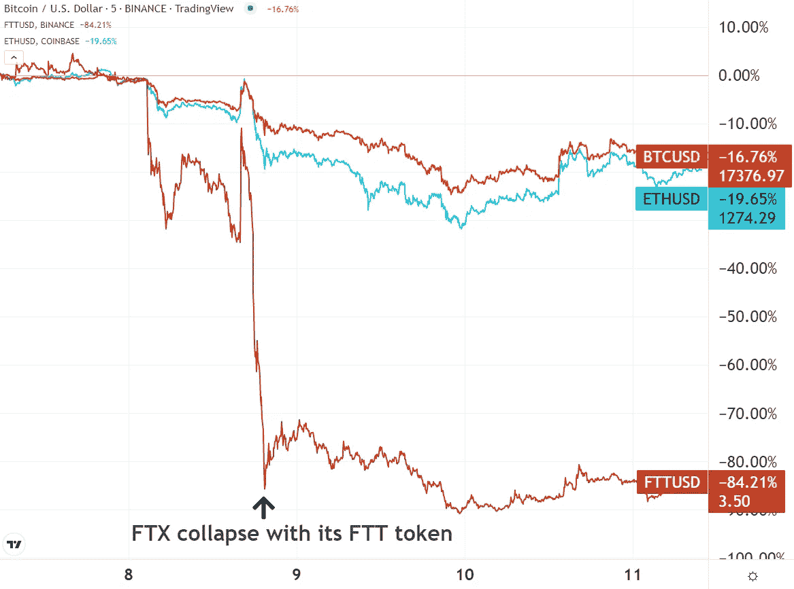*

*在崩溃之前，FTT 持有加密货币总市值的约 0.23%。图片信用: [*交易视图*](https://www.tradingview.com/)*

*FTX 成立于 2019 年 5 月，它的创始人、30 岁的萨姆·班克曼-弗里德(SBF 饰)成为了亿万富翁和多产的政治捐助者和加密投资者，在 Terra 的崩溃和蔓延后果后，人们通常称他为“救市之王”。正如我们将会看到的，Terra (LUNA)的崩溃在某种程度上与当前的危机有关。*

*SBF 也是量化加密交易公司 Alameda Research 的创始人。在这里，SBF 作为 FTX 和阿拉米达之间的中间人，其关系至关重要。*

*那么，为什么拥有 0.23%市场份额的 FTT token 会有如此大的影响力呢？*

*让我们一步一步来:*

*   *全球最大的交易所币安在 2019 年 12 月与 FTX 建立了战略合作伙伴关系，长期持有其 FTX 证券(FTT)。*
*   *到 2022 年，FTX 增长到超过 100 万客户和 320 亿美元的估值，就在几个月前。FTX 国际公司在全球密码交易所排名第三，成为币安的主要竞争对手。*
*   *11 月 2 日，CoinDesk 发布了一份报告，声称阿拉米达资产负债表上 146 亿美元中的 58 亿美元与 FTT 有关。问题是:作为 FTX 的本土代币，FTT 本质上是凭空产生的——而现在这个代币的“真实世界”价值被一个独立的附属实体保留着。*
*   *在首席执行官赵昌鹏和首席执行官萨姆·班克曼-弗里德(SBF)在推特上进行了一番争论后，CZ 决定清算币安的 FTT 控股公司。*
*   *正如这种抛售中通常会发生的那样，人们陷入恐慌，开始抛售自己的 FTT 储备，导致代币价格暴跌。*
*   *在 FTT 抛售中期，FTX 不再能够作为一家公司运营，因为它停止了客户提款。这是因为它的大部分资产与 Alameda Research 有关，这是一家由 SBF 的前女友 [Caroline Ellison](https://twitter.com/ApeDurden/status/1590912098871435265) 经营的做市公司(对冲基金),在 Sam Trabucco 于 8 月辞职后接管了 Alameda。*
*   *截至 11 月 8 日，FTX 在过去的 72 小时内收到了价值 60 亿美元的提款请求。有一段时间，FTX 的 BTC 余额[下降到一个比特币](https://www.coindesk.com/business/2022/11/08/ftxs-bitcoin-balance-plunges-to-just-one/)。相比之下，比特币基地和币安各持有约 50 万枚比特币。*

*由于 FTX 无法处理撤资，11 月 8 日，币安宣布了一份收购 FTX 的非约束性意向书，等待尽职调查。*

*就这样，CZ 和币安被视为当天的英雄。如果 FTX 最终崩溃，这不仅对加密货币社区来说是灾难性的，对 CZ 和币安也是如此。按交易量计算，币安是最大的交易所，CZ 已经受到美国监管机构的压力，因为他正在接受几项调查。*

*密码界既震惊又失望，但奇怪的是，他们松了一口气。松了一口气，因为币安不仅拯救了 FTX，也拯救了密码产业。*

*直到他们不在了。*

*仅仅一天后，即 11 月 9 日，币安宣布退出该交易，原因是“公司尽职调查”以及“关于不当处理客户资金和所谓美国机构调查的最新新闻报道”。*

*自 11 月 8 日下午以来，FTX 的撤资“实际上已经暂停”。据彭博称，在币安退出后，SBF 告诉投资者，如果没有现金注入，FTX 将需要申请破产。该交易所亏空 80 亿美元，需要 40 亿美元才能保持偿付能力。*

*到底发生了什么？简而言之，我们不知道。灰尘仍在沉降。如果 FTX 做的一切都是“正确的”，如果他们做了他们所说的一切，那么他们应该拥有足够的资产来处理所有的提款。事实上，他们没有强烈暗示他们正在做一些他们不应该做的事情。*

*路透社报道称，阿拉米达遭受了一些奇特的损失。其中一项包括与航海家数码公司的 5 亿美元贷款协议。Voyager 继续申请破产，FTX 美国公司在 9 月份为其资产支付了 14 亿美元。路透社表示，他们无法确定阿拉米达损失的全部程度，但他们被告知的是:SBF 将 40 亿美元的 FTX 资金转移到阿拉米达，以“支撑它”。这些资金由 FTT 和$HOOD 的股份担保(回想一下，阿拉米达在 5 月份宣布持有罗宾汉 7.6%的股份)。据称，这些资金的一部分来自客户存款。据报道，由于担心泄密，SBF 甚至没有将此事告诉 FTX 的高管。*

*然而，单就 CZ 在 FTX 的幕后达到顶峰——仅仅一天之后——说“*不*”这一事实就说明了很多问题。*

*必须指出的是，阿拉米达-FTX 通过经营交易所和逆市交易的利益冲突，自 SBF 在 2019 年创立两家公司以来，一直是[持续存在的问题](https://twitter.com/SBF_FTX/status/1156696100729806849)。*

*最近，SBF 彻底关闭了阿拉米达研究公司，为筹集流动性(最多需要 80 亿美元)和拯救 FTX 做最后的努力。FTX.com 提款似乎在少数情况下优先获得批准，而 FTX 美国作为一个单独的实体，似乎是流动的。*

*然而，尽管 SBF 说 FTX 美国是“ [100%流动的](https://twitter.com/SBF_FTX/status/1590709195892195329)”，事实可能并非如此。FTX 美国公司的最新公告警告停止交易时间在几天内。*

*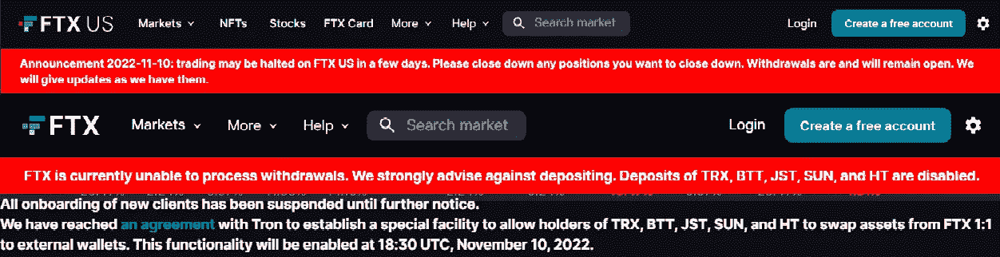*

*一些 FTX 美国用户报告无法提取资金。图片鸣谢:推特。*

*它变得更加混乱。*

*SBF 承认对用户资金使用杠杆:*

*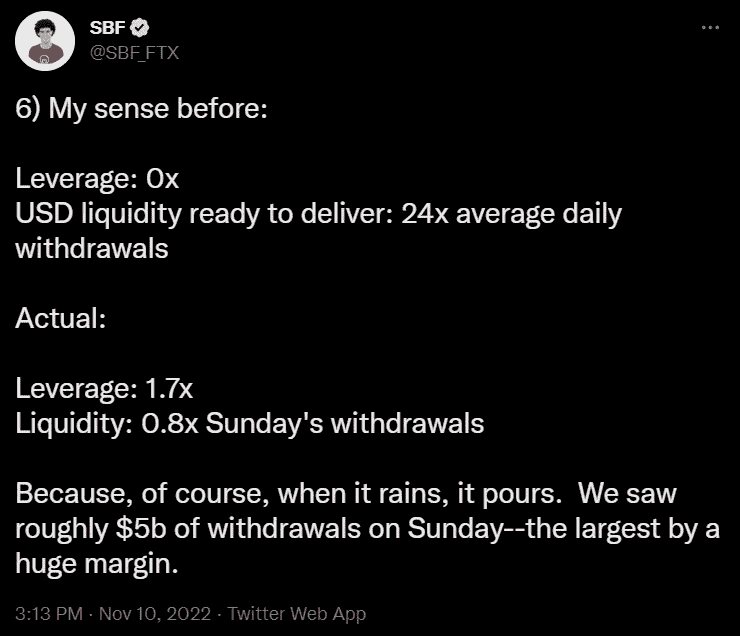*

*换句话说，SBF 为了用户协议之外的目的滥用客户资金，玩弄他们的资金来维持提款的流动性缓冲。*

*这是用户协议的样子:*

**8.2.6 所有数字资产在您的账户中持有的依据如下:**

**(A)您的数字资产的所有权应始终属于您，不得转让给 FTX 贸易。**

**(B)您账户中的任何数字资产均不是 FTX 贸易的财产，也不应或可能借给该公司；FTX 贸易不代表或对待用户帐户中的数字资产属于 FTX 贸易。**

**您控制您账户中的数字资产。在任何时候…您可以通过将您的数字资产发送到由您或第三方控制的另一个区块链地址来收回您的数字资产。**

*由于 FTX 国际是一个巴哈马组织，它目前不知道 SBF 是否做了任何根据巴哈马法律非法的事情。*

*但是截至 11 月 11 日，FTX 已经申请第 11 章破产保护，SBF 已经辞职。*

**

# *FTX 崩溃 Pt 2:传染——谁暴露于 FTX？*

*   *谁还能接触到 FTX？ **(** [**)链接**](https://www.coindesk.com/business/2022/11/09/who-still-has-exposure-to-ftx/) **)***

# *是否有类似地球的传染病正在发生？*

*FTX 的惨败不断指向一个更大的问题。以比特币为首的区块链技术旨在通过给予用户完全的托管控制权来分散金融世界。取而代之的是，一层狂野的人物角色作为失败的中心点出现。他们把财富建立在分权的愿景上。*

*因此，密码市场的发展正如以“大空头”闻名的迈克尔·伯利所预测的那样。在一个集中的生态系统中，最终用户不知道他们的资金最终会流向哪里。客户资金被用于哪种同业拆借、过度杠杆化计划？*

*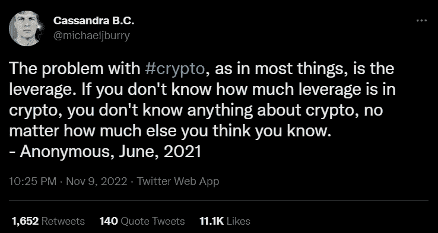*

*“匿名”指的是迈克尔·伯利自己。*

*目前为止，我们知道哪些人受到了 FTX 核泄漏事件的影响:*

*   *一年前估值为 50 亿美元的用户友好型数字资产贷款公司 BlockFi ，今年的估值已跌至 5 亿美元以下。今年 6 月，SBF 向 BlockFi 提供了 2.5 亿美元的循环信贷，以维持其运营。现在，BlockFi 最近[停止了所有账户提款](https://twitter.com/BlockFi/status/1590875997351866368)，重复了 Celsius 的故事情节。*
*   *2021 年 6 月，NFL 四分卫明星**汤姆·布拉迪**和他的前妻吉赛尔·邦辰成为 FTX.com 和 FTX 美国的品牌大使，拥有 FTX 大量但未披露的股权。为了将数字资产纳入主流，SBF 一直在营销上挥霍，包括有史以来第一个从美国航空球馆更名为 FTX 球馆的体育场。*
*   *作为加拿大第三大养老基金，安大略教师养老金计划(OTPP)已经在 FTX.com 和美国 FTX 投资了 9500 万加元。然而，这还不到基金总资产的 0.05%。*
*   *由 Michael Novogratz 领导的多产 Web3/crypto 投资者 Galaxy Digital 拥有 7700 万美元的 FTX 风险敞口，其中 4750 万美元尚未撤回。尽管如此，这家风险投资公司仍有充足的流动性，根据最新的收益报告，至少有 10 亿美元。*
*   *机构投资者的托管和交易公司 Genesis Trading 是第一家报告对冲抵押品损失 700 万美元的公司，其中包括 Alameda Research。目前，Genesis 在 FTX 的一个锁定账户中持有[1.75 亿美元](https://twitter.com/GenesisTrading/status/1590836594382032896)，但这似乎并未影响其交易流动性。*
*   ***Wintermute** ，一家为交易所提供流动性的做市商，在 FTX(不在 FTT)有一些基金，但即使它们下跌，这些基金据说也在 Wintermute 的“风险承受范围”之内。*
*   *欧洲数字产品投资公司 CoinShares 披露了较小的风险敞口:190 BTC(310 万美元)、1000 ETH(120 万美元)和 2590 万美元的 USDC stablecoin。总体而言，coin shares[3108 万美元](https://twitter.com/CoinSharesCo/status/1590704008066256896)的 FTX 敞口与其 2.8112 亿美元的总资产值相比很小。*
*   *Multicoin Capital 是几乎所有加密项目中最多产的风险投资者之一。根据[区块](https://www.theblock.co/post/184766/multicoin-capital-hit-by-ftx-collapse-with-10-of-its-funds-aum-stuck-on-the-exchange)显示，该公司在 FTX 拥有约 10%的总资产，如 BTC、瑞士联邦理工学院和美元，其中 24%在冻结前被提取。*
*   *另一家风险投资公司红杉资本(Sequoia Capital)在 FTX 有 2.14 亿美元的敞口。这占承诺资本不到 3%，由“已实现和未实现收益”中的[~ 75 亿美元](https://twitter.com/sequoia/status/1590522718650499073/photo/1)抵消。*
*   *Liquid Meta(LIQQF)是一个 DeFi 平台，它利用 FTX 进行农业生产和超额抵押贷款。 [Liquid 的最新新闻稿](https://www.prnewswire.com/news-releases/liquid-meta-provides-market-update-301674258.html)披露了通过 stablecoins 和 altcoins 在 FTX 曝光的**750 万美元，但没有 FTT 代币。Liquid 目前可以获得价值 320 万美元的借入资产，平台净余额为 430 万美元。***

***[**享受 5MF？点击转发给三个朋友。**](mailto:info@tokenist.com?subject=Check+this+out+&body=I%E2%80%99ve+been+reading+Five+Minute+Finance,+and+I+know+you%E2%80%99d+enjoy+it+too.+It%E2%80%99s+a+weekly+email+that+covers+the+most+important+trends+in+finance.+I+learn+something+new+every+time+I+read+it!+Check+it+out+here:+https://tokenist.com/newsletter/?utm_source=email_gr_btn)***

******

# ***FTX 崩溃 Pt 3:监管者关注 FTX***

*   ***SEC 主席加里·詹斯勒对 FTX 事件的回应:投资者需要更好的加密保护 **(** [**链接**](https://www.cnbc.com/video/2022/11/10/sec-chair-gary-gensler-on-ftx-fallout-investors-need-better-protections-in-crypto.html) **)*****

# ***FTX 会被用作秘密镇压的话题吗？***

***从技术上讲，FTX 对用户资金的做法与传统银行有点类似(但并不相同)。不过，银行每个账户都有高达 25 万美元的联邦存款保险公司保险，当它们向客户发放存款时，它们需要遵守严格的法律。但是，没有人认为 FTX 是一家银行。***

***因此，如果 FTX.com 破产，SBF 无法“提高流动性”, FTX 储户不太可能获得破产法第 11 章的保护。加密领域对此再熟悉不过了，因为最近 Celsius 也发生了同样的事情。***

***如前所述，萨姆·班克曼-弗里德前女友的父亲，也就是阿拉米达研究公司的负责人，是格伦·埃里森。加里·詹斯勒在麻省理工学院任职时，曾在麻省理工学院经济学系主任格伦手下工作。***

***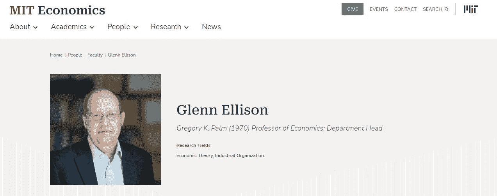******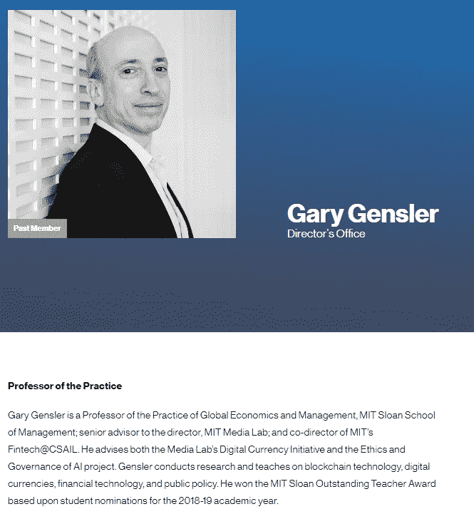***

****图片来源:* [*MIT*](https://economics.mit.edu/people/faculty/glenn-ellison)***

***加里·詹斯勒是前高盛投资银行家，现任美国证券交易委员会(SEC)主席。不去探究 SBF 与 T21 政治捐助阶层更广泛的纠葛的细节，这似乎是一个相互关联的世界。***

***在 FTX 冻结提款的一天后，Gensler 来到美国消费者新闻与商业频道的 Squawk Box 解决这一事件。他将 Terra (LUNA)与借贷平台(Anchor Protocol)捆绑在一起，称所有这些都是“相互关联的”。***

***“在加密领域，这是一个非常相互关联的世界，中间有一些集中的参与者，其中一个集中的参与者有着缺乏披露、客户资金、大量杠杆(借款)，然后试图用这些来投资的有害组合。”***

***Gensler 进一步表示，“跑道正在耗尽”，指的是需要通过监管遏制市场过度行为。有趣的是，Gensler 今年 3 月会见了 SBF，对此 [Gensler 简单地回应](https://twitter.com/SquawkCNBC/status/1590696148662116352)他没有对 SBF 说任何他没有对公众说过的话——“不遵守是行不通的”。***

***更有趣的是，FTX 美国公司的总法律顾问 Ryne Miller 曾担任商品期货交易委员会(CFTC)主席 Gary Gensler 的法律顾问。周三，米勒[发布](https://www.bloomberg.com/news/articles/2022-11-11/ftx-us-legal-chief-tells-staff-he-s-working-to-preserve-platform)一份备忘录，通知 FTX 员工如下:***

****“人们应该做好准备，在接下来的步骤中根据自己的情况做出适当的选择，”****

***在 FTX 崩溃的前一天，众议院金融服务委员会的众议员汤姆·艾默指出:***

****“加里·詹斯勒(Gary Gensler)领导下的监管毫无成效，执法行动损害了公众信任&损害了我们的金融市场。”****

***在 FTX 危机之后，众议员汤姆·艾默[告知](https://twitter.com/RepTomEmmer/status/1589712700699209730)公众他正在调查加里·詹斯勒“帮助 SBF 和 FTX 钻法律漏洞以获得监管垄断。”***

***这指的是 SBF 提出的对 DeFi 平台的“适用性测试”,根据净值和其他 TradFi 框架限制对数字资产的访问。***

***我们都知道美国的数字资产监管现在有点混乱。人们说了很多，但实际行动并不多。***

***我们还知道，许多美国监管机构都在谈论 FTX。他们已经启动了针对 FTX 的“调查”。但作为一个巴哈马实体，拥有一个独立的美国交易所(FTX 美国)，似乎在美国合法运营，美国监管机构对 FTX 国际是否有任何管辖权仍是未知数。***

******

# ***积极的 CPI 报告:7.7%比预期的 7.9%***

*   ***美国 10 月份通胀率为 7.7%，接下来会怎样？ **(** [**)链接**](https://tokenist.com/october-inflation-comes-in-at-7-7-for-us-whats-next/) **)*****

# ***租金和燃油有待压缩***

***好了，这周有一些好消息:***

***消费者价格指数(CPI)报告起到了令人欣慰的市场缓解作用。CPI 以积极的方式超出预期。***

***美国消费者物价指数为 **7.7%** 同比增长 0.4%，而预测为 **7.9%** 同比增长 0.6%。***

***然而，美国核心消费者物价指数(不包括食品和能源)同比增长 6.3%，环比增长 0.3%，而预测的同比增长 6.5%，环比增长 0.5%。***

***在查看这些数字时，首先要记住的是，我们面对的是年增长率。如果从 2021 年 10 月开始计算，当时 CPI 为 6.2%，那么意味着从 2020 年算起的总通胀率为 6.2 + 7.7 = **13.9%** 。***

***新 CPI 数据的第二个考虑因素是通胀压力的分布。燃油是最大的问题，涨幅为+68.5%，在能源类中的权重为 CPI 的 19.8%。这导致了交通和食品价格的上涨。***

***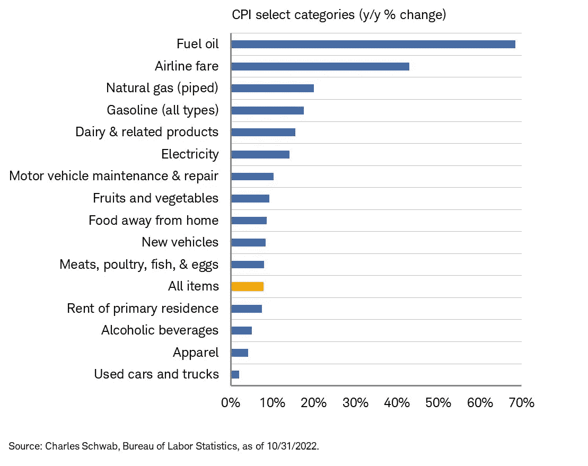***

****图片鸣谢:@LizAnnSonders****

***除了能源，住房占 CPU 的 32.77%，其中 7.8%分配给出租，23.68%分配给私人住宅。住房现在显示 6.91%的通货膨胀率，这是自 20 世纪 80 年代初以来的最高值。15 年期抵押贷款利率也正在接近这一水平。目前的利率为 6.38%，是 2007 年以来的最高水平。***

***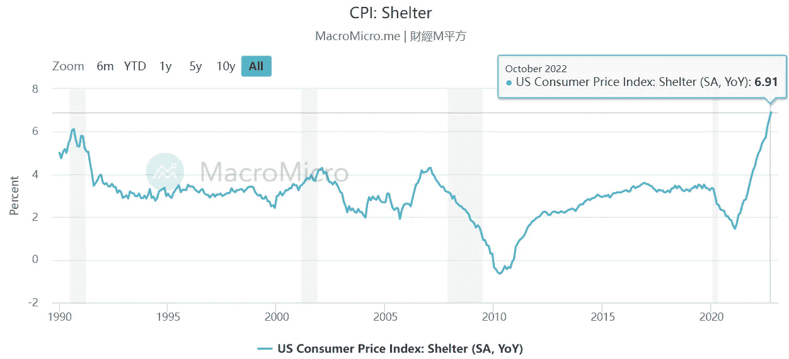***

****图片来源:* [*宏观*](https://en.macromicro.me/collections/5/us-price-relative/24/cpi-house)***

***最后，工资增长并不跟随生活成本。事实上，自 2020 年 2 月以来，经通胀调整后，工资下降了-1%。***

***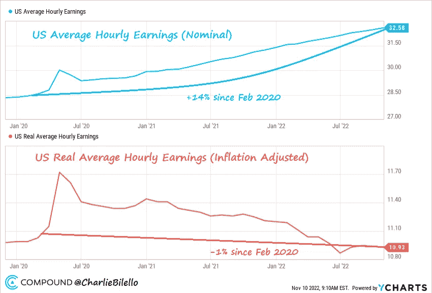***

****图片来源:*[*@ charliebilello*](https://twitter.com/charliebilello/status/1590710287824752641)***

***所有这些告诉我们什么？传入的数据符合杰罗姆·鲍威尔的愿望。从 5 月份开始，他就叫嚣着“要把工资降下来”。房租上涨(美国人的房租上涨了 36%)和抵押贷款利率下降进一步消耗了消费者的力量，降低了通货膨胀。还记得鲍威尔在上次 [FOMC 会议](https://tokenist.com/fed-raises-interest-rates-by-75-bps-in-2022s-6th-hike/)上说的话吗:***

***“如果我们过度收紧，我们可以使用货币政策工具来支持经济，但如果我们收紧得不够，通胀就会根深蒂固。”***

***换句话说，美联储宁愿选择衰退，但软着陆也是可能的。美联储所说的“软着陆”意味着避免衰退，或者至少是深度衰退。***

***目前，二手车价格的暴跌表明，除了需求下降使供应链问题变得毫无意义之外，通货紧缩的力量正在接管。***

***虽然我们距离美联储 2%的通胀目标还有很长的路要走，但市场现在已经反映了加息的减少。***

*   ***2022 年 12 月:加息 50 个基点至 4.25%-4.50%***
*   ***2023 年 2 月:加息 25 个基点至 4.50%-4.75%***
*   ***2023 年 3 月:加息 25 个基点至 4.75%-5.00%***

***如果通缩压力持续，市场波动可能最终会平息。***

******

# ***股票对中期选举的反应如何？***

*   ***标准普尔 500 通常会在美国中期选举后反弹，但这次会有所不同吗？ **(** [**)链接**](https://tokenist.com/sp-500-usually-rallies-after-us-midterms-but-could-things-be-different-this-time/) **)*****

# ***标准普尔 500 一周上涨了 5%***

***正如历史上 9 月是标准普尔 500 表现最差的月份之一，11 月也是表现最好的月份之一。具体来说，在中期选举的时候。在过去 10 年中，11 月份的平均月回报率最高。***

***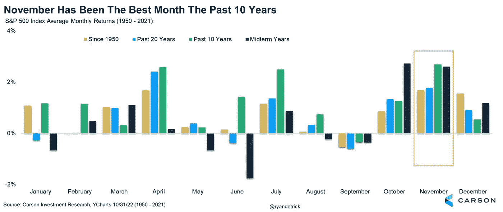***

***自 1950 年以来，标准普尔 500 指数的平均回报率约为 15%，没有出现负年。图片鸣谢:@ ryanderick***

***中期选举通常意味着政治舞台的重组，引起市场对更多支出和政府投资的猜测。***

***有时，它们意味着政府陷入僵局，这对市场也有好处，因为企业可以继续运营——没有新的税收政策会影响日终利润。***

***然而，这一次，选举结果不太可能起作用。毕竟，美联储主席杰罗姆·鲍威尔是一名共和党律师，由民主党总统重新提名。***

***相反，人们应该关注抗衰退的股票，无论是像美元树(DLTR)或沃尔玛(WMT)这样的折扣零售连锁店，还是像景顺太阳能 ETF (TAN。p)。鉴于拜登总统一再呼吁[停止石油钻探](https://twitter.com/TPostMillennial/status/1589409023065030656)，投资计算应该相应调整。***

***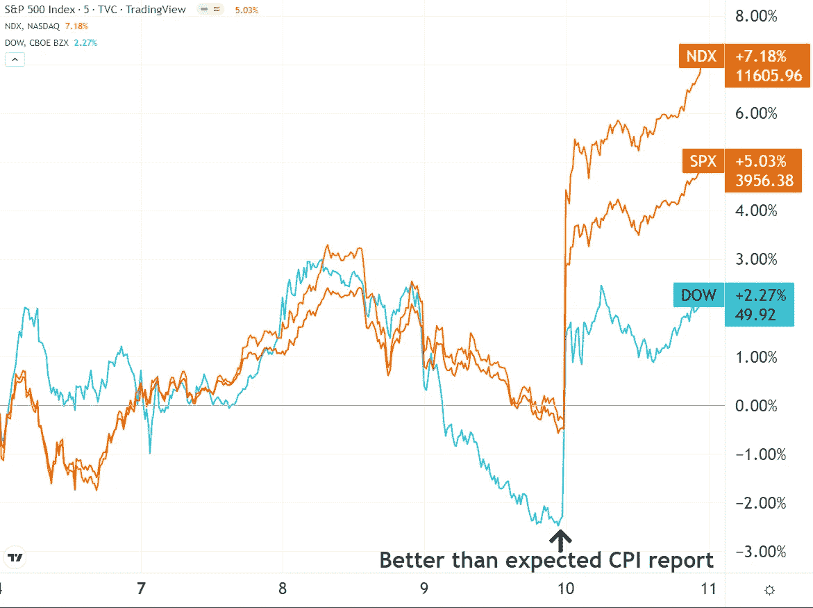***

***消费者物价指数报告后，股票市场有所回升。图片信用:交易视图***

***此外，美国很可能在世界各地有更多的军事纠葛。上个月，一名前五角大楼官员表示，价值 176 亿美元的美国对乌克兰军事援助正在耗尽美国的库存。最新的国会研究服务(CRS) [报告](https://crsreports.congress.gov/product/pdf/IF/IF12040#:~:text=117%2D180%2C%20Div.%20B,Security%20Assistance%20Initiative%20(USAI%3B%20P.L.)披露了价值 140.5 亿美元的拨款来补充这些库存。***

***这在历史上意味着雷神技术公司(RTX)将获得更多的供应合同。n)和洛克希德·马丁公司(LMT。n)。年初至今，两者的表现都远远超过了标准普尔 500。标准普尔 500 指数下跌 17.52%，RTX 指数上涨 12.50%，伦敦金属交易所上涨 38.49%。***

# ***本周推特***

***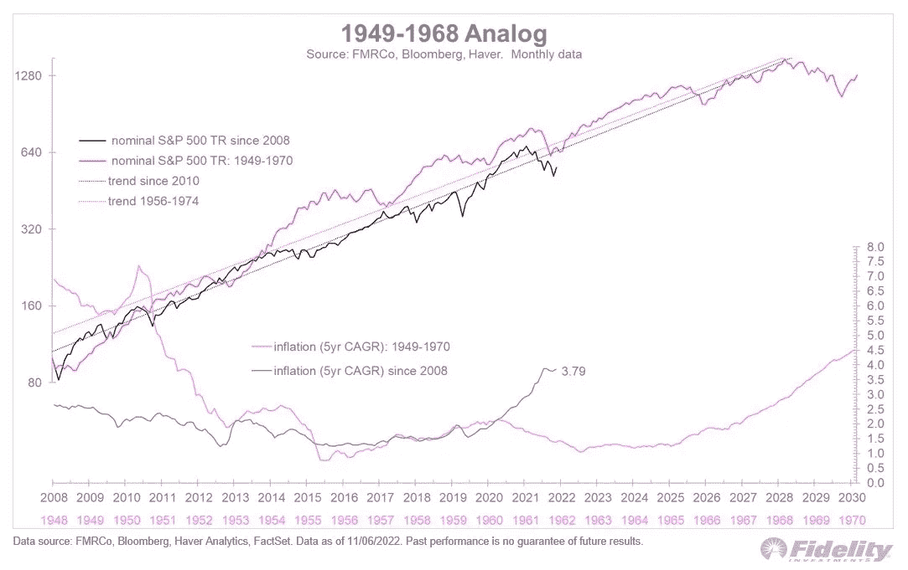***

> ***通货膨胀是股市走向的一个关键因素。为了说明，让我们回顾一下。***

***[**@TimmerFidelity**](https://twitter.com/TimmerFidelity/status/1590728113109237760)***

***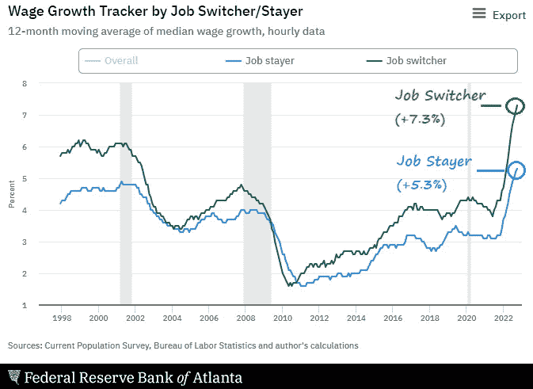***

> ***去年，跳槽的美国工人工资增长了 7.3%，而留在原工作岗位的美国工人工资增长了 5.3%。根据 1997 年的数据，这是我们见过的最大差距。***

***【T8**@ charliebilello*****

***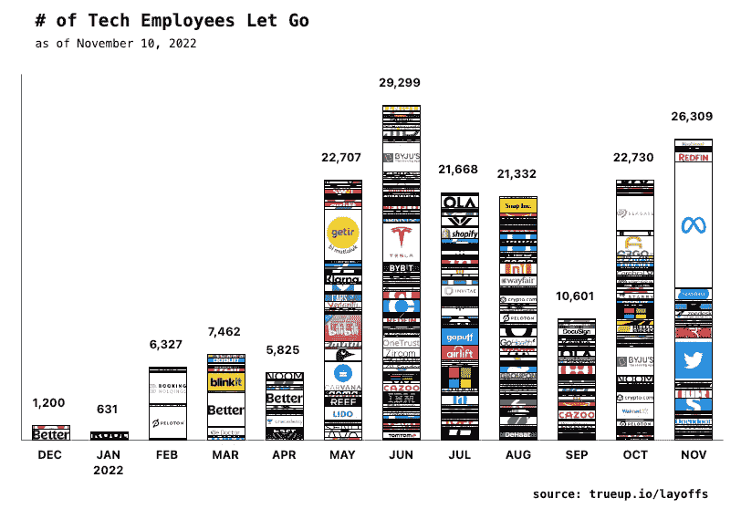***

> ***Meta 本周将裁员 13%。***
> 
> ***超过 11000 名工人。***
> 
> ***以下是过去一年科技裁员的情况。***

***[**@EconomyApp**](https://twitter.com/EconomyApp/status/1590733535132127232)***

> ***SBF 游说反对什么？DeFi。🤔***
> 
> ***是什么阻止了这一切？DeFi。🤔***
> 
> ***哪些交易所已经公布了实时的准备金证明？DeFi。🤔***
> 
> ***美国监管机构将试图关闭什么？DeFi。🤷‍♀️***

***[**@jgarzik**](https://twitter.com/jgarzik/status/1590533945166163968)***

***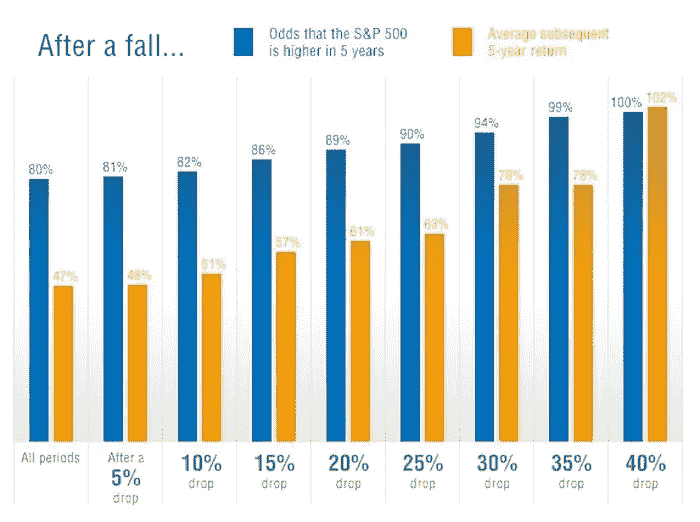***

> ***股市崩盘越严重，接下来 5 年的回报就越高。***

***[**@ QCompounding**](https://twitter.com/QCompounding/status/1590319794279960577)***

# ***加入五分钟金融时事通讯。***

******

***[Sign up here — it’s free.](https://tokenist.com/newsletter/)***

******

***[t.me/thetokenist](http://t.me/thetokenist)***

******

***twitter.com/thetokenist***

> ***交易新手？尝试[加密交易机器人](/coinmonks/crypto-trading-bot-c2ffce8acb2a)或[复制交易](/coinmonks/top-10-crypto-copy-trading-platforms-for-beginners-d0c37c7d698c)***