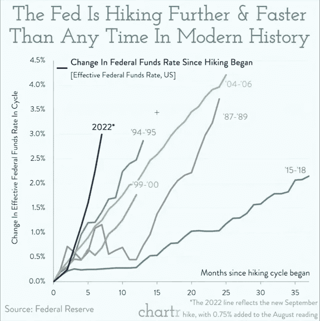
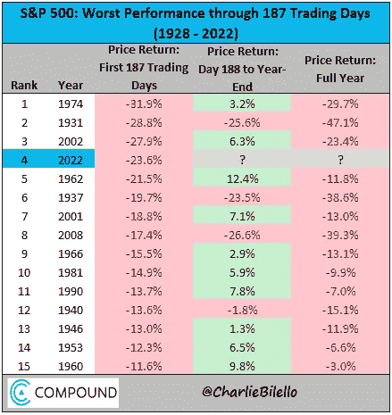

# 五分钟财经:英镑创历史新低，美国股东损失 9 美元，SBF 将收购 CELSIUS？

> 原文：<https://medium.com/coinmonks/five-minute-finance-gbps-record-low-american-shareholders-down-9t-sbf-to-buy-celsius-967c4a438233?source=collection_archive---------42----------------------->

# 5 分钟的金融时事通讯——解释发生了什么，为什么。

# 让我们看看这周发生了什么:

*   为什么英镑前所未有地下跌？
*   自 2021 年第四季度以来，美国股东损失了 9 万亿美元
*   山姆·班克曼-弗里德的收购狂潮仍在继续；注视摄氏温度
*   加密公司的首席执行官们离开了四面楚歌的 CeFi 现场
*   国际刑警组织发布逮捕跆拳道的通知；试图冻结 BTC

# 英镑对美元的汇率刚刚创下历史新低

*   随着特拉斯成为英国首相，英镑的卖空交易增加了 17%**(**[**链接**](https://tokenist.com/short-selling-on-gbp-ramped-up-17-as-truss-became-uks-prime-minister/) **)**
*   国际货币基金组织警告英国财政不负责任，英国央行开始购买债券

# 英格兰银行的债券购买计划旨在英镑复苏

在美元的推动下，全球的法定货币体系正在流动性的泥沼中挣扎。美联储的量化紧缩政策出台之际，欧洲正面临通胀。受能源危机加剧的推动，德国的通胀率最近达到了 10%，为 70 年来的最高水平，英国的通胀率为 9.9%。

为了应对这场生活成本危机，欧洲央行(ECB)和英格兰银行(BoE)都回归了量化宽松政策。德国准备了 1965 亿美元的救助计划，而英国银行通过购买价值 690 亿美元的债券进行干预，以防止养老基金崩溃。

*“如果这个市场的功能失调继续或恶化，英国的金融稳定将面临重大风险，”*

-英格兰银行

在英国，事情是这样的:英国政府发行债券——本质上是借据。英格兰银行和国际市场上的其他投资者购买这些债券，降低了英国政府的借贷成本。

英格兰银行的介入主要是为了缓解养老基金对英国政府债券的抛售压力(养老基金是这些债券的大持有者)。最初，债券利率上升，这对英镑有利。但这产生了一个有趣的效应:养老基金持有的衍生品合约也增加了，要求养老基金提供额外的抵押品。许多基金不得不出售债券，以履行与抵押品相关的义务，最终，这实际上加剧了英国政府债券的抛售压力。正如我们所见，这对英镑不利。

结果，30 年期债券收益率下跌了 100 个基点。与此同时，英镑和欧元对美元的汇率正在下跌。然而，英格兰银行介入购买额外的债券，英镑有所回升。

尽管如此，在过去的一周里，世界见证了英镑对美元触及[历史新低](https://www.nytimes.com/2022/09/26/business/british-pound-dollar-gbp-usd.html)。我们甚至看到交易员和投资者抛弃欧元和英镑，转而投资 BTC:

*形象功劳:* [*美利*](https://twitter.com/MessariCrypto/status/1575530910241259520)

目前，英国的债券购买计划预计将持续到 10 月 14 日。分析师预计，英国新任首相和财政大臣将重新审视最近的减税举措，以降低 10 月 14 日到来后英镑遭受额外恐慌的可能性。

# 美国房地产降温，美国股东损失数万亿美元

*   美国股东自 2021 年第四季度以来损失了 9T 美元，前 10%损失了 8T 美元 **(** [**链接**](https://tokenist.com/american-shareholders-lost-9t-since-q4-2021-top-10-lost-8t/) **)**
*   美联储:上世纪 80 年代初以来最快加息周期:报告 **(** [**链接**](https://tokenist.com/federal-on-fastest-rate-hiking-cycle-since-the-early-1980s-report/) **)**

# 利率和债务在上升

虽然盟国货币对美元汇率大幅下跌，但美联储主席鲍威尔仍坚持将通胀率从此前报告的 8.3%降至 2%。很明显，鲍威尔很着急，他加快了自 20 世纪 80 年代以来最快的加息速度。

随着债务增加，美联储周期加速。图片来源:[*@ mayhem market*](https://twitter.com/Mayhem4Markets/status/1574162586509389824)

对于一个长期享受廉价借贷的经济体来说，市场冲击是相伴而生的。在前几个月，鲍威尔曾考虑过“软着陆”的想法，即在不出现衰退的情况下降低通胀。

这不再是娱乐。在本周的*通胀:驱动因素和动态*小组会议上，美联储理事之一 Loretta Mester 明确表示，为了实现价格稳定，必须忍受衰退。

“…我们将放缓至远低于 2%的增长率。失业率将会上升，但如果我们现在不采取措施稳定物价，为了避免以后成本更高，这是必要的。”

这需要抑制所有资产，这在历史上会导致支出减少和失业。贝莱德估计会有多达 300 万人失业。虽然加密市场是一个附带的受害者，自 1 月份以来已经损失了 1.2 万亿美元，但重点是大游戏——股票和房地产。作为 GDP 的一个百分比，美国股市今年下跌了-51%。

换句话说，自 2021 年第四季度以来，美国股东损失了约 9 万亿美元的股票。鲍威尔还想给“*火热的房市*”泼一盆冷水。2022 年 H1 增长到 41 万亿美元，但 30 年期抵押贷款利率已经从去年的 3%翻了一番，达到 6.35%。

然而，定价压力对不同财富百分位群体的作用是不同的。底层 90%的人将大部分财富投资于房地产，而顶层 10%的人除了投资房地产，还投资股票、养老金、私募股权和其他资产。

*对于 2022 年的 Q2，不到 90%的财富百分位群体的总股票价值为 3.8 万亿美元，比 29.13 万亿美元的前 10%的总股票价值小 7 倍。图片来源:*[*FederalReserve.gov*](https://www.federalreserve.gov/releases/z1/dataviz/dfa/compare/chart/)

这意味着富人有更大的缓冲空间，所以他们不太可能耗尽储蓄和减少支出。相比之下，底层 90%的人将不得不减少支出来偿还信用卡债务(美国 Q2 2022 年增加了 420 亿美元)和不断上涨的抵押贷款利率。

自 2008 年大衰退以来，美国家庭债务增加了 [+33%](https://www.newyorkfed.org/microeconomics/hhdc) ，从 12.13T 美元增加到 16.16T 美元，其中非住房债务增加了+64%。

[**享受 5MF？点击转发给三个朋友。**](mailto:info@tokenist.com?subject=Check+this+out+&body=I%E2%80%99ve+been+reading+Five+Minute+Finance,+and+I+know+you%E2%80%99d+enjoy+it+too.+It%E2%80%99s+a+weekly+email+that+covers+the+most+important+trends+in+finance.+I+learn+something+new+every+time+I+read+it!+Check+it+out+here:+https://tokenist.com/newsletter/?utm_source=email_gr_btn)

# SBF 继续疯狂收购

*   FTX 在赢得航海家号竞标后立即 Eying 摄氏**(**[**)link**](https://tokenist.com/ftx-eying-celsius-immediately-after-winning-the-voyager-bid/)**)**

# SBF 锁定航海家号的数字，正看着摄氏

山姆·班克曼·弗里德(SBF 饰)正在迈向加密拯救之王的宝座。在 Terra 事件尘埃落定之前，他发放了信用额度，试图拯救 BlockFi 和 Voyager Digital。今年 8 月，SBF 甚至在一次令人讨厌的 9700 万美元的黑客攻击后，借给了日本交易所 Liquid Global 1.2 亿美元。

这位 30 岁的亿万富翁和 FTX 首席执行官，现在已经赢得了破产的航海家数码资产的竞标(约 14 亿美元)。菜单上的下一个似乎是 Celsius Network，这是最近加密传染病的另一个参与者，也是该公司自己的首席执行官 Alex Mashinsky 所做的[鲁莽交易](https://tokenist.com/reckless-trades-by-celsius-ceo-revealed-before-court-hearing/)的似乎受害者。

在内幕报道称 SBF 正筹集 10 亿美元收购破产的 Celsius 的同时，马辛斯基辞去了 Celsius 首席执行官一职。破产前，SBF 无法证明救助 Celsius 的合理性，因为其资产负债表上有一个 20 亿美元的大窟窿。

SBF 的阿拉米达研究也是主要加密项目的多产支持者，如第 1 层区块链索拉纳，Aptos 和 Sui。SBF 的雄鹿不止于此。[最近披露的](https://www.businessinsider.com/sam-bankman-fried-guru-texted-elon-musk-helping-buy-twitter-2022-9)短信进一步显示，SBF 对收购 Twitter 的兴趣和马斯克一样久。

最后，马斯克对 SBF 在推特上的贡献不太感兴趣，因为潜在的“费力的区块链辩论”让他失去了兴趣。

有什么是 SBF 没有直接或间接触及的吗？加密老手可能会因为他接管了 SushiSwap 而记住他，SushiSwap 是 Uniswap 的克隆体，从事 Uniswap 流动性的吸血鬼式开采。

似乎每个时代都有自己的男爵。20 世纪初，摩根大通(J.P. Morgan)的约翰·皮尔庞特·摩根(John Pierpont Morgan)在 1907 年金融危机(又称尼克博克危机)后大举出手救市。相似之处令人震惊，因为这是由过度投机和宽松货币政策引发的第一场全球危机。

现在，摩根大通是世界上最大的商业银行。SBF 将来会取得类似的统治地位吗？

# 加密高管逆风而逃

*   FTX 密码交易所正在更换其美国总统 **(** [**)链接**](https://www.cnbc.com/2022/09/27/crypto-exchange-ftx-is-replacing-its-us-president.html) **)**

# “伟大的辞职”还在继续，现在也在加密中

在 Covid 和在家工作的转变之间，我们已经看到了商业世界中的许多连锁反应。其中之一就是 CEO 们的“大辞职”。根据德勤六月发表的一份研究报告，70%的高层管理者正处于辞职的边缘。

80%的人表示，他们必须将心理健康置于赚钱机会之上。在家办公的时期无疑加大了这项任务的难度。高管和经理们都不得不在人才招募和保留、供应链中断、股东责任以及出现问题时成为目标之间寻求平衡。

在加密领域，不存在出错的情况。仅在本周*，就有一连串的辞职:*

*   *四名来自 Genesis 的高级职员，Genesis 是一家中央加密贷款公司，不得不在 8 月份裁员 20%。*
*   *布雷特·哈里森，美国 FTX 公司总裁。*
*   *阿历克斯·马辛斯基是被 SBF 盯上的被推翻的 Celsius 网络的首席执行官。*
*   *北海巨妖的首席执行官兼联合创始人杰西·鲍威尔。*

*这不是新趋势的开始。上个月，萨姆·特拉布科(Sam Trabucco)辞去了阿拉米达研究公司(Alameda Research)联席首席执行官的职务，而火币网(Huobi)的李·(也就是)辞去了首席财务官的职务。虽然不是一家加密公司，但 Microstrategy 的前首席执行官迈克尔·塞勒在 8 月初辞去了他的职务。*

*持续的熊市不仅仅影响投资者和交易者。企业——及其高管——肯定感受到了压力。*

**

# *国际刑警组织发布了对跆拳道的逮捕令——接下来呢？*

*   *600 亿美元崩盘背后的 Crypto 创始人称自己在国际刑警组织发布逮捕通知后没有躲藏 **(** [**链接**](https://www.cnbc.com/2022/09/27/do-kwon-says-hes-not-hiding-amid-manhunt-after-ust-luna-collapse.html) **)***
*   ***韩寻求冻结比特币绑跆拳道** [**(链接)**](https://www.bloomberg.com/news/articles/2022-09-27/south-korea-seeks-to-freeze-bitcoin-btc-linked-to-do-kwon#xj4y7vzkg)*

# *从这里开始跆拳道会怎么样？*

*上周二，国际刑警组织发布红色通缉令，逮捕地球实验室的创始人权道。kwon launch(LUNA)和 TerraUSD (UST)，许多人认为这是 2022 年开启加密传染病的主要原因。*

*在发出全球逮捕令的同时，韩国检方要求 KuCoin 和 OKX 交易所冻结 Kwon 的 3313 个比特币，价值约 670 亿美元。这些资金是从负责保卫 UST 与美元挂钩的卢纳基金会卫队(LFG)转移过来的。*

*就在崩溃之前，LFG 正在囤积价值 35 亿美元的 BTC。然而，CryptoQuant 研究人员指出，新的钱包地址是在 9 月 15 日创建的。与此同时，这位前“稳定币大师”一直表现如常。*

**

**图片来源:* [*推特*](https://twitter.com/stablekwon/status/1574448432793538560)*

*在他最近的一条带有残疾回复的推文中，Kwon 声称他至少在去年没有使用 OKX 或 ku coin“*”。**

*从这里开始，不管 Do Kwon 发生了什么，都可能在相当长的一段时间内对建筑商和高产加密产品产生显著影响。*

# *本周推特*

> *CFTC 在追逐道斯——这对你有什么影响？*
> 
> *大问题:*
> 
> *-发生了什么事？*
> 
> *-对 DAOs 会有什么影响？*
> 
> *-它如何影响代币持有者？*
> 
> *+ Ooki 的法律辩护对整个道空间真的会很重要。*
> 
> *让我们看看 1/26*

*[**@Timccopeland**](https://twitter.com/Timccopeland/status/1575430908089454596)*

> *通货膨胀率降低的迹象即将出现…*
> 
> *-原油价格较 3 月高点下跌 40%*
> 
> *-二手车价格年初至今下降 13%。*
> 
> *-年初至今，全球运费下降 57%。*
> 
> *-9 月份租金下降，这是今年以来的第一次下降(同比增幅为 2021 年 5 月以来的最低水平)。*
> 
> *-房价比 6 月份的峰值下降了 6%。*

*[@ charliebilello](https://twitter.com/charliebilello/status/1575695312387473409)*

**

> *在其他大崩盘的背景下，标准普尔 500 还有很长的路要走。*
> 
> *#比特币和$ETH 受到的冲击更大，但仍高于此前的熊市低点。*
> 
> *非常有趣的图形:@ ecoinometrics*

*[@ miles Deutscher](https://twitter.com/milesdeutscher/status/1575026293019901952)*

**

> *当欧元下跌时，欧盟的贸易顺差应该会上升。但现在，欧元处于创纪录低点，欧盟贸易顺差大幅下降。*

*[**@KimDotcom**](https://twitter.com/KimDotcom/status/1570606280070529028)*

**

> *在 2022 年的前 187 个交易日中，标准普尔 500 下跌了 23.6%，是历史上第四糟糕的年初。$SPX*

*[**@ charliebilello**](https://twitter.com/charliebilello/status/1575689463401185280)*

# *加入五分钟金融时事通讯。*

**

*[Sign up here — it’s free.](https://tokenist.com/newsletter/)*

**

*[t.me/thetokenist](http://t.me/thetokenist)*

**

*twitter.com/thetokenist*

> *交易新手？试试[密码交易机器人](/coinmonks/crypto-trading-bot-c2ffce8acb2a)或[复制交易](/coinmonks/top-10-crypto-copy-trading-platforms-for-beginners-d0c37c7d698c)*