# 五分钟金融:索拉纳的诉讼，航海家的破产，保利上涨 28%以上的主要影响

> 原文：<https://medium.com/coinmonks/five-minute-finance-major-implications-in-solanas-lawsuit-voyager-s-bankruptcy-poly-up-28-c2e15c30ea91?source=collection_archive---------2----------------------->

# 5 分钟的金融时事通讯——解释发生了什么，为什么。

# 让我们看看这周发生了什么:

*   摄氏度的复苏之路？
*   FOMC 会议纪要明显避免了“衰退”
*   为什么索拉纳面临诉讼
*   多边形上涨超过熊市，上涨 28%+
*   航海家数码公司以破产告终

# 摄氏度完全偿还 BTC 贷款给制造商

*   Celsius 在 7 月份向 MakerDAO 偿还了 1.836 亿美元，但 Crypto Lender 仍处于困境中 **(** [**链接**](https://tokenist.com/celsius-repaid-183-6m-to-makerdao-in-july-but-crypto-lender-still-in-hot-water/) **)**
*   四面楚歌的加密贷款公司 Celsius 被前雇员起诉欺诈 **(** [**链接**](https://www.bloomberg.com/news/articles/2022-07-07/embattled-crypto-lender-celsius-accused-of-fraud-by-ex-employee#xj4y7vzkg) **)**

# 贷款已付，BTC 抛售压力下一步？

Celsius Network 正在成为不负责任的商业行为的案例研究。首先，新鲜的好消息。集中贷款平台向分散的创客还清了所有贷款，就在一天前，它以创客的本地货币戴偿还了 1.836 亿美元。

这意味着，Celsius 收回了用作贷款抵押的 2.1962 万 WBTC(合 4.4 亿美元)。反过来，其清算价格现在为零。不久之后，Celsius [将 24，462 WBTC (510，853，104 美元)转给了 FTX 交易所，而这家交易所拒绝为 Celsius 纾困，理由是它有“20 亿美元的预算漏洞”。](https://etherscan.io/tx/0x0249c8a8b4656f780f729e50881e8c94f4c069b3b0933ec973c3a8b3193236db)

紧张程度很高。这些比特币会被简单地从打包比特币转换成普通比特币，或者被投入市场以偿还其他债务，从而有效地形成抛售压力吗？事实是，超过 100 万个摄氏账户仍然被禁止提款。

更令人担忧的是 Celsius 是如何经营其贷款业务的。前 Celsius 投资经理杰森·斯通昨天向纽约州法院递交了一份法律诉状。该诉讼指出，Celsius 利用客户资金从事高风险交易策略，并利用其 CEL token 操纵市场。

不过，这与其说是一个伟大的发现，不如说是一个证实。当 Celsius 为其增长选择两位数的 APY 收益率时，就已经是不祥之兆了。这不可避免地吸引了那些对传统银行储蓄账户区区 0.08%利率不满的人。但是，为了支付这些费用，Celsius 进行了大范围的投资。

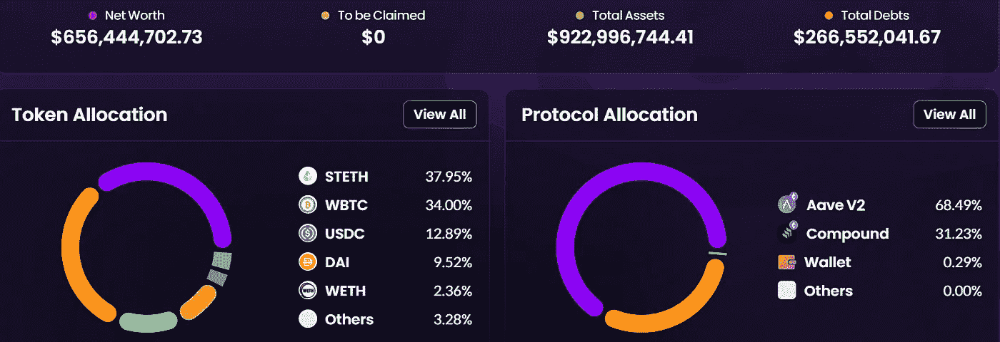

Celsius 异常高的收益来源于多种不同的风险投资，主要是以以太坊(stETH)的形式。图片来源: [*ApeBoard。金融*](https://apeboard.finance/)

换句话说，作为一种商业模式，Celsius 正在扩大其金字塔的底部。美联储的加息突然停止了这种扩张，导致市场全面崩溃。Jason Stone 现在认为，Celsius 利用其 CEL 代币作为工具，通过在 BTC 人为抬高 CEL 价格 9000 万美元来创造最初的增长火花。

而当某个东西被人为膨胀时，就可以作为借贷的锚。杠杆幻觉之上的幻觉。当然，这些也是客户资金。斯通还表示，Celsius 在 USDT 借了 10 亿美元来弥补资产负债表的漏洞。

crypto/DeFi 似乎成了自己成功的牺牲品。它吸引了那些摘到非常容易摘到的果实——银行的低利率——的角色。但是他们没有满足于现实的目标——高达 5%的 APY——而是想要夸张的 10% — 20%的收益率来吸引客户。

目标是确保像脸书一样在这个特定的市场巩固地位并占据主导地位。回顾我们现在所知道的一切，当时的情况就像一颗定时炸弹。现在，随着炸弹被引爆，最好是所有的可疑之处都被揭露出来，并在采用加密的早期阶段吸取教训。

# 美联储会让我们陷入衰退吗？

*   美联储考虑 7 月加息 50-75 个基点:风险资产可能进一步下行 **(** [**链接**](https://tokenist.com/fed-ponders-50-75-bps-hike-in-july-risk-assets-may-be-set-for-further-downside/) **)**
*   由于美联储收紧货币政策，白银跌破 20 美元 **(** [**链接**](https://tokenist.com/silver-falls-below-20-as-the-fed-tightens-monetary-policy/) **)**

# 被抑制的需求=较低的通货膨胀

在一个中央银行系统中，由一个特别委员会决定数十亿美元的命运是完全正常的，也是被接受的。而且，就像从茶叶中读出预兆一样，投资者会很快解读联邦公开市场委员会(FOMC)的话。

三周前讨论过的周三的 FOMC 会议记录显示了 90 次提到“通货膨胀”这个词。很能说明问题的是，“衰退”一次也没有被提及。这表明衰退可能是战胜猖獗的通货膨胀的最后工具。

简而言之，加息提高了资本成本。这减少了经济产出，降低了消费者需求。反过来，需求下降意味着买家减少，这意味着供应超过需求。这不可避免地降低了价格。

> 交易新手？试试[密码交易机器人](/coinmonks/crypto-trading-bot-c2ffce8acb2a)或者[复制交易](/coinmonks/top-10-crypto-copy-trading-platforms-for-beginners-d0c37c7d698c)

我们已经看到了这种需求抑制。消费者信心创下历史新低。与此同时，抵押贷款利率迅速跌至 2008 年的 5.3%，表明需求正在崩溃。

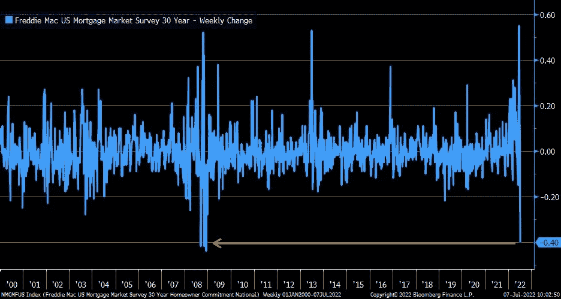

*图片来源:* [*推特*](https://twitter.com/LizAnnSonders/status/1545048867892187136)

就像美联储的货币政策向经济注入数万亿美元引发通胀一样，贵金属——黄金和白银——也是如此。一个恰当的例子是，当美国黄金储备在市场上抛售黄金时，其价格受到抑制。但是，当没有这种干扰时，贵金属往往会上涨。

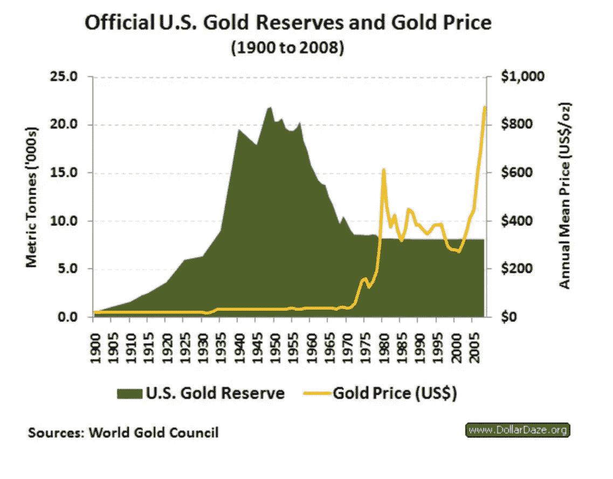

*图片来源:* [*推特*](https://twitter.com/hkuppy/status/1544838264175136768)

现在，美联储已经改变了货币政策，不再注入现金来润滑经济的车轮，黄金和白银都停止了升值。这是因为由于供应量有限，两者都像比特币一样，可以对冲通胀。

但是，即使存在通胀，美元强势指数(DXY)相对于其他货币也在飙升。尤其是在依赖能源的欧盟面临从俄罗斯进口能源的供应中断之后。

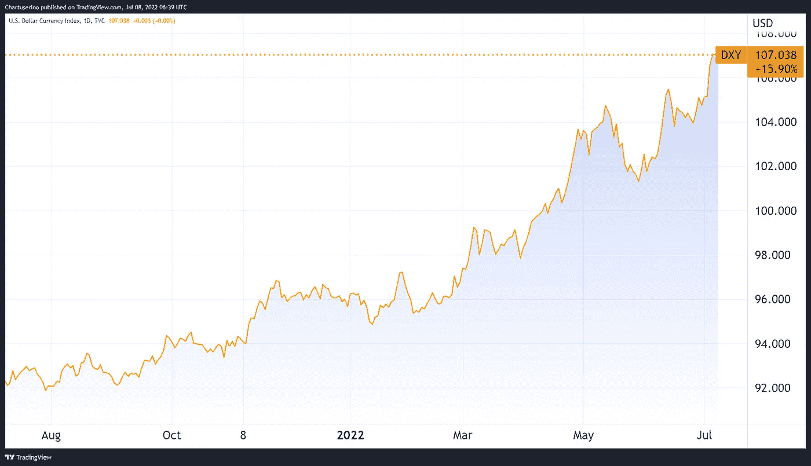

美元强势指数今年表现不错。图片来源: [*交易查看*](https://www.tradingview.com/)

是的，这种全球储备货币特权意味着美元同时贬值和高需求，使对冲美元表现不佳。

今年到目前为止，我们已经看到美联储加息 1.5%。可以肯定的是，在接下来的一年里，还会有 2%的涨幅。

[**享受 5MF？点击转发给三个朋友。**](mailto:info@tokenist.com?subject=Check+this+out+&body=I%E2%80%99ve+been+reading+Five+Minute+Finance,+and+I+know+you%E2%80%99d+enjoy+it+too.+It%E2%80%99s+a+weekly+email+that+covers+the+most+important+trends+in+finance.+I+learn+something+new+every+time+I+read+it!+Check+it+out+here:+https://tokenist.com/newsletter/?utm_source=email_gr_btn)

# 集体诉讼声称 SOL 是一个安全，索拉纳网络“高度集中”

*   索拉纳是一个集中的区块链，投资者在集体诉讼中索赔 **(** [**链接**](https://tokenist.com/solana-is-a-centralized-blockchain-investors-claims-in-class-action-lawsuit/) **)**

# 披着分权外衣的中央集权机构

金钱是获取权力的终极工具，权力的集中在于一个谱。

当谈到数字资产和货币的融合世界时，一端是比特币，它有一个假名创造者和一个跨越 [15k 个节点的全球分布式自治挖掘网络](https://bitnodes.io/)。比特币的货币政策是由代码强制执行的，不能改变。另一端是美联储和其他央行，它们可以随心所欲地调整货币政策。

修改货币政策不一定是一件坏事——它可以帮助解决很多情况。但它也可能无意中导致非常有害的情况。

所以，频谱是关于信任的。如果资产更加分散，需要的信任就更少，因为坏人的空间就更小。如果权力更加集中，人们就会被迫信任中央管理机构或个人。介于这两者之间的是 Celsius Network 或 Solana。

他们是在无信任地获得金融权力的承诺下成长的。虽然你已经知道摄氏如何运作，索拉纳是一个风险投资的婴儿，由风险投资巨头 Multicoin Capital 诞生。事实证明，一些投资者对所谓的无信誉销售商品的账单并不满意。

加利福尼亚州的马克·杨(Mark Young)对索拉纳实验室(Solana Labs)提起诉讼，声称索拉纳网络只不过是一家通过溜进区块链空间，避免注册为从事证券交易的上市公司的公司。

他们创建了索拉纳·区块链网络和所有流通中的 SOL 证券，并同样决定了谁将在什么条件下获得 SOL 证券

事实上，在多次网络中断、手动升级和重启后，许多人开始怀疑。一个理应分散的网络怎么可能充当常规的计算机网络呢？好吧，一旦你看到它的权力集中，答案就不远了，这通过它的 [SOL 令牌分配](https://explorer.solana.com/supply)表现出来。

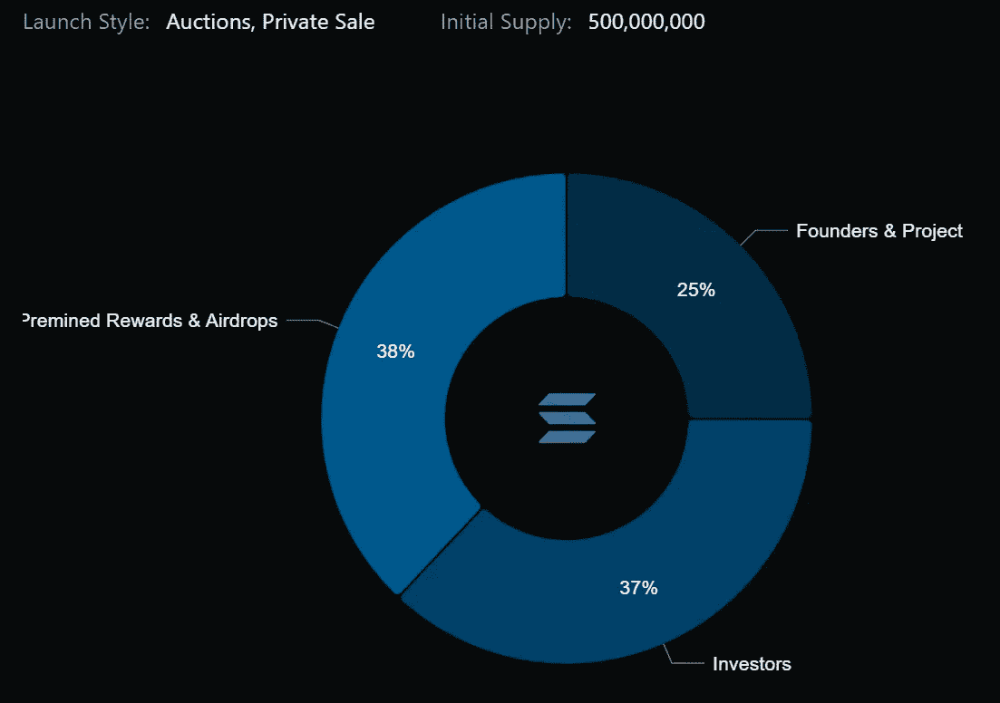

*索拉纳最初的代币供应和分配。图片来源:* [*Messari.io*](https://explorer.solana.com/supply)

除了令牌集中，索拉纳基金会是唯一一个负责开发网络核心节点的机构。这与以太坊形成鲜明对比，以太坊拥有多家核心节点开发商:Besu、Go 以太坊、OpenEthereum、Nevermind。

现在，杨的主张正被作为代表其他 SOL 投资者的集体诉讼提起。诉讼声称 SOL 符合 SEC 的 Howey 测试的三个原则，有效地构成了安全。杨还说，尽管索拉纳实验室声称该网络是分散的，但它是“高度集中的”。

此案的未来很可能为多用途智能合约区块链在美国的证券地位开创一个先例。

# 为什么 Polygon (MATIC)本周上涨+28%？

*   使用多边形，Meta 开始在脸书 **(** [**链接**](https://www.coindesk.com/business/2022/07/01/meta-begins-testing-nft-integration-on-facebook/) **)** 上测试 NFT 积分
*   Reddit 与 Polygon 合作推出头像 NFT 市场 **(** [**链接**](https://techcrunch.com/2022/07/07/reddit-is-launching-a-new-nft-avatar-marketplace/) **)**

# 低汽油费的需求仍然很高

任何计算机网络都无法逃脱物理的界限。只有这么多的计算能力和内存需要分配。如果用户上升率太高，网络的高速公路系统就会堵塞。

在分散化的区块链世界，这意味着用户必须支付高昂的转让费。以太坊因为这个问题臭名昭著，作为最流行的智能合约网络。

简单地说，如果某样东西使用起来非常昂贵，那么它是否是分散的并不重要。在以太坊于 2023 年实现分片之前，显而易见的解决方案是在以太坊的主要高速公路上连接额外的道路。多边形就是这样的道路之一，作为第 2 层可伸缩性的侧链。

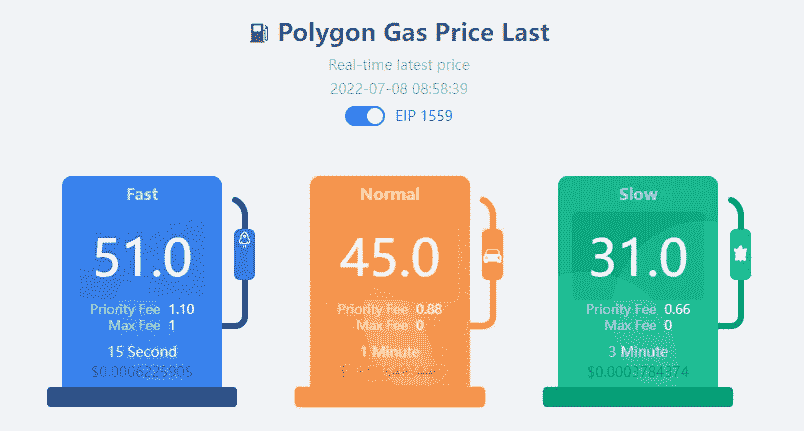

*图片来源:*[*coin tool . app*](https://cointool.app/gasPrice/matic)

作为指定的气费抑制器，最近的合作伙伴关系使得 Polygon 的 MATIC token 的表现超过了以太坊和比特币。

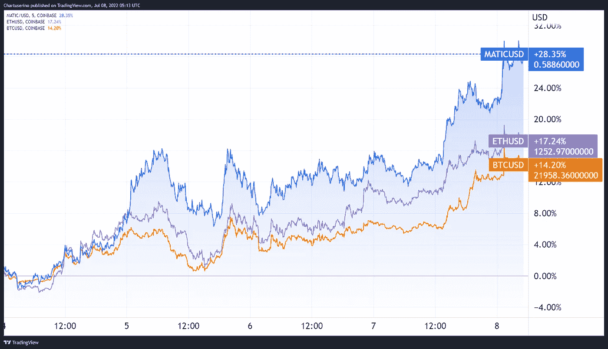

MATIC 的价格在过去 5 天内有所变动。图片信用: [*交易查看*](https://tradingview.com/) *。*

即使在可怕的熊市中，世界上最大的社交媒体平台也在增强这一势头。Reddit 每月有 4800 万活跃用户，而 Meta(脸书)有 29.3 亿。

具体来说，Meta 正在通过 Ethereum/Polygon 为 Instagram 集成测试 NFTs。同样，Reddit 的目标是在 Polygon 上制作的自己的 [NFT 市场](https://www.reddit.com/r/NFTsMarketplace/)上标记用户的头像。

鉴于 Reddit 的创造力和才华已经如此成熟，这可能是 NFT 市场进入下一个发展阶段所需的推动力。

# 航海家数码公司的破产终结了曝光瘟疫

*   旅行者号的数字文件因特拉卢娜的传染而申请破产 **(** [**链接**](https://tokenist.com/voyager-digital-files-for-bankruptcy-as-terra-lunas-contagion-looms/) **)**

# 每个人都互相亏欠

尽管 Sam Bankman-Fried 的努力，航海家数字加密经纪人被冲进金融厕所。在 Voyager 一周前暂停提款后，SBF 通过他的量化交易公司 Alameda Research 提供了价值 5 亿美元的信贷生命线。

SBF 是阿拉米达研究公司的联合创始人。这次救援是在 USDC 的 2 亿美元和通过 15k BTC 的 3 . 09 亿美元的组合。然而，这仍然低于已经倒闭的对冲基金 Three Arrows Capital (3AC)欠 Voyager 的 6.54 亿美元。

令人惊讶的是，破产文件显示，阿拉米达研究公司本身欠旅行者 3.767 亿美元。这是否意味着所有相互欠下的债务现在都一笔勾销了？不完全是，因为第 11 章破产意味着至少一部分债务必须偿还。

一旦法院批准了清算计划，重组可能需要长达两年的时间才能完成。当然，那些有担保的债权人，比如银行，会首先得到偿付。不幸的是，对于航海家数码的最终用户来说，他们排在最后，相当于股东。

从好的方面来看，这似乎是最近的加密传染病结束的开始。它始于泰拉与 UST 的脱钩，很可能以 Celsius 告终，后者尽管还清了债务，但仍处于水深火热之中。

最后，看来“不是你的钥匙，不是你的硬币”这句话仍然是正确的。

# 本周推特

> 几件事阅读 141 pg 航海家数字破产申请(线程)

[**@ 0x hamz**](https://twitter.com/0xHamz/status/1544670893980487681)

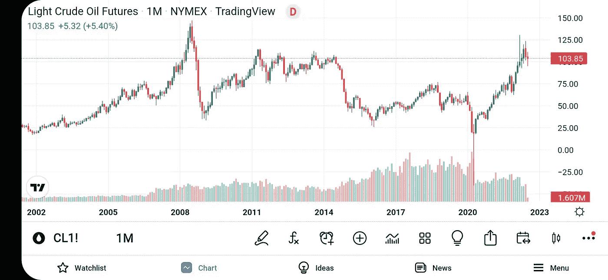

> 这不是原油第一次每桶 100 美元。事实上，2008 年至 2014 年的大部分时间，油价都在 100 美元左右。然而，那时的消费者并不像今天这样为燃料支付那么多钱。为什么当时通货膨胀没有失控？我们被耍了。

【T4**@ 100 万亿美元**

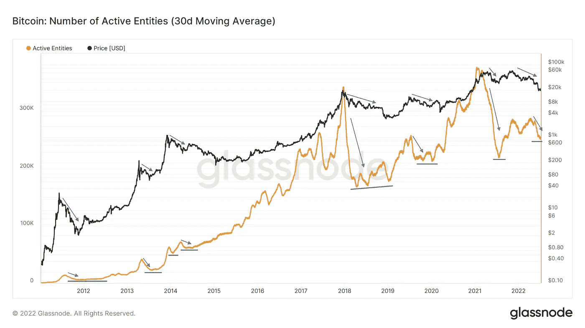

> 比特币应用的真正信号是:
> 
> 每次价格下跌，都会有一些新的市场参与者离开(他们来这里只是为了价格上涨)，但有更多的人相信比特币并留下来。

【T8**@ wclementeii**

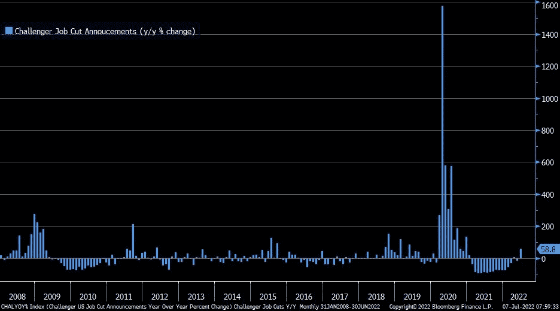

> yikes:⁦@challengergray⁩6 月份裁员人数同比激增 58.8%，而前一个月为-15.8%；自 2020 年 12 月以来的最大增幅…汽车行业宣布大部分裁员 10，198 人(同比增长 155%)

[**@ LizAnnSonders**](https://twitter.com/LizAnnSonders/status/1545017175626358784)

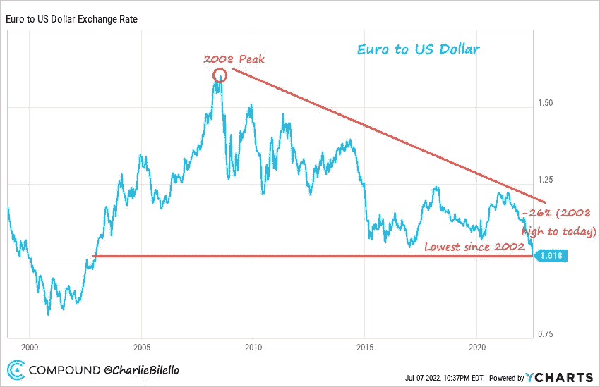

> 欧元处于 2002 年以来的最低水平，比 2008 年的峰值下跌了 26%。美元欧元
> 
> 通过@ycharts 制图

[@ charliebilello](https://twitter.com/charliebilello/status/1545237691188617216)

# 加入五分钟金融时事通讯。

[Sign up here — it’s free.](https://tokenist.com/newsletter/?utm_source=getresponse&utm_medium=email&utm_campaign=thetokenist&utm_content=%E2%9C%8B%20FMF%3A%20BoA%20Readying%20for%20BTC%2C%20Pot%20Goes%20Federal%2C%20More%20Inflation)

[t.me/thetokenist](http://t.me/thetokenist?utm_source=getresponse&utm_medium=email&utm_campaign=thetokenist&utm_content=%E2%9C%8B%20FMF%3A%20BoA%20Readying%20for%20BTC%2C%20Pot%20Goes%20Federal%2C%20More%20Inflation)

[twitter.com/thetokenist](https://twitter.com/thetokenist)