# 五分钟财经:马斯克收购 TWITTER，BTC 矿工斗争，接近停止 USN，美联储支点？

> 原文：<https://medium.com/coinmonks/five-minute-finance-musk-buys-twitter-btc-miner-struggle-near-halts-usn-fed-pivot-3d8f941bc70b?source=collection_archive---------17----------------------->

你听说了吗？令牌专家刚刚推出了一份每日简讯，每天将密码和宏观金融领域最重要的事件直接发送到你的收件箱*。[在这里注册](https://app.getresponse.com/site2/3960472a3039e40cfa0f07672c785d18/?u=QcLhh&webforms_id=zRenm)永远不要错过一个突破性的发展。*

**

# *5 分钟的金融时事通讯——解释发生了什么，为什么。*

# *让我们看看这周发生了什么:*

*   *美联储的全球流动性紧缩*
*   *大型科技公司在第三季度盈利后损失 8000 亿美元*
*   *马斯克收购 Twitter——让这一点深入人心*
*   *现金应用上的比特币，但矿工们在挣扎*
*   *NEAR 的 USN 算法稳定连接端的生命支持*

**

# *美联储转向鸽派的条件？*

*   *随着美联储预期放缓加息后美元下跌，比特币突破 2 万美元 **(** [**链接**](https://tokenist.com/bitcoin-breaches-20000-as-the-dollar-falls-after-fed-expected-to-slow-rate-hikes/) **)***
*   *9 月比特币与英镑交易量涨 233%:报道 **(** [**链接**](https://tokenist.com/trading-volume-between-bitcoin-and-gbp-up-233-in-september-report/) **)***

# *美联储正在全力以赴阻止通货膨胀吗？*

*世界事实上的中央银行，美联储，是市场的国王制造者。就像众所周知的索伦之眼，美联储正在扫描即将到来的宏观经济数据，以确定它是否会继续其 40 多年来最快的加息周期。*

*6.6%的核心通胀率(核心 CPI)仍比美联储 2%的通胀目标高出 3 倍。自 3 月份以来，美联储将短期利率上调至 3%-3.25%，预计下周将再次加息 0.75%。从历史上看，联邦基金利率必须超过通货膨胀率，才能有效地抑制通货膨胀和冷却经济。*

*这是一个双重问题。首先，美联储正在收缩国际美元流动性，极大地破坏了国际金融的稳定。最好的例子是过去几周日本银行不得不进行紧急债券购买。*

*日本银行别无选择，因为当日元对美元跌至 32 年来的最低点时，投资者的需求非常低。同样，英格兰银行不得不进行类似的紧急债务购买，因为英镑兑美元突破了 1985 年的低点。*

*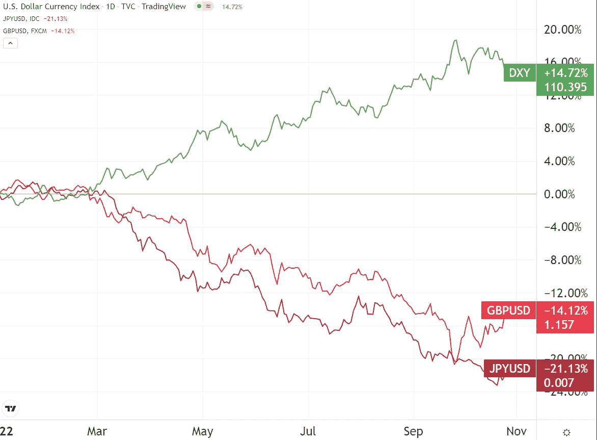*

**年初至今，美元兑英镑和日元的强势指数(DXY)。图片来源:* [*交易视图*](https://www.tradingview.com/)*

*简而言之，美联储的美元收缩正在引发恶性循环，可能导致主权债务泡沫破裂。*

*看到这种可怕的可能性，英国投资者在 9 月份将比特币交易量增加了 233%。这是有充分理由的，因为比特币存在于中央银行范式之外。*

*“这是我们第一次看到一个发达国家的货币(比特币)数量如此巨大的增长。”*

*Tyr Capital 首席投资官 Ed Hindi*

*其次，美联储的美元紧缩正在挤压国内借款人。根据一份薪酬财务报告，72%的消费者的储蓄比一年前少了，其中 29%的人为了生存已经耗尽了他们的积蓄。总体而言，66%的员工比一年前陷入了更糟糕的财务困境。*

*展望未来，美联储将不得不对这些问题负责。美联储理事克里斯托弗·沃勒(Christopher Waller)已经暗示"*将在下次会议上就收紧步伐进行非常深思熟虑的讨论。**

*旧金山联邦储备银行总裁兼首席执行官玛丽·戴利也公开表示要放缓美联储加息的步伐。*

*《华尔街日报》泄露的一份报告还提到，美联储正计划就未来加息的规模和速度展开辩论。*

*然而，这种考虑可能必须在 11 月份定价的 75 个基点的加息之后进行，这将把利率提高到 4%。*

**

# *科技股收益大幅增长，但还不够*

*   *对市值蒸发近 8000 亿美元的大型科技公司来说，这是残酷的一周 **(** [**链接**](https://www.ft.com/content/3abf8c31-95bb-47ea-a461-351a5fbfaa4d) **)***

# *梅塔成为本周勇敢向前冲股票的最大输家*

*美联储对市场的影响继续显现。通过加息，美联储提高了资本成本，并对消费者的借贷成本施加了压力。与此同时，消费者必须应对 40 年来生活成本的飙升，美联储正试图通过加息来解决这一问题。*

*由于这些强大的逆风，大型科技巨头正在失去动力。在经历了 2020/2021 年前所未有的增长后，今年有望重新获得这些收益。*

*事实上，相比 2020 年 4 月，亚马逊(AMZN)和 Meta (META)已经处于负值区间。年初至今，他们的股票都在下跌，微软(MSFT)和苹果(AAPL)是最有弹性的。*

*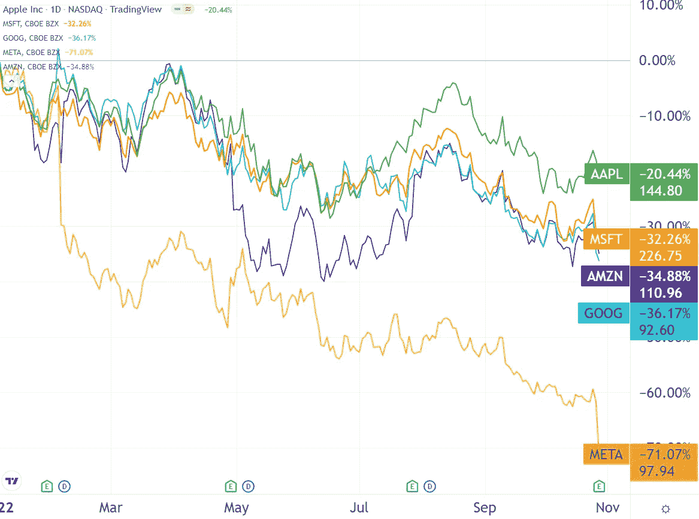*

*本周发布的大型科技股第三季度收益放大了年初至今的负面股票回报。图片来源: [*交易查看*](https://www.tradingview.com/)*

*与去年同期相比，苹果公司的收入增长了 8.1%，iPad 销量下滑，Mac 销量增加。微软总营收跌至五年低点，为 501 亿美元。尽管安装 Windows 的制造商减少了 15%，但占微软总收入一半的微软云弥补了 24%的同比增长。*

*亚马逊第三季度的收益显示，电子商务销售疲软，因为履行费用增加了 14%，达到 203 亿美元。尽管亚马逊的收入每年增长 15%，但其 1271 亿美元的收入低于 FactSet 亿美元的预期。因此，从周四到周五，亚马逊在一天之内损失了超过 2000 亿美元的市值。*

*到目前为止，Meta 表现最差，市值蒸发了 890 亿美元。Meta 第三季度的净收入为 43.9 亿美元，较去年第三季度的 91.9 亿美元大幅下滑。尽管扎克伯格在虚拟现实耳机市场占据了 66%的主导地位，但他在元宇宙的投资尚未显示出任何结果。*

*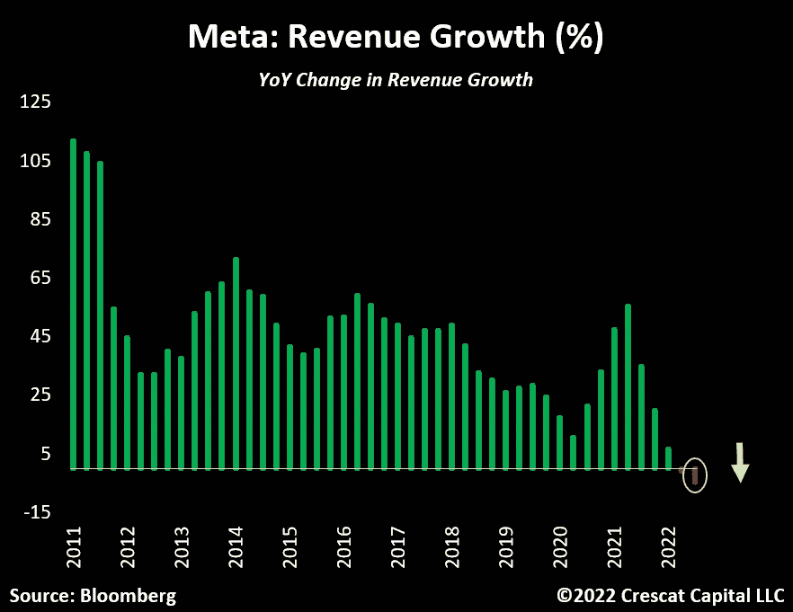*

**今年 Meta 的营收增长是历史上最差的。图片来源:*[*Crescat Capital*](https://www.crescat.net/)*

*Meta 的元宇宙分部 Reality Labs 第三季度亏损 36 亿美元。从这个角度来看，迄今为止最受欢迎的游戏《侠盗猎车手 V》和《使命召唤》分别需要 20 亿美元和 25 亿美元来开发。*

*更清楚地说，索尼 2021 年的整个研发预算是 55 亿美元。索尼总收入的四分之一来自 PlayStation 生态系统。然而，自 2020 年以来，Meta 的现实实验室已经花费了超过 200 亿美元。*

*花了这么多钱，收效甚微，投资者一周内将 Meta 的价值降低了 21.86%。*

*猜猜谁之前看好 META？吉姆·克莱默。Mad Money 本人最近为他的立场向观众道歉，称他的错误是相信了 META 的领导，而不是他自己:*

**“随着自由现金流从地球上消失，Meta 回购了 65 亿美元。我没想到会这样。我信任这个管理层，但这是不明智的。**

*也许这就是为什么最近宣布的一个[逆克莱姆 ETF](https://tokenist.com/investors-can-soon-short-jim-cramer-with-tuttle-capitals-inverse-cramer-etf/) 如此受欢迎的原因。*

*[**享受 5MF？点击转发给三个朋友。**](mailto:info@tokenist.com?subject=Check+this+out+&body=I%E2%80%99ve+been+reading+Five+Minute+Finance,+and+I+know+you%E2%80%99d+enjoy+it+too.+It%E2%80%99s+a+weekly+email+that+covers+the+most+important+trends+in+finance.+I+learn+something+new+every+time+I+read+it!+Check+it+out+here:+https://tokenist.com/newsletter/?utm_source=email_gr_btn)*

**

# *埃隆·马斯克的推特终于被理解了*

*   *“首席推特”马斯克本周五向推特员工发表讲话 **(** [**链接**](https://tokenist.com/chief-twit-musk-to-address-twitter-staff-this-friday/) **)***

# *安装新的 Twitter 政府*

*在史诗般的心理游戏和法律调查之后，亿万富翁埃隆·马斯克最终收购了世界上最有影响力的公共论坛 Twitter。周三，他宣布了这一举措，他把一个浴室水槽搬到了 Twitter 的总部，宣布“让那个水槽进来吧！”。*

*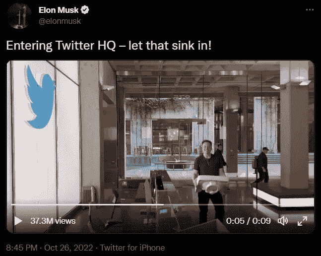*

*看到马斯克拿着水槽走进 Twitter 总部的人比加拿大公民还多。图片来源:推特*

*但是会被理解的是什么？首先，马斯克立即解雇了 Twitter 的关键人员，首先是首席执行官帕拉格·阿格拉瓦尔(Parag Agrawal)和 Twitter 的法律政策、信任与安全负责人维贾亚·加德(Vijaya Gadde)。如果你记得，盖德是最终禁止时任美国总统唐纳德·特朗普的律师。*

*Twitter 首席财务官 Ned Segal 也出局了。马斯克收购 Twitter 发生在周五法庭听证会开始的前一天。在关于他打算如何管理 Twitter 的公开声明中，Musk [提到了](https://tokenist.com/musk-writes-to-twitter-advertisers-day-before-court-ordered-deadline/)以下几点:*

*   *传统媒体助长了一种两极分化的文化，分为极左和极右，追求点击诱惑。*
*   *虽然他买 Twitter 不是为了钱，但他打算让广告与用户高度相关，因此它们会成为有用的内容。*
*   *Twitter“*不能成为一个自由的地狱场景*”，但要遵守“*的法律*”。*

*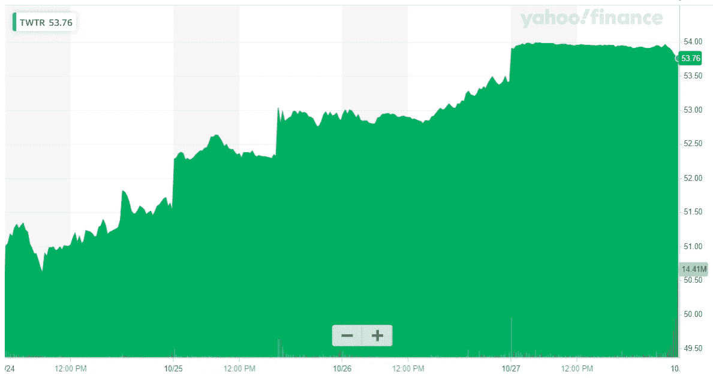*

**在被纳斯达克摘牌之前，这家现已私有化的 Twitter 几乎达到了马斯克每股 54.20 美元的收购报价。图片来源:* [*雅虎财经*](https://finance.yahoo.com/quote/TWTR/chart?p=TWTR#eyJpbnRlcnZhbCI6NSwicGVyaW9kaWNpdHkiOjEsInRpbWVVbml0IjoibWludXRlIiwiY2FuZGxlV2lkdGgiOjIuODgxNDEwMjU2NDEwMjU2NCwiZmxpcHBlZCI6ZmFsc2UsInZvbHVtZVVuZGVybGF5Ijp0cnVlLCJhZGoiOnRydWUsImNyb3NzaGFpciI6dHJ1ZSwiY2hhcnRUeXBlIjoibW91bnRhaW4iLCJleHRlbmRlZCI6ZmFsc2UsIm1hcmtldFNlc3Npb25zIjp7fSwiYWdncmVnYXRpb25UeXBlIjoib2hsYyIsImNoYXJ0U2NhbGUiOiJsaW5lYXIiLCJzdHVkaWVzIjp7IuKAjHZvbCB1bmRy4oCMIjp7InR5cGUiOiJ2b2wgdW5kciIsImlucHV0cyI6eyJpZCI6IuKAjHZvbCB1bmRy4oCMIiwiZGlzcGxheSI6IuKAjHZvbCB1bmRy4oCMIn0sIm91dHB1dHMiOnsiVXAgVm9sdW1lIjoicmdiYSgyMDAsIDI0MCwgMjIwLCAwLjgpIiwiRG93biBWb2x1bWUiOiJyZ2JhKDI1NSwgNDgsIDYwLCAwLjgpIn0sInBhbmVsIjoiY2hhcnQiLCJwYXJhbWV0ZXJzIjp7IndpZHRoRmFjdG9yIjowLjQ1LCJjaGFydE5hbWUiOiJjaGFydCJ9fX0sInBhbmVscyI6eyJjaGFydCI6eyJwZXJjZW50IjoxLCJkaXNwbGF5IjoiVFdUUiIsImNoYXJ0TmFtZSI6ImNoYXJ0IiwiaW5kZXgiOjAsInlBeGlzIjp7Im5hbWUiOiJjaGFydCIsInBvc2l0aW9uIjpudWxsfSwieWF4aXNMSFMiOltdLCJ5YXhpc1JIUyI6WyJjaGFydCIsIuKAjHZvbCB1bmRy4oCMIl19fSwic2V0U3BhbiI6eyJtdWx0aXBsaWVyIjo1LCJiYXNlIjoiZGF5IiwicGVyaW9kaWNpdHkiOnsiaW50ZXJ2YWwiOjUsInBlcmlvZCI6MSwidGltZVVuaXQiOiJtaW51dGUifX0sImxpbmVXaWR0aCI6Miwic3RyaXBlZEJhY2tncm91bmQiOnRydWUsImV2ZW50cyI6dHJ1ZSwiY29sb3IiOiIjMDA4MWYyIiwic3RyaXBlZEJhY2tncm91ZCI6dHJ1ZSwiZXZlbnRNYXAiOnsiY29ycG9yYXRlIjp7ImRpdnMiOnRydWUsInNwbGl0cyI6dHJ1ZX0sInNpZ0RldiI6e319LCJjdXN0b21SYW5nZSI6bnVsbCwic3ltYm9scyI6W3sic3ltYm9sIjoiVFdUUiIsInN5bWJvbE9iamVjdCI6eyJzeW1ib2wiOiJUV1RSIiwicXVvdGVUeXBlIjoiRVFVSVRZIiwiZXhjaGFuZ2VUaW1lWm9uZSI6IkFtZXJpY2EvTmV3X1lvcmsifSwicGVyaW9kaWNpdHkiOjEsImludGVydmFsIjo1LCJ0aW1lVW5pdCI6Im1pbnV0ZSIsInNldFNwYW4iOnsibXVsdGlwbGllciI6NSwiYmFzZSI6ImRheSIsInBlcmlvZGljaXR5Ijp7ImludGVydmFsIjo1LCJwZXJpb2QiOjEsInRpbWVVbml0IjoibWludXRlIn19fV19)*

*最后，马斯克打算将 twitter 打造成“世界上最受尊敬的广告平台”。随着 Twitter 流失其最活跃的用户，这种情况不会来得更快。所谓的“重度推特用户”占月活跃用户(mau)的 10%，但他们占所有推特的 90%，占推特全球收入的一半。*

*路透社报道的 Twitter 内部研究显示，Twitter 的广告收入主要来自美国，这比所有其他市场的收入总和还要多。*

*埃隆·马斯克(Elon Musk)是否会通过削减数字公共领域的适度支出来扭转这一趋势，还有待观察。*

**

# *现金应用集成了比特币的闪电网络*

*   *美国的 Cash App 用户现在可以通过闪电网络 **(** [**链接**](https://tokenist.com/cash-app-users-in-the-us-can-now-recieve-bitcoin-through-lightning-network/) **)** 接收比特币*

# *比特币和闪电网络将从现金应用的 4400 万用户中获益，但矿工们面临着严峻的挑战*

*离开 Twitter 后，杰克·多西将注意力集中在支付系统上。多尔西的公司 Block 推出了 Cash App，作为这场秀的明星。该支付应用去年报告了 123 亿美元的收入，其中 81%来自比特币(BTC)。*

*2021 年第四季度，Cash App 的月活跃用户数为[4400 万](https://www.businessofapps.com/data/cash-app-statistics/)，刚刚进行了一次重大升级，整合了闪电网络(LN)。与比特币的主网不同，LN 是……你猜对了……快如闪电。那是因为 LN 不会每隔 10 分钟就等待比特币矿工添加新交易。*

*取而代之的是，BTC 汇款人和收款人在由 BTC 资助的 LN 上开通支付通道。这允许多个交易(有多少比特币就有多少)被即时执行。LN 通道关闭后，这些交易被捆绑起来，作为另一个数据块添加到比特币的主网络中。*

*换句话说，照明网络将比特币转化为真正的货币，除了其被认为是永不封顶的数字黄金的价值。现金应用集成只是日常即时支付大规模主流应用的一个亮点。*

*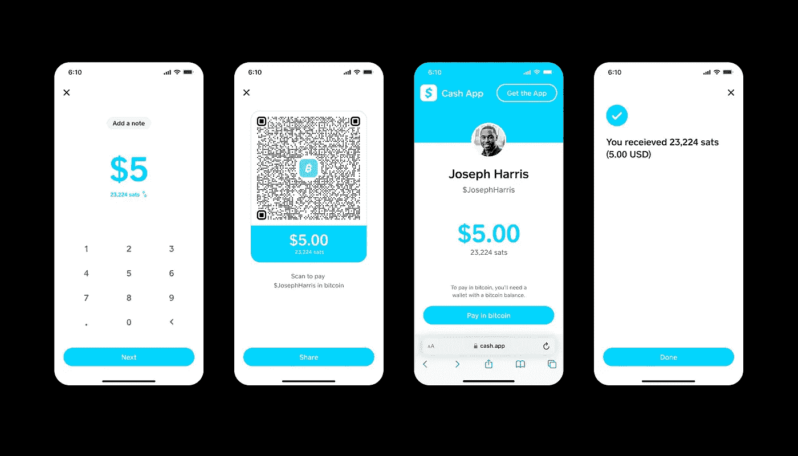*

**Cash App 在新的 LN 功能中继续采用其简单理念。图片来源:* [*推特*](https://twitter.com/MichaelRihani/status/1584729594124697601)*

*这样的消息是比特币采矿灾难中一个受欢迎的喘息。在牛市中，当 BTC 价格上涨时，矿工们迫不及待地插入他们的 ASIC 钻机，以获得那些宝贵的 BTC 奖励。但在熊市中，矿商必须用每枚比特币的价格来平衡采矿设备的运营成本。*

*更糟糕的是，在牛市中，许多比特币采矿公司负债购买更多的采矿钻机。现在宏观环境已经逆转，他们被迫出售 BTC 来弥补成本。最近，最大的矿业公司之一 Core Scientific 宣布将暂停 10 月和 11 月的债务。*

*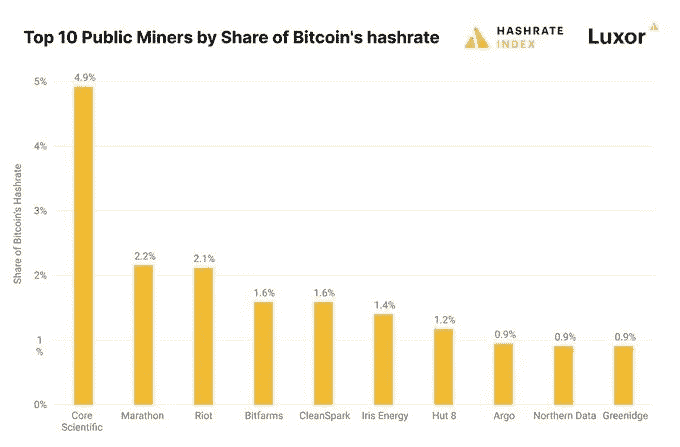*

**图片来源:* [*卢克索*更新](https://luxormining.substack.com/)*

*这还是在它上个月已经售出 1000 多枚比特币之后。不出所料，CORZ 的股票周四暴跌了-80%，进一步加剧了其再融资的能力。*

*那么，这一切对比特币意味着什么？*

*以前没发生过很多次的事。比特币挖矿难度每两周自动重新调整一次。随着越来越多的矿工由于成本原因退出游戏，难度将会降低，从而使采矿更加有利可图。*

*在此期间，比特币矿工可能会进行更多抛售。这种压力可能会压低 BTC 价格，但前提是买入量不增加。Cash App 的新 LN 功能无疑是这个方向上的一个良好开端。此外，随着其他法定货币兑美元汇率下跌，以及美元可能继续失去一些动力，这些因素可能会对潜在的矿商抛售造成进一步的买入压力。*

**

# *靠近协议沟渠 USN Stablecoin*

*   *接近协议的 TVL 在宣布 Stablecoin 下台后差点腰斩 **(** [**链接**](https://tokenist.com/near-protocols-tvl-nearly-halved-after-announcing-stablecoins-removal/) **)***

# *算法稳定将不得不等待更绿色的密码季节*

*当 Terra 的 UST 稳定币崩溃，抹去 440 亿美元的价值时，算法稳定币变得具有放射性。典型的稳定债券(如 USDT 和 USDC)往往有 100%的一对一可赎回性，因为公司用准备金支持它们。*

*相比之下，算法稳定货币依赖于其他波动性较大的加密货币作为其过度抵押的储备。理论上，他们可以在稳定的市场条件下工作。但在极端情况下，当盯住汇率下降时，稳定的货币就会被拖入贬值的深渊。*

*令人惊讶的是，即使在算法稳定币升级到非算法版本后，这种情况也会发生。USN stablecoin 位于区块链附近，最初由 USDT 和 NEAR tokens 支持。在其 v2 版本中，它只得到 USDT 的支持。间接地，这意味着 USN 是由现金支持的，因为 USDT 大部分是由现金支持的。*

*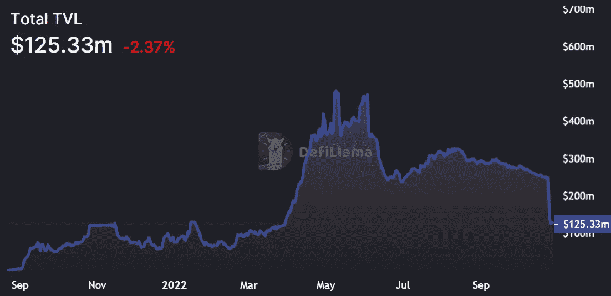*

**虽然 NEAR 锁定(TVL)的总价值比弱势下跌了一半，但 NEAR token 本身仅下跌了-1.84%。那是因为它不像露娜之于 UST 那样与 USN 的铸造/燃烧联系在一起。图片来源:* [*不毛之地*](https://defillama.com/chain/Near)*

*但是，USN v1 遗留代码允许重复铸造一些硬币，导致 4000 万美元的担保不足缺口。好在这不会影响附近小区。近东基金会介入了 4000 万美元的 USN 保护计划，为所有 USN 用户提供 100%的可赎回性。*

*然而，USN 正在关闭，因为新的 USN 铸造被永久停止，而剩余的 USN 通过 [USN 保护计划](https://usnpp.auroralabs.dev/)得到赎回。对于努力实现完全去中心化堆栈的 DeFi 生态系统来说，算法稳定积分是一个有用的概念。*

*尽管如此，如果这仍然有可能，在恢复对算法稳定性的信心之前，市场还需要几年时间才能成熟。*

# *本周推特*

> *Reddit NFTs 是 Web 3 历史上最大的赚钱机会之一*

*[**@ NFT _ 神**](https://twitter.com/NFT_GOD/status/1585288107104124931?s=20&t=UQ6i9UJztEJoy7F-eW_QjA)*

> *2 年前:30 年期抵押贷款利率为 2.80%，美国平均新房价格为 39.5 万美元。*
> 
> *今天:30 年期抵押贷款利率为 7.08%，平均新房价格为 5.18 万美元。*
> 
> *结果:首付增加了 2.5 万美元(假设首付 20%)，月供增加了 114%(从 1，298 美元增加到 2，779 美元)。*

*[**@ charliebilello**](https://twitter.com/charliebilello/status/1585634956751273985)*

*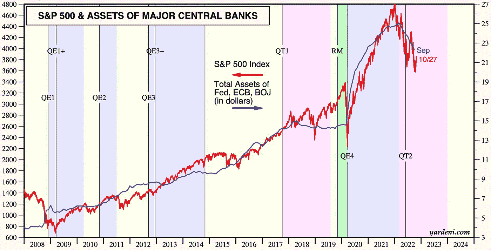*

> *友情提示:央行就是市场。*

*[**@ mayhemmarkets**](https://twitter.com/Mayhem4Markets/status/1585922214041362433)*

*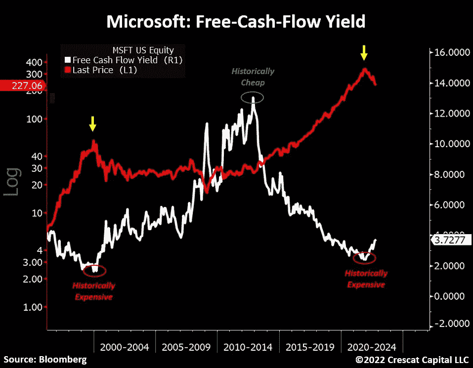*

> *微软的股价仍然是有史以来最高的估值之一。*
> 
> *上一次达到类似水平是在科技泡沫的高峰期。*
> 
> *随后下跌了 65%。*
> 
> *如今，像$MSFT 这样的股票被以低得多的价格重新评级的风险要大得多。*

*[**@TaviCosta**](https://twitter.com/TaviCosta/status/1585717083458805760)*

*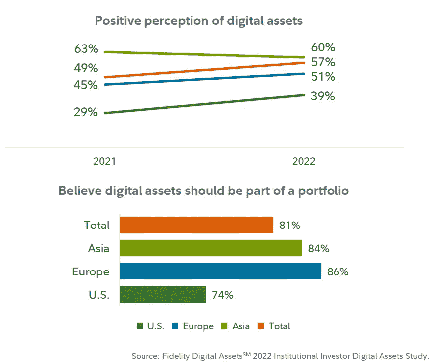*

> *74%的机构计划购买#比特币和数字资产*
> 
> *>[富达的新研究](https://www.fidelitydigitalassets.com/sites/default/files/documents/2022_Institutional_Investor_Digital_Assets_Study.pdf)*

*[**@ documenting BTC**](https://twitter.com/DocumentingBTC/status/1585694361215434781)*

# *加入五分钟金融时事通讯。*

**

*[Sign up here — it’s free.](https://tokenist.com/newsletter/)*

**

*[t.me/thetokenist](http://t.me/thetokenist)*

**

*twitter.com/thetokenist*

> *交易新手？尝试[加密交易机器人](/coinmonks/crypto-trading-bot-c2ffce8acb2a)或[复制交易](/coinmonks/top-10-crypto-copy-trading-platforms-for-beginners-d0c37c7d698c)*