# 五分钟金融:耐克的 NFT 销售，TWTR 短期兴趣，AMC 问题 APE:解释

> 原文：<https://medium.com/coinmonks/five-minute-finance-nikes-nft-sales-twtr-short-interest-amc-issues-ape-explained-5e900653ccdb?source=collection_archive---------31----------------------->

# 5 分钟的金融时事通讯——解释发生了什么，为什么。

# 让我们看看这周发生了什么:

*   耐克公司报告 NFT 销售额达 1 . 85 亿美元，NFT 骗局随之发生
*   TWTR 对新 Bot 告密者的短期兴趣反应
*   泰瑟希望在将 USDT 列入黑名单之前进行更多的沟通
*   类人猿冲击 AMC 的价格
*   比特币兑换流入/流出、已实现损失和宏观前景

# 非专利技术继续遭受损失，但企业品牌显示出进步

*   NFT 市场和开发商消失后，投资者损失 81.5 万美元 **(** [**链接**](https://tokenist.com/investors-lose-815k-after-nft-marketplace-and-developers-disappear/) **)**
*   耐克在 NFT 的收入达到 1.85 亿美元，仅版税就高达 9221 万美元 **(** [**链接**](https://tokenist.com/nikes-nft-revenue-hits-185m-92-21m-in-just-royalties/) **)**

# 隐秘的冬天:疲惫还是肥沃的土地？

Crypto winter 对 NFTs 并不友好。自 4 月份以来，NFT 销售价格中位数已经下跌了-88%。

这是对 2018 年 7 月价格水平的回归，当时 NFT 仅限于互联网边缘。

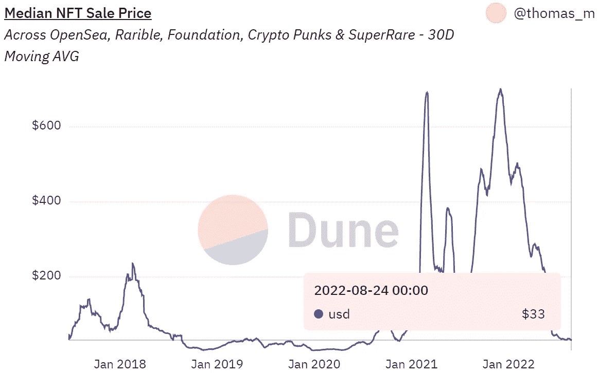

在整个冬季，NFT 的销售价格中位数经历了急剧下降。图片来源: [*沙丘分析*](https://dune.com/queries/352141/669783) *。*

就连此前对宏观经济持抵制态度的蓝筹股 NFT 也在遭受贬值。尽管一些公司从历史最高的底价缓冲了下跌，但所有公司都大幅下跌:

*   贝茨:150▶️联邦理工学院 72.6 联邦理工学院 **-51%**
*   mayc:40 ▶️13.5 联邦理工学院
*   密码朋克:125 ETH ▶️ 67.5 ETH **-46%**
*   ▶️联邦理工学院 8.7 级 **-73%**
*   月鸟:35 ▶️15.4 联邦理工学院 **-56%**
*   酷猫:19 ETH ▶️ 2.3 ETH **— 88%**

NFT 的创新被残酷地利用也于事无补。分散的 SudoSwap marketplace 通过增加流动性池和取消版税费用创新了这一场景。SudoSwap 没有将非金融交易产品上市，而是将它们放在流动性池中，通常是 NFT 的 ETH，允许交易者立即将非金融交易产品换成 ETH。流动性提供者然后收取交易费，类似于 Uniswap。

但是，这种创新只是提高了骗局游戏。骗子们将 SudoSwap 克隆到 SudoRare 中，结果在过去的一周内，他们的钱包被盗走了 81.5 万美元。

尽管这种声誉上的打击是沉重的，但目前的 NFT 市场应该被视为一个准备场。毕竟，自 2021 年 1 月以来，拥有 NFT 的累计钱包数量增加了+624%，从 78.7 万增至 570 万。

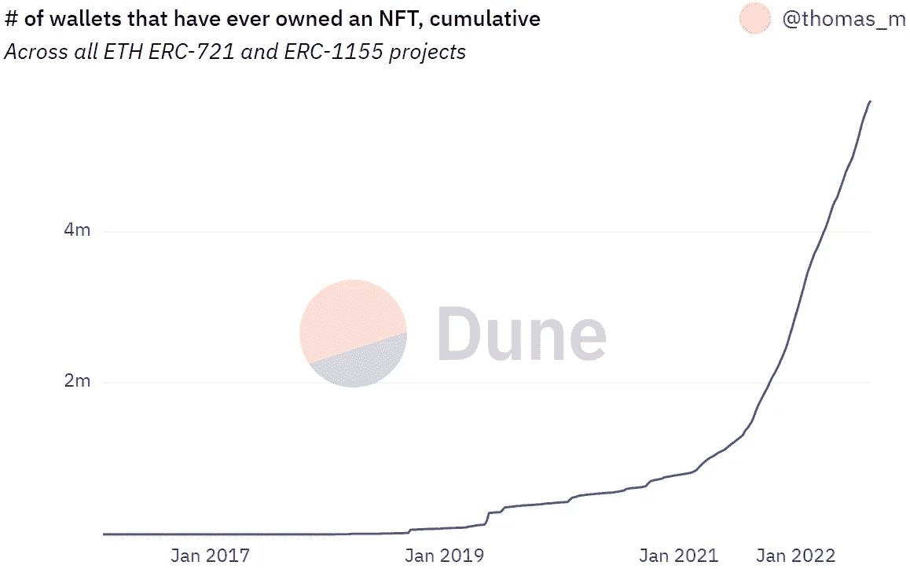

持有 NFT 智能合约的钱包数量接近 600 万。图片鸣谢: [*沙丘分析*](https://dune.com/queries/201622/376266) *。*

对于一个新的概念来说，这是巨大的曝光率。企业还没有通过[潜在的“穿赚”模式](https://tokenist.com/adidas-joins-nike-in-the-metaverse-as-industry-inches-closer-to-wear-to-earn-model/)来利用这一想法，但他们正在慢慢接近。

耐克仍在试水隐踢技术，已经获得了 9300 万美元的版税和 1.85 亿美元的 NFT 总销售额。除了阿迪达斯，他们还有一个伙伴关系，那就是沿着 [Stepn](https://cointelegraph.com/metaverse-for-beginners/what-is-stepn-gmt-a-beginners-guide-on-the-web3-lifestyle-app) 的脚步，扩展到一个“穿赚”的模式。

元宇宙端到端商务平台 Ohzone 的首席运营官表示，这些举措是不可避免的:

*【NFTs】可以给任何衣服单品带来很多额外的效用。这可能意味着解锁该物品的数字版本，或者获得设计师在线社区的特殊访问权限。此外，NFT 很容易包含在内，因为它们可以通过一个小的二维码整合到任何一件衣服上。”*

现在，人们已经熟悉了一个有点抽象的 NFT 概念，品牌熟悉度的土壤很肥沃，可以带来额外的效用。

# TWTR 短期兴趣在最新的 Bot 传奇中增加

*   SEC 给 Twitter 的信能在收购审判中帮助埃隆马斯克吗？ **(** [**链接**](https://tokenist.com/could-secs-letter-to-twitter-help-elon-musk-in-acquisition-trial/) **)**
*   随着美国证券交易委员会对垃圾邮件僵尸程序的调查逼近，Twitter 下跌 7%**(**[**链接**](https://tokenist.com/twitter-down-7-as-sec-investigation-on-spam-bots-looms/) **)**

# 机器人告密者开始行动

Twitter 真的值埃隆·马斯克最初提出的每股 54.20 美元的 440 亿美元吗？根据举报人的说法，这个数字需要修正。

在 Q1 2019 年，当 TWTR 的交易价格在 30 美元左右时，该社交媒体平台拥有 1.34 亿可货币化的每日活跃用户(mDAUs)。

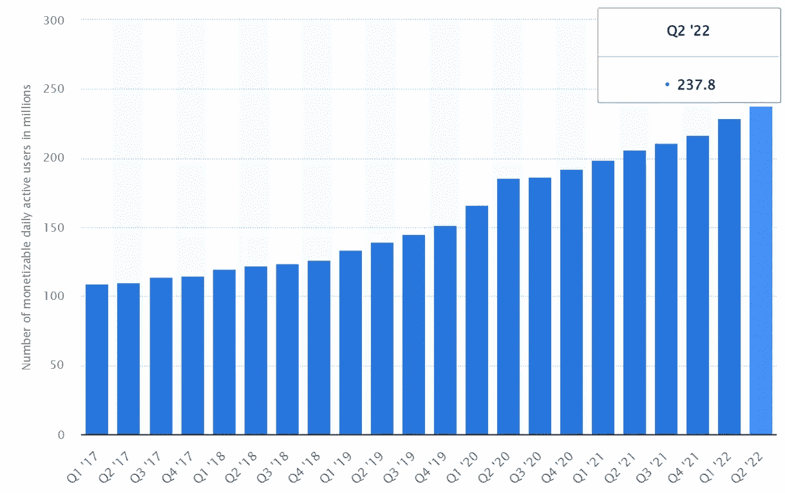

自那以来，Twitter 的 mDAUs 增长了+77%，达到 2.378 亿美元，每股 41 美元，估值增长了+36%。图片来源: [*Statista*](https://www.statista.com/)

然而，甚至在三年前，Twitter 错误地通过增加关联账户来计算 mdau，据称 mdau 增加了 1%。这是今年美国证券交易委员会(SEC)要求 Twitter 提供更多关于机器人流行率计算的信息时披露的。

Twitter 的机器人会计将在即将到来的 10 月审判中决定案件的成败。虽然 Twitter 将机器人账户的数字定为 5%，但前 Twitter 安全主管 Pieter Zatko 讲述了严重管理不善和“惊人缺陷”的故事。作为曾在谷歌和五角大楼国防高级研究机构工作过的人，这种说法很有分量。

很像以太坊的合并，这种估值的不确定性是投机的时机。上周，TWTR 股票经历了剧烈的波动，在几轮反弹后下跌了 6%。

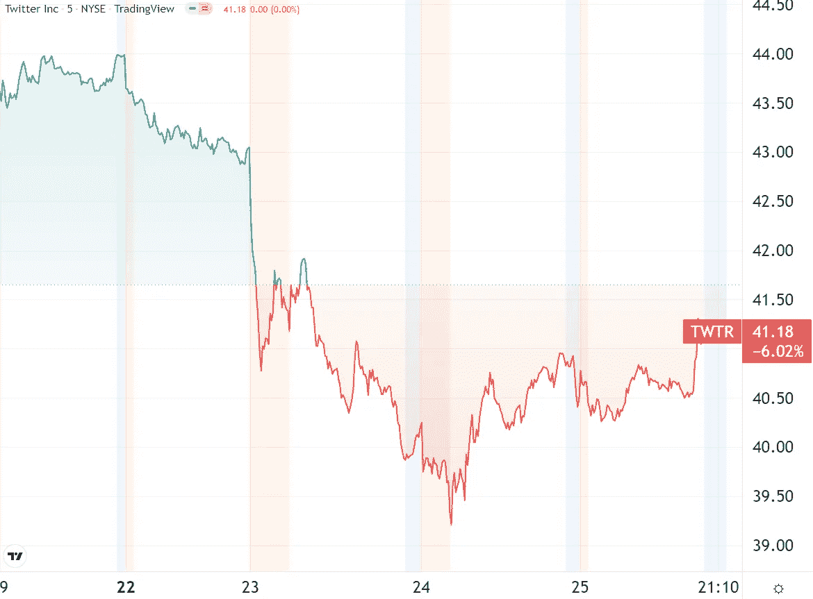

*推特(TWTR)过去一周的股价。图片信用:* [*交易视图*](https://www.tradingview.com/)

以目前的速度，3510 万股使 TWTR 的空头兴趣大增，达到去年 10 月以来的最高水平。

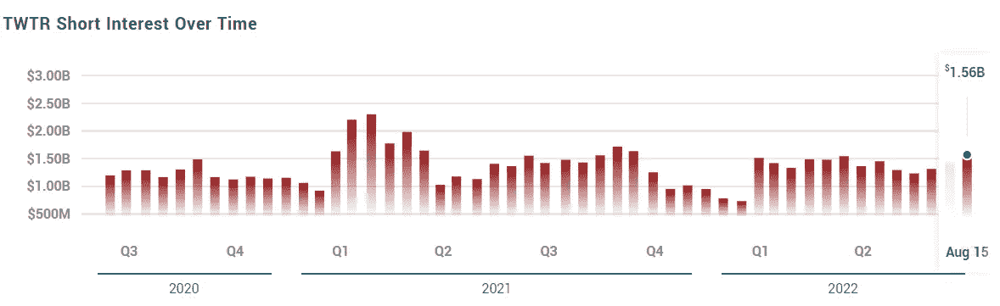

*图片来源:*[*market beat*](https://www.marketbeat.com/stocks/NYSE/TWTR/short-interest/)

如果从现在到审判前有更多的告密者出来，空头兴趣可能会进一步增加。

[**享受 5MF？点击转发给三个朋友。**](mailto:info@tokenist.com?subject=Check+this+out+&body=I%E2%80%99ve+been+reading+Five+Minute+Finance,+and+I+know+you%E2%80%99d+enjoy+it+too.+It%E2%80%99s+a+weekly+email+that+covers+the+most+important+trends+in+finance.+I+learn+something+new+every+time+I+read+it!+Check+it+out+here:+https://tokenist.com/newsletter/?utm_source=email_gr_btn)

# 系绳拒绝禁止 USDT 与龙卷风现金相关-到目前为止

*   系绳索赔稳定币发行者对龙卷风现金制裁过早采取行动 **(** [**链接**](https://tokenist.com/tether-claims-stablecoin-issuers-acted-prematurely-on-tornado-cash-sanctions/) **)**

# 泰瑟的冷静公关之举

上周，我们报道了 Tether 的重大合法性举措。最大的稳定币发行商[聘请了顶级公共审计公司 BDO 意大利](https://tokenist.com/tether-hires-new-auditor-to-publish-monthly-proof-of-reserves/)，此外还将审计频率从季度审查增加到月度审查。令许多人惊讶的是，泰瑟仍然没有掀起龙卷风般的现金禁令狂潮。

与此同时，Tether 的竞争对手 Circle(《USDC》的发行商)自 7 月份以来，将其在以太坊上的禁止地址列表增加了一倍多。

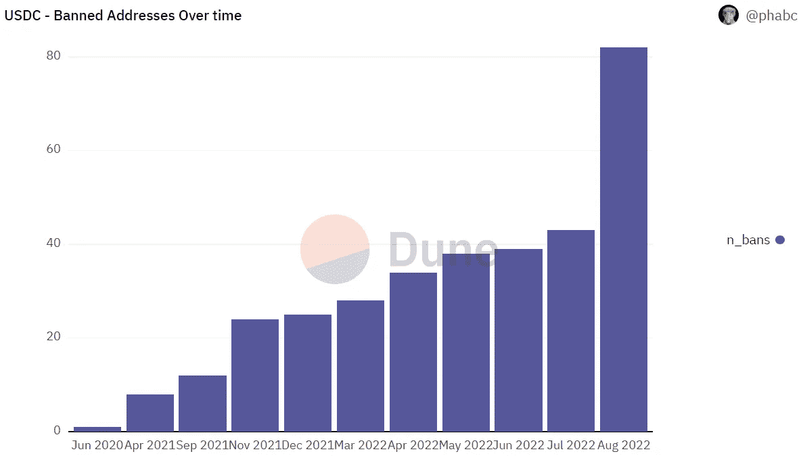

*龙卷风现金加倍圈的禁锤用法。图片来源:* [*沙丘分析*](https://dune.com/phabc/usdc-banned-addresses)

这是否意味着泰瑟是某种财务自由的倡导者？一点也不。如果有的话，这是一个聪明的公关举措。首先，没有一家依赖传统银行业的公司能够忽视 OFAC 的 SDN 名单，除非它们想面临被查封和长期监禁。

第二，系绳正在使 OFAC 走上法制之路。在 Circle 率先行动并承担 OFAC 后续行动的同时，Tether 正在等待后续行动。

*“OFAC 并未表示稳定的硬币发行人将冻结在 OFAC SDN 列表上公布的二级市场地址”*

泰瑟进一步指出…

*“尽管我们几乎每天都与美国执法机构联系，但没有美国执法机构或监管机构提出此类请求”*

泰瑟称 Circle 的行动为时过早，并进一步指出，戴并没有冻结任何地址，尽管得到了 USDC 36%(34 亿美元)的支持。最后，我们可以看看 Tether 在 Tornado Cash 之前的禁播历史，以建立一些预期。

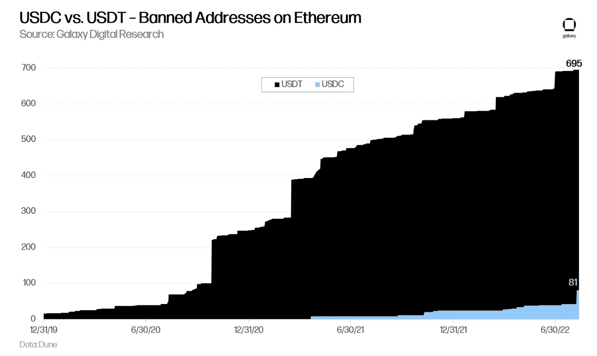

*虽然今年 USDC 市值赶上了 USDT，但系绳的解禁比例超出了预期。图片来源:* [*银河数码*](https://www.galaxy.com/) *。*

总体而言，在其历史上，Circle 禁止了 82 个包含 409 万 USDC 的地址，而 Tether 禁止了 711 个包含 4.101 亿 USDT 的地址。

# AMC 弹出猿为更多的现金

*   AMC 的新“APE”单元是这家连锁影院快速筹集资金的一种文化友好方式 **(** [**链接**](https://www.cnbc.com/2022/08/22/amcs-new-ape-units-are-a-meme-friendly-way-to-raise-cash-fast.html) **)**

# 迷因和类人猿

在某些方面，[迷因股](https://tokenist.com/investing/meme-stocks/)充当了基本面和技术面分析的避风港。他们首先依赖于社区参与、投机甚至怀旧。

在过去的两年里，这一联合拯救了 AMC 娱乐公司免于多次破产。

相应地，这类模因股的波动性尤其大。

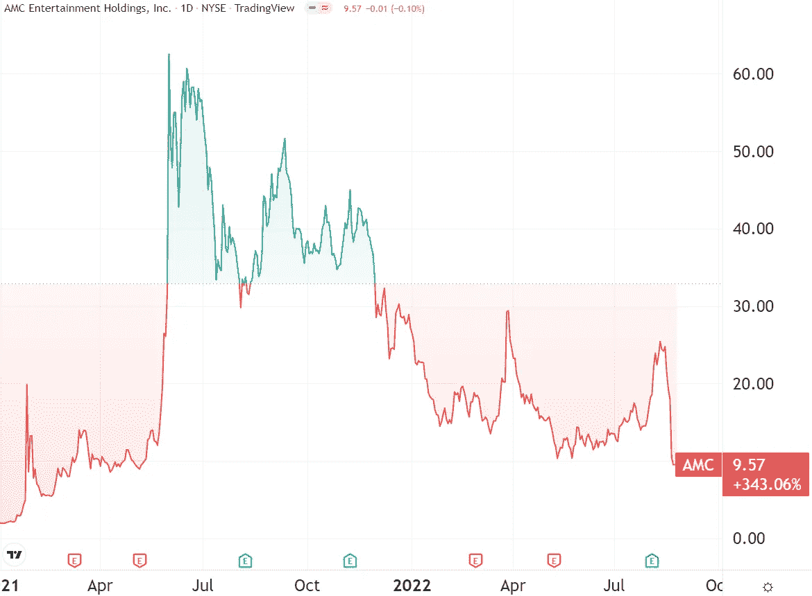

年初至今，AMC 下跌了-64%，但自 2021 年 1 月以来，meme 股票仍上涨了+343%，这标志着做空高潮的开始。图片信用: [*交易查看*](https://www.tradingview.com/) *。*

AMC 最新推出了一种新型的分享课程——APE。不，不是宇迦实验室的猿。尽管它们出生于相同的思维模式，但 AMC 猿指的是忠实的迷因交易者，他们用原始术语来称呼自己。出于创造性的巧合，APE 是 quity 的缩写。

猿是关于什么的？简单地说，这是一个筹集现金的工具。如果你记得，AMC 大幅增加了其流通股，从 2020 年 Q2 的 1.04 亿股增加到 2022 年 Q2 的 5.16 亿股。这种增长对公司的持续运营至关重要，让 meme 交易充斥着更多可购买的股票。

问题是，AMC 有一个发行在外股票的上限，即 5.241 亿股普通股，这是该公司成立时设定的。去年 7 月曾试图提高这一比例，但遭到强烈反对后失败了。这就是 APE 的用武之地，它是一条在不增加普通股的情况下继续筹集现金的捷径。

APE 就像普通股，只是它是优先股。上市公司可以发行优先股，由董事会决定其价格和投票权，重要的是，不需要股东批准。

在这种情况下，AMC 董事会授权:

*   十亿猿单位。
*   现有 AMC 普通股持有人将获得 5.168 亿美元。
*   4.832 亿美元未发行，留给 AMC 亿美元的储备。

这意味着，所有 AMC 持有人周一都获得了一个额外的 APE 单位，从某种意义上说，这实际上是将股票一分为二。换句话说，APE 的发行起到了分红的作用。

这实际上是一种没有拆分的拆分——这是一种特殊的股息，因为股息很少作为股票发行。然而，由于这种稀释效应，APE 的推出在周一打压了 AMC 的股票。

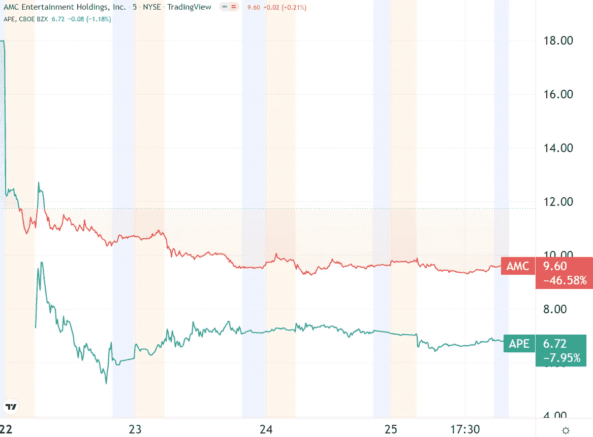

*APE 需要+43%的价格才能达到 AMC 平价。图片来源:* [*交易查看*](https://www.tradingview.com/)

最终，如果他们想让 APE 转换成普通股，董事会还必须进行股东投票。如果通过，这将是另一个稀释性的下行压力，考验着模因交易者的耐力。

# 比特币和宏观前景

*   美联储布拉德:通胀可能比预期更持久 **(** [**链接**](https://www.reuters.com/markets/us/feds-bullard-inflation-likely-be-more-persistent-than-expected-2022-08-25/) **)**

# 比特币仍然保持着低迷的能量

比特币正在恢复其陈旧的横盘走势，在上周几乎没有退缩，周五下跌 0.3%，周一下跌 2.4%。问题是，有什么有意义的指标显示兴奋吗？

从外汇外流的水平来看，在灾难性的 Terra (LUNA)崩溃后，外汇仍受到抑制。这表明散户兴趣较低，流出和流入都比去年 4 月比特币 ATH 峰值低 3 倍。

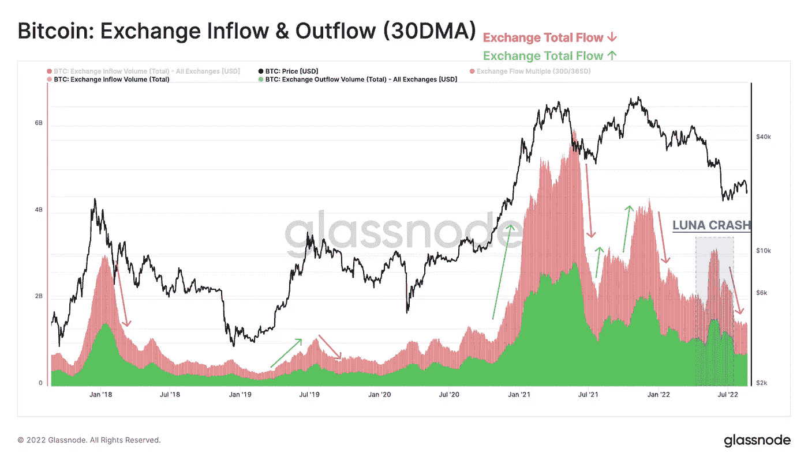

*图片来源:*[*glass node*](https://insights.glassnode.com/the-week-onchain-week-34-2022/)

在多次抛售浪潮之后，剩下的卖家越来越少，表现为净实现利润/亏损。虽然与 2019 年 1 月的主要抛售相比有所下降，但我们可能处于复苏的中点。

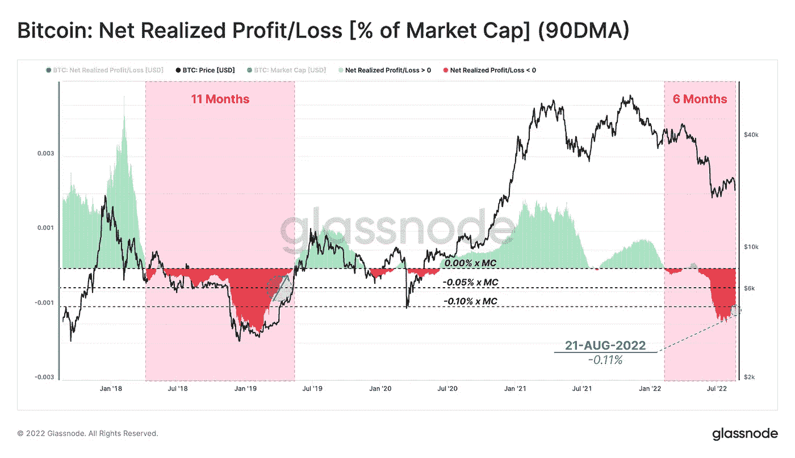

*图片来源:*[*glass node*](https://insights.glassnode.com/the-week-onchain-week-34-2022/)

如图所示，一旦比率进入正(绿色)范围，它将发出需求上升的信号。这可能吗？

当然，在制度方面，贝莱德给比特币披上了一层全新的合法性外衣。然而，就宏观环境而言，零售业正努力实现收支平衡，创纪录的家庭债务就证明了这一点。

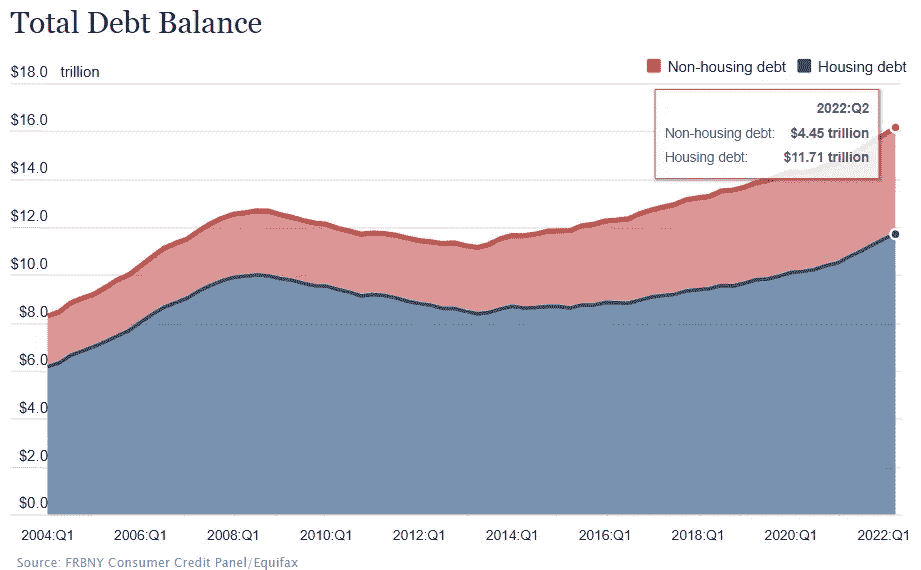

*镜像信用:* [*美联储纽约银行*](https://www.newyorkfed.org/microeconomics/hhdc)

如果美联储认为通胀需要更多的打击，它将继续加息。圣路易斯美联储大学校长詹姆斯·布拉德暗示了这条道路，他说:

“一个基线可能是，通货膨胀将比华尔街许多人预期的更持久，并且将在更长时间内保持高位，这是当今市场低估的风险。”

# 本周推特

> 2012 年第二季度 GDP 增长从最初的-0.9%上调至-0.6%(季度/季度年化)……消费从+1%上调至+1.5%

[**@ LizAnnSonders**](https://twitter.com/LizAnnSonders/status/1562789049861283843)

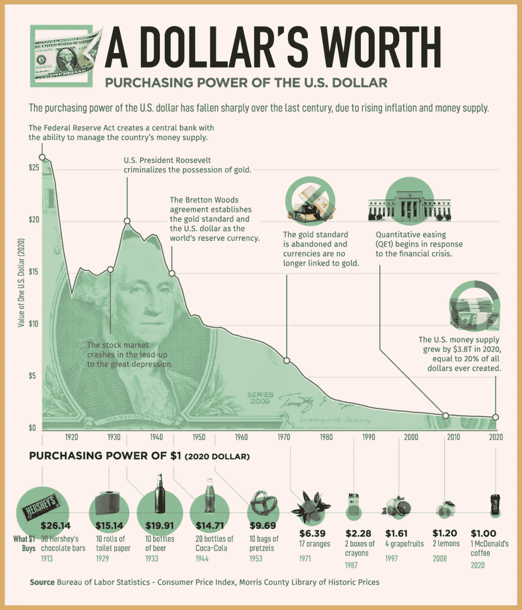

> 美元缓慢而持续的死亡简史。
> 
> 这就是为什么我们#比特币

[**@ TheCryptoLark**](https://twitter.com/TheCryptoLark/status/1562936301396955137)

> SEC 已经推迟了 Van Eck 的 ETF 申请。又来了。
> 
> 至少贝莱德的客户仍然可以购买它的比特币私募基金😕

[**@ coin bureau**](https://twitter.com/coinbureau/status/1563127344327364608)

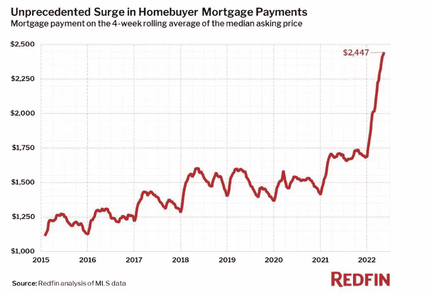

> 这不是石油，不是米姆股票，甚至不是骗局。这是美国每月抵押贷款支付的中位数

[**@GRDecter**](https://twitter.com/GRDecter/status/1562437282048552961)

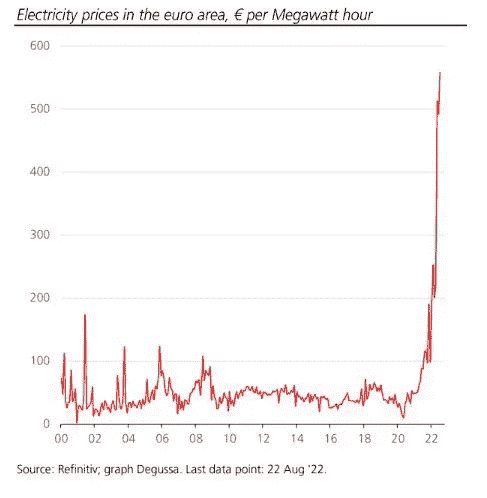

> 这不是 GameStop，AMC 甚至 Bed Bath 和 Beyond。这是欧洲的电价

【T8**@ alifarhat 79**

# 加入五分钟金融时事通讯。

[Sign up here — it’s free.](https://tokenist.com/newsletter/)

[t.me/thetokenist](http://t.me/thetokenist)

[twitter.com/thetokenist](http://twitter.com/thetokenist)

> 交易新手？尝试[加密交易机器人](/coinmonks/crypto-trading-bot-c2ffce8acb2a)或[复制交易](/coinmonks/top-10-crypto-copy-trading-platforms-for-beginners-d0c37c7d698c)