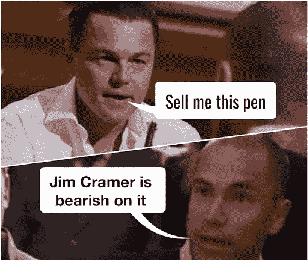
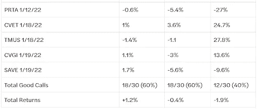
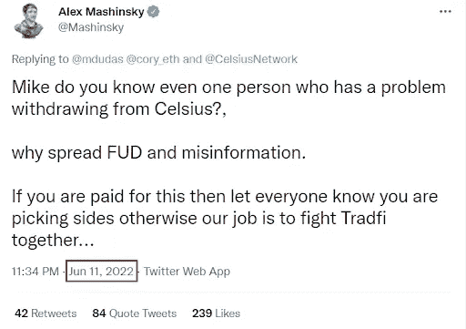
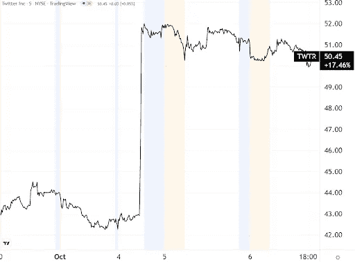
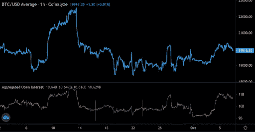
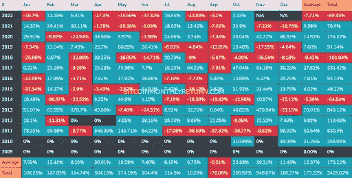
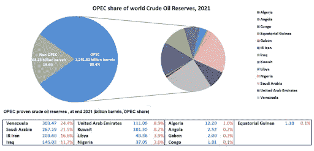
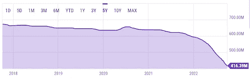
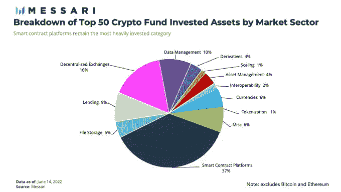
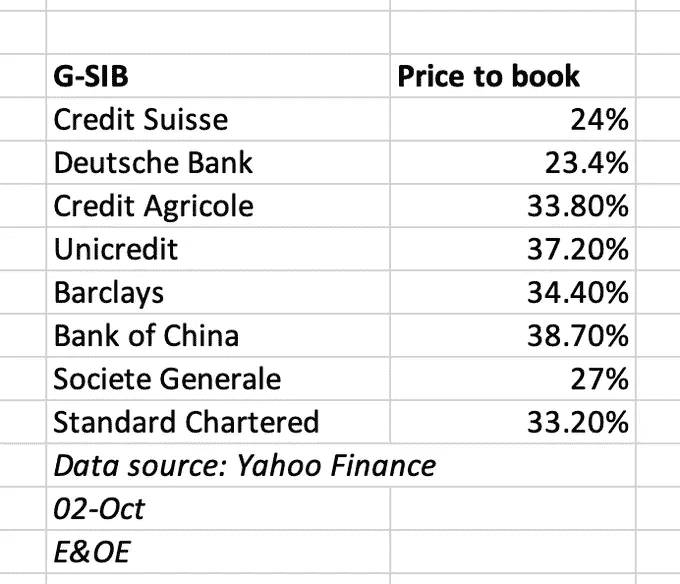

# 五分钟财经:BTC 未平仓合约上涨 16 亿美元，逆克莱姆交易所交易基金，油价涨至 100 美元？

> 原文：<https://medium.com/coinmonks/five-minute-finance-open-interest-in-btc-up-1-6b-inverse-cramer-etf-oil-to-100-actions-35fa830009ef?source=collection_archive---------12----------------------->

# 5 分钟的金融时事通讯——解释发生了什么，为什么。

# 让我们看看这周发生了什么:

*   迷因+社交媒体+交易=逆克莱姆 ETF
*   CeFi 的麻烦:Celsius 高管在破产前撤资数百万
*   马斯克在 Twitter 上的 180 度大转弯
*   比特币未平仓合约数据:未来 10 月？
*   欧佩克+削减石油供应，油价将达到 100 美元/桶

# 逆向初始交易

*   投资者可以很快做空吉姆·克拉姆与塔特尔资本旗下逆克拉姆 ETF **(** [**)链接**](https://tokenist.com/investors-can-soon-short-jim-cramer-with-tuttle-capitals-inverse-cramer-etf/) **)**

# 基于迷因的交易导致反向克莱姆交易所交易基金

公开曝光是双向的。一端，你施加你的影响力，另一端，你的影响力被审视。在经营了 17 年的“疯狂金钱”后，67 岁的吉姆·克莱默(Jim Cramer)在社交媒体上备受打击。

这一切都始于一年前的@CramerTracker Twitter 账户，从那时起，它的粉丝已经超过了 1.1 万。通过对比克拉姆对股票投资的呼吁和他们随后的表现，反向克拉姆迷因诞生了。

但社交媒体审查巴克并没有就此止步。这个迷因成为了金融现实，或者可能很快成为现实。Tuttle Capital Management (TCM)为 83 家公司管理着价值 3600 万美元的投资组合，它申请开设了两只以 Cramer 为中心的基金。

它们尴尬地被命名为逆向克莱姆 ETF 和多头克莱姆 ETF，允许投资者押注与克莱姆的建议相反的方向。例如，逆克莱姆交易所交易基金(SJIM)将包括多达 25 只同等权重的股票。

对他们不利的头寸将根据克拉姆在推特/电视上的建议建立，然后在一周后，如果克拉姆继续他的课程或达到利润目标时退出。换句话说，基金依赖于反向克莱姆迷因的力量。但是，它真的能作为一个真正的迷因存在吗？

不完全是。鉴于克莱姆共同创立了 TheStreet.com，他所有的电话都可以在那里找到。根据克莱姆今年推荐的 30 只股票，截至 6 月份，他所选择的股票中有 60%是盈利的。克拉默的预测能力只有在考虑年初至今的回报时才会下降，因为他的选择中有 40%是盈利的。

*图片来源:* [*金钱不速之客*](https://www.moneycrashers.com/jim-cramers-stock-pick-performance/)

他是在美联储加息引发的历史性动荡市场低迷期间做出这些决定的。年初至今，所有市场基准都在下跌:纳斯达克指数下跌了 11%，标准普尔 500 下跌了 21%，道琼斯工业平均指数下跌了 17%。因此，即使是克莱默的-1.9%年初至今似乎也没有那么糟糕。

更重要的是，克莱姆甚至不会将个人资金投入到个股中。他向他的美国消费者新闻与商业频道雇主透露，他一半的资产是现金，而 40%是国内指数基金。剩下的 10%平均分配给国际指数基金和黄金/加密基金。

这表明克拉姆是一个投资者，而不是像他在电视上出现的那样是一个投机交易者。

外卖？事情并不总是像电视上看到的那样。大外卖？迷因、社交媒体和交易的融合正以前所未有的方式继续影响着金融市场。

# CeFi 挣扎:Celsius 高管在破产前不久撤资

*   报道:就在破产前几周，Celsius 方正撤回了 1000 万美元 [**(链接)**](https://tokenist.com/report-just-weeks-before-bankruptcy-celsius-founder-withdrew-10-million/)
*   Celsius 前三名高管在破产前套现 1700 万美元 [**(链接)**](https://www.coindesk.com/business/2022/10/06/celsius-top-3-execs-cashed-out-56m-in-crypto-before-bankruptcy/)

# CeFi 只是没有保护的 TradFi 吗？

在 Celsius 于 2021 年 8 月达到 200 亿美元后，阿尔法适马资本等研究公司预计 Celsius 到 2025 年将达到 300 亿美元。有什么不喜欢的:只是丢硬币给其他人借，并获得两位数的收益率。不要大惊小怪。

相反，冉冉升起的 CeFi 之星爆发了破产。实验为什么会失败？

*   为了吸引更多用户，利率被人为设定得很高(18%)。
*   “极端市场条件”突然出现，密码价格暴跌，导致贷款清算。
*   Celsius 曾贷款给其他公司，比如破产的 3AC。

换句话说，熊市和加密传染冲击了摄氏温度，吞噬了它的流动性。随着贝尔斯登的崩溃，除了宣布第 11 章破产之外别无选择。

这些都不是新闻。但随着破产申请的公开，Celsius 高管本周成了头条新闻。发生了什么事？

6 月 12 日，在 Celsius 暂停提款之前，当时的首席执行官 Alex Mashinsky 还在向人们保证，Celsius 担心的是“FUD”。

感谢本周三提交的财务报表，现在我们知道后台发生了什么。

Mashinksy 在 2022 年 5 月从 crypto 提取了 1000 万美元。CSO Daniel Leon 在 5 月 27 日到 5 月 31 日之间提取了大约 700 万美元。7 月中旬，该公司申请破产保护。

在收回自己的部分资产后，他们暂停了客户提款，将这些存款留给破产法庭处理。

随着 CeFi 再次被打得鼻青脸肿，摄氏温度的情况似乎继续恶化。

[**享受 5MF？点击转发给三个朋友。**](mailto:info@tokenist.com?subject=Check+this+out+&body=I%E2%80%99ve+been+reading+Five+Minute+Finance,+and+I+know+you%E2%80%99d+enjoy+it+too.+It%E2%80%99s+a+weekly+email+that+covers+the+most+important+trends+in+finance.+I+learn+something+new+every+time+I+read+it!+Check+it+out+here:+https://tokenist.com/newsletter/?utm_source=email_gr_btn)

# 在推特上大转弯

*   随着马斯克提出跟进最初的收购 **(** [**链接**](https://tokenist.com/twitter-shares-soar-10-as-musk-offers-to-complete-the-purchase/) **)** ，Twitter 股价飙升 20%
*   伊隆的背影 [**(链接)**](https://www.bloomberg.com/opinion/articles/2022-10-05/elon-s-back)

# 埃隆·马斯克和杰克·多西揭示了他们的心态

在过去的三年里，Twitter 的业务并不出色。它获得了 12 亿美元的净收入，但亏损了 22 亿美元。尽管如此，网络效应使其价值超越了原始数据。以至于杰克·多西对把 Twitter 变成一家公司深感后悔，称此举是“原罪”。

这是 Twitter 起诉埃隆·马斯克的一部分。宝藏包括数百次私人对话，不仅是多尔西和马斯克之间的对话，也包括与加密救市国王和 FTX 掌门人山姆·班克曼-弗里德(SBF 饰)的对话。

在给马斯克的其中一条消息中，多尔西说 Twitter 应该是一个协议，有点像 Signal 所做的那样。有趣的是，多尔西指出一个广告模型是一个攻击载体，因为“*如果它背后有一个集中的实体，它将受到攻击*”。

SBF 和马斯克似乎都同意，可以通过区块链协议征收垃圾邮件费用来解决机器人垃圾邮件。通过这种方式，用户将支付微交易来注册链上消息。对马斯克来说，这似乎是一个好主意，因为“没有喉咙哽住，所以言论自由得到保证”。

显然，多尔西是马斯克的粉丝，因为在马斯克提出 440 亿美元的收购要约至少一年前，多尔西就试图让马斯克获得董事会席位。

有一条信息特别暗示了两者之间的密切关系。“我相信你，但 def 也可以，”杰克写信给埃隆，作为对埃隆要求杰克警告他是否做了“蠢事”的回应。

那么，Twitter 的收购现在怎么样了？

马斯克选择退出每股 TWTR 股票 54.20 美元的 440 亿美元交易的原因是，他声称 Twitter 对其机器人活动的规模撒谎，扭曲了准确的用户群和用户活动数据。反过来，Twitter 起诉了马斯克，审判本应在 10 月开始。

本周一，马斯克[向美国证券交易委员会提交了一份提案](https://www.sec.gov/Archives/edgar/data/1418091/000110465922105787/tm2227435d1_ex99-s.htm)，表示他希望完成最初的交易。消息传出后，Twitter 的股价上涨了 20%，现在非常接近最初的 54.20 美元。

*TWTR 股票对马斯克想要坚持其最初报价的消息的反应。图片来源:TradingView。*

SBF 也积极与马斯克聊天，提出加入这笔交易，出资 50 亿美元。对此，马斯克回应说，他不想“*有一场费力的区块链辩论*”。可以肯定的是，马斯克也不想要一场艰苦的审判。或者，他的法律团队让他相信他不会赢得这场机器人大战。不管怎样，看起来马斯克和 Twitter 的交易最终会通过。

# 衍生品交易员押注比特币加速上涨

*   自 10 月初以来，BTC 的未平仓合约增加了 16 亿美元 [**(链接)**](https://tokenist.com/open-interest-in-btc-up-1-6b-since-the-start-of-october/)

# Uptober Legacy Spikes 未平仓合约不断增加

在过去的 30 天里，比特币的表现超过标准普尔 500 5%。此外，比特币对美元强势指数保持坚挺，同期上涨了+2.25%。通常，比特币兑 DXY 表现不佳，因为许多人将 BTC 视为对冲货币贬值的工具。

然而，一股似乎有助于比特币的新势头正在到来。年初至今，欧元(-11.55%)、英镑(-14.76%)和日元(-19.93%)对美元走弱，导致投资者焦虑，这抵消了美元的强势。随着这种情况的发生，比特币的未平仓合约也增加了。

*自 10 月 1 日以来，累计未平仓合约增加了 16 亿美元。图片来源:* [*共同分析*](https://coinalyze.net/bitcoin/open-interest/)

代表期货合约，交易者通过期货合约押注 BTC 上涨(多头)或下跌(空头)，未平仓合约主要由永久合约组成。这些只是没有到期日的期货。相反，他们是通过多头支付空头，或者空头支付多头来获得资金的。

当大多数交易者做多时，融资利率为正，这意味着大多数交易者押注 BTC 上涨。这可能有两个原因。首先，十月在历史上被称为 Uptober，就在历史上糟糕的九月之后。回到 2009 年，比特币在 10 月份的平均回报率为+26.39%。

*图片来源:BitcoinMonthlyReturns.com*

其次，美联储将于 11 月 1 日举行下一次 FOMC 会议，因此整个月美联储都不会宣布任何消息。

最后，一些国际机构正在向美联储施压，要求其重新考虑加息。联合国贸易和发展会议(贸发会议)说得很清楚:

*“报告显示，任何认为他们(央行)能够通过提高利率来压低价格而不引发衰退的想法，都是一场轻率的赌博，”*

从数字上看，印度和泰国不得不动用超过 10%的外汇储备，分别为 750 亿美元和 270 亿美元来支撑本国货币。由于美元作为全球储备货币的角色，如果美联储继续加息，更多这样的全球不稳定是可能的。

# 随着欧佩克+石油减产，油价预计将达到 100 美元

*   美国对欧佩克+大规模减产发出愤怒的谴责——这可能会对沙特产生反作用 [**(链接)**](https://www.cnbc.com/2022/10/06/oil-us-delivers-angry-rebuke-of-massive-opec-production-cut.html)
*   油价可能很快回到 100 美元，因为欧佩克+认为是“历史性的”削减，分析师说

# 能源成本将进一步增加

除了货币供应量增加，能源成本也是通胀的主要驱动因素之一。根据白宫 6 月份的一份声明，“能源和食品价格占了自 5 月份以来每月价格上涨的一半。”

当然，更多的是能源，因为它被用来制造和运输食物。但是作为主要能源的油价是如何确定的呢？通过调节供求关系。如果需求高于供给，人们将不得不为此支付更多的钱。

以石油为例，一个委员会设定了这种动力。特别是石油输出国组织(石油输出国组织)。这个石油生产协调机构拥有 80%的已知原油储量，由 13 个成员国组成。

【opec.org】图片来源:T2

欧佩克+是一个扩展，增加了 10 个主要石油出口国，包括俄国。仅欧佩克+就占全球石油产量的 55.4%。相比之下，美国负责 [18.5%](https://www.statista.com/statistics/236605/share-of-global-crude-oil-production-of-the-top-15-oil-producing-countries/) 。本周，欧佩克+做出了自 2020 年以来最大规模的减产决定，每天减产 200 万桶。通过减少供应，能源成本将不可避免地增加。

这一举动可以从几个潜在的角度来理解:

*   上周俄国要求减产后，欧佩克+正在帮助俄国。因为俄罗斯能源独立，这将间接帮助受制裁的国家。
*   欧佩克+正在使目标石油产量与其实际产量保持一致，实际产量在过去一年中一直落后，导致石油短缺。这意味着实字产量将下调约 100 万 b/p。

白宫声明他们对这个短视的决定感到失望。为了减轻 11 月份价格上涨的潜在影响，拜登政府将从该国已经枯竭的战略石油储备中再释放 1000 万桶。

*美国战略石油储备库存中的原油。图片来源:*[*YCharts.com*](https://ycharts.com/indicators/us_ending_stocks_of_crude_oil_in_the_strategic_petroleum_reserve)

当周，原油价格上涨+7.27%。

# 本周推特

> 突发事件:在发现链条上的“违规行为”后，BNB 宣布暂停交易。据币安称，该网络目前正在维护中。

[**@thetokenist**](https://twitter.com/thetokenist/status/1578158462210609153)

> 美国国债首次达到 31 万亿美元，在过去 3 年中增加了 8 万亿美元(35%)。

[**@ charliebilello**](https://twitter.com/charliebilello/status/1577704916486828037)

> 每次美联储不得不认真对抗通胀时，他们总是以筹集高于当前核心通胀率的联邦基金告终。
> 
> 1980 年:核心消费物价指数 14%，法国法郎 18%
> 
> 1984 年:核心消费物价指数 5%，法国法郎 12%
> 
> 20 世纪 90 年代:核心消费物价指数 6%，法国法郎 10%
> 
> 1999 年:核心消费物价指数 3%，法国法郎 6%
> 
> 2006 年:核心消费物价指数为 3%，法国法郎为 5%
> 
> 2023: ???

[**@MacroAlf**](https://twitter.com/MacroAlf/status/1576967529137741824)

> 以下是加密基金/风投持有的顶级资产(按市场领域划分):
> 
> 1.智能合约平台
> 
> 2.德克斯
> 
> 3.数据管理
> 
> 4.放款
> 
> 5.文件存储器

[**@ miles Deutscher**](https://twitter.com/milesdeutscher/status/1577931266602995712)

> 瑞士瑞信银行并不是唯一一家市净率发出警告信号的主要银行。下表列出了 PTB 低于 40%的所有 G-sib。其中一家公司的失败可能会使其他公司的生存受到质疑。

[**@ macleod finance**](https://twitter.com/MacleodFinance/status/1576491265218134016)

# 加入五分钟金融时事通讯。

[Sign up here — it’s free.](https://tokenist.com/newsletter/)

[t.me/thetokenist](http://t.me/thetokenist)

twitter.com/thetokenist

> 交易新手？尝试[加密交易机器人](/coinmonks/crypto-trading-bot-c2ffce8acb2a)或[复制交易](/coinmonks/top-10-crypto-copy-trading-platforms-for-beginners-d0c37c7d698c)