# 五分钟金融:鲍威尔的黑暗信息，瑞士联邦理工学院现在的通货膨胀比 BTC 少，多

> 原文：<https://medium.com/coinmonks/five-minute-finance-powells-dark-message-eth-is-now-less-inflationary-than-btc-more-a64cd4edc928?source=collection_archive---------18----------------------->

# 5 分钟的金融时事通讯——解释发生了什么，为什么。

# 让我们看看这周发生了什么:

*   鲍威尔的严厉警告
*   ETH 刚刚合并成一只证券了吗？
*   以太坊取代比特币成为低通胀资产
*   NFT 在 Reddit 上的受欢迎程度令人惊讶
*   PFOF 不会在美国被禁

# 12 位美联储理事决定经济走向

*   美联储 2022 年第五次加息 75 个基点 **(** [**链接**](https://tokenist.com/fed-raises-interest-rates-by-75-bps-in-this-years-fifth-hike/) **)**
*   完整重述美联储加息及鲍威尔对未来加息前景的评论 **(** [**链接**](https://www.cnbc.com/2022/09/21/real-time-updates-of-the-federal-reserves-big-rate-decision-and-powells-press-conference.html) **)**

# 美联储寻求通过降低短期内的可负担性，让一切变得更可负担

上周三，联邦公开市场委员会(FOMC)宣布今年第五次加息。作为全球货币流动性的统治者，12 位美联储理事没有让任何人感到意外。

第三次 0.75%的增长是普遍预期的，所以市场已经消化了这一点。然而，随后的新闻发布会还是引发了市场抛售。

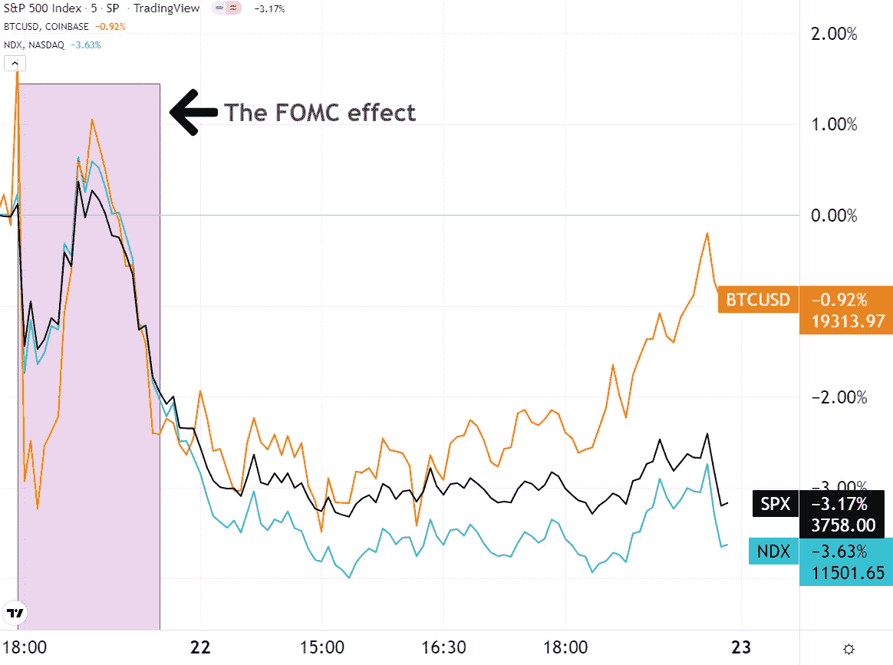

*BTC、SPX 和 NDX 对周三的 FOMC 会议和 Powell 的言论做出反应。图片来源:* [*交易查看*](https://www.tradingview.com/)

“软着陆”的说法似乎已经被抛到了九霄云外。首先，鲍威尔强调就业过高，“过去三个月平均每月增加 378，000 个工作岗位”。因为对工人的需求是在供给之上的，并没有足够压制工资。

从降低通胀的角度来看，这是不好的，因为它不会导致消费者需求受到充分抑制。其次，鲍威尔希望看到房地产市场下跌:

“因此，我们看到的房价减速应该有助于让价格更接近租金和其他房地产市场基本面，这是一件好事。”

事实上，自 Q1 2020 年以来，房价中值膨胀了 [+74%](https://fred.stlouisfed.org/series/MSPUS) 。美联储加息在戳破泡沫方面做得很好。例如，房屋所有权负担能力监测(HOAM)指数现在已经下降到几十年来的最低点。

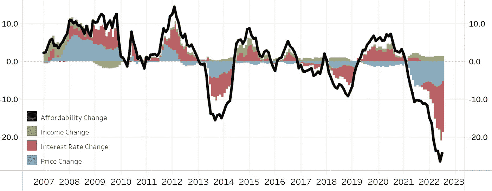

*今年美联储的加息对房地产的影响是房价的 5 倍。图片来源:* [*HOAM。*](https://www.atlantafed.org/center-for-housing-and-policy/data-and-tools/home-ownership-affordability-monitor)

美国中等家庭现在将不得不把近一半的收入用于支付抵押贷款。反过来，由于美联储将短期利率提高到抵押贷款利率以上，我们已经看到了自 1980 年以来单户家庭房屋销售的最大跌幅。

当然，汽车金融和信用卡将遭受同样的命运。随着新的联邦基金利率达到 3%-3.25%，Bankrate 已经累计了大约 19%的平均信用卡年利率。

美联储的目标很明确:

*   降低所有资产的价格，房地产是最大的群体。
*   通过将失业率从目前的 3.7%提高到 4.4%来抑制工资增长
*   全面提高借贷成本，这样债务就无法满足消费者需求

鲍威尔公开承认，软着陆将“非常具有挑战性”，而且“没有人知道这个过程是否会导致衰退”。他的结论是，为了减缓经济增长，基金利率将不得不长期保持在一个限制性水平。意思是，引发经济衰退。

“如果我们想为另一个非常强劲的劳动力市场铺平道路，我们必须摆脱通胀。我希望有一种不痛不痒的方法来做那件事。没有。”——鲍威尔。

这意味着 11 月份将再加息 75 个基点，之后将再加息 50 个基点，这将超出市场预期，导致本周市场出现新的抛售。

# 合并把 ETH 变成了证券？

*   以太坊在 SEC 的威胁下，在合并后下跌近 20%**(**[**链接**](https://tokenist.com/ethereum-under-threat-from-the-sec-and-down-nearly-20-after-the-merge/) **)**
*   SEC 声称以太坊全部归美国管辖 **(** [**链接**](https://decrypt.co/110107/sec-ethereum-us-jurisdiction) **)**

# SEC 的 Gensler 调查所有弱点

您是否知道所有验证器运行的以太坊节点中有 45% 在美国？证交会主席加里·詹斯勒当然知道。

这是在 [SEC 起诉](https://www.sec.gov/litigation/complaints/2022/comp-pr2022-167.pdf)加密影响者 Ian Balina 在推出 ICO 后未将他的加密硬币注册为证券中披露的。

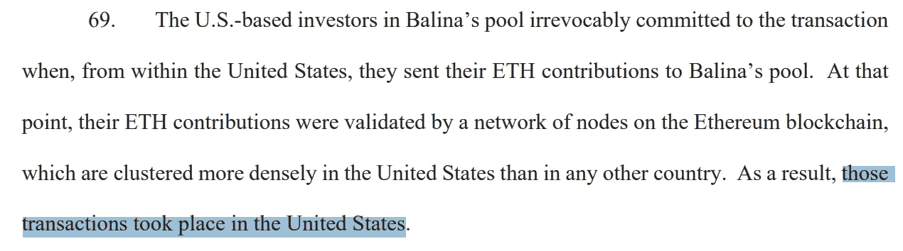

*图片来源:* [*SEC 投诉备案*](https://www.sec.gov/litigation/complaints/2022/comp-pr2022-167.pdf)

为什么证交会要强调这一点？充分利用监管加密空间，将整个以太坊网络视为美国证券交易所，就像纽约证券交易所或纳斯达克一样，将节点视为经纪自营商。尽管这种法律框架还没有法律效力，但它确实为这个方向指明了一条道路。

以太坊变成股权证明后，Gensler 还[指出](https://www.wsj.com/articles/ethers-new-staking-model-could-draw-sec-attention-11663266224)股权可能等同于持股。比如，抵押资产以获得回报，以此作为抵押。当然，因为以太坊占了 DeFi 生态系统的 57 %, Gensler 正在为整个加密领域撒下一张网。

虽然这看起来有些过火，但一点也不奇怪。请记住，Gensler 是前高盛银行家，作为金融业在私人银行部门和其监管者政府之间旋转门的参与者而受到普遍批评。这个私人银行领域的公司是否将数字资产视为对其业务的威胁？

杰米戴蒙(Jamie Dimon)周三澄清了这种情绪。作为世界上最大的商业银行摩根大通的首席执行官，他[说](https://twitter.com/crypto/status/1572696812468768775)“*加密令牌……是分散的庞氏骗局*”。更能说明问题的是，银行和国会之间旋转门的概念显然是最高权力机构的一个随意的笑料。

尽管 BTC 矿商也集中在美国，但重新定位的以太坊如今陷入了更深的脆弱性困境。通过云计算，比特币基于 ASIC 的电力开采是非常无利可图的，但对于 staked Ethereum 来说，情况并非如此。

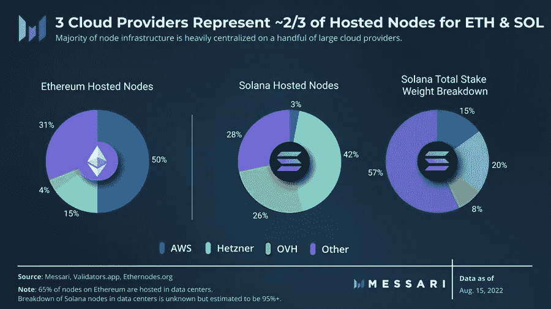

即使在合并之后，亚马逊网络服务(AWS)仍然托管着超过一半的以太坊节点。图像功劳: [*梅萨里*](https://twitter.com/MessariCrypto/status/1560068983390318594) *。*

这就是刚刚被欧洲央行(ECB)选中为数字欧元建立前端的亚马逊。

考虑到所有的事情，看起来所有的弱点和漏洞都会被仔细检查。最终，我们可能拥有数字资产，但在什么条件下？

[**享受 5MF？点击转发给三个朋友。**](mailto:info@tokenist.com?subject=Check+this+out+&body=I%E2%80%99ve+been+reading+Five+Minute+Finance,+and+I+know+you%E2%80%99d+enjoy+it+too.+It%E2%80%99s+a+weekly+email+that+covers+the+most+important+trends+in+finance.+I+learn+something+new+every+time+I+read+it!+Check+it+out+here:+https://tokenist.com/newsletter/?utm_source=email_gr_btn)

# 合并后以太坊是怎么回事？

*   卖新闻事件:以太坊暴跌和叉火大甩卖 **(** [**链接**](https://arcane.no/research/the-sell-the-news-event-ethereum-plunge-and-fork-fire-sale) **)**

# 以太坊比比特币更具通缩性

像所有市场一样，以太坊无法承受美联储的大幅加息。合并宣传在成功完成前一周就失去了动力，投资者持续外流。

合并后，ETH 下跌了 16%,目前的价格仅略高于 1300 美元。但是，ETH 的基本原则发生了很大的变化。首先，你知道现在 ETH 的通货膨胀比比特币小吗？

虽然比特币有最大硬币上限，而以太网没有，但流通供应动态现在已经转向有利于以太坊。自合并以来，ETH 的年通胀率为+0.2%，而比特币为+1.72%。除了减少-99%的能源，这是 PoS 的另一个附带好处，因为发布 ETH 奖励块所需的计算能力更少。

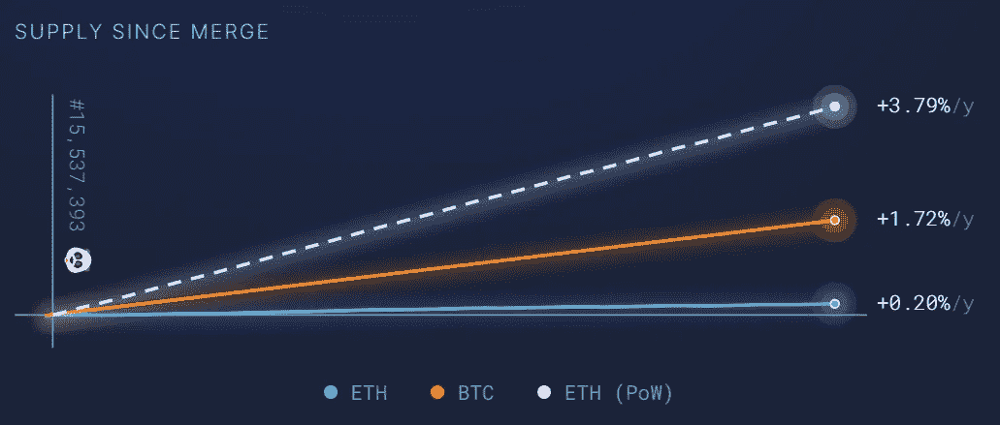

果然不出所料，合并后，ETH 的发行量减少了 90%。图像来源: [*超声波。*金钱](https://ultrasound.money/)

通过减半，比特币应该会在 2032 年达到以太坊目前的通胀水平。

这种情况增加了以太坊的长期看涨理由。毕竟，数以百计的贷款和 NFT dapp 使得以太坊在日常生活中被更多地使用，施加了额外的反通缩压力。

这还没有考虑到以太坊的下一次升级 Surge，它通过分片来扩展它的主网。与此同时，以太坊的第二层可扩展性解决方案，如 Polygon、Arbitrum 和 optimistry，提供了可以忽略不计的费用，比大多数以太坊替代品锁定了更多的总价值(TVL)。

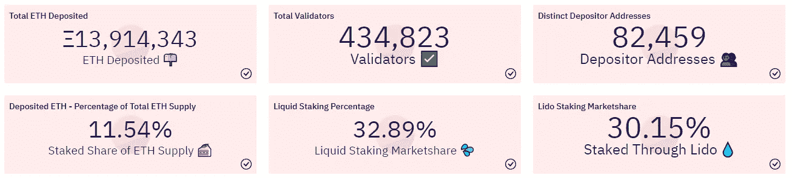

仅以太坊 11.54%的锁定 ETH(价值 189 亿美元)就超过了 Cardano、Solana、TRON、Avalanche、Cosmos 和其他以太坊竞争对手的市值。图片来源: [*沙丘分析*](https://dune.com/hildobby/ETH2-Deposits)

切分后，以太坊的吞吐量将从 14tps 增加到 10 万 tps，很有可能以太坊会通缩，增加每个 ETH 的稀缺性。

# NFT 死了吗？Reddit 上没有

*   当 Reddit 头像 NFT 飙升至 5000 美元 **(** [**链接**](https://beincrypto.com/reddit-avatar-nfts-raise-eyebrows-as-they-rocket-to-5k/) **)**

# Reddit 的 4.3 亿月活跃用户会重振 NFT 市场吗？

尽管 NFT 一直在下降，回到了 2021 年 7 月的交易水平，但仍有大量热心者。事实上，现在活跃的交易者比以前多了，在一定程度上弥补了熊市的影响。

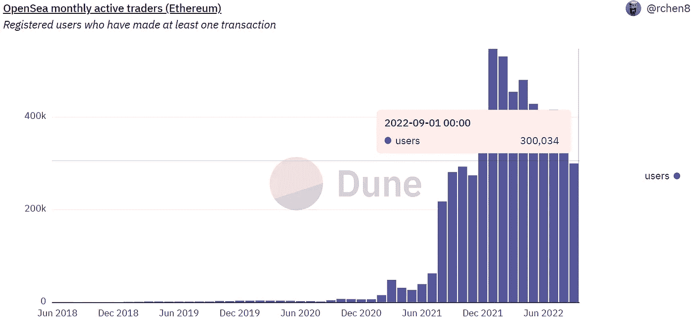

尽管月度成交量有所下降，但投机性的 NFT 钩子却牢牢地扎了下来。图片来源: [*沙丘分析*](https://dune.com/queries/37674/74643)

从这个池子里，我们看到了 NFT 的适度复苏。Reddit 主题头像被称为 Senses，每个售价 4 ETH，约合 5300 美元。Reddit 用户[罗乔姆](https://www.reddit.com/user/Rojom/)在 Reddit 官方收藏头像创建程序下创建了它们。你可以判断它们的艺术价值。

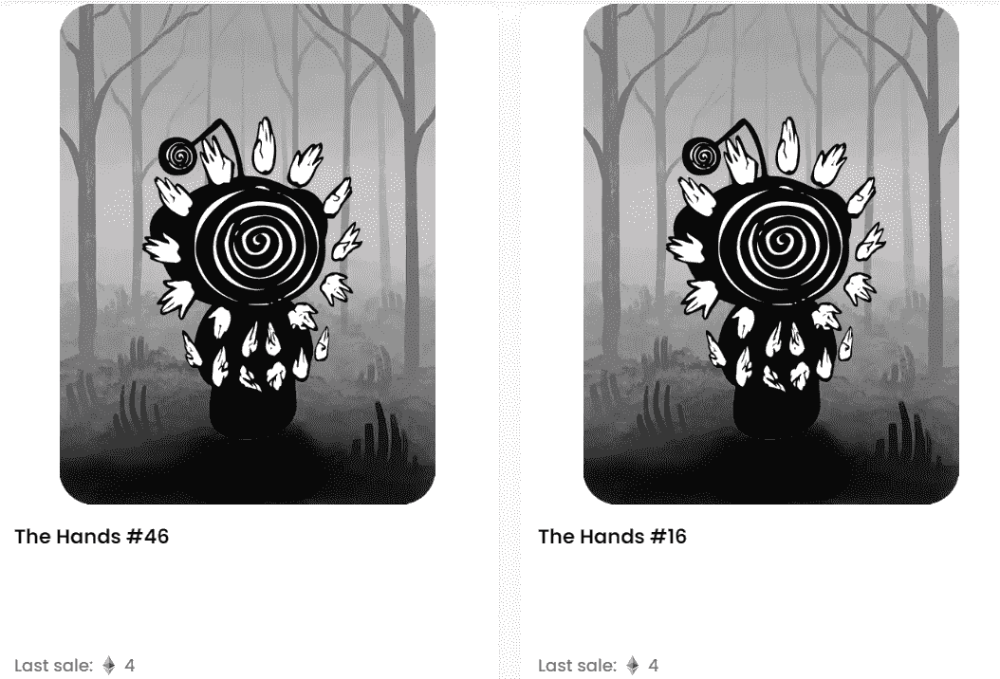

通过以 4 ETH 的价格出售，第一手#46 的所有者获得了 166%的利润。图片来源: [*OpenSea*](https://opensea.io/collection/the-senses-x-reddit-collectible-avatars?search[query]=hands&search[sortAscending]=false&search[sortBy]=LAST_SALE_DATE)

整个 Senses x Reddit 可收藏头像由 1，300 个 NFT 组成，平均底价为 2.75 ETH。有趣的是，该系列有 90%的独特所有者，这表明 NFT 翻转意图低。Rojom 从每笔销售中获得 2.5%的分成，总销售额为 59.6 ETH，约合 8 万美元。

同样值得注意的是，Reddit 用户倾向于嘲笑 NFTs 的概念。这种态度甚至出现在 r/加密货币上，因此这可能是趋势逆转的信号。

*“想到在这些之前，这个 sub[-Reddit]对数字资产恨之入骨，简直是疯了，”*

在 Meta 推出其 Instagram 头像后，我们可以期待看到无处不在的 NFT 头像，以独特的方式将用户的在线身份与他们的钱包和内容绑定在一起。即使 Meta/Reddit/Twitter 用户群中的一小部分接受了 NFTs，流入量也将是巨大的。根据 Grand View Research 的研究，到 2030 年，NFT 市场应该达到 2000 亿美元。

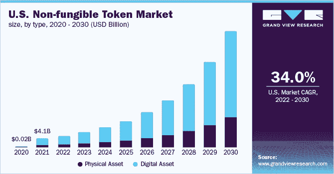

*形象功劳:*[大观研究](https://www.grandviewresearch.com/industry-analysis/non-fungible-token-market-report)

在 NFT 驱动的“玩赚”(P2E)游戏推出后，这种增长甚至可能会超出预期。宇迦实验室的 Otherside(猿)，Decimated (DIO)和 Elumia Crown (ELU)只是游戏体验方面的一些新兴竞争者。然而，由于这些尚未发布，它们的真实价值不得而知。

# 报道:证券交易委员会不会禁止 PFOF

*   券商跳票 SEC 叫停 PFOF 交易 **(** [**链接**](https://www.reuters.com/business/finance/brokerages-jump-report-sec-stops-short-banning-pfof-deals-2022-09-22/) **)**

# PFOF 新闻发布后，罗宾汉短暂反弹

订单流支付(PFOF)一直是罗宾汉这样的经纪人的谋生手段。为了抵消零成本股票交易的影响，经纪商通过发送交易订单来与做市商达成交易。

显然，这引入了道德风险，正如我们在 GME/AMC 卖空交易限制中看到的那样。有一段时间，PFOF 模式似乎因道德风险太大而难以为继，但这种情况不会再继续下去了。美国证券交易委员会呼吁不要禁止它。

相反，证券交易委员会正着手通过提高 PFOF 的竞争力来减少它在道德上的污点。为此，SEC 将列出费用、回扣以及执行的最佳方式。所有这些都有望在未来几个月内得到澄清。

尽管新的促进竞争的规则会降低 PFOF 的利润，但这比禁令要好。罗宾汉今年尤其受到 PFOF 禁令传言的沉重打击，年初至今累计下跌了 47%。甚至在 GME/AMC 资金短缺之前，SEC 就因罗宾汉未能披露 PFOF 的收入而对其处以 6500 万美元的罚款。

去年，Robinhood [报告](https://s28.q4cdn.com/948876185/files/doc_financials/2021/ar/HOOD-2021-Annual-Report.pdf)“我们的*大部分收入是基于交易的(包括 PFOF)* 。据信，PFOF 约占这一数字的 75%，所以难怪胡德听到这一消息后出现短暂反弹。有趣的是，做市商 Virtu Financial (VIRT)维持了涨势，但不久后 HOOD 暴跌。

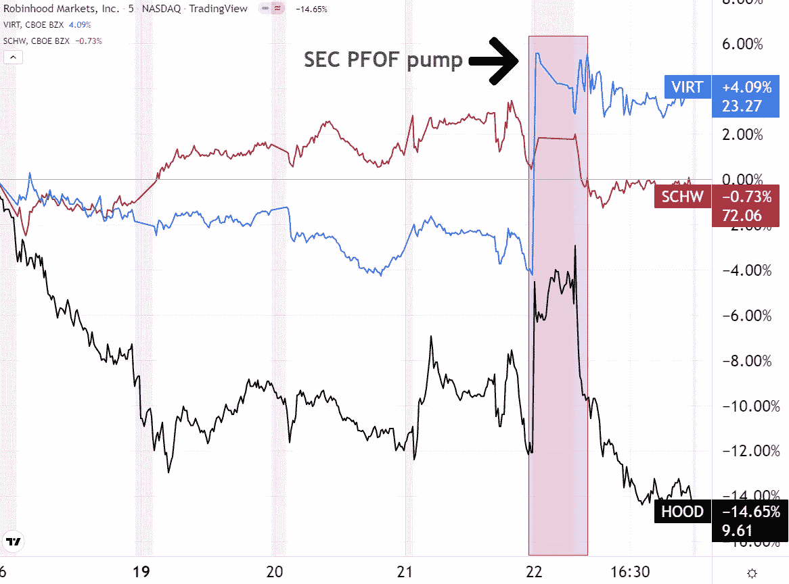

*在上涨 9%后，胡德失去了所有的收益，跌至三周低点。更加多元化的查尔斯·施瓦布(SCHW)几乎没有变化。图片信用:* [*交易视图*](https://www.tradingview.com/)

当谈到预期的收入增长时，市场似乎更喜欢做市商而不是券商。这是因为现在经纪业的竞争更加激烈了，热门经纪公司 6 月份在 PFOF 的收入就证明了这一点。查尔斯·施瓦布和 E*Trade 在 PFOF 的收入都超过了罗宾汉:

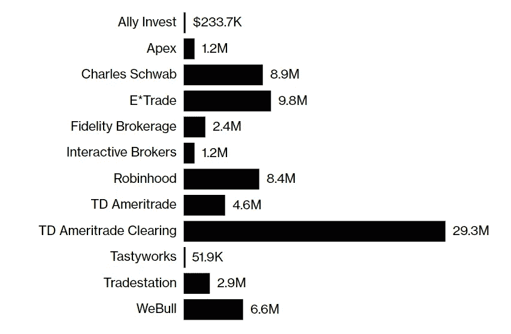

*2022 年 6 月股票经纪人 PFOF 订单收益。图片来源:* [*彭博*](https://www.bloomberg.com/news/articles/2022-09-22/sec-poised-to-let-wall-street-keep-payment-for-order-flow-deals) *。*

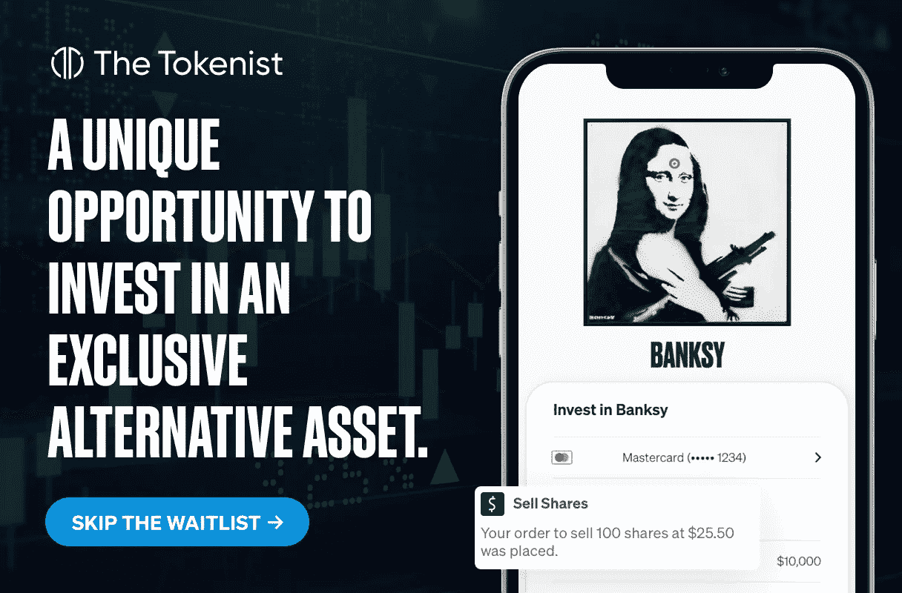

# 今日机会:
28.4%平均年化收益。

在 Tokenist，我们相信一件事:知识就是力量。

在过去的 5 年里，我们进行了细致的研究，所以你不必。我们努力让投资者做出更好的财务决策。我们的团队已经测试了产品，与世界各地的投资者进行了交流，并获得了哪些产品有效、哪些产品无效的第一手经验。从数字媒体咨询，到加密资产营销和私人市场，我们已经竭尽全力。

我们脚踏实地的方法使我们能够为您打破神秘而低效的金融世界的壁垒。

这就是为什么我们如此兴奋地分享我们的最新发现…

一种具有诱人回报的另类资产类别，从 1995 年到 2020 年超过 S&P 164%，几个世纪以来一直被用于对冲通货膨胀和下行风险。

我们在谈论艺术。

毕竟，杰夫·贝索斯、比尔·盖茨和奥普拉·温弗瑞已经在艺术上投入了数亿美元。在他们之前，洛克菲勒家族积累了有史以来世界上最有价值的艺术收藏——惊人的 8 . 35 亿美元。

虽然这很不可思议，但艺术品的价值只会越来越大。德勤会计师事务所估计，到 2026 年，艺术品持有的财富将增加 1 万亿美元。但尽管出现了新的繁荣，却没有多少人知道如何获得这种专为超级富豪保留的“不可触及”的资产类别。

我们最近发现了一个鲜为人知的……却非常聪明的方法……让普通投资者在不倾家荡产的情况下用蓝筹股艺术品进行多样化投资。这就是为什么我们忍不住与投资艺术的顶级会员 [Masterworks](https://www.masterworks.io/?utm_source=Tokenist&utm_medium=swap&utm_campaign=9-23-2022&utm_term=Tokenist+Readers&utm_content=Alternative+Investing) 合作。他们以真正的象征性方式，将这个历史上效率低下的市场民主化，并向所有投资者开放。

# 你为什么要用艺术来分散你的投资组合？

*   从 1995 年到 2021 年，当代艺术品价格比 S&P 高出 131%
*   86%的财富经理认为艺术品在投资组合中有一席之地
*   根据 Masterworks all art index 的数据，艺术品平均每年升值 33%，上一次通胀达到如此高的水平
*   根据花旗的数据，在所有主要资产类别中，与发达国家股票的相关性最低
*   高度发展的 1.7 万亿美元资产类别，其业绩记录跨越几个世纪

[**跳过等候名单**](https://www.masterworks.io/?utm_source=Tokenist&utm_medium=swap&utm_campaign=9-23-2022&utm_term=Tokenist+Readers&utm_content=Alternative+Investing)

过去的表现并不能保证未来的结果，投资艺术品和投资股票、债券和其他资产类别有很大的不同，见[重要披露。](https://www.google.com/url?q=https://www.google.com/url?q%3Dhttps://www.masterworks.io/about/disclosure%26source%3Dgmail-html%26ust%3D1662737444927000%26usg%3DAOvVaw2hb5vsDzkGLM1uAFHEsCbk&source=gmail-html&ust=1663890181891000&usg=AOvVaw0KGwVmNXI-BIRkUwBLcuss)

# 杰作集锦:

*   总资产超过 5.85 亿美元，自 2019 年开始运营
*   推出了 130 多种 A+ (SEC 认证)产品
*   平均 31.2%的净回报率超过 4 存在
*   在《福布斯》、《华尔街日报》、《福克斯商业》和《巴伦周刊》上刊登
*   产品在不到 15 分钟的时间内销售一空

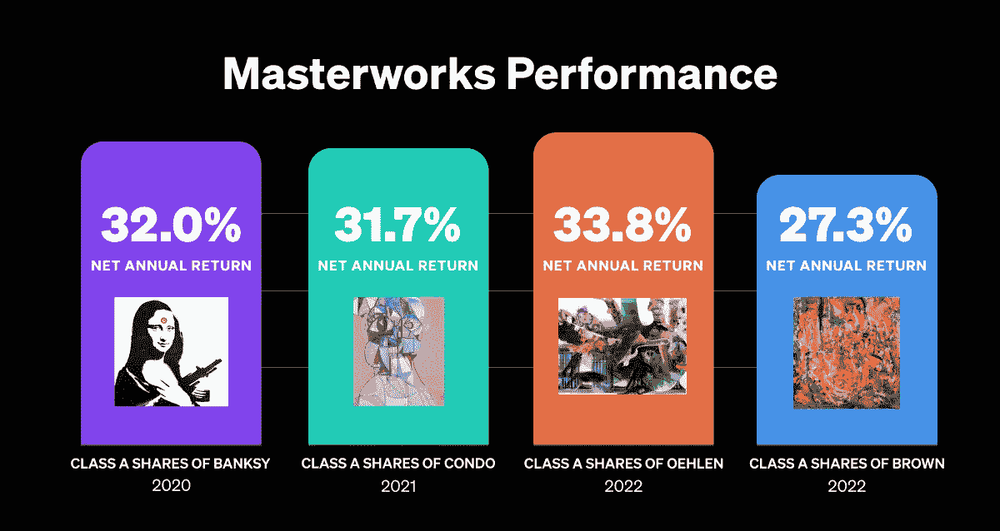

有这样的表现，难怪有超过 50 万人注册投资。作为官方合作伙伴，您可以通过我们的[特殊合作伙伴链接](https://www.masterworks.io/?utm_source=Tokenist&utm_medium=swap&utm_campaign=9-23-2022&utm_term=Tokenist+Readers&utm_content=Alternative+Investing)跳到最前面。

[**跳过等候名单**](https://www.masterworks.io/?utm_source=Tokenist&utm_medium=swap&utm_campaign=9-23-2022&utm_term=Tokenist+Readers&utm_content=Alternative+Investing)

根据 1933 年证券法下的条例 A，Masterworks 正在“试水”。只有在向美国证券交易委员会(SEC)提交发行声明，并且 SEC 对发行声明进行了“资格审查”之后，Masterworks 才能进行销售。没有钱或其他考虑是征求，如果发送响应，将不会被接受。在证券交易委员会批准发行人向证券交易委员会提交的发行声明之前，不得接受任何购买证券的要约，也不得收取任何部分的购买价格。在批准日期之后发出接受通知之前，任何此类要约均可随时撤回或撤销，无需承担任何义务或承诺。表示感兴趣不涉及任何义务或承诺。投资前，您必须阅读提交给 SEC 的发行文件，以及在[www.masterworks.io/disclaimer](https://www.google.com/url?q=https://www.google.com/url?q%3Dhttp://www.masterworks.io/disclaimer%26source%3Dgmail-html%26ust%3D1662737444927000%26usg%3DAOvVaw0yI-iLm2SemZ_306z8HKG-&source=gmail-html&ust=1663890181891000&usg=AOvVaw0-IW1pypQfGiLwm_5xGHWo)可获得的其他信息。

自成立以来，大师作品已经售出了该系列的四幅画作。所有销售都是扣除所有费用和开支后的净值。在某些情况下，为了股东的利益，大师作品可能会让出与画作销售相关的费用和/或利润分成。如果向发行人收取 Masterworks 有权获得的所有费用和利润分成，净内部收益率将为 31.2%。

以上信息由 Tokenist 的合作伙伴 Masterworks 赞助。

# 本周推特

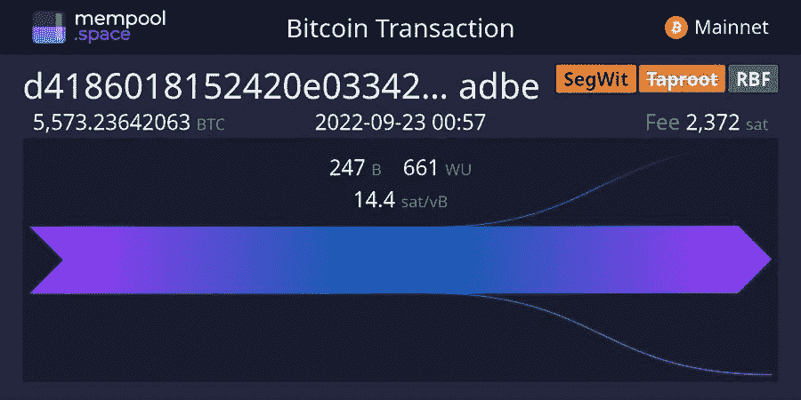

> 100，000，000 美元刚刚被送到 46

[**@ documenting BC**](https://twitter.com/DocumentingBTC/status/1573117079171076098)

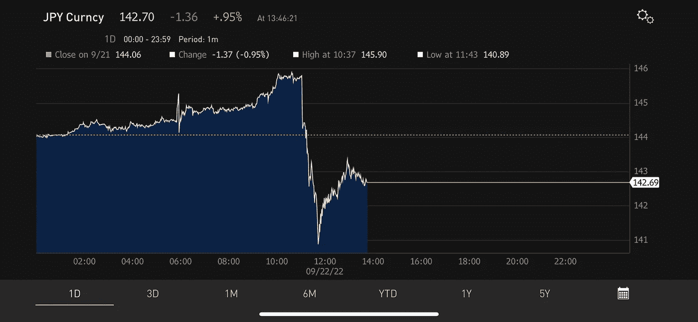

> 这是非常重要的
> 
> #日元走强，此前日本政府自 1998 年以来首次干预汇市，抛售#美元支撑日元。
> 
> #奶昔理论正在全面展开
> 
> #USD 破坏球。期待更多央行也这样做！

[**@ mnicoletos**](https://twitter.com/mnicoletos/status/1572901200206639104)

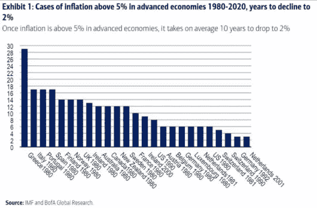

> 一旦通胀率超过 5%，平均需要 10 年时间才能再次降至 2%。
> 
> 这一次会不同吗？

[**@ AndreasSteno**](https://twitter.com/AndreasSteno/status/1573216607689662464)

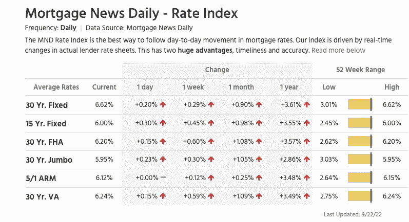

> 30 年期固定利率抵押贷款今天又上涨了 20 个基点，目前为 6.62%。

[**@ DylanLeClair _**](https://twitter.com/DylanLeClair_/status/1573006271317528576)

> 突破:欧元 20 年来首次跌破 0.98 美元。

[**@ WatcherGuru**](https://twitter.com/WatcherGuru/status/1573207848166866945)

# 加入五分钟金融时事通讯。

[Sign up here — it’s free.](https://tokenist.com/newsletter/)

[t.me/thetokenist](http://t.me/thetokenist)

twitter.com/thetokenist

> 交易新手？试试[密码交易机器人](/coinmonks/crypto-trading-bot-c2ffce8acb2a)或[复制交易](/coinmonks/top-10-crypto-copy-trading-platforms-for-beginners-d0c37c7d698c)