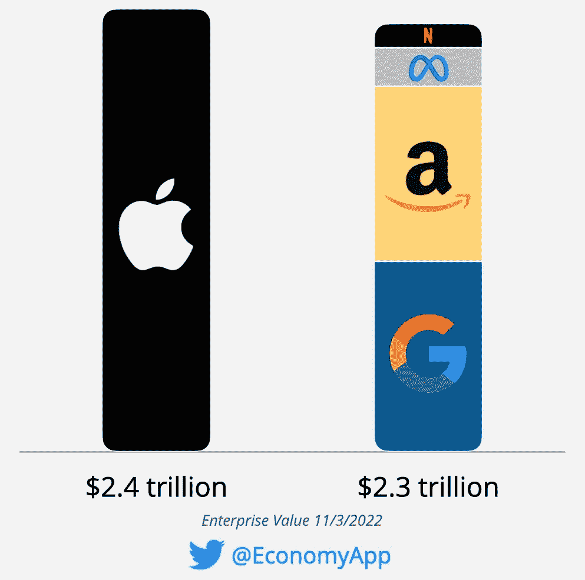

# 五分钟金融:鲍威尔的鹰派信号，摩根大通使用 DEFI，WEB3 在上升

> 原文：<https://medium.com/coinmonks/five-minute-finance-powells-hawkish-signals-jpmorgan-uses-defi-web3-on-the-rise-fdc0ef1a2cbe?source=collection_archive---------29----------------------->

ICYMI:获取 Tokenist 的[每日简讯](https://app.getresponse.com/site2/3960472a3039e40cfa0f07672c785d18/?u=QcLhh&webforms_id=zRenm)，永远不要错过宏观金融的突破性发展。[在这里报名](https://app.getresponse.com/site2/3960472a3039e40cfa0f07672c785d18/?u=QcLhh&webforms_id=zRenm)(免费)，你将是第一个*知道最新市场动向的*。

# 5 分钟的金融时事通讯——解释发生了什么，为什么。

# 让我们看看这周发生了什么:

*   鲍威尔发出了即将到来的明确信号
*   Altcoin 波动性上升
*   尽管遭遇了熊市，但 Web3 发展势头迅猛
*   摩根大通+新加坡央行+ DeFi =？
*   支付会是 Twitter 的第一次大整合吗？

# 美联储从鹰派转向更鹰派

*   美联储 2022 年第 6 次加息 75 个基点 **(** [**链接**](https://tokenist.com/fed-raises-interest-rates-by-75-bps-in-2022s-6th-hike/) **)**

# 喂鹰吞食鸽子

在很多方面，上升的必然下降。联邦公开市场委员会(FOMC)周三完成了第七次加息，将利率上调 75 个基点，至 4%。这完全在意料之中，也在价格之中。然而，市场的反应是在股票市场上抹去了 8000 多亿美元。

在本周的 FOMC 会议后，标准普尔 500 指数(SPX)和纳斯达克指数(NDX)明显下跌。图片信用: [*交易视图*](https://www.tradingview.com/)

为什么？因为美联储主席杰罗姆·鲍威尔所说的话。此前，市场猜测“鸽派”支点将在 12 月出现，本应表现为加息减速 50 个基点，而不是 75 个基点。鲍威尔的信息现在异常明确，这是不可能的。

“自我们上次会议以来的数据表明，联邦基金的最终利率将高于此前的预期(> 4.63%)，我们将坚持到底，直到完成任务。‘

鲍威尔所说的“任务完成”指的是价格稳定，这比包括衰退在内的任何事情都重要。进一步加息不会减少，但恰恰相反，“目标范围内的持续增加将是适当的”，以将核心通胀率降至最初的 2%目标(现在是 6.63%，但自 8 月以来一直呈上升趋势)。

鲍威尔明确表示，鉴于在衰退和通胀之间的选择，美联储的货币工具更有能力应对前者。

“如果我们过度收紧，我们可以使用货币政策工具来支持经济，但如果我们收紧得不够，通胀就会变得根深蒂固。”

换句话说，出于美联储的双重使命——价格稳定和就业——后者将不得不暂停。任何导致购买力下降的因素都可以让经济降温。一旦这种力量下降，需求就会减少，导致价格被抑制。

*“我不知道财政阻力有多大，它们也没有以我们认为的方式在限制支出方面表现出来。”*

鲍威尔也将家庭储蓄包括在这个指标中，他说人们仍然有太多的钱“继续消费”。在图表中，鲍威尔正在逆转货币时钟，收回 2020 年初美联储向市场注入廉价资本时给出的数据。

*美联储的双重使命现在表现为减少支出的双重压力——储蓄枯竭和借贷成本上升。图片来源:朗伯德·欧迪*

这种货币压力会持续多久？如果我们按照 SPX 顶部和底部之间的区间来看，2000 年的网络崩溃持续了 900 天，而 SPX 在 2008 年大衰退后用了 500 天才达到新的顶部。

对今天的我们来说，大多数人都认为我们还不到一岁。

# 比特币波动性升温，但替代比特币波动性上升

*   随着 DOGE 在 10 月份飙升 124%，加密市场再次变得不稳定 **(** [**链接**](https://tokenist.com/crypto-markets-become-volatile-again-as-doge-surged-124-in-october/) **)**
*   Meta 的 NFT 市场将使用该协议进行存储:Arweave 是什么？ **(** [**链接**](https://tokenist.com/metas-nft-marketplace-will-use-this-protocol-for-storage-what-is-arweave/) **)**

# 熊市对早期的小盘股没有任何影响

虽然股票在鲍威尔的打击下下跌，但比特币几乎没有变化。这是自 8 月下旬以来横盘趋势的延续。占加密货币总市值 40%的主要加密货币似乎已经陷入长期底部。在比特币的保护下，替代币变得更加不稳定，结果好坏参半。

可以预见的是，在埃隆·马斯克接管 Twitter 之后，他最喜欢的 memecoin DOGE 的价值翻了一番，从周六的 0.08 美元涨到了周二的 0.16 美元。到目前为止，马斯克的三家公司特斯拉、SpaceX 和 [Boring Company](https://twitter.com/elonmusk/status/1579972303647301632) 接受为 merch 支付 DOGE 费用，因此预计 Twitter 新的 8 美元订阅模式也将如此。

正如大硬币往往像磁铁一样吸引小硬币一样，Dogecoin 抓住了它的投机小狗柴犬(SHIB)的尾巴，在一周内上涨了+10%。在 memecoins 之外，负责以太坊扩展的协议，使其使用起来更快更便宜，是表现最好的协议之一。

*得益于其丰富的商业合作伙伴关系，从 Adobe 和阿迪达斯到 Meta 和摩根大通，Polygon (MATIC)本周上涨了+23%，表现优于以太坊(ETH)和 memecoins。图片来源:* [*交易视图*](https://www.tradingview.com/)

Meta 最近选择了 Arweave (AR)来帮助 NFT 存储，这使得 AR 的增长率接近 40%。作为为 Web3 设计的扩展解决方案，Arweave 使用其令牌 AR 来货币化分散的文件存储。拥有备用存储的个人可以加入并成为云提供商。

除了 optimistry(OP)和 Polygon (MATIC)之外，另一个以太坊扩展解决方案在过去几年中一直在崛起——Arbitrum。Arbitrum 已经整合了顶级交易所——Crypto.com 币安、FTX、OKX、Huobi——随着网络使用的增加，其小额费用会变得更低。这使得它非常适合扩展，每秒能够处理 40，000 个事务(以太坊目前大约有 14 tps)。

在 Arbitrum 令牌空投的猜测中，Arbitrum 的交易量是以太坊的 62%。 [*德尔福数字*](https://twitter.com/Delphi_Digital/status/1588015634138513412)

由于围绕网络和生态系统的大量更新，Arbitrum 活动最近[激增了 125%](https://tokenist.com/arbitrum-activity-surges-by-125-as-airdrop-speculation-continues/) 。

比特币的波动性显然很低，美联储的鹰派立场可能已经抹去了数千亿美元的价值——但这并没有阻止替代比特币。

[**享受 5MF？点击转发给三个朋友。**](mailto:info@tokenist.com?subject=Check+this+out+&body=I%E2%80%99ve+been+reading+Five+Minute+Finance,+and+I+know+you%E2%80%99d+enjoy+it+too.+It%E2%80%99s+a+weekly+email+that+covers+the+most+important+trends+in+finance.+I+learn+something+new+every+time+I+read+it!+Check+it+out+here:+https://tokenist.com/newsletter/?utm_source=email_gr_btn)

# 尽管市场低迷，Web3 活动激增

*   以太坊智能合约部署 2022 年 9 月同比增长 160%**(**[**)链接**](https://tokenist.com/ethereum-smart-contract-deployment-up-160-yoy-in-september-2022/) **)**
*   Reddit NFTs 的成交量超过 860 万美元，基于多边形的 NFT**(**[**链接**](https://tokenist.com/reddit-nfts-surpass-8-6m-in-volume-massive-uptick-for-polygon-based-nfts/) **)**

# Web3 说它会一直存在下去

在熊市中，很难看到隧道尽头的亮光。但是如果隧道本身被黑暗中的活动照亮了呢？这当然是“web3”现在的样子。

它的中心是以太坊，锁定了 315.2 亿美元的总价值(TVL)和近 58%的市场份额。Alchemy 最近一份关于 2022 年第三季度 Web3 活动的报告显示，开发者活动全面增加:每周下载、智能合同部署和软件库部署。

*去年 9 月，开发商部署的智能合同同比增长 160%,创下月度新高。图片来源:* [*炼金术见解*](https://www.alchemy.com/blog/web3-developer-report-q3-2022)

总体而言，与 2018 年相比，dApps 的数量增加了 1150%，从 1000 个增加到 12500 个。现在，2500 个 dApps 每天至少有一个活跃用户。

即将到来的 Web3 基础设施的主要目标是区块链游戏。你会问，为什么专注于游戏？

嗯，这显然是千禧一代和 Z 世代的兴趣所在:

*根据一项* [*AT & T 调查*](https://www.attsavings.com/more/gaming-internet#gaming-cost) *显示，年轻一代是一生中购买游戏最多的人。*

区块链游戏直接简化了这种货币化，游戏中的资产本身变得可以交易，无论是游戏中的加密货币还是 NFT。

即使没有游戏，NFT 仍然在世界最大的论坛 Reddit 上作为独特的头像出现。这在很大程度上要归功于以太坊的缩放解决方案，比如 Polygon。

到目前为止，通过 Reddit 上的 NFT 销售，累计交易价值超过 800 万美元，Reddit 是一个每天有 5400 万活跃用户的社交平台。

但老牌科技巨头也想分一杯羹。

微软最近资助了韩国 Web3 团队 Wemade 总计 1480 万美元。虽然与微软 680 亿美元的收购暴雪相比，这只是小钱，但这无疑是更大趋势的一部分。

此前，微软帮助 ConsenSys 筹集了 4.5 亿美元来开发 MetaMask wallet，它现在已经成为所有 Web3 的门户。

然而，我们仍然处于 Web3 的早期阶段，尤其是在游戏方面。也许最重要的是，游戏玩家也是密码原生者并不是必然的。

根据 [Coda 实验室的调查](https://codaplatform.com/web3-user-study/)，重度加密用户是游戏玩家的 5 倍，但是 81%的游戏玩家很少使用加密，或者根本不使用。

# 特拉菲和迪菲:边界在哪里？

*   摩根大通使用公共区块链 **(** [**链接**](https://www.bnnbloomberg.ca/jpmorgan-executes-its-first-defi-trade-using-public-blockchain-1.1840877#:~:text=(Bloomberg)%20%2D%2D%20JPMorgan%20Chase%20%26,underlying%20the%20world%20of%20cryptocurrencies.) **)** 执行其首个 DeFi 交易
*   新加坡央行试验用 DeFi 来改造资本和债券市场 **(** [**链接**](https://tokenist.com/singapores-central-bank-experiments-with-defi-to-transform-capital-and-bond-markets/) **)**

# 自动化金融(AuFi)作为终极元金融(MeFi)？

根据《美联储》,摩根大通是美国最大的银行，合并资产为 3.38 万亿美元(T21 ),是世界第五大银行，仅次于四家中国国有银行。

相比之下，以[合并](https://coinmarketcap.com/view/defi/)面值衡量，DeFi 的总市值为 537 亿美元，占摩根大通资产的 1.5%。

正是从这个角度，我们可以看到摩根大通利用 Polygon 执行该行第一笔实时 DeFi 交易的意义。

然而，当我们看到这笔交易涉及到新加坡央行时，事情就复杂了。

那么，到底发生了什么？

*   作为交易新加坡令牌化债券(政府债务)的一部分，这个城市国家正在测试跨货币交易。
*   摩根大通通过 SBI 数字资产控股公司将象征性的新加坡元(71，000 美元)兑换成日元。
*   该交易在以太坊的主要可扩展性网络 Polygon 上执行，使用开源 Aave 协议的调整版本。后者是最受欢迎的借贷平台之一，在 TVL 的 7 个区块链网络中有 53 亿美元。
*   Aave 的调整版本是 Aave Arc，作为许可的 KYC 协议，提供了更大的监管合规性。

从技术上讲，摩根大通的交易不涉及加密货币，但它确实涉及了令牌化资产——它展示了其在公开区块链上进行此类交易的能力。过去，银行通常会尝试在私人的、获得许可的区块链进行日间回购和跨境交易。

这就引出了一个问题，DeFi 应该被称为自动化金融(AuFi)吗？我们是在朝着那个方向前进，还是 DeFi 会像今天一样——未经许可，使用假名？

无论情况如何，这一里程碑式的交易表明，金融未来是令牌化和连锁化的。

# Twitter 成为“你口袋里的银行分行”？

*   马斯克的 Twitter-as-Payments-App 叙事得势 **(** [**链接**](https://www.pymnts.com/news/payment-methods/2022/musks-twitter-as-payments-app-narrative-gains-steam/) **)**

# Twitter 的下一次发展

现在，埃隆·马斯克拥有了 Twitter，这个世界上最有影响力的平台的机会已经成熟。从这个平台的本质来看，它的盈利方式是没有限制的。

一些想法——Twitter 用户可以:

*   纽约时报报道的[，付费直接将 DMs 发送给知名用户。](https://www.nytimes.com/2022/11/03/technology/elon-musk-twitter-money-finances.html)
*   付费观看完整长度的高质量视频，作为一个潜在的 Vine 重新启动。
*   通过付费墙定制他们的内容，尤其是长篇写作。

许多个人——其中一些人与马斯克关系密切，甚至是 Twitter 收购交易的一部分——认为这些探索自然适合加密钱包。

一周前，科技博客作者 Jane Wong 首次报道了 Twitter 正在探索自己的钱包。考虑到参与的玩家，我们可以得到一个很好的想法。杰克·多西离开 Twitter，转而使用他的现金应用进行支付。但是多尔西仍然持有 Twitter 1800 万的股份(约 2.4%)，因为他拒绝套现。

埃隆·马斯克自己在创建 X.com 时就开始了他的财富之旅，该公司后来成为 PayPal。Ark Invest 创始人 [Cathie Wood](https://www.cnbc.com/2022/11/02/arks-cathie-wood-bets-elon-musk-will-turn-twitter-into-a-super-app.html) 认为，在马斯克的统治下，Twitter 将成为像微信支付一样的*超级应用。*

这个概念已经过测试，非常成功。与 WhatsApp 类似，微信是一款中文消息应用，拥有所有预期的功能，但集成了微信支付。反过来，微信很容易连接到支付宝，这是一个来自中国亚马逊的专用支付应用程序——阿里巴巴。

*形象功劳:*

*支付宝和微信支付已经垄断了中国 90%的移动支付。现在 PayPal 在美国的受欢迎程度正在下降，Elon 是否看到了新玩家进入的空间？*

*币安可能会发挥关键作用，因为它为马斯克提供了 5 亿美元来接管 Twitter。*

*CEO“CZ”赵在上一届网络峰会上就暗示过这一点，他说“*支持十几种、几百种加密货币作为支付手段非常容易。*“记住——币安已经垄断了全球加密货币市场 55%的交易量。*

# *本周推特*

**

> *意见 58*
> 
> *大约有 25 万亿美元的新兴市场债务。美元走强给这些新兴市场国家带来了压力，它们以本币盈利，但必须以更强劲的美元偿还债务。*

*[**@ horizon kinetics**](https://twitter.com/HorizonKinetics/status/1588210518006927361)*

**

> *好吧，我加了网飞$NFLX。*
> 
> *苹果比所有尖牙加起来都大。*

*[**@EconomyApp**](https://twitter.com/EconomyApp/status/1588223206661361664)*

> *突发事件:参议员托马斯·卡珀(Thomas Carper)购买了高达 11 万美元的 Ranger Equity Bear Bear ETF，HDGE，这是一只做空美国上市股票的活跃 ETF。*
> 
> *他是参议院财政委员会的成员。*
> 
> *作为一名政客，他正在积极做空美国经济。*

*[**@不寻常 _ 鲸鱼**](https://twitter.com/unusual_whales/status/1588323869634441216)*

**

> *股票卖出/买入比率昨日飙升至 2020 年 3 月以来的最高水平*

*[**@LizAnnSonders**](https://twitter.com/LizAnnSonders/status/1588183658669559808)*

> *低于上限的百分比…*
> 
> *特斯拉$TSLA: -47%*
> 
> *李汽车:李:61%*
> 
> *菲斯克 FSR:72%*
> 
> *清醒的$LCID: -76%*
> 
> *Proterra $PTRA: -80%*
> 
> *Rivian $RIVN: -82%*
> 
> *NIO $NIO: -84%*
> 
> *狮子电力公司:90%*
> 
> *支出$支出:-90%*
> 
> *卡诺戈夫:93%*
> 
> *洛兹敦汽车公司的售价:-94%*
> 
> *尼古拉·NKLA:96%*

*【T4**@ charliebilello***

# *加入五分钟金融时事通讯。*

**

*[Sign up here — it’s free.](https://tokenist.com/newsletter/)*

**

*[t.me/thetokenist](http://t.me/thetokenist)*

**

*twitter.com/thetokenist*

> *交易新手？尝试[加密交易机器人](/coinmonks/crypto-trading-bot-c2ffce8acb2a)或[复制交易](/coinmonks/top-10-crypto-copy-trading-platforms-for-beginners-d0c37c7d698c)*