# 五分钟财经:SBF 调查 LUNA CRASH，CRYPTO 的 2022 年资助记录

> 原文：<https://medium.com/coinmonks/five-minute-finance-sbf-investigated-for-luna-crash-cryptos-2022-funding-record-d55b075d1861?source=collection_archive---------10----------------------->

注册免费的每日时事通讯,永远不要错过宏观金融的突破性发展。

# 5 分钟的金融时事通讯——解释发生了什么，为什么。

# 让我们看看这周发生了什么:

*   Mazars 报告:币安储备完全抵押
*   零售业表示，它看到了底部的到来
*   SBF 面临卢娜/UST 坠毁原因的“调查”
*   国际清算银行发出超过 80 万亿美元外汇互换债务的警告
*   2022 年的加密资金可能超过 2021 年

# 币安审计看起来不错，但它真的更像是一种“评估”吗？

*   币安的比特币储备完全抵押据审计公司 Mazars **(** [**链接**](https://techcrunch.com/2022/12/07/binances-bitcoin-reserves-are-fully-collateralized-according-to-auditing-firm-mazars/) **)**

# 币安略显夸张

随着 FTX 崩溃的硝烟散去，crypto 的总市值遭受了 1770 亿美元的损失。

更重要的是，客户正在流失，因为在过去 30 天里，超过 20 万 BTC 被交易所取消交易。

与此同时，币安的责任只增不减。它现在是处理全球 75%用户交易量的超级交易所。那么审查币安的持股就非常重要了，对吗？

这发生在周三 Mazars 发布币安报告的时候。Mazars 是一家国际会计和审计公司，业务遍及 90 多个国家，拥有 44，000 多名专家。通过要求币安在其钱包中执行小额交易， [Mazars 得出结论](https://veritas.mazars.com/binance/Binance_POR_Report_7_December_2022.pdf)该交易所的资产实际上被过度抵押了。

*“在评估时，Mazars 观察到币安控制的范围内资产超过其总平台负债的 100%”*

这与币安自己的储量证明快照一致[显示 101%](https://tokenist.com/can-proof-of-reserves-really-prove-an-exchanges-solvency/) :

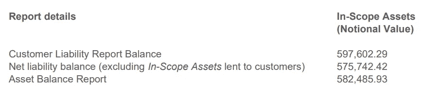

虽然这对于密码行业的稳定发展是个好消息，但有一个重要的方面值得注意。

马扎尔进行了审计程序(AUP ),客户(币安)提供了要进行的一系列测试。Mazar 作为注册会计师(CPA)执行这些测试并报告结果。

在这种情况下，这些发现对币安有利。但是，AUP 不应该与适当的财务报表审计混淆。在这种情况下，马扎尔会计划出币安的风险领域，然后收集和分析支持币安财务报表的证据。

宾夕法尼亚大学沃顿学院的会计讲师弗朗辛·麦肯纳提出了这样的担忧:

*“他们从管理层获得的列表中，对每个公钥地址的余额进行了比较。他们没有比较独立银行或托管人或存管机构的任何余额……这甚至比泰瑟公司或 USDC 公司的报告更没有价值”。*

因此，尽管 Mazars 的审查看起来更像是一个总体评估，而不是一个防弹审计，但似乎目前币安没有任何危险信号。考虑到集中式交易所目前不稳定的立足点，这对于加密市场来说仍然是一个非常好的迹象。

# 调查:零售业如何为触底做准备

*   VIX 股市上涨 2%，美国股市大幅下跌，波动加剧 **(** [**链接**](https://tokenist.com/vix-up-2-as-us-equities-tumble-amid-increased-volatility/) **)**

# 经济形势走向衰退，散户投资者做好准备

经济指标正朝着衰退的方向调整。

衡量投资者情绪的波动指数(VIX)周三上涨+2%，达到两周多以来的最高点。更高的 VIX 百分比意味着更大的波动性——以及投资者的不确定性。

关系非常简单:当 VIX 上涨时，市场往往会下跌:

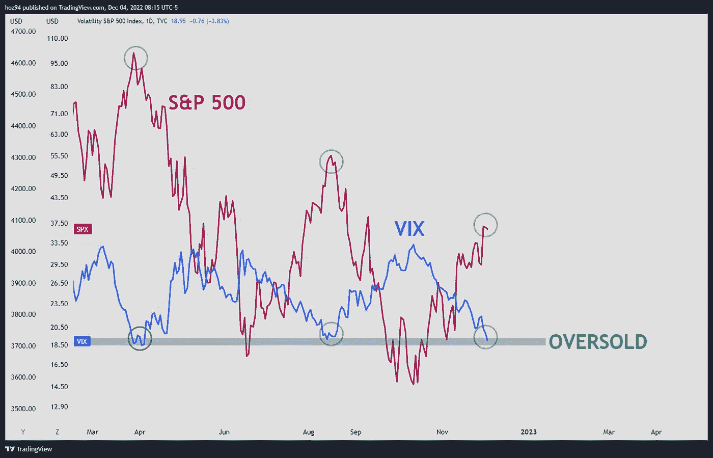

*今年，VIX 和 SPX 之间的关系几乎完全相反。当 SPX 表现不佳时，VIX 就会上涨，反之亦然。图片来源:交易视图(*[*MFHoz*](https://twitter.com/MFHoz/status/1599392540050206720)*)*

因为 VIX 是通过期权价格计算的，VIX 下降通常表明投资者对未来市场方向相对有信心。像时钟一样，标准普尔 500 本周下跌了 1.87%，而 VIX 上涨了 2%。此外，西德克萨斯中质原油(WTI)今年以来下跌了 4.86%，为今年的最低水平，为每桶 72.14 美元。

石油需求的减少往往是经济放缓、即将陷入衰退的迹象。消费者和企业都减少了对需要石油的商品和服务的消费。

雪上加霜的是，世界上最大的资产管理公司贝莱德(BlackRock)警告(T1)要“为一场前所未有的衰退做好准备”:

*“简单地‘逢低买入’的老把戏不适用于这种权衡更激烈、宏观波动更大的体制。我们认为，不会再出现像过去十年那样的股市和债市联合牛市。”*

记住这一点是明智的，考虑到美联储本身[在 2020 年 3 月市场崩盘最严重的时候雇佣了贝莱德](https://www.nytimes.com/2020/03/27/business/coronavirus-blackrock-federal-reserve.html)。

这表明股市尚未消化衰退的影响。这也意味着，美联储的行动不会像过去那样有太大的影响力，即使是在减少加息等积极行动方面。

如果你问散户，他们认为股市明年会见底。根据最近的一项调查，只有 1%的人计划在 2023 年卖掉他们的投资。

这项调查涉及全球 2，300 名散户投资者。三分之一的调查参与者计划在 2023 年比今年投资更多，而个股仍然是最受欢迎的。

72%的受访者计划投资苹果、微软、谷歌、脸书和网飞。

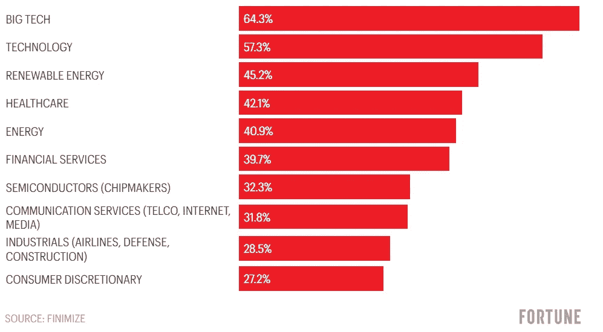

*根据最近的零售投资者调查，2023 年最有可能的投资类别如下。图片来源:* [*财富*](https://fortune.com/2022/12/08/retail-investor-top-stock-picks-2023-finimize-survey/)

考虑到今年截至 10 月，大型科技股损失了约 4000 亿美元，这是对底部信心的有力支持。

指数基金的受欢迎程度紧随个股，为 60%，而 crypto 仍然领先于房地产，为 38.2%对 34.8%。

可以预见的是，2023 年现金领先于债券，散户投资者的偏好为 28.5%对 24.2%。

根据最新的路透社民意调查，60%的经济学家认为衰退将在 2023 年连续两个季度发生。从好的方面来看，48 位经济学家中有 35 位表示，任何衰退都将是短暂而轻微的。

只有时间才能证明贝莱德是否夸大了其衰退前景。

# SBF 应该为…特拉(露娜)的崩溃负责吗？

*   FTX 创始人山姆·班克曼-弗里德据说面临市场操纵质询 **(** [**)链接**](https://www.nytimes.com/2022/12/07/business/ftx-sbf-crypto-market-investigation.html) **)**

# 新的阿拉米达指控导致调查

三种力量共同导致 2022 年加密市场总市值缩水 60%，从 2.2 万亿美元降至 0.8 万亿美元。

美联储加息是引发资产价格整体受抑的首要因素。反过来，这结束了*超级周期*的传言和 crypto 的收益率实验。

随着投资者逃离 Terra 的锚协议(提供 18%以上的 APY)，这导致 Terra (LUNA)及其相关的 TerraUSD (UST)算法稳定币(stablecoin)双双下跌。后者依赖于 LUNA 的价格保持与美元挂钩。当露娜坠落时，整个 Terra 的区块链生态系统损失了约 180 亿美元，还有约 400 亿美元的传染损失。

哎哟。

这就是山姆·班克曼·弗里德成名的地方，他被主流媒体誉为“救市之王”，或者“加密界的摩根大通”。

虽然 SBF 的 FTX/阿拉米达欺诈案仍在调查中，但现在人们推测 SBF 和特拉更像是一个单一的**第二个负面力量**，而不是之前认为的两个独立的力量。

《纽约时报》周三披露，联邦检察官正在调查 SBF 是否操纵了 UST 和卢纳的价格，以至于造成了多米诺骨牌效应，导致 FTX 上个月下跌。调查仍在初期，但它是基于几个事件:

*   大量小面额的 UST 卖单迅速下单。
*   随后出现的匹配卖家和买家的困难。
*   随着卖单迟迟不出，UST 的价格下跌，进而压低了卢纳的价格，这进一步抑制了 UST，形成恶性循环。

《NYT》报道称，其中一些销售订单来自阿拉米达。然而，据称阿拉米达也在 LUNA 下跌的价格上下了一个大赌注。

似乎阿拉米达更像是 FTX 的一个分支，而不是一个独立的做市商实体。

例如，FTX 免除了 Alameda 的追加保证金通知(自动清算)。这是约翰·雷作为 FTX 破产一部分的声明:

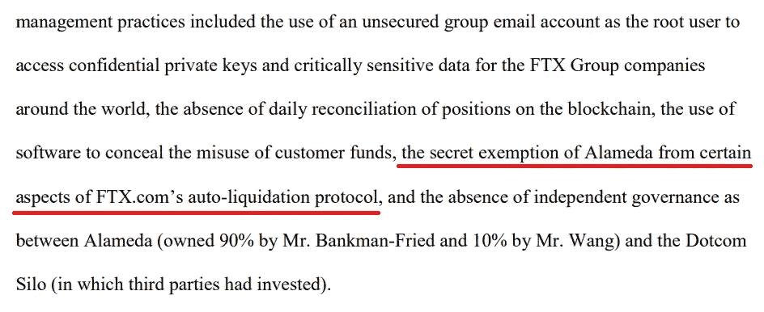

*约翰·雷的* [*关于 FTX 破产的震惊报道*](https://pacer-documents.s3.amazonaws.com/33/188450/042020648197.pdf) *。*

但是，阿拉米达交易的故事情节中有一个明显的漏洞，导致了 UST·德佩格，然后打赌卢纳价格也会下跌。

发现 Hodlnaut 破产的@Cycle_22 整理的区块链数据显示，Terraform Labs (TFL)自己在 depeg 前几周迅速向[出售了价值 4 . 5 亿美元的](https://twitter.com/FatManTerra/status/1600091474682486784)UST。

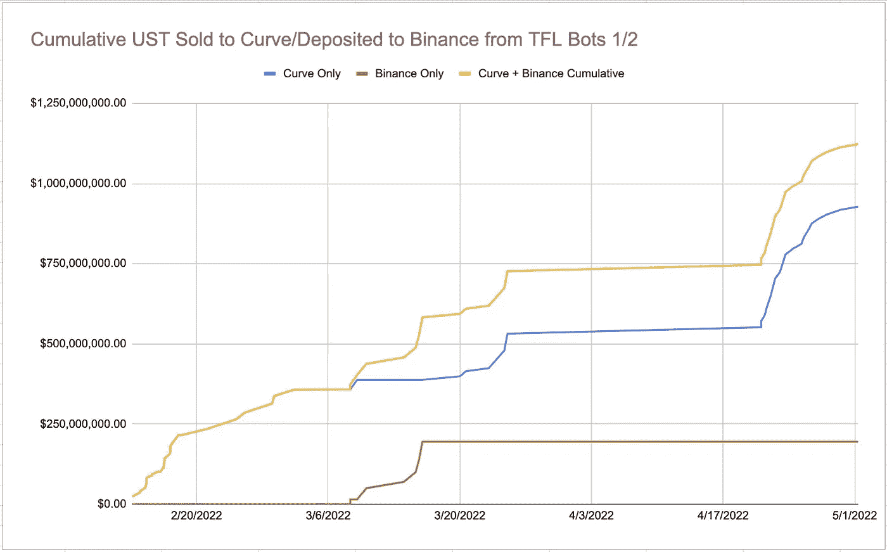

*UST 曲线分散交换倾销。图片来源:* [*@Cycle_22*](https://twitter.com/Cycle_22)

换句话说，不仅阿拉米达在 UST 的 depeg 期间亏损，正如他们的[负 USDC 稳定币流](https://twitter.com/Cycle_22/status/1591762091115163649)所示，而且 Terraform Labs 显然对曲线交易所施加了与 UST 相同的抛售压力。

据称，Terraform Labs 与 Luna Foundation Guard (LFG)一起，在与 Genesis Trading 和 3AC 对冲基金(这两家公司现已倒闭)的场外交易(OTC)中，用 UST 换取了价值 15 亿美元的 BTC。

这是为了支撑失败的 UST 联系汇率制度，同时也是为了削弱 UST 的竞争力？那么，这只是一个时机错误的例子吗？区块链研究员@FatManTerra 表示，一种不同的动态正在形成。

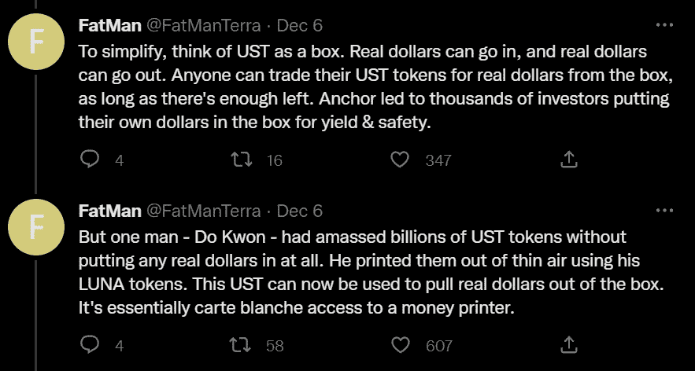

作为对 NYT 文章的回应，Terra 的道权现在暗示创世纪贸易公司曾向阿拉米达提供贷款给德佩格 UST 公司。

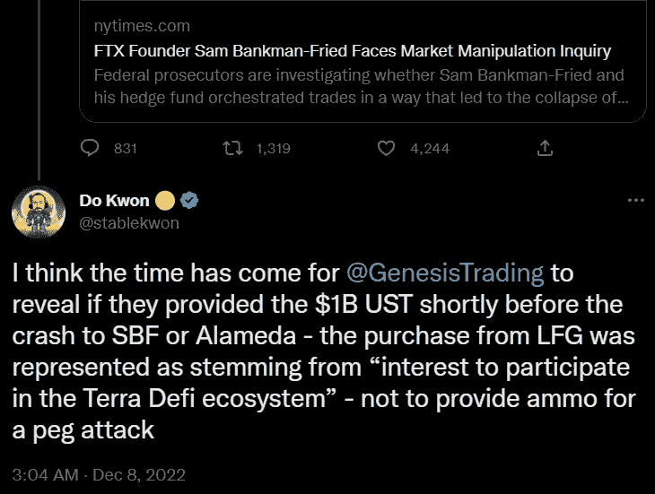

事实是，有这么多可疑人物参与其中，没有人真正知道发生了什么。从外面看，漫不经心的观察者认为它是一个巨大的迷宫，充满了黑暗的隧道，甚至连当局都难以解开。

[**享受 5MF？点击转发给三个朋友。**](mailto:info@tokenist.com?subject=Check+this+out+&body=I%E2%80%99ve+been+reading+Five+Minute+Finance,+and+I+know+you%E2%80%99d+enjoy+it+too.+It%E2%80%99s+a+weekly+email+that+covers+the+most+important+trends+in+finance.+I+learn+something+new+every+time+I+read+it!+Check+it+out+here:+https://tokenist.com/newsletter/?utm_source=email_gr_btn)

# 新老 80 万亿美元漏洞被发现

*   国际清算银行关注外汇互换债务膨胀至 80 万亿美元 **(** [**链接**](https://tokenist.com/bis-concerned-as-fx-swap-debt-swells-up-to-80t/) **)**

# 商务部工业与安全局挥舞红色警告旗

在最近的季度回顾中，国际清算银行披露了外汇市场高达 80 万亿美元的巨额债务。

外汇市场是世界上最大的流动性市场，日均交易量达到 6.6 万亿美元。原因很简单。每当一家公司需要进入外国市场时，他们都会去外汇市场将本币换成外币。然而，国际清算银行披露了 80 万亿美元的互换和货币衍生品外汇债务:

*   美国以外的养老基金等非银行机构投资了 26 万亿美元。
*   从美联储获得信贷有限的非美国银行占 39 万亿美元。
*   15 万亿美元的资产负债表上的美元债务。

这意味着，非美国金融机构在[外汇掉期/货币掉期和远期](https://tokenist.com/investing/forex-trading-guide/)中欠下 65 万亿美元的美元计价债务。这种滚动债务是债务的母体，大于美元国库券(短期政府债务)、回购(为短期流动性借入的回购协议)和商业票据(短期公司债务)的总和。

但为什么养老基金等金融机构会购买外汇债券呢？

我们以向前求导为例。如果一名交易员认为，在未来几个月，美元相对于欧元的价值将会上升，他们可以签订一份远期合约，在未来的某个特定日期，以预定的汇率卖出欧元，买入美元。

这使得交易者可以锁定有利的汇率，并在市场走势不利时保护自己免受潜在损失。这类赌注高达数万亿美元，其中约 80%的期限不到一年。

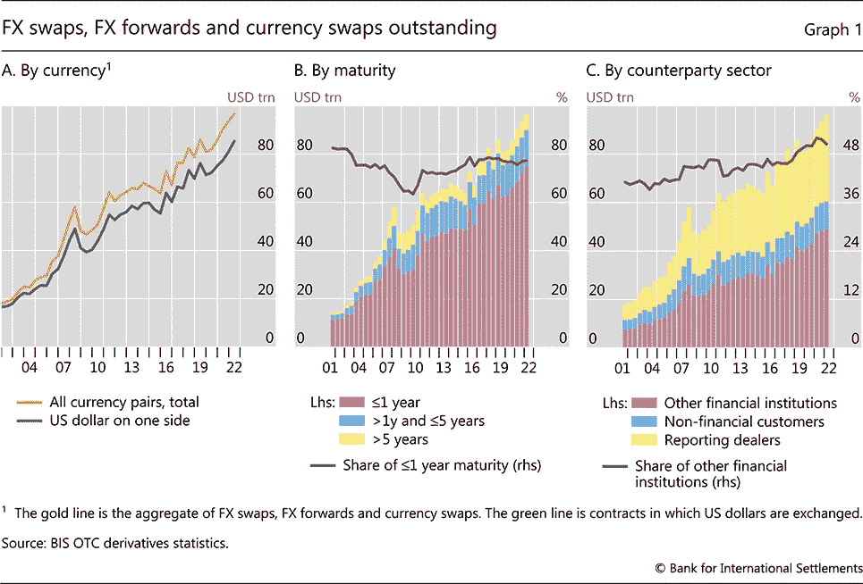

*巨大的债务必须在不到一年的时间里展期。图片来源:* [*BIS*](https://www.bis.org/)

这种大规模展期债务的内爆将取决于多种因素，汇率波动和交易对手业务仍是最大的因素。

此外，鉴于美元占外汇交易的 87%,其他央行将不得不印刷本国货币来偿还债务，这只会加剧全球通胀水平。

与此同时，随着各国央行提高利率以对抗通胀，许多关键齿轮可能会断裂。可以说，作为全球金融体系的支柱，这是一个非常危险和脆弱的组合。

随着正确(或错误)的压力市场事件，国际清算银行警告说，这种情况可能会给所有市场带来严重的冲击波。

# 在资本寒冬中，风险投资基金继续涌入

*   尽管 FTX 井喷，Crypto 资助创下超越 2021 年纪录 **(** [**)链接**](https://tokenist.com/despite-ftx-blowout-crypto-funding-set-to-surpass-2021-record/) **)**

# Crypto 在 2022 年获得了大量资金

最近的一项调查[将加密投资排在散户投资者对 2023 年前景总体偏好的第三位，夹在指数基金和房地产之间，为 38.2%。](https://fortune.com/2022/12/08/retail-investor-top-stock-picks-2023-finimize-survey/)

从 PitchBook ads 到大型加密投资图片的另一份报告。尽管 FTX 和特拉(LUNA)的失败看起来很可怕，但 2022 年风险资本(VC)对加密项目的投资将超过 2021 年。

在 2022 年的前 9 个月，风险投资公司向加密领域投入了 199 亿美元，比 2021 年同期高出+44%。

然而，2022 年第三季度出现了相当大的放缓，因为与 Q2 2022 年相比，风险投资资金下降了-38.3%。第三季度的总额约为 40 亿美元。

但时代的标志绝对在这里。凭借其作为基于区块链和人工智能的下一代互联网的宣传，Web3 在第三季度的风险投资激增，达到 15 亿美元。Web3 初创企业的激增比 Q2 高出 44.5%。

2022 年第三季度，NFT 的销售额也下降了-68.2%，因为 NFT 的交易活动也在继续下降。

自然，随着 2022 年的推移，事情会有所放缓。而且，在后 FTX 时代，情况可能只会变得更糟。

然而，如果加密领域能够成功度过艰难的 2022 年，并以更高的透明度和安全性反弹，那么该行业最终可能会继续沿着这条相同的道路前进，看到大量的投资者活动——来自零售和大型风险投资公司。

# 本周推特

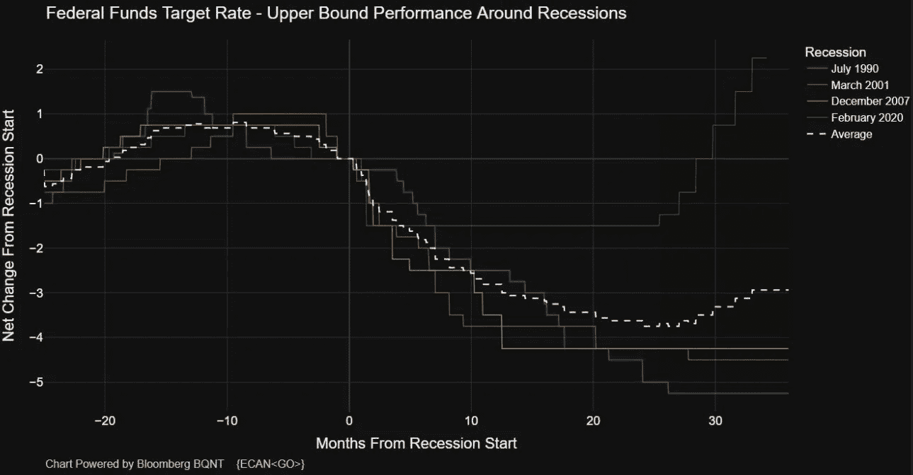

> 在过去 30 年中，在平均衰退中，美联储最终降息近 400 个基点。
> 
> 前 12 个月削减了 300 个基点。
> 
> 债券市场的价格显示，真正衰退的可能性至多为 40%。

[**@MacroAlf**](https://twitter.com/MacroAlf/status/1600973745652264961)

> 以太坊开发者周四决定，下一个名为“上海”的硬分叉将于 2023 年 3 月发布。这次升级将包括 EIP 4895，这将允许信标链押乙提款。

[**@ Wu 区块链**](https://twitter.com/WuBlockchain/status/1601016458074808321)

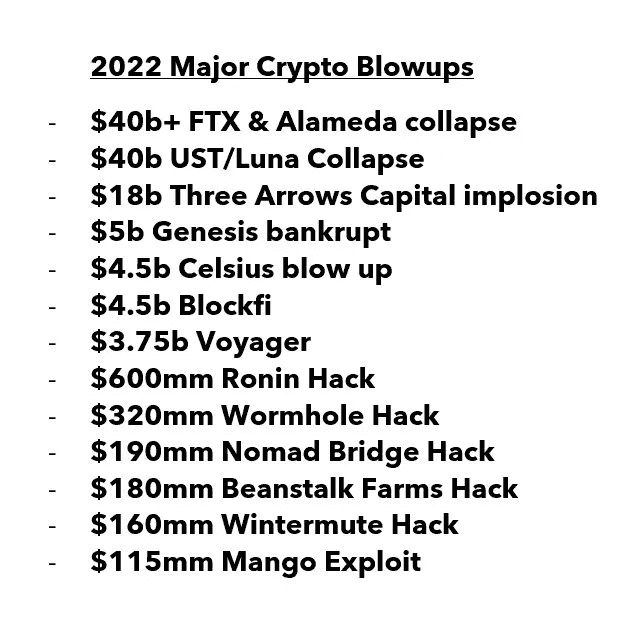

> 这是有趣的一年

[**@ WClementeIII**](https://twitter.com/WClementeIII/status/1600967775476146177)

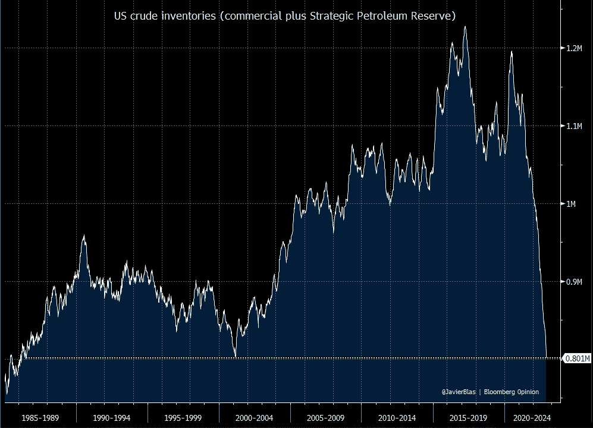

> 美国**总* *原油库存(包括商业和战略石油储备)已降至 36 年低点，跌破 2001 年创下的前期底部| #OOTT

[**@ Javier blas**](https://twitter.com/JavierBlas/status/1600526584129196033)

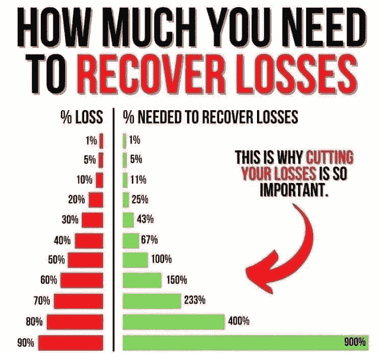

> 从损失中恢复所需的收益

[**@ mayhem markets**](https://twitter.com/Mayhem4Markets/status/1600652625913036801)

# 加入五分钟金融时事通讯。

[Sign up here — it’s free.](https://tokenist.com/newsletter/)

[t.me/thetokenist](http://t.me/thetokenist)

twitter.com/thetokenist

> 交易新手？尝试[加密交易机器人](/coinmonks/crypto-trading-bot-c2ffce8acb2a)或[复制交易](/coinmonks/top-10-crypto-copy-trading-platforms-for-beginners-d0c37c7d698c)