# 五分钟金融:SBF 与一家美国银行的合作，交易所在“准备金证明”中错过了什么

> 原文：<https://medium.com/coinmonks/five-minute-finance-sbfs-venture-with-a-us-bank-what-exchanges-miss-in-proof-of-reserves-579fdaa9484e?source=collection_archive---------21----------------------->

注册免费的每日时事通讯,永远不要错过宏观金融的突破性发展。

# 5 分钟的金融时事通讯——解释发生了什么，为什么。

# 让我们看看这周发生了什么:

*   SBF 投资了一家美国银行…为什么？
*   BTC 和联邦理工学院几乎没有注意到温和的美联储
*   外汇储备证明足以保证交易所的透明度吗？
*   数字货币集团:陷入困境？
*   DeFi 正在远离隐私

# 兔子洞永远不会结束:FTX 拥有一家小美国银行的大量股份……嗯？

*   FTX 在一桩可疑的交易中收购了一家只有 3 名员工的美国持牌银行:报道 **(** [**链接**](https://tokenist.com/ftx-acquired-a-us-licensed-bank-with-just-3-employees-in-questionable-deal-report/) **)**

# 巴哈马 FTX 会见美国银行，通过阿拉米达研究

SBF 的情况越来越奇怪了。说了这句话三个星期后，我们都认为这种怪异会结束。但它没有。

SBF 显然涉足了传统银行业。不是任何一家银行，而是一家美国银行——与系绳有联系。

以下是迄今为止的事实:

*   SBF FTX 的一家子公司向华盛顿州的一家小型法明顿州立银行投资了 1150 万美元，这家银行只有三名员工和一家分行，没有任何信贷或网上银行服务。
*   根据联邦存款保险公司的数据，该银行当时的净资产为 570 万美元，但 SBF 在今年 3 月通过阿拉梅达研究公司(Alameda Research)向法明顿州立银行的母公司 FBH 注入了两倍于此的 1150 万美元。

关键是。回到 2020 年，在 FTX 成立一年后，该银行被 FBH 收购。谁是 FBH 的主席？Jean Chalopin 是另一家银行 Deltec Bank 的董事长，该银行的总部与 FTX 一样设在巴哈马。

# 稳定币诡计？

事情从这里开始迅速恶化。

Deltec Bank 正是 2018 年与 Tether 合作的银行以确保其主要的可兑换稳定币——USDT。

为了了解 USDT 的规模，回想一下 Terra 崩溃时的算法稳定币 UST，它在与美元脱钩之前市值 186 亿美元。

好吧，与市值 650 亿美元的 USDT 相比，这只是小钱。USDT 是一种经典的可兑换稳定货币——由银行保管的一美元纸币兑换一个数字 USDT。

但如果它不知何故不再可赎回，USDT 将跨不同的区块链网络崩溃整个加密生态系统。

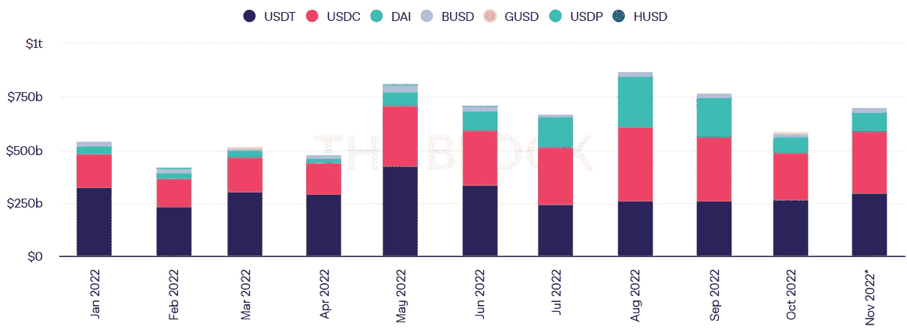

*调整后的稳定猪肉的链上体积。11 月，USDT 流量超过 2955 亿美元。图片来源:*

*现在，没有迹象表明 USDT 不适合赎回。虽然 Tether 在历史上在支持方面有一点坏名声，但已经朝着积极的方向取得了进展。例如，Tether [最近聘请了声誉良好的 BDO 意大利会计公司来做月度储备证明。](https://tokenist.com/tether-hires-new-auditor-to-publish-monthly-proof-of-reserves/)*

*那么——是不是和 SBF 有什么准备？*

*根据 Protos research 的数据，总价值 1085 亿美元的 USDT 中，有 366 亿美元是通过 SBF 的 Alameda Research 做市商完成的。*

*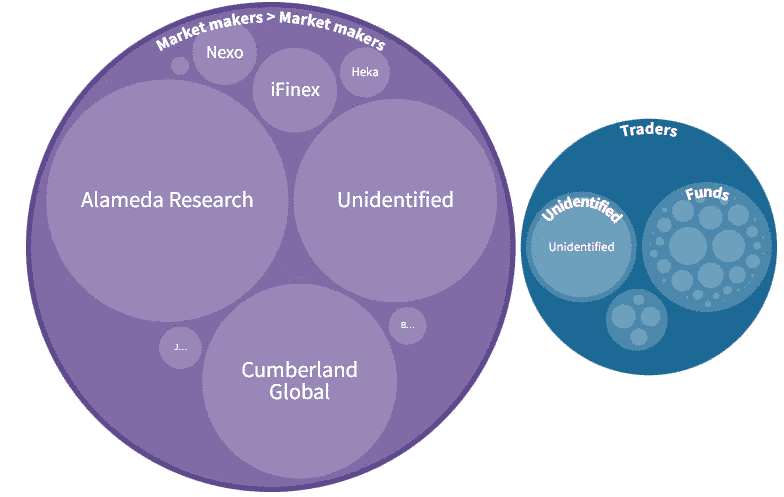*

**跨做市商和交易商的系绳(USDT)分销。图片来源:* [*原图*](https://protos.com/tether-papers-crypto-stablecoin-usdt-investigation-analysis/)*

*就在 FTX 入股之前，Farmington State Bank 在网上更名为[并注册为](https://trademarks.justia.com/972/90/moonstone-97290463.html)月光石银行，其使命是推动“**下一代金融**的发展。”这家小银行的存款也在今年第三季度飙升了+600%，从十年来稳定的 1000 万美元增加到 8400 万美元，只有四个账户。*

# *神秘仍在继续*

*为什么不受监管的巴哈马加密交易所会投资一家美国小银行？FTX 是在尝试发行自己的稳定币吗？是谁泄露了阿拉米达研究公司的资产负债表，从而揭穿了 FTX 的骗局？美国监管机构最初是如何批准一家离岸加密货币交易所(即使是通过一家子公司)投资于一家获得执照、受 FDIC 保险的美国银行的？*

*这些问题都没有令人满意的答案。简直太早了。然而，这里有明显的危险信号。*

**“一家本质上是加密公司的离岸对冲基金以高于其账面价值的倍数购买一家小银行的股份，这一事实本应给联邦存款保险公司、州监管机构和美联储敲响警钟，”**

*[——卡姆登·费恩](https://www.google.com/url?sa=t&rct=j&q=&esrc=s&source=web&cd=&cad=rja&uact=8&ved=2ahUKEwjVydralcn7AhVK3qQKHbEXC3kQFnoECBEQAQ&url=https%3A%2F%2Fwww.nytimes.com%2F2022%2F11%2F23%2Fbusiness%2Fftx-cryptocurrency-bank.html&usg=AOvVaw2dQdXca6m1x5zG8e9eiIGh)，美国独立社区银行家前负责人。*

*也许正在进行的破产案件将揭示更多关于 SBF 和 FTX 正在进行的——和无休止的令人惊讶的——案件中这种特殊的发展。*

**

# *鸽派美联储会议纪要透露:主要收获*

*   *美元在令人放心的 FOMC 会议上保持稳定，股票趋势向上 **(** [**链接**](https://tokenist.com/us-dollar-holds-steady-on-reassuring-fomc-minutes-stocks-trend-upwards/) **)***

# *美联储转向温和，美元走软，但加密仍在挣扎*

*全球流动性制造商美联储发布了上周三美联储会议纪要。*

*它们证实了市场此前的预期，即美联储将放松加息。在连续四次加息 75 个基点后，美联储现在倾向于 12 月份加息 50 个基点，2023 年加息 25 个基点。*

*“…减缓增长速度可以降低金融体系不稳定的风险。”*

*然而，美联储加息的总上限仍存在不确定性。他们明年会超过 4%还是 5%？令人惊讶的是，美元强势指数(DXY)在今年早些时候触及 [20 年高点](https://tokenist.com/dollar-index-hits-20-year-high-as-bitcoin-falls-below-20k/)后，今年首次突破 100 天移动平均线。*

**“在 11 月上半月欧元兑美元汇率回调后，现在没有那么多美元买家，”**

*——尼尔斯·克里斯滕森，Nordea 首席分析师。*

*股市不喜欢强势美元，因为这会损害国际公司的收益和投资。加密市场不喜欢强势美元，因为它在很大程度上是由比特币引领的，比特币目前比其他任何东西都更像是一种法定货币贬值对冲。由于廉价资本的损失，股市也不喜欢美联储加息。*

*加起来，股票和数字资产都应该上涨，但 FTX 崩溃带来的负面动荡显然仍在沉重地压在加密市场上。*

*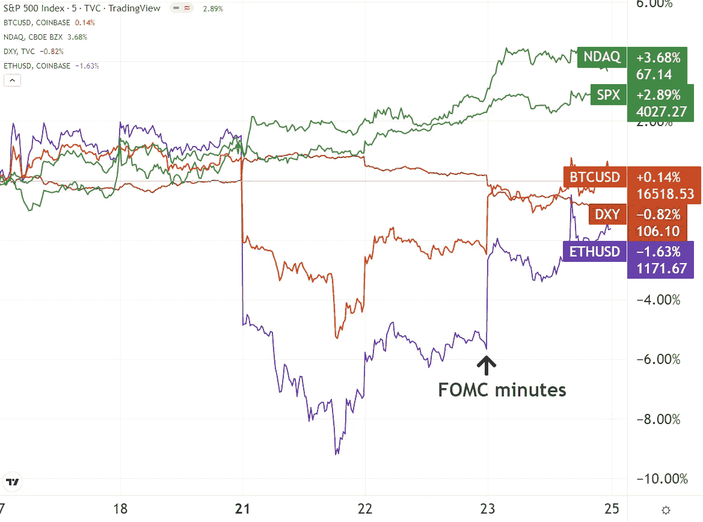*

*股票市场从美联储的温和信号中获得了明显的收益。 [*交易视图*](https://www.tradingview.com/)*

*随着 FTX-SBF-阿拉米达危机的蔓延仍在继续，CME 机构投资者正在大举做空 BTC。*

*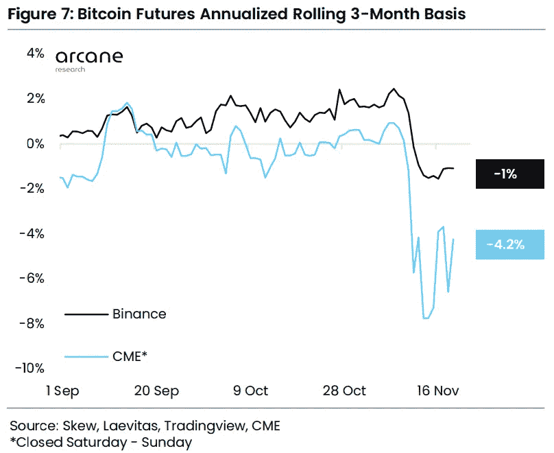*

**图像功劳:* [*奥术研究*](https://assets.ctfassets.net/4rilomtvvae4/7srVQ4mnjn4rTM7k0s6Awn/3c8192094e4cc1a4ac47a928ae6aaa38/Ahead_of_the_curve_-_Nov_22_2022.pdf)*

*同样，周一，ProShares 空头比特币策略 ETF (BITI)流入量升至新高，自 11 月 7 日 FTX 危机席卷该领域以来，已上涨 154%。*

*简而言之(没有双关语的意思)，加密市场深陷 SBF 泥沼，甚至连温和的美联储会议纪要和美元走软都没有发挥出它们传统的积极作用。*

**

# *加密交易所趋向于储量证明——这是一个好的开始，但这就足够了吗？*

*   *准备金证明不足以确定交易所的健康状况 **(** [**链接**](https://tokenist.com/proof-of-reserve-is-not-adequate-to-determine-an-exchanges-health/) **)***

# *防止 CEX 漏洞*

*FTX 和阿拉米达研究中持续暴露的前所未有的欺诈可能有一线希望。*

*展望未来，我们将看到集中式交易所(CEXes)的透明度显著提高。*

*默认情况下，分散交易所(DEXes)已经是透明的，因为做市商本身就是用户。它们的流动性被绑定在自动智能合约中，在公开的区块链上所有人都可以看到。*

*德克斯也不用担心首席执行官。但如果 CEXes 集中了做市商和首席执行官，他们如何才能达到 DEX 级别的透明度？*

*采用一种新的独立机制，称为储备证明(PoR)。第三方将对 CEXes 进行检查，以确保它们拥有的用户资金与预期的一样多。这个过程使用一种叫做 [Merkle 树](https://en.wikipedia.org/wiki/Merkle_tree)的加密结构。它通过处理所有交易，将 CEX 的资产负债表分割成可消化的小块。*

*南森已经有了一个[运行仪表板](https://portfolio.nansen.ai/entities)，它使用 Merkle 树来显示 14 家交易所的资产负债表。现在，所有的交易所都被怀疑后台滥用客户资金，更多的交易所每天都争先恐后地被包括进来。这是币安的 PoR 快照。*

*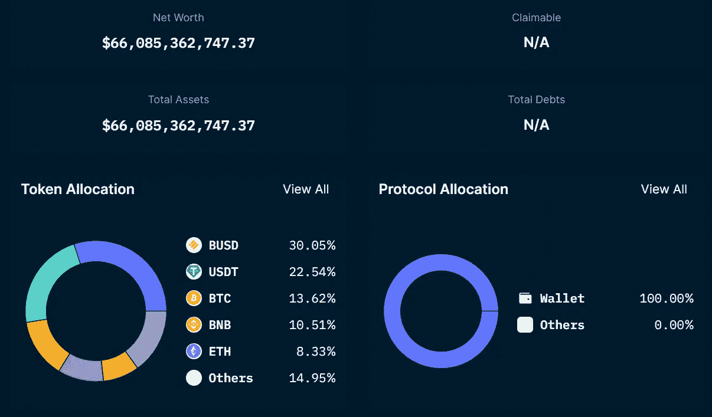*

**通过获得所有交易散列的总和——默克尔根，像南森这样的第三方可以将交易所的资产负债表与可公开验证的余额进行对比。图片来源:*[*Nansen . ai*](https://portfolio.nansen.ai/entities)*

*但是 PoR 够了吗？“可索赔”和“总债务”的“不适用”部分是什么？如何验证交易所没有利用客户资金进行隐性债务？*

*例如，一个组织可能与一家交易所串通，转移资金以获得短期余额快照。这就是责任证明(PoL)发挥作用的地方。*

*区块链数据聚合公司 Coinmetrics.io 的联合创始人 Nic Carter 提出了自己的间接解决方案:*

*证明负债是一件棘手的事情，通常需要审计师进行全面的评估。例如，交易所可以忽略某些“欺骗”PoR 认证的责任。这就是为什么我既推荐面向用户的 PoR 协议，允许用户通过集体验证他们的个人余额来获得‘群体免疫’，也推荐面向审计师的 PoR 协议，以证明所声称的负债是真实的。”*

*随着这种来自用户和审计方的持续扫描，我们可能会看到一个 CEX 透明度的新时代。*

*看到这些独立于监管者的有机发展是很有趣的。*

*[**享受 5MF？点击转发给三个朋友。**](mailto:info@tokenist.com?subject=Check+this+out+&body=I%E2%80%99ve+been+reading+Five+Minute+Finance,+and+I+know+you%E2%80%99d+enjoy+it+too.+It%E2%80%99s+a+weekly+email+that+covers+the+most+important+trends+in+finance.+I+learn+something+new+every+time+I+read+it!+Check+it+out+here:+https://tokenist.com/newsletter/?utm_source=email_gr_btn)*

**

# *数字货币集团仍有回旋余地*

*   *DCG 首席执行官向股东保证公司间借贷不是问题 **(** [**链接**](https://tokenist.com/dcgs-ceo-reassures-shareholders-that-intercompany-lending-not-a-concern/) **)***

# *11 月是秘密瀑布月*

*11 月是秘密瀑布月。山姆·班克曼-弗里德创造了级联环境，币安首席执行官“CZ”通过调用 SBF 的非法 FTT 抵押品来推动级联。*

*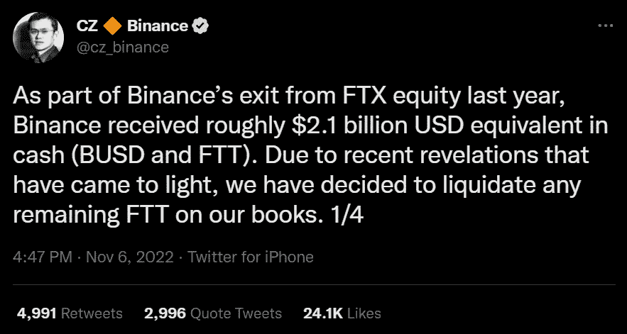*

**图片来源:* [*推特*](https://twitter.com/cz_binance/status/1589283421704290306)*

*在此之后，我们已经看到多家贷款机构暂停提款，其中 BlockFi 和 Genesis 是最大的两家。这些造成了他们自己的小瀑布。一个典型的例子是，当 Genesis 上周停止提款时，Gemini exchange 在一天之内就遭遇了 5 . 7 亿美元的提款(T21)。*

*这是因为人们把 Gemini exchange 和 Genesis 提供的 Gemini Earn lending 项目搞混了。但是谁拥有创世纪？全球最大的加密公司之一——数字货币集团——是一家风险投资公司，涉足 200 多个加密领域。*

*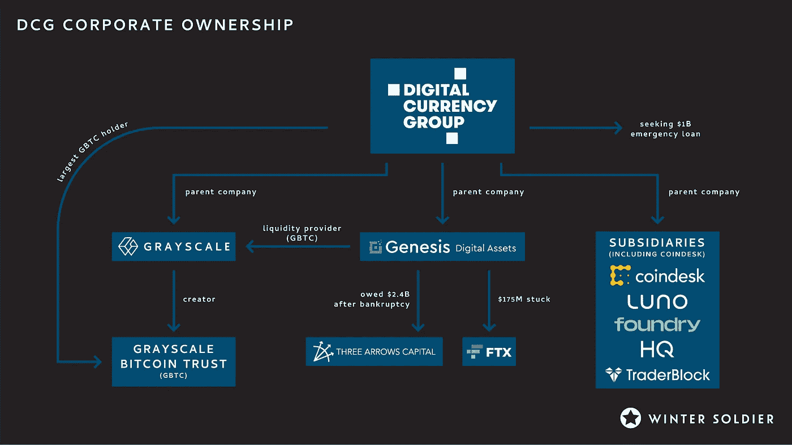*

*从 FTX 和创世纪到格雷和 DCG 本身的责任级联。图片鸣谢:冬兵*

*拥有 500 亿美元的 AuM，由 Barry Silbert 运营，DCG 是如此之大，以至于该公司的首页将其描述为“**比特币和区块链产业的中心**”。DCG 不仅拥有 Genesis，还拥有一家更大的公司——灰度比特币信托公司(GBTC ),该基金持有价值 105 亿美元的比特币。*

*在 SBF 被曝光后，创世纪公司剩下 1.75 亿美元滞留在 FTX。与此同时，用户纷纷逃离，耗尽了 Genesis 的流动性。但更重要的是，由于 BTC 价格受到抑制，上周五 GBTC 相对于资产净值的贴水达到了历史低点-45%。*

*你看，GBTC 发行代表比特币股份的股票，在场外市场交易。比特币持有量以净资产值(NAV)表示。当 GBTC 折价交易时，这意味着净资产值(NAV)高于灰度出售的股票。*

*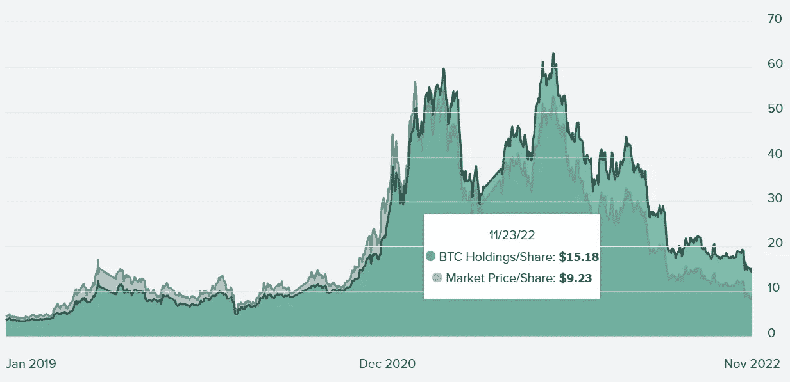*

**DCG 的 GBTC 已经连续 12 个月下跌了 71.36%。图片来源:* [*灰度*](https://grayscale.com/products/grayscale-bitcoin-trust/)*

*为了解决这一问题，DCG 动用了创世纪贷款公司(Genesis lending——它的储蓄罐——来支持 GBTC，总额达 7 . 72 亿美元。*

*与此同时，由于流动性短缺 16 亿美元，Genesis Global Capital 聘请投资银行 Moelis 进行破产探索。*

*就灰度而言，GBTC 支撑是否足够？*

*如果不是，想象一下出售 GBTC 的 633，360 枚比特币的毁灭性后果。这样的抛售压力将是历史性的，将整个区块链市场推向新的深度。然而，这种可怕的情景似乎不太可能出现。*

*尽管 BTC 价格的上涨肯定会让事情变得更快更好，但 GBTC 欠创世纪公司的 5.75 亿美元债务要到 2023 年 5 月才到期。此外，GBTC 收取 2%的费用，如果 BTC 保持在 1.6 万美元的水平，这部分费用每年约为 2 亿美元。在周二给投资者的信中，DCG 首席执行官巴里·希尔伯特进一步指出，公司的收入为 8 亿美元。*

*DCG 的总负债高达 20 亿美元，但 11 亿美元的期票要到 2032 年 6 月才到期。目前，根据这些信息，看起来 DCG 有足够的可用跑道。*

**

# *分散融资并不一定意味着“私人”融资*

*   *Uniswap 更新隐私政策:将追踪用户数据进行优化 **(** [**链接**](https://tokenist.com/uniswap-updates-privacy-policy-will-track-user-data-for-optimization/) **)***
*   *以太坊软件公司 ConsenSys 透露它收集用户数据 **(** [**链接**](https://www.coindesk.com/tech/2022/11/24/ethereum-software-firm-consensys-reveals-it-collects-user-data/) **)***

# *用户隐私会成为 DeFi 的下一个焦点吗？*

*8 月 8 日，德菲迎来了转折点。*

*美国财政部外国资产控制办公室(OFAC)批准了一项名为“龙卷风现金”的开源协议。龙卷风现金最初的目的是为了确保财务隐私。*

*比如以太坊联合创始人维塔利克·布特林(Vitalik Buterin)就用它向乌克兰捐款，因为他不想卷入政治。*

*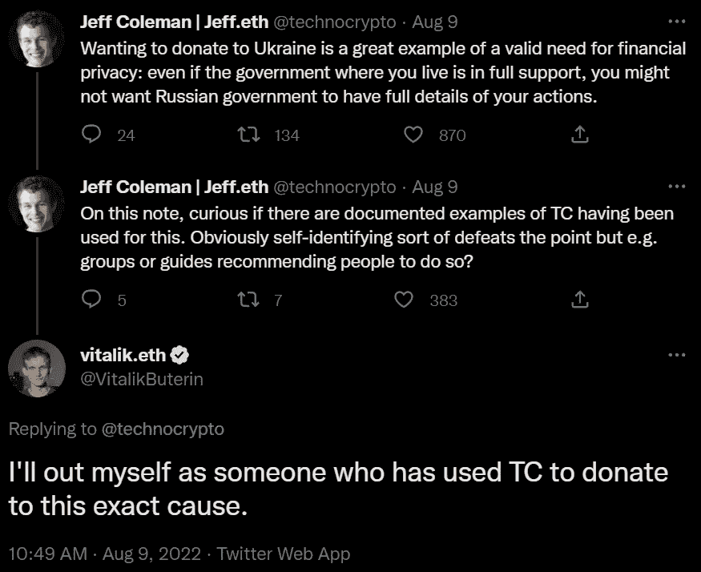*

**图片来源:* [*推特*](https://twitter.com/VitalikButerin/status/1556925602233569280)*

*OFAC 以独特的方式接触龙卷风现金，关注其洗钱和其他负面用途的潜力，尽管该服务是目的不可知的。*

*那么，OFAC 如何在一个公共区块链上阻止一个应该是不可变的分布式应用程序(dApp)呢？问题是，虽然在以太坊上运行 TC 的智能合约完好无损，但从繁琐的智能合约代码到用户友好界面的道路是脆弱的。*

*具体来说，当 MetaMask 钱包连接到 dApps 时，它是通过第三方基础设施如 Infura 来实现的，in fura 是首批阻止 Tornado 现金访问的公司之一。*

*因为 Consensys (MetaMask 的开发商)和 Infura 都是注册和集中的公司，它们必须遵守政府政策。否则，他们将面临长期监禁的风险。*

*这就是为什么我们看到隐私和去中心化之间的界限越来越模糊:*

*   *Uniswap 是一家分散的交易所，它更新了隐私政策，通知用户在第三方公司 TRM Labs 的帮助下筛选他们的钱包地址，该公司由高盛、Visa、PayPal 和其他公司资助。*
*   *Consensys 开发的 MetaMask 是一个非托管钱包，通过 Infura 收集所有相关的用户数据，包括 IP 地址和相关的以太坊钱包地址。*

*然而，竞争已经准备就绪。要赶上 MetaMask 每月 2100 万的活跃用户还需要一段时间，但随着 DeFi 领先组件之间数据收集的推进，以隐私为中心的加密领域的竞争已经白热化。*

*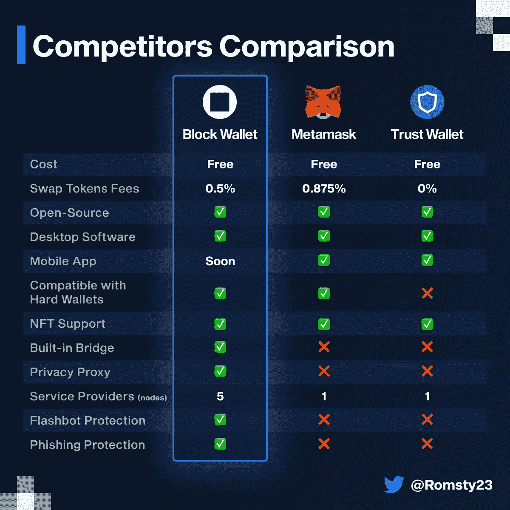*

**图片来源:* [*推特*](https://twitter.com/Romsty23/status/1595836069953560576)*

# *本周推特*

*1/2*

*看到很多关于 SBF“只违反 ToS 教而不违法”的负面报道*

*“电信诈骗”是一种犯罪，简单地说就是任何以盈利为目的的电子诈骗/计划，其方式是故意欺骗、欺诈或非法的。*

*2/2*

*“18 U.S.C. 1341”还指出，任何带有欺诈性借口或旨在从中赚钱或获利的陈述的计划，根据定义都是刑事犯罪。邮件欺诈或电汇欺诈。*

*他偷了。*

*他没有违背诺言。*

*[**@adamscochran**](https://twitter.com/adamscochran/status/1595900848806182917)*

*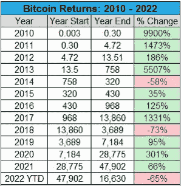*

*[@ Dyor _ Fudd](https://twitter.com/Dyor_Fudd/status/1595816226689011713)*

*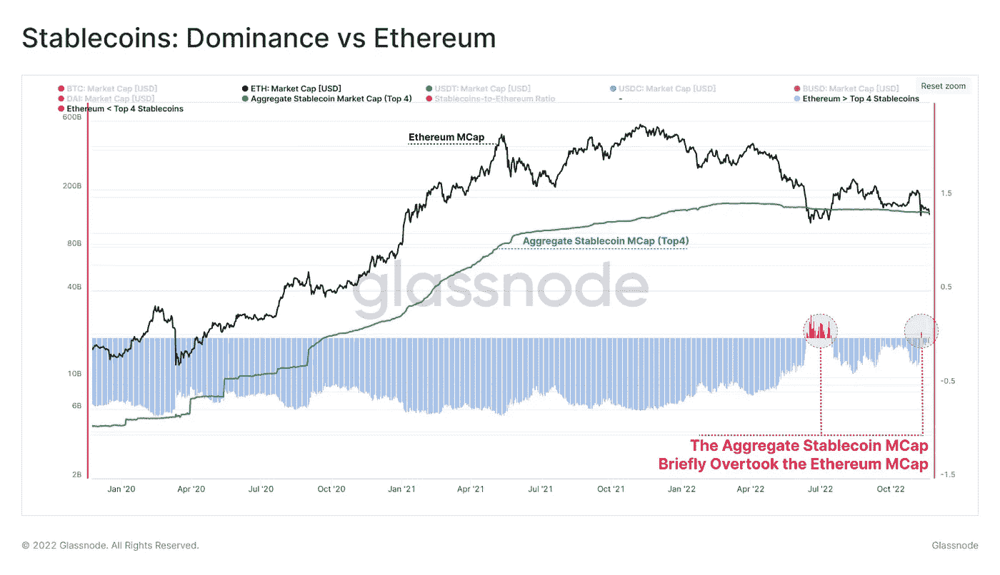*

*在过去几周的混乱中，#以太坊市值再次短暂跌破 stablecoin 总市值。*

*前四名分别是、、和戴，他们的总市值超过 1380 亿美元，其中 ETH 的市值仅上升 2.8%，为 1420 亿美元*

*[**@glassnode**](https://twitter.com/glassnode/status/1595600368255520769)*

*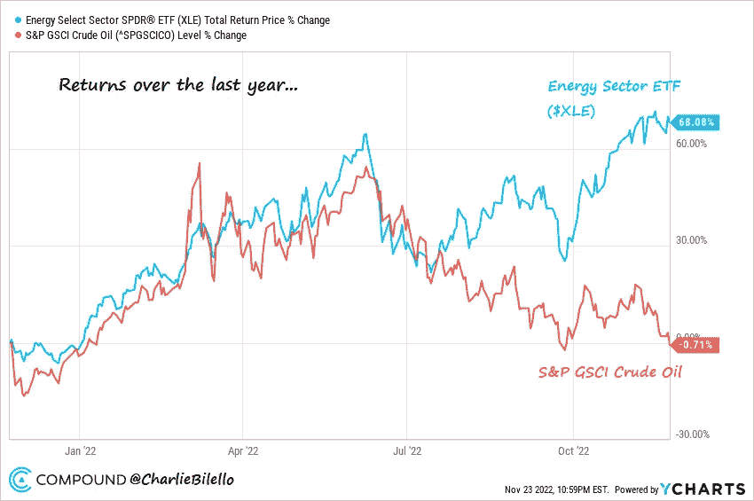*

*原油价格比去年下降了 1%。能源股？上涨 68%。🤔*

*[**@ charliebilello**](https://twitter.com/charliebilello/status/1595629628487761920)*

*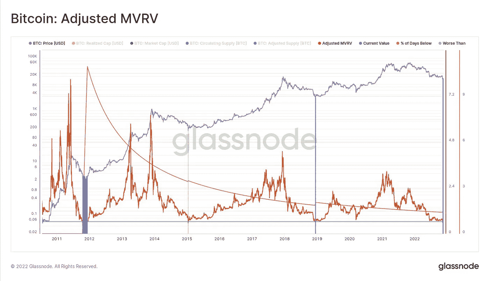*

*目前的#比特币市场盈利能力基本上是有史以来最差的。*

*调整后的 MVRV(不包括损失的硬币)为 0.63。*

*这意味着 BTC 投资者平均持有-37%的未实现亏损。*

*只有超过 75 天的情况更糟。*

*[**@ _ Checkmatey _**](https://twitter.com/_Checkmatey_/status/1595701805161525248)*

# *加入五分钟金融时事通讯。*

**

*[Sign up here — it’s free.](https://tokenist.com/newsletter/)*

**

*[t.me/thetokenist](http://t.me/thetokenist)*

**

*twitter.com/thetokenist*

> *交易新手？尝试[加密交易机器人](/coinmonks/crypto-trading-bot-c2ffce8acb2a)或[复制交易](/coinmonks/top-10-crypto-copy-trading-platforms-for-beginners-d0c37c7d698c)*