# 五分钟财经:SEC 称 FTT 是安全的，SBF 被保释，投资者和社交媒体

> 原文：<https://medium.com/coinmonks/five-minute-finance-sec-says-ftt-is-a-security-sbf-out-on-bail-investors-social-media-57abbed1e53c?source=collection_archive---------26----------------------->

注册免费的每日时事通讯,永远不要错过宏观金融的突破性发展。

# 5 分钟的金融时事通讯——解释发生了什么，为什么。

# 让我们看看这周发生了什么:

*   FTX 案开创了法律诉讼的重要先例
*   证明偿付能力的集中交易所的未来
*   Paxful 将 ETH 除名，关注利害关系证明
*   比特币矿工困境:核心科学破产
*   投资者和社交媒体之间的关系

# SBF 的高级中尉认罪

*   FTX 的王微、阿拉米达的卡罗琳·埃里森对联邦指控认罪，配合检察官 **(** [**)链接****)**](https://www.cnbc.com/2022/12/22/ftxs-gary-wang-alamedas-caroline-ellison-plead-guilty-to-federal-charges-cooperating-with-prosecutors.html)
*   **SBF 以 2.5 亿美元保释包** [**(链接)**](https://tokenist.com/us-prosecutor-proposes-250m-bail-for-sbf-home-detention-location-monitoring/)

> 从顶级交易者那里复制交易机器人。免费试用。

# SBF 判决越来越近，监管机构暗中争夺地盘

从巴哈马被引渡到美国后，Sam Bankman-Fried 因八项联邦欺诈指控可能面临 100 多年的监禁。

为了在加州父母的家中等待审判，联邦法官戈伦斯坦给予 SBF 法律史上最大的审前保释:2.5 亿美元。

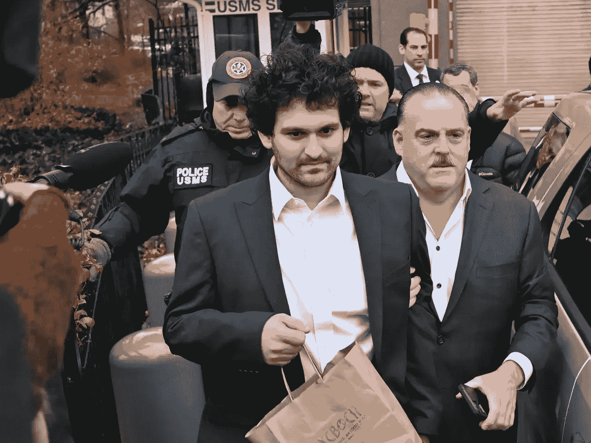

周四，FTX 创始人山姆·班克曼·弗里德在纽约接受传讯后回家。图片来源:[*ED JONES/AFP via Getty Images*](https://www.gettyimages.be/fotos/ed-jones-afp)

只有一小部分保释担保品(债券)需要担保，多亏了 SBF 富裕的父母和另外两个富有的支持者，这才得以实现。正如美国助理检察官 Roos 所说，由于确保对“*一场空前规模的欺诈*”的判决的风险如此之高，变节者的交易也得到保证。

卡罗琳·埃里森(阿拉米达联合首席执行官)和王微(FTX 联合创始人/首席技术官)对最大的几项指控认罪:合谋进行电信欺诈、电信欺诈、合谋进行大宗商品欺诈和合谋进行证券欺诈。他们的请求于周一签署。

另外，美国证券交易委员会(SEC)和美国商品期货交易委员会(CFTC)都对这两人提出了指控。除了计算 FTX/阿拉马达歹徒受到的指控和监禁时间之外，对于加密空间来说，还有一些甚至**更重要的**发展。

原来，[证券交易委员会将](https://www.sec.gov/litigation/complaints/2022/comp-pr2022-234.pdf) FTX 的本土 FTT 代币归类为一种证券。

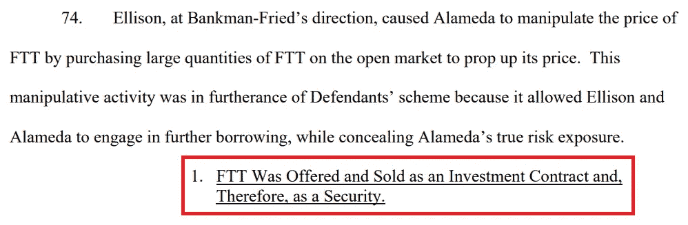

就像零售连锁店发行优惠券一样，集中交易所(CEXes)通常将这些代币作为交易费用的折扣，从而激励用户在该特定交易所进行更多交易。通常情况下，用户只是持有 CEX 代币来提高交易所的流动性，以换取少量收益。

在所有交易所中，CEX 代币的价值为[~ 483 亿美元](https://coinmarketcap.com/view/centralized-exchange/)，其中币安的 BNB 代币占 81%。现在，美国证券交易委员会宣布已故的 FTT 代币为证券，这为风险投资公司、社交媒体影响者和其他推广 CEX 代币的人创造了一个新的不安全感来源(双关语)。

而且还需要更分散的、符合证券模型的代币。例如，SEC 打赢了一场针对 LBRY 文件共享区块链公司的官司，该公司靠 LBRY 信用(LBC)令牌提供支持。

该公司现在向美国证券交易委员会提供 2000 万美元的奖励，如果他们能够清楚地解释如何在不受惩罚的情况下推出公开的区块链。

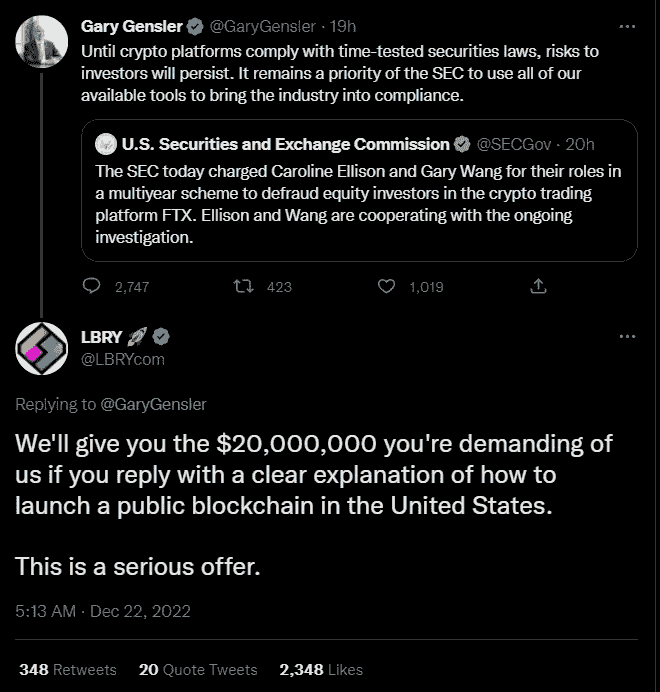

另一方面，在对欺诈二人组的投诉中， [CFTC 宣布](https://acrobat.adobe.com/link/review?uri=urn:aaid:scds:US:5fe13985-cf8d-499d-87f8-e1a65d489ffb)比特币、以太坊(ETH)和 USDT 稳定币为商品。

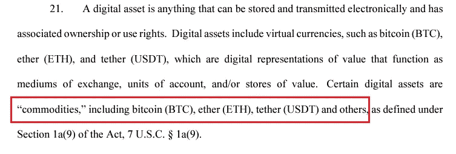

此前，SEC 主席加里·詹斯勒(Gary Gensler)曾暗示，联邦理工学院也是一家证券公司，就像 FTT 一样。

*“投资大众希望获得回报*【对 ETH】*，就像他们投资其他我们称之为证券的金融资产一样，”-* 加里·詹斯勒在美国消费者新闻与商业频道的 [Squawk Box](https://www.cnbc.com/video/2022/06/27/sec-chair-gary-gensler-discusses-potential-crypto-regulation-and-stablecoins.html) 上说。

主宰数字资产领域的战斗由来已久。2022 年，SEC 获得了 26.9 亿美元的[预算。相比之下，CFTC 的预算比 T4 低 7 倍。因此，收购一个全新的资产类别进行监管，可能会转化为机构增长的巨大潜力。](https://www.usaspending.gov/agency/securities-and-exchange-commission?fy=2022)

我们还没有看到哪个机构会占上风，如果这将通过法律先例，通过法律，或两者的一些反馈组合。

# 集中交易所如何证明偿付能力？

*   2022 年银行挤兑如何成为交易所储备的最终证明 **(** [**链接**](https://tokenist.com/how-bank-runs-became-the-ultimate-proof-of-reserves-for-exchanges-in-2022/) **)**

# 上市，储备证明，还是银行挤兑？

在损失了总计约 80 亿美元的客户资金后，SBF 帮助丰富了加密词汇——通过储备证明的概念。

这是对令人苦恼的问题的第一次急救——不知道下一个 FTX 在哪里潜伏，这个行业怎么可能发展？

所有大的集中交易所，币安、北海巨妖、BitMex、Gate.io、Coinfloor、HBTC……都争相证明自己的储备，以此向公众表明自己不是一个隐藏的 FTX。简单地说，用户可以通过[记录 id](https://tokenist.com/new-por-system-lets-binance-users-audit-their-assets/)来验证他们的资金，从而在交易所自己的总余额中计算他们的余额。

反过来，该交易所的余额可以由第三方审计机构进行核实。总部设在巴黎的 Mazars 审计公司为币安做到了这一点，方法是通过其钱包执行交易。然而，这些只是商定的程序(AUPs)，而不是全面的审计。

因此，AUPs 无法显示用户的资金是否与交易所的负债相关联。当涉及到一个交易所的偿付能力时，负债是非常重要的。

此外，即使用户的资金得到 1:1 的支持，谁又能说他们不会在任何时候被抽走，就像 SBF 从 FTX 到阿拉米达所做的那样？只有彻底的审计才能知道谁控制着用户的私钥。审计可以确定资产的钱包地址——但是其私钥的位置呢？

正是因为缺乏真正的证据，Mazars 最终退出了加密领域，撤回了币安的 AUP 审计。

*“由于担心公众理解这些报告的方式，Mazars 暂停了为加密货币行业实体提供储备证明报告*的相关活动，”*

负责审计 FTX 美国和北海巨妖的阿玛尼诺也退出了加密领域。准备金证据回溯变得不那么可信，导致许多币安用户质疑币安的偿付能力。其结果是对全球最大的交易所进行流动性压力测试，该交易所控制着全球 75%的交易量。

类似于银行挤兑，币安用户提取了价值 60 亿美元的加密资金。但这是一个短命的过程，现在停止了，币安现在持有[价值 547 亿美元的资产。](https://portfolio.nansen.ai/dashboard/binance)

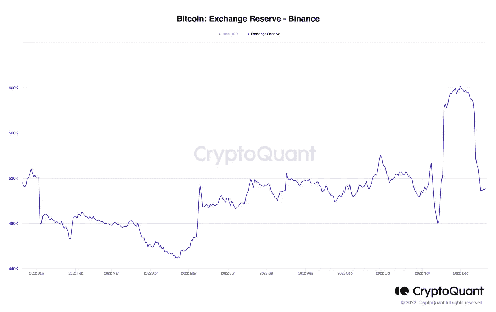

*尽管本月出现大幅抛售，但在 2022 年的时间线上，币安的底线没有太大变化。图片来源:CryptoQuant*

由于没有负债会计和私钥监管，准备金证明现在不那么流行了。

那么还有什么选择呢？加密用户如何知道哪个测试将证明集中式加密交换的偿付能力和可信度？就目前而言，似乎银行挤兑是唯一真正的考验。

另一种选择是经历一个昂贵而漫长的过程，在美国上市。比特币基地(COIN)通过了这一关，它需要接受年度全面审计，以及[季度](https://investor.coinbase.com/financials/quarterly-results/default.aspx)财务报表。

可以肯定地说，正是因为这个原因，贝莱德选择了比特币基地作为机构投资者的加密切入点。

# Paxful 删除 ETH，引用利害关系证据的关注

*   点对点加密市场 Paxful 从平台 **(** [**链接**](https://www.coindesk.com/business/2022/12/21/peer-to-peer-crypto-marketplace-paxful-removes-eth-from-platform/) **)** 移除 ETH

# 密码市场将如何应对？

你还记得 Elon Musk 在 2021 年 5 月 13 日发推文说特斯拉暂停比特币支付吗？

BTC 价格在那一周下跌了 30%，从 5.67 万美元跌至 4.34 万美元。这不仅仅是取消 BTC 整合的原因，而是很大程度上的原因。马斯克暗示比特币的工作证明过于耗能，不够环保——暗示比特币与特斯拉有明显的冲突。

因此，马斯克含蓄地表示，在这种情况改变之前，比特币没有未来。

以太坊现在也出现了类似的动态。在加密史上，第一次，一家主要的加密公司退出了分散金融的基石——以太坊(ETH)。

Paxful 的首席执行官 Ray Youssef[将 ETH](https://twitter.com/raypaxful/status/1605529289054527488) 从公司的市场上移除，理由是“*经济隔离*”，这是由以太坊从工作证明转变为利益证明推动的。

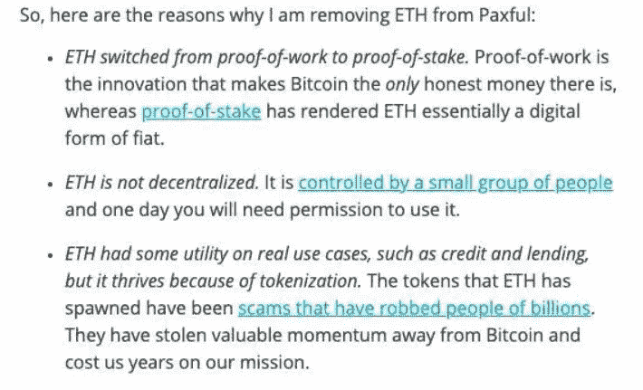

这一推理与围绕工作证明与利益证明的能源和环境问题完全相反，因为后者通常需要的能源[减少 99](https://tokenist.com/if-ethereum-2-0-consumes-99-98-less-energy-will-institutions-jump-in/)。

为了说明这种力量与 PoS 混乱的关系，绿色和平环境组织发起了一项耗资 100 万美元的活动，将比特币转变为股权凭证，并有效地将 BTC 从机构投资者手中剥离。

比特币的支持者声称，能源成本物有所值，因为能源被资本取代的区块链更容易受到集中化和控制。

来自北海巨妖的一份报告计算出一个价值 1000 亿美元的 PoS 网络可能被一个持有 330 亿美元股份(33%)的实体超越。目前，以太坊的 TVL(总价值锁定)为 298 亿美元。

Ray 的 Paxful 是一个点对点交易平台，上周交易了 3510 万美元。随着 ETH 的移除，Paxful 现在只提供三种硬币的交易——比特币和两种稳定硬币(USDC 和 USDT)。

当马斯克在推特上谈论比特币时，市场做出了类似的反应。然而，雷的影响力似乎没有同样的深度和持久力。

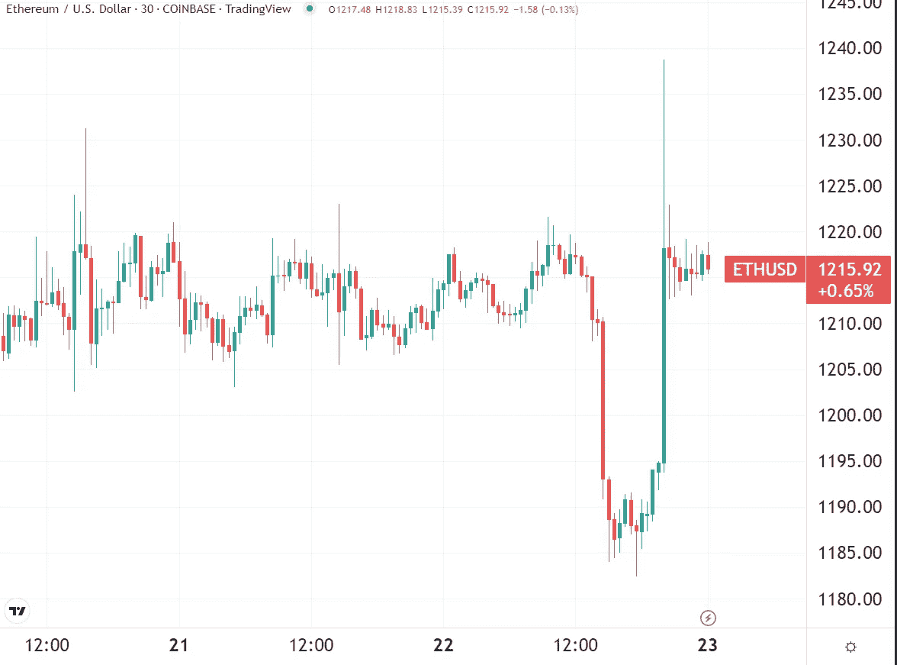

*继周三 Paxful 退出 ETH 之后，第二天 ETH 价格短暂下跌-2%。图片信用:* [*交易视图*](https://www.tradingview.com/) *。*

尽管如此，作为第一家反对主流观点的公司，Ray 的这一决定打破了僵局。

其他市场参与者是否会效仿 Paxful 还有待观察。

今年迄今，BTC 和瑞士联邦理工学院的表现不分上下，市值分别缩水 64%和 66%。

[**享受 5MF？点击转发给三个朋友。**](mailto:info@tokenist.com?subject=Check+this+out+&body=I%E2%80%99ve+been+reading+Five+Minute+Finance,+and+I+know+you%E2%80%99d+enjoy+it+too.+It%E2%80%99s+a+weekly+email+that+covers+the+most+important+trends+in+finance.+I+learn+something+new+every+time+I+read+it!+Check+it+out+here:+https://tokenist.com/newsletter/?utm_source=email_gr_btn)

# 比特币开采正深陷加密寒冬

*   申请破产的核心科学档案为密码冬咬 **(** [**链接**](https://www.reuters.com/technology/bitcoin-miner-core-scientific-file-chapter-11-bankruptcy-cnbc-2022-12-21/) **)**
*   为什么 2023 年将是考验比特币矿工韧性的一年 **(** [**链接**](https://tokenist.com/why-2023-will-be-a-test-of-resilience-for-bitcoin-miners/) **)**

# 核心科学破产，比特币挖矿将如何应对

美国最大的比特币挖矿公司之一 Core Scientific (CORZ)刚刚破产。

这并不是一个很大的惊喜。10 月，当 CORZ 公司宣布暂停支付本金和利息时，其股价暴跌了 76%。

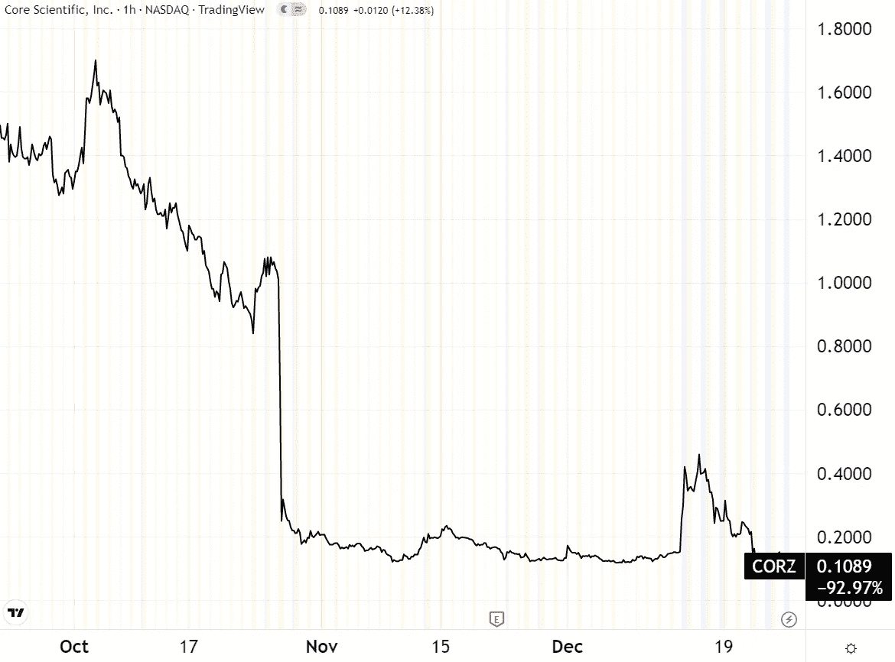

B. Riley Financial 上周 7200 万美元的注资并没有缓冲 CORZ 的下跌。图片信用: [*交易查看*](https://www.tradingview.com/) *。*

甚至在此之前，很明显 Core Scientific 在扩大采矿业务和偿还债务之间挣扎。当 5 月份熊市来袭，BTC 价格下跌时，科尔兹是 BTC 最大的抛售者，卖出了近 1 万枚比特币。

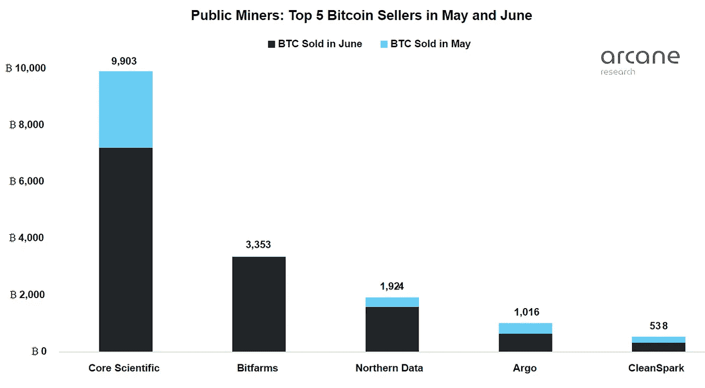

*图像功劳:* [*奥术研究*](https://arcane.no/research/the-public-miners-dumped-their-bitcoin-holdings-in-june)

在其破产申请中，Core 披露第三季度净亏损 4.348 亿美元，仅剩下 400 万美元的流动资金。这比 Core 从破产的 Celsius Network 获得的 700 万美元的未偿债务还要多。

其他比特币挖矿巨头也会倒闭吗？

这取决于他们的负债。Riot Blockchain 计划进一步扩展，从现在的 7.7 EH/s 到明年的 12.5 EH/s。同样，Marathon Digital 的目标是从目前的 7 EH/s 提高到 23 EH/s。为了将这些数字联系起来，1 exahash (EH)等于 100 万 terahash，代表在区块链网络中投入的计算能力(和安全性)。

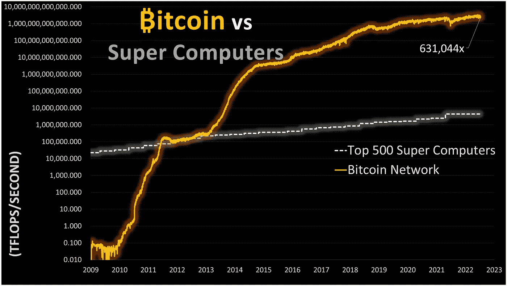

*比特币网络的计算能力与超级计算机能力的对比。图片鸣谢:* [*@blockbain*](https://twitter.com/blockbain/status/1605580557240242177)

这使得比特币网络成为世界上最安全的支付/存储系统。但是，如果矿业公司有破产的危险，这种安全怎么能持续下去呢？

这样的场景被整合到了比特币的代码中。要理解这是如何做到的，我们需要一点技术知识。

# 比特币挖矿课来了

显然，如果 BTC 价格下跌，比特币矿工收到的钱会更少。当前的块奖励是 6.25 BTC(约 10.4 万美元)，块由数百个已处理的交易组成。

在一个虚拟的网络自由市场中，矿工们相互竞争来验证这些交易块。他们的哈希能力越高，他们解决资源密集型数学方程的可能性就越大，从而获得验证网络交易的能力，并随后获得批量奖励。但随着矿商投入更多的散列能力，这些数学问题的难度(以及获得奖励的难度)也在上升，创造了一个原本旨在防止集中化的竞争环境。

尽管向网络提供相同的计算能力(这需要大量昂贵的能源)，但除了较低的 BTC 价格之外，矿商还面临利润下降的问题。不可避免地，这种动态导致无法长期维持无利可图的矿商退出。反过来，这降低了网络的总哈希能力。

随着哈希能力的降低，比特币的挖掘难度也随之下降。具体来说，这是每 2016 个开采区块自动调整一次，或大约每两周调整一次。

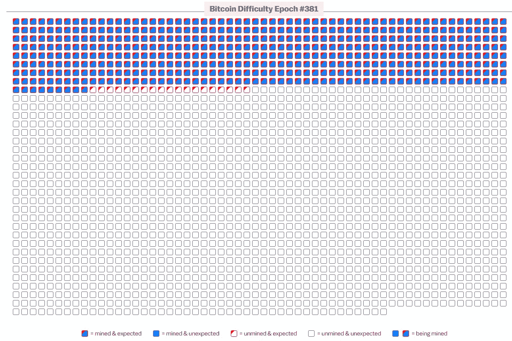

*比特币推出 13 年后，我们正处于第 381 个困难时期。图片来源:* [*bitrawr*](https://www.bitrawr.com/)

简而言之，比特币网络的自动目标是保持 10 分钟的平均阻塞时间。如果开采速度超过这个速度，难度就会增加。而如果超过 10 分钟，难度就降低了。

在最坏的情况下，如果更多的矿工退出(破产)，这种自动化的优雅将降低采矿本身的成本。留在游戏中的矿商随后会获得大量利润，就像我们在以前的周期中看到的那样。

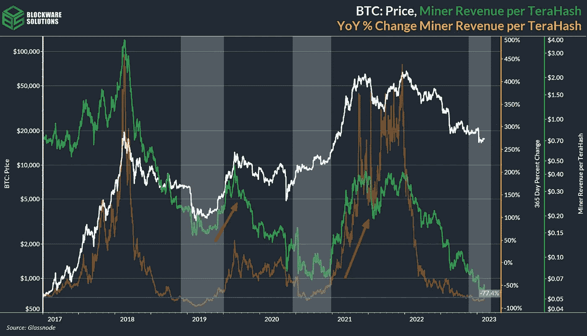

*在周期之间，矿工支撑并简化他们的操作。图片来源:* [*积木解决方案*](https://twitter.com/BlockwareTeam/status/1604884189144547328)

简而言之，比特币挖矿的诀窍是在牛市期间不要过度负债，以购买更多尖端的采矿设备。相反，要有足够的流动性在熊市中坚持到底。

这显然是说起来容易做起来难，正如我们在 Core Scientific 看到的那样。

# 更容易的交易=更多的冒险

*   倾向于高风险投资的年轻投资者，依靠社交媒体获得提示:调查 **(** [**)链接**](https://tokenist.com/young-investors-prone-to-risky-investments-rely-on-social-media-for-tips-survey/) **)**

# YouTube 和 Reddit 现在是财务建议的主要来源

说到年轻人，民间传说分为两种说法。一方面，“青春浪费在年轻人身上”似乎很有价值。但反过来说，“*青春正是冒险的时候*”，同样值得智慧。

FINRA 的最新报告明确指出，年轻投资者渴望收益，越快越好。该调查覆盖了约 3 万名受访者，显示年轻投资者(18-34 岁)比年长投资者(35-54 岁)更有可能参与高风险交易:

*   更高的期权/保证金交易，分别为 36%/23%和 21%/12%
*   对加密货币等风险资产的兴趣更高，分别为 62%和 41%
*   对“meme-stock”交易的兴趣更高，39%对 19%
*   为获得丰厚回报而承担更高风险的比例为 24%对 13%

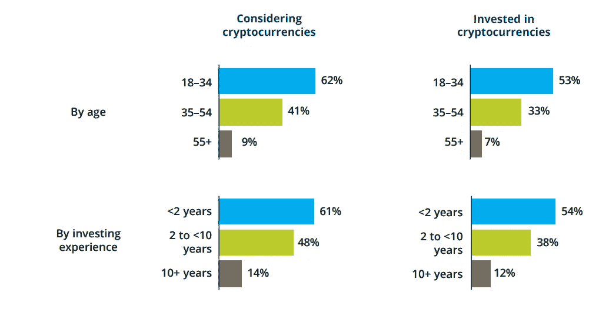

*年轻投资者更喜欢波动性更大的资产，以获得可能更快的收益。图片来源:* [*芬拉*](https://www.finrafoundation.org/sites/finrafoundation/files/NFCS-Investor-Report-Changing-Landscape.pdf)

18-34 岁年龄段的人压倒性地更喜欢移动应用程序，占 78%，同时也拥有最多样化的金融提示来源，67%的人拥有 6 种或更多不同的投资来源。

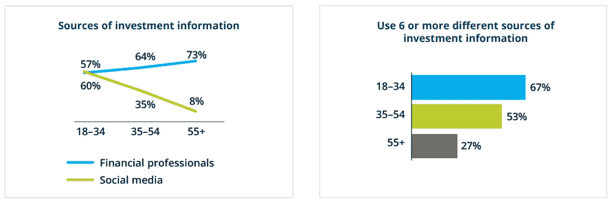

总的来说，Youtube 在所有年龄段的投资者中领先，其次是 Reddit、脸书和 Twitter。

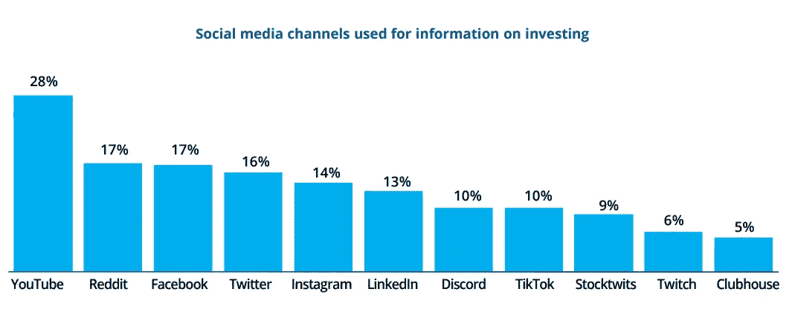

对于年轻投资者(18 -34 岁)，Youtube 的领先作用更加明显，为 56%，而 Reddit 以 41%的比例位居第二。

鉴于 Reddit 传奇的 r/WallStreetBets 在过去两年中增长到 1330 万用户，这是可以预料的，此前在 2021 年 1 月 GameStop/AMC 资金短缺之前，花了 9 年时间增长到 100 万用户。

不幸的是，多样化的社交媒体渠道在教育部有他们的工作要做。在所有年龄组中，18-34 岁年龄段的人最不可能正确回答金融问题。

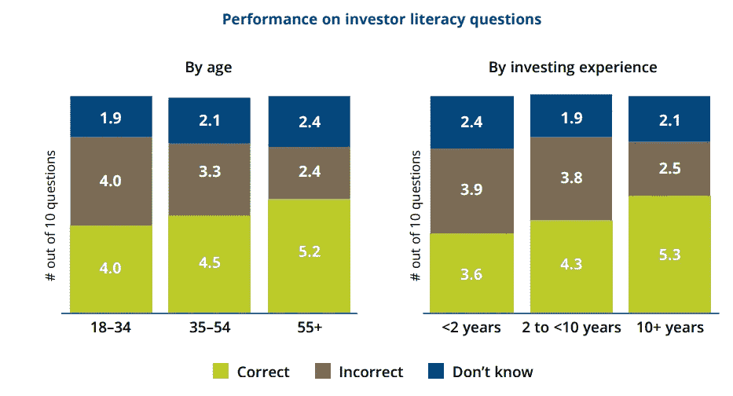

男性更有可能具有更高的金融知识水平，在 10 个问题中答对了 5.2 个，而女性在 10 个问题中答对了 3.9 个。然而，那些拥有超过 25 万美元投资组合的人命中率最高，有 5.3 个正确答案。

对于年轻人群来说，显而易见的是——尽管事实上*我们并不是所有人都真的会成功*和*斯通克斯实际上并不只会上升*(正如我们在 2022 年了解到的那样)——社交媒体和交易正在继续越来越紧密地融合。

# 本周推特

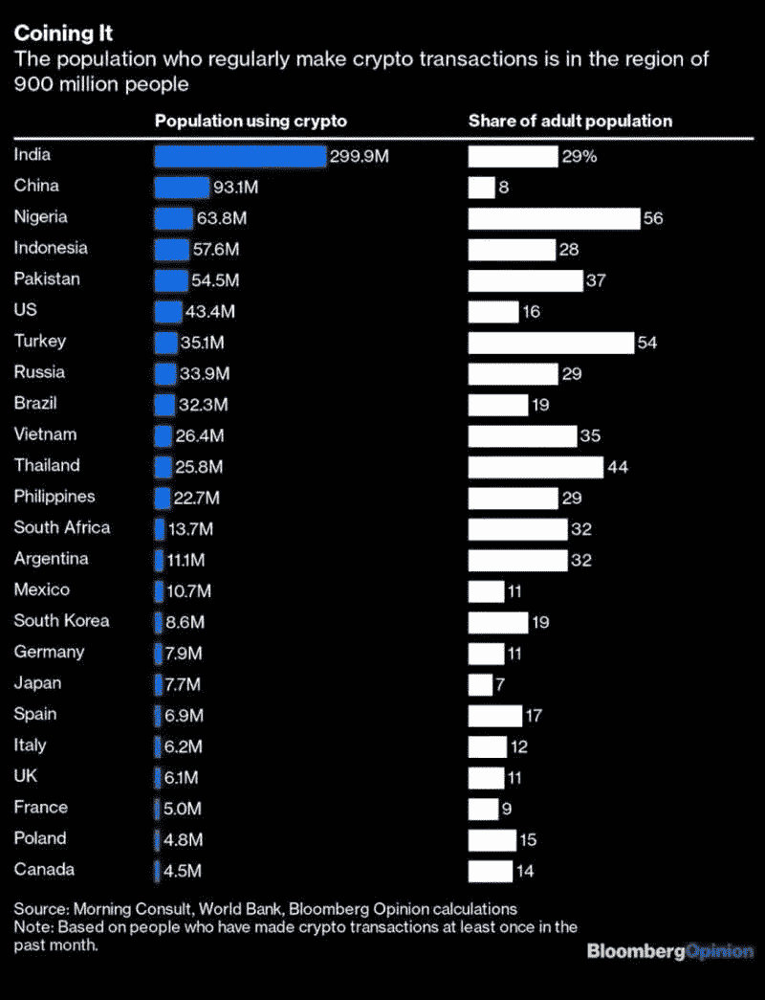

> “加密正在消亡”
> 
> 好吧，9 亿多人不会同意你的观点。

[**@铸币局**](https://twitter.com/coinbureau/status/1605899703878447104)

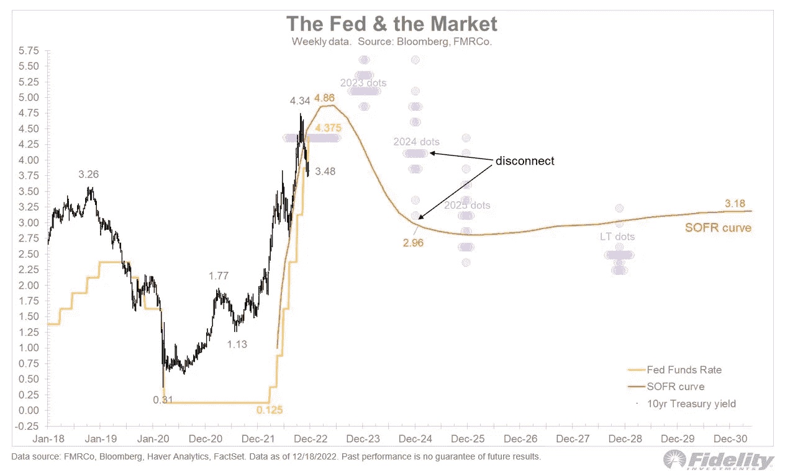

> 市场预计美联储将利率上调至 5%，然后几乎立即开始降息，一路回到 3%的中性区间。这是合理的期望吗？🧵

[**@ timmer fidelity**](https://twitter.com/TimmerFidelity/status/1605558802886955008)

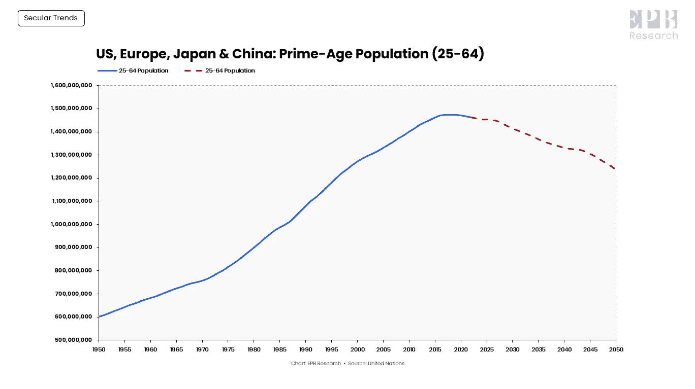

> 人口灾难。
> 
> 美国、欧洲、日本和中国约占全球消费量的 70%。
> 
> 这些主要地区的黄金年龄人口已经开始下降，并且在几十年内不会再次上升。
> 
> 这是需求破坏的最大(长期)驱动力。

[**@ EPB search**](https://twitter.com/EPBResearch/status/1605321494682386433)

📉美国人口的减少。

> 有史以来第一次，独居人口(3790 万)超过了有孩子的家庭(3390 万)
> 
> 对社会和住房市场的未来来说，这是个坏消息。

[**@ nicgger Li 1**](https://twitter.com/nickgerli1/status/1604910995654250497)

> 1.奇怪的事情正在发生——人们开始向美联储借钱！
> 
> 这种情况只会发生在流动性严重紧张的时候，比如 2008 年或 2020 年。
> 
> 但据推测，市场“充斥着”过剩的流动性，对吗？这是怎么回事？👇👇

[**@ lastbaarstanding**](https://twitter.com/LastBearStandng/status/1604916553379708937)

# 加入五分钟金融时事通讯。

[Sign up here — it’s free.](https://tokenist.com/newsletter/)

[t.me/thetokenist](http://t.me/thetokenist)

twitter.com/thetokenist

> 交易新手？尝试[加密交易机器人](/coinmonks/crypto-trading-bot-c2ffce8acb2a)或[复制交易](/coinmonks/top-10-crypto-copy-trading-platforms-for-beginners-d0c37c7d698c)

*   [Bitsgap 审查](/coinmonks/bitsgap-review-a-crypto-trading-bot-that-makes-easy-money-a5d88a336df2) | [Quadency 审查](/coinmonks/quadency-review-a-crypto-trading-automation-platform-3068eaa374e1) | [Bitbns 审查](/coinmonks/bitbns-review-38256a07e161)
*   [密码本交易平台](/coinmonks/top-10-crypto-copy-trading-platforms-for-beginners-d0c37c7d698c) | [Coinmama 审核](/coinmonks/coinmama-review-ace5641bde6e)
*   [印度加密交易所](/coinmonks/bitcoin-exchange-in-india-7f1fe79715c9) | [比特币储蓄账户](/coinmonks/bitcoin-savings-account-e65b13f92451)
*   [OKEx vs KuCoin](https://coincodecap.com/okex-kucoin) | [摄氏替代品](https://coincodecap.com/celsius-alternatives) | [如何购买 VeChain](https://coincodecap.com/buy-vechain)