# 五分钟金融:从 FTX 破产申请中得到的启示，大衰退指标到来

> 原文：<https://medium.com/coinmonks/five-minute-finance-takeaways-from-ftx-bankruptcy-filing-big-recessionary-indicator-arrives-fc23cca1c8da?source=collection_archive---------17----------------------->

注册免费的每日时事通讯,永远不要错过宏观金融的突破性发展。

# 5 分钟的金融时事通讯——解释发生了什么，为什么。

# 让我们看看这周发生了什么:

*   深入研究 FTX 破产文件
*   现实中的 SBF 是谁？将碎片拼在一起
*   FTX 危机影响了高收益产品
*   DeFi 在上升——但这是可持续的吗？
*   大衰退指标到来

# “史无前例”的 SBF 诈骗案被探究

*   监管机构是 FTX“黑客”的幕后黑手吗？债权人似乎也这么认为 **(** [**链接**](https://tokenist.com/are-regulators-behind-ftx-hack-creditors-appear-to-think-so/) **)**
*   FTX 借给阿拉米达价值数十亿的用户资金研究:报告 **(** [**链接**](https://tokenist.com/ftx-lent-billions-worth-of-user-funds-to-alameda-research-report/) **)**

# FTX 破产文书深入 SBF 兔子洞

山姆·班克曼·弗里德的欺诈案件还在继续增加。

不管有多少人打它，皮纳塔不断溢出更多的骗子口味的糖果。到目前为止，最简短的概述是这样的——SBF 创造了代币，除了利用用户资金为阿拉米达研究公司赌博之外，他还用代币作为非互联网货币贷款的抵押品。

FTX 本身的核心目的似乎是[向阿拉米达](https://twitter.com/sandraaleow/status/1593311111746420737)输送资金，当 FTX 在 2019 年推出时，阿拉米达已经接近尾声。

SBF·皮纳塔的主要拳手现在是约翰·杰伊·雷三世。作为一个有 40 年经验的重组安然摆脱其史诗般丑闻(虚假控股和帐外会计)的老手，雷被任命为 FTX 做同样的事情。

从雷长达 30 页的 FTX 破产报告来看，我们可能已经跨过了 FTX 欺诈的历史门槛。让我们从他的介绍开始:

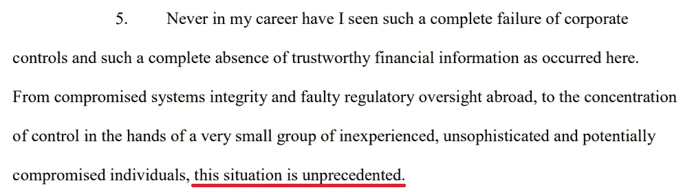

什么事情糟糕到可以用“史无前例”这样一个强烈的词来形容？在尽可能简短的总结中，以下是最有趣的部分:

*   FTX 没有首席财务官、会计部门，也没有董事会。记住，该公司在 1 月份获得软银牵头的 4 亿美元融资后，估值为 320 亿美元。SBF 还为一个体育场的冠名权支付了 1.35 亿美元。
*   SBF 前女友经营的阿拉米达研究公司给了 SBF 10 亿美元的个人贷款。有趣的是，前女友的父亲其实是加里·詹斯勒在麻省理工的前老板。
*   SBF 的业务没有分离。具体来说，在 FTX 的 4 个业务筒仓之间，正如雷指出的那样，“每个筒仓都由班克曼-弗里德先生控制。”

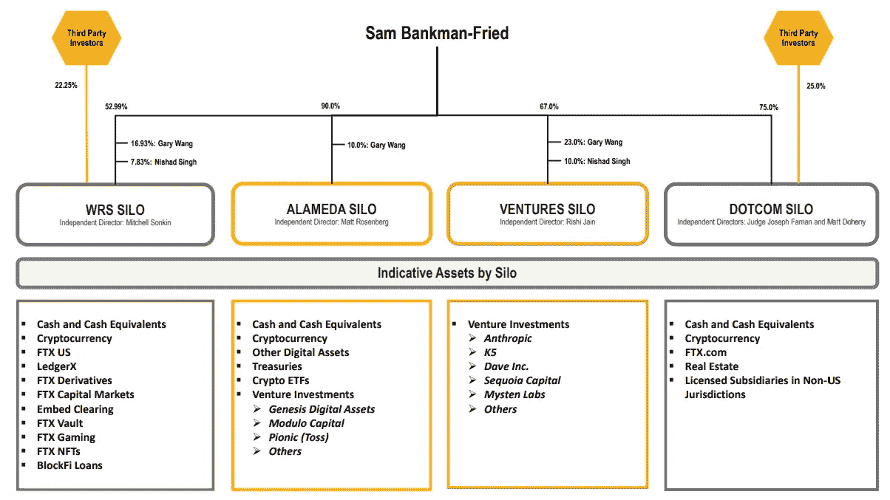

*   SBF 控制了阿拉米达筒仓、一个风险投资筒仓(FTX 风险投资和附属公司)、WRS 筒仓(美国 FTX、莱杰 X 和附属公司)和一个网络筒仓(FTX.com)
*   这些筒仓主任们进行了一场精彩的比赛:SBF 给自己支付了 10 亿美元，尼沙德·辛格获得了 5.43 亿美元，瑞安·萨拉姆获得了 5500 万美元。
*   员工们没有使用会计的概念，而是通过夹杂着表情符号的聊天提交费用。这些信息有一个自动删除标记。
*   没有任何形式的现金管理。据称客户资金被用于购买员工和顾问在巴哈马的财产。
*   没有关于谁被雇用的适当记录。没有适当文件的承包商与雇员混在一起。还有一种可能是，因为无法定位，有些员工是假的。
*   WRS 筒仓资产负债表中遗漏了客户存款。这表明，用户的资金直接流入了行贿基金，不管当时是出于什么目的。

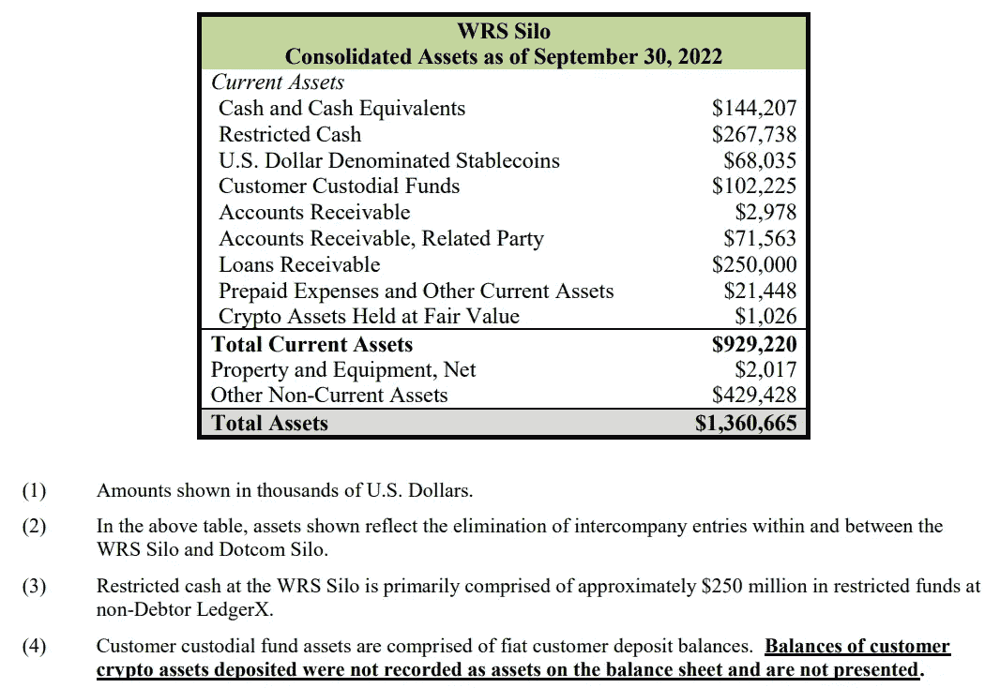

在最近的故事情节中，FTX 周四向特拉华州的美国破产法院提交了一份令人惊讶的索赔申请。显然，巴哈马当局命令 SBF 向他们提供“未经授权的访问”，然后他利用这种访问将数字资产转移到巴哈马政府的监管之下。

这是否意味着所谓的“FTX 剥削者”实际上是巴哈马财政部，他抽走了价值约 6 亿美元的资金？请继续关注这个历史上离奇的故事。

不幸的是，对于 FTX 的顾客来说，SBF 似乎没有一件事没有撒谎。根据第 11 章申请破产保护，流动加密资产的公允价值为 659，000 美元，而不是 SBF 之前对“半流动”资产的 55 亿美元。

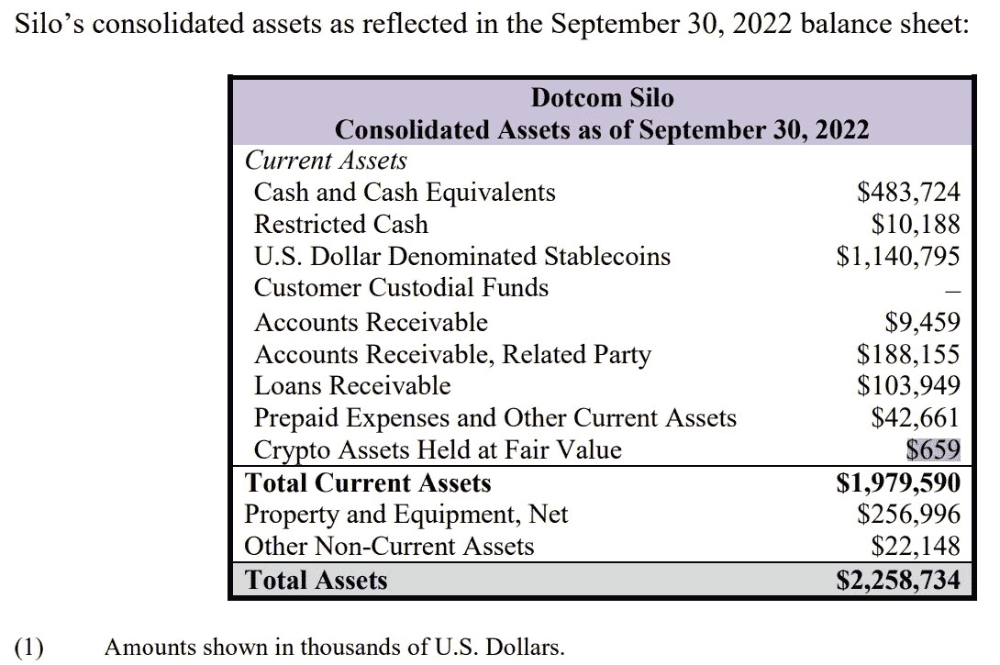

总体而言，手头的现金总额似乎为 5.64 亿美元，远远低于最初报告中的 9 亿美元。

# SBF 虚构的公众形象被揭露

*   山姆·班克曼-弗里德试图解释自己 **(** [**)链接**](https://www.vox.com/future-perfect/23462333/sam-bankman-fried-ftx-cryptocurrency-effective-altruism-crypto-bahamas-philanthropy) **)**

# FTX 崩盘后，散户投资者能指望“聪明钱”流入吗？

随着数百万客户失去他们的 FTX 基金，到处都是破产，一个问题出现了。“聪明钱”的尽职调查在哪里？

多年来，传统媒体已经建立了山姆·班克曼-弗里德作为“加密约翰·皮尔庞特·摩根”的形象，指的是 100 多年前拯救美国银行系统的最初的摩根大通。

媒体也强调了 SBF 的素食主义、节俭和“有效的利他主义”。有时候，这变得很尴尬。

例如，[彭博 4 月份关于 SBF](https://www.bloomberg.com/news/features/2022-04-03/sam-bankman-fried-ftx-s-crypto-billionaire-who-wants-to-give-his-fortune-away?leadSource=uverify%20wall) 的文章标题是“*一个 30 岁的秘密亿万富翁想放弃他的财富*”，强调他开着一辆卡罗拉，睡在一个豆袋上。但与此同时，他给自己贷款 10 亿美元，并在巴哈马拥有价值 4000 万美元的顶层公寓？

事实证明，SBF 的大部分角色都是精心打造的，正如他自己给 Vox 记者的信息所透露的那样。例如，看看 Vox 报道和 SBF 之间的对话，SBF 的话暗示他的整个政治活动(他是乔治·索罗斯的第二大民主党捐款人)是虚假的。

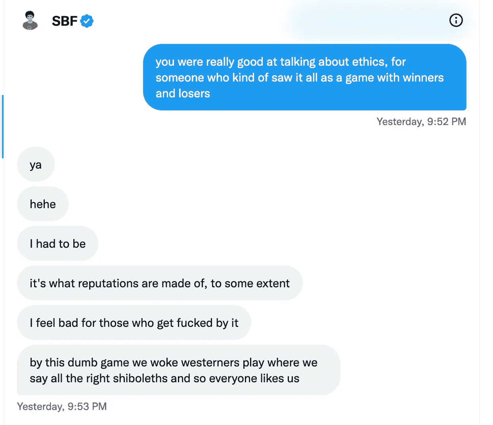

*图片来源:* [*VOX*](https://www.vox.com/future-perfect/23462333/sam-bankman-fried-ftx-cryptocurrency-effective-altruism-crypto-bahamas-philanthropy)

更重要的是，对于违反 FTX 自己的不利用客户资金的用户协议，他们没有自我反省。在 SBF 的思维模式中，似乎唯一值得遗憾的事情就是——输掉比赛。

在此之后，被背叛的投资者提起集体诉讼，目标是 SBF 和名人，其中一些人是:

*   凯文·奥利里
*   汤姆·布拉迪
*   斯蒂芬·库里
*   沙奎尔·奥尼尔
*   大阪直美
*   大卫·奥尔蒂斯

诉讼声称 FTX 利用了“来自全国的不成熟投资者的优势”，要求 110 亿美元的赔偿。然而，指责名人有意义吗？

淡马锡、红杉资本、软银和 MultiCoin Capital 加起来已经向 FTX 投入了数十亿美元。他们都应该有聪明的分析师做他们的尽职调查。然而，似乎几乎每个人都随大流。在后 FTX 危机时期，这种流动似乎还在继续。

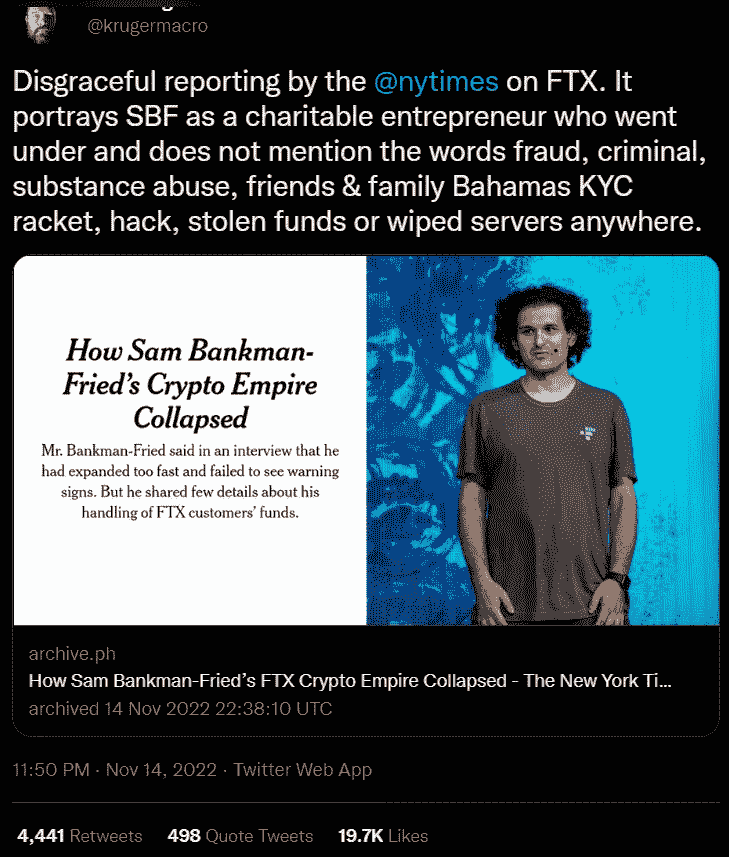

*图片来源:* [*推特*](https://mobile.twitter.com/krugermacro/status/1592288944766750720)

SEC 在行动中的失踪也很能说明问题。10 月份，加里·詹斯勒的证券交易委员会指控金·卡戴珊“非法兜售加密安全”，罚款 126 万美元。但是在三月份[与 SBF](https://twitter.com/15poundstogo/status/1591985946790076416) 会面后，美国证券交易委员会给了他不采取行动的许可。

目前，在 Ripple 诉 SEC 一案中，律师 John Deaton 正在收集一份[请愿书](https://www.crypto-law.us/connect-to-congress/)，要求国会对 Gary Gensler 进行全面调查。请愿书的一些内容如下:

*“现在，有证据表明，在 FTX 价值 140 亿美元的破产之前，Gensler 曾与美国历史上最大的诈骗案之一的主谋 Sam Bankman-Fried 会面。国会议员已经被告知，Gensler 正与 Bankman-Fried 合作，给 FTX 一张监管的免费通行证，而一场大规模的欺诈正在 SEC 的眼皮底下进行。”*

SBF 和詹斯勒在那次会面中到底说了些什么，我们不得而知。Gensler 认为，之前没有公开讨论过的内容，没有被讨论过。其他报道暗示 Gensler 正与 SBF 和 FTX 合作“钻法律漏洞以维持监管垄断”，众议员 Tom Emmer 如是说。

# FTX 疫情继续蔓延

*   Genesis Global Trading 的加密贷款部门停止提款，28 亿美元的活跃贷款 **(** [**链接**](https://tokenist.com/genesis-global-tradings-crypto-lending-arm-halts-withdrawals-2-8b-in-active-loans/) **)**
*   拥有 30 多亿美元的存款，双子赚停停提款 **(** [**链接**](https://tokenist.com/with-3-billion-in-deposits-gemini-earn-halts-withdrawals/) **)**

# 创世纪玷污了双子交换

在本周不幸但不太令人惊讶的新闻浪潮中，我们看到 FTX 病继续蔓延——并推翻了过度杠杆化的纸牌屋。

Genesis Trading 披露，在股市崩盘两天后，它在 FTX 锁定了 1.75 亿美元。在 Genesis 本周三暂停新贷款和提款后，它现在正在寻求 10 亿美元的紧急融资以提高流动性。

Gemini exchange 随后停止了它的 Gemini Earn 计划，因为 Genesis Trading 是它的主要合作伙伴。没有理由认为 Gemini exchange 本身不合适，因为它受到高度监管，并以 1:1 的客户准备金进行审计。然而，当人们看到双子座和双子座“赚”得很近时，银行挤兑就发生了。

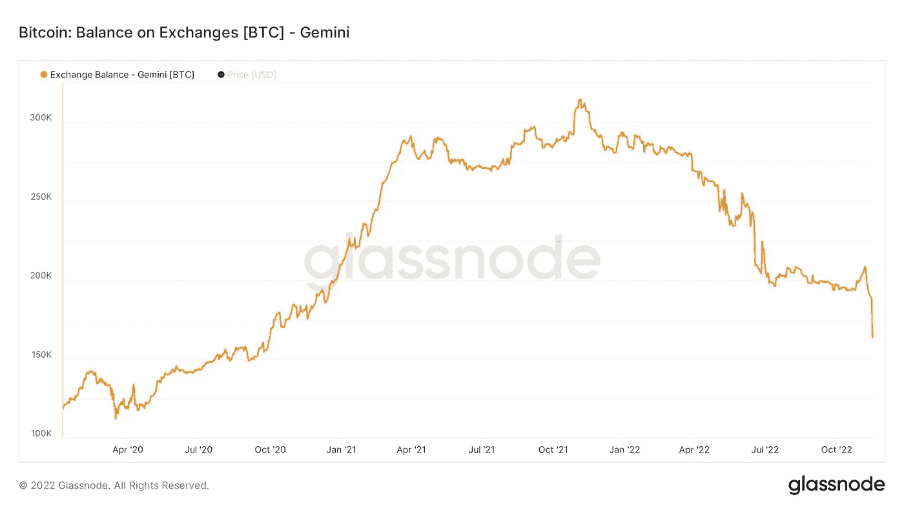

在 Gemini Earn 暂停提款后，Gemini 的比特币流出量大幅下降。图像鸣谢:[*glass node*](https://studio.glassnode.com/workbench/btc-exchange-gemini-netposchange)*。*

一旦 Gemini Earn 计划被暂停，Gemini 的比特币持有者单日提取了约 25，000 BTC，占交易所资金的 13%。

根据分析公司 Arkham Intelligence 的数据，Gemini 的资产负债表在几天内从 22 亿美元缩减到 17 亿美元。从双子座缩小来看，自从 FTX 崩溃以来，超过 220，000 个比特币(约 36 亿美元)已经从交易所撤出。

与此同时，BlockFi 提款仍被暂停，下一步可能是申请破产。在 Terra (LUNA)于 5 月份倒闭后，Bankman-Fried 的 Alameda 用 2.5 亿美元的循环信贷额度拯救了 BlockFi。

所有这些公司有什么共同点？他们提供了数字资产托管之外的服务。相反，用户可以利用他们的加密资产来产生高收益。就像银行一样，当它使用存款来创建贷款项目时。

但是，这里有一个大问题，可以用一个词来解释——再抵押。为了吸引用户，这些平台不能只有 2-3%的收益率。没有。例如，Gemini Earn 的年收益率高达 8%，Anchor Protocol 的年收益率高达 20%，Celsius 的年收益率高达 18%(APY)。

谁能抗拒那种被动收入呢？正如再抵押中的“re”所暗示的，他们都重复使用客户的抵押品作为新贷款的抵押品，以获得那些利润丰厚、吸引客户的 APYs。这将杠杆风险直接注入金融血管，而金融血管在熊市中往往会收缩。

你也知道沃伦·巴菲特是怎么看待杠杆的。

“我的搭档查理说聪明人破产只有三种方式:酒、女人和杠杆，”他说。“事实是，他刚刚添加的前两个是因为它们以 L 开头— ***这是杠杆*** *。”*

[**享受 5MF？点击转发给三个朋友。**](mailto:info@tokenist.com?subject=Check+this+out+&body=I%E2%80%99ve+been+reading+Five+Minute+Finance,+and+I+know+you%E2%80%99d+enjoy+it+too.+It%E2%80%99s+a+weekly+email+that+covers+the+most+important+trends+in+finance.+I+learn+something+new+every+time+I+read+it!+Check+it+out+here:+https://tokenist.com/newsletter/?utm_source=email_gr_btn)

# 不出所料，DeFi 从 CeFi 被侵蚀的信任中获益——但这能持续多久呢？

*   去中心化是趋势:DEX 令牌激增贴 FTX 崩溃 **(** [**链接**](https://tokenist.com/decentralization-is-trending-dex-tokens-surge-post-ftx-collapse/) **)**

# DeFi 会是 FTX 崩溃的一线希望吗？

现在很明显，山姆·班克曼·弗里德把客户的资金当成了乐高玩具，我们该何去何从？

用户可以将数字资产放在哪里，而不会被不为人知地滥用？根据即时反应，答案是明确的——去中心化金融(DeFi)。

一个合适的 DeFi 平台本身就是自我调节的。由于托管在公共区块链上，所有交易都是可见的。由于重大决策必须由该平台的所有令牌持有者投票决定，因此个性怪癖和责任可以变得无害。许多人已经注意到这一点，这一点现在正在显现。

自 11 月 11 日以来，由 Uniswap (UNI)、DyDx (DYDX)、Balancer (BAL)和其他公司组成的分散式交易所(DEX)令牌的表现超过了 CEX 令牌 26%。这并不困难，考虑到他们的 CeFi 同行有班克曼的 FTT 在篮子里。

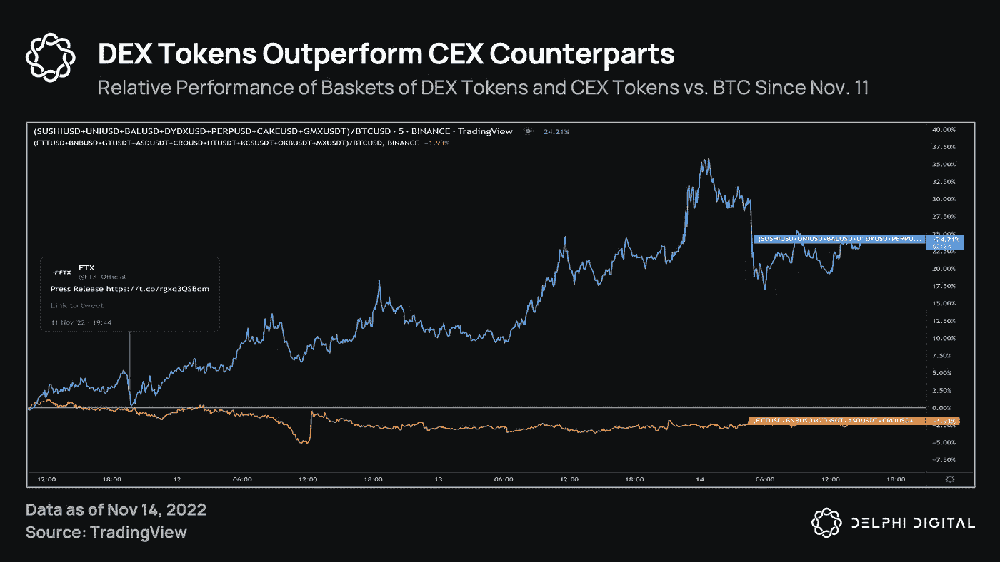

从表面上看，SBF 严重打击了 CEX 代币的可信度。图片来源: [*德尔福数码*](https://members.delphidigital.io/reports/dex-tokens-outperform-cex-counterparts)

同样，在 FTX 股市崩盘后，DeFi 的日营收跃升至 825 万美元。自从 Terra 在 5 月份崩溃以来，一直停滞在 400 万美元的范围内，这是一个重大的上升。

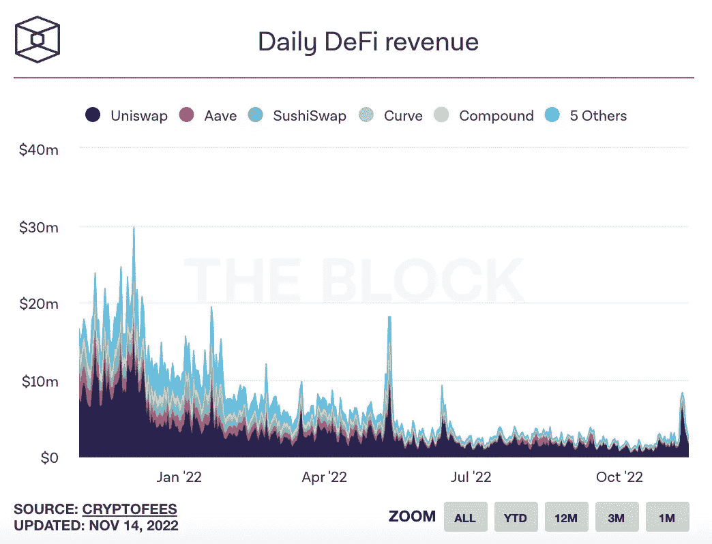

*DeFi 收入激增与 FTX 崩溃后的银行挤兑同时发生。图像来源:* [*区块*](https://www.theblock.co/data/decentralized-finance/protocol-revenue/defi-protocols-revenues)

鉴于这些 dApps 大多托管在以太坊，其链上活动今年首次超过比特币，因为周一以太坊的交易量超过比特币 6.5 亿美元。

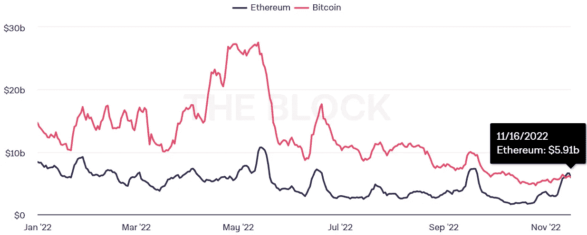

*以太坊 vs 比特币调整后的链上成交量(7 天移动平均线)。图片来源:*

*更能说明问题的是，在 11 月中旬，环比稳定的硬币交易量将创下今年的 ATH 纪录，达到 5325.4 亿美元。显然，SBF 创造的 FTT、地图和 SRM 等硬币刺激人们在菲亚特支持的数字资产中寻求庇护。*

*未来自我监护的上升趋势还有待观察。毕竟，法定货币让消费者习惯于集中信任。没有它，传统的菲亚特系统将永远不会工作。*

**

# *对美国政府债务的信任摇摆不定*

*   *现在重要的是预测衰退的收益率曲线 **(** [**)链接**](https://www.axios.com/2022/11/17/yield-curve-that-matters-is-predicting-a-recession-now) **)***

# *大衰退指标出现*

*奇怪的事情正在发生——收益率曲线正在反转。听起来很无聊，对吧？*

*如果你明白其中的利害关系就不会了。*

*最新数据显示，1 个月期国债收益率为 3.93%，而 30 年期国债收益率为 3.89%。那是什么意思？*

*联邦政府通过允许人们购买其债券来弥补其不足。这种债务可以是国库券(一年以内到期)或债券(一年以上到期)。是的，政府基于承诺筹集资金。*

*只不过，美国政府有国税局和核武器做后盾。作为购买政府债券的回报，投资者得到一个利率——上述收益率。*

*假设你购买了价值 10 万美元的两年期政府债券。两年后，你将从那 10 万美元中获得 4，495 美元。*

*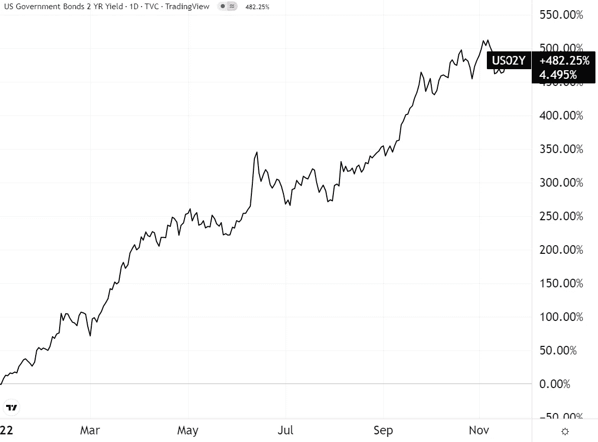*

**年初至今，2 年到期收益率的美国债券。图片信用:* [*交易视图*](https://www.tradingview.com/)*

*虽然没有什么值得大书特书的，但这种收益是由美国政府担保的。现在，考虑购买政府债券的期限范围，从 3 个月一直到 30 年。每个区间都有自己的收益率，生成…你猜对了…收益率曲线。*

*在一个健康的经济体中，收益率曲线会在较长的区间上行。当然会。如果你持有某样东西超过十年，那么你的付出理所当然会得到更高的回报。因此，美国国债收益率曲线应该是这样的。*

*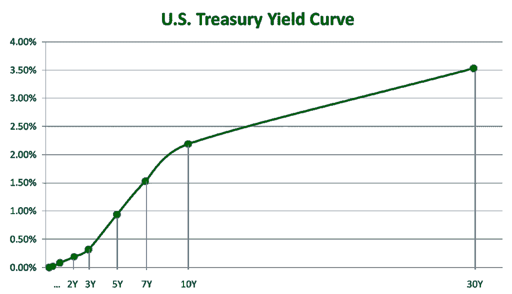*

*健康的收益率曲线。3 个月期和 10 年期美国国债的收益率差目前处于上世纪 80 年代以来的最大值。图片来源: [*美国财政部*](https://home.treasury.gov/)*

*如今，30 年期美国国债收益率为 3.89%，而 1 个月期为 3.93%，收益率出现了反转。这告诉我们什么？投资者不信任政府偿还债务的能力。想象一下，向你的朋友借 1000 美元。如果他给你一个月和 10 年内归还的选择，你会选择哪一个？*

*在宏观经济学中，反向收益率曲线具有超强的预测能力。对于过去的 7 次衰退，它们都预示着所有的衰退，一直追溯到 20 世纪 70 年代。*

*近年来，2019 年 8 月的倒向收益率曲线之后是 2020 年 3 月的衰退，而 2008 年的大衰退之后是 2007 年 8 月的倒向收益率曲线。*

*这只是表明美联储终究不会实现“软着陆”的进一步证据。*

# *本周推特*

*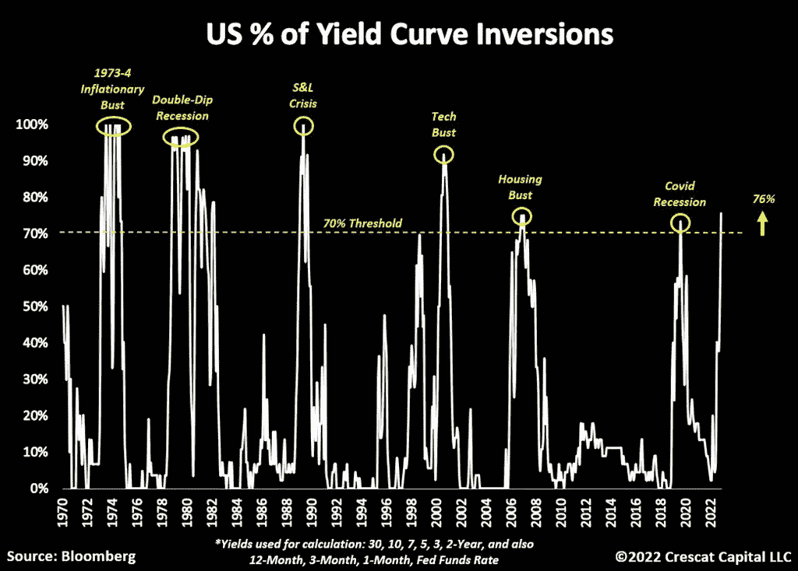*

> *这是正式的。*
> 
> *美国国债曲线现在已经反转了 70%以上。*
> 
> *在过去 50 年的历史中，每当我们超过这个门槛，衰退就会接踵而至。*
> 
> *我们现在是 76%,美联储仍在加息和做 QT。*

*[**@TaviCosta**](https://twitter.com/TaviCosta/status/1593294586599731200)*

> *2021 SPACs:*
> 
> *1) Cazoo，“汽车购买的数字革命”*
> 
> *-98%来自 ATH*
> 
> *2) AppHarvest，“第四次农业革命”*
> 
> *-96%来自 ATH*
> 
> *3)银河，“离开地球去另一个世界”*
> 
> *-91%来自 ATH*
> 
> *4) Luminar，“开创性的自动驾驶技术”*
> 
> *-79%来自 ATH*
> 
> *我们从不学习*

*[**@MacroAlf**](https://twitter.com/MacroAlf/status/1593251201424187392)*

*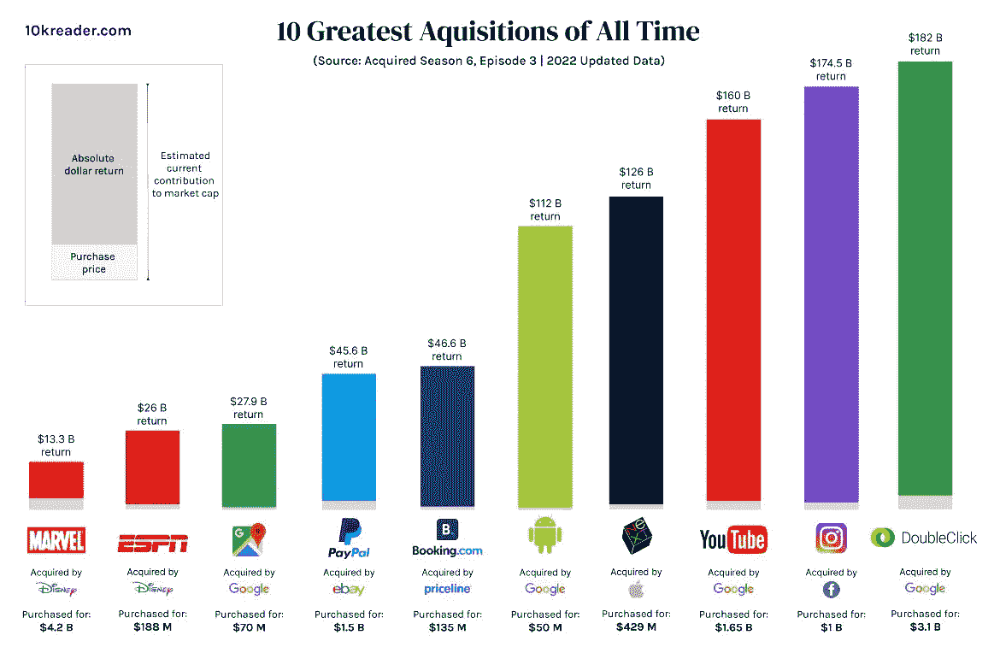*

> *有史以来十大收购*

*[**@ QCompounding**](https://twitter.com/QCompounding/status/1593334659626115073)*

> *灰度比特币信托基金(GBTC)负溢价扩大至 42.7%，ETH 信托负溢价扩大至 40.12%，均创历史新低。灰度表示，它并没有受到创世公司倒闭的影响，创世公司也是 DCG 的子公司。*

*[**@ Wu 区块链**](https://twitter.com/WuBlockchain/status/1593434838110855169)*

> *比特币基地就提供 4%收益率的产品与 SEC 接洽。*
> 
> *他们没有得到澄清。相反，他们受到了诉讼的威胁。*
> 
> *与此同时，Celsius、Voyager 和 BlockFi 被允许在用用户资金赌博的同时提供 10%以上的利息产品。*
> 
> *干得好，加里。*

*[**@scottmelker**](https://twitter.com/scottmelker/status/1592150999523028992)*

# *加入五分钟金融时事通讯。*

**

*[Sign up here — it’s free.](https://tokenist.com/newsletter/)*

**

*[t.me/thetokenist](http://t.me/thetokenist)*

**

*twitter.com/thetokenist*

> *交易新手？试试[加密交易机器人](/coinmonks/crypto-trading-bot-c2ffce8acb2a)或者[复制交易](/coinmonks/top-10-crypto-copy-trading-platforms-for-beginners-d0c37c7d698c)*