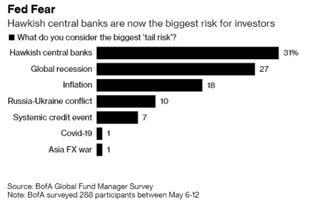
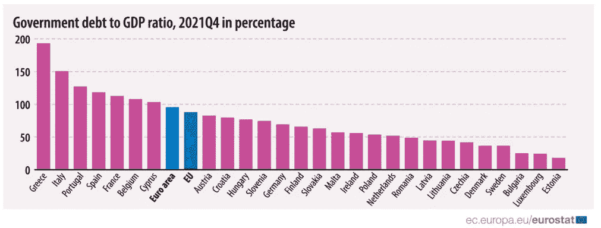

# 五分钟金融:特斯拉售出 75%的 BTC，乙醚上升 40%以上，为什么现金需求高

> 原文：<https://medium.com/coinmonks/five-minute-finance-tesla-sells-75-of-its-btc-ether-up-40-why-demand-for-cash-is-high-ae14dacab253?source=collection_archive---------41----------------------->

# 5 分钟的金融时事通讯——解释发生了什么，为什么。

# 让我们看看这周发生了什么:

*   特斯拉出售比特币:我们知道什么
*   每个人都投入现金:闪烁的衰退信号
*   欧洲:潜在的能源危机，欧洲央行加息，意大利崩溃
*   乙醚上升 40%以上。ETH 2.0 之前反弹不可避免吗？
*   Uniswap 通过自筹资金提案:意味着什么

# 特斯拉出售大部分 BTC

*   特斯拉继续 HODL 100%的 Dogecoin**(**[**)link**](https://tokenist.com/tesla-continues-to-hodl-100-of-its-dogecoin/)**)**
*   特斯拉第二季度出售价值 9.36 亿美元的比特币，仍持有 Dogecoin **(** [**链接**](https://finance.yahoo.com/news/tesla-bitcoin-sale-936-million-210114799.html) **)**

# 为衰退做准备意味着必须做出一些让步

值得记住的是，去年 5 月为比特币牛市踩下刹车的是管理特斯拉的埃隆马斯克(Elon Musk)。马斯克[宣布](https://twitter.com/elonmusk/status/1392602041025843203)特斯拉暂停比特币支付，直到比特币开采变得可持续，这引发了随后几天-25%的价格下跌。

自那以后，比特币采矿委员会报告了比特币迄今为止最大的绿色改造。周二的 Q2 2022 年 BMC 报告显示，比特币采矿使用了 59.5%的可再生能源，比 Q2 2021 年增加了 6%。

*图片来源:* [*比特币挖矿理事会*](https://bitcoinminingcouncil.com/bitcoin-mining-electricity-mix-increased-to-59-5-sustainable-in-q2-2022/)

然而，这似乎不再是一个相关的问题。特斯拉出售了 75%的比特币股份，这是在周三的股东陈述中透露的。价值 9.36 亿美元的 BTC 是亏本出售的吗？是也不是。

特斯拉首席财务官扎克里·柯克霍恩(Zachary Kirkhorn)表示，BTC 75%的股份以已实现收益的价格出售，这意味着它的售价高于最初的购买价格。然而，他也表示，鉴于比特币的价格下跌，净余额导致 1.06 亿美元的损失，抵消了出售。现在，特斯拉在 BTC 的大部分股份已经没有了，如果比特币再次上涨，那么它最初购买的 BTC 剩余 25%的股份将不得不大幅上涨，以弥补迄今为止的损失。

客观地看，在 2021 年 3 月 31 日，特斯拉的比特币持有量价值 24.8 亿美元，净利润高达 12.5 亿美元，是 1 月份投资 BTC 的最初 15 亿美元的 83%。

话虽如此，埃隆马斯克首先也是最重要的是对特斯拉股东负有财政责任。中国的零污染政策导致上海的超级工厂关闭了两个月。这导致特斯拉两年来首次出现季度下滑，其 Q2 2022 报告显示，与 Q1 相比，交付量下降了-18%。

可以预见的是，特斯拉的 BTC 抛售阻止了比特币涨到 24k 美元。展望未来，埃隆·马斯克(Elon Musk)现在将加密货币问题框定为“[的一个小插曲](https://pbs.twimg.com/media/FYNYwOQWIAYDVZ6?format=png&name=900x900)”。在这一插曲中，DOGE 仍然与在特斯拉商店购买 merch 有关。

马斯克本人[此前曾在推特](https://twitter.com/elonmusk/status/1503222294277197829?ref_src=twsrc%5Etfw%7Ctwcamp%5Etweetembed%7Ctwterm%5E1503222294277197829%7Ctwgr%5E%7Ctwcon%5Es1_&ref_url=https%3A%2F%2Ffortune.com%2F2022%2F07%2F20%2Ftesla-sells-75-percent-bitcoin-elon-musk-second-quarter-earnings%2F)上表示，他个人拥有比特币、以太坊和 Dogecoin，并且不会出售它们。目前，还不知道他是否还活着。

# 现金囤积——明显的衰退信号

*   面对 40 年来的高通胀，美国抵押贷款申请大幅减少 **(** [**链接**](https://tokenist.com/us-mortgage-applications-slump-in-face-of-40-year-high-inflation/) **)**
*   持有 2008 年以来最高配置现金的基金经理 **(** [**链接**](https://tokenist.com/fund-managers-holding-cash-at-highest-allocation-since-2008/) **)**

# 无论是技术性的还是温和的，衰退似乎就要来了

历史数据清楚地表明，经济衰退在抑制通货膨胀方面有 100%的成功率。这是用作参考的基线。衰退与通货膨胀相反，是过热经济的降温。因为它全面降低了经济活动，抑制了消费需求，导致价格下降。

需求受到抑制的迹象已经显现。就在两年前，美国 30 年期抵押贷款利率为 2.9%，而房价中位数为 29.4 万美元。如今，30 年期抵押贷款利率为 5.71%，而房价中位数为 41.6 万美元。

因此，对住房抵押贷款的需求已降至 22 年来的最低水平。劳动力不足是另一个需求抑制因素。美国劳工部周四的报告显示，上周申请失业救济人数飙升至 251，000 人，为八个月来最高增幅。

*申请失业救济人数的上升预示着裁员和招聘冻结。图片来源:* [*伊凡诺娃*](https://www.cbsnews.com/news/initial-jobless-claims-highest-in-8-months-2022-07-21/#:~:text=Applications%20for%20jobless%20aid%20for,since%20mid%2DNovember%20last%20year.)

尽管美国经济分析局(BEA)尚未确定技术性衰退，但美国银行已经预测今年将出现温和衰退。美国银行进一步预测明年的失业率将达到 4.6%。

基金经理们正在做相应的准备。事实上，这就是为什么我们在过去几个月里看到了两位数的市场抛售。随着他们减少股票配置，他们增加了现金流。他们的现金持有量增加到 21 年来的最高水平，占 AuM 的 6.1%，而股票达到了 2008 年大衰退以来的最低水平。

自由现金流作为再投资、向股东支付股息和偿还债务的工具，对上市公司来说一直很重要。这一趋势在 5 月份就已经开始了，当时很明显美联储对其量化紧缩(QT)是认真的。

*图片信用:* [*美国银行*](https://www.bankofamerica.com/)

随着我们接近衰退不稳定的顶点，现金持有对于抵消运营成本和为不可预见的事件提供流动性变得更加重要。这可能是特斯拉决定现在出售其持有的大部分 BTC 股份的主要原因之一。

[**享受 5MF？点击转发给三个朋友。**](mailto:info@tokenist.com?subject=Check+this+out+&body=I%E2%80%99ve+been+reading+Five+Minute+Finance,+and+I+know+you%E2%80%99d+enjoy+it+too.+It%E2%80%99s+a+weekly+email+that+covers+the+most+important+trends+in+finance.+I+learn+something+new+every+time+I+read+it!+Check+it+out+here:+https://tokenist.com/newsletter/?utm_source=email_gr_btn)

# 欧洲面临量化紧缩的麻烦

*   欧洲的能源危机是通胀率达到 8.6%的主要原因，而且它可能会变得更糟 **(** [**链接**](https://tokenist.com/europes-energy-crisis-majorly-responsible-for-inflation-at-8-6-and-it-can-get-worse/) **)**
*   欧洲央行 11 年来首次加息，幅度超出预期，令市场感到意外 **(** [**链接**](https://www.cnbc.com/2022/07/21/european-central-bank-raises-rates-by-50-basis-points-its-first-hike-in-11-years.html) **)**

# 能源危机加剧了政治和经济的不稳定

对俄罗斯的制裁严重损害了欧盟的团结。依赖能源的欧洲正面临二战以来从未有过的能源危机。壳牌首席执行官本·范·伯登在牛津举行的极光会议上警告说，欧洲正面临一个“真正艰难的冬天”。他进一步警告“能源价格大幅上涨”和可能的配给。

作为一项紧急措施，德国将点燃 16 座休眠的煤油厂，这阻碍了德国的绿色议程。能源危机导致了欧洲南部和北部之间的摩擦。在欧盟委员会呼吁减少 15%的天然气消费以援助德国之后，希腊、西班牙和葡萄牙拒绝了这一提议。此外，西班牙能源部长抨击了德国:

与其他国家相反，西班牙在能源方面并没有入不敷出

欧洲中央银行(ECB)将利率提高了 50 个基点以抑制通货膨胀，这进一步加剧了欧盟的经济困境。自 2014 年以来，这是欧洲央行利率首次脱离负区间至 0.00%。是的，欧盟的债务如此之高，以至于它采取了负利率来刺激经济。

*图片来源:* [*欧盟统计局*](https://ec.europa.eu/eurostat/documents/2995521/14497745/2-22042022-BP-EN.pdf/90896015-2ac1-081a-2eef-ad8d5f2c0da1#:~:text=At%20the%20end%20of%20the%20fourth%20quarter%20of%202021%2C%20debt,3.0%25%20of%20EU%20government%20debt.)

如今，欧洲央行正在步美联储的后尘，借贷成本正在上升。最新的欧洲央行银行贷款调查显示，随着银行收紧信贷标准，贷款需求略有下降。

*图片信用:* [*欧洲央行借贷调查*](https://www.ecb.europa.eu/stats/ecb_surveys/bank_lending_survey/html/ecb.blssurvey2022q2~ce6d1a4597.en.html#toc5) *。*

最重要的是，意大利政府垮台了。意大利的债务水平仅次于希腊，这给欧元区带来了另一个风险。这使得欧洲央行的平衡行动更加困难。

那么，你如何抑制欧盟 8.6%的通胀率，同时确保企业能够借入他们负担得起的资本，以保持经济运转？这肯定与欧洲央行行长拉加德此前的声明有关，即“*(通胀)预计将在未来一段时间内保持这种状态，*”。

这意味着，在欧元重新设定其对美元的价值后，为了让意大利不成为下一个希腊债务危机，欧洲央行的操作空间非常狭窄。如果有什么不同的话，进一步加息会带来真正的滞胀风险——高通胀和高失业。

为了扩大欧盟的行动窗口，必须做出一些让步。

# 以太坊的关键时刻比以往任何时候都近

*   随着以太坊合并 **(** [**链接**](https://tokenist.com/staked-ethers-discount-dwindles-to-2-as-date-revealed-for-ethereums-merge/) **)** 日期的揭晓，押下以太的折扣降至-2%
*   以太坊合并 Hopium 会继续吗，还是一个牛人陷阱？ **(** [**链接**](https://cointelegraph.com/news/will-ethereum-merge-hopium-continue-or-is-it-a-bull-trap) **)**

# 只有宏观世界站在以太坊的集会道路上

区块链技术使得“在未来拥有股份”变得前所未有地可量化和可获得。处于这一赌注最前沿的是市值第二大的区块链以太坊(Ethereum)。

现在看来，旧的以太坊 PoW 将于 9 月 19 日与新的以太坊 PoS 对接。新的 PoS 被称为 Beacon Chain，拥有超过 410，000 名验证者，他们以大约 4.2%的年利率下注超过 138 亿 ETH。

*图片来源:* [*烽火连锁跑马场。*](https://beaconcha.in/pools)

可以看到，丽都金融是 ETH staking 的主要供应商，份额为 31.4%。利多还使任何人都有可能持有任何数量的 ETH，绕过 32 ETH 的最低要求，这要归功于它的 stETH 衍生物以 1:1 的比例得到了 ETH 的支持。在导致 Celsius Network 和 3AC 破产的加密传染病期间，他们已经撤回了价值 8 亿美元的 stETH，动摇了这一比例。

现在，ETH 2.0 的合并指日可待，6%的 stETH 折扣再次与基础资产 Ethere 保持一致。随着传染势头的减弱，ETH 在过去一个月上涨了+41.8%，跑赢了熊市，仅落后于比特币 12%的温和反弹。

*BTC vs ETH 30 天。图片信用:* [*交易视图*](https://www.tradingview.com/)

然而，外部因素仍可能阻碍这种增长。据一个由 54 名业内人士组成的小组称，ETH 可能在年底前跌至 675 美元。这很大程度上取决于市场对美联储加息的反应，美联储很可能在 7 月 27 日再次加息 75 个基点。

一天后，美国经济分析局(BEA)将公布 GDP 增长预期。如果我们看到另一个负百分比，经济衰退投机的日子将会结束。通常，衰退会给风险资产带来负面压力，如今，风险资产包括所有数字资产。

# Uniswap LPs 可以自筹资金

*   开启 Uniswap“费用开关”的提议获得早期支持 **(** [**链接**](https://thedefiant.io/uniswap-fee-switch/) **)**

# Uniswap“费用转换”提案通过初步测试

在这么多 CeFi 平台因管理不善和过度杠杆化而破产后，是时候让 DeFi 松口气了。Uniswap 是这一领域的先驱，通过自动做市商(AMMs)引领了开放源代码、分散式的加密交换。

AMMs 通过用户自己工作，因为它们将数字资产锁定在流动性池中。它们之所以受到激励，是因为当交易员利用这些资金池交换加密货币时，它们会产生收益。上个月，UNI (Uniswap 的本地治理令牌)的表现甚至超过了以太坊，涨幅为+53.78%。

通过三个以太坊侧链——Polygon、Arbitrum 和乐观——uni swap 在流动性池中持有价值 1.74 亿美元的资产。最近 UNI 兴趣上升的原因是“费用转换”的提议。

正如你可能已经从 GameStop 空头挤压传奇中看到的那样，Citadel Securities 等做市商通过处理大量交易来赚钱。Uniswap 的费用转换将使协议本身赚钱。例如，USDC/联邦理工学院的资金池将成为一个收入来源。

Uniswap 的众多大型流动资金池中的一个，可以通过收取费用进行流动。图片来源:

*迄今为止，用户——流动性提供者(LP)——从这些资金池中获得 100%的费用。收费的改变将使 Uniswap 更接近一家正规公司，将 SEC 的监管目光转向它自己。尽管如此，该提议还是获得了压倒性的支持，350 万 UNI tokens 投票赞成，只有 54 人反对。*

*接下来还有另一个复杂因素。因为交易费用是根据每个池中的代币来命名的，所以必须进行另一次投票来确定最终的代币，它是稳定的代币还是其他什么。*

*无论如何，这是一个大实验的开始，可能会为辛勤工作的开发者建立监管标准和 DeFi 收入标准。*

# *本周推特*

> *美国证券交易委员会列出了九个它认为是证券的加密公司:AMP，RLY，DDX，XYO，RGT，LCX，POWR，DFX，KROM。他们因涉嫌内幕交易而被提及。比特币基地说，100%不同意提出这些证券欺诈指控的决定。*

*[**@ Wu 区块链**](https://twitter.com/WuBlockchain/status/1550261355554701312)*

**

> *早上好，来自意大利，意大利央行在欧洲央行支付系统中的 Target2 负债已经达到创纪录的 6418.2 亿美元，几乎是意大利 GDP 的 30%。除此之外，债务与 GDP 之比已经上升到 150%以上。这给了罗马的任何政府与欧盟足够的讨价还价的权力*

*[**@ Schuldensuehner**](https://twitter.com/Schuldensuehner/status/1550369103340343297)*

> *这一切都发生在本周的中国。1/10 的螺纹*

*[**@ sofiahcbg**](https://twitter.com/SofiaHCBBG/status/1550390246713556993)*

**

> *Vitalik Buterin 声称#Ethereum 在其路线图结束时将有可能每秒处理 100，000 次交易。*

*[@ WatcherGuru](https://twitter.com/WatcherGuru/status/1550205498921828352)*

**

> *#比特币和全球负收益率债务总额的图表非常引人注目。*
> 
> *随着全球资产泡沫桶逐渐干涸，流动性海绵正在流失。有道理。*
> 
> *$BTC 不断制造更高的低点。*

*[**@DylanLeClair_**](https://twitter.com/DylanLeClair_/status/1550198948157063171)*

# *加入五分钟金融时事通讯。*

**

*[Sign up here — it’s free.](https://tokenist.com/newsletter/?utm_source=getresponse&utm_medium=email&utm_campaign=thetokenist&utm_content=%E2%9C%8B%20FMF%3A%20BoA%20Readying%20for%20BTC%2C%20Pot%20Goes%20Federal%2C%20More%20Inflation)*

**

*[t.me/thetokenist](http://t.me/thetokenist?utm_source=getresponse&utm_medium=email&utm_campaign=thetokenist&utm_content=%E2%9C%8B%20FMF%3A%20BoA%20Readying%20for%20BTC%2C%20Pot%20Goes%20Federal%2C%20More%20Inflation)*

**

*[twitter.com/thetokenist](https://twitter.com/thetokenist)*

> *交易新手？试试[密码交易机器人](/coinmonks/crypto-trading-bot-c2ffce8acb2a)或[复制交易](/coinmonks/top-10-crypto-copy-trading-platforms-for-beginners-d0c37c7d698c)*