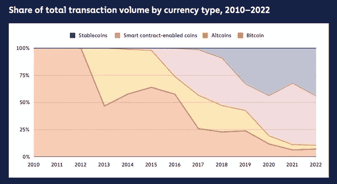

# 五分钟金融:急于提供联邦储备，币安沟 USDC，“衰退”的谈话

> 原文：<https://medium.com/coinmonks/five-minute-finance-the-rush-to-offer-eth-staking-binance-ditches-usdc-recession-talk-55051e540138?source=collection_archive---------25----------------------->

# 5 分钟的金融时事通讯——解释发生了什么，为什么。

# 让我们看看这周发生了什么:

*   九月效应:更多市场抛售的前奏？
*   CBDCs 的崛起:IRL 治理标志正在消失
*   MakerDAO 提议将 16 亿美元 USDC 转移到 CeFi 平台
*   币安“抛弃”USDC:到底发生了什么
*   平台争相在合并前提供 ETH Staking(甚至在美国)

# 九月是不是迎来了一个黑暗的冬天？

*   尚未计入股票价格的预测衰退:贝莱德报告 **(** [**)链接**](https://tokenist.com/predicted-recessions-not-yet-priced-into-equities-blackrock-report/) **)**
*   BTC 跌破 19000 美元，因为 9 月份对股票和密码来说是坏消息

# 到处都在非正式地谈论“衰退”，但没有正式的说法

我们目前正处于衰退吗？如果没有，我们会很快面临一个吗？

从技术上来说，Q1 和 Q2 GDP 连续下降-1.6%和-0.9%，这意味着连续两个季度 GDP 负增长。但是，唯一负责宣布经济衰退的经济机构 NBER 还没有做出正式的“衰退”呼吁，这可能需要 4 到 21 个月的时间。

例如，在 2008 年 12 月，NBER 宣布美国陷入衰退——从一年前的 2007 年 12 月开始。

鉴于 76%的美国人相信衰退已经来临，NBER 何时正式宣布衰退真的重要吗？

让我们看看在确定衰退时考虑的其他一些指标，以及它们目前的位置:

*   失业率已升至 3.7%，为 2 月份以来的最高水平
*   美国的工资每年增长 5.2%
*   通货膨胀，这是由消费者物价指数来衡量的，最近报道的年增长率为 8.5%
*   个人储蓄率(可支配个人收入的百分比)为 5%，为 2009 年以来的最低水平，而消费信贷飙升至 7.7%，为 2011 年以来的最高水平

这些都是助长衰退的因素，因为它们削弱了人们的消费能力，进而削弱了经济活动。另一方面，布伦特原油周三跌至每桶 85 美元，为 7 个月低点。飞涨的能源价格已经全面抬高了价格。

换句话说，需求下降降低了通胀，同时通胀的孪生姐妹能源价格也在下降。

但这足以将通胀率降至 2%而不引发经济衰退吗，这是理想的情况吗？在 9 月 20 日的下一次 FOMC 会议上，Powell 几乎宣布美联储将再次加息 75 个基点。当这种情况在 6 月份发生时，这是自 1994 年以来的第一次，我们都看到了市场的反应:

T2 标准普尔 500 指数和 BTC 对美联储 6 月加息 75 个基点的反应。图片来源: [*交易视图*](https://www.tradingview.com/)

然而，在 7 月份，美联储也将利率提高了 75 个基点，但没有产生这样的下行效应。市场吸收了冲击。

那么，就这样了——加息已经反映在未来的价格中，对吗？

贝莱德可不这么认为。作为世界上最大的资产管理公司和前美联储雇员，贝莱德说，“美联储必须抑制经济中对利率敏感的部分的活动，以使通胀回到 2%的目标。”

这意味着，市场的“利率敏感”方面尚未获得阻力。这些是典型的风险资产——其增长依赖于廉价资本(科技)甚至比特币的公司。鉴于从历史上看，9 月份对比特币和股票来说都是一个糟糕的月份，这不是一个好消息。

*只有在 2015 年、2016 年和 2021 年牛市期间，9 月份对比特币比较友好。图片来源:* [*推特*](https://twitter.com/?lang=en)

暑假结束后，新学年开始时，个人投资者倾向于清算股票，以支付让孩子重返学校的费用，而大型投资者则放弃亏损头寸，以优化他们的税务状况。这种“[九月效应](https://www.investopedia.com/terms/s/september-effect.asp)”正在为新的市场抛售事件积聚动力。昨天，鲍威尔全力以赴，说“*我们不会受政治考虑的影响。*

他进一步指出，他们仍在努力实现他们的双重使命——低通胀和低失业。软着陆或硬着陆都将发生在这些任务之间的平衡中。

# CBDCs: 15 个试点项目上线，印度和巴西最新加入

*   巴西、印度加入 CDBC 竞赛:将于 2022 年开始试点项目 **(** [**链接**](https://tokenist.com/brazil-india-join-cdbc-race-will-start-pilot-projects-in-2022/) **)**
*   委员会共和党人要求美联储副主席布雷纳德澄清关于授权发行 CBDC 的证词 **(** [**链接**](https://republicans-financialservices.house.gov/news/documentsingle.aspx?DocumentID=408412) **)**

# 2018 年以来的 CBDC 发展

在世界各国政府中，央行数字货币(CBDCs)风靡一时。它们对人们的财务提供了前所未有的灵活控制，同时也制造了互联网上的法定货币，以及随之而来的所有支付效率。

在短短的四年时间里，世界从零个活跃的 CBD 和中国的一个试点项目发展到 15 个试点项目和三个活跃的部署——尼日尼亚、巴哈马和东加勒比国家(ECCU)。

*图片来源:* [*IMF*](https://twitter.com/IMFNews/status/1565799233428819968)

巴西和印度也加入了 CBDC 试点项目，这两个国家都是各自大陆的经济和人口大国。

印度(人口 1.3 亿。)将在四家国有银行测试其数字卢比，可能在明年 3 月底推出。

巴西(人口 2.12 亿。)计划在今年年底推出试点项目。

为什么每个人都这么匆忙？首先，因为一个可追踪的 CBDC 可以粉碎灰色(不受监管的)经济，让所有的金融流动都变得负责任。

这将给各国央行提供一个极好的工具来快速调整货币政策。其次，在调整阶段，央行可以设定使用条款——CBDC 代币的到期日，以刺激购物、限制储蓄，或将消费引向某个特定方向。

例如，如果整个欧洲的能源危机恶化，CBDC 可以用来切断所有机构比特币采矿业务，以[拉平用电曲线](https://twitter.com/disclosetv/status/1567462388898594816)。实时指导宏观经济和社会状况的可能性是无穷无尽的。

但美国呢，它会被 CBD 包围，还是一头扎进去？这仍然是模糊的。为了澄清这一点，金融委员会的共和党人昨天致信美联储副主席布雷纳德。他们要求澄清美联储是否有权发行 CBDC，CBDC 是否可以对抗其他数字资产，以及它是否以象征性美元或零售美联储账户的形式出现。

到 9 月底，美国的研究阶段应该终于明确了。

无论情况如何，趋势是明确的，因为世界正在向 CBDCs 发展。批评者认为，这种发展在个人隐私和自由方面做出了重大牺牲。

[**享受 5MF？点击转发给三个朋友。**](mailto:info@tokenist.com?subject=Check+this+out+&body=I%E2%80%99ve+been+reading+Five+Minute+Finance,+and+I+know+you%E2%80%99d+enjoy+it+too.+It%E2%80%99s+a+weekly+email+that+covers+the+most+important+trends+in+finance.+I+learn+something+new+every+time+I+read+it!+Check+it+out+here:+https://tokenist.com/newsletter/?utm_source=email_gr_btn)

# 马克尔道去 CeFi？

*   MakerDao 提出将其在 USDC 的 16 亿美元 PSM 的 33%转让给比特币基地 **(** [**链接**](https://tokenist.com/makerdao-proposes-to-transfer-33-of-its-1-6b-psm-in-usdc-to-coinbase/) **)**

# 为了 DeFi 未来的短期 CeFi 妥协

一个月前，MakerDAO 的联合创始人 Rune Christensen 提议取消支撑多抵押 DAI stablecoin 的 35 亿美元 USDC。Vitalik Buterin 认为这是一个“可怕的想法”,因为它可能会推翻戴的联系汇率制度，导致价值 82.1 亿美元的 MakerDAO 生态系统的清算。

在 USDC 的发行人 Circle 冻结了与受制裁的 Tornado 现金相关的资金和地址后，Rune 受到了这一高风险举措的诱惑。周二，我们看到了这种态度的完全逆转。马克尔道股权持有人发布了 [MIP81 提案](https://forum.makerdao.com/t/mip81-coinbase-usdc-institutional-rewards/17703)，拟将 16 亿 USDC (33%)移交给比特币基地托管。

与 Circle 和 Bitman 一样，比特币基地也是管理 USDC 发行的财团 Centre 的成员。在贝莱德选择比特币基地交易所作为其私人投资者平台后，该交易所本身也在贝莱德的掌控之下。此外，今年 4 月，贝莱德领投了 Circle 的 4 亿美元融资。

让去中心化的精神成为一缕正在消逝的微光，马克尔道得到了什么奖赏？比特币基地的托管计划将为 Maker 带来 1.5%的收益率，相当于每年 2400 万美元。

该提议将支持道的财政部展开其…分散的凤凰翅膀？

*马可道的* [*残局*](https://forum.makerdao.com/t/endgame-plan-timeline-to-free-floating-dai/17529) *提出自由浮动的戴只由 ETH 超额抵押，实现其去中心化的梦想。*

与此同时，马克尔道与比特币基地同床共枕没什么大不了的，因为它已经睡在 USDC 稳定的被窝里了。尽管如此，正如一位成员指出的那样，应该考虑到最坏的情况:

朝廷只要逼拿钱，立刻杀了戴。所以政府更容易理解。比令人毛骨悚然的‘黑名单’更适合现有框架。”

按照目前的速度，提议的情绪是赞成的，因为风险状况与其他选项没有太大不同，但收入增加了。

# 币安的 BUSD 自动转换

*   第三大稳定币发行人币安停止支持更大的竞争对手 USDC **(** [**链接**](https://www.coindesk.com/business/2022/09/05/binance-to-convert-users-usdc-usdp-tusd-into-its-own-stablecoin-busd/?utm_medium=referral&utm_source=rss&utm_campaign=headlines) **)**
*   币安抛弃了一群马贼。即使是一个刚刚被驱逐的发行人也可以接受 **(** [**链接**](https://www.coindesk.com/markets/2022/09/06/binance-ditched-a-bunch-of-stablecoins-even-a-newly-banished-issuer-was-ok-with-it/) **)**

# 币安真的抛弃了 USDC 和其他稳定的同事吗？

币安本周采取了一项积极举措，旨在巩固其作为全球最大加密交易所的地位，该交易所的交易量是其背后的 FTX 交易所的 8 倍。在其平台上，将不再支持 USD Coin (USDC)、Paxos Dollar (USDP)和 TrueUSD (TUSD)进行交易。

仅这三个稳定的公司就有 536 亿美元的市值，来自比特币基地/Circle 的 USDC 占了这三个公司的 96%。

对于币安的美元整合来说，USDT 太大了，而且不完全等同于现金。图片来源: [*Kaiko*](https://twitter.com/Clara_Medalie/status/1567144588036526080)

这对最终用户意味着什么？只有好事。币安会自动将三个 stablecoins 转换成 BUSD。从币安撤回时，用户仍将收到他们实际的 USDC、TUSD 或 USDP 的 stablecoins。目标是扩大币安自身的生态系统及其美元流动性。

反过来说，用户资金可以说变得更安全了，因为 BUSD 是由纽约州金融服务局(NYDFS)监管的。此外，由于低市值 USDP 和 TUSD 的息差是 BUSD 的 10 倍，用户将在自动 BUSD 转换中占据上风。

稳定的货币流动性反映了它们的市场差价。图片来源: [*Kaiko*](https://twitter.com/Clara_Medalie/status/1567144588036526080)

你可能已经注意到，泰瑟(USDT)没有受到影响，主要冲击将前往 USDC。这是币安阻止 USDC 超越 USDT 的一种方式吗？负责发行《USDC》的 Circle 公司首席执行官杰瑞米·阿莱尔认为答案是否定的。他指出“这种变化可能会导致更多的 USDC 流向币安”。

那是因为 USDC 从币安流向 DEX 德克斯现在将被 BUSD 抹油，它仍然不是一个主要玩家。

# 比利时和瑞士银行 SEBA 提供 ETH 赌注

*   以太坊完成合并前的最后一步 **(** [**链接**](https://tokenist.com/ethereum-classic-up-14-weekly-as-ethereum-completes-final-step-before-merge/) **)**
*   密码公司争相在合并前提供以太坊赌注 **(** [**链接**](https://www.theblock.co/post/168271/crypto-firms-rush-to-offer-ethereum-staking-ahead-of-the-merge) **)**

# 贝拉特里克斯完成，巴黎下一个

周二，以太坊的贝拉特里克斯升级上线，这是合并前的最后一次更新。贝拉特里克斯在信标链上实现了老矿工和新的利害关系验证者之间的通信。换句话说，最新和最后一次升级代表了 PoW 链与 PoS 的对接。

最终的对接将是巴黎升级，因为事务执行层也与信标链对接，标志着合并完成。这应该发生在 9 月 10 日至 20 日之间，取决于以太坊的哈希功率后贝拉特里克斯更新。

最新的柜台定在 9 月 15 日星期四。与此同时，15.3%的以太坊客户端还没有为合并进行同步。

*图片由*[*【ethernodes.org】*提供](https://ethernodes.org/)

这些是顽固的矿工，以钱德勒郭为代表。根据期货利息，他们的新旧代币在合并后应该达到 18 美元的价格点，或 ETH 市值的 1.5%。

但是，最大的资本兴趣在于全新的 PoS 以太坊。周三，币安美国分行宣布以太坊以高达 6%的收益率下注。瑞士 SEBA 银行也采取行动提供 ETH 赌注，但对其赌注收益率保密。

6%不仅是 CeFi 和 DeFi 收益率平台的最高水平，也让那些不那么幸运的人接触到了 ETH holdings。要成为一个区块生产验证者，以太坊需要至少 32 ETH 的股份，或 53.4k 美元。

BinanceUS 现在将会以少得可怜的 0.001 ETH(1.67 美元)的价格开始生产农业。虽然 Terra 和 Celsius 留下了一个酸溜溜的赌注，但币安和以太坊都是加密领域最大的玩家，在他们的用户群中建立了多年的信任。

# 本周推特

> #欧洲央行如预期将利率提高 75 个基点。将主要再融资利率上调 75 个基点至 1.25%，将存款利率上调 75 个基点至 0.75%。预计在下次会议上将进一步提高利率。无季度宣布:PEPP 再投资至少运行到 2024 年底

[**@ Schuldensuehner**](https://twitter.com/Schuldensuehner/status/1567850816781881348)

> 1/每当我们发现一个新的代币分配机制，它就开始了下一个牛市
> 
> 2013 年推出新的 PoW 代币
> 
> 2017 年 ICOs
> 
> 2019 年 IDOs
> 
> 2020 年流动性开采和空投
> 
> 2021 NFTs

[**@ thebellcurvepod**](https://twitter.com/thebellcurvepod/status/1567193830893703168)

> 稳定的密码正在缓慢但肯定地成为密码中的主要交易媒介。

[@ paddi _ Hansen](https://twitter.com/paddi_hansen/status/1567090859924930561)

> 以太坊合并计划在 9 月 13 日进行。圣诞节又到了。
> 
> 以太持有者将很快被空投以太力量代币。你应该怎么做才能最好地定位自己？
> 
> 这里有 7 个步骤，你可以考虑充分利用合并:

[**@bobbyong**](https://twitter.com/bobbyong/status/1566616585015422976)

> 1/昨天是拜登关于加密的行政命令的最后期限。
> 
> 以下是我们参与该过程的方式…

[**@kmsmithdc**](https://twitter.com/KMSmithDC/status/1567185596015050759)

# 加入五分钟金融时事通讯。

[Sign up here — it’s free.](https://tokenist.com/newsletter/)

[t.me/thetokenist](http://t.me/thetokenist)

twitter.com/thetokenist

> 交易新手？试试[密码交易机器人](/coinmonks/crypto-trading-bot-c2ffce8acb2a)或[复制交易](/coinmonks/top-10-crypto-copy-trading-platforms-for-beginners-d0c37c7d698c)