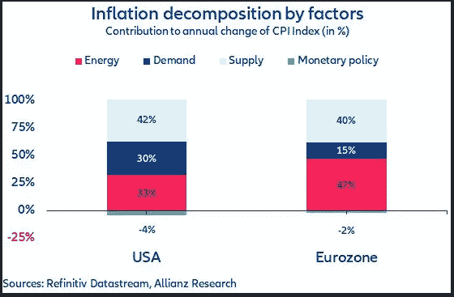
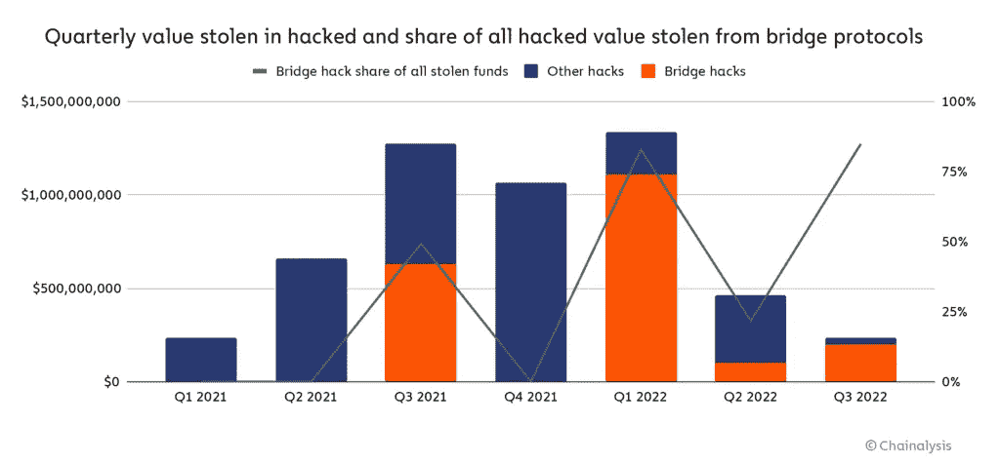
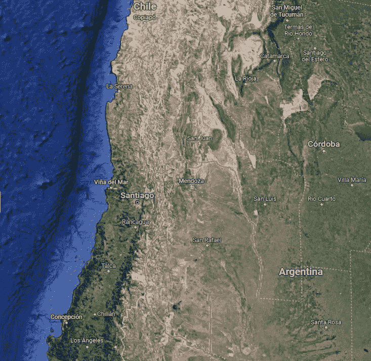
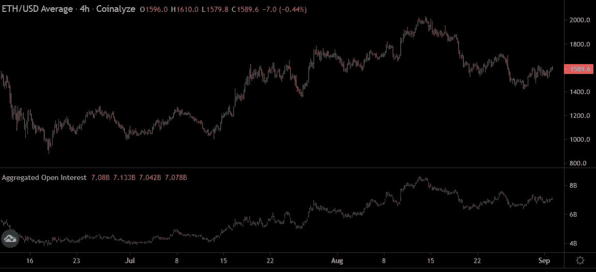
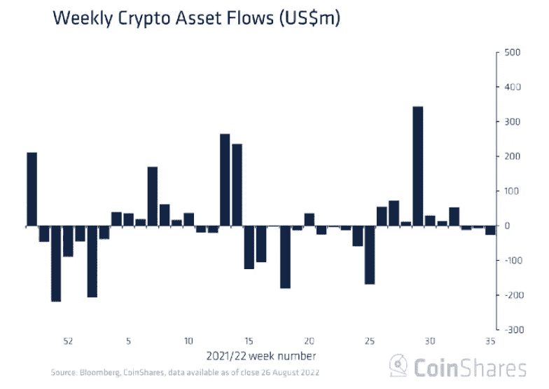
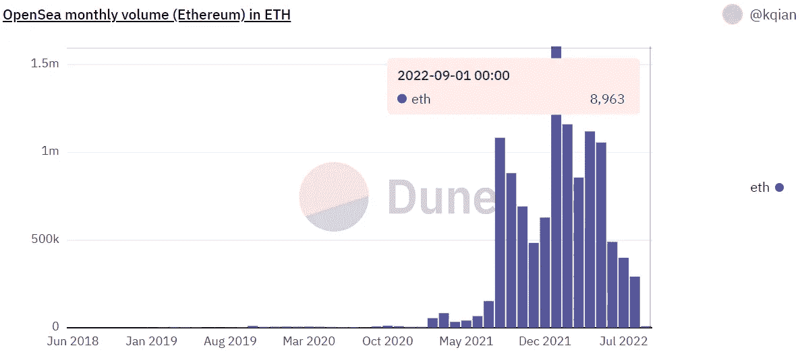
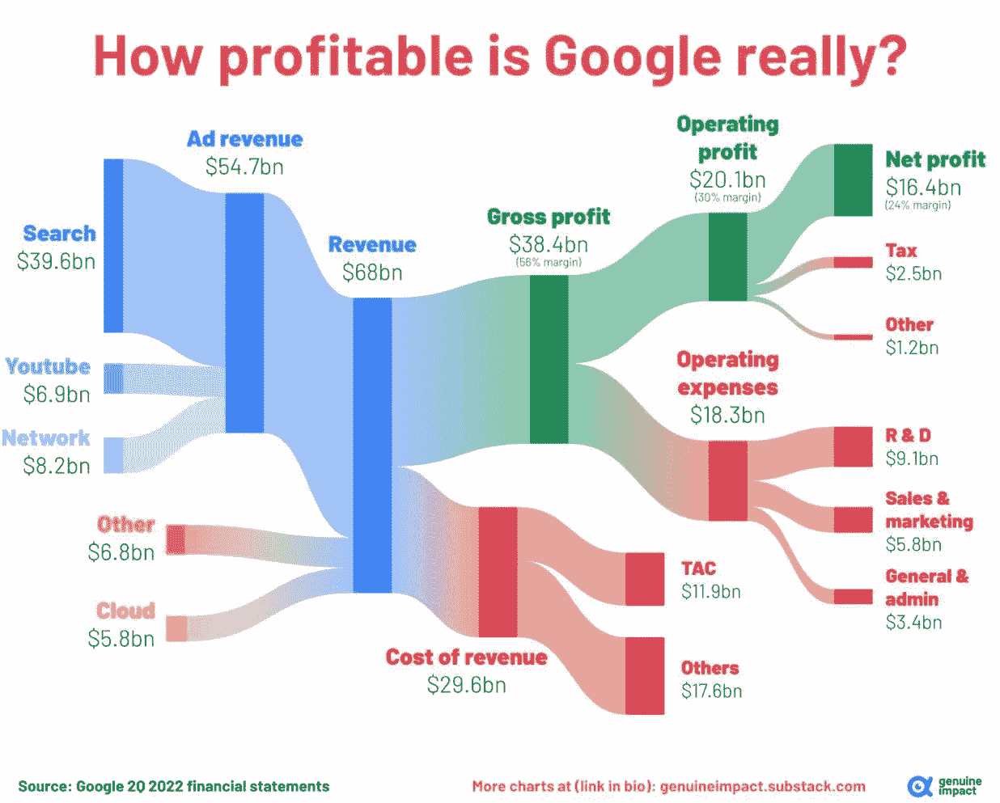
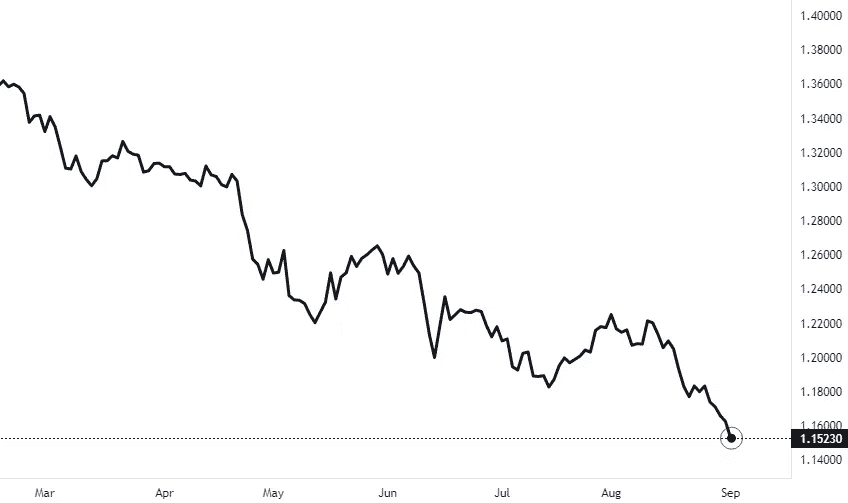

# 五分钟财经:NFTS，合并炒作，TRADFI 试图修复 DEFI？

> 原文：<https://medium.com/coinmonks/five-minute-finance-ticketmaster-nfts-merge-hype-tradfis-attempt-to-fix-defi-f003e63a4462?source=collection_archive---------23----------------------->

# 5 分钟的金融时事通讯——解释发生了什么，为什么。

# 让我们看看这周发生了什么:

*   鲍威尔放弃在杰克逊霍尔软着陆
*   DeFi 黑客侵蚀信心——TradFi 来帮忙？
*   被削弱的国家寻求秘密港口
*   ETH 合并炒作失去动力？
*   NFTs 关闭，但 Ticketmaster 和 Meta 不介意

# 衰退前景依然乐观

*   随着比特币跌破 20k 美元，美元指数创下 20 年新高 **(** [**链接**](https://tokenist.com/dollar-index-hits-20-year-high-as-bitcoin-falls-below-20k/) **)**
*   劳动力市场仍然紧张，但 74%的美国人准备迎接衰退

# 流动性老板:最终的现实仲裁者

如果我们要确定支撑全球经济状况的一个概念，那就是流动性管理。货币来源于单词 **current** 并非偶然。它可以变成激流，也可以变成涓涓细流。

根据一个人当时的市场地位，一个投资者最终可能会血本无归。但是，在过去两年的 5 万亿美元的电流之后，每个人都在通货膨胀中游泳。

在过去的 100 年里，美联储一直掌管着这个流动性阀门。从黄金和股票到石油和密码，美元是所有全球资产的主导货币对。这包括其他国家的货币，以美元强势指数(DXY)表示。

当 DXY 上涨时，比特币通常会下跌，因为美元兑其他货币(主要是欧元)走强。与历史趋势一样，BTC vs. DXY 本周呈现出反向相关性:

*几乎每一次 DXY 峰值之后都是比特币下跌，反之亦然。图片来源:* [*交易查看*](https://www.tradingview.com/)

当美联储主席鲍威尔今年 4 月开始加息时，他开始收紧流动性阀门。因为美元流已经涌入股票，密码和非金融交易，他们的流动性开始撤退，有时高达-95%。

美联储的流动性阀门如此强大，以至于仅鲍威尔的杰克逊霍尔演讲就从股市中抽走了 1.25 万亿美元，这比整个加密市场的市值还多。

欧洲迫在眉睫的能源危机进一步提振了美元的强势。这使美联储处于有利地位，它有更多的回旋余地来抑制需求，即降低通货膨胀。

最近，惠誉评级增加了欧元区衰退的可能性。图片来源: [*安联研究*](https://www.allianz.com/en/economic_research.html)

此外，由于美国就业市场紧张，美联储有额外的加息空间。根据职位空缺和劳动力流动调查(JOLTS)，7 月份的职位空缺比现有工人多 100 万。

这导致雇主支付更高的工资，从而产生通胀效应。早在五月，鲍威尔明确表示他想“降低工资，然后降低通货膨胀”。

所有这些意味着什么？正如杰克逊霍尔演讲中明确指出的那样，更多的加息即将到来。这将进一步消耗股票和密码的流动性。

更糟糕的是，我们已经正式进入 9 月份——这是历史上许多人认为对投资者来说最糟糕的月份。

坚持住。

# DeFi Bugs 和漏洞继续

*   复合报告 Bug 冻结 cETH 借贷市场 7 天 **(** [**链接**](https://tokenist.com/compound-reports-bug-that-froze-ceth-borrowing-and-lending-markets-for-7-days/) **)**
*   基于 Solana 的 DeFi 协议在错误关闭后损失 66.1 万美元 **(** [**链接**](https://tokenist.com/solana-based-defi-protocol-loses-661k-after-shutting-down-by-mistake/) **)**

# TradFi 试图营救 DeFi？

DeFi 在体面方面表现不佳。

8 月，Chainalysis 报告了 13 起跨链桥梁黑客攻击，仅在 2022 年就有 13 亿美元被盗。作为数字资产的智能合同库，等待着从一个区块链转移到另一个，令牌桥已经成为黑客的 piat as。

跨链桥接协议仍然是黑客的常见目标。图片来源: [*链接分析*](https://blog.chainalysis.com/reports/cross-chain-bridge-hacks-2022/)

安全专家承认，令牌桥仍然是试验性的，因为在安全性方面，经过尝试和测试的架构仍然很少。如果所谓的元宇宙是一个区块链网络的网络，用脆弱的桥梁连接它们，大规模采用将不得不被搁置。即使在桥梁之外，代码错误也在打击信心。

周二，Compound 的 lending dApp 升级了其价格馈送，导致 ETH 流动性提供者和借款者之间的交易逆转错误。作为上面的樱桃，包含错误的代码更新由三个代码审计员仔细检查，仍然通过了。

另一个错误发生在本周索拉纳的分散式交易所 OptiFi 上。团队“*意外关闭了 dApp 正在执行的程序*，导致 661，000 USDC 无法恢复。又一次，一个开发者试图升级 dApp，但因为 Solana 太拥挤，所以没有接受。

与此同时，联邦调查局把这个[DeFi 漏洞和错误](https://tokenist.com/fbi-rings-alarm-as-defi-hacks-dominate-crypto-crime-1-3b-stolen-in-q1-2022/)的高峰作为推荐安全预防措施的机会。这些小技巧有用吗？不尽然，因为代码审计和尽职调查的建议并不能保证什么。

然而，这并不意味着 DeFi 的兴趣正在减弱。

前高盛(Goldman Sachs)和罗宾汉(Robinhood)资深人士正在利用他们的专业知识推出一家新的加密初创公司 Sei Labs。刚刚筹集了一轮[500 万美元的种子资金](https://tokenist.com/market-makers-back-ex-goldman-bankers-crypto-startup-focusing-on-improving-defi/)，他们的目标是让 DeFi 交易快如闪电，达到 600 毫秒。他们称目前的事态——以太坊上 5 分钟的交易时间——是 DeFi 的“交易破坏者”。他们正在建立一个专门围绕订单簿而不是“游戏和其他用例”的区块链。

甚至 Solana 的 OptiFi 例子也显示了网络拥塞的危害性。有趣的是，索拉纳的主要投资者 Multicoin Capital 一直在领导 Sei Labs 的资金。

很明显，DeFi 不会很快消失，尽管它有不断增长的烦恼。但是越来越多的迹象表明 DeFi 将成为 TradFi 的一部分，而不是取代它。

[**享受 5MF？点击转发给三个朋友。**](mailto:info@tokenist.com?subject=Check+this+out+&body=I%E2%80%99ve+been+reading+Five+Minute+Finance,+and+I+know+you%E2%80%99d+enjoy+it+too.+It%E2%80%99s+a+weekly+email+that+covers+the+most+important+trends+in+finance.+I+learn+something+new+every+time+I+read+it!+Check+it+out+here:+https://tokenist.com/newsletter/?utm_source=email_gr_btn)

# 被削弱的国家寻求秘密港口

*   阿根廷主要的酿酒省现在接受加密纳税 **(** [**链接**](https://tokenist.com/argentinas-major-wine-making-province-now-accepts-tax-payments-in-crypto/) **)**
*   伊朗扭转局面，批准进口和开采 **(** [**链接**](https://tokenist.com/iran-turns-around-on-crypto-approves-imports-and-mining/) **)**

# 3 个瘫痪的国家，3 个加密的机会

货币贬值的国家并不回避涉足数字资产，这或许是最后的手段。

还记得委内瑞拉石油公司(Petro)的稳定币吗？该币据说是由该国丰富的石油储备支持的。它从未真正起飞，因为委内瑞拉人和外国人都不信任政府的能力。

相反，随着玻利瓦尔在四位数和三位数通胀(7 月份为 137%)中崩溃，委内瑞拉人开始使用分散化的加密货币。截至去年，AAA 报告称 [10.3%](https://triple-a.io/crypto-ownership-venezuela/) 的委内瑞拉人拥有加密货币。

在两倍低的通胀压力下，71%的阿根廷人参与了两倍低的加密采用率，为 5.2%。但是，看到明显的贬值趋势，阿根廷门多萨省敞开了大门，允许使用数字资产支付地区税费。

门多萨省面积 148，827 公里，比希腊还大，但人口只有 190 万。图片来源: [*谷歌地图*](https://www.google.com/maps)

因为一个国家的货币代表其主权和实力，这是一个相当重要的举措。(想想美元对美国当局接受 crypto 征税的反应)因此，有一个警告——crypto 在交给政府之前将被兑换成阿根廷比索。

尽管如此，平板墙的开裂是有目共睹的。伊朗是另一个例子。2019 年，这个受到超级制裁的国家禁止了加密交易，主要是因为比特币采矿对其电网造成了影响。

伊朗的通胀率比阿根廷低，只有 52.2%。但由于制裁，伊朗的秘密入境人数大幅增加，达到 14%。随着加密禁令成为历史，伊朗最新法案授权当地企业在进口商品时使用加密货币。

这并不奇怪。在国家层面，8 月初，伊朗在 cryptos 达成了一笔[1000 万美元](https://tokenist.com/iran-uses-cryptocurrency-for-foreign-trade-in-historic-first/)的进口交易，这是有史以来第一个外贸里程碑。民族国家采用加密技术的趋势表明了数字资产的潜在价值。

在单极世界中，贸易可能由一系列可互换的 CBD 主导，重点是抑制我们今天认为的“加密”。

在一个不那么单极的世界里，失败的货币政策和地缘竞争为无国籍货币敞开了大门。

# 合并炒作已经被消化了吗？

*   尽管合并被大肆宣传 **(** [**链接**](https://tokenist.com/ethereum-funds-recorded-1m-in-net-outflows-despite-the-merges-hype/) **)** ，以太坊基金仍录得 100 万美元的净流出
*   以太坊的收益很可能在合并前被夸大 **(** [**链接**](https://tokenist.com/ethereum-gains-likely-overstated-ahead-of-the-merge/) **)**

# 随着过渡的临近，合并炒作变得温和

以太坊向股权证明的过渡，即合并，既不会降低天然气费用，也不会在短期内加快交易速度。这两项计划都将持续到 2023 年末。那么，最近不停的炒作到底是怎么回事呢？

最近的一些关键绩效指标:

*   上个月，以太坊的表现超过比特币 10%。
*   从 7 月到 8 月中旬，ETH 上涨了约 50%。
*   8 月中旬，以太坊的期货平仓利率飙升至 85 亿美元的历史最高水平。

ETH 越接近合并，炒作背后的力量就越小。图片来源: [*共析*](https://coinalyze.net/ethereum/open-interest/)

流行的理论是，以环境、社会和治理为导向的投资者将增加他们的环境、社会和治理头寸。这是因为股权证明降低了以太坊约 99.95%的能源足迹，因为计算矿工被经济验证机抛弃了。

此外，一些人预计向以太坊 2.0 的过渡将巩固以太坊作为领先的智能合约区块链的地位。

这些方面有望进一步提升 ETH 的价值。

但现在，我们看到的不是投资流入，而是数字资产投资流出。具体来说，连续三周，总计 4600 万美元，以太坊股份下降 100 万美元。

随着 8 月的过去，9 月对数字资产来说通常不太好。图片来源: [*CoinShares*](https://blog.coinshares.com/volume-95-digital-asset-fund-flows-weekly-report-c29bfa5a19df)

年初至今，以太坊获得了价值 2.972 亿美元的投资退出，而比特币获得了 2.758 亿美元的收益。这表明投资者正在坚守阵地，不指望合并炒作。更重要的是，距离合并还有两周时间，这种势头似乎一天不如一天了。

部分原因是宏观经济前景，我们都知道宏观经济前景在 crypto 的价格行为中发挥着重要作用。

在鲍威尔的杰克逊霍尔演讲击败市场后，许多投资者预计进一步下跌或横盘整理，并进一步加息。下一次 FOMC 会议定于 9 月 20 日，而合并的软截止日期就在前一天。

为了不失去信誉，美联储将不得不坚持 2%的通胀目标。

克利夫兰联邦储备银行行长洛蕾塔·梅斯特(Loretta Mester)在谈到最近的工资增长报告时表示，“目前的工资增长与通胀回归 2%的目标不一致。”

紧张的就业市场仍在施加通胀压力，因此未来的涨幅甚至可能超过 75 个基点。

# NFT 市场暂停了

*   Meta 是否在最糟糕的时候推出了 NTFs？ **(** [**)链接**](https://tokenist.com/did-meta-roll-out-ntfs-at-the-worst-time/) **)**
*   Ticketmaster 与 Dapper Labs 合作，将 NFL 大事记制作成 NFTs **(** [**链接**](https://tokenist.com/ticketmaster-partners-with-dapper-labs-to-mint-nfl-memorabilia-as-nfts/) **)**

# 企业体育会复兴 NFTs 吗？

像大多数数字资产一样，非数字电视也无法逃脱市场的普遍下跌。看看广受欢迎的 NFT 市场 OpenSea 就知道了:从 5 月份的峰值开始，该平台的交易量下降了-99%。

占主导地位的 NFT 市场 OpenSea 没有太多工作要做。图片来源: [*沙丘分析*](https://dune.com/rchen8/opensea)

经过几个月的准备，Meta 选择了这个低迷时期，让 NFT 在 Instagram 上分享。Meta 用户现在可以将他们的数字钱包连接到 Meta 或 Instagram，并以 NFT 的形式展示他们的数字羽毛。

但是，就像虚拟现实和元宇宙一样，Meta 的雄厚财力正在进行长期投资。为了让 NFT 市场在恶劣的宏观环境下复苏，联邦天然气费必须保持在较低水平。随着 Surge 的更新，这种情况预计要到 2023 年底才会出现。

与此同时，Dapper Labs 继续与其快速、廉价的流量区块链建立合作伙伴关系，该是为实现高通量和可扩展性而全新设计的。

Ticketmaster 似乎对 Flow 的表现很满意，在过去的六个月里已经铸造了超过 500 万张 NFT，大部分是作为 NFL 的纪念品。随着试点项目的成功，使用 Ticketmaster 生态系统的活动组织者将能够部署流程制造的 NFT。

然而，NFT 不会将票务作为造假工具。Ticketmaster 已经涵盖了这一点:

*“知道谁坐在那个座位上，谁实际上要来会场，与他们直接交流，有一张经过验证的票，能够交易那张票，在那张票上制定规则。我们目前正在这样做。”*

*Ticketmaster 首席执行官迈克尔·拉皮诺*

相反，Ticketmaster NFTs 最普遍的用途可能是出席证明和名人见面会。一个典型的例子是，一张 NFT 的门票被允许与[比利·穆雷](https://nft.coinbase.com/nft/ethereum/0xc4219ce63cec2236a955655951aea9b6f8b2431b/0)一起喝啤酒，最近在一次慈善拍卖中以 119.2 ETH(185000 美元)的价格售出。(尽管我很想说它是，但它不是来自记号主义者的任何人)

因为 NFT 是绑定到唯一钱包的智能合同，可以作为可验证的身份，所以出席证明用例与 NFT 的社会地位方面密切相关。

# 本周推特

> 比特币有……
> 
> 没有魅力领袖
> 
> 没有资助的基金会
> 
> 没有治理令牌
> 
> 没有授权计划
> 
> 没有指导委员会
> 
> 没有伙伴关系
> 
> 没有华丽的办公室
> 
> 没有风投支持
> 
> 没有法律团队
> 
> 无预埋地雷
> 
> 没有路线图
> 
> 没有尺子

[**@ lopp**](https://twitter.com/lopp/status/1565226233025204224)

> 谷歌到底有多赚钱？

[**@ QCompounding**](https://twitter.com/QCompounding/status/1565036701071724544)

> 1/巴比伦金融正在关闭
> 
> 尽管我们做出了努力，但我们仍未能扭转 Rari 黑客攻击造成的负面势头。
> 
> 市场没有帮助。
> 
> TLDR 在下面

[**@ ramonrecuero**](https://twitter.com/ramonrecuero/status/1564994728436719616?s=20&t=sZhHOVaRpU649ds-0OeX6g&)

> 新消息——英镑对美元的汇率正在下跌——一周接一周地向平价靠拢。

[**@ disclosed TV**](https://twitter.com/disclosetv/status/1565353588729462784)

> #美元基本上比任何东西都要坚挺。
> 
> 随着它变得越来越强大，它会对所有资产类别产生破坏性影响。鉴于全球美元计价债务的规模，随着美元走强，对美元的买盘也会增加。这是一个自我强化的循环👇

【T4**@ mnicoletos**

# 加入五分钟金融时事通讯。

[Sign up here — it’s free.](https://tokenist.com/newsletter/)

[t.me/thetokenist](http://t.me/thetokenist)

twitter.com/thetokenist

> 交易新手？尝试[加密交易机器人](/coinmonks/crypto-trading-bot-c2ffce8acb2a)或[复制交易](/coinmonks/top-10-crypto-copy-trading-platforms-for-beginners-d0c37c7d698c)