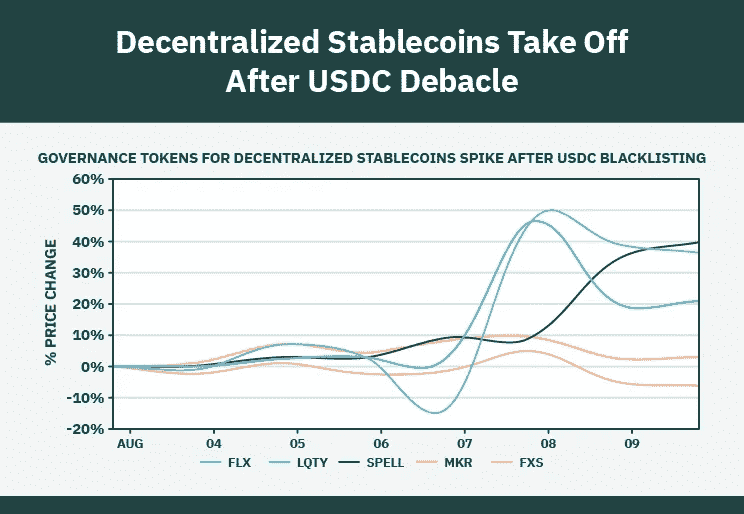
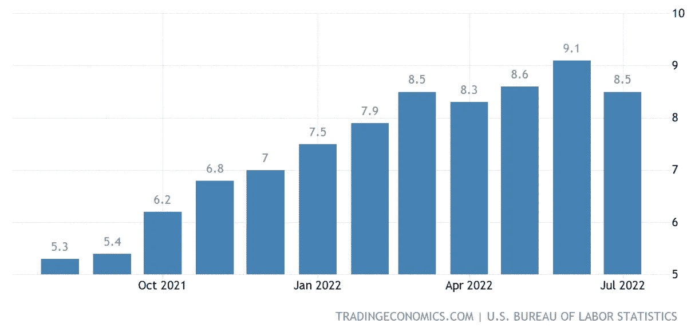
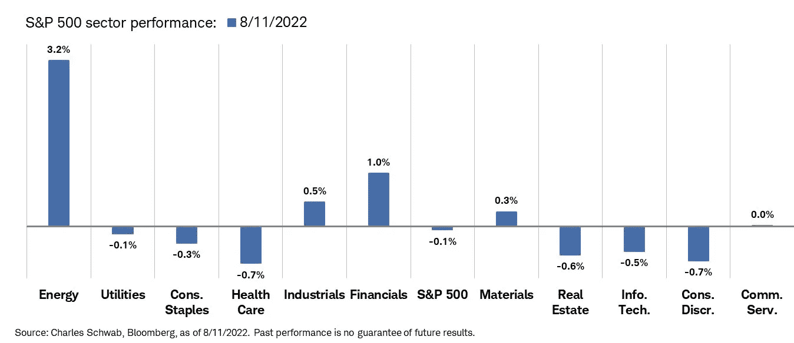
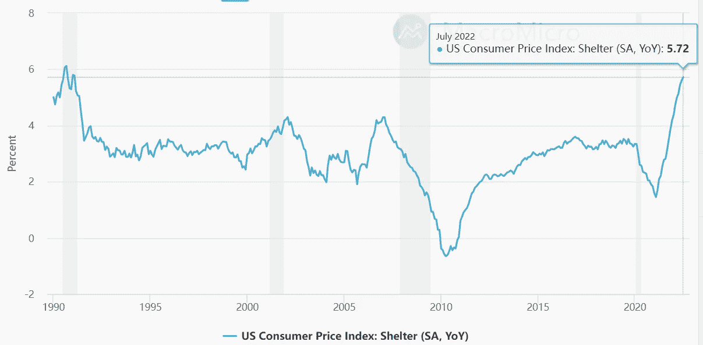
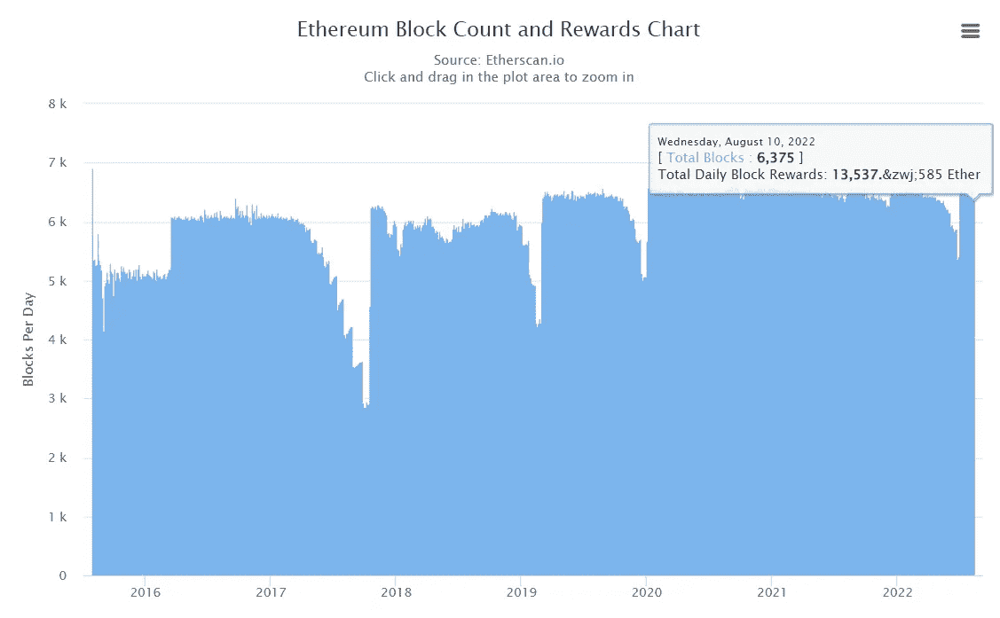
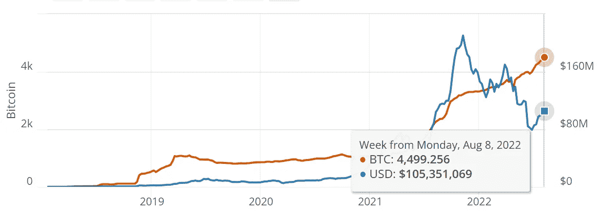
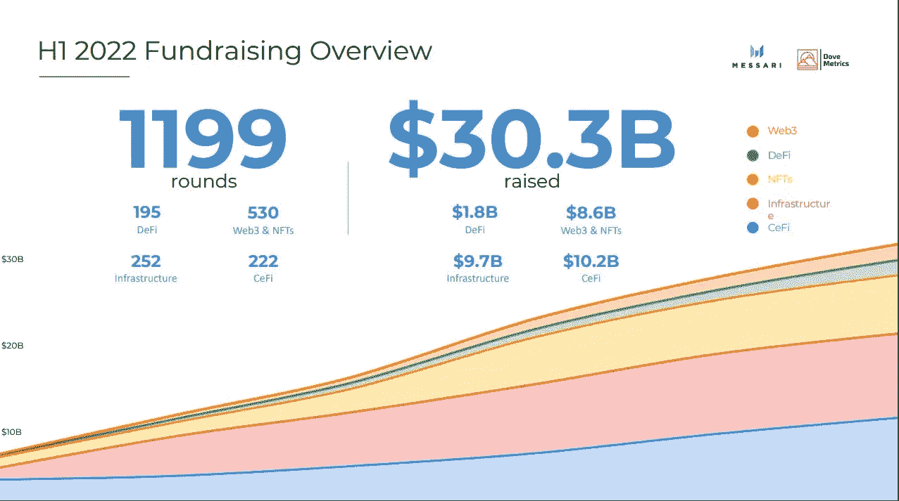
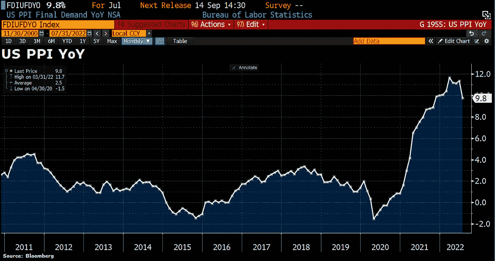
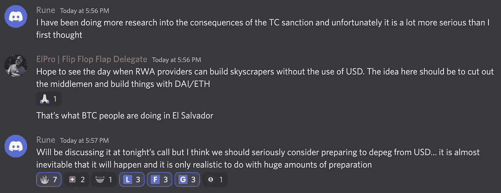
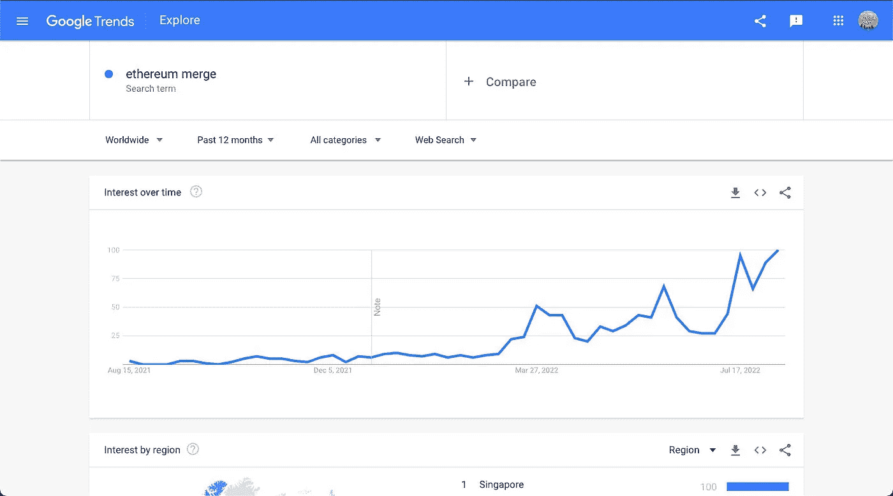

# 五分钟金融:龙卷风制裁，消费物价指数崩溃，瑞士联邦理工学院优于 BTC X3

> 原文：<https://medium.com/coinmonks/five-minute-finance-tornado-sanction-cpi-breakdown-eth-outperforms-btc-x3-971cc6a0bae3?source=collection_archive---------21----------------------->

# 5 分钟的金融时事通讯——解释发生了什么，为什么。

# 让我们看看这周发生了什么:

*   含义:美国财政部制裁龙卷风现金
*   通胀见顶了吗？7 月 CPI 同比 8.5%，市场反应
*   瑞士联邦理工学院的表现优于 BTC x3:下一步是什么
*   贝莱德将推出现货交易的 BTC 信托(已经)
*   Web3 真的是 Web3 吗？

# 龙卷风现金批准，财务隐私处于危险之中

*   龙卷风现金的 USDC 冻结为稳定币审查恐惧增长 **(** [**链接**](https://tokenist.com/tornado-cashs-usdc-frozen-as-stablecoin-censorship-fears-grow/) **)**
*   美国批准的龙卷风现金:禁令对 DeFi 有效吗？ **(** [**)链接**](https://tokenist.com/tornado-cashs-usdc-frozen-as-stablecoin-censorship-fears-grow/) **)**

# 美国财政部批准的开源代码

Tornado Cash (TC)是以太坊区块链上的一个加密货币混合器。通过使交易不可追踪，它允许用户在链上保持匿名。

过去一周，美国财政部决定不喜欢这样。

通过制裁 Tornado Cash，财政部 OFAC 办公室将所有处理 Tornado Cash 的地址列入了特别指定国民和封锁人员名单(SDN)。一旦上了这个名单，任何处理龙卷风现金的人都将面临罚款和最高 30 年的监禁。

由于这种严重的威胁，TC 开源代码的贡献者已经被微软拥有的代码库 GitHub 踢出。此外， [Circle 将连接到 TC 智能合约的 USDC stablecoin](https://twitter.com/jerallaire/status/1557004767930499072) 地址列入黑名单，冻结了约 75k USDC。分散式交易所 dYdX 也受到惊吓，发布了自己的[黑名单](https://dydx.exchange/blog/tornado-outage)。

*Tornado 现金智能合约持有大量资金，人们可以通过这些资金进行匿名转账。图片来源:* [*沙丘分析(@马坡)*](https://dune.com/poma/tornado-cash_1)

鉴于随之而来的黑名单雪崩，这是否意味着龙卷风现金只被犯罪分子用来洗钱？由于区块链固有的透明性，Tornado Cash 提供了许多其他不太“非法”的用例，这些用例在使用传统的 fiat 时可以广泛使用。

也许你想:

*   防止你的雇主跟踪你的加密金融交易。
*   在没有人知道的情况下，向两极分化的事业捐款，以保护发送者或接收者，或保护两者(出生于俄罗斯的 Vitalik Buterin，[承认](https://twitter.com/VitalikButerin/status/1556925602233569280)使用龙卷风现金向乌克兰的防御努力捐款——这正是原因)。
*   捐赠匿名礼物。
*   防止政府或其他机构在法律被修改的情况下跟踪某些金融转移，类似于[推翻 Roe 诉 Wade](https://www.asc.upenn.edu/news-events/news/importance-protecting-privacy-post-roe-world) 。
*   防止跟踪者、邻居、同事(或者你打赌输了的那个朋友)在公共区块链上发现你的密码相关细节。

简而言之，Tornado Cash 使加密转账匿名化，因此它当然也可以用于洗钱。财政部认为这种洗钱的可能性是完全禁止开源代码的充分理由。

从表面上看，许多人认为攻击金融隐私是建立了法律先例。例如，[伯恩斯坦诉 DOJ](https://www.eff.org/cases/bernstein-v-us-dept-justice#:~:text=After%20four%20years%20and%20one,preventing%20its%20publication%20were%20unconstitutional.) 一案确立了代码就是言语，而[联合公民诉联邦选举委员会](https://www.fec.gov/legal-resources/court-cases/citizens-united-v-fec/#:~:text=The%20Court%20ultimately%20held%20in,or%20the%20appearance%20of%20corruption.%22)一案确立了使用金钱本质上是一种言语形式。在美国，言论自由受到第一修正案的保护。

财政部似乎指望多年的诉讼来解决这个问题。与此同时，充满隐私和去中心化狂热者的密码部门的反应是可以预见的:

在 USDC 将 TC 地址列入黑名单后不久，分散治理令牌增加了+40%。图片来源: [*标记师*](https://tokenist.com/decentralized-stablecoins-take-off-after-usdc-funds-frozen/)

虽然 Tornado Cash 无法关闭(实际上)，除非以太坊本身关闭，但它的前端接口可以。通过切断域和 RPC 节点(已经被 Infura 和 Alchemy 阻止)，用户现在更难访问作为 dApp 的 Tornado Cash，它本质上是智能合约的 web 界面。

从更宏观的角度来看，据估计每年有高达 2 万亿美元的法定货币被洗钱。财政部声称，在过去三年中，多达 70 亿美元通过龙卷风现金洗钱，这使得所谓的洗钱影响为 0.1%。

[**享受 5MF？点击转发给三个朋友。**](mailto:info@tokenist.com?subject=Check+this+out+&body=I%E2%80%99ve+been+reading+Five+Minute+Finance,+and+I+know+you%E2%80%99d+enjoy+it+too.+It%E2%80%99s+a+weekly+email+that+covers+the+most+important+trends+in+finance.+I+learn+something+new+every+time+I+read+it!+Check+it+out+here:+https://tokenist.com/newsletter/?utm_source=email_gr_btn)

# 7 月份 CPI 为 8.5%，低于 6 月份的 9.1%:通胀得到抑制？

*   比特币因乐观的 CPI 上涨，但接下来会反弹吗？ **(** [**)链接**](https://tokenist.com/bitcoin-gains-on-optimistic-cpi-print-but-will-a-rally-follow/) **)**
*   美国 7 月份 CPI 为 8.5%，通胀有所缓解 **(** [**链接**](https://tokenist.com/us-inflation-eases-with-july-cpi-at-8-5/) **)**

# 熊市繁荣

所有的投资者都在焦急地等待本周的通货膨胀报告。如果它超过了估计的 8.7%，甚至高于 6 月份的 9.1%，它可能会让美联储加快加息步伐。这将进一步增加资本成本，加剧恐慌，引发市场抛售。

对于数字资产等风险资产而言，这将是毁灭性的，会出现新的底部。今年 1 月，Crypto 的总市值为 2.18 万亿美元，但其中 48%已经蒸发。幸运的是，与通胀相关的紧张局势有所缓解，因为 7 月份的 CPI 报告显示通胀率为 8.5%。

美国通胀率仍处于危险高位，但这一势头似乎在 7 月份已经消退。图片来源: [*贸易经济学*](https://tradingeconomics.com/united-states/inflation-cpi)

在 CPI 利好消息发布后，加密和股票市场都有所上涨。然而，虽然以太坊上涨了+12%，比特币上涨了+4%，但股市的涨幅被医疗保健和消费板块的糟糕表现抵消了。

尽管消费品行业(服装、食品、日常用品)价格上涨，但其表现仍然不佳。由于 22 年来抵押贷款需求低迷，房地产也表现不佳。图片来源: [*丽兹·桑德斯*](https://twitter.com/LizAnnSonders/status/1557832442676903936)

这让我们又回到了原点。我们不要忘记“速率”这个词的意思——持续的动力。通货膨胀率可能已经见顶，但仍处于 40 年来的最高水平。这意味着，即使到 2022 年底月度变化为 0%，CPI 仍将达到 6.3%的年化水平，是美联储 2%目标的 3 倍。

尽管汽油价格已经下降了近两个月，但仍比去年上涨了 44%，而电费上涨了 15.2%，家用食品价格上涨了 13%。尤其重要的是居住成本，因为它占 CPI 权重的 32.77%，并且仍上涨 5.72%，为 1991 年以来的最高百分比。

与大萧条时期不同，今年的住房成本飙升。图片来源: [*宏观*](https://en.macromicro.me/charts/24/cpi-house)

简而言之，为了保持持续的下降势头，核心服务(除食品和能源以外的商品)的价格也必须下降。最后，我们应该牢记过去的大背景。在 21 世纪初的科技泡沫期间，市场大幅反弹是很常见的，但它们最终都创下了新低——更低的高点。

尽管如此，拜登政府将此称为技术性衰退，即软着陆，可能是正确的。毕竟，将 6 月份的通胀率描绘为滞后是正确的，事实证明这是正确的，因为原油价格缓慢回到乌克兰冲突前的水平。无论是哪种情况，都将在第三季度的国内生产总值中揭晓，亚特兰大联邦储备银行的最新预测为正 [+2.5%](https://www.atlantafed.org/-/media/documents/cqer/researchcq/gdpnow/RealGDPTrackingSlides.pdf) ，高于之前报告的+1.4%。

# 以太坊快到了吗？

*   随着合并试运行完成**(******)**)联邦燃气费直线下降**
*   **以太坊在合并前会面临一个战俘岔路口吗？ **(** [**)链接**](https://tokenist.com/does-ethereum-face-a-pow-fork-in-the-road-before-its-merge/) **)****

# **以太坊炒作没有减弱**

**经过多年的拖延，以太坊的风险证明(PoS)灾难(几乎)不复存在了。**

**在成功完成最后一次被称为 Prater/Goerli 的测试后，合并日期定在了 9 月 15 日至 16 日。以太坊成为 PoS 不会带来更低的气费或者更大的可扩展性。这是为了明年晚些时候的激增。**

**但是，它仍然非常重要。通过抛弃矿工，以太坊估计可以减少大约 99.95%的能源足迹。让我们不要忘记以太坊[统治着](https://tokenist.com/ethereum-has-strongest-and-most-reliable-community-web3-developer-report/)dApp 生态系统，尽管从去年开始失去了 33%的 TVL。此外，所有主要的替代 PoS 网络都有通往以太坊的桥梁，就像河流一样汇入最大的智能合约湖。**

**最重要的是，以太坊的代币组学将会彻底改变。正如美联储在过去两年中向我们展示的那样，当它用 5 万亿美元刺激经济时，货币从泛滥的流通供应中贬值。与 Avalanche 或 Cardano 等替代网络不同，ETH 没有最大上限。**

**这意味着以太坊的市值等于其完全稀释后的市值。以太坊的流通供应量目前为 13，500 新以太。换句话说，以太坊的通货膨胀率大概是+4.3%，并不好。在 9 月份的合并之后，这一比例一直下降到 0.4%，为其赢得了“减半三倍”的绰号，作为比特币自身通胀控制的参考。**

****

***所有区块链都通过管理流通供给来缓解需求。PoS 网络依靠验证者发行新的资产作为奖励，其比率通常可以投票决定。图片来源:*[*etherscan . io*](https://etherscan.io/chart/blocks)**

**为什么？因为以太坊大幅提高的能效意味着验证者验证交易所需的 ETH 奖励更少。除此之外，EIP-1559 继续消耗基本天然气费，已经将 258 万 ETH(48 亿美元)投入无法收回的钱包。**

**总之，当一个人把以太坊日益增长的效用、降低的通货膨胀和燃烧机制结合起来时，这意味着以太坊的需求应该超过其供给。**

**每当这种情况发生时，该资产的价值就会大幅增加。至少，这是一些人所期待的。就目前而言，ETH 的表现优于比特币 3 倍。**

****

# **贝莱德推出现货交易的 BTC 信托，但它是私有的**

*   **贝莱德机构直接曝光现货 BTC **(** [**)链接**](https://tokenist.com/blackrock-offers-institutions-direct-exposure-to-spot-btc/) **)****

# **从“洗钱索引”到“最古老、最大的密码”**

**以太坊不是有好消息的数字资产。上周，我们报道了一个重要的加密里程碑:管理着 9.4 万亿美元资产、通常被称为“世界上最大的影子银行”的贝莱德选择比特币基地作为其向数百家投资基金引入比特币计划的推动者。**

**本周，比特币的第二层闪电网络(相当于以太坊的多边形)的支付流量是去年的四倍，达到 1.078 亿美元的新高。**

**全图是什么样子的？**

****

***降低 BTC 价格并没有降低整体 LN 流量。图片来源:* [*比特币视觉效果*](https://bitcoinvisuals.com/ln-capacity)**

**比特币的预言似乎正在成真——它作为支付网络正在取得进展，投资者的活动继续表明它正在成为价值储备，可能是互联网固有的全球储备货币。至少，大型机构投资者是这么认为的，正如贝莱德承认的那样，“一些机构客户表现出了浓厚的兴趣”。**

***“比特币是历史最悠久、规模最大、流动性最强的加密资产，也是目前加密资产领域客户最感兴趣的主题”***

***-贝莱德***

**为了满足他们的需求，贝莱德推出了一只现货交易的 BTC 基金。通过这种方式，机构投资者可以直接获得比特币。多年来，这种 ETF 一直是所有比特币交易者梦寐以求的。相反，SEC 只批准了 BTC 衍生 ETF。**

**虽然这是一个主要的看涨信号，但也是苦乐参半。贝莱德的现货交易基金是私有的，所以散户仍需等待仁慈的美国证券交易委员会。尽管如此，围绕比特币开采的环境担忧似乎越来越少被提及。**

**以前，这是一个常见的批评。**

**如果你记得的话，埃隆马斯克在 2021 年 5 月引发比特币崩盘中发挥了重要作用，当时他认为比特币对特斯拉支付不够环保。嗯，[正是贝莱德本身](https://www.bloomberg.com/news/articles/2021-12-31/how-blackrock-s-invisible-hand-helped-make-esg-a-hot-ticket)在很大程度上推动了 ESG 进入投资领域。现在，我们看到马斯克[称 ESG 是一个骗局](https://twitter.com/elonmusk/status/1526958110023245829)。**

**当收益的前景成为话题时，潮流是如何转变的。**

****

# **网络 3:虚拟人类产业**

*   **FTX 与 Reddit 合作将社区积分放在 Mainnet **(** [**链接**](https://tokenist.com/ftx-partners-with-reddit-to-put-community-points-on-mainnet/) **)****
*   **北京计划到 2025 年利用 Web3 建立一个 75 亿美元的虚拟人产业 **(** [**链接**](https://tokenist.com/beijing-plans-for-a-7-5b-virtual-humans-industry-using-web3-by-2025/) **)****

# **Web3 真的是 Web3 吗？**

**当一个术语被过度使用时，它通常会偏离其原意。**

**这可能发生在 Web3 上。是集权还是分权有关系吗？例如，Reddit 是一个高度集中的平台，但它是最新一个进一步进入 Web3 waters 的平台。**

**Reddit(世界上最大的在线论坛聚合器)在 2020 年引入了社区积分，作为以太坊上的代币，从而进入了区块链游戏。Reddit 用户可以通过发布高质量的内容和评论来获得这些奖励，提高他们的声誉。反过来，这使得他们自己的内容更有可能受到公众的关注，如果它避免被版主删除的话。**

**然而，社区积分没有货币价值，这不应该与*无价值*相混淆。毕竟，任何营销人员都会告诉你，让你的内容潜在地暴露给数百万人是一件非常大的事情。这解释了为什么为一个技术上毫无价值的代币支付汽油费是有意义的。**

**现在 Redditors 可以使用 FTX 支付来方便地支付这些汽油费，对 ETH 加密货币的需求将会更多。**

***“FTX 支付的支付和交换基础设施与 Reddit 社区积分相集成，使客户体验更加无缝，”***

***——FTX 首席执行官山姆·班克曼-弗里德***

**在其他 Web3 新闻中，中国首都北京计划在未来三年内增加 75 亿美元用于 Web3 生态系统。从表面上看，这将是一个高度集权的政府。北京将挑选一些关键公司，他们自己的 Facebooks，来领导数字资产，非功能性交易和治理。**

**然而，这种形式的 Web3 融资与西方由风险投资公司主导的融资没有什么不同。今年上半年，融资额创下 303 亿美元的新纪录，令整个 2021 年蒙羞，2021 年基本上处于牛市。**

****

**2022 年期间，急剧下降的加密市值未能驯服风险投资的兴趣。图片来源: [*梅萨里*](https://messari.s3.amazonaws.com/pdf/H1+2022+Crypto+Fundraising+Report+-+Dove+Metrics+x+Messari.pdf)**

**虽然所有这些都有助于实现预计到 2029 年 1.5 万亿美元的 Web3 市场规模，但并不是加密领域的每个人都同意 Web3 的当前形状。去年，Twitter 前首席执行官杰克·多西[警告](https://tokenist.com/why-does-jack-dorsey-hate-web-3-0/):**

***“你不拥有‘web 3’。***

***风投和他们的有限合伙人会。它永远不会逃脱他们的激励。它最终是一个带有不同标签的集中实体。”***

**多尔西显然认为现有的 Web2 平台和当前的“Web3”前景之间没有什么变化。**

# **本周推特**

****

> **峰值#通胀叙事获得另一个有利数据:美国 7 月 PPI 同比下降至 9.8%，而预期为 10.4%，为 2021 年 10 月 8.9%以来的最低水平。核心 PPI 同比增长 5.8%，为 2021 年 6 月以来的最低水平，为 5.6%。PPI 是本周第二份好于预期的通胀报告。**

**[**@ Schuldensuehner**](https://twitter.com/WatcherGuru/status/1555451855827742720)**

****

> **马克道创始人:“我认为我们应该认真考虑准备与美元脱钩。”**

**[**@ DylanLeClair _**](https://twitter.com/DylanLeClair_/status/1557756594498174977)**

****

> **对#以太网的兴趣正在爆炸！🚀**

**[**@ AltcoinDailyio**](https://twitter.com/AltcoinDailyio/status/1557776578045612034)**

> **市盈率…**
> 
> **亚马逊:128 倍**
> 
> **特斯拉:106 倍**
> 
> **微软:30 倍**
> 
> **苹果:28 倍**
> 
> **谷歌:22 倍**
> 
> **网飞:22 倍**
> 
> **标准普尔 500: 21x**
> 
> **脸书:15 倍**
> 
> **价格销售比…**
> 
> **特斯拉:15 倍**
> 
> **微软:11x**
> 
> **苹果:7 倍**
> 
> **谷歌:6 倍**
> 
> **脸书:4.2 倍**
> 
> **网飞:3.6 倍**
> 
> **亚马逊:3.0 倍**
> 
> **标准普尔 500:2.5 倍**
> 
> **数据通过**

**@ycharts**

**[**@ charliebilello**](https://twitter.com/charliebilello/status/1557537881425592320)**

> **关于戴被支持的风险。**
> 
> **1/在 Cirle 冻结了属于 Tornado cash 的 USDC 之后，许多人对著名的 stable coin 失去了信心。怎么办？也许使用像戴这样分散的替代方案？**
> 
> **没有这么快，不幸的是，大约 50%的戴是由支持的**

**[**@Hypernestdao**](https://twitter.com/Hypernestdao/status/1557999681950605312)**

# **加入五分钟金融时事通讯。**

****

**[Sign up here — it’s free.](https://tokenist.com/newsletter/?utm_source=getresponse&utm_medium=email&utm_campaign=thetokenist&utm_content=%E2%9C%8B%20FMF%3A%20BoA%20Readying%20for%20BTC%2C%20Pot%20Goes%20Federal%2C%20More%20Inflation)**

****

**[t.me/thetokenist](http://t.me/thetokenist?utm_source=getresponse&utm_medium=email&utm_campaign=thetokenist&utm_content=%E2%9C%8B%20FMF%3A%20BoA%20Readying%20for%20BTC%2C%20Pot%20Goes%20Federal%2C%20More%20Inflation)**

****

**[twitter.com/thetokenist](https://twitter.com/thetokenist)**

> **加入 Coinmonks [电报频道](https://t.me/coincodecap)和 [Youtube 频道](https://www.youtube.com/c/coinmonks/videos)了解加密交易和投资**

# **另外，阅读**

*   **[加拿大最佳加密交易机器人](https://coincodecap.com/5-best-crypto-trading-bots-in-canada) | [库币评论](https://coincodecap.com/kucoin-review)**
*   **[火币加密交易信号](https://coincodecap.com/huobi-crypto-trading-signals) | [HitBTC 审核](/coinmonks/hitbtc-review-c5143c5d53c2)**
*   **[TraderWagon 回顾](https://coincodecap.com/traderwagon-review) | [北海巨妖 vs 双子 vs 比特亚德](https://coincodecap.com/kraken-vs-gemini-vs-bityard)**
*   **如何在 FTX 交易所交易期货**
*   **[OKEx vs KuCoin](https://coincodecap.com/okex-kucoin) | [摄氏替代品](https://coincodecap.com/celsius-alternatives) | [如何购买 VeChain](https://coincodecap.com/buy-vechain)**