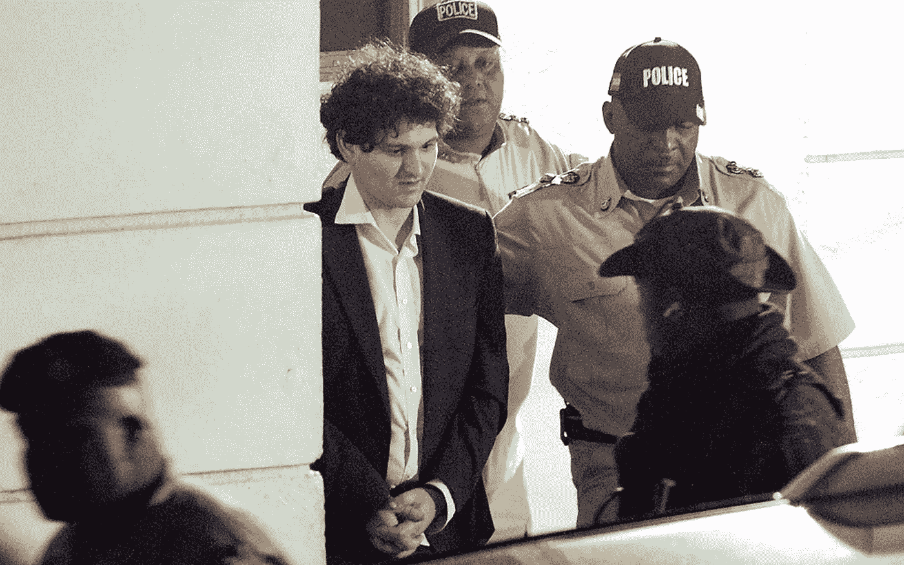
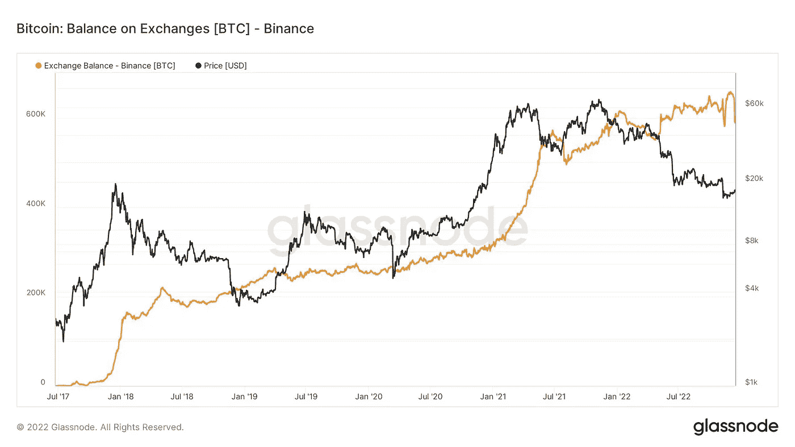
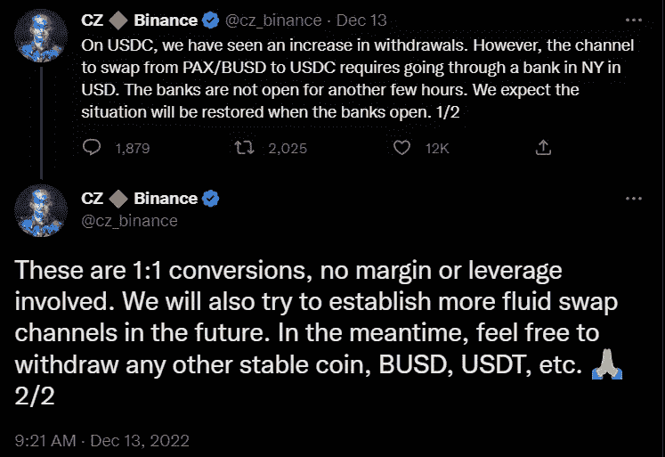
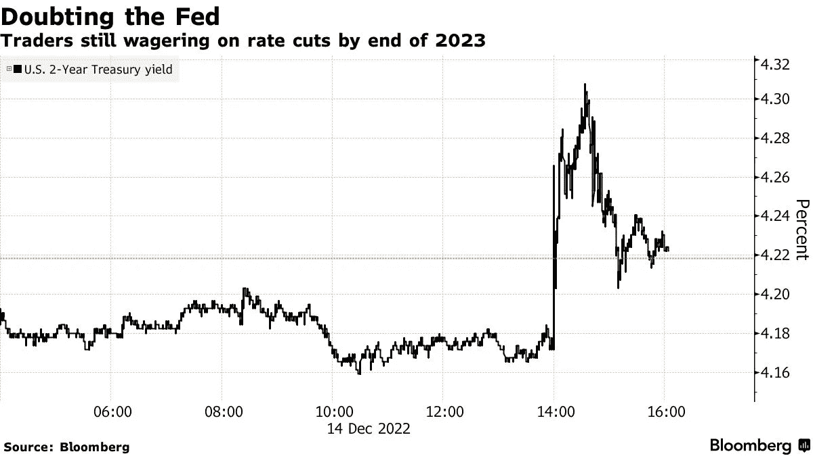
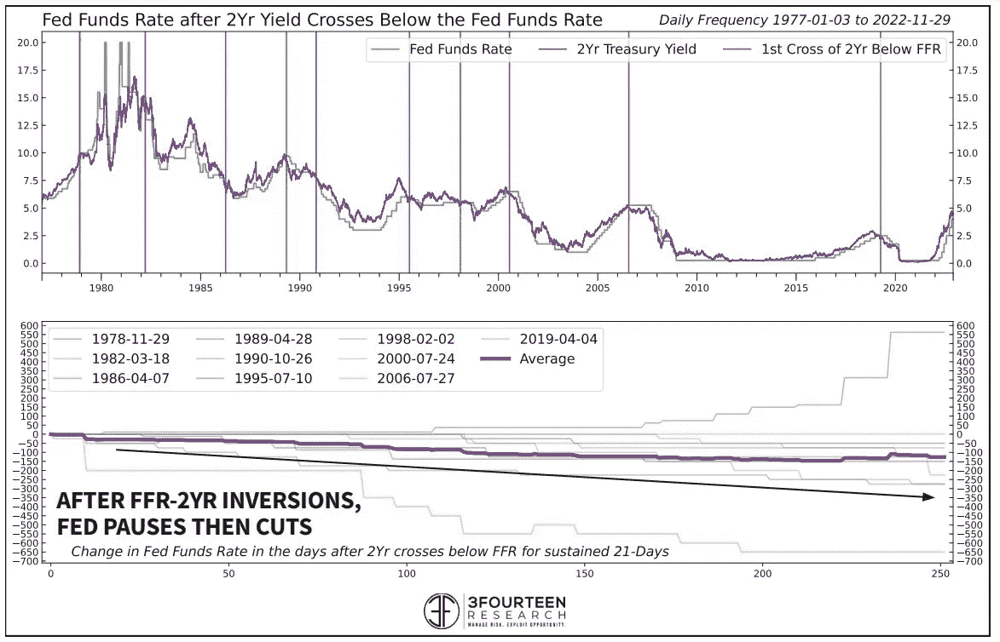
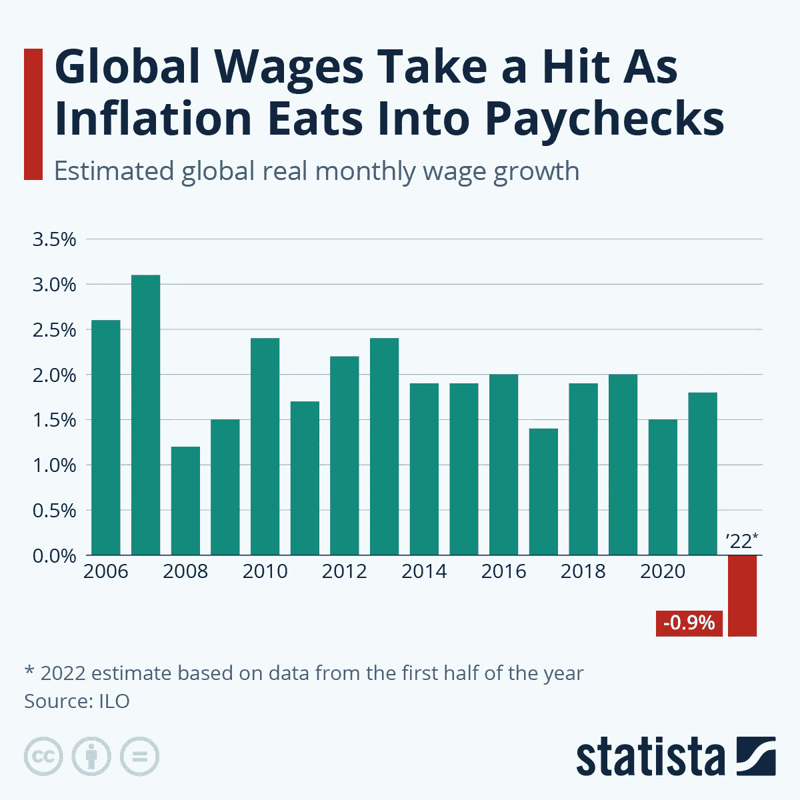
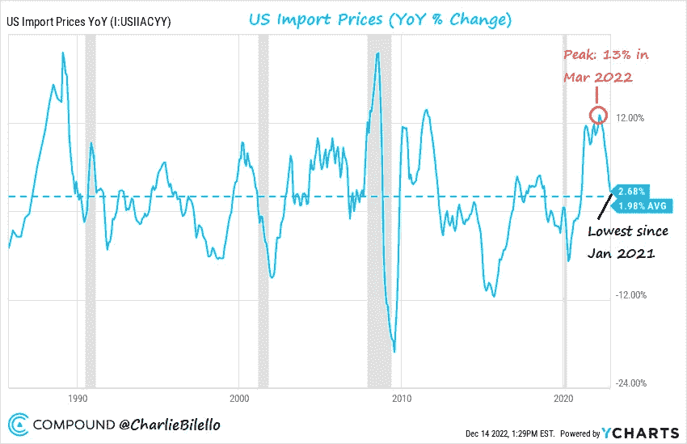
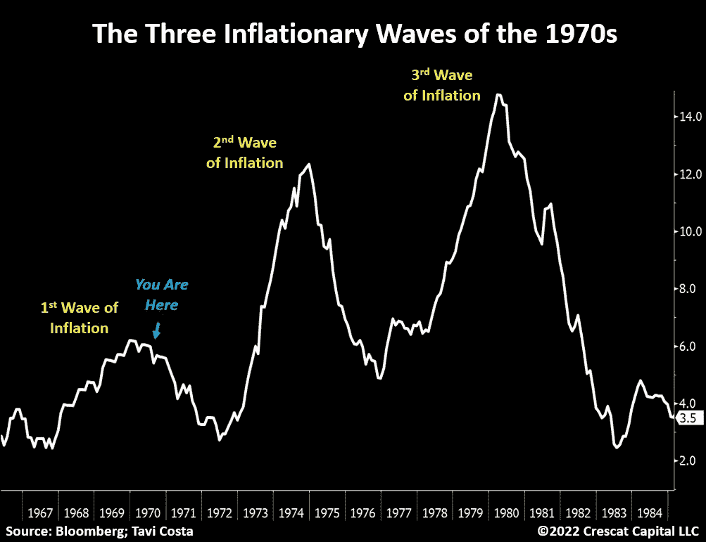
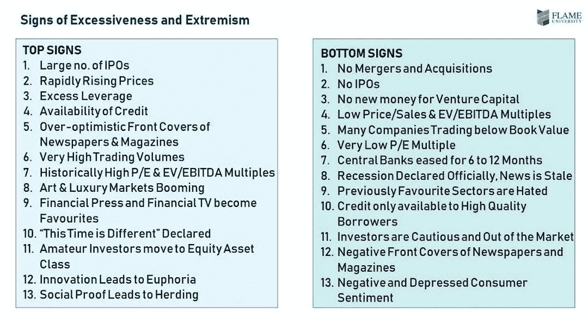
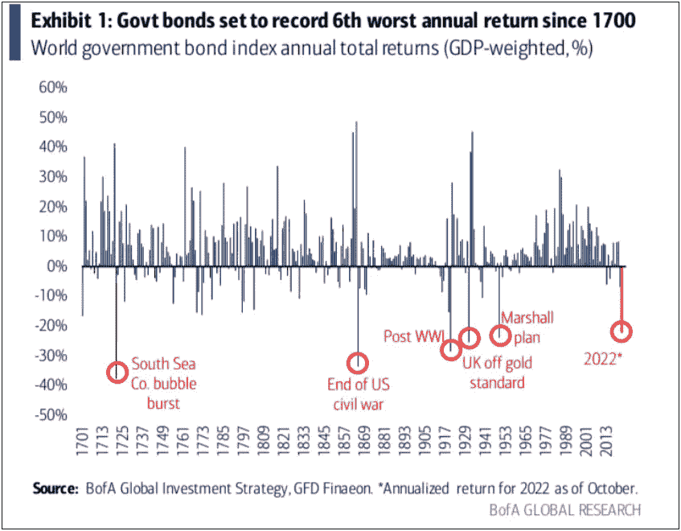

# 五分钟金融:SBF 被捕，币安外流飙升，鲍威尔的言论

> 原文：<https://medium.com/coinmonks/five-minute-sbfs-arrest-binance-outflows-soar-powell-s-remarks-aed4ba226df3?source=collection_archive---------21----------------------->

注册免费的每日时事通讯,永远不要错过宏观金融的突破性发展。

# 5 分钟的金融时事通讯——解释发生了什么，为什么。

# 让我们看看这周发生了什么:

*   SBF 被捕和雷的证词摘录
*   大量币安资金外流:值得关注吗？
*   债券交易员并不真的相信鲍威尔
*   对冲基金正指望更快降息
*   参议员沃伦等人提出数字资产反洗钱法案

# SBF 被捕:现在会发生什么？

*   爆料:SEC 指控山姆·班克曼-弗里德欺诈投资者 **(** [**链接**](https://tokenist.com/breaking-sec-charges-sam-bankman-fried-with-defrauding-investors/) **)**
*   SBF 的核心集团聚集在“电话诈骗”信号集团 **(** [**链接**](https://tokenist.com/sbfs-inner-circle-was-gathering-in-wirefraud-singal-group/) **)**

# 历史性欺诈总结

FTX 坠机一个月后，应美国政府的要求，萨姆·班克曼-弗里德于 12 月 12 日星期一在巴哈马被捕。这是他计划在美国国会作证的前一天。你可以在这里阅读他现在已经取消的[证词笔录，开头是“*我* * * *了*”。](https://www.forbes.com/sites/stevenehrlich/2022/12/13/exclusive-transcript-the-full-testimony-sbf-planned-to-give-to-congress/?sh=1a368a163c47)

然而，对 SBF 的指控数不胜数，而且违背了他那种只是被动地“ *f*****g up* ”的叙述。由加里·詹斯勒领导的美国证券交易委员会(SEC)发表了一份特别声明，称 SBF 的行为是故意的:

“我们指控山姆·班克曼·弗里德在欺骗的基础上建造了一座纸牌搭建的房子，同时告诉投资者这是加密领域最安全的建筑之一”。

现在，一些美国国会议员开始指指点点，很多矛头指向 Gensler。

国会代表汤姆·艾默指出 FTX 从一开始就是个骗子。由于 Gensler 与 FTX 就监管框架进行了多次会谈(Emmer 称只有 FTX 从中受益)，Gensler“将被追究责任”。

Gensler 之前在 Glenn Ellisson 管理的同一个麻省理工学院部门工作，Glenn Ellisson 是 Caroline Elisson 的父亲，Caroline Elisson 是 SBF 所谓的女朋友，负责 Alameda Research。自然，当谈到 SBF 和詹斯勒之间的那些“私人谈话”实际上发生了什么时，这一背景只会起到火上浇油的作用。

此外，就在 SBF 被捕前一周，国会议员里奇·托雷斯[要求](https://twitter.com/AlexanderGrieve/status/1600492078852603916/photo/1)政府问责局调查 Gensler 未能保护投资者免受“FTX 令人震惊的管理不善和渎职行为”的影响

*2022 年 12 月 12 日，巴哈马拿骚的巴哈马皇家警察逮捕了 SBF。图片鸣谢:* [*马里奥·邓坎森/法新社*](https://www.cnbc.com/2022/12/14/ex-ftx-exec-salame-alerted-bahamas-regulators-to-sbf-potential-fraud.html)

不管 Gensler 会发生什么，现在已经有了对 SBF 指控的相关信息。

美国司法部[指控 SBF](https://www.justice.gov/usao-sdny/pr/united-states-attorney-announces-charges-against-ftx-founder-samuel-bankman-fried) 犯有或合谋犯有欺诈罪；阴谋诈骗美国政府；挪用客户存款，串谋诈骗客户；欺诈贷款人；进行证券欺诈和洗钱。最后，他还被指控违反了竞选财务法。

考虑到 FTX 领导层运行了一个他们命名为“Wirefraud”的信号聊天组来讨论公司运营，这些指控似乎不会太难证明。

FTX 破产管理人约翰·雷在国会前总结了形势，在 SBF 本应出席的听证会上:

*   首先，来自 FTX.com 的客户资产与来自阿拉米达交易平台的资产混合在一起。
*   其次，阿拉米达利用客户资金从事保证金交易，使客户资金面临巨大损失。
*   第三，FTX 集团在 2021 年底至 2022 年期间进行了一场支出狂欢，在此期间，大约花费了 50 亿美元购买了无数的企业和投资，其中许多可能只值支付的一小部分。
*   第四，向内部人士提供的贷款和其他付款超过 10 亿美元。
*   第五，Alameda 作为做市商的业务模式需要将资金部署到各种第三方交易所，这本身就不安全，而且某些外国司法管辖区提供的有限保护进一步加剧了这种情况。

最后，SBF 的刑期是多少？

根据类似的案例，仅电信诈骗一项指控就可能使他入狱 20 年，这只是 8 项指控中的一项。例如，伯尼·麦道夫承认了 11 项重罪，其中三项 SBF 被指控:洗钱、电信诈骗和证券诈骗。

麦道夫被判 150 年徒刑。如果 8 项罪名都成立，SBF 可能会被判 100 年监禁。但是，我们都知道，最高刑罚很少被宣布。

那么，这期间会发生什么呢？

SBF 被拒绝以 25 万美元保释的请求，所以他正在巴哈马的福克斯山监狱服刑，该监狱是世界上唯一一所因过度拥挤和恶劣条件而被评为最差的监狱。他将被关押在那里，直到美国定于 2023 年 2 月 8 日举行的引渡听证会。

目前，SBF 反对引渡，尽管巴哈马监狱条件恶劣。为了“正常”运作，他告诉法官，他每四小时需要 10 毫克的 adderall。

# 币安资本外流飙升:投资者只是在谨慎行事吗？

*   币安暂停了 USDC 的提款，因为两天后资金外流激增至$ 2B**(**[**链接**](https://tokenist.com/binance-pauses-usdc-withdrawals-as-outflows-surge-to-2b-in-2-days/) **)**

# 资产逃离币安

许多投资者显然担心币安。

数字资产持有者正纷纷撤回资金。南森分析公司报告称，截至本周三，已有价值 36 亿美元的资金从币安撤出。

*币安的比特币持有量本周经历了大幅下降，因为约 88%的 BTC 供应现已脱离交易所。图片来源:*[*glass node*](https://glassnode.com/)

为什么围绕币安的恐慌？这仅仅是来自 FTX 的创伤后应激障碍吗——还是有理由如此担忧？

一个挥之不去的因素是由 Mazars 进行的币安审计。虽然审计显示币安有 100%以上的抵押，但审计最终未能安抚市场参与者。

马萨自己的报告没有“表达意见或保证结论”，这意味着它不能完全担保币安提供给该公司的数字。这一点已经被关心的加密本地人指出。

也是在过去的一周，币安暂时停止了 USDC 的撤资:

*图片来源:* [*推特*](https://twitter.com/cz_binance)

此后不久，USDC 的撤军又恢复了。

但是，我们都知道，当投资者试图将资金撤出 FTX 时，收到类似的“取款失败”或无休止的“取款处理”消息会发生什么。

结果，这进一步加剧了围绕币安的恐慌。

雪上加霜的是，币安因涉嫌洗钱而接受调查的报道再次浮出水面。这些报告最初出现在 2018 年。

周一，路透社发表了一篇标题为“*独家报道:随着加密世界步履蹒跚，美国司法部在指控币安问题上意见不一”的文章。以下是一些“独家”报价:*

*“至少六名参与此案的联邦检察官中的一些人认为，已经收集的证据证明有理由对交易所采取积极行动，并对包括创始人赵昌鹏在内的个别高管提出刑事指控，其中两名消息人士表示。消息人士称，其他人则认为需要时间来审查更多证据。*

关于这个案子，没有透露多少消息

*“司法部可以起诉币安及其高管，协商和解，或者不采取任何行动就结案。”*

*“新的报道显示，该案件在币安存在的五年中的大部分时间里一直笼罩在阴影之下”*

虽然文章本身没有什么实质性的进展，但这样的标题肯定足以吸引眼球。

在币安和加密领域发生的所有事情中，这一消息达到了高潮，并在整个加密市场进一步传播冲击波，引发了投资者的更多恐惧。

迄今为止，币安的首席执行官将最新的 FUD 视为一次“压力测试”。他鼓励用户通过 TrustWallet 取回自己资金的托管权，使人们能够持有自己的私钥，而不是交易所。

随着一些不确定性笼罩币安，尽管目前没有任何明显的危险信号，但投资者似乎宁愿“谨慎行事，而不是后悔”。

在我们刚刚目睹——并将继续目睹——FTX 的一切之后，你真的能责怪他们吗？

# 鲍威尔将利率带入 2 年期国债收益率区间

*   鲍威尔宣布 2022 年最后一次 FOMC 会议加息 50 个基点 **(** [**链接**](https://tokenist.com/powell-announces-50bps-interest-rate-hike-in-2022s-final-fomc-meeting/) **)**
*   美联储能否在 2023 年将通胀率降至 2%的目标？ **(** [**)链接**](https://tokenist.com/can-the-federal-reserve-bring-the-inflation-rate-down-to-its-target-of-2-in-2023/) **)**

# 债券市场称鲍威尔鹰派虚张声势

又是一个月，又是一次 FOMC 会议，来推动市场，塑造我们的经济现实。

出乎意料的是，美联储主席杰罗姆·鲍威尔(Jerome Powell)在 12 月份将利率提高了 50 个基点，使利率达到 4.25%-4.50%的区间。这打破了连续四次加息 75 个基点的局面，今年以来，连续四次加息使标准普尔 500 (SPX)下跌了-18.71%。

自周三 FOMC 会议以来，标准普尔 500 指数下跌了 4.2%。通常情况下，市场会积极接受确认的加息减少。但正如我们上周所指出的，由于经济衰退的可能性越来越大，市场正在超越美联储的直接举措。

尽管核心通胀(不包括波动较大的食品和能源)逐月下降，但年通胀率仍高达 6%。这比美联储最终 2%的通胀目标高出 3 倍。

美联储主席鲍威尔消除了潜在的加息支点，他说:

“在我们确信通胀正在持续下降之前，我不会看到委员会降息。”

但是鲍威尔的数学有意义吗？为了实现这一目标，他预计到 2023 年底基金利率将达到 5.1%。他还表示，降息将在 2024 年提出，但目前的通胀下降率将在明年夏天提出降息。

为了确保通货膨胀趋势继续下降，鲍威尔仍然希望抑制工资。这意味着更高的失业率，这是衰退的关键标志之一。毕竟，被压低的工资抑制了需求，最终降低了通胀。当被直接问及工资增长是否是逆风时，鲍威尔谈到了他的理由:

“我们希望工资大幅增长。我们只是希望它们保持在与 2%的通胀率一致的水平。现在……工资远远高于 2%的通胀率。”

这可能是上周 FOMC 会议后市场下跌的罪魁祸首。鲍威尔似乎准备好了冒着经济衰退的风险来扑灭最终的通货膨胀。他的话看起来是在为它准备宏观地形:

“我认为没有人知道我们是否会陷入衰退，如果会，也不知道会不会很严重。只是这是不可知的。”

债券市场(政府债券)对鲍威尔的鹰派立场并不太买账，预计明年会降息。这一点通过 2 年期国债收益率得到了体现。通常，当投资者对经济失去信心时，或者当他们预计美联储将通过降息来刺激经济时，利率就会下降。

*美国 2 年期国债收益率飙升，但在鲍威尔的新闻发布会后有所下降。图片来源:* [*彭博*](https://www.bloomberg.com/news/articles/2022-12-14/bond-traders-dismiss-fed-s-hawkish-tone-bet-on-2023-rate-cuts)

而且理由很充分。从历史上看，联邦基金利率从未超过 2 年期国债收益率。

对政策敏感的 2 年期美国国债收益率是美联储加息和降息周期的良好指标。图片来源: [*3F 研究*](https://twitter.com/3F_Research/status/1602119877275578368)

这是因为高利率耗尽了经济，降低了联邦税收。它们在 11 月已经下降了 10%,比去年下降了 290 亿美元。反过来，政府支付国债收益率(政府债务的一种形式)的手段减少了。

目前，2 年期国债收益率为 4.23%，而联邦基金利率在最近 50 个基点的加息后处于 4.25%-4.50%的区间。通过打破历史趋势，美联储似乎进入了未知的水域。

但正如鲍威尔自己所说，有些事情是 ***不可知*** 。

[**享受 5MF？点击转发给三个朋友。**](mailto:info@tokenist.com?subject=Check+this+out+&body=I%E2%80%99ve+been+reading+Five+Minute+Finance,+and+I+know+you%E2%80%99d+enjoy+it+too.+It%E2%80%99s+a+weekly+email+that+covers+the+most+important+trends+in+finance.+I+learn+something+new+every+time+I+read+it!+Check+it+out+here:+https://tokenist.com/newsletter/?utm_source=email_gr_btn)

# 对冲基金对 2023 年有什么期待？

*   精明的投资者押注于美国的历史性软着陆:报道 **(** [**链接**](https://tokenist.com/smart-money-is-betting-on-a-historic-soft-landing-for-the-us-report/) **)**

# 押注软着陆

美联储能否实现软着陆或硬着陆是今年的一个问题。

一种是没有太多干扰的平稳调整，另一种可能是以就业和企业急剧下滑为标志的金融危机。对鲍威尔来说，这是一个未解之谜。

对于精明的投资者、机构投资者和对冲基金来说，赌注是软着陆。据《华尔街日报》报道，管理着 4.8 万亿美元资产的共同基金和对冲基金一直在投资受益于以下因素的股票:

*   缓慢的通货膨胀率
*   利率下调

换句话说，他们认为鲍威尔最近的讲话是虚张声势。持有能源、材料和工业公司的股份，这些部门与经济变化高度相关。

他们的乐观是双重的:

*   劳动力市场依然强劲，失业率为 3.7%。
*   尽管同期消费者价格上涨了 7.7%，但经季节调整后，10 月份消费者支出增加了 0.8%。

北方信托财富管理公司的首席投资官凯蒂·尼克松说，这是一条避免“典型的经济急剧下滑的疤痕组织”的途径。

为了实现这一点，美国非农业工人的工资增长(目前为 5.1%)将不得不下降。鲍威尔[明确了这一点](https://www.federalreserve.gov/mediacenter/files/FOMCpresconf20221214.pdf):

*“尽管职位空缺已经低于最高水平，就业增长速度也比今年早些时候有所放缓，但劳动力市场仍然失衡，需求远远超过了可用劳动力的供应。”*

有趣的是，根据 WEF 的数据，今年全球工资增长下降了-0.9%。这是本世纪以来实际收入的首次下降。

*图片由*[*Statista*](https://www.statista.com/chart/28886/global-real-wage-growth/)提供

外国劳动力涌入美国市场可能会解决鲍威尔所担心的劳动力失衡问题。这方面的另一个刺激因素是，随着进一步加息，美元走强，外币汇率下跌。

# 参议员沃伦提出数字资产反洗钱法案

*   美国参议员沃伦·马歇尔推出数字资产反洗钱法案 **(** [**链接**](https://www.coindesk.com/policy/2022/12/14/us-senators-warren-marshall-introduce-digital-assets-anti-money-laundering-bill/) **)**

# 该法案的影响

参议员罗杰·马歇尔(共和党)和参议员伊丽莎白·沃伦(民主党)似乎对密码业又发起了一次冲击。

在打击洗钱的框架下，他们的新法案提案将对加密空间进行重大重新讨论——尤其是对美国人而言。

该法案名为《数字资产反洗钱法案》，被密码业内人士称为“*对数字自由最重大的攻击*”。

有什么好争议的？

这里有一个总结:

*   数字钱包的开发者、挖掘者和验证者将遵守“了解你的客户”( KYC)规则。
*   金融机构将被禁止交易资金，如果他们来自像龙卷风现金硬币混合器。同样，像 Monero 或 Zcash 这样的固有的私人硬币将被禁止。
*   金融犯罪执法网络(FinCEN)将能够报告来自自行保管的钱包的交易。

这意味着，每个人的所有加密交易都将根据该法案被识别和记录，无需授权或可能的原因。正如你所猜测的，这显然不符合加密空间的隐私爱好者。

区块链倡导组织 CoinCenter [将](https://www.coincenter.org/the-digital-asset-anti-money-laundering-act-is-an-opportunistic-unconstitutional-assault-on-cryptocurrency-self-custody-developers-and-node-operators/)该法案称为“*对加密货币自我托管、开发者和节点运营商的机会主义、违宪攻击*”。

CoinCenter 研究部主任彼得·范·瓦尔肯伯格(Peter Van Valkenburgh)指出，该法案将侵蚀美国人未经许可的公共区块链的概念:

*“该法案是经过精心设计的，旨在通过迫使这些网络的所有验证者和开发者对其基础设施进行监控，让美国人无法获得未经许可的区块链。”*

看来，如果该法案获得通过，个人金融隐私对美国人来说是不可能的。具有讽刺意味的是，尽管山姆·班克曼-弗里德被指控洗钱，但新法案将有效地限制自我监管，这一机制有助于防止通过加密交易所欺诈性地使用资金，正如 FTX 所看到的那样。

在这种情况下，彼得和其他数字资产倡导者认为该法案是不可挽回的，只是“完全遭到反对”。

# 本周推特

> 通货膨胀下降的更多证据…
> 
> 美国进口价格比去年增长 2.7%，同比变化率连续第 8 个月下降，为 2021 年 1 月以来的最低水平。根据 1985 年的数据，历史平均增长率为 2%。

[@ charliebilello](https://twitter.com/charliebilello/status/1603098183655120897)

> 随着通货膨胀的减缓，投资者会认为一切都结束了。
> 
> 不是我的观点。
> 
> 这是由长期力量造成的结构性问题:
> 
> ▪️工资增长
> 
> ▪️商品短缺
> 
> ▪️不计后果的财政支出
> 
> ▪️去全球化
> 
> 通货膨胀是波浪式发展的，我们刚刚看到了第一个

[**@TaviCosta**](https://twitter.com/TaviCosta/status/1602788952317972480)

> 市场底部的迹象和市场顶部的迹象

[**@古尔加文**](https://twitter.com/gurgavin/status/1602374892162277378)

> 自 1700 年以来#政府债券的第六差年度回报

【T8**@ RonStoeferle**

> 联合国估计，全球每年有 8000 亿至 2 万亿美元被洗钱。
> 
> 我们必须取缔这种法定货币。它被用于恐怖分子、流氓国家、洗钱和逃避制裁。也是背靠着什么都没有！

[**@ wclementeii**](https://twitter.com/WClementeIII/status/1603058533687328768)

# 加入五分钟金融时事通讯。

[Sign up here — it’s free.](https://tokenist.com/newsletter/)

[t.me/thetokenist](http://t.me/thetokenist)

twitter.com/thetokenist

> 交易新手？尝试[加密交易机器人](/coinmonks/crypto-trading-bot-c2ffce8acb2a)或[复制交易](/coinmonks/top-10-crypto-copy-trading-platforms-for-beginners-d0c37c7d698c)