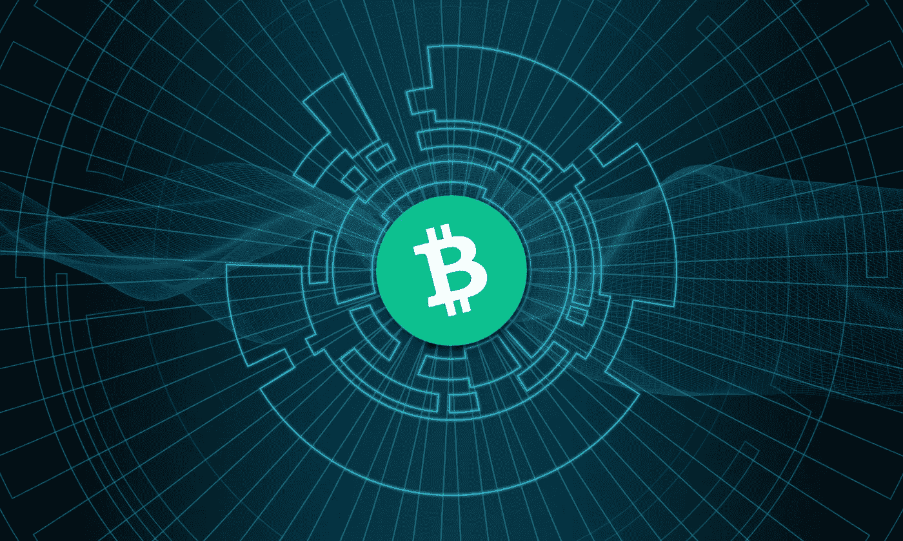

# 修复金钱，修复世界

> 原文：<https://medium.com/coinmonks/fix-the-money-fix-the-world-a3a60911f390?source=collection_archive---------19----------------------->

## 为什么比特币现金很重要，以及它如何作为货币主宰商业

金钱是有代价的。

这就是购买力，即一个记账单位可以购买的商品或服务。

学校和(一些)经济学院或大学在教育学生货币价格方面做得很差。