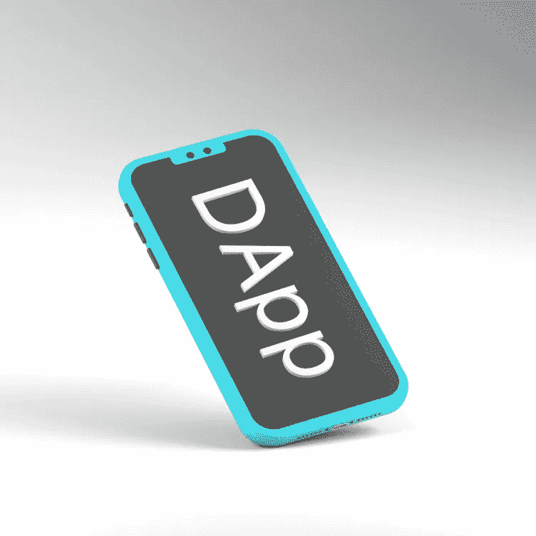

# FIZO NETWORK :-在加密领域推出新的混合投资回报率 DApp 项目

> 原文：<https://medium.com/coinmonks/fizo-network-introducing-the-new-hybrid-roi-dapp-project-in-the-crypto-world-7f25a6b54d83?source=collection_archive---------19----------------------->

fizo.network

在过去的 3 年里，Dapps 或分散式应用程序已经成为密码界的时髦词汇。对于外行来说，术语 dApp 指的是一个基于区块链的应用程序，它运行在一个分散的网络上并使用它的资源。分散式应用程序通常没有中心故障点，具有开放源代码，并且使用分散式共识机制。这些分散的应用程序的停机时间也消除了。他们抵制个人、公司或政府的干涉，因为他们没有任何中央权威。最近，投资回报率 Dapps 已经获得投资者的关注。这些类型的 dApps 承诺投资回报，用户可以随时从智能合约中提取。ROI Dapps 越来越受欢迎，AvalancheFomo 项目就是其中之一。

> 交易新手？在[最佳密码交易所](/coinmonks/crypto-exchange-dd2f9d6f3769)上尝试[密码交易机器人](/coinmonks/crypto-trading-bot-c2ffce8acb2a)或[复制交易](/coinmonks/top-10-crypto-copy-trading-platforms-for-beginners-d0c37c7d698c)

**介绍 FIZO 网络项目:-**

FIZO 网络是一个基于 FANTOM 网络的混合投资回报率 DApp 项目。该项目的开发者选择了 FANTOM 网络，因为它拥有更大的受众群、更便宜的交易费用和成熟的投资者。由于 ROI Dapps 通常是高风险投资，选择 FANTOM 社区驱动的网络将有利于投资者。该项目的主要目的是确保投资者获得财务和时间自由，不受当前经济危机的阻碍。通过进入熊市加密货币市场，FIZO NETWORK 有望成为世界上最受欢迎的 ROI Dapps 之一。

**FIZO 网络的特点:-**

FIZO NETWORK dApp 有许多显著的特点，使其区别于其他正常的 ROI Dapps。其中包括以下内容。FIZO 网络智能合约是一种针对持有者的自生收入机制。这是一个由社区驱动的项目，根据特定条件在社区成员之间分配和奖励 FANTOM。fizo 持有者只需将代币放在钱包中即可获得被动奖励，因为每笔交易(如购买、出售)都分别收取 11%和 11%的交换费，根据钱包中的 FIZO 数量平均分配给所有现有的 FIZO 代币持有者。对于每一笔交易，都会留出一部分用于营销、流动性池和所有持有人的奖励池。因此，FIZO 旨在推广一种“持有并赚取”的文化，以减轻销售压力。

FIZO 价格以 10s 为原则计算。在推出的时候，它的初始价格是 0.0001。当一个买家以 100000 范托购买它时，FIZO 值上升到 0.001，这意味着当 1000000 范托进入系统时，一个零被烧掉。为了杀死下一个零，需要再输入 10000000 Fantom 来增加。

fizo.network

## **如何开始在 FIZO NETWORK 投资？**

请确保您的信任钱包/Meta Mask 中有 Fantom，或者选择 FANTOM 网络从币安/墨西哥交易所购买。

将引用链接粘贴到信任/元掩码 wallet 中，现在选择 Fantom 网络以与网络连接

转到 trustwallet 中的 dApps 区域，粘合此连接

[https://fizo.network/join？invite = 0x 48 AE 852 f0e 792 ea 8 BDA 9 f 094 e 019 AAAA 0d 6892 EB](https://final.fizo.network/join?invite=0x4Bf27b09d8B45116172C41e981A7526AdE65E4bb)

选择 FANTOM 硬币的数量，然后点击它进行注册。

恭喜你，你已经成功投资了 FIZO Token。

fizo.network

**只需轻轻一点，你就会成为骄傲的 FIZO 网络投资人**

DApps 通过实现智能合约的原则，完全不受任何单一权威的约束。像这样的 P2P 系统可以确保分散式系统即使在网络的大部分中断时也能继续工作。像 FIZO NETWORK 这样的 ROI dApps 定位于最大化所获得的回报。这种新的 ROI dApps 为新一代密码爱好者和投资者提供了扩展网络的动力。

免责声明:本文提供的信息仅是作者的观点，而非投资建议，仅用于教育目的。通过使用这些信息，您同意这些信息不构成任何投资或财务指示。在做出任何投资决定之前，一定要进行自己的研究，并咨询财务顾问。

[Fantom 基金会](https://medium.com/u/713a211d04f8?source=post_page-----7f25a6b54d83--------------------------------) [Web3 基金会团队](https://medium.com/u/d6954f1a46d9?source=post_page-----7f25a6b54d83--------------------------------) [DappRadar](https://medium.com/u/b355b203c3dd?source=post_page-----7f25a6b54d83--------------------------------) [信托钱包](https://medium.com/u/d3191ca07046?source=post_page-----7f25a6b54d83--------------------------------) [币安](https://medium.com/u/57600910a883?source=post_page-----7f25a6b54d83--------------------------------) [比特币](https://medium.com/u/61e1a4e5105d?source=post_page-----7f25a6b54d83--------------------------------) [加密货币](https://medium.com/u/a0f9112c32da?source=post_page-----7f25a6b54d83--------------------------------) [火币](https://medium.com/u/65d3e2271234?source=post_page-----7f25a6b54d83--------------------------------)[Blockchain.com](https://medium.com/u/e4f5246afb5c?source=post_page-----7f25a6b54d83--------------------------------)[以太坊](https://medium.com/u/d626b3859bc9?source=post_page-----7f25a6b54d83--------------------------------)

> 加入 Coinmonks [电报频道](https://t.me/coincodecap)和 [Youtube 频道](https://www.youtube.com/c/coinmonks/videos)了解加密交易和投资

# 另外，阅读

*   [氹欞侊贸易评论](https://coincodecap.com/anny-trade-review) | [霍比保证金交易](/coinmonks/huobi-margin-trading-b3b06cdc1519)
*   [分散交易所](https://coincodecap.com/what-are-decentralized-exchanges) | [比特 FIP](https://coincodecap.com/bitbns-fip) | [Pionex 评论](https://coincodecap.com/pionex-review-exchange-with-crypto-trading-bot)
*   [用信用卡购买密码的 10 个最佳地点](https://coincodecap.com/buy-crypto-with-credit-card)
*   [最好的卡达诺钱包](https://coincodecap.com/best-cardano-wallets) | [Bingbon 副本交易](https://coincodecap.com/bingbon-copy-trading)
*   [如何给 MetaMask 钱包添加 Arbitrum？](https://coincodecap.com/how-to-add-arbitrum-to-metamask-wallet)