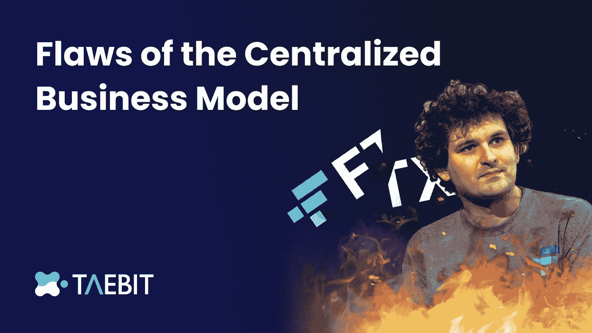
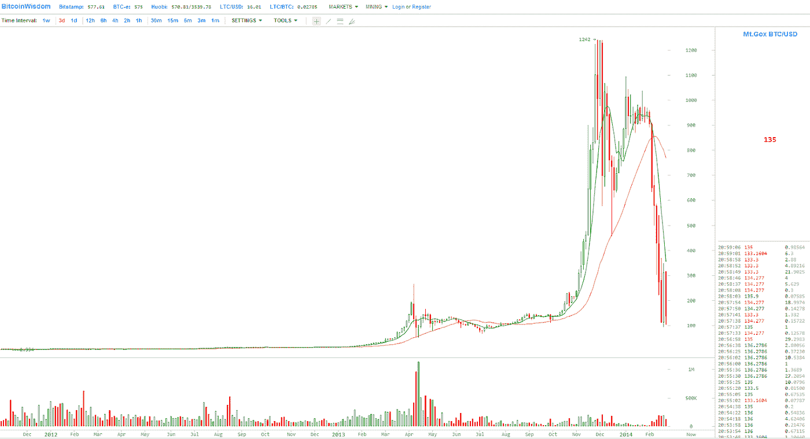
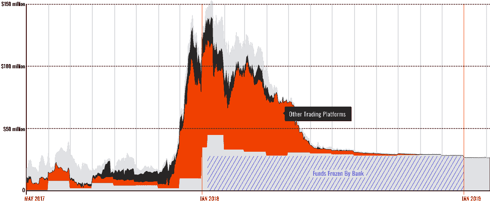
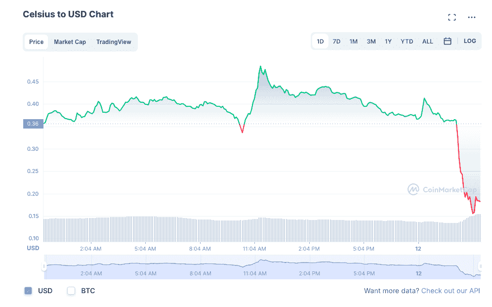
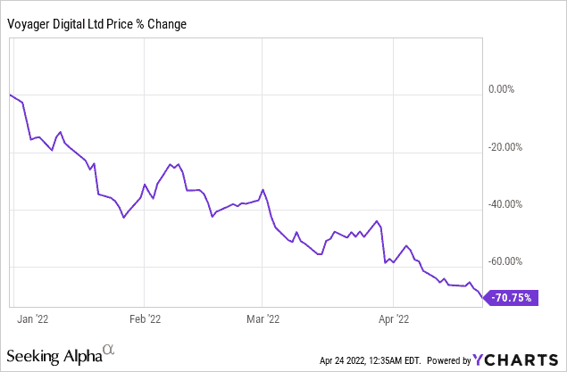
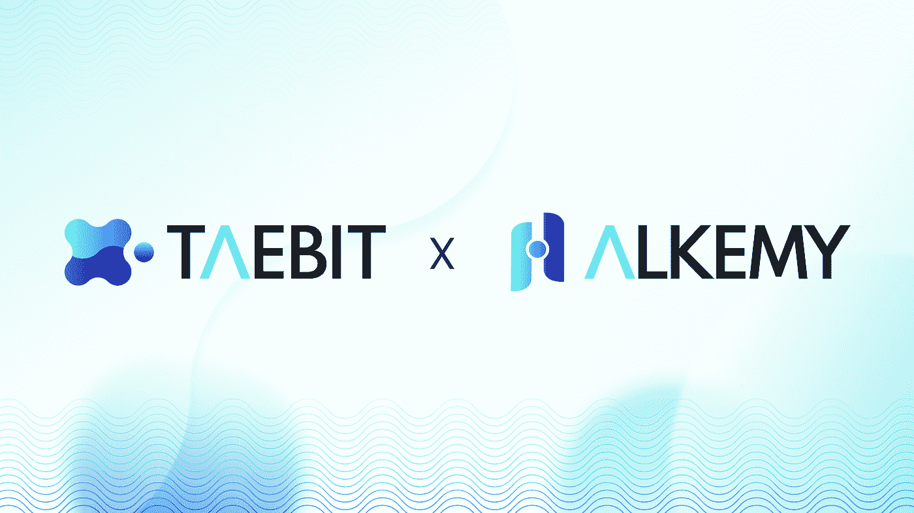

# 集中化商业模式的缺陷

> 原文：<https://medium.com/coinmonks/flaws-of-the-centralized-business-model-f73665192c68?source=collection_archive---------25----------------------->

## **TL；FTX 博士**

过去两周揭示了资产负债表严重管理不善的灾难性后果，以及不透明的集中控制的危险。虽然这篇文章专注于更广泛的集中式交易所网络，但值得注意的是，FTX &阿拉米达最近的失败是加密货币历史上最大的集中式失败，估计损失了 100 亿美元，FTX 的破产程序仍在进行中。

加密货币领域的集中式交易所占据了大部分市场份额，币安、比特币基地和北海巨妖三大交易所每天产生 120 亿美元的交易量。投资者目前青睐集中式交易所，主要是因为易于使用、熟悉，以及免受监管监督。

尽管集中式交易所目前占据了每日交易量的最大份额，但集中式商业模式中存在一些关键缺陷:

*   **缺乏透明度**
*   **无力托管资金**
*   **高费用结构**

## **缺乏透明度**

与分散式交易所不同，分散式交易所可以在区块链浏览器或平台上轻松查看平台交易量和锁定的总价值，而集中式交易所可以对外部投资者保密其经济健康状况，因为许多交易所是私有实体，不出售其企业的公开股份。在经济繁荣时期，这一点很大程度上被忽视了，因为交易所利润很高，客户存款超过取款。然而，在经济低迷时期，集中交易可能会面临重大损失，而知道这些损失程度的唯一个人将是公司的雇员。这种缺乏透明度不仅仅指的是公司的资产负债表，他们还可以隐瞒他们的主要收入来源，以及他们的费用结构如何随着时间的推移而变化

## **无法托管资金**

crypto 的主要催化剂之一是能够管理和存储你自己的资金在一个数字钱包里。当使用集中式交易所时，用户被迫从他们的数字钱包上传资产，现在这是为了交易所的稳定性而牺牲的。正如最近 FTX 暂停用户提款所显示的那样；集中交易的资产在外部力量面前不再安全。分散式交易所不需要将资产上传到平台，使用 DEX 可以让您保持对数字资产的完全控制。

## **高费用结构**

集中交易垂直市场的另一个主要缺陷是，他们对在其平台上交易的用户征收高额费用。2021 年末，领先的 DEX Uniswap 对 10 万美元的交易收取 0.05%的交易费，而币安、比特币基地和北海巨妖的 CEXs 分别收取 0.1%、0.2%和 0.2%的交易费。这些费用通常是可变的，在波动性增加或使用费增加的时期，费用最高可达 0.35%

## **集中故障的历史**

这不是大型集中交易所/CeFi 组织第一次因上述缺陷而倒下。以下 CeFi 实体是从 2014 年到 2022 年最近几个月的例子。

## **悟空(** [ref](https://coinreport.net/editorial-rise-fall-mtgox/) )

2014 年 1 月，Mt . Gox——当时世界上最大的比特币交易所——崩溃并宣布破产，损失了 85 万比特币。虽然不知道具体发生了什么，但很可能失踪的 BTC 从 2011 年开始逐渐被盗，并在各种交易所(包括 Mt.Gox)转售现金，直到有一天 Mt.Gox 检查他们的钱包，发现它们是空的。首席执行官马克·卡普莱斯在 2017 年被指控挪用公款，但[在 2019 年](https://www.engadget.com/2019-03-15-mt-gox-ceo-mark-karpeles-cleared-embezzlement.html?guccounter=1&guce_referrer=aHR0cHM6Ly93d3cuZ29vZ2xlLmNvbS8&guce_referrer_sig=AQAAAKA1gyvL5cTxBWnKIt7NYrf4as2KcjNEhB-YYWR1JYJZNqNUx8glRPwAOloGLiGXIsi3v-7Mgv_L7OhMUKKU8Ad8bkYPya9sNYd0ay7F750syR89bA4Z-I7DbZu8jvnYaCvJd3lrx8_M2gXTRbKUIGG0Z-vVOv_SH1Vc5DcVzGiU)被无罪释放，因此失踪的 BTC 的去向仍然是个谜。

## **QuadrigaCX(**[ref](https://www.osc.ca/quadrigacxreport/quadriga-launch-continued.html)**)**

2018 年 1 月，[交易所下线](https://www.coindesk.com/markets/2019/01/28/troubled-crypto-exchange-quadrigacx-goes-offline-for-maintenance/)进行“维护”。不久后，CoinDesk 首先获得的一份法庭文件显示，QuadrigaCX [欠客户 1.9 亿美元](https://www.coindesk.com/markets/2019/02/01/quadrigacx-owes-customers-190-million-court-filing-shows/)，当时似乎最大的问题是:没有人知道如何使用交易所的储备。他的遗孀在法庭上表示，虽然她有 Cotten 的笔记本电脑，但它是加密的，她从未获得密码或恢复密钥，Cotten 是唯一控制 QuadrigaCX 冷藏系统的人。最终，安大略省安全委员会发现，创始人杰拉尔德·科滕一直在利用客户存款资助奢侈的生活方式，并在竞争性交易所进行交易。

网飞发行了关于杰拉尔德·科滕的纪录片。标题是[‘不要相信任何人:狩猎为密码王’](https://www.netflix.com/tudum/articles/trust-no-one-the-hunt-for-the-crypto-king-trailer)

## **摄氏度(**[**ref**](https://decrypt.co/102715/celsius-tanks-as-company-pauses-withdrawals-citing-liquidity)**)**

截至 2022 年 5 月，Celsius 是加密贷款领域最大的参与者之一，向客户提供了超过 80 亿美元的贷款，管理着近 120 亿美元的资产。该公司会将客户的密码借给愿意支付天价利息的交易对手，然后 Celsius 会与用户分享部分收入。

这种结构在全行业流动性紧缩期间崩溃，导致 Celsius 在 6 月份暂停提款。市场的崩溃也导致其他公司冻结资产，至少有三家公司申请破产。据前雇员和内部文件显示，这家加密公司经历了一系列内部失误，导致了最近的动荡。多名员工描绘了一幅冒险、混乱和涉嫌市场操纵的画面。

## **航海家数码(** [**ref**](https://seekingalpha.com/article/4503716-voyager-digital-buy-dip-during-crypto-crash) **)**

在鼎盛时期，Voyager Digital 拥有 350 万用户(大致相当于比特币基地在 2015 年拥有的 59 亿美元资产)，相当于一家小型地区性银行或一家受人尊敬的财富管理公司。Voyager 97%的客户在平台上的存款不到 1 万美元，这表明个人投资者基础广泛。它是一家加密贷款和交易巨头，是世界上少数几家在股票市场上市的数字资产经纪公司之一(尽管是在加拿大，而不是其母国美国)。最终，Voyager 因其主要交易对手 3AC 无法支付大量未偿贷款而倒闭。

## **分散式交易所有多优越**

过去五年来，分散式交易所(dex)不断涌现，挑战着集中式交易所(cex)过时的商业模式。dex 旨在提供更低的交易费用，让用户直接持有自己的资产，避免监管负担，并且不需要中间人来执行投资者寻求进行的交易。

分散式交易所建立在支持智能合约的区块链网络之上，用户在那里保管自己的资金。每笔交易都会产生交易费。本质上，交易者通过与区块链的智能合约互动来使用 dex。

这种结构催生了一个基金不会管理不当的环境，因为每笔交易都直接记录在区块链总账上，智能合约网络被设定为以特定方式运行——无论股指期货的市场状况如何。如果用户同时从 DEX 中取出所有资金，那么 DEX 将继续正常运行，因为智能合约的底层代码没有发生任何变化。

> **分散的交易所同样不能暂停或中止从其平台的退出，因为没有能够关闭交易所的中央实体或管理机构。对于分散式交易所来说，唯一可行的风险是它所建造的区块链的健康状况。**

## **泰比特和阿尔克米**

Taebit 是一个革命性的新型分散式交易所，将允许用户获得无缝流动性、低交易费用和资金自助存储的好处，同时推出有史以来第一个链上加密货币外汇交易平台。外汇市场是世界上最大的金融市场，日均交易量超过 6.6 万亿美元。与加密市场类似，外汇市场 24/7 全天候运作，对来自世界任何地方的个人开放。

创建 Taebit 的目的是为自营投资者提供工具和平台，让他们能够参与建立在区块链基础上的快速、安全的外汇市场。各种价格不同的加密货币的使用可能会使 crypto 中的心理会计变得非常困难，特别是当面值因不同平台和货币系统而异时。Taebit 将直接插入 Alkemy mint 平台，允许用户创建稳定的货币，直接跟踪本国货币或任何选择的货币。然后，用户将能够获得这些新的稳定货币，并在 Taebit 平台上使用它们来交易他们希望交易的任何外汇头寸或市场。

分散式交易所的未来将高度依赖于它们吸收集中式交易所最佳方面的能力，并将它们整合成一个无所不包的平台。Taebit 更进一步，将全球流动性最强的市场引入区块链，允许参与者以极快的速度和最低的费用交易自己选择的货币。

# 🧑‍🚀加入我们的行列

[推特](https://twitter.com/TaebitDEX?source=about_page-------------------------------------)🐦/ [不和](https://discord.gg/gBjqjFXmn2?source=about_page-------------------------------------)👾/ [电报](https://t.me/+4kkLYgMPtZw3NjJl?source=about_page-------------------------------------) ✈️ / [网站](https://taebit.io/?source=about_page-------------------------------------)🚀

> 交易新手？尝试[加密交易机器人](/coinmonks/crypto-trading-bot-c2ffce8acb2a)或[复制交易](/coinmonks/top-10-crypto-copy-trading-platforms-for-beginners-d0c37c7d698c)