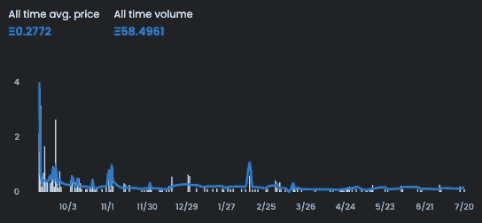
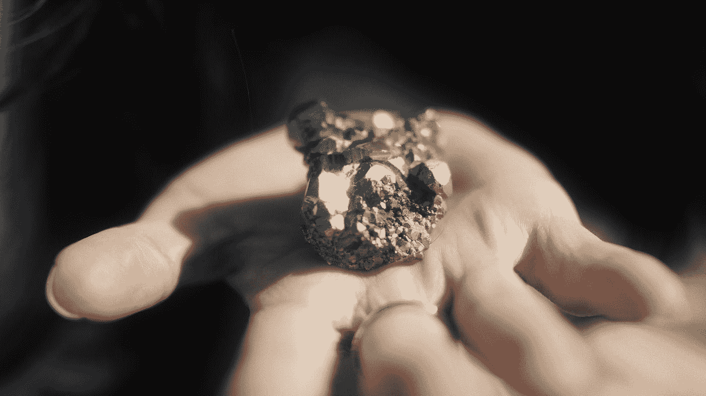

# NFT 项目的底价

> 原文：<https://medium.com/coinmonks/floor-price-of-nft-projects-355ce6cb10ac?source=collection_archive---------29----------------------->

## 底价可能是一个项目成功的标志。但这意味着什么呢？

有一段时间，我想分享一些关于 NFT 项目底价的想法，并讨论一些争议。

Photo by [Markus Winkler](https://unsplash.com/@markuswinkler?utm_source=medium&utm_medium=referral) on [Unsplash](https://unsplash.com?utm_source=medium&utm_medium=referral)

我想分享几个我在过去几个月里看到的案例，然后表达一些想法。

注意，我不会提到具体的项目或用户，因为这不是重点。我将描述一些故事作为例子，这样我们可以讨论它们。

# 不要剪我的地板！

我想分享的第一个案例是几个月前的一个案例，涉及一个用户和一个 1K 项目，该项目由 NFT 领域的一位知名影响者领导。

Photo by [Dmitry Vechorko](https://unsplash.com/@vechorko?utm_source=medium&utm_medium=referral) on [Unsplash](https://unsplash.com?utm_source=medium&utm_medium=referral)

作为一个背景，该项目于 9 月 21 日启动，入门成本为千片装 0.3 ETH。那时，ETH 大约是 3300.00 美元，所以进入的费用大约是 900.00 美元。

发布时，有一个合理的量，但很快量就下降了，就像几个项目一样。

一年后，这个项目仍然没有交付多少成果。

由于 0.15 EHT 的(某种)一致底价，用户以 0.109 ETH 的价格挂牌出售了这件作品。

此时，ETH 在 3，000.00 美元左右，因此销售在 170.00 美元左右。

“有点”一致的底价，因为该项目的流动性和成交量都很小。

用户上个月仅交易了 11 个项目，平均价格为 0.095 ETH，最低交易为 0.065 ETH，最高交易为 0.1269 ETH。

项目负责人在销售后立即将用户从 Discord 服务器中踢出。

然后，用户通过 DM 对话联系到了项目负责人，讽刺的是，他笑着说，仅仅因为销售，他就被踢了。

项目负责人咆哮着回问道:“有什么好笑的？割 f*#$ing 地板这么好笑？”。

用户回答说，可能是因为他需要钱。项目负责人回答说，他应该先和项目组谈，而不是砍地板。

然后项目负责人试图在 Twitter 上曝光他，咆哮得更厉害了。

# 让我们烧了它！

我想提到的第二个案例是一个项目，该项目向他们的社区提议，如果代币列在一个确定的底价之下，就烧掉代币。

Photo by [Antony](https://unsplash.com/@shadejay?utm_source=medium&utm_medium=referral) on [Unsplash](https://unsplash.com?utm_source=medium&utm_medium=referral)

作为背景，该项目在启动时遭受了许多 fud，似乎是故意破坏的受害者。

该项目的一部分包括为那些拥有以前项目 PFPs 的人提供免费造币厂。

事实是，大多数得到免费薄荷的人开始以低于薄荷的价格挂牌。

项目的造币成本为 0.068 ETH，很快藏品的楼面价就下来了，达到 0.015 ETH。

这增加了项目的 fud，人们停止了铸造。

有趣的是，在 mint 之前，这是我见过的交付大约 80%路线图的项目之一。所以一切从一开始就准备好了，游戏化的一部分，赌注，代币等等。仍然在前方，唯一缺失的部分是元宇宙。

为了提高项目底价，除了向社区发放赠品和奖励外，其中一项提议涉及焚烧 0.5 ETH 以下的代币。到那个时候，目前的地板价格在 0.03 ETH 左右。

作为持有人，我反对这个提议，因为我认为它会对项目造成更大的伤害，但是大多数人都支持它。他们改变了 0.1 ETH 的提议，我仍然反对，但大多数人仍然同意。我给出了几个我认为这是错误的理由。

反正写这篇文章的时候这个规则还没有实现。

# 考虑

分享了这两个案例，我有以下几点考虑和想法分享:

## 进入成本

底价是进入一个项目的成本，而不是退出的成本，尤其是在没有动静、没有流动性、近期成交量的情况下。

## 底价与流动性

没有流动性，底价毫无意义。你可以给 NFT 定你想要的价格，但销售是一个全新的故事。

如果没有流动性，没有人愿意从一个项目中购买，你就不能以当前的底价出售。

## 强制底价

项目可以尝试执行底价，但这不是长期可持续的。再说一次，如果没有人愿意以这个价格购买，那么这么高的进入成本又有什么意义呢？

## 被效用和交付所吸引

项目的效用和承诺的路线图的交付会引起人们对项目的兴趣，从而吸引人们参与进来。

波动的底价吸引投资者、投机者和赌徒，只有在有交易量的时候才起作用。

## 我的 NFT 是我的！

最后，一个重要的想法是，我的 NFT 是我的。一旦我买了，这是我的选择，如果我想转让，甚至烧了它。

这个项目的行动和未来的愿景将决定我如何处理我的 NTF，它是我在相信这个项目的时候和我的 ETH 一起买的。

因为你不惜任何代价上市或者用 NFT 做任何你想做的事情而被公开羞辱或者受到项目威胁似乎是错误的。

Photo by [Elia Pellegrini](https://unsplash.com/@eliapelle?utm_source=medium&utm_medium=referral) on [Unsplash](https://unsplash.com?utm_source=medium&utm_medium=referral)

**mδRK mδRROC**是摄影师、艺术家、NFT 创作者和收藏家。他的 IT 背景使他能够进一步探索 NFT 和区块链世界。

你可以在推特上找到他，地址是 [@markmarroc](https://twitter.com/MarkMarroc) 。

参观:【markmarroc.com 

如果你有兴趣在铸币过程中更进一步，查看这篇文章“如何从以太坊合同直接铸币 NFT”

[https://medium . com/coin monks/mint-NFT-direct-from-contract-a 1e 60 BD 21153](/coinmonks/mint-nft-direct-from-contract-a1e60bd21153)

> 交易新手？尝试[加密交易机器人](/coinmonks/crypto-trading-bot-c2ffce8acb2a)或[复制交易](/coinmonks/top-10-crypto-copy-trading-platforms-for-beginners-d0c37c7d698c)