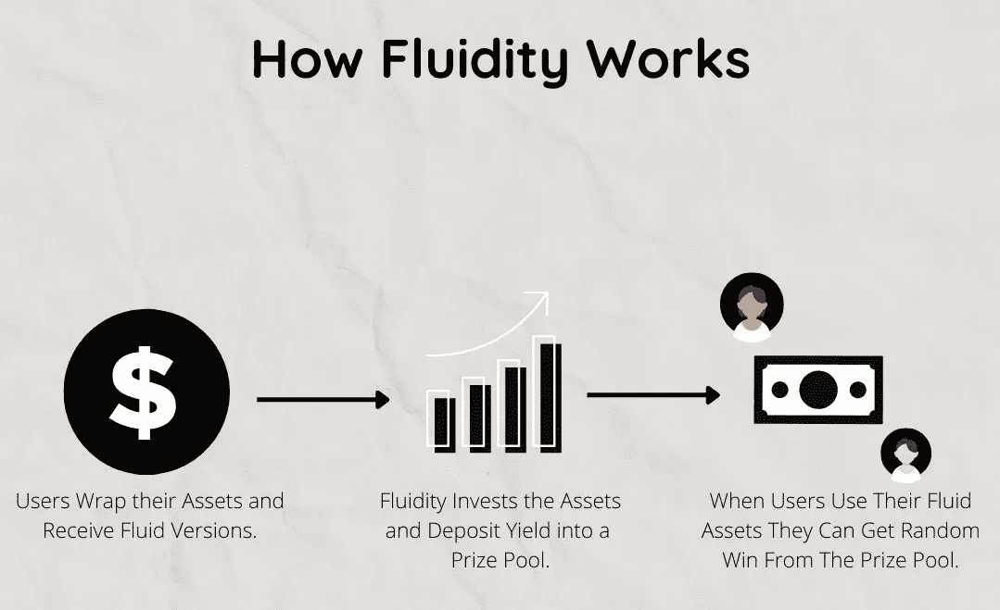

# 流动资金，赚取消费加密货币的钱

> 原文：<https://medium.com/coinmonks/fluidity-money-earn-money-for-spending-your-cryptocurrencies-402e92488755?source=collection_archive---------16----------------------->

当前的分散金融模式奖励持有加密货币的用户。然而，随着流动资金的出现，这种情况将会改变，流动资金将会奖励用户使用他们的密码。这可能有助于增加加密货币作为一种支付形式的采用。

为了更好地理解该协议，我们将文章分解为以下几点:

*➖*概述

*➖* **工作原理**

*➖* 队**队**

*➖* **流体令牌**

> **概述**

流动性是一个奖励人们使用他们的加密资产的项目。人们可以因为持有和消费他们的加密货币而获得奖励。流动性目前建立在以太坊和索拉纳上，但该团队计划在未来将该项目扩展到其他连锁店。

> **工作原理**

有了流动性，人们可以用流动资产( *fAssets* )交换马厩，流动资产是包装好的标准(ERC-20，sol)代币，代表基础本金代币。通过将主要资产借给货币市场，如[@ compound finance](http://twitter.com/compoundfinance)[@ solend protocol](http://twitter.com/solendprotocol)和[@ aaveave](http://twitter.com/AaveAave)来累积收益。奖励随后被分配到奖励池，只有那些利用其流动资产的人才能获得。奖励的分配是通过转移奖励功能(TRF)完成的。

> **团队**

流畅性是一个由 [@shahmeerx](http://twitter.com/shahmeerx) 带领的开发者团队。他们的团队有 10 到 12 名成员。

> **流体令牌**

流动性的治理标志将允许持有人在交易可以轻松流动的资产时获得更好的股息。令牌也将用于其他事情，如帮助启动和支付协议，并让人们有机会通过参与网络获得更多奖励。乐观的解决方案是通过让人们支付比他们将获得的奖励更多的费用来阻止人们向系统发送垃圾邮件。

> 总之，我们面对的协议在外观上可能与 [@PoolTogether_](http://twitter.com/PoolTogether_) 相似，但在后台却不仅仅是简单的“存款并等待看看是否有运气”的机制。
> 流动性货币正在创建一个协议，鼓励用户积极参与，以最大限度地提高获胜的机会。

> 交易新手？试试[加密交易机器人](/coinmonks/crypto-trading-bot-c2ffce8acb2a)或者[复制交易](/coinmonks/top-10-crypto-copy-trading-platforms-for-beginners-d0c37c7d698c)