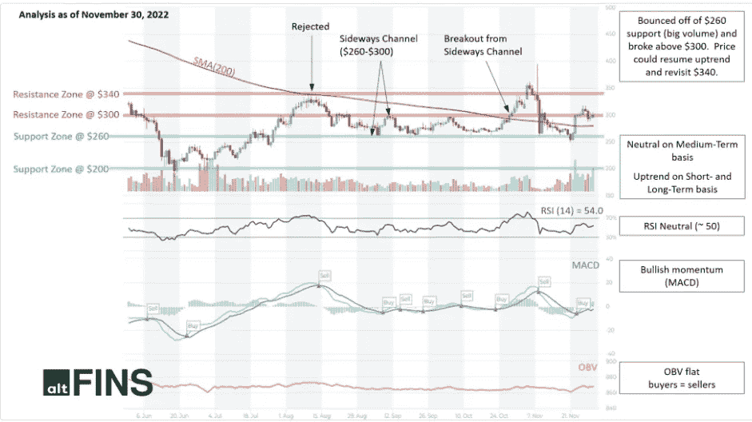
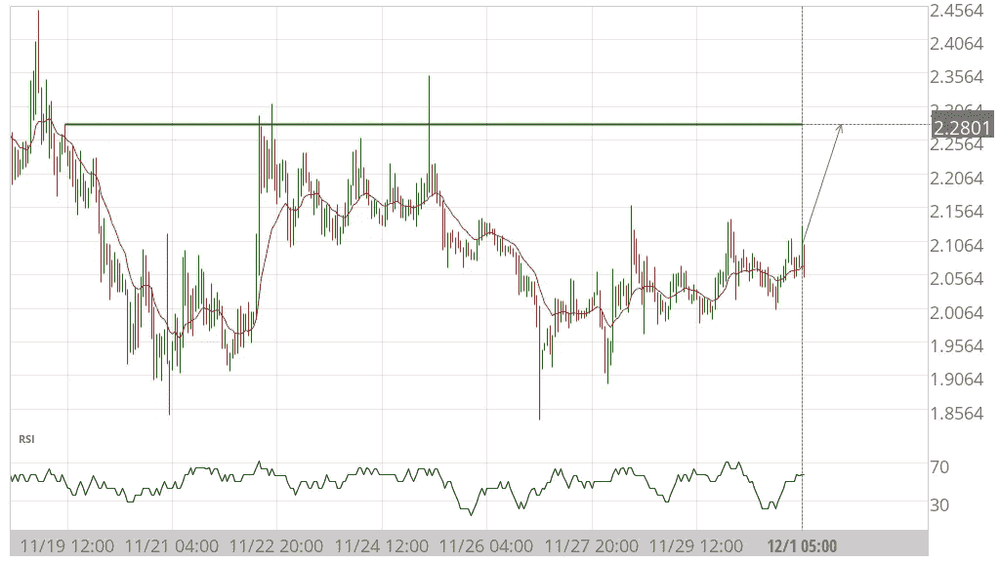
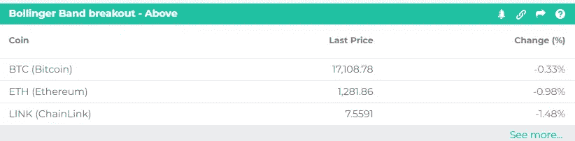
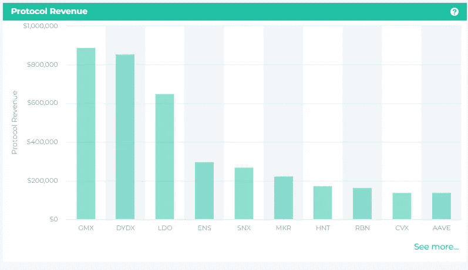

# 专注于重要的事情！

> 原文：<https://medium.com/coinmonks/focus-on-what-matters-8cea33c89c7f?source=collection_archive---------25----------------------->

与 altFINS 的每日加密市场要闻保持联系，致力于为您提供可靠和及时的交易和投资提示、突发新闻和加密研究。我们涵盖的主题从交易策略，链上数据分析，新上市和更多！

今天的话题:

*   **币币(BNB):技术分析**
*   **行波管:接近阻力位**
*   **布林线突破的硬币——上图**
*   **GMX，dYdX —链上数据洞察**
*   **突发新闻&密码事件**

altFINS.com 致力于选择最可靠的数据和分析，因此您可以专注于重要的事情！

# **BinanceCoin (BNB):技术分析**

Source: [altfins](https://altfins.com/technical-analysis)

**交易设置:**从 260 美元支撑位(大成交量)反弹，突破 300 美元上方。价格可能恢复上升趋势，重新回到 340 美元。(设置一个[价格警报](http://altfins.com/knowledge-base/create-alert-for-cryptocurrencies/))。

**趋势:**中期基础中性，短长期基础上升趋势。

**动能**混为一谈 [MACD](http://altfins.com/knowledge-base/macd-line-and-macd-signal-line/) 线在 MACD 信号线上方(看涨)但 RSI ~ 50(中性)。

**(平衡成交量)**:持平，表示上涨日成交量等于下跌日成交量。因此，买方的需求和卖方的供应处于平衡状态

最近的支持区域是 260 美元，然后是 200 美元。最近的阻力区是 300 美元，然后是 340 美元。

# **2。TWT(信任钱包令牌)的图表模式—接近阻力位**

Source: [altfins](https://altfins.com/chart-patterns)

# **3。布林线突破的硬币—高于**

Source: [altfins](https://altfins.com/)

当价格穿越布林线上方时，这可能表明**看涨价格突破和上升趋势的开始或持续。**

价格通常在 90%的时间内保持在区间内，所以突破是一个重大事件。

布林线表明价格波动的水平。当波动性增加时，它们变宽，当波动性减少时，它们变窄。

# **4。链上数据洞察—协议收入**

Source: [altfins](https://altfins.com/on-chain-data)

协议收入(PR)是通过 burn 机制仅进入协议国库或直接进入其令牌持有者的费用份额，这类似于股票回购，因为它减少了流通中的令牌数量。

# **5。突发新闻&密码事件**

**突发新闻:**

*   [这就是 XRP 离开比特币基地钱包的原因](https://u.today/this-is-why-xrp-is-getting-removed-from-coinbase-wallet)
*   [电报建立分散交换，加密钱包](https://cryptodaily.co.uk/2022/12/telegram-to-build-decentralized-exchange-crypto-wallets)
*   [币安收购获得许可的日本加密交易所——准备作为受监管实体进入日本](https://news.bitcoin.com/binance-acquires-licensed-japanese-crypto-exchange-prepares-to-enter-japan-as-regulated-entity/)
*   [数据显示，11 月加密投资产品交易量激增](https://www.cryptoglobe.com/latest/2022/12/crypto-investment-products-trading-volumes-surged-in-november-data-shows/)

**新列表:**

*   2022 年 3 月 12 日:BKEX 在上午 09:00(UTC)列出了 Popcoin (@Pop__Coin)和 POP/USDT 对。

**阿马斯:**

*   2/12/2022“本周五美国东部时间下午 1:00，在我们两周一次的 Twitter 空间与我们的首席运营官和首席技术官聊天吧……”STORJ(STORJ)
*   2022 年 2 月 12 日“…15:00(GMT)…对话+ AMA 了解 Alpha Mainnet，织女星的下一步&让您的问题得到解答”。织女星(织女星协议)

## 在 altFINS 上注册免费入门计划

## 通过 altFINS.com 的免费启动计划获取强大的见解和数据！今天就释放这一无价资源的潜力—一切都不需要您付出任何代价。立即注册:[https://altfins.com/login](https://altfins.com/login)

> 交易新手？尝试[加密交易机器人](/coinmonks/crypto-trading-bot-c2ffce8acb2a)或[复制交易](/coinmonks/top-10-crypto-copy-trading-platforms-for-beginners-d0c37c7d698c)