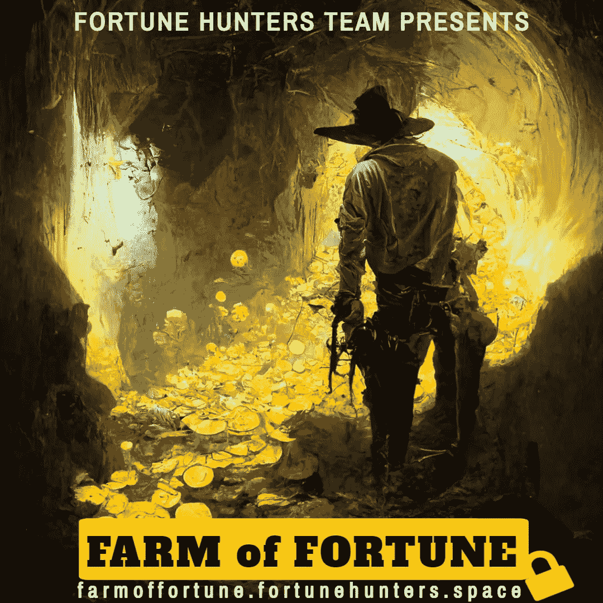
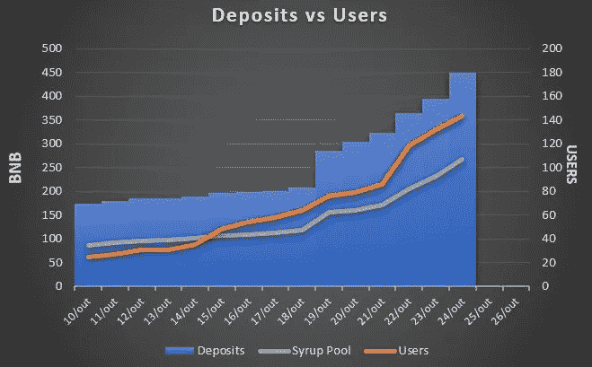
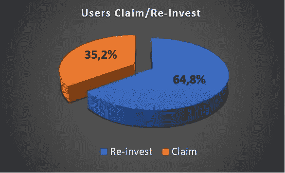
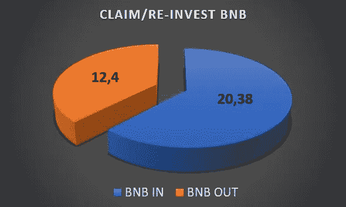
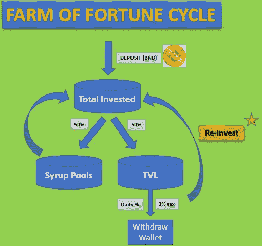

# FOF——疯狂的第二周！？！

> 原文：<https://medium.com/coinmonks/fof-insane-second-week-eba2381bcf6c?source=collection_archive---------7----------------------->

大家好，我是尼尔森，和我一起回顾第二周的 [FOF](https://farmoffortune.fortunehunters.space/index.html?ref=0xEA765E02E75dD1993838Cac9d04fa1b220e731Eb) 。

昨天，也就是 10 月 24 日，距离旨在破解庞氏骗局的项目启动正好 14 天。

在这 14 天里，我们看到所有指标都有所提高；
TVL——10 月 18 日，在发生了两次索赔后，TVL 大约是 60 BNB。现在 BNB 的座位数是 139，大约 57 后的**BNB 声称 TVL 比 7 天前高 56.83%**。
**存款** —总存款计数为 459 BNB(其中 50%被发送到池)
**池** —在多个池中，我们现在有 268 个 BNB，其中 50%来自存款(459*50%=229) **我们看到这些池在 14 天内生成了大约 38 个 BNB！**哦，请记住，在这 14 天内，从池中向 TVL 注入了 8 个 BNB，**所以实际上，池在 4 天内产生了 46 个 BNB！**也就是说，太阳能池平均每天产生约 4.16 BNB。
而这仅仅是开始……

皇家 TVL 从 268 人增加到合同中的 139 人 TVL，407 人 BNB。哦，这是在 57 BNB 已经支付给投资者之后。如果没有这些索赔，我们会看到 TVL 在 464 BNB，这个数额比在[FOF](https://farmoffortune.fortunehunters.space/index.html?ref=0xEA765E02E75dD1993838Cac9d04fa1b220e731Eb)……14 天内……
**的存款总额还要高。资金池余额代表实际 TVL 的大约 67%。**

团结起来的社区的力量！
在这第二波申领中共有 71 人申领，总计 32.78 BNB 申领。那 71 个再投资中的 46 个！32.78 英镑中的 20.38 英镑 BNB 被重新投资了！我们是财富猎人！
声称再投资的 64.78%
声称 BNB 的 62.15%被再投资

我还可以补充一点，那些没有进行再投资的银行中，有 16 家的存款低于 1 BNB，这不足以支付 0.1 BNB 的最低存款额。所以在现实中，83.63%能够再投资的人选择了再投资，因为他们明白在[FOF](https://farmoffortune.fortunehunters.space/index.html?ref=0xEA765E02E75dD1993838Cac9d04fa1b220e731Eb)再投资是实现 0%庞氏骗局的关键！

关于 [FOF](https://farmoffortune.fortunehunters.space/index.html?ref=0xEA765E02E75dD1993838Cac9d04fa1b220e731Eb) …
神话的一些秘密——假设资金池需要每天产生超过 2%的收益才能每天支付 2%。
现实中，需要的只是时间。如果有足够的时间，资金池余额可以发展到总存款额的 2 倍或更多，我们已经看到资金池余额超过总存款额的最初 50%，这是开始时的余额，**，随着更多人的加入和社区继续推动再投资的心态，这只会继续增长。**

**有用链接** :
[*FOF 模拟器*](https://docs.google.com/spreadsheets/d/1T08mmntVH6P8p-g2Krb_B54m4SdCsKfAeNEioWbpQjY/edit?usp=sharing)[*财富农场*](https://farmoffortune.fortunehunters.space/index.html?ref=0xEA765E02E75dD1993838Cac9d04fa1b220e731Eb)[*关于财富猎人的文章列表*](/@Nelson_Crypto_Journey/list/fortune-huntes-ecosystem-ba538a789f96)[*财富猎人 TG 集团*](https://t.me/cakeoffortune)[*Craigs YT*](https://www.youtube.com/channel/UCxjlf5lMdvJex9KfByKypPQ)

本文中使用的推荐链接属于项目钱包，它将使用收集的推荐奖励作为一种方式来加强 PCS 池中存放的 BNB 金额，以尽一切努力使这个项目成为 100%无庞氏骗局的项目。

如果你喜欢我的文章，请考虑一些掌声，因为它有助于达到更多的人，如果你想知道更多关于我的加密之旅考虑订阅。

*本文不构成投资建议。作者和出版物均不对您可能因这些信息而招致的任何投资、利润或损失承担任何责任或义务。我们鼓励读者在做出任何和所有投资决定之前，进行尽职调查和研究，或咨询持牌金融顾问或经纪人。此内容仅用于一般信息和教育目的。尽管作者力求准确，但文章中的数据并不可靠。作者可能拥有文中讨论的加密货币和代币。文章可能包含附属链接。*

> 交易新手？试试[加密交易机器人](/coinmonks/crypto-trading-bot-c2ffce8acb2a)或者[复制交易](/coinmonks/top-10-crypto-copy-trading-platforms-for-beginners-d0c37c7d698c)