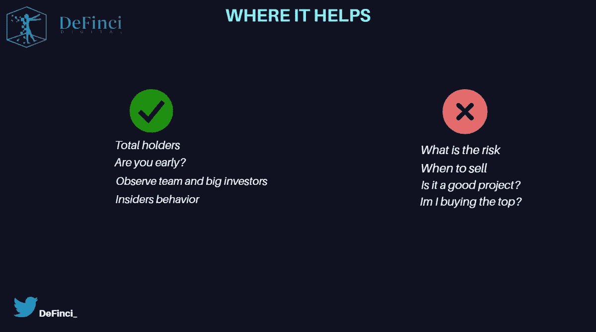
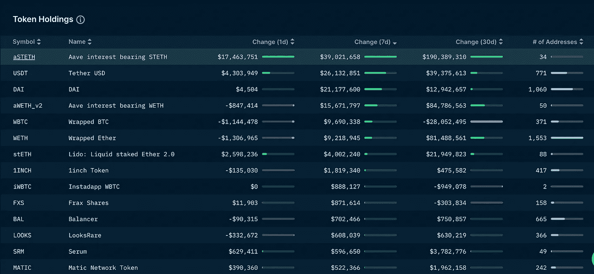
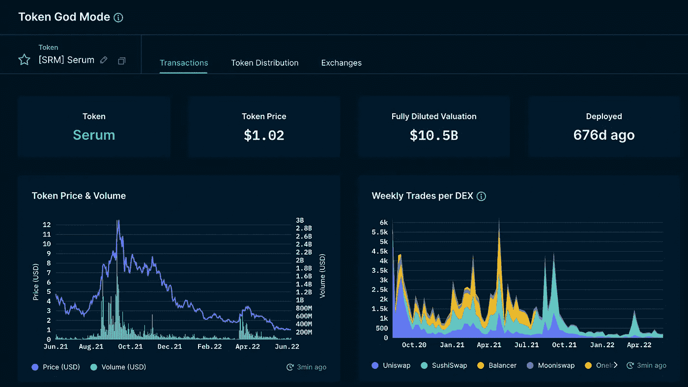
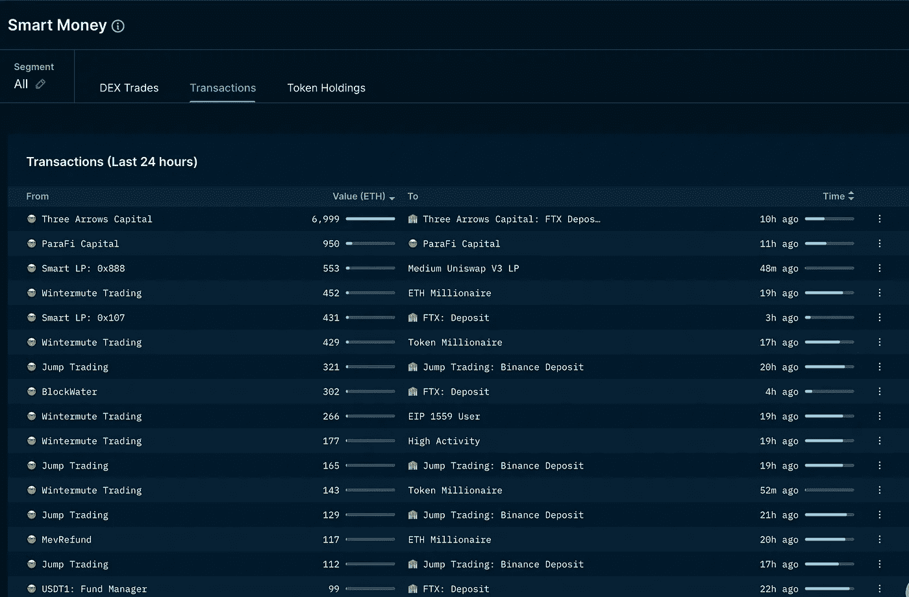
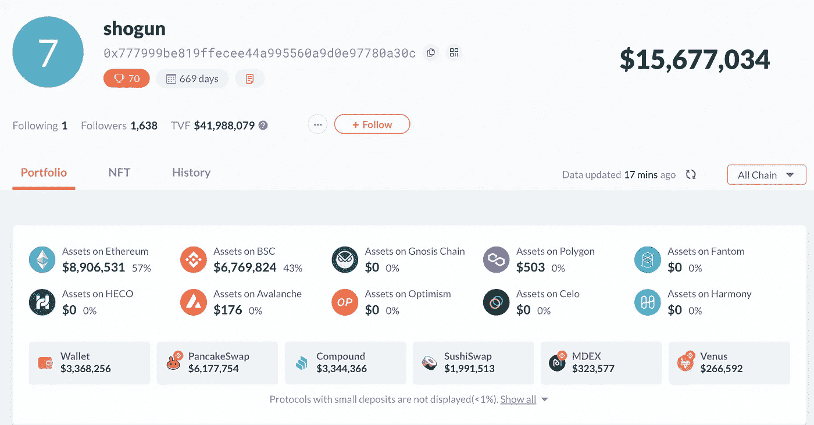
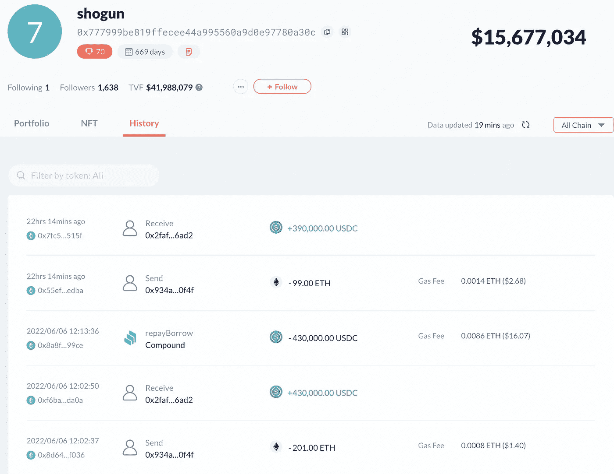
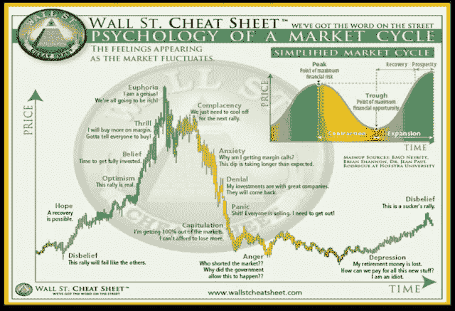
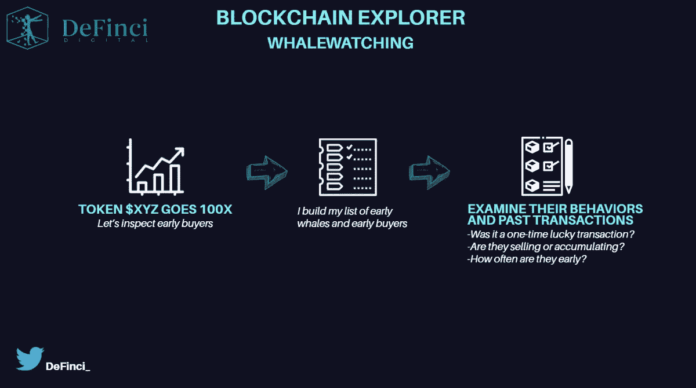

# 跟随聪明的钱——你应该如何关注鲸鱼钱包。

> 原文：<https://medium.com/coinmonks/following-smart-money-how-you-should-pay-attention-to-whale-wallets-a9e1403f415b?source=collection_archive---------14----------------------->

我们已经介绍了遵循宏观链上分析的巨大优势。虽然以上方法可以让你有所收获，但是结合微观和宏观分析还是有好处的。

微观分析听起来更有技术含量，但是请放心，它**会给你带来令人印象深刻的结果。**

在对项目进行尽职调查时，需要批准简单的质量控制检查:

*   **它有强大的基本面吗？**
*   **智能合约有多好？**
*   **鲸鱼在堆积吗？**

交叉检查前两点并不意味着你已经找到了你的项目。虽然鲸鱼并不总是把握市场时机，但跟踪它们的行为可以帮助你判断可能的价格变动。

你拥有的最强大的工具是链上分析。如果鲸鱼正在积累，这通常是一个积极的迹象。

> 交易新手？尝试[加密交易机器人](/coinmonks/crypto-trading-bot-c2ffce8acb2a)或[复制交易](/coinmonks/top-10-crypto-copy-trading-platforms-for-beginners-d0c37c7d698c)

# 你会看什么？

如今，建立一个没有功能的智能契约很容易。Upwork 有很多人愿意为你写一份聪明的合同。关注幕后发生的事情对你的投资至关重要。

OA 让你能够在项目早期投资，并在无人关注的时候玩内部游戏。你们中的一些人可能因为投资策略而避免了迷因币。如果你可以通过查看链上分析从这些硬币中获利呢？

*抓住机会，度过早期炒作周期，然后离开。*

**利润就是利润。**

通过跟踪聪明的资金，我们发现了什么？

# 成功观鲸策略的规则

*   办公自动化仍然是一种工具。如同任何其他工具一样，你将它与你的**规则和知识**结合起来。
*   观看鲸鱼是发现潜在新项目的绝佳方式，尽管你必须能够 DYOR。你需要理解是什么让一个协议变得伟大。
*   南森非常擅长标记交换钱包(例如比特币基地),你应该总是把它们过滤掉。
*   了解关于**记号组学**的一切。你需要了解一个项目的授权时间表和解锁，以避免鲸鱼倾倒在你身上。[*https://twitter.com/Blockanalia/status/1533070217122746373*](https://twitter.com/Blockanalia/status/1533070217122746373)
*   下面是另一个来自@OnChainWizard [*的关于 Tokenomics 的优秀线程 https://OnChainWizard . substack . com/p/onchain-wizard-token omics-thoughts？*s = w](https://onchainwizard.substack.com/p/onchain-wizard-tokenomics-thoughts?s=w)
*   在你的雷达下至少有 **50 个鲸鱼钱包**。假设 50 头鲸鱼中有 30%买入$ DEFINCI 那时，也只有那时，它才可能对 DYOR 有价值。
*   始终关注鲸鱼如何投资、积累和转移资金。
*   识别**虚假交易**。骗子知道你在看大钱包，经常骗你相信你的鲸鱼正在购买他们的一些诈骗硬币。这个空间充满了骗局，保持警惕。[*https://twitter.com/shivsakhuja/status/1523302665588936704*](https://twitter.com/shivsakhuja/status/1523302665588936704)
*   永远记住你的**策略**。尽早购买迷因币可能会获得可观的利润，尽管你必须知道何时放弃炒作。把这些仅仅看作是交易利润，仅此而已。[*https://Twitter . com/DeFi _ educator/status/1521275758072803336*](https://twitter.com/DeFi_educator/status/1521275758072803336)
*   了解风险管理、投资组合分配和一般市场情绪的基础知识。[*https://twitter.com/thedefiedge/status/1488193098702331913*](https://twitter.com/thedefiedge/status/1488193098702331913)

# 如何开始

你有一系列工具可以帮助你观察鲸鱼:

**Chain explorers** (例如 ethers can)**Nansen**、 **Debank** 或 **Zapper** 是跟随聪明资金的好盟友。虽然 etherscan 是一个很好的工具，但它对聚合多个事务的数据没有帮助。

这就是南森和 Debank 或 Zapper 等工具发挥作用的地方。

*   南森

南森是一个双向工具，你可以跟踪单个令牌或鲸鱼。他们的“智能货币”功能是 ETH 网络中近 4000 个余额的数据库。

跟踪钱包包括许多鲸鱼，投资基金，和过去的良好表现。对于优秀员工，我们指的是那些最近创造了显著 P&L 并发现了早期机会的员工。无论是在赌注，流动性提供，交易，或 NFT 造币，利润领域没有区别。

在**智能货币**部分，我们通常关注以 7D 为时间框架的**交易和代币持有量**。

根据实用性，因为我们拥有订阅，我们将使用 Nansen 和 excel 来跟踪我们的钱包列表。

智能货币工具的这一部分显示了每个代币美元交易量的最大变化。你在同一个窗口中有三个不同的时间框架，这有助于理解聪明的资金是否已经抛售/买入这个令牌有一段时间了。

结合一切与**南森令牌神模式**给你足够的研究空间。您希望确定过去几周和几个月发生的最后事件，并按最大的交易进行筛选。信物神模式是南森的“特色”。你可以看到一切:最后的运动，持有人分布，聪明的钱持有，和顶部交易。

这第一部分帮助你通过代币持有量的显著变化找到鲸鱼。然而，你也可以通过交易工具找到鲸鱼。

在上面的图片中，我们可以看到在过去的 24 小时里，我们有相当多的运动。我们只选择了一个钱包，并决定深潜。一个接一个，你很快就会明白风投钱包、鲸鱼、DeFi 极客等等之间的区别。

所以我们复制了他的**钱包地址**并直接粘贴到 debank.com。
(供参考)0x 777999 be 819 ffecee 44 a 995560 a 9 d0e 97780 a 30 c

用户目前持有大约**1600 万美元**的资产，分布在不同的 DeFi 协议中。我们找到鲸鱼了吗？是的，虽然这能进入我们的 50 大观赏鲸鱼名单吗？大概吧。

虽然这头鲸鱼没有从事任何未知的项目，但跟踪任何未来的行动可能会很有趣。请密切注意您在 debank 检查的每个钱包上的**“历史记录”标签**；它可以显示购买和出售，以添加到您的观察名单。

根据相对投资组合的大小，记录他们分配给一个项目的百分比。并密切关注我们之前提到的骗局交易。

结合以前的买入和它们的相对价格，看看他们是否发现了早期的赢家或做了好的交易。一点一点地，建立你的等级来判断这样的钱包，并在你的 50 个钱包列表中给它们分配一个优先级。

和其他鲸鱼一样，现在养殖(考虑到目前的市场状况)可能是你最安全的选择。因此，了解我们处于市场的哪个阶段也很重要。

# 区块链探索者

如果你希望擅长跟随聪明的钱，区块链探索者是必须学习的。南森的眼睛可能看不到一些钱包，所以你可以用自己的眼睛去发现一些。

[*https://twitter.com/CroissantEth/status/1512929465076264971*](https://twitter.com/CroissantEth/status/1512929465076264971)

我们不会用区块链探险者的照片来迷惑你，而是激发你的好奇心和更深思熟虑的过程。

想一个在某个时候垂直发展的项目；谁在这笔交易中赚了钱？

区块链浏览器有助于寻找第一笔交易和第一个买家。你会发现有大量购买的鲸鱼赚取了疯狂的利润。这些鲸鱼是谁？

链上分析为你提供**独特的机会**远离一般的 CT shiller 和所有与你的信念和眼睛。

# 结论

大多数时候，你可以找到参与种子轮的钱包，看看钱包与谁互动，并深入挖掘，一如既往地建立你的思维地图和信念。

鲸鱼并不总是一次卖完；为此他们需要流动性。这就是为什么跑在他们前面是至关重要的，因为你可以用较小的仓位更容易地退出市场。

不要盲从每一个动作；精明的投资者很聪明，但并不总是正确的。每个人都会犯错。

一如既往，结合正确的工具，你不会出错。