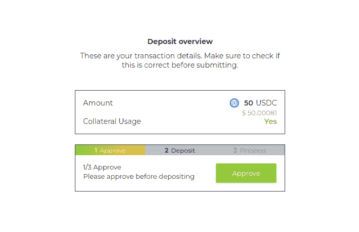
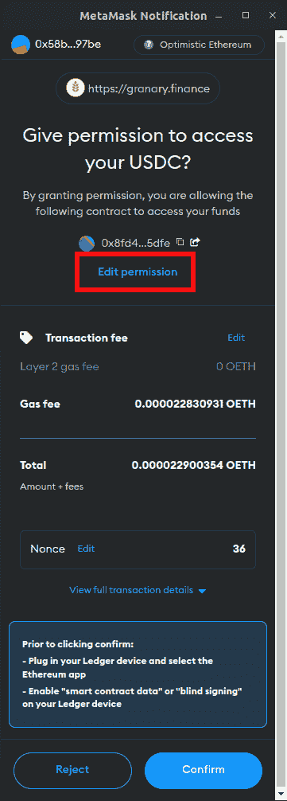
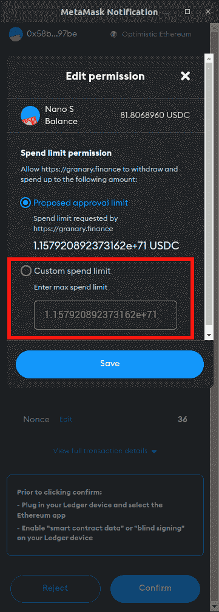
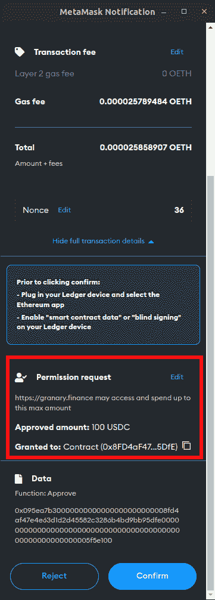
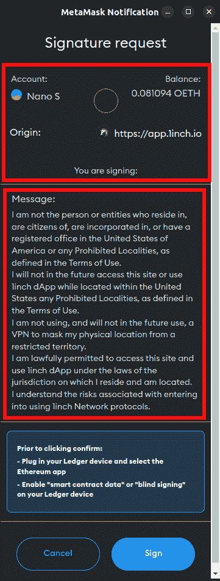
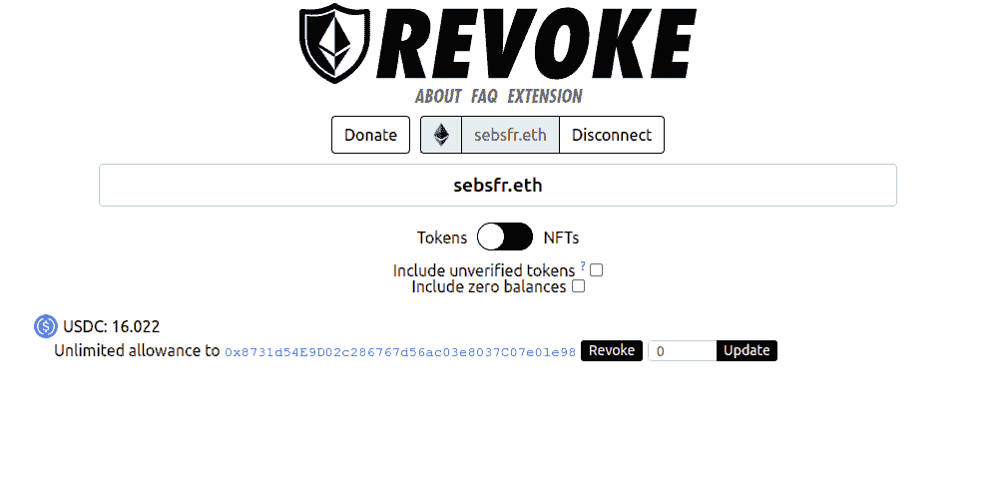

# 解释元掩码及其“批准”事务

> 原文：<https://medium.com/coinmonks/for-evm-networks-users-on-why-approve-tx-is-so-tricky-4563bd21c33f?source=collection_archive---------56----------------------->

你好。假设你或多或少已经是一个[以太坊](https://ethereum.org/en/)虚拟机用户，那么很可能你已经熟悉在你的 [Metamask](https://metamask.io/) 或任何其他 EVM 钱包上的“批准”交易，无论你何时处理各种可能的[智能合约](https://ethereum.org/en/developers/docs/smart-contracts/#:~:text=A%20%22smart%20contract%22%20is%20simply,be%20the%20target%20of%20transactions.)。

# 什么是批准交易？

对于那些不知道该功能的人来说，这基本上是在以太坊链或其他符合 ERC-20 令牌标准的 [EVM 兼容](https://ethereum.org/en/developers/docs/evm/)链上的任何 DeFi 智能合约中传输数据之前必须进行的第一笔交易。

# 这是为了什么？

因为我们正在处理智能合约，所以我们必须将某些数据(例如令牌)传递给智能合约，以便以后自己处理它们。为了做到这一点，我们必须事先“批准”或“允许”这种情况发生，而不要求我们在 DeFi 应用程序中确认任何内部交易。每次我们确认这些交易时，我们都必须允许智能合约“消费”一定数量的代币。

在这个场景中，我们有两个身份参与其中:

*值* —我们批准的智能合约将从我们的钱包中获取的**无限或有限*** 数量的令牌。

*Spender* —我们允许接受代币的智能合约的地址。

***如果我们限制代币的消费金额，并且已经达到限额，下次我们必须“批准”或“允许”更多代币的智能合同。
这让我们思考，为什么我们不允许智能合约从一开始就一次性使用我们所有的资金……**

# 这种方法的利弊

这里最大的难题是我们必须将安全、成本和便利分开。

从安全的角度来看，考虑到我们正在处理一个代码，我们应该只允许我们真正想花的钱。代码是年轻的，所以可能会被破坏或被黑客攻击。

就便利性和成本而言，以太坊上的交易有时会变得昂贵，所以当我们不得不在钱包上额外点击时，我们可以感觉到我们的令牌是如何蒸发的。而且，如果每次点击的价格很贵，交易之间的时间可以更长，这会让我们感到恼火。

# 如何(不)被骗！

正如我之前提到的，代码可能会被黑客攻击，我们的钱会消失。在这里，只允许有限数量的资金可能是一个明智的选择，但是，如果我们已经被恶意的“批准”交易抓住了怎么办？在许多情况下，我们没有批准有效的 tx，而是在一会儿后就没有了资金。我们确认，由于处理了错误的智能合同地址，我们没有在 metamask(或其他)钱包上进行验证。

让我们看看“批准”tx 是什么样子，以及我们如何决定我们是否在处理合法的智能合同，并指定我们可以给它的金额。

Approve transaction before depositing 50 USDC into a smart contract

We can edit permission for the contract address above the red rectangle

Here we can specify how many tokens we allow a smart contract to operate for us

Here I approved a maximum of 100USDC for a smart contract to operate. This means, whatever would happen it cannot take more money from my wallet than what is approved by me.

# 签署交易…

最后一种经常发生的交易是符号交易。

Example from 1inch aggregator

在上面的矩形中，我们已经看到了从哪个帐户到哪个服务的交互。在下方的矩形中，解释了我们要签名的内容。

# 硬件钱包怎么样，如何修改已经批准的交易？

简而言之，硬件钱包与此无关，一旦确认的交易不需要交互。但是，有一种方法可以修改我们的批准并允许区块链中的 txs。
我们可以使用一些服务来调用过去的 txs。其中最受欢迎的是 [Revoke cash](https://revoke.cash/) ，我们可以在大多数 EVM 网络中使用，非常简单易用。它提供了一个简单的用户界面和不断发展的 UX。

> *交易新手？试试* [*密码交易机器人*](/coinmonks/crypto-trading-bot-c2ffce8acb2a) *或* [*复制交易*](/coinmonks/top-10-crypto-copy-trading-platforms-for-beginners-d0c37c7d698c) *上* [*最好的密码交易所*](/coinmonks/crypto-exchange-dd2f9d6f3769)

> 加入 Coinmonks [电报频道](https://t.me/coincodecap)和 [Youtube 频道](https://www.youtube.com/c/coinmonks/videos)获取每日[加密新闻](http://coincodecap.com/)

# 另外，阅读

*   [免费加密信号](/coinmonks/free-crypto-signals-48b25e61a8da) | [加密交易机器人](/coinmonks/crypto-trading-bot-c2ffce8acb2a)
*   [杠杆代币](/coinmonks/leveraged-token-3f5257808b22)终极指南
*   [16 款最佳折叠电动自行车](/coinmonks/top-17-folding-electric-bikes-5e296f0918cb)
*   [28 款最佳电动自行车点评](/coinmonks/the-28-best-electric-bikes-review-and-buying-guide-in-2023-7bb3146cb403)
*   前三名[币安期货交易机器人](/coinmonks/top-3-binance-futures-trading-bots-e6031f84b3f9)