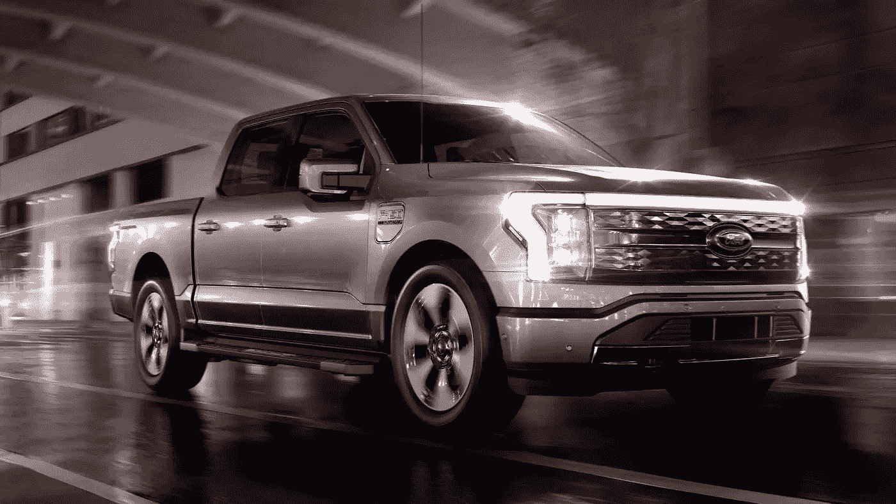
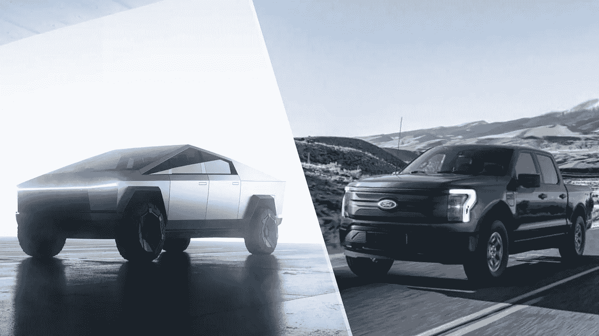
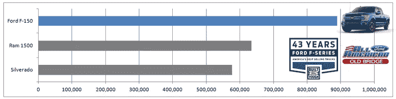
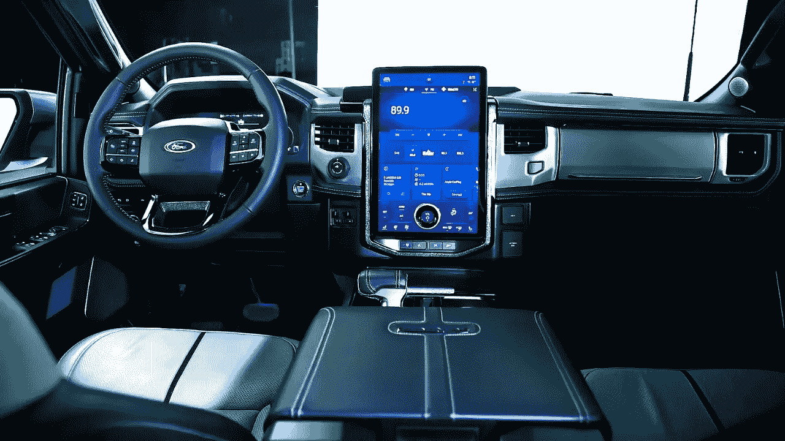

# 福特教老狗新把戏，看着很有趣。

> 原文：<https://medium.com/coinmonks/ford-taught-an-old-dog-new-tricks-and-its-a-joy-to-watch-5e45e7344d72?source=collection_archive---------3----------------------->

Ford really did a tremendous job with designing and building the F150 Lightning from scratch.

你知道世界上最受欢迎的卡车是什么吗？

是福特 F-150 皮卡。

在他超过 40 年的历史中，售出了 2600 万台。

你知道世界上最受欢迎的电动卡车是什么吗？

这将是福特 F-150 闪电，在适当的时候。

福特做了一个天才的举动，给 F-150 通电。

这有什么好的？

F-150 是有史以来最畅销的卡车，美国人喜欢他们的卡车。

电动意味着静止状态下的瞬时扭矩、高运输能力、零排放、高利用率和巨大的货舱空间。

它检查每一个可能的箱子，寻找一辆高实用性、高性能和大功率的卡车，以满足任何用途。

此外，电力是未来的发展方向，从长远来看，站在科技的正确一边总是正确的。

Sure the Tesla CyberTruck might be cooler, but the Ford F150 Lightning has already hit the roads.

闪电标配**两个电动机和全轮驱动，产生 452 马力和超过 700+的扭矩。**

起价仅为 4 万美元，4.0 秒内加速至 60 英里/小时。

除了目前仍在埃隆脑海中的 CyberTruck，根本没有另一辆卡车更快或更好。

与接受近 100 万辆预订并被推迟 5 年至 2023 年的 CyberTruck 不同，福特在一年前宣布了 Lightning，并已经向用户交付了第一批。

不管是什么，你不能讨厌福特的可靠性、服务和准时性。

想象一下:在蒙大拿州的山区越野，享受极速，带上一辆四轮自行车和所有的工具。

Ford F-150 is the Best-Selling Pickup Truck in America.

所有其他汽车制造商也在追赶这股电波。

“其他人也开始转向他们最受欢迎的车型。通用汽车明年将推出电动 Silverado。公羊卡车要电动化了。通用汽车和福特汽车分别在开发 Equinox 和 Explorer 的电动版。

这很有意义。

以过去几十年最畅销的汽车和卡车型号为例，对其进行彻底改造，并将其重新设计成全电动版本，就能看到销售热潮。

为什么这很重要？

请记住，40 年来，福特已经卖出了数百万架 F-150。

他们拥有所有的技术诀窍、复杂的知识、根深蒂固的专业技能和必要的人才团队，这创造了一个天然的护城河，将所有其他竞争对手拒之门外。

当然，神一般的埃隆和丰田将会侵占这一领域，但他们不会拥有福特已经拥有的天然优势。

让我们看看福特会怎么做。

The Ford F-150 Lightning has cavernous interior and a huge touchscreen too.

“闪电号的早期预订很有希望。该公司最初计划生产约 4 万辆 Lightnings，但这款卡车太受欢迎了，福特在收到 20 万辆后就不再接受预订了。”

我毫不怀疑 Lightning 至少在未来五年内会大受欢迎，而市场的其他产品也会跟上。

或许，如果 Rivian 和 Lucid 设法降低成本，增加物流供应链，他们可能会有机会。

所以谁说不能教老狗新把戏？

福特就是一个有力的证明。

-

你会开电动卡车吗？

-

#初创公司#商业# startupx #成长#成功#社交媒体#文化#创业#战略# eth #比特币#福特#闪电# f-150 #卡车#电动卡车#品牌#电动

> 交易新手？试试[加密交易机器人](/coinmonks/crypto-trading-bot-c2ffce8acb2a)或者[复制交易](/coinmonks/top-10-crypto-copy-trading-platforms-for-beginners-d0c37c7d698c)