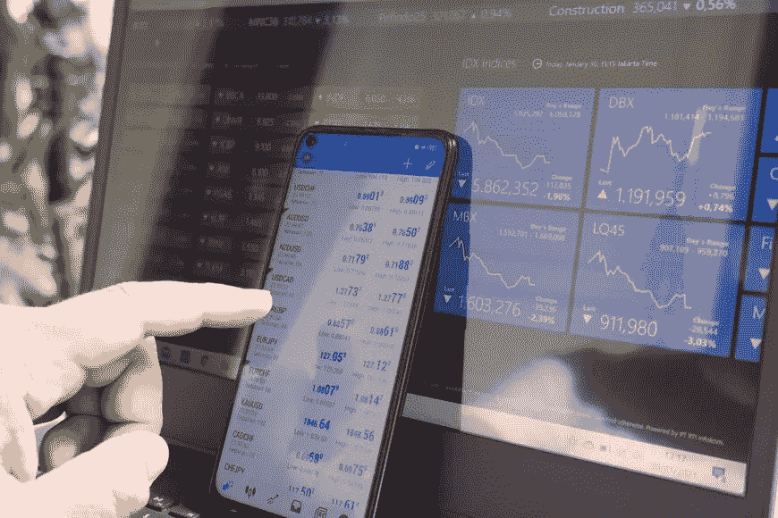

# 外汇日交易:初学者必备

> 原文：<https://medium.com/coinmonks/forex-day-trading-essentials-for-beginners-5e31333425a9?source=collection_archive---------35----------------------->

由于最近加密货币、NFT 和元宇宙的蓬勃发展，比以往任何时候都有更多的新爱好者开始交易。不仅是加密市场，其他金融市场也从这场运动中受益，比如外汇市场。

不用离开舒适的房子，每天通勤上班，就能在金融市场上赚快钱，这种诱惑让许多新投资者幻想通过日间交易谋生。随着现代信息技术的惊人进步，交易者可以使用交易软件，现在成为日内交易者比以往任何时候都容易。

但是，对于新手来说，开始从外汇市场获得稳定的交易收入真的那么容易吗？让我们来了解一下！

*Modern-day technologies allow day traders to make trade easily with their smartphones.*

# 什么是外汇日交易？

**外汇日内交易**基本上是外汇交易和日内交易的结合，指的是利用短期策略在外汇市场上进行日内交易以获利的行为。让我们更深入地了解每个概念的定义。

# 什么是外汇交易？

外汇，简称 forex，指的是在一个买方和卖方的网络内转移货币或出于各种原因(包括旅游、商业或贸易)将一种货币兑换成另一种货币的过程。

尽管出于许多不同的原因，外汇交易在多个其他行业广泛开展，但其最重要的部分仍然是为了一个最终目的:从交易中获利。凭借 2019 年创下的 6.6 万亿美元的****日交易量**，外汇市场无疑是世界上最大的金融市场，甚至超过了股票市场。**

# **什么是日内交易？**

**[日内交易](/@libraryoftrader/what-do-novice-day-traders-need-to-know-about-38e2b7bad3a9)是交易界常见的赚钱方法和策略，指的是在同一个营业日买卖某些金融资产的过程，从而产生小额但持续的利润流。**

** [## 新手日内交易者需要了解什么？

### 日内交易因其快速盈利而引人入胜。然而，它也包括高风险暴露于不稳定的…

medium.com](/@libraryoftrader/what-do-novice-day-traders-need-to-know-about-38e2b7bad3a9) 

通常被认为是对新手最友好的交易方法，日内交易确实提供了很大的好处:小利润累积成巨大的回报，同时舒适地躺在你的背上，享受独立，并从你的决定中获得收益。

# 什么使外汇日交易有吸引力？

外汇市场通常会对世界各地的突发新闻做出强烈反应，这使得一些货币的价格波动很大。尽管潜在的风险，它的敏感性和高波动性对日内交易者有着不可抗拒的吸引力。

 [## 日内交易压力很大，但为什么还有人爱它？

### 日内交易是一种靠运气的游戏，但真的是这样吗？每天都有许多交易者通过日内交易为他们的生活带来财富。还有…

medium.com](/@libraryoftrader/day-trading-is-stressful-but-why-do-people-still-love-it-41ab2ef4411e) 

与股票或商品市场等金融市场不同，外汇交易是以场外交易(OTC)的方式在双方之间直接进行的，而不是在现实生活中的实物交易所进行的，并且由于没有中心位置，外汇交易可以一天 24 小时进行。外汇市场由位于不同时区的四个主要外汇交易中心的全球银行网络管理:伦敦、纽约、悉尼和东京——外汇日交易的最佳时间**取决于您想要的时区和地点。**

由于日内交易者肯定会在收盘前平仓，他们不会面临持仓过夜的风险。

 [## 摇摆交易与日内交易:区别在哪里？

### 摇摆交易和日交易都是创造短期利润的好方法。然而，他们不是…

medium.com](/@libraryoftrader/swing-trading-vs-day-trading-what-is-the-difference-1f411f27da81) 

外汇市场被认为是对初学者最友好的市场，由于其低成本、低资本要求和高流动性，交易者很容易进入。交易员可以在不对价格产生显著影响的情况下开始交易，并执行交易，因为即使在大量订单的情况下，交易也很容易完成，同时消除了大牌公司操纵价格的任何重大可能性。

# 为日内交易选择正确的对

说到**外汇日交易**，确实有一些[对一枝独秀](https://www.investopedia.com/ask/answers/06/maincurrencypairs.asp)。然而，要了解并决定投资哪些股票，仅仅根据价差的大小进行观察是不切实际的。

为了最大限度地利用高波动性来获利，外汇日交易者必须积极跟踪市场状态以及世界各地的时事，以便及时发现潜在的机会。以下是一些具有高波动性的“奇异”外汇对，被认为是**日内交易的最佳外汇对**，它们不是常见的稳定外汇对，供您参考:

*   澳元/日元(平均波动率—1.12%)；
*   澳元/美元(平均波动率—1.07%)；
*   欧元/澳元(平均波动率—1.07%)；
*   新西兰元/日元(平均波动率—1.05%)；
*   英镑/澳元(平均波动率—1.05%)；
*   英镑/新西兰元(平均波动率— 1.05%)。

资料来源:justforex.com

*Pairs with high volatility are always preferred by day traders.*

# 选择正确的日内交易策略

**外汇日交易**策略可以是技术性的，也可以是非技术性的。强烈建议交易者在应用以下策略应对不断变化的市场条件时保持适应性:

# 趋势交易

作为日内交易者，你一生中一定至少听过一次这句话:“趋势是你的朋友”。这些策略在新手交易者中很受欢迎，当你试图加入并寻找隐藏在当前市场趋势中的交易机会时，这些策略包含了一种直接的方法。

当你发现趋势时，剩下的就很容易了:预测一个积极的趋势进入你的交易，并有足够的纪律平仓以确保利润。

# 新闻交易

热点和有影响力的新闻是你日内交易者最好的朋友，如果你在事件发生时继续交易，可以让你获得可观的利润。

在现代，由于信息技术的进步发展，不难找到许多私人的和专门的职业交易者社区，他们可以为你提供交易服务和潜在盈利交易的信号，并收取可观的佣金。执行还是不执行？剩下的就完全取决于你了。

# 社交交易

社会交易是一种策略，投资者观察他们的同行和专家交易者的交易行为。主要目标是通过复制交易或镜像交易来复制他们的投资策略。

# 逆势交易

有点类似于趋势交易策略，逆趋势交易策略包括发现趋势可能结束的过程以及运动的变化，从而利用价格波动。

因此，这种策略需要对模式的洞察力，多年的经验，以及利用技术分析进行高概率预测的能力。想要尝试这种策略的经验丰富的外汇日交易者通常利用模拟账户作为他们的交易模拟器，他们可以在不干扰实际账户的情况下建立和实践这种策略。

# 做外汇日交易时要避免的错误

任何成就都来之不易。做**外汇日交易**时你肯定会犯错。然后，只有不放弃地向他们学习，才能让你的交易更上一层楼，离你梦想的利润更近一步。查看进行**外汇日交易**时最常见的错误:

*   跟不上新闻:每天赚取惊人的**外汇交易利润**的秘密完全在于你接收和处理对市场有影响的突发新闻的速度。如果你没有掌握最新的信息和数据，即使是最简单的决定也很难做出。
*   没有花足够的时间来监控你的交易:一些新交易者只是试图顺应趋势，但当他们第一次进入市场希望赚钱时，他们的头寸没有被观察到。这种行为将使你的交易暴露在无数的风险中，并使你没有足够的信息来执行你的交易。
*   不够自律:当你抓住上涨趋势时，尽早放弃并为你的交易止损是相对容易的。这可以被认为是一种保证回报的安全方式。然而，这个过程完全消除了你的头寸能产生多少收益的可能性，只是表明你显然没有策略来充分利用这种情况。
*   还有一项艰难的日常工作:做日内交易者意味着在那里，根据市场的波动进行交易。虽然除了交易之外，兼职听起来是一种明显的赚钱方式，但它实际上是有害的，因为你没有足够的时间让自己了解最新消息，监控你的交易现状，更不用说做进一步的技术分析了。做日内交易者应该是你的全职工作。

# 结论

从**外汇日交易**中赚钱确实不是一条容易的路。当你选择投资的金融市场时，外汇市场有自己的优点、缺点和特征供你考虑，选择正确的对和[正确的时间框架](https://libraryoftrader.net/product/forex-trading-sessions)，以及正确的策略。

只有了解所有的基本原理和要点，你才能做出正确的决定，才不会被铺天盖地的市场信息淹没。这并不意味着你使用复杂的技术策略，甚至是外汇日交易的**最佳指标**，你比任何不这样做的人更有可能成功。记住，专注于你的日内交易目标:一步一步地盈利，你一定会有所成就。

> *交易新手？试试* [*加密交易机器人*](/coinmonks/crypto-trading-bot-c2ffce8acb2a) *或* [*复制交易*](/coinmonks/top-10-crypto-copy-trading-platforms-for-beginners-d0c37c7d698c) *上* [*最好的加密交易*](/coinmonks/crypto-exchange-dd2f9d6f3769)

> 加入 Coinmonks [电报频道](https://t.me/coincodecap)和 [Youtube 频道](https://www.youtube.com/c/coinmonks/videos)获取每日[加密新闻](http://coincodecap.com/)

# 另外，阅读

*   [免费加密信号](/coinmonks/free-crypto-signals-48b25e61a8da) | [加密交易机器人](/coinmonks/crypto-trading-bot-c2ffce8acb2a)
*   [杠杆代币的终极指南](/coinmonks/leveraged-token-3f5257808b22)
*   [16 款最佳折叠电动自行车](/coinmonks/top-17-folding-electric-bikes-5e296f0918cb)
*   [28 款最佳电动自行车点评](/coinmonks/the-28-best-electric-bikes-review-and-buying-guide-in-2023-7bb3146cb403)
*   前三名[币安期货交易机器人](/coinmonks/top-3-binance-futures-trading-bots-e6031f84b3f9)**