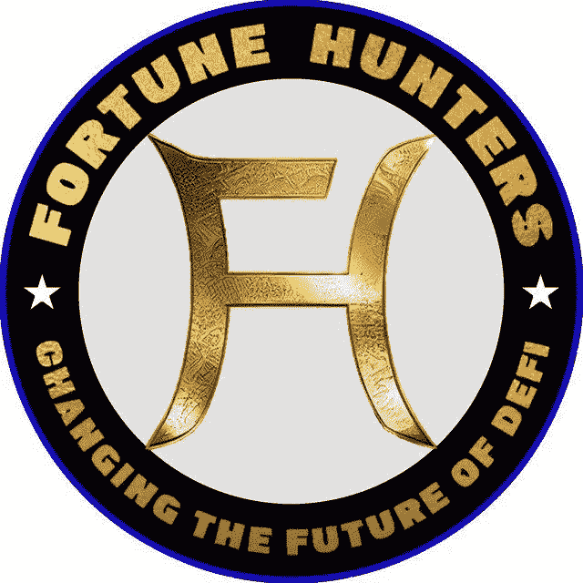
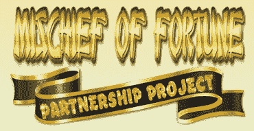
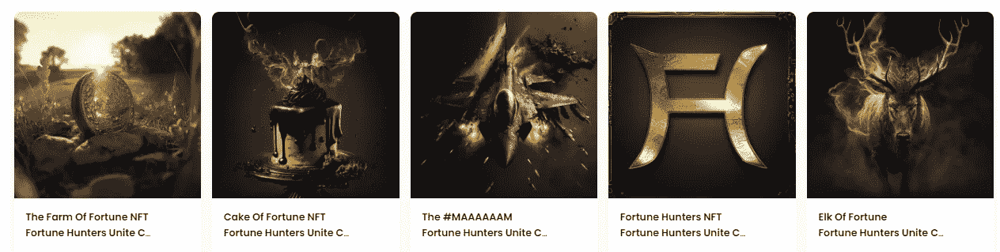

# 财富猎人——前方重大新闻！

> 原文：<https://medium.com/coinmonks/fortune-hunters-major-news-ahead-66c5b3160ee9?source=collection_archive---------6----------------------->

你好，我叫尼尔森，和我一起看看财富猎人们将会带来什么…

如果你还不知道财富猎人，请阅读我以前关于财富猎人生态系统的文章。
[FH 生态篇](/@Nelson_Crypto_Journey/list/fortune-huntes-ecosystem-ba538a789f96)

***新闻？***
**合作关系**
FH Eco 已经加入了 Richie 恶作剧的合作伙伴关系，旨在在 2023 年和接下来的几年里建立和发展一个巨大的生态系统，有望改变目前的 DeFi 形态。贝娄，我留给你两个视频的合作伙伴关系，必须观看。

USDC FARM

这次合作的第一个项目将是 USDC 农场… USDC 的 USDC…谁不喜欢稳定的项目呢？尤其是在当前的市场状况下，但我们稍后会深入探讨这个问题…

> 从顶级交易者那里复制交易机器人。免费试用。

**FH 生态令牌。**
FH 会自带令牌。关于它的细节还很少，但它将是生态系统的核心，仅此一点就足以引起你的注意。
令牌发布的目标是在 2023 年 1 月之后。

FH NFT collection

FH 生态 NFT 系列
FH 团队带来了生态 NFT。
收集了 5 个设计精美的非功能性标签，它们将与令牌一起作为所有 FH Eco 的核心。
**价格:**每笔 100 美元
**所有募集资金的 75%** 将用于产生利息的资金池，NFT 持有者每月将分配红利。
**提前使用:**从一月份的代币预售开始，NFT 持有者将可以提前使用 FH Eco 中的新层。
治理:FH Eco 是一个社区驱动的 Eco，NFT 持有者将拥有投票权，以帮助塑造生态系统的未来。
每个 NFT 的 5%将用作开发费，但是，这 5%将用于为社区产生利益的池中，并帮助维持之前的项目，直到 2023 年 4 月。没错，该团队在 2023 年 4 月之前不会从这 5%中获得任何东西。

最重要的…
**它们将于今天，12 月 11 日 19:30 UTC** 开始发售。
[财富猎人-生态系统-简介| OpenSea](https://opensea.io/Fortune-Hunters-Eco-System?tab=created)

加入 [*FH 生态 TG*](https://t.me/FortuneHunters_Eco_System) 的 FH 社区，了解这个即将到来的惊人生态系统的更多信息…

**有用链接**:
[*FH Eco TG*](https://t.me/FortuneHunters_Eco_System)[*Crypto 恶作剧聊天*](https://t.me/cryptomischief2)[*NFT 特卖页面*](https://opensea.io/Fortune-Hunters-Eco-System?tab=created)[*FH 主页*](https://app.gitbook.com/o/D5n2gJlGD0TlCEikB47c/s/rDP3oX3sXhk2dFlrH4r2/our-projects/fh-eco-nft-collection)*[*克雷格关于合伙关系的视频*](https://www.youtube.com/watch?v=S4apAUFZwpE)*

*如果你喜欢我的文章，请考虑一些掌声，因为它有助于达到更多的人，如果你想知道更多关于我的加密之旅考虑订阅。*

**本文无意构成投资建议。作者和出版物均不对您可能因这些信息而招致的任何投资、利润或损失承担任何责任或义务。我们鼓励读者在做出任何和所有投资决定之前，进行尽职调查和研究，或咨询持牌金融顾问或经纪人。此内容仅用于一般信息和教育目的。尽管作者力求准确，但文章中的数据并不可靠。作者可能拥有文中讨论的加密货币和代币。文章可能包含附属链接。**

> *加入 Coinmonks [电报频道](https://t.me/coincodecap)和 [Youtube 频道](https://www.youtube.com/c/coinmonks/videos)了解加密交易和投资*

# *另外，阅读*

*   *[如何在 Uniswap 上交换加密？](https://coincodecap.com/swap-crypto-on-uniswap) | [A-Ads 评论](https://coincodecap.com/a-ads-review)*
*   *[加密货币储蓄账户](/coinmonks/cryptocurrency-savings-accounts-be3bc0feffbf) | [YoBit 评论](/coinmonks/yobit-review-175464162c62)*
*   *[Botsfolio vs nap bots vs Mudrex](/coinmonks/botsfolio-vs-napbots-vs-mudrex-c81344970c02)|[gate . io 交流回顾](/coinmonks/gate-io-exchange-review-61bf87b7078f)*
*   *[CoinFLEX 评论](https://coincodecap.com/coinflex-review) | [AEX 交易所评论](https://coincodecap.com/aex-exchange-review) | [UPbit 评论](https://coincodecap.com/upbit-review)*
*   *[AscendEx 保证金交易](https://coincodecap.com/ascendex-margin-trading) | [Bitfinex 赌注](https://coincodecap.com/bitfinex-staking) | [bitFlyer 审核](https://coincodecap.com/bitflyer-review)*